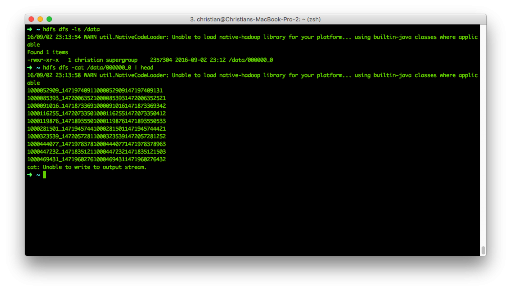
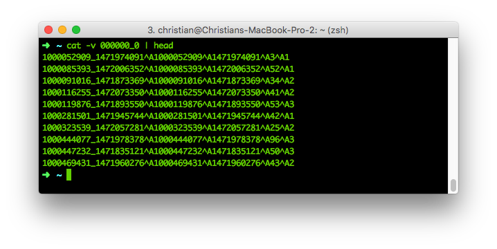
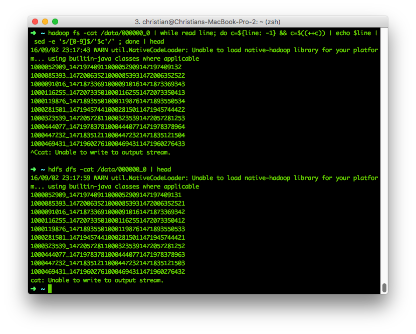

## Introduction

_This article explains how to edit a structured number of records in HBase by combining Hive on M/R2 and sed - and how to do it properly with Hive._

**HBase** is an impressive piece of software - massively scalable, super-fast and built upon Google's BigTable... and if anyone knows "How To Big Data", it ought to be these guys.

But whether you are new to HBase or just never felt the need, working with it's internals tends not to be the most trivial task. The HBase shell is only slightly better in terms of usability than the infamous zkcli (Zookeeper Command Line Interface) and once it comes to **editing records**, you'll wind up with tedious, long and complex statements before you revert to using it's (Java) API to fulfill your needs - if the mighty Kerberos doesn't stop you before.

But what if... there were a way that is both stupid and functional? What if it could be done without a programmer? Ladies and gentlemen, meet **sed**.

> **sed** (_stream editor_) is a [Unix](https://en.wikipedia.org/wiki/Unix "Unix") utility that parses and transforms text, using a simple, compact programming language.
> 
> https://en.wikipedia.org/wiki/Sed

## The scenario

Let's say you have a table with customer records on HBase, logging all user's interactions on your platform (your online store, your bookkeeping, basically anything that can collect metrics):

| key             | cf:user | cf:action | cf:ts      | cf:client |
|-----------------|---------|-----------|------------|-----------|
| 142_1472676242  | 142     | 34        | 1472676242 | 1         |
| 999_ 1472683262 | 999     | 1         | 1472683262 | 2         |

Where: _cf:user_ is the user's id, _cf:action_ maps to a page on your system (say 1 quals login, 34 equals a specific screen), _cf:ts_ is the interaction's timestamp and _cf:client_ is the client, say 1 for OS X, 2 for Windows, 3 for Linux.

Let's ignore the redundancy in timestamp and user or the usability of the key - let's stick to simple design for this.

One of your engineers (surely not you!) f@#!ed up and your mapping for _cf:client_ - between 2016-08-22 and 2016-08-24, every record indicating "client" is one off! 1 is now 0 (making me using an NaN OS) and 2 is now 1 and maps to OS X, 2 to Windows - and suddenly, Linux is of the charts. But don't panic - Hive to the rescue!

## Set the stage

Here's what we'll use:

- [Hadoop](http://hadoop.apache.org/releases.html) 2.6.0 (HDFS + YARN)
- [HBase](http://www.apache.org/dyn/closer.cgi/hbase/) 1.2.2
- [Hive](https://hive.apache.org/downloads.html) 2.1.0
- A custom create script for the data
- OS X 10.11.6

And here's what we're going to do: First, we'll create our HBase table.


hbase shell
create 'action', 'cf', {NUMREGIONS => 15, SPLITALGO => 'HexStringSplit'}


Bam, good to go! The table's empty - but we'll get to that in a second.

In order to do anything with our view, we need data. I've written a small Spark app that you can get [here](https://github.com/chollinger93/sparkdatagenerator) and run as such:


git clone ...
mvn clean install
cd target
spark-submit \
--class com.otterinasuit.spark.datagenerator.Main \
--master localhost:9000 \
--deploy-mode client \
CreateTestHBaseRecords-1.0-SNAPSHOT.jar \
2000000 \ # number of records
4 # threads


Let's run it with a charming 2,000,000 records and see where that goes. On my mid-2014 MacBook Pro with i5 and 8GB of Ram, the job ran for 9.8 minutes. Might want to speed that up with a cluster of choice!

If you want to check the results, you can use good ol' mapreduce:


hbase org.apache.hadoop.hbase.mapreduce.RowCounter 'action'


Alternatively:


hbase shell count 'action', INTERVAL=>100000


Granted, you would not have needed Spark for this, but Spark is awesome! Also, it's overhead in relation to it's performance benefits beats shell- or python scripts doing the same job in many daily use cases (surely not running on a tiny laptop, but that's not the point). I was forced to use some semi-smart approaches (Spark mllib for Random data and changing the type with a map()-function might be one) - but hey, it works!

Next, an external Hive view - the baseline for all our Hive interactions with HBase.


CREATE DATABASE IF NOT EXISTS test;
CREATE EXTERNAL TABLE test.action(
key string
, userf int
, action int
, ts bigint
, client int
)
STORED BY 'org.apache.hadoop.hive.hbase.HBaseStorageHandler'
WITH SERDEPROPERTIES (
"hbase.columns.mapping" = "
:key
, cf:user#b
, cf:action#b
, cf:ts#b
, cf:client#b
"
)
TBLPROPERTIES("hbase.table.name" = "action");


Unless you are trying to abuse it (like we're about to do!), Hive is a really awesome tool. Its HQL, SQL-like query language comes really natural to most developers and it can be used in a big variety of sources and for an even bigger variety of use cases. Hive is, however, a tool that operates on top of MapReduce2 by default and with that, it comes with a notable performance overhead. So do yourself a favor and have a look at [Impala](http://www.cloudera.com/products/apache-hadoop/impala.html), [Tez](http://tez.apache.org) and [Drill](http://drill.apache.org) or running Hive on Spark. But let's abuse Hive with M/R2 a bit more first.

## Hive magic

We now have an HBase table, a Hive external table and data. Let's translate our problem from before to HQL. In the statement, 1471824000 equals 2016-08-22 (midnight), 1472083199 is 2016-08-24 (23:59:59).


UPDATE test.action SET client = client+1 WHERE ts >= 1471824000 AND ts <= 1472083199;


But what's that?


FAILED: SemanticException [Error 10294]: Attempt to do update or delete using transaction manager that does not support these operations.


The reason why this doesn't work is simple:

> If a table is to be used in ACID writes (insert, update, delete) then the table property "transactional" must be set on that table, starting with Hive 0.14.0. Without this value, inserts will be done in the old style; updates and deletes will be prohibited.
> 
> https://cwiki.apache.org/confluence/display/Hive/Hive+Transactions

Apart from setting a table property, we will also need to edit the Hive configuration and change the default values for _hive.support.concurrency_ to _true_ and _hive.exec.dynamic.partition.mode_ to _nonstrict_. That's not only something that would usually involve several people (not good for our unlucky engineer), it also requires you to have the table in [ORC](https://cwiki.apache.org/confluence/display/Hive/LanguageManual+ORC) format - not for us.

But one thing Hive can also do is to create **managed tables**. A managed table (instead of an external table like we created above), the table is more comparable to a traditional RDBMS table, as it will be actually managed by Hive as opposed to be just a layer atop of an HBase table. By defining _STORED AS TEXTFILE_, Hive manages the data with a set of textfiles on HDFS.


CREATE TABLE IF NOT EXISTS test.action_hdfs(
`key` string,
`userf` int,
`action` int,
`ts` bigint,
`client` int
)
ROW FORMAT DELIMITED
STORED AS TEXTFILE
LOCATION '/data';
 
SELECT COUNT(*) FROM test.action_hdfs;


The result will be 0:

So that needs content - let's re-use the statement from above:


INSERT OVERWRITE DIRECTORY '/data' SELECT key,userf,ts,action,client FROM test.action WHERE ts >= 1471824000 AND ts <= 1472083199;


This runs a query on our initial, external table and stores the result into HDFS. It tells you not to use M/R2 anymore.

And since it now boils down to a simple text file on HDFS, we can simply read and update its contents using table #2! So, let's see what's in the file:


hdfs dfs -ls /data
hdfs dfs -cat /data/000000_0 | head


 That doesn't look terribly convincing, but the reason is simple - Hive uses the ^A (\\x01) character as delimiter by default. We can even prove that:


hdfs dfs -copyToLocal /data/000000_0
hexdump -C 000000_0 | head


 For those of you who are still afraid of HexDumps: After the length of each field, the next character is an an 0x01. Or, in other words: Every byte in a line after the last 0x01 byte will be our client variable. Or, just use cat -v:

Seems like a random sequence of numbers, but is actually a cheaply stored separated file. An ^Asv, if you will.

Let's finally use all that knowledge and do what we came here to do: Increment our client setting! This is the command we're going to use for our data manipulation dry run:


hadoop fs -cat /data/000000_0 | while read line; do c=${line: -1} && c=$((++c)) | echo $line | sed -e 's/[0-9]$/'$c'/' ; done | head
hdfs dfs -cat /data/000000_0 | head


Let's breake that down: _hadoop fs -cat /data/000000\_0_ will pipe our HDFS file to stdout _while read line; do_ will start a loop for every line _c=${line: -1}_ will take the line's last character (our client!) as variable $c _c=$((++c))_ will increment said number _echo $line_ sends it to stdout where _sed_ is waiting _sed -e 's/\[0-9\]$/'$c'/'_ replaces every number (\[0-9\]$) at the end of a string (\[0-9\]$) with the newly-incremented variable $c.  And there you have it! Note the last number increased by one.

By the way: sed does not support Negative Lookaheads in regex. Learned that one the hard way.

If we now want to move that data back to hadoop, all we need to do is pipe to HDFS instead of stdout:


hadoop fs -cat /data/000000_0 | while read line; do c=${line: -1} && c=$((++c)) | echo $line | sed -e 's/[0-9]$/'$c'/' ; done | hadoop fs -put - /data/000000_2
hdfs dfs -cat /data/000000_2 | head


In order to get that data back in our original HBase table, load up hive again: 


LOAD DATA INPATH '/data/000000_2' INTO TABLE test.action_hdfs;
SELECT client, COUNT(*) FROM test.action GROUP BY client;


| Client | Count |
|---|--------|
| 0 | 16387  |
| 1 | 666258 |
| 2 | 665843 |
| 3 | 651512 |

16,387 invalid records that are immediately spottable as well as those hiding in client 1 and 2 - damn!


INSERT OVERWRITE TABLE test.action SELECT key,userf,action,ts,client FROM test.action_hdfs;
SELECT client, COUNT(*) FROM test.action GROUP BY client;


| Client | Count  |
|--------|--------|
| 1      | 666293 |
| 2      | 665948 |
| 3      | 667759 |

As 0 used to be an undefined state and the result is now 0 and used to be 16,387, we seem to have fixed our mistake. You can further validate this with a full COUNT(\*) or by calculating the differences between the client-values.

## Why you should not do this

Let's breake down what we had to do: - Create two Hive tables - Export our data to HDFS (where, technically speaking, it already resides) - Learn how to interpret an Hive HDFS datafile - Write and execute some crazy sed-regex-monstrosity - Do all of that manipulation on a single machine, using stdout and hence memory - Do all that without ACID or any form of transactional security

Also, we simply ignored all the ideas, frameworks and algorithms behind efficient Big Data - its like managing all your financials in Macro-loaded Excel files. It works, but it is inefficient, complicated, unsecure and slow.

## The right way

Let's see how to do it properly. 

CREATE TABLE test.action_buffer 
AS
SELECT key,
userf,
action,
ts,
client + 1 AS client
FROM test.action
WHERE ts >= 1471824000 AND ts <= 1472083199;
SELECT client, COUNT(*) FROM test.action_buffer GROUP BY client;


That gives us:

| Client | Count |
|--------|-------|
| 1      | 16387 |
| 2      | 16352 |
| 3      | 16247 |


INSERT OVERWRITE TABLE test.action SELECT key,userf,action,ts,client FROM test.action_buffer;
SELECT client, COUNT(*) FROM test.action_buffer GROUP BY client;


| Client | Count  |
|--------|--------|
| 1      | 666293 |
| 2      | 665948 |
| 3      | 667759 |

The idea here is quickly explained: Instead of updating a record, i.e. trying to modify HBase columns directly, our current Hive query is comparable with a simple put() operation on HBase. While we will overwrite the entire record, there is no downside to it - the keys and other information stays identical. There you have it - the same result (no client = 0), much faster, much easier and executed on your distributed computing engine of choice!
