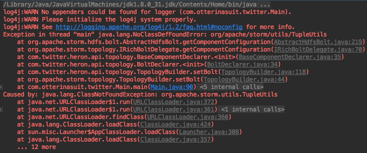
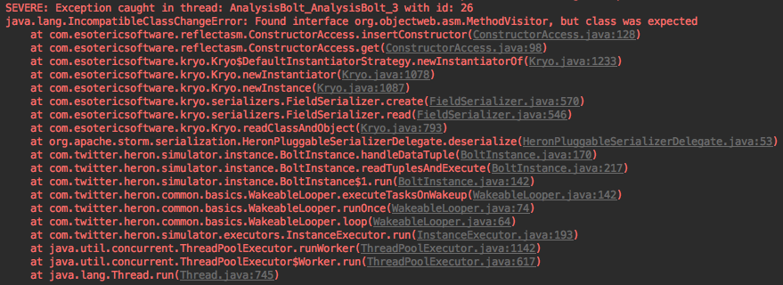
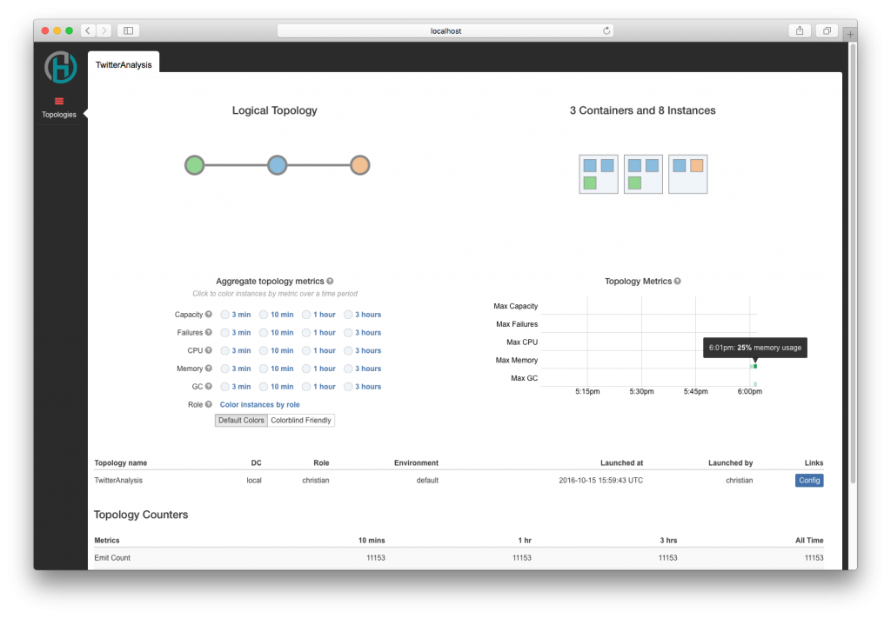

## Introduction

_This article is part 1 of an upcoming article series, **Storm vs. Heron**._

When upgrading your existing Apache Storm topologies to be compatible with Twitter's newest distributed stream processing engine, Heron, you can just follow the [instructions](http://twitter.github.io/heron/docs/upgrade-storm-to-heron/) over at Heron's page, as Heron aims to be fully compatible with existing Storm topologies. But is it really that simple? I've tried that, using my very much real topology and was not overly surprised by the result.

## Setup

So, here's my setup:

- [Hadoop](http://hadoop.apache.org/releases.html) 2.7.3 (HDFS + YARN)
- Apache Storm 1.0.2
- Twitter Heron 0.14.3
- MacOS Sierra 10.2

All my dependencies come from using


brew install


## Topology

First off, the topology I'm using is my Twitter Analysis topology that reads in tweets (filtered by keywords, using [twitter4j](http://twitter4j.org/en/)), runs a couple of analysis queries on these (based on a prototypical word list from pre-defined reference accounts, basically sh\*tty, supervised machine learning for non Data Scientists) and persists them into HDFS, using the [storm-hdfs](https://github.com/apache/storm/tree/master/external/storm-hdfs) library.

I'll come to the details in a later article; for know, all we need to know is that we use the most recent, stable versions of Storm and an external library that does what Storm does best, stream analysis and simple storage.

## The process

What Twitter recommends is simple: Install Heron, remove the following dependency


<dependency>
  <groupId>org.apache.storm</groupId>
  <artifactId>storm-core</artifactId>
  <version>storm-VERSION</version>
  <scope>${scope.provided}</scope>
</dependency>


from your Maven pom.xml and replace it with Heron's dependencies. Sounds too amazing to be true, considering that updating from Storm 0.x to 1.x required us to do actual code changes! Not to mention the way easier deployment, configuration and under-the-hood changes Heron comes with. But unfortunately, not everything went as smoothly as planned...

## Issues

### storm-hdfs

As of right now, Heron seems not to be compatible with storm-hdfs (albeit stating otherwise on the project's GitHub in the past), judging by this error:

 java.lang.NoClassDefFoundError: org/apache/storm/utils/TupleUtils

You have a couple of options for this, I guess. Heron seems to be not able to work with pre-compiled classes containing Storm-objects, so your best shot would be to grab the library and integrate it in your project as regular classes and packages.

The other option is re-writing the library. While that seems like an expensive endeavour, it may prove useful if you require more control or flexibility anyways. As I did this in the past with the storm-hbase library for those exact reasons, I'm pretty sure that this is far from a viable option for everyone, but surely it will work for some.

Considering the sheer amount of external libraries for Storm (kafka, hdfs, hbase, mqtt, hive, jms, redis ...), this could turn out to be a real problem, though. So, if you know of a smarter alternative, let me know!

**Update:** Thanks to the Heron team over at [Twitter](https://twitter.com/heronstreaming/status/788102438188265472?cn=cmVwbHk%3D&refsrc=email), the external systems for Heron are work in progress!

### twitter4j

Also, twitter4j did me not leave exactly happy. Whilst my simple spout worked, it was not able to emit the twitter4j Status interface, representing a tweet, as it was usually coming in in the form of a twitter4j.StatusJSONImpl.class, not visible from outside the twitter4j package. As Heron uses kryo for this, I was **not** able to register it with the Heron configuration:


conf.registerSerialization(twitter4j.StatusJSONImpl.class);


The solution to this was fairly simple, after the Reflections library failed me as well: I used a custom wrapper object, emulating the Status interface and hence remaining compatible with the rest of my code. Not pretty, but works - and required me to touch code after all. Remember to register these classes as well!

### The asm library

That one was tricky - after fixing the previous errors, I was left with this:

 IncompatibleClassChangeError: Found interface org.objectweb.asm.MethodVisitor, but class was expected\

As it turns out, the method call you see there used to be a interface call in asm 3.x, but was switched to a class in 4.x+. Adding this to my pom.xml fixed that one as well:


<dependency>
  <groupId>org.ow2.asm</groupId>
  <artifactId>asm</artifactId>
  <version>4.0</version>
</dependency>


## Conclusion

Heron surely is awesome when we compare it to Storm - at least in theory. While the idea of literally re-using your entire source with a new, better technology seems thrilling, reality looked a bit less exiting. Anyways, after a couple of hours debugging and using fixes that maybe could be done a bit less brutally, it is now running beautifully on my local machine. Time to test it on a cluster!

 Heron UI

*Disclaimer*

Heron is in development and things change quickly. These issues might not be true for your setup and there might be a perfectly viable solution to all of this - but I wasn't able to find it and hence decided to document my experiences here.
