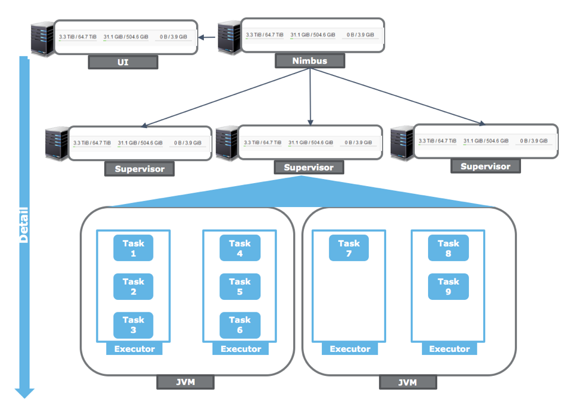
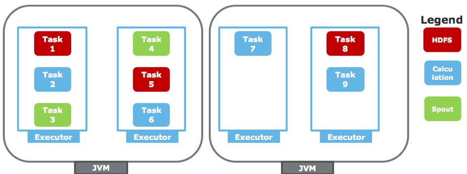
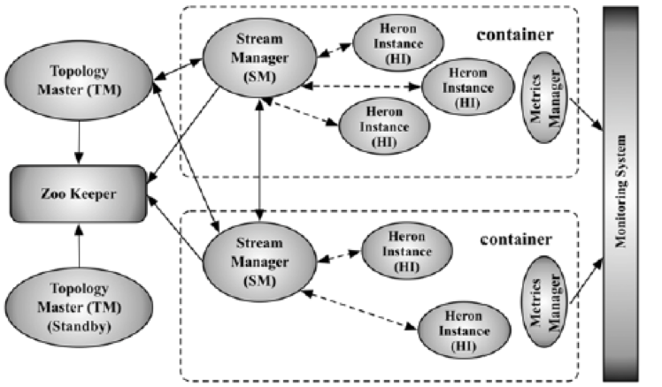
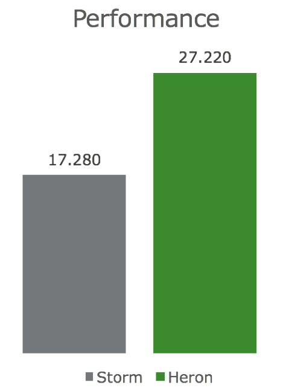

## Introduction

_This article is part 2 of an upcoming article series, **Storm vs. Heron**._

In the [last part](https://chollinger93.com/blog/?p=50) of the series, we looked at how to transform your existing Storm topologies to Twitter’s new distributed streaming- and analytics-framework, Heron. In this part of the series, we will actually see why you would want to do this. This part will see Storm from a developer’s view, whereas the next part will focus on operations & maintenance.

## Why Storm leaves stuff to be desired

First off, let me start with stating that Apache Storm surely is great and flexible framework, but often doesn’t quite satisfy all the requirements an enterprise-ready Big Data component should fulfil. Its weaknesses show in both architecture and the way an enterprise can handle Storm development, testing, deployment and maintenance.

The things one could objectively criticize about Storm boil down to the following points:

- Unified resource assumption & performance (Developers)
- Insufficient resilience features (Developers)
- Insufficient debugging abilities (Operations)
- Insufficient monitoring abilities (Operations)

Naturally, these all depend on your businesses’ specific requirements for the use cases you want to build – but generally speaking, these points should affect the majority of users.

_Some points might be simplified for the sake of accessibility to the topic._

## Unified resource assumption & performance

First, let’s have a look at how Storm structures its minions:

 Storm worker architecture

The top-level hierarchy consists of one (< Storm 1.x) or multiple, high-available (>= Storm 1.x) so-called Nimbus servers which coordinate your topologies. These Nimbus servers communicate with your second level, the supervisor nodes executing your code. An optional UI node as well as an optional log viewer process can be deployed as well.

Every supervisor runs multiple JVMs (in so-called workers), which then again execute your actual code fragments in their respective executors. And here’s the actual big first issue with this design – you have absolutely no ability to properly control your resource usage. In your respective topologies, you can freely set different numbers of executor processes for your bolts and spouts, but have no ability to control where your process will end up1. It is possible that a long-running, complex part of your topology shares a JVM with a simple calculation component. It becomes almost impossible to isolate- and profile these tasks separately (I actually once wound up writing a rather complex parser written in R, iterating over JVM-dumps, logs etc. for that task).

Also, if one of the more complex bolts crashes (e.g. an uncaught exception), it takes down completely unrelated tasks with it!

 Storm JVM architecture

Furthermore, all JVMs have a fixed memory setting – depending on the most RAM-intensive component currently running. The resources this JVM holds are not linked with any other Hadoop scheduling component, such as YARN or Mesos, making it almost impossible to use shared nodes (e.g. Storm supervisors + HDFS datanodes) if you care about resource allocation2.

In reality, this basically forces you to think about deploying entirely separate Storm clusters per topology. This may sound drastic, but makes sense if you think about it.

Imagine a topology with two main parts – a spout taking up 10GB of memory and a bolt that needs 5GB to do its job. If you now run 1 spout and 3 bolts, you will effectively need to allocate 30GB, as one of the JVMs will need at least 15GB (one spout and one bolt). This effectively wastes 5GB of memory (1\*10+3\*5=25). And yes, this is blatantly taken from [this paper](http://dl.acm.org/citation.cfm?id=2742788) (which I highly recommend reading).

Now, there’s more “under the hood” stuff that Storm isn’t exactly smart about, for instance…

- A lack of backpressure
- Overly harsh load on Zookeeper by filling it with heartbeats and states
- A lot of useless threads for sending and receiving tuples
- A lot of GC action
- Merged log files per worker

### Heron

Now, Heron is a lot smarter about basically all of this.

](http://dl.acm.org/citation.cfm?id=2742788) Heron Architecture

Heron uses **Aurora**, a framework atop of Mesos, to schedule its topologies. This solves your dilemma of Storm allocating its resources independently. YARN is also an option for existing setups.

Heron runs user code and its managers (used for coordinating the topology’s components) in a so called **container**. If you’ve ever worked with YARN / M/R2, you know the general idea.

Within these containers, **Heron Instances** run the user code in separate JVMs. With this approach, dedicated resource allocation, profiling and debugging is possible. It also enables us to have dedicated logs and access these JVMs in the UI.

A **Stream Manager** now efficiently manages the tuple communication and backpressure and a **Topology Master** communicates metadata with Zookeeper.

Metadata is kept in **Zookeeper**; not all heartbeats and transactions like in Storm.

### Performance

Naturally, this has an impact on performance as well. Heron claims to be “up to x14 faster” than Storm. And who am I do doubt them?

Well, personally, I don’t fall for marketing that aims to throw big numbers at me – performance in real-life scenarios is limited by hundreds of factors, for instance I/O implementations and limits, network throughput, API limits and so on and so forth.

But still, running my [example topology](https://github.com/chollinger93/TwitterAnalysis) from Part 1 in single node mode (i.e. locally), without Mesos, with a limited Twitter API and a horrible HDF implementation on a single AWS r3.xlarge (Intel Xeon E5-2670 4 vCores, 30GiB Ram) instance gave me **60% more throughput** – which makes me believe Twitter’s “x14” claim (for WordCount) much more.

So, if you activate Aurora, run it in an actual distributed mode and optimize the known bottlenecks (HDFS, Twitter API), I can see this thing performing much better.

And even if it doesn’t – without Heron, I would barely be able to even think about profiling my bolts, because everything is mushed into an unreadable, nasty array of JVMs.

Heron: 1. Storm: 0.

## Insufficient resilience features

Resilience is a term many enterprises love to use and can mean many things. For some businesses, it translates to “stateful processing”, in others to “stateful & exactly-once processing”. Some just refer to the architecture of the framework and cluster setup (what happens if a node breaks down or is not available?). In the end, it means that our topologies need to produce results – data – that the business can use and usually that it manages errors. And you, as an engineer, need to think about how to do that with the framework at hand.

### System failures

Storm manages some of these requirements fairly well – as long as you give it enough supervisor machines to play with. If one of these machines stops sending heartbeats via Zookeeper, it stops being available for your topologies. Storm (read: the nimbus) re-allocates the resources to the existing machines. As soon as the machine becomes available again, Storm will make it part of its supervisor network again. And if you use a Storm version >= 1.0.x, you can also remove the SPoF of the nimbus.

### Stateful processing with Trident or Storm

Stateful processing, however, is a whole different story. Usually, a tuple is stateless and its lifetime is managed by the acknowledgement mechanism you chose to implement. Let me be blunt and quote from the official documentation:

> “There's two things you have to do as a user to benefit from Storm's reliability capabilities. First, you need to tell Storm whenever you're creating a new link in the tree of tuples. Second, you need to tell Storm when you have finished processing an individual tuple. By doing both these things, Storm can detect when the tree of tuples is fully processed and can ack or fail the spout tuple appropriately. Storm's API provides a concise way of doing both of these tasks. Specifying a link in the tuple tree is called anchoring” 

[http://storm.apache.org/releases/1.0.2/Guaranteeing-message-processing.html](http://storm.apache.org/releases/1.0.2/Guaranteeing-message-processing.html)_

In other words, you rely on your queue (Kafka, JMS, Kestrel, Twitter…) for managing your resilience. If something fails – and stuff will fail eventually – you need to re-process the entire tuple-tree. Technically speaking, this process is still stateless, but more secure than just hoping your topology won’t mess something up.

To actually achieve stateful processing, i.e. storing information about the progress and status of a tuple, you have two options left: Storm’s new Stateful API or Trident. Trident offers you many great features, but is another layer atop of Storm you will need to manage and understand. See [this](http://storm.apache.org/releases/1.0.2/Trident-state.html) article from the documentation for further reference.

Storm’s [stateful API](http://storm.apache.org/releases/1.0.2/State-checkpointing.html) is pretty new and relies on a KeyValueStore and a persistence layer of your choice (currently, that would boil down to redis). If your worker crashes, Storm can than go ahead, read from said store and re-process the tuples.

All of these mechanisms require you to put quite a lot of thought into your design. If you compare this with the way SparkStreaming3 handles this – by supplying a checkpoint directory on HDFS – you quickly notice why one might be sceptical about Storm’s way of doing things.

 me\_irl

### Heron

Now, here’s the deal with Heron – while it aims to improve many things “under the hood” compared to Storm (architecture, performance, monitoring, debugging …), it still is fully compatible to Apache Storm (see [Part 1](https://chollinger93.com/blog/?p=50) of this series). While arguably this is a huge benefit for corporations using Storm right now, it does not actually impact the development model too much – in other words, resilience will be still a topic you have to think about yourself. Now, if I’m the one who missed a killer feature that Heron introduced for this, let me know!

## Conclusion

So, what can we take away from this as developers? First of all, we need to acknowledge (no pun intended) that Heron is built for using Storm code – with all its up- and downsides. While the basic programming model of Storm is fairly simple, it quickly gets complicated when we need to throw catchphrases like “states”, “WAL” or “exactly once” into the discussion.

**However**: Just executing the existing code renders many benefits. We get better performance even in extremely simplified setups, we utilize our machine’s resources much better than Storm ever could (saving $$ in the process!) and potentially save ourselves several headaches when it comes to crashing JVMs and other fun-failures you encounter on any Big Data Cluster.

In the next part, the benefits will get even more obvious – when we take a detailed look how you can actually operate, monitor and eventually debug a Storm vs. Heron cluster in production environments.

 

_Footnotes_:

1. Not entirely true per se – you can look into things like the [isolation scheduler](http://storm.apache.org/releases/1.0.1/Storm-Scheduler.html), but that is basically working around a core issue in the software’s design.
2. Storm on Yarn is possible, for instance via Hortonwork’s Big Data distribution, albeit not out of the box.
3. I don’t see SparkStreaming as a “holy grail” of frameworks. Yes, it receives more updates, yes, it seems more mature in many ways, but it is far from being an alternative for Storm/Heron/Flink/Samza for any case. But this would require me to rant in another article.
