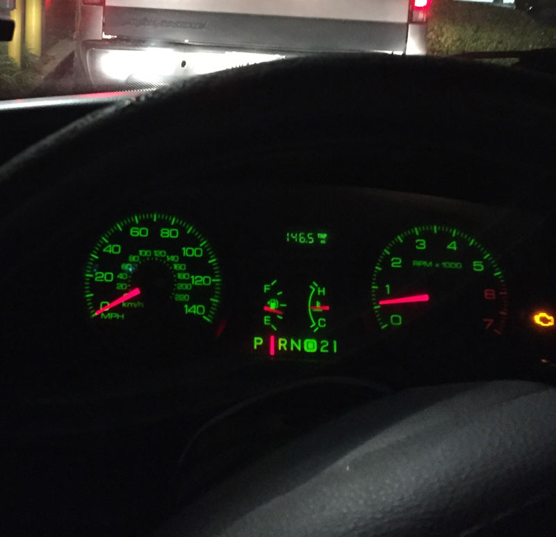
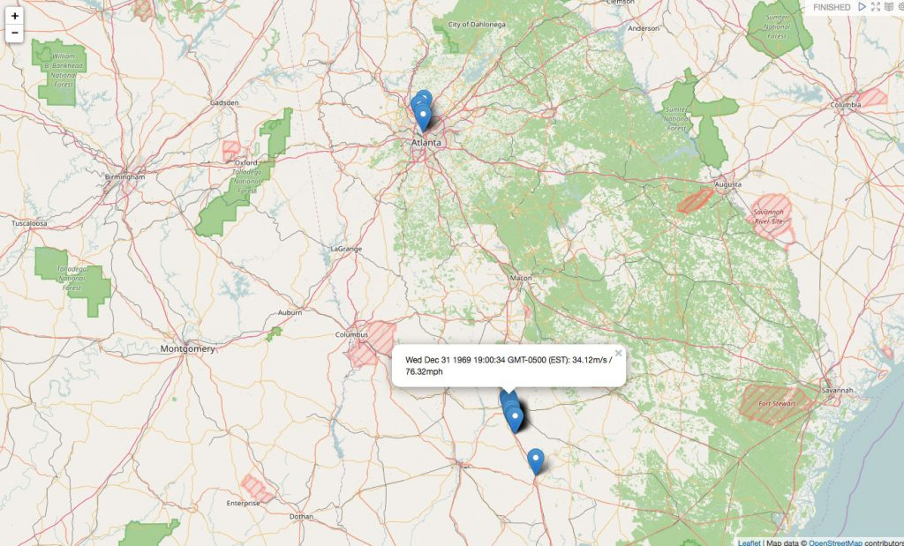
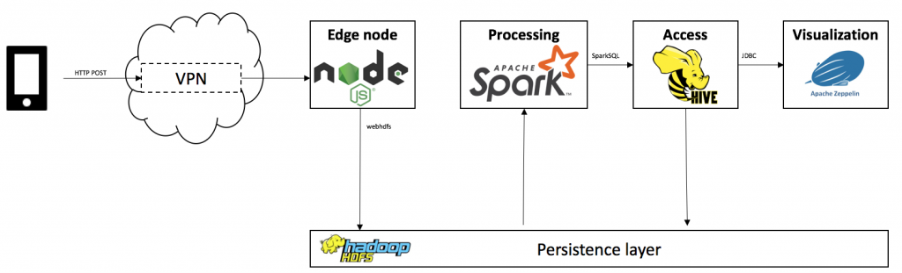
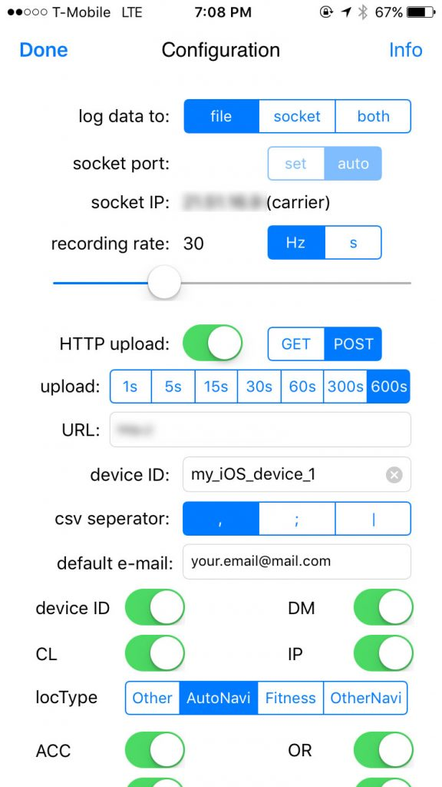
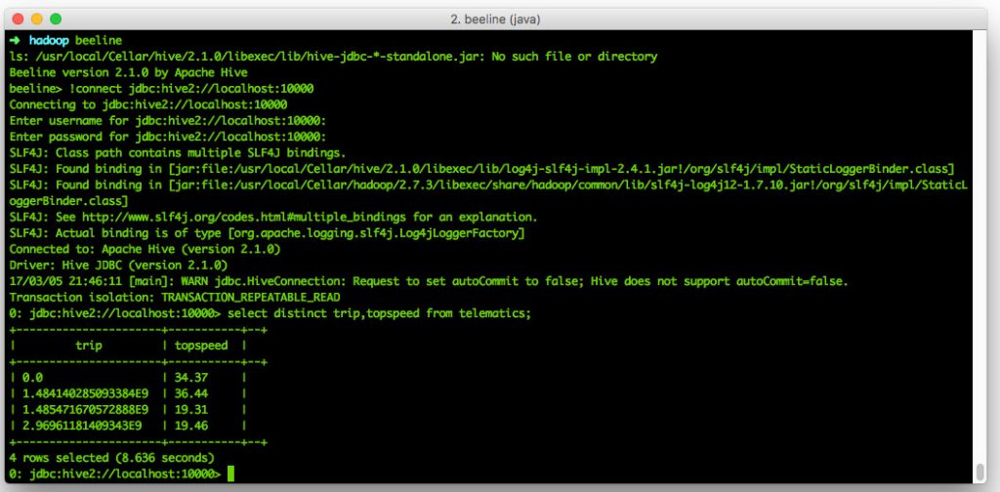
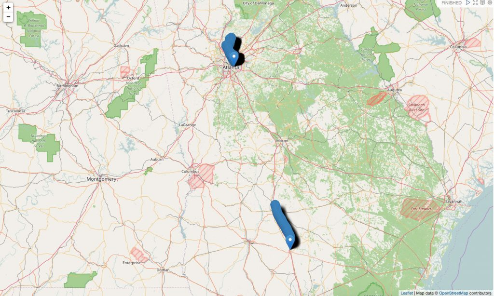
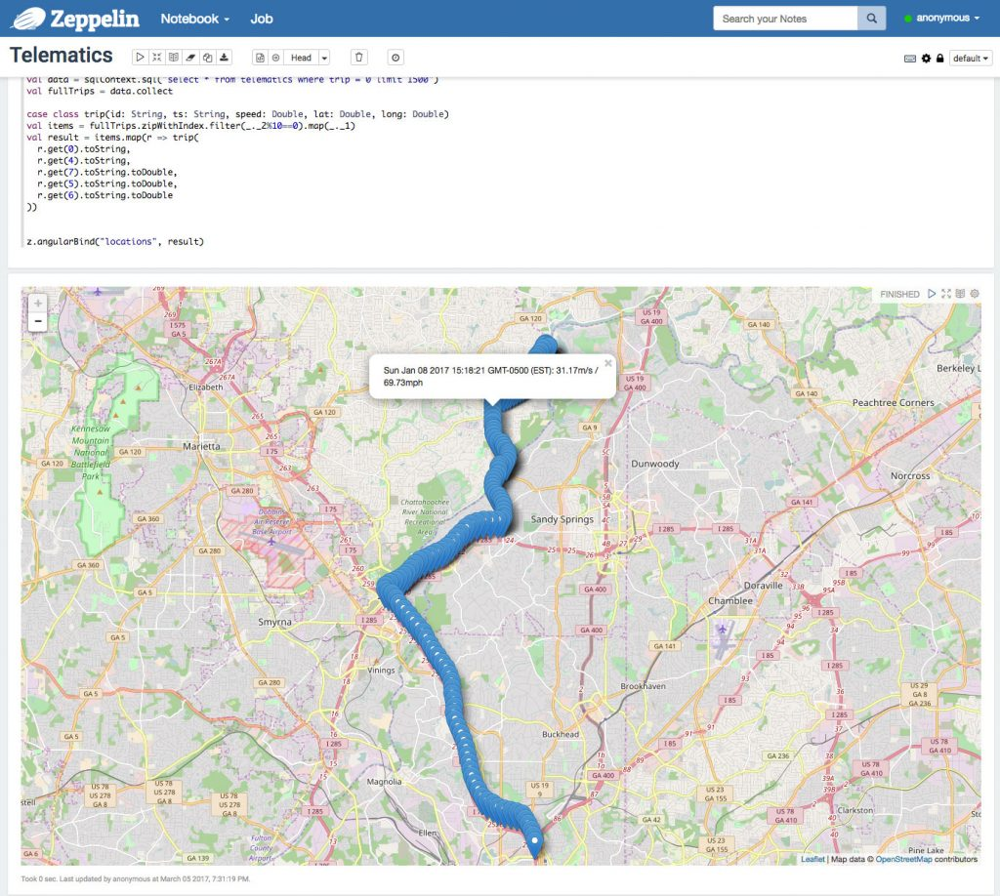
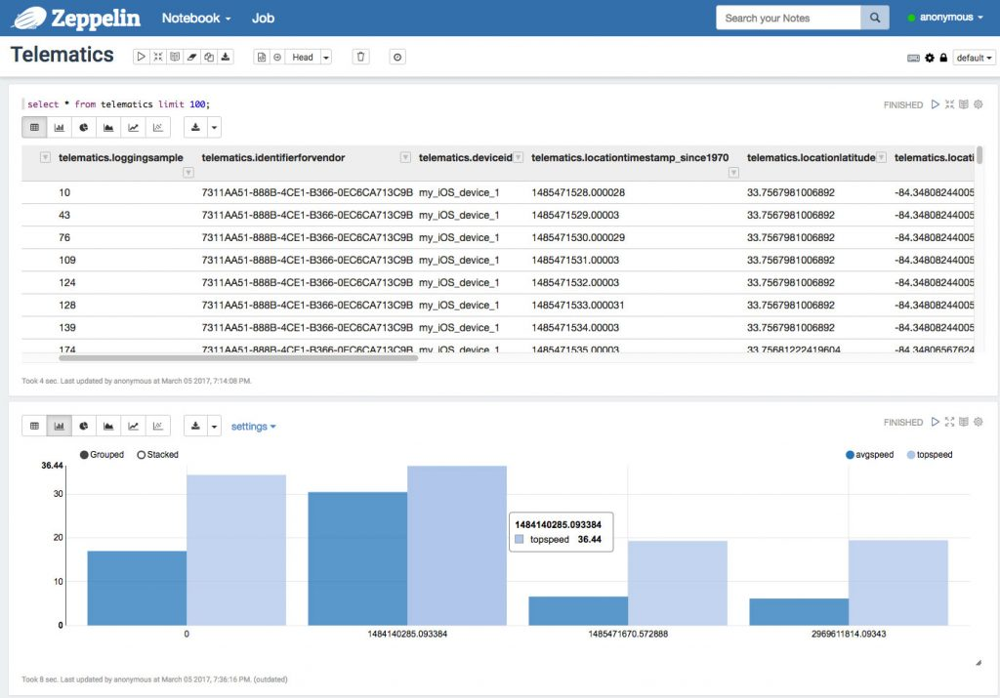

## A V8 doesn’t need computers

Cars these days are quite the experience. Or to use Mike Skinner’s words, they are full of “Space Invader”-technology.

Even entry-level models have more wiring, computers and sensors built in than a medium-sized plane. Well, while that might be a slight exaggeration, but a modern car collects data. A lot of it. Different sources, different numbers – this [paper](https://fpf.org/wp-content/uploads/FPF_Data-Collection-and-the-Connected-Car_November2014.pdf) from 2014 quotes a dead link with “approximately 4 megabytes to over 5 gigabytes of data per vehicle per month”, other sources bring up even higher figures. However you put it – there is a lot of information available.

Location, speed, hundreds of sensors for tire pressure, MPG, wiper fluid, you get the idea. Some manufacturers might use this data, some insurance companies might and you might even see some of it in your car’s dashboard.

That’s the modern world. And then there’s my car. A 7-year-old, 130k mi battle-proven Ford Crown Victoria Police Interceptor with an all-American 4.6l V8 _(“Turbos on an engine are just god's way of telling you it ain't got enough cylinders_” –Mike Skinner, again, in character on The Grand Tour).

 Not a connected car

And given its lack of fancy technology, it collects and shows exactly one metric to me: The fact that it actually has 130k miles on it. But what if we could get just a little bit more information? What if we could live up to the spirit of 2017 and not think about what we need, but what we _might_ need? Introducing: A homegrown telematics solution!

## Telematics

To get a bit more serious, what exactly is telematics? In general, it means transmitting information via telecommunication networks, but when we refer to the term “telematics”, we usually talk about collecting and transmitting certain information related to a vehicle to a corporate-backend in order enable a variety of use cases. Insurance companies use telematics data to offer discounts to people who drive responsibly, car manufacturers might use it to (anonymously) collect and do all sorts of data mining and gather insights on profiles or defects and for corporate fleet, it might be used for fleet management – the potential use cases are as complex as they are plentiful.

For the scope of this article, I would like to talk about what data we can gather and analyze by simple using a car and an iPhone – feel free to extend the idea, the [Macchina M2 Kickstarter](https://www.kickstarter.com/projects/1029808658/macchina-the-ultimate-tool-for-taking-control-of-y) might be a good starting point. This article will lay the groundwork and give some ideas on how to do it at home.

 My maximum speeds in Georgia

##  Scope & Technology

For this project, here’s what we like to achieve:

- Collect all available driving data while on the road – only a car and a phone are required
- Send and store the data on a server controlled by the user
- Analyze the data and get all insights from it that we reasonably can
- Show the results in a dashboard

And here’s what we’ll use:

- SensorLog, a $2.99 app available for [iOS](https://itunes.apple.com/us/app/sensorlog/id388014573?mt=8)
- Any form of web-server that accepts HTTP POST and can store data
- Hadoop 2.7.3 for HDFS
- Spark 2.0 for ETL and number crunching
- Apache Hive for data access
- Apache Zeppelin for visualization and exploration

Yes, this is still a Big Data blog, so we will use classical Hadoop-related technologies. But please be advised that this is intended to be a proof of concept for home use and not a corporate architecture for a huge, multi-user scenario. You will see why in just a second.

As I can already see the emails coming in: “Christian, why not just use any of the dozens of apps and startups offering exactly that? You can get an ODB stick with an app for a couple of bucks! And it can do so much more!”. And you know what? Entirely true! But given the scope of this blog, this is a technology blog, first and foremost. Secondly, all data will wind up on your computers and not in any cloud or with a vendor who needs to analyze your data to make some profit.

## Architecture

Have a look at this very much simplified architecture diagram:

We will follow 5 major steps:

1. Collect the data using SensorLog
2. Transmit the data via your phone’s mobile network (in this case, via VPN)
3. Accept & store it using node.js with express
4. Extract, transform, analyze and persist the data using Spark 2.0 with SparkSQL on Hive
5. Visualize the data using Apache Zeppelin with Spark, Hive and Angular.js

The architecture for this article is batch-driven via Oozie, but you could simply transform the Spark code into a SparkStreaming application to enable a real-time use case.

Further extensions or different tools are possible. You could replace node.js, use SparkStreaming with Kafka, put the data in HBase, have a mlib pipeline for Machine Learning set up – be creative.

## Step 1: Collecting data

The first thing we need to define is how we collect data – and there’s an app for that. Bernd Thomas’ [SensorLog](https://itunes.apple.com/us/app/sensorlog/id388014573?mt=8) for iOS collects all available metrics from your iOS device and is even able to send that data via TCP/IP sockets and HTTP, enabling our foundation for collecting data.

!

SensorLog collects 69 different metrics – basically everything your iPhone’s motion and GPS sensors have available. For the scope of this article, we will focus on time, location and speed.

In its standard configuration, it will gather data with a frequency of 30Hz, equal to roughly 1MB/minute in my tests. While that might not seem much, do a bit of number crunching for your driving profile: At 50minutes/day, roughly the [average American commute](https://project.wnyc.org/commute-times-us/embed.html), that would be 50MB a day just for _your_ location profile. If we include the weekends, that’s **1.5GB a month for a single car’s movements**. Multiply that by any number of users and add an imaginary overhead for more information from e.g. ODB, you quickly see why the cry for “Big Data” becomes legitimate.

Granted – a modern car will be able collect much more data than that, but we work with what we have.

Given iOS’ aggressive scheduler, the app needs to be running in order to collect data, making the process semi-automatic – you would have to start the app before and leave it open while driving. I’m sure Android has you covered if you need something that can run in the background, but for the sake of simplicity, we will live with it.

## Step 2: Transmitting & storing data

In order to receive the data on our backend, you will need an HTTP server that accepts POST requests. I will not go into too much detail for this topic, as there are simply too many options available. Just make sure you limit the accepted IP range and/or a VPN and accept & store the incoming data somewhere. Here, we use CSV, as it is also SensorLog’s default format for storing the data on the phone. 


// dependencies
var WebHDFS = require('webhdfs');
var express = require('express');
var fs = require('fs');
 
// App
var app = express();
 
// HTTP POST
var app = express();
app.post('/', function(req, res){
    console.log('POST /');
    console.dir(req.body);
    res.writeHead(200, {'Content-Type': 'text/html'});
    res.end('END');
 
    // Write to HDFS or FS
    fs.writeFile('data.csv', req.body, function (err) {
      if (err) return console.log(err);
    });
});


For our article, I used node.js with webhdfs and had this running on my Debian-powered NAS, which sits behind an openWRT router, giving me the flexibility I needed for this. Basically, anything from a massive AWS EC2 cluster to a RaspPi would work for accepting data. In the real world, you _could_ actually use node.js – it has proven to be quite scalable.

You won't be able to use this node.js code - I am still trying to figure out the best practices, so use it as a rough guideline.

## Step 3: Analyzing the data

As so often these days, Spark to the rescue. We will use Spark 2.0, as it offers a new API for working with DataFrames and CSV files. The example code is written in Scala, but feel free to use Java, Python or R.

The first step is to initialize our SparkSQL context and build the CSV’s schema using Spark’s org.apache.spark.sql.types.StructType. We use a combination of String and Double values for this. We then load the data from a pre-defined directory on the local file system, HDFS would naturally be preferred for larger amounts of data.


val sc = SparkSession
.builder()
.appName("TinyTelematics")
.master("local[2]")
.config("spark.sql.warehouse.dir", "file:///tmp/spark-warehouse")
.enableHiveSupport()
.getOrCreate()
 
// Build the schema
// I honestly don't know how to dynamically infer the schema by type - the old spark-csv library from databricks was able to do that as far as I recall...
val schemaStringMeta = "loggingTime loggingSample identifierForVendor deviceID locationTimestamp_since1970"
val schemaStringData = "locationLatitude locationLongitude locationAltitude locationSpeed locationCourse locationVerticalAccuracy locationHorizontalAccuracy locationHeadingTimestamp_since1970 locationHeadingX locationHeadingY locationHeadingZ locationTrueHeading locationMagneticHeading locationHeadingAccuracy accelerometerTimestamp_sinceReboot accelerometerAccelerationX accelerometerAccelerationY accelerometerAccelerationZ gyroTimestamp_sinceReboot gyroRotationX gyroRotationY gyroRotationZ motionTimestamp_sinceReboot motionYaw motionRoll motionPitch motionRotationRateX motionRotationRateY motionRotationRateZ motionUserAccelerationX motionUserAccelerationY motionUserAccelerationZ"
val schemaStringActivityStrings = "motionAttitudeReferenceFrame motionQuaternionX motionQuaternionY motionQuaternionZ motionQuaternionW motionGravityX motionGravityY motionGravityZ motionMagneticFieldX motionMagneticFieldY motionMagneticFieldZ motionMagneticFieldCalibrationAccuracy " +
"activityTimestamp_sinceReboot activity activityActivityConfidence activityActivityStartDate pedometerStartDate pedometerNumberofSteps pedometerDistance pedometerFloorAscended pedometerFloorDescended pedometerEndDate altimeterTimestamp_sinceReboot altimeterReset altimeterRelativeAltitude altimeterPressure IP_en0 IP_pdp_ip0 deviceOrientation batteryState batteryLevel state"
 
// String
val fieldsMeta = schemaStringMeta.split(" ")
.map(fieldName => StructField(fieldName, StringType, nullable = true))
 
// Double
val fieldsData = schemaStringData.split(" ")
.map(fieldName => StructField(fieldName, DoubleType, nullable = true))
 
// String
val fieldsActivity = schemaStringActivityStrings.split(" ")
.map(fieldName => StructField(fieldName, StringType, nullable = true))
val schema = StructType(fieldsMeta ++ fieldsData ++ fieldsActivity)
 
// Read the input files
val input = sc.read.format("csv").schema(schema)
.load("/Users/christian/Documents/SensorLog/tiny/*.csv")
.filter(col => !col.get(0).equals("loggingTime"))
.dropDuplicates("locationTimestamp_since1970")


Next, we try to cluster our raw data into trips. A trip is defined as a continuous flow of data. If the data collection stops, a new trip segment will be started.

To do that, we use SparkSQL’s windowing function to analyze more than one row per query. The basic idea is to Split the DataFrame when a certain metric’s difference is >= threshold (i.e. x\_n - x\_n+1 > t , whereas x is the metric, t is the threshold and n is its offset).

One approach for this is to use the timestamp, another would be to check if your current speed remains 0m/s for more than x seconds or a combination of the two.


input.createOrReplaceTempView("input")
   var cols = "loggingSample, identifierForVendor, deviceID, locationTimestamp_since1970, locationLatitude, locationLongitude, locationAltitude, locationSpeed, locationCourse"
   // The number of rows to lag can optionally be specified. If the number of rows to lag is not specified, the lag is one row.
   val lag = 1
   val splitBy = "locationTimestamp_since1970"
 
   // Add a column that includes the next row in a window, i.e. the next timestamp
   val dfDiffRaw = sc.sql("SELECT "+cols+", " +
     "(lag("+splitBy+", "+lag+") " +
     "OVER (PARTITION BY identifierForVendor ORDER BY "+splitBy+" ASC)) AS ts1 " +
     "FROM input")
   // Calculate the timestamp difference to the previous data point
   // Convert EPOCH to normal format for Hive partionining
   val dfDiff = dfDiffRaw.filter(dfDiffRaw.col("ts1").isNotNull)
     .withColumn("diff", dfDiffRaw.col("locationTimestamp_since1970")-dfDiffRaw.col("ts1"))
     .withColumn("year", org.apache.spark.sql.functions.from_unixtime(dfDiffRaw.col("locationTimestamp_since1970")).substr(0,4))
     .withColumn("month", org.apache.spark.sql.functions.from_unixtime(dfDiffRaw.col("locationTimestamp_since1970")).substr(6,2))
 
   // Cluster the data based on a minimum idle time between data points
   // If you did not collect data for x seconds, start a new "trip"
   val minTripLengthInS = 60
   val tripBy = "diff"
   cols = cols + ", year, month"
   dfDiff.createOrReplaceTempView("diffInput")
   val fullTrips = sc.sql("select "+cols+", diff, segment, " +
     " sum(case when "+tripBy+" > "+minTripLengthInS+" then locationTimestamp_since1970 else 0 end) " +
     " over (partition by identifierForVendor order by "+splitBy+") as trip" +
     " from (select "+cols+",diff," +
     "             lag("+tripBy+", "+lag+") " +
     "             over (partition by identifierForVendor order by "+tripBy+" asc) as segment" +
     "      from diffInput" +
     "     ) ue")


This adds a trip column, in our case just the first timestamp of the trip.

Last but not least we calculate certain KPIs that might be interesting later on. More specifically, we want to see the following KPIs per trip:

- Top speed
- Average speed
- Points where we went over the speed limit

For the latter, we abstract the concept and define an absolute speed limit – for Georgia and Florida (where I collected my sample data), that would be 70mph (or 31.3m/s). In a real life scenario, you would want to think about matching the GPS location to a map provider that offers specific speed limits – because 70mph in a 30mph zone is not a good idea. 


val trips = fullTrips.groupBy("trip")
 
// Calculate KPIs
val avgSpeeds = trips.avg("locationSpeed").withColumnRenamed("avg(locationSpeed)", "avgSpeed")
val topSpeeds = trips.max("locationSpeed").withColumnRenamed("max(locationSpeed)", "topSpeed")
 
val result = fullTrips.join(avgSpeeds, "trip").join(topSpeeds, "trip")
 
// Save
result.createOrReplaceTempView("result")
 
result.write.format("parquet").mode(SaveMode.Append).saveAsTable("telematics")


Top and average speed are simple – group the result by trip, use avg(1) and max(1) and join the result with the original DataFrame on column “trip”. The result winds up in a Hive table called "telematics".

## Accessing the data

For Hive, make sure you have Hiveserver2 running and not just a local Hive with derby, as we will be using JDBC for our visualization. Verify that setup with


mysql.server start
hiveserver2
beeline
beeline> !connect jdbc:hive2://localhost:10000


 

Beeline Sidenode: If you get something along the lines of "Plugin '\*4DF1D66463C18D44E3B001A8FB1BBFBEA13E27FC' is not loaded" - restore the hive user in mysql. Setting up Hiveserver2 on Mac is not fun.

## Visualizing the data

First off, I tried using R with shiny, but failed. See my StackOverflow post [here](http://stackoverflow.com/questions/42613095/rjdbc-with-hive-on-mac-os-jfindclassas-characterdriverclass1-class-not). An alternative is Tableau, as it can use JDBC as of version 10, but that might a bit pricey for a small PoC on your local machine.

 Example trips in Georgia

For the sake of simplicity, we will use Apache Zeppelin. It is standard in Hortonworks HDP, but also runs fine as standalone. To configure Zeppelin, refer to your environment. For me, I had to manually configure JDBC to use the hive driver and reference said jar in ZEPPELIN\_CLASSPATH via the zeppelin-deamon.sh file and some other details.

We use this angular.js [example](https://gist.github.com/granturing/a09aed4a302a7367be92) to visualize the data on a map.

In order to do that, we pull the data back from Hive using SparkSQL on scala directly in Zeppelin and map the result to a “trip” object which we bind to the global scope using z.angularBind(2). 


%spark
sc.hadoopConfiguration.set("fs.defaultFS","hdfs://localhost:9000")
val data = sqlContext.sql("select * from telematics")
val fullTrips = data.collect
 
case class trip(id: String, ts: String, speed: Double, lat: Double, long: Double)
val items = fullTrips.zipWithIndex.filter(_._2%10==0).map(_._1)
val result = items.map(r => trip(
  r.get(0).toString,
  r.get(4).toString,
  r.get(7).toString.toDouble,
  r.get(5).toString.toDouble,
  r.get(6).toString.toDouble
))
 
z.angularBind("locations", result)


Since the map is rendered on the client, we filter every nth result before actually showing the result:

 Example trip in Atlanta, GA with Spark

As we can see in this example, I went around 70mph on 01/08/17.

We can also use Zeppelin to analyze our data with any other form of SQL and visualization. For instance, this example, we took all trips currently in the system and plotted them against their top- and average speeds.

 Average and top speeds by trip

There's more to be done here, of course - a fun exercise would be to link my last.fm profile (which is connected to Spotify) with my top speeds. Now is Watain making me floor it? Or does a CCR playlist have the same effect?

## Conclusion

This is a very simple showcase. It uses a variety of technologies to bring a bit of connectivity to my old Crown Vic, but is it worth it?

Absolutely not. Sure - it is a cool proof of concept for me to have a look on how I drive where, to explore the data we can generate using and iPhone and to find out that there are a couple of 1 mile trips to Popeye's (which maybe, just maybe, one could avoid). But after all, it is just one car with location and speed data.

**But:** As soon as we extend this concept by collecting actual ODB data (see the kickstarter link above!), link more data to it or add more users, we have a very interesting concept on our hands. The more actual insights we are able to collect, the more we can learn. How to my car's sensor metrics relate to the driving style? What is my driving profile, how does it relate to that of my friends and their cars? Is there open maintenance, should I schedule it, has it anything to do with how I drive? If we can we enrich the GPS data with speedlimits, how much would the police like my driving style?

The foundation is there. We can collect, send, format, store and analyze data. Adding just _more_ data to it is trivial (given we are able to extract it).

But for now - a fun little project and maybe a foundation for more.

_The full source is available on [GitHub](https://github.com/chollinger93/TinyTelematics)._
