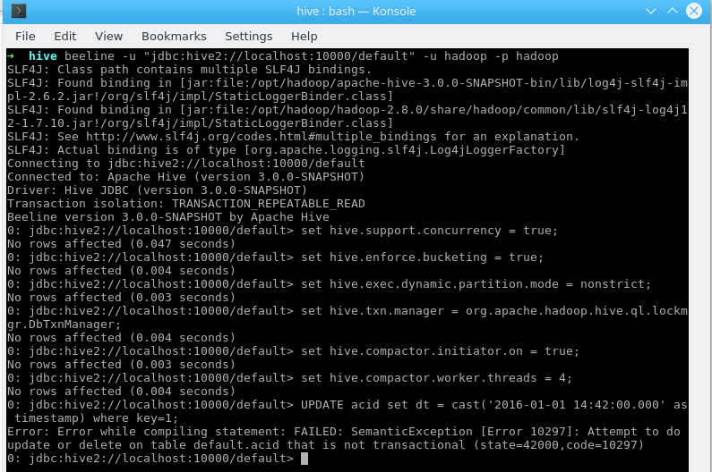
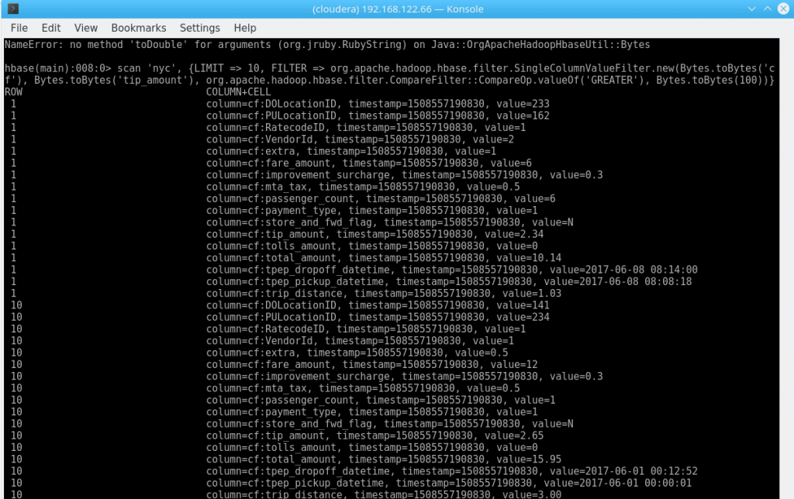
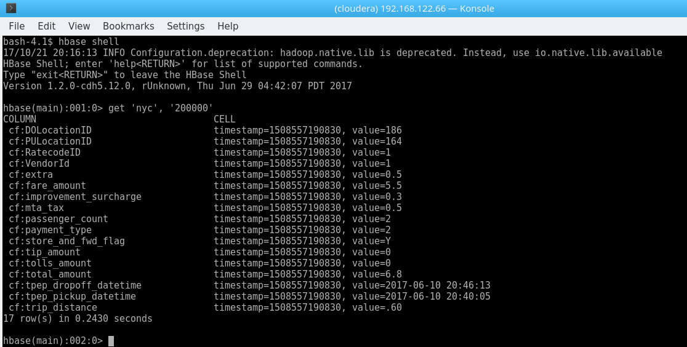
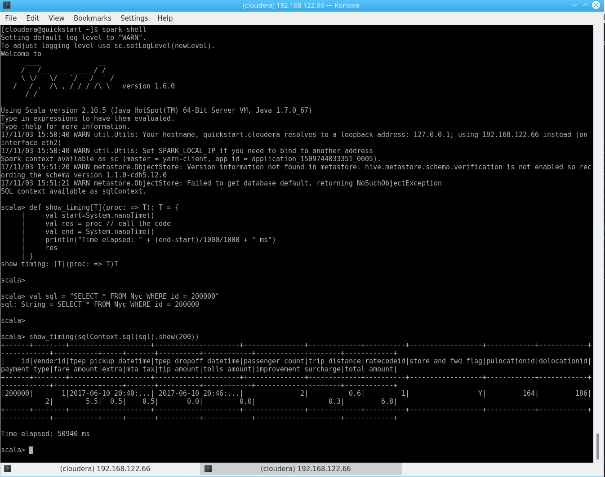
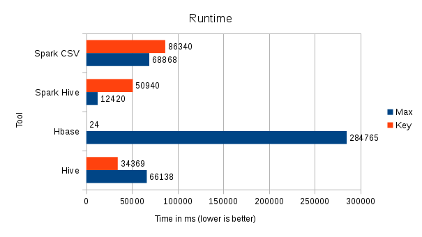

## Introduction

_This article will talk about how organizations can make use of the wonderful thing that is commonly referred to as “Data Lake” - what constitutes a Data Lake, how probably should (and shouldn’t) use it to gather insights and why evaluating technologies is just as important as understanding your data._

When organizations talk about the need to utilize data as part of their IT and business strategy, they usually have certain goals in mind. A common question usually boils down to “How can we make use of the data that we have available within our organization?”

While it might seem like a simple enough question to solve, the devil’s in the detail.

- Where do we store the data? How many systems are currently in use? How are they connected to our business processes?
- Who knows about the data? Who understands that data? Do we have metadata available?
- Which technologies are in use? Who are the people working with these technologies?
- Which systems interact with my Data Lake? Where’s my MDM, CRM, ERP - and where’s Waldo? How do they work, what kind of data do they store and process?
- What are my ETL requirements? Who can design our data models? Which systems are responsible for these tasks?
- What regulations are impacting our data?

Given you are able to answer these questions, the next logical step might be to start a consolidation effort. What used to be the realm of traditional Data Warehouse solutions is now commonly replaced by what we call a “Data Lake” - meaning an organized, central storage for all your organization’s useful data in a scaleable, powerful repository, often realized by utilizing Hadoop or Cloud-based Big Data toolsets like Google BigQuery.

Now, let’s just assume you tackled all of these issues – your data is on your cluster, half a billion scheduled Sqoop jobs merrily import data, sanity checks, ETL, CDC, run like a charm, all regulations are taken care of, Kerberos is terrorizing IT departments across the globe and everything is living in one place. But… what now, exactly?

## Utilizing your Data Lake

When it comes to actually using your Lake, things become really interesting. Usually, you would be utilizing one of the “standard” tools available with, say, Cloudera’s or Hortonwork’s respective distributions that enable you to access your data.

Just to pick a few -

- Hive
- HBase
- Phoenix
- Cassanadra
- Accumulo
- Impala
- Kudu
- Spark
- Pig

Every single one of those tools has different use cases, different requirements for both technical and human resources and usually fits a single, usually fairly specific type of data access. So – how can we decide what tool fits best?

In the next sections, we will cherry-pick technologies and talk about Hive, HBase (plus a bit of Phoenix), and Spark and apply common use cases on a semi-large (9.6M records) public data set. At the end, we will summarize our findings and performance tests.

## A short prefix for Apache Hive

When it comes to Hadoop, the transition is hard. One might argue that one of the, if not the, hardest thing about a transition from traditional DWH to Hadoop is not the technology, but rather the way people use it. That being said, the first thing that comes to mind when you transition from relational systems to Hadoop might just be Apache Hive – a mostly ANSI-SQL compliant tool that allows you to fire SQL queries on your HDFS data.

First off: Hive is a fantastic piece of software that comes with a lot of flexibility. It runs on your laptop (well, it does on mine...), on a legacy cluster powered by good old M/R2 just like it does on a modern, Spark or Tez fueled powerhouse. It makes it easy to work with any data you might have, from legacy CSVs or AS400 Sqoop imports to complex Avro-magic.

So, why not just use Hive like you would, say, a Microsoft SQL Server?

Because **Hive. Is. Not. A. RDBMS.** I cannot stress this enough. Hive uses Schema-On-Read mechanics, does not have the concept of keys (and that is, well, key!) and is not ACID compatible out of the box. You are also responsible for managing the underlying system. In the next section, we will dive into the details of what exactly that means.

## Hive

We will use the following data set: [http://www.nyc.gov/html/tlc/html/about/trip\_record\_data.shtml](http://www.nyc.gov/html/tlc/html/about/trip_record_data.shtml)

Data about the famous NYC cabs!

For 3 months, 2017-04 to 2017-06 for all Yellow Cabs, it boils down to a total of 29,805,311 records in 2.5GiB. If we start with June, we still get 813 MiB and 9,656,995 records.

As we will re-use the same data set for HBase later, you will need to make sure your HBase Key is unique – if you just use the first value in the CSV, VendorID, you will get a total of 3 records – as there are 3 distinct values in that CSV for this column. So we need to add an ID using awk. I suggest using head -1000 and piping that to a separate file for testing if you want to follow along.


wget https://s3.amazonaws.com/nyc-tlc/trip+data/yellow_tripdata_2017-06.csv
 
awk -F',' -v OFS=',' '
 NR == 1 {print "ID", $0; next}
 {print (NR-1), $0}
' yellow_tripdata_2017-06.csv > yellow_tripdata_2017-06_id.csv


Now, we need to create a DDL and import the data:


DROP TABLE IF EXISTS nyc;
CREATE TABLE nyc(
id BIGINT
,VendorID BIGINT
,tpep_pickup_datetime TIMESTAMP
,tpep_dropoff_datetime TIMESTAMP
,passenger_count INT
,trip_distance DOUBLE
,RatecodeID STRING
,store_and_fwd_flag STRING
,PULocationID INT
,DOLocationID INT
,payment_type INT
,fare_amount DOUBLE
,extra DOUBLE
,mta_tax DOUBLE
,tip_amount DOUBLE
,tolls_amount DOUBLE
,improvement_surcharge DOUBLE
,total_amount DOUBLE
)
ROW FORMAT DELIMITED
FIELDS TERMINATED BY ','
STORED AS TEXTFILE;
 
LOAD DATA INPATH 'hdfs:///user/cloudera/yellow_tripdata_2017-06_id.csv' OVERWRITE INTO TABLE nyc;


Oops. Not good. Wait, let’s just enable transactions! However, you will have issues doing that using Cloudera’s distribution. Take this exempt from the documentation:

> _“The CDH distribution of Hive does not support transactions ([HIVE-5317](https://issues.apache.org/jira/browse/HIVE-5317)). Currently, transaction support in Hive is an experimental feature that only works with the ORC file format. Cloudera recommends using the Parquet file format, which works across many tools. Merge updates in Hive tables using existing functionality, including statements such as INSERT, INSERT OVERWRITE, and CREATE TABLE AS SELECT.” 

([https://www.cloudera.com/documentation/enterprise/5-12-x/topics/hive\_ingesting\_and\_querying\_data.html](https://www.cloudera.com/documentation/enterprise/5-12-x/topics/hive_ingesting_and_querying_data.html))_

In the interest of transparency, here is how it looks on a manual Hive setup directly on Fedora (On a related note: Hortonwork’s HDP does support it out of the box):

 Hive ACID Enabled

If you take a look at the official Hive documentation, the limitations become even more apparent:

- Only [ORC file format](https://cwiki.apache.org/confluence/display/Hive/LanguageManual+ORC) is supported in this first release.  The feature has been built such that transactions can be used by any storage format that can determine how updates or deletes apply to base records (basically, that has an explicit or implicit row id), but so far the integration work has only been done for ORC.
- By default transactions are configured to be off.  See the [Configuration](https://cwiki.apache.org/confluence/display/Hive/Hive+Transactions" \l "HiveTransactions-Configuration) section below for a discussion of which values need to be set to configure it.
- Tables must be [bucketed](https://cwiki.apache.org/confluence/display/Hive/LanguageManual+DDL+BucketedTables) to make use of these features.  Tables in the same system not using transactions and ACID do not need to be bucketed. External tables cannot be made ACID tables since the changes on external tables are beyond the control of the compactor ([HIVE-13175](https://issues.apache.org/jira/browse/HIVE-13175)).
- Reading/writing to an ACID table from a non-ACID session is not allowed. In other words, the Hive transaction manager must be set to org.apache.hadoop.hive.ql.lockmgr.DbTxnManager in order to work with ACID tables
- ([https://cwiki.apache.org/confluence/display/Hive/Hive+Transactions#HiveTransactions-ConfigurationValuestoSetforINSERT,UPDATE,DELETE](https://cwiki.apache.org/confluence/display/Hive/Hive+Transactions" \l "HiveTransactions-ConfigurationValuestoSetforINSERT,UPDATE,DELETE))

While reasonable, it does strengthen my argument – Hive is not an RDMBS, even though you might be importing relational data. ACID compatibility is possible, but limited to some fairly specific use cases.

As long as you are using bucketed (often via a Primary Key from source), ORC-based, managed tables on a distribution that supports this, you are doing great. If you start with more uncommon Hadoop use cases, you might – will – run into issues.

So, how do organizations get around this? Usually, you can play [The Tower Of Hanoi](http://mathworld.wolfram.com/TowerofHanoi.html) – meaning, using temporary tables and sub-selects to work with INSERT OVERWRITE statements, use a different storage and execution strategy that enables random writes and updates (more below) – or you can make this a core target and focus on matching the requirements outlined above.

When going for the first approach, there might be some…

Cannot insert into target table because column number/types are different

...errors and excluding columns still involves regex, but after all, a lot is possible if you put your mind to it.

In any case, sooner or later you will find yourself in need of working with your now accessible data. If you call this process “mapping”, “transformation” or just throw your entire ETL workload on Hadoop, eventually you will want to gain some form of insights from your Lake – and usually, this involves Joins, Views and other SQL operations.

## Hive on 9,656,995 records

Let’s get back to our data. Always keep in mind that this data is currently stored as plain text.

Let’s try to get all trips with a tip over $100 – it’s NYC, after all:


with tmp as(
  SELECT * FROM Nyc
  WHERE tip_amount >= 100
)
SELECT COUNT(*), max(tip_amount), total_amount as max_tip from tmp group by total_amount;


 Hive on 9M records

Time taken: 66.138 seconds, Fetched: 185 row(s)

We got a result in about a minute on a single node _(cluster configuration can be found down below)_!

As you can see, I use a less-than-shiny, white-on-black CLI. So, let’s assume we have business users and analysts which are used to complex, powerful tools such as MS SQL Management Studio.

We can provide access to business users using Ambari (Hortonworks), Hue, Zeppelin or other web-based front ends.

 Hue

However - storing queries, simply exporting results, auto-complete, stored procedures, special characters and (in most cases) visualization are not features that are commonly found on these tools.

You will need an external tool, usually connected via JDBC, for that. Examples include Dbeaver, Squirrel or Dbvisualizer. Keep in mind that these tools need to talk to Hive (standard port 10000) and are usually Kerberos enabled – and generally speaking, Kerberos really, really hates nice things. It also hates bad things, in many cases, that would be Windows.

To get a bit more serious – **transitioning your seasoned analysts to Hive is not an easy task.** The technology is fundamentally different, the available tool sets do not offer the comfort many of us got used to over the years and seemingly simple functionality appears to be missing. It is really challenging to explain that Hive does, in fact, does not have the concept of “NULLable fields” or even Primary Keys, not to mention the highlighted ACID problematic or missing features from other SQL dialetcs.

However: Hive offers different benefits. It is heavily optimized for huge datasets and will not blow up for very large tables (the 9M records from our example might be a good start for a VM, but is not a representative volume!), can be easily extended by simply plugging more machines in your cluster, is fully Open Source, can directly work on various other data sources that are not managed by Hive (External Tables, see below), is integrated in basically any Big Data related technology (Sqoop even creates your tables and DDLs for you when importing data from an RDBMS), can be your entry point for Machine Learning on structured data, and serves as key component in any data lake.

**So: You should use Hive**. But do not expect it to work like MariaDB or Oracle. Do not expect setting up a Data Lake involving a couple of Hadoop Experts that know Hive in-and-out and to receive good feedback from business. As always, communication is key.

Use Hive to access your data, to transform your data (though not necessarily directly via the CLI), to provide external access via JDBC to end users (using the right tool – OpenSource or proprietary), and as major workhorse for your Data Lake for anything that even resembles relational data.

But remember – it is not an RDMBS. It was never meant to be that. It is not going to replace anything – it is a piece of technology that requires some careful planning and coordination between both IT and business. Maybe you even want to move your results to a different database, visualization tool or warehouse that works better with your Analyst’s toolset of choice – it all depends on what you are trying to do. But ultimately, you will be rewarded with a system which bridges the gap between abstract, distributed data and related algorithms such as MapReduce and the SQL we all learned to love and hate.

## HBase and other non-relational databases

But obviously, there is a world beyond relational data. Enter the world of “noSQL”.

If you ever had the chance to use a production HBase cluster, there’s pretty much two scenarios. One: You love it because it was used exactly like it was meant to. Two: You hate everybody committing to it and burn Lars’ [book](http://www.hbasebook.com/) on occasion (which, by the way, I can only highly recommend).

Non-relational systems, especially the Column-oriented varieties, like HBase, MongoDB, or Accumulo are a fantastic concept. Usually, there is no concept of ACID transactions, but are hellishly fast if used right.

If we use HBase, a de-facto standard on Hadoop, as an example, we can quickly see what “used right” means and apply some common access patterns on our NYC cab data. For details on HBase’s architecture, I will again refer to Lars George’s book, “HBase – the Definitive Guide” (O’Reilly Media).

In general terms, noSQL systems heavily rely on the concept of a key – and therefore, doing exactly what Hive omits for good reasons. Now, what is true about Hive – that it does not come with a fancy client – is especially true for HBase.

A seemingly simple query like “get me all records where X” turns into a long, horrible orgy of sub-commands over a charming black-and-white CLI.

We’ll re-use our NYC Yellow Cab data set (the Hive import from above moves the data set, so you will need to copy it to HDFS again).


hbase shell <<< "create 'nyc', 'cf'"
dos2unix yellow_tripdata_2017-06_id.csv
hdfs dfs -copyFromLocal yellow_tripdata_2017-06_id.csv /user/cloudera
hbase org.apache.hadoop.hbase.mapreduce.ImportTsv -Dimporttsv.separator=, -Dimporttsv.columns="HBASE_ROW_KEY,cf:VendorId,cf:tpep_pickup_datetime,cf:tpep_dropoff_datetime,cf:passenger_count,cf:trip_distance,cf:RatecodeID,cf:store_and_fwd_flag,cf:PULocationID,cf:DOLocationID,cf:payment_type,cf:fare_amount,cf:extra,cf:mta_tax,cf:tip_amount,cf:tolls_amount,cf:improvement_surcharge,cf:total_amount" nyc /user/cloudera/yellow_tripdata_2017-06_id.csv


One might add that the initial import took plenty of time on the Quickstart Configuration, which, granted, is not very good. The command also exits with Bytes Written=0 if something is wrong (like a mismatch in the columns) – do not pass Go. Do not collect $200.

Again, let’s get all trips with a tip > $100. 


scan 'nyc', {LIMIT => 10, FILTER => org.apache.hadoop.hbase.filter.SingleColumnValueFilter.new(Bytes.toBytes('cf'), Bytes.toBytes('tip_amount'), org.apache.hadoop.hbase.filter.CompareFilter::CompareOp.valueOf('GREATER_OR_EQUAL'), Bytes.toBytes(100))}


What’s that?

 HBase Query Result

What happened here? Using the TSV import command, all the values are imported as Strings – and we are trying to compare Strings with Bytes. Technically correct, but not very insightful. There is a whole lot more to the way HBase stores its data – I will not go into that at this point. But just keep in mind that HBase does not really care about the data you throw at it.

So, let’s use Java, the next low-level abstraction HBase offers. We implement a custom Comparator to work with Double in String fields, move that jar to HBase’s classpath, restart HBase and run our query as jar file. Make sure to set `hbase.client.scanner.timeout.period hbase.regionserver.lease.period` accordingly.


package com.otterinasuit.hbase;
 
import com.otterinasuit.hbase.comparators.ByteToDoubleComparator;
import org.apache.hadoop.hbase.client.*;
import org.apache.hadoop.hbase.filter.CompareFilter;
import org.apache.hadoop.hbase.filter.LongComparator;
import org.apache.hadoop.hbase.filter.SingleColumnValueFilter;
 
// import ...
 
public class Main {
    private final static Logger logger = LoggerFactory.getLogger(Main.class);
    private final static double THRESHOLD = 100.00D;
 
    public static void main(String[] args) {
 
        try {
            long lStartTime = System.nanoTime();
            logger.info("Start");
            Configuration config = new Configuration();
            config.addResource("/etc/hbase/conf.cloudera.hbase/hbase-site.xml");
            config.set("hbase.rpc.timeout", "1800000");
            config.set("hbase.regionserver.lease.period", "1800000");
 
            Connection connection = ConnectionFactory.createConnection(config);
            Table table = connection.getTable(TableName.valueOf("nyc"));
            // Filter
            SingleColumnValueFilter filter = new SingleColumnValueFilter(Bytes
                    .toBytes("cf"), Bytes.toBytes("tip_amount"), CompareFilter.CompareOp.GREATER_OR_EQUAL,
                    new ByteToDoubleComparator(THRESHOLD));
 
            // Scan
            Scan scan = new Scan();
            scan.setFilter(filter);
            scan.addFamily(Bytes.toBytes("cf"));
 
            // Run
            long c = 0;
            ResultScanner scanner = table.getScanner(scan);
            TreeMap<Double,result> list = new TreeMap<Double,result>();
            for (Result r : scanner) {
                String total = Bytes.toString(r.getValue(Bytes
                        .toBytes("cf"), Bytes.toBytes("tip_amount")));
                String tip = Bytes.toString(r.getValue(Bytes
                        .toBytes("cf"), Bytes.toBytes("total_amount")));
                System.out.println("tip_amount: " + tip);
                System.out.println("total_amount: " + total);
 
                double total_amount = Double.parseDouble(total);
                double tip_amount = Double.parseDouble(tip);
                list.put(tip_amount, new result(total_amount,tip_amount));
                c++;
            }
 
            // Calculate in the client
            double max_tip = Collections.max(list.keySet());
            result max_res = list.get(max_tip);
            System.out.println("Max tip was "+max_res.getTotal()+", amount was "+max_res.tip+", ratio: "+max_res.getRatio());
            System.out.println("A total of "+c+" people tipped over "+THRESHOLD);
 
            // Cleanup
            table.close();
            connection.close();
 
            long lEndTime = System.nanoTime();
            long total = (lEndTime - lStartTime) / 1000000;
            System.out.println("Rumtime: " + total + "ms / "+total/1000/60+"min");
        } catch (Exception e) {
            logger.error("Reading from HBase failed!");
            e.printStackTrace();
        }
    }
 
    static class result {
    // ...
    }
}


Implementing the custom Comparator sounds like a simple exercise, but believe me, I had to read a lot of HBase source code in order to get that working. Also, Protobuf. We’ll forge that into a separate article. 


Max tip was 440.0, amount was 473.3, ratio: 0.9296429326008874
A total of 185 people tipped over 100.0
Rumtime: 284765ms / 4.7min


A total of 185 people tipped over 100.0

**About 5x the runtime of Hive**. I need to add at this point that using a HBase client application is not a very efficient way of working with this data in itself and that I threw together that jar in a couple of minutes (which it why it screams "Kill me!") – but since my test environment is running on a single node anyways, we will let this slide.

However, this comes back to my point about keys and hence data access patterns. We are using a monotonically increasing, artificial, meaningless key. It’s like assigning each record in a pile of loose vinyls a increasing number and expecting to find something quick. Sure, it works eventually – but not efficiently.

Let me demonstrate this by getting the (chosen-at-random) key “200000”: 

 HBase get\

**0.24s isn’t bad at all**. Running a similar query in our (seemingly) quicker Hive table from above looks like this: 

 Hive HBase "get"

**34.4s**! In other words, 141x HBase’s runtime.

The same finding applies for scanning multiple rows – using 


scan 'nyc', {STARTROW => '200000', ENDROW => '200020'}


to get all rows from 200,000 to 200,020 takes 1.9s in my example, the majority of what would be printing to the shell.

In real life, we would probably use a meaningful HBase key, such as the trip’s time if we are interested in analyzing the data based on date and time (on nanosecond precision in order to avoid duplicates). We could ask HBase “get me all trips from 2017-07-04 18:00:00.000 to 2017-07-05 01:59:59.000 and show me the average fare” if we want to take a look at 4th July fares at night.

Anyways – while HBase also answers my initial query, the Java method is highly inefficient as well:

- The query runs client-side (as mentioned above)
- We needed to essentially customize HBase or at least work around our data type issues (there’s other ways to achieve this, but your choice of technology will eventually limit your ability to gain these insights)
- We need to write a custom program in Java
- While it is almost easier than daisy-chaining commands in a shell, it is still fairly complex for such a simple query

## SQL on noSQL

But what about SQL? Well, you can use Hive again by pointing an external table to HBase – I just don’t recommend it for this use case. First, we need an external table (a table that does not manage data, but rather just points to an existing data source), mapping our HBase columns to Hive columns:


CREATE EXTERNAL TABLE hbaseNyc(
VendorID BIGINT
,tpep_pickup_datetime TIMESTAMP
,tpep_dropoff_datetime TIMESTAMP
,passenger_count INT
,trip_distance DOUBLE
,RatecodeID STRING
,store_and_fwd_flag STRING
,PULocationID INT
,DOLocationID INT
,payment_type INT
,fare_amount DOUBLE
,extra DOUBLE
,mta_tax DOUBLE
,tip_amount DOUBLE
,tolls_amount DOUBLE
,improvement_surcharge DOUBLE
,total_amount DOUBLE
)
STORED BY 'org.apache.hadoop.hive.hbase.HBaseStorageHandler'
WITH SERDEPROPERTIES ("hbase.columns.mapping" = "
:key
,cf:tpep_pickup_datetime
,cf:tpep_dropoff_datetime
,cf:passenger_count
,cf:trip_distance
,cf:RatecodeID
,cf:store_and_fwd_flag
,cf:PULocationID
,cf:DOLocationID
,cf:payment_type
,cf:fare_amount
,cf:extra
,cf:mta_tax
,cf:tip_amount
,cf:tolls_amount
,cf:improvement_surcharge
,cf:total_amount
")
TBLPROPERTIES ('hbase.table.name' = 'nyc');


The query certainly is easier to manage, but the performance is also not great either: 


1       440.0   473.3
Time taken: 265.434 seconds, Fetched: 155 row(s)
4.4 minutes.


And the explanation remains the same: Column-based random-access is not what HBase was built for.

HBase is really fast on any access that involves a key, on a lot of inserts and even “updates” (which are really overwrites), can manage billions of rows, and is incredible flexible, as it does not dictate a fixed schema apart from ColumnFamilies. You can literally make up columns and data types as you go.

One alternative is Apache Phoenix, an SQL layer on top of HBase that takes care of a lot of optimization for you. I will not go into detail at this point – but the key finding (pun intended) remains the same. Using HBase while expecting random-read queries is a bad idea!

I guess what I am trying to say – usability is not HBase’s primary target. And it doesn’t have to be. As my “ID 200,000” example shows, HBase wipes the floor with Hive when it comes to very precise lookups, it’s flexibility due to the lack of schema is incredible and it will not let you down on very large data sets – if you make sure you know exactly what you are after.

## Apache Spark

First off, Apache Spark is a general-purpose processing engine. Comparing it to other technologies is not really a good start, as it serves many purposes, such as -

- Programming interface for data access, ETL, Machine Learning and more
- Execution Engine (for Hive)
- Streaming data
- Machine Learning

I’ve used Spark many times and it remains one of my favorite, to-go tools in the Big Data zoo – mostly because it can do almost anything and is usually very fast, due to some very smart optimizations and techniques under the hood.

Without further ado, we will replace M/R2 from the Hive example above with the Scala-based Spark shell (basically, a live shell you can get by running $ spark-shell) and fire the same query:


def show_timing[T](proc: => T): T = {
  val start=System.nanoTime()
  val res = proc // call the code
  val end = System.nanoTime()
  println("Time elapsed: " + (end-start)/1000/1000 + " ms")
  res
}
 
val sql = """
with tmp as(
SELECT * FROM Nyc
WHERE tip_amount >= 100
)
 
SELECT COUNT(*), max(tip_amount), total_amount as max_tip from tmp group by total_amount"""
 
show_timing(sqlContext.sql(sql).show(200))


 Spark


Time elapsed: 12420 ms


12s for the exact same result. Of course – we already spent time on Hive prior to this, but the same result with a slightly different performance outcome could be achieved by reading the CSV from HDFS directly! Using Spark 2 makes this easy, but we can use the default 1.6 as well, as installing Spark 2 on Cloudera be a bit tricky.

So we use the [databricks-csv](https://github.com/databricks/spark-csv) library: `spark-shell --packages com.databricks:spark-csv\_2.10:1.5.0`

And this bit of code: 


import org.apache.spark.sql.SQLContext
import org.apache.spark.sql.types._
 
def show_timing[T](proc: => T): T = {
    val start=System.nanoTime()
    val res = proc // call the code
    val end = System.nanoTime()
    println("Time elapsed: " + (end-start)/1000/1000 + " ms")
    res
}
 
val schema = StructType(Array(
    StructField("id", IntegerType, true),
    StructField("VendorID", IntegerType, true),
    StructField("tpep_pickup_datetime", StringType, true),
    StructField("tpep_dropoff_datetime", StringType, true),
    StructField("passenger_count", IntegerType, true),
    StructField("trip_distance", DecimalType.Unlimited, true),
    StructField("RatecodeID", StringType, true),
    StructField("store_and_fwd_flag", StringType, true),
    StructField("PULocationID", IntegerType, true),
    StructField("DOLocationID", IntegerType, true),
    StructField("payment_type", IntegerType, true),
    StructField("fare_amount", DecimalType.Unlimited, true),
    StructField("extra", DecimalType.Unlimited, true),
    StructField("mta_tax", DecimalType.Unlimited, true),
    StructField("tip_amount", DecimalType.Unlimited, true),
    StructField("tolls_amount", DecimalType.Unlimited, true),
    StructField("improvement_surcharge", DecimalType.Unlimited, true),
    StructField("total_amount", DecimalType.Unlimited, true)))
 
val df = sqlContext.read.format("com.databricks.spark.csv").option("header", "true").option("inferSchema", "false").schema(schema).load("hdfs:///user/cloudera/yellow_tripdata_2017-06_id.csv")
 
df.registerTempTable("nycspark")
 
val sql = """
with tmp as(
SELECT * FROM nycspark
WHERE tip_amount >= 100
)
SELECT COUNT(*), max(tip_amount), total_amount as max_tip from tmp group by total_amount"""
 
show_timing(sqlContext.sql(sql).show(200))


 Spark

As you can see, the performance is not exactly a miracle and we had to manually define a schema, as we removed the CSV header – but keep in mind that this approach directly reads your CSV from HDFS, basically skipping Hive altogether. While aggregates might not be the key use case here, this is a very neat feature to work with various files directly on Spark.

In order to answer our “200000 key question”, the same query in Hive is not very convincing either: 

 Spark Hive "get"

Another 50s.

And for good measure, the same on the CSV: 

 Spark CSV "get"

And even better, knowing just a bit of Scala, we can do much more with that data – we could store it in a DataFrame, do more analysis on there, write it to disk, connect it to other sources, read from a completely different file from disk without any involvement of Hive whatsoever, combine those results, transform the code into a Real-Time application and much more.

We can use Spark on Python, Scala, Java and R, can run it from a web front-end such as Apache Zeppelin or just build mighty, full-size applications that involve build servers and more unit tests than you can imagine even in your wildest dreams.

But again – while the above example surely is simple, really complex Spark applications will result in full-sized software projects. But whether it is a simple Script or a complex application, Spark will serve your end users familiar with SQL (especially on a graphical tool like Zeppelin) as well as your Data Scientists and Engineers.

Talking about Spark in a couple of paragraphs does not do it justice, but the gist of it is: Simple to use (although not as intuitive as a Microsoft SQL client) quick results, hard to master, and very powerful – but not exactly Microsoft SQL Management Studio either.

## Conclusion

Let’s summarize: Using a fancy toolset doesn’t help anybody if it’s not used accordingly. Not surprising!

It gets even more apparent when we sum up our benchmarks:

Performance Overview

Hadoop does not magically solve your problems. Period. It does, however, provide a very powerful foundation for many years to come, especially when you think beyond your usual DWH Reporting targets.

Generally speaking -

Use **Hive** for “standard” queries – it gets as close to an RDBMS as you’re going to get. With ACID enabled and a smart use of Bucketing and Partitioning instead of traditional Primary Keys where applicable, using a good choice of ETL rules (avoiding VARCHAR join conditions, for instance), it serves as powerful, easy-to-use access layer to your Data Lake, especially in combination with a tool like Dbeaver. Do not expect it to make business users happy without proper Change Managstrongent.

It also opens the gate for much more advanced use cases: As starting or end point for your Machine Learning algorithms (which might very well combine structured and unstructured data), for instance.

**HBase** is clearly targeted at developers, but can also be exposed to end-users – if you know what you are doing. While amazing at certain things, HBase (and Phoenix) need to be used for use cases where you know your access and ingestion patterns – but if done right, it will not let you down.

**Spark** got (hopefully) a bit demystified. Spark, ultimately, is an Execution Engine. As such, it is, again, targeted at developers. However, using smart tools like Zeppelin and the SparkSQL free-form SQL interface, it can surely be used by many Database Architects and Power Users that are willing to handle a bit more coding than usual.

Independent of the toolset, the well-known Hadoop benefits still hold true today – runs on commodity hardware, super-scalable, very robust and Open Source.

So, is the concept of a “Data Lake” and especially Hadoop right for you? I’ll tell you what I tell all my clients: **It depends**. But it is certainly worth a look, especially if you expect your data to grow and your reporting needs to evolve.

There is a ton of topics I did not even mention in this 4,000 word article – but rest assured that a business that knows how to make use of more than their standard “reporting” interfaces and ERP- and CRM-extracts will gain a competitive advantage in the marketplace – as we all know, knowledge is key!

_All test were done on a single-node Cloudera Quickstart VM, running on QEMU/KVM with 12 AMD Ryzen 1700 vCores @ 3.2Ghz and 25GiB RAM, image launched from a 3TB WD RED Raid-1 Array under Fedora 26. yarn.nodemanager.resource.memory-mb was set to 4GiB, yarn.nodemanager.resource.cpu-vcores to 10_
