## Introduction

In this article, we will use Heron, the distributed stream processing and analytics engine from Twitter, together with Google’s NLP toolkit, Nominatim and some Machine Learning as well as Google’s BigTable, BigQuery, and Data Studio to plot Twitter user's assumed location across the US.

We will show how much your Twitter profile actually tells someone about you, how it is possible to map your opinions and sentiments to parts of the country without having the location enabled on the Twitter app, and how Google’s Cloud can help us achieve this.

## About language, locations, social media, and privacy

While it is safe to assume that most Twitter users [do not enable the Location Services](https://www.ncbi.nlm.nih.gov/pmc/articles/PMC4636345/) while using the Social network, we can also assume that a lot of people still willingly disclose their location - or at least something resembling a location - on their public Twitter profile.

Furthermore, Twitter (for the most part) is a public network - and a user’s opinion (subtle or bold) can be used for various Data Mining techniques, most of which do disclose more than meets the eye.

Putting this together with the vast advances in publicly available, easy-to-use cloud-driven solutions for Natural Language Processing (NLP) and Machine Learning (ML) from the likes of Google, Amazon or Microsoft, any company or engineer with the wish to tap this data has more powerful tool sets and their disposal than ever before.

## Scope of the Project

For this article, we will write a Heron Topology that does the following -

- Read from Twitter, given certain seed keywords, filtering out users that do not disclose any location information, either as metadata or profile data
- Use the Google NLP service to analyze the tweets and a user’s location data
- Use Nominatim (based on OpenStreetMap data) to apply reverse-geocoding on the results
- Use the DBSCAN cluster with a Haversine distance metric to cluster our results
- Write the results back to Google BigTable or BigQuery

Then, we'll visualize the results with Cloud Studio.

## Architecture

The architecture for this process is fairly simple:

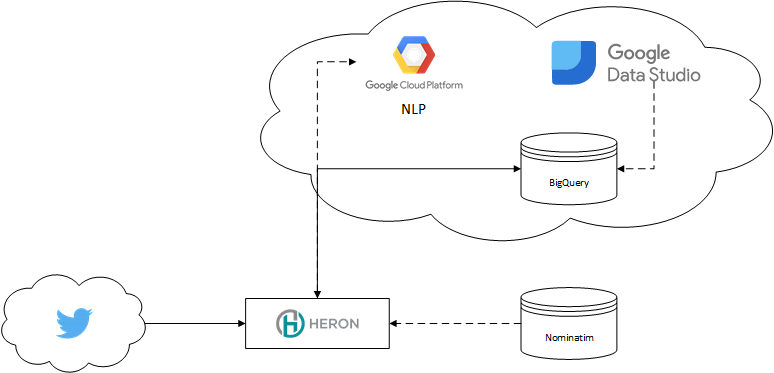 Architecture (simplified)\

Heron serves as our Stream processing engine and local ML, Nominatim on Postgres serves as Geo-Decoder.

On Google Cloud, we use the NLP API to enrich data, BigTable and BigQuery for storage and Data Studio for visualization.

BigTable (think HBase) is used for simple, inexpensive mass-inserts, while BigQuery is used for analytics. For the sake of simplicity, I’ll refer to one of [my old articles](https://chollinger93.com/blog/?p=113) which explains quite a bit about when to use BigTable/Hbase and when not to.

## Hybrid Cloud

While the notion of “Hybrid Cloud” warrants its own article, allow me to give you an introduction what this means in this context.

For this article, I heavily utilized the Google Cloud stack. The Google NLP API provides me simple access to NLP libraries, without extensive research or complex libraries and training sets.

Google BigTable and BigQuery provide two serverless, powerful data storage solutions that can be easily implemented in your programming language of choice - BigTable simply uses the Apache HBase Interface.

Google Data Studio can access those Cloud-based sources and visualize them similar to what e.g. Tableau can achieve, without the need to worry about the complexity and up-front cost that come with such tools (which doesn't imply Data Studo can do all the things Tableau can).

At the same time, my Nominatim instance as well as my Heron Cluster still run on my local development machine. In this case, the reason is simply cost - setting up multiple Compute Engine and/or Kubernetes instances simply quickly exceeds any reasonable expense for a little bit of free-time research.

When we translate this into “business” terminology - we have a “legacy” system which is heavily integrated in the business infrastructure and the capital expense to move to a different technology does not warrant the overall lower TCO. Or something along those lines…

The following section describes the implementation of the solution.

## Reading from Twitter

First off, we are getting data from Twitter. We use the [twitter4j](https://github.com/yusuke/twitter4j) library for this. A Heron Spout consumes the data and pushes it down the line. We use a set of keywords defined in the conf.properties to consume an arbitrary topic.

Here, we ensure that a tweet contains location information, either from Twitter or via the user’s own profile.


if (location != null) {
    Document locDoc = Document.newBuilder()
            .setContent(location).setType(Type.PLAIN_TEXT).build();
 
    List<Entity> locEntitiesList = language.analyzeEntities(locDoc, EncodingType.UTF16).getEntitiesList();
    String locQuery = getLocQueryFromNlp(locEntitiesList);
 
    // Build query
    NominatimSearchRequest nsr = nomatimHelper.getNominatimSearchRequest(locQuery);
 
    // Add the results to a query, if accurate
    JsonNominatimClient client = nomatimHelper.getClient();
    ArrayList<String> reverseLookupIds = new ArrayList<>();
    List<Address> addresses = new ArrayList<>();
    if (!locQuery.isEmpty()) {
        addresses = client.search(nsr);
        for (Address ad : addresses) {
            logger.debug("Place: {}, lat: {}, long: {}", ad.getDisplayName(),
                    String.valueOf(ad.getLatitude()),
                    String.valueOf(ad.getLongitude()));
 
            Location loc = LocationUtil.addressToLocation(ad);
 
            // Filter out points that are not actual data points
            String osmType = ad.getOsmType();
 
            if (osmType != null && (osmType.equals("node") || osmType.equals("relation") ||
                    osmType.equals("administrative")) && loc.isWithinUSA()) {
                locList.add(loc);
                reverseLookupIds.add(loc.getReverseLookupId());
            }
        }
    }


You could re-route users that do not use location data to an alternate pipeline and still analyze their tweets for sentiments and entries.

## Understanding Twitter locations

The next bolt applies the Google Natural Language Toolkit on two parts of the tweet: It’s content and the location.

For an example, let’s use [my own tweet](https://twitter.com/chollinger93/status/934533477869015040) about the pointless “smart” watch I bought last year. If we analyze the tweet’s text, we get the following result:

(Granted, this isn’t the best example – I simply don’t tweet that much)

For this article, we won’t focus too much on the actual content. While it is a fascinating topic in itself, we will focus on the **location** of the user for now.

When it comes to that, things become a little more intriguing. When people submit tweets, they have the option to add a GPS location to their tweet – but unless you enable it, this information simply returns null. Null Island might be a thing, but not a useful one.

However, we can also assume that many users use their profile page to tell others something about themselves – including their location. As this data gets exposed by Twitter’s API, we get something like this:

While a human as well as any computer can easily understand my profile – it means Atlanta, Georgia, United States Of America, insignificant little blue-green planet (whose ape-descended lifeforms are so amazingly primitive that they still think digital smart watches are a great idea), Solar System, Milky Way, Local Group, Virgo Supercluster, The Universe – it’s not so easy for the more obscure addresses people put in their profile.

A random selection -

- What used to be Earth
- Oregon, (upper left)
- in a free country
- MIL-WI
- Oban, Scotland UK 🎬🎥🎥🎬
- United States
- your moms house
- Between Kentucky, Ohio
- Savannah Ga.
- Providece Texas A@M Universty
- USA . Married over 50 yrs to HS Sweetheart
- 24hrs on d street hustling

(All typos and emojis - the tragedy of the Unicode standard - were copied “as is”)

In case you are wondering, “your moms house” is in Beech Grove, IN.

The sample set I took most of this data from had only 25 entries and were parsed by hand. Out of those, 16 used ANSI standard INCITS 38:2009 for the state names, but in various formats.

A whole 24% used what I called “other” - like “your moms house”.

On a bigger scale, out of a sample set of 22,800 imported tweets, 15,630 (**68%**) had some type of location in their profile, but only 11 had their actual GPS location enabled.

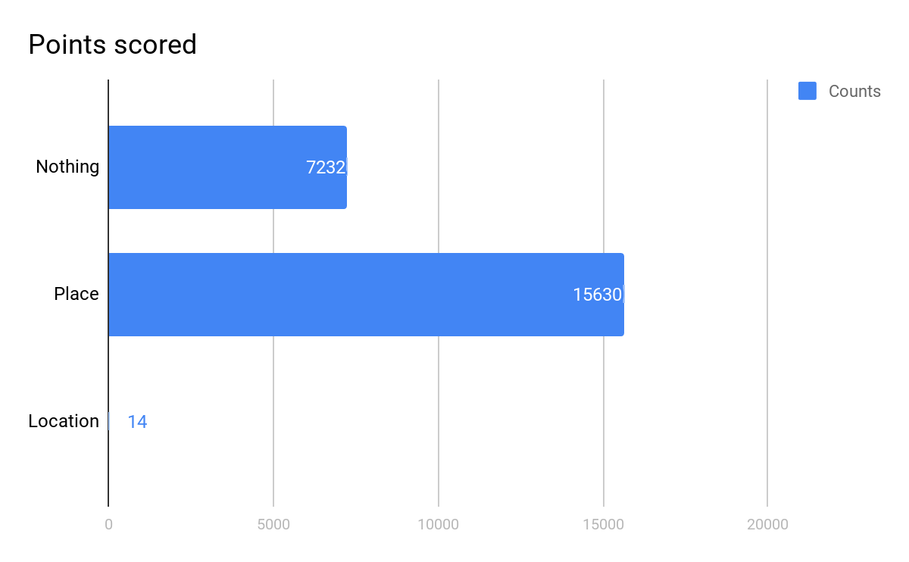

For the time, we can conclude that most Twitter users tell us something about their location - intentional or not. For a more scientific approach, [here’s a link](http://journals.plos.org/plosone/article?id=10.1371/journal.pone.0142209) - keep in mind that my data is a random selection.

However - using user-entered data always results in messy, fuzzy, non-structured data. This has been a problem way before the terms “Machine Learning” or “Analytics” exceeded any marketing company’s wildest dreams. Levenshtein-Distance record matching, anyone?

## Using NLP to identity entities & locations

At this point, Google’s NLP toolkit comes into play again. We use the NLPT to get all locations from the user’s self-entered “place” to identify everything that has the LOCATION metadata flag.

This is simple for something like this:

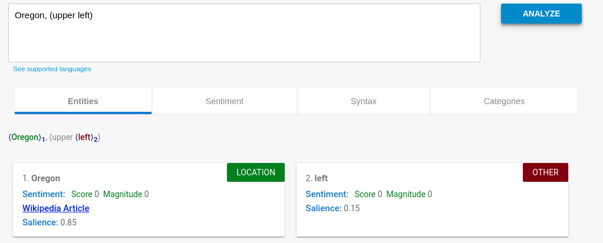

“Oregon” is clearly the location we need. We were able to strip of “upper left” - and could even weigh this based on the specific salience value.

However, more obscure queries result in more random results:

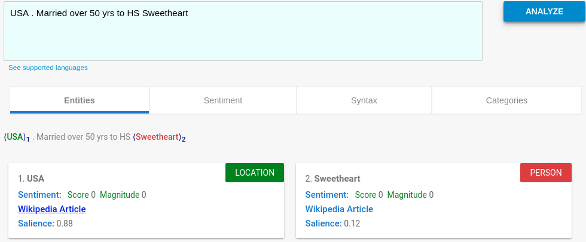

But even here, we get the core of the statement - USA - with a high confidence level.

The more random place descriptions (such as “a free country”) naturally only produce low-quality results - which is why we should filter results with a low salience score. While this only means “relative to this set of text, this entity is relatively important/unimportant”, it does serve as a rough filter.

In order to use more standardized data, we can also use the wikipedia\_url property of the NLP toolkit (if available) and extract a more useful string. This results in “Baltimore, MD” to be turned into “Baltimore Maryland”, for instance.

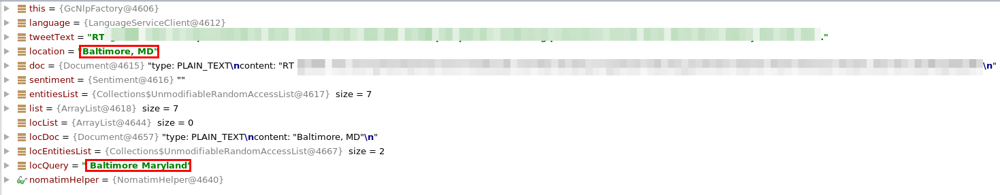

However, “Atlanta” turns into “Atlanta (TV Series)” - so use it with caution.


public static List<Cluster<Location>> dbscanWithHaversine(ArrayList<Location> input) {
    DBSCANClusterer<Location> clusterer = new DBSCANClusterer<>(EPS, MIN_POINTS, new HaversineDistance());
    return clusterer.cluster(input);
}



public class HaversineDistance implements DistanceMeasure {
    @Override
    public double compute(double[] doubles, double[] doubles1) throws DimensionMismatchException {
        if (doubles.length != 2 || doubles1.length != 2)
            throw new DimensionMismatchException(doubles.length, doubles1.length);
 
        Location l1 = new Location("A", doubles[0], doubles[1],0,"N/A");
        Location l2 = new Location("B", doubles1[0], doubles1[1],0,"N/A");
        return MathHelper.getHaversineDistance(l1, l2);
    }
}



public static double getHaversineDistance(Location loc1, Location loc2) {
    Double latDistance = toRad(loc2.getLatitude() - loc1.getLatitude());
    Double lonDistance = toRad(loc2.getLongitude() - loc1.getLongitude());
    Double a = Math.sin(latDistance / 2) * Math.sin(latDistance / 2) +
            Math.cos(toRad(loc1.getLatitude())) * Math.cos(toRad(loc1.getLatitude())) *
                    Math.sin(lonDistance / 2) * Math.sin(lonDistance / 2);
    Double c = 2 * Math.atan2(Math.sqrt(a), Math.sqrt(1 - a));
    return R * c;
}


## Reverse Geocoding & Clustering indecisive answers

The next step, assuming we received unstructured location data, we will try to convert that data into a query for a location service that supports reverse geocoding. Location services and their respective APIs are plentiful online - as long as it is able to convert a query of location data into a set of potential matches, we will be able to use that data.

In this case, we are using the **Nominatim** client from OpenStreetMap. Given the data volume, it is advisable [to host Nominatim on Kubernetes](https://github.com/peter-evans/nominatim-k8s) or your [local development machine](http://nominatim.org/release-docs/latest/appendix/Install-on-Centos-7/) - the openstreetmap servers _will_ block your IP if you accidentally DDos them or simply don’t respect their Fair Use Policy - and the velocity of streaming tends to violate basically every Fair Use clause in existence.

OpenStreetMap will return a list of potential matches. Take this example when our location is “Springfield” and we limit the results to 20:

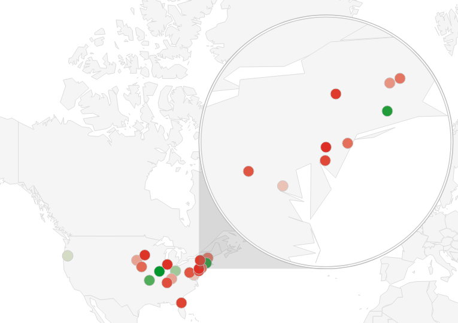 Springfield data points

As you can see, this is not conclusive. So we need to find a way to figure out which result is most accurate.

_Fun Fact: Without a country boundary on the US with Nominatin, this is what “Detroit Michigan” produces:_

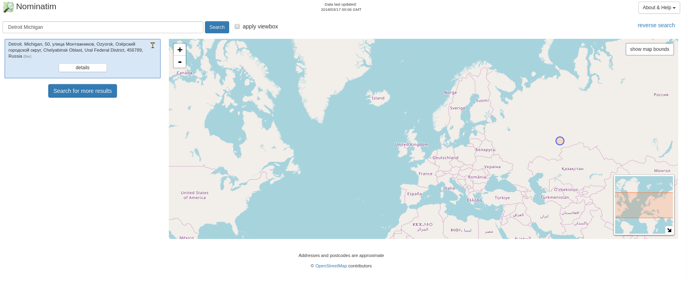

#Using clustering to approximate locations

In order to figure out where on the map our result is, we use Density-based spatial clustering of applications with noise (**DBSCAN**), a clustering algorithm that maps points by their density and also takes care of any outliers.

 DBSCAN illustration

I found [this article's](https://algorithmicthoughts.wordpress.com/2013/05/29/machine-learning-dbscan/) description of the algorithm most conclusive. Short version - for a dataset of n-dimensional data points, a n-dimensional sphere with the radius ɛ is defined as well as the data-points within that sphere. If the points in the sphere are > a defined number of min\_points, a cluster is defined. For all points except the cener, the same logic is applied recursively.

As DBSCAN requires the ɛ parameter to be set to the maximum distance between two points for them to be considered as in the same neighborhood. In order to set this parameter to a meaningful value, we use the **Haversine distance** to get the orthodromic distance on a sphere - in our case, a rough approximation of the earth and therefore a result in kilometeres between locations.

The Haversine function is defined as such -

where

- hav is the [haversine](https://en.wikipedia.org/wiki/Haversine) function:

- d is the distance between the two points (along a [great circle](https://en.wikipedia.org/wiki/Great_circle) of the sphere; see [spherical distance](https://en.wikipedia.org/wiki/Great-circle_distance)),
- r is the radius of the sphere,
- φ1, φ2: latitude of point 1 and latitude of point 2, in radians
- λ1, λ2: longitude of point 1 and longitude of point 2, in radians

In our case , r is defined as the radius of the earth, 6,371 km.

To combine those, we can use the org.apache.commons.math3.ml package. All we need to do is implement the **DistanceMeasure** interface (as well as the function for the Haversine distance itself).


public static List<Cluster<Location>> dbscanWithHaversine(ArrayList<Location> input) {
    DBSCANClusterer<Location> clusterer = new DBSCANClusterer<>(EPS, MIN_POINTS, new HaversineDistance());
    return clusterer.cluster(input);
}



public class HaversineDistance implements DistanceMeasure {
    @Override
    public double compute(double[] doubles, double[] doubles1) throws DimensionMismatchException {
        if (doubles.length != 2 || doubles1.length != 2)
            throw new DimensionMismatchException(doubles.length, doubles1.length);
 
        Location l1 = new Location("A", doubles[0], doubles[1],0,"N/A");
        Location l2 = new Location("B", doubles1[0], doubles1[1],0,"N/A");
        return MathHelper.getHaversineDistance(l1, l2);
    }
}



public static double getHaversineDistance(Location loc1, Location loc2) {
    Double latDistance = toRad(loc2.getLatitude() - loc1.getLatitude());
    Double lonDistance = toRad(loc2.getLongitude() - loc1.getLongitude());
    Double a = Math.sin(latDistance / 2) * Math.sin(latDistance / 2) +
            Math.cos(toRad(loc1.getLatitude())) * Math.cos(toRad(loc1.getLatitude())) *
                    Math.sin(lonDistance / 2) * Math.sin(lonDistance / 2);
    Double c = 2 * Math.atan2(Math.sqrt(a), Math.sqrt(1 - a));
    return R * c;
}


By putting 2 and 2 together, we get a DBSCAN implementation that accepts an ɛ in kilometers.

While choosing the parameters for the DBSCAN algorithm can be tricky, we use **150km / 93mi** as the max. Radius of a cluster and assume that a single point is valid for a cluster. While this, in theory, produces a lot of noise, it is an accurate statement for clustering our location set.

For interpreting our clusters (and choosing the one that is seemingly correct), we rely on the average “importance” value of OpenStreetMap, which aggregates multiple important metrics (from e.g., Wikipedia) to “score” a place.

If the user’s location contains part of a state as String (e.g., Springfield, IL), we increase the importance score during execution.

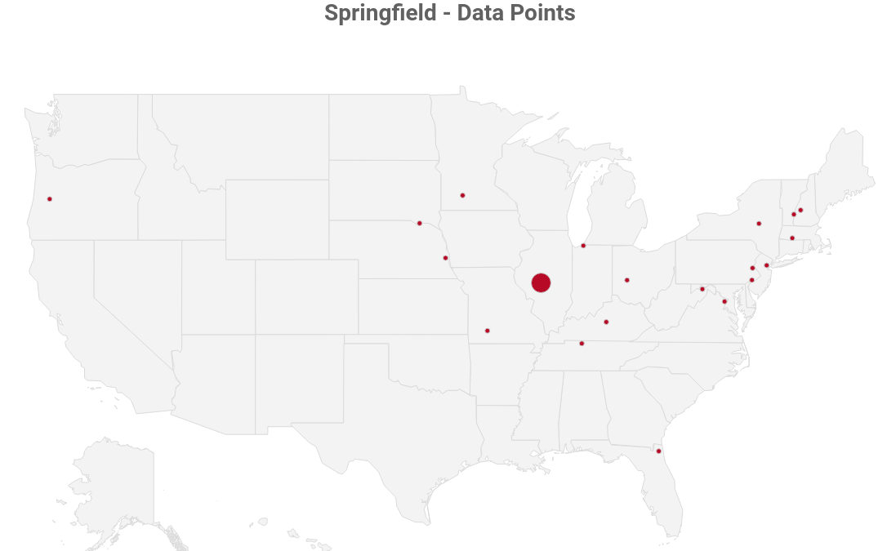 Springfield, data points
 

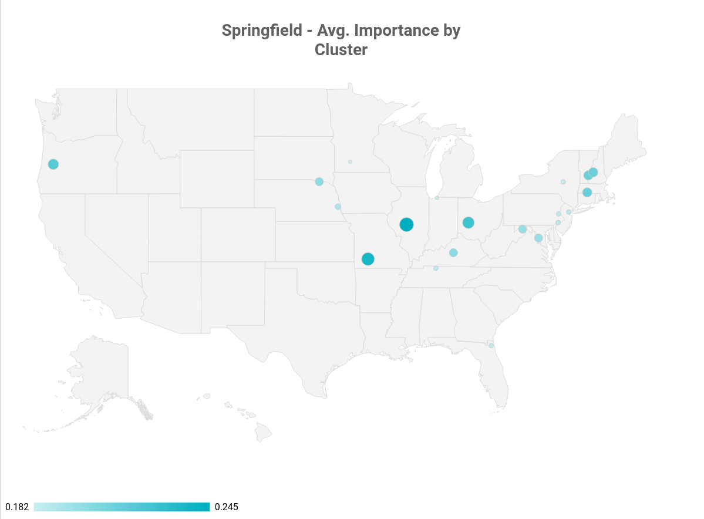 Springfield, avg. importance by cluster

In our Springfield example, **Springfield, IL** is the state capital of Illinois - and that is one of the reasons why the OpenStreetMap data ranks it higher than the entire Springfield, MA cluster (which consists of Springfield, MA, Springfield, VT and Springfield, NH - despite their combined population being bigger than Illinois’ state capitol).

Assuming we have multiple points in a cluster, we take the average between all coordinates in it. This is accurate enough in a ~90mi radius and results in the rough center of the (irregular) polygon that is our cluster.

While I’ve just explained that Springfield, IL could be considered an accurate result, in order to illustrate the averaging, we simply remove Springfield, IL from the equation and our “best” cluster looks like this:

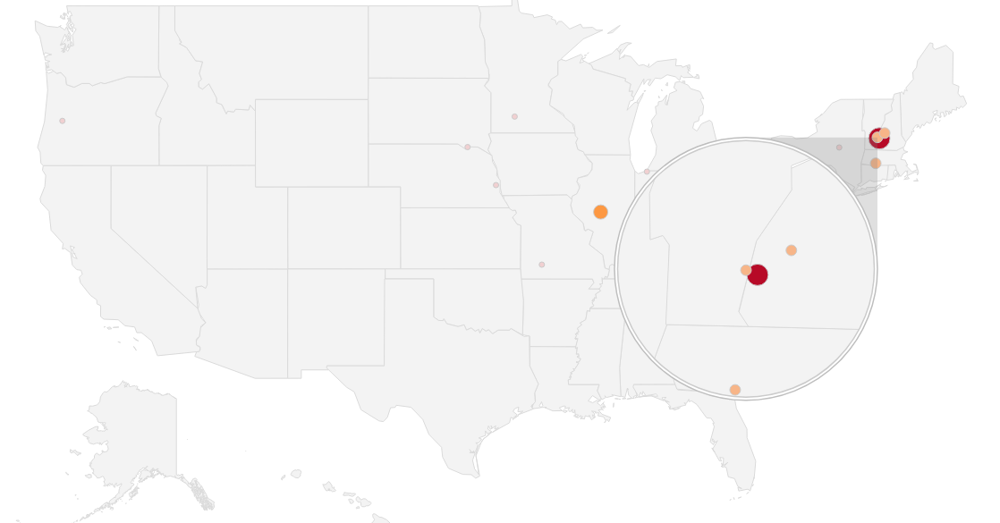 Sample Cluster for Springfield, MA

(The red dot in the middle is the average coordinate result)

Finally, we retrofit the calculated location data to a US state. For this, we have 2 options -

- Call Nominatim again, resulting in another relatively expensive API call
- Approximate the result by using a local list of rough state boundaries

While both methods have their pros and cons, using a geo provider undoubtedly will produce more accurate results, especially in cities like NYC or Washington DC, were we have to deal with close state borders to any given point.

For the sake of simplicity and resource constraints, I’m using a singleton implementation of a GSON class that reads a [list of US states with rough boundaries](http://econym.org.uk/gmap/states.xml) that I’ve mapped from XML to JSON.

In our case, the result is either New Hampshire or Illinois, depending if we remove Springfield, IL nor not.

#Other examples

Now, what tells us that somebody who states they are from “Springfield” simply likes the Simpsons?

Well, nothing. While it is advisable to store multiple potential location results and re-visit that data (or even use a different algorithm with a proper training set based on that), the architecture and algorithms works surprisingly well - some random profiling produced mostly accurate results, despite various input formats:

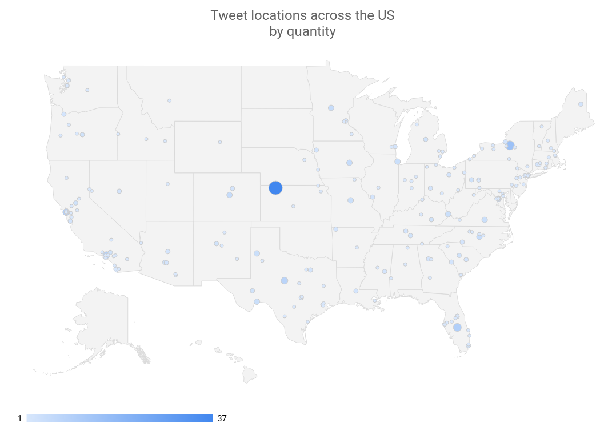 Sample Tweet locations across the US by quantity

(The big dot in the middle represents the location “USA”)

| Original Location            | Result                                                                                                                                                                                    | Accurate |
|------------------------------|-------------------------------------------------------------------------------------------------------------------------------------------------------------------------------------------|----------|
| Philadelphia                 | Philadelphia, Philadelphia County, Pennsylvania, United States of America                                                                                                                 | TRUE     |
| Brooklyn, NY                 | BK, Kings County, NYC, New York, 11226, United States of America                                                                                                                          | TRUE     |
| nebraska                     | Nebraska, United States of America                                                                                                                                                        | TRUE     |
| United States                | United States of America                                                                                                                                                                  | TRUE     |
| Truckee, CA                  | Truckee, Donner Pass Road, Truckee, Nevada County, California, 96160, United States of America                                                                                            | TRUE     |
| Lafayette, LA                | Lafayette, Tippecanoe County, Indiana, United States of America                                                                                                                           | TRUE     |
| Minot, North Dakota          | Minot, Ward County, North Dakota, United States of America                                                                                                                                | TRUE     |
| Rocky Mountain hey!          | Rocky Mountain, Harrisonburg, Rockingham County, Virginia, United States of America                                                                                                       | TRUE     |
| Living BLUE in Red state AZ! | Arizona, United States of America                                                                                                                                                         | TRUE     |
| Earth Two, Darkest Timeline  | Earth Tank Number Two, Fire Road 46, Socorro County, New Mexico, United States of America                                                                                                 | FALSE    |
| The Golden State             | Golden, Jefferson County, Colorado, United States of America                                                                                                                              | FALSE    |
| Atlanta, GA                  | Atlanta, Fulton County, Georgia, United States of America                                                                                                                                 | TRUE     |
| thessaloniki                 | Thessaloniki Jewelry, 31-32, Ditmars Boulevard, Steinway, Queens County, NYC, New York, 11105, United States of America                                                                   | FALSE    |
| newcastle                    | Newcastle, Placer County, California, 95658, United States of America                                                                                                                     | TRUE     |
| Afton, VA                    | Afton, Lincoln County, Wyoming, 83110, United States of America                                                                                                                           | FALSE    |
| Gary, IN / Chicago, IL       | Chicago, Cook County, Illinois, United States of America                                                                                                                                  | TRUE     |
| Canada                       | Canada, Pike County, Kentucky, 41519, United States of America                                                                                                                            | FALSE    |
| Southern California          | Southern California Institute of Architecture, 960, East 3rd Street,  Arts District, Little Tokyo Historic District, LA, Los Angeles County,  California, 90013, United States of America | TRUE     |
| San Francisco Bay Area       | San Francisco Bay Area, SF, California, 94017, United States of America                                                                                                                   | TRUE     |
| Southern CA                  | Southern California Institute of Architecture, 960, East 3rd Street,  Arts District, Little Tokyo Historic District, LA, Los Angeles County,  California, 90013, United States of America | TRUE     |

(All of these results come with latitude and longitude, state data and the full user profile and tweet metadata)

More importantly, tuning those results is just an exercise in careful profiling. We could filter out obvious countries that are not the US, tune the model parameters or the API calls.

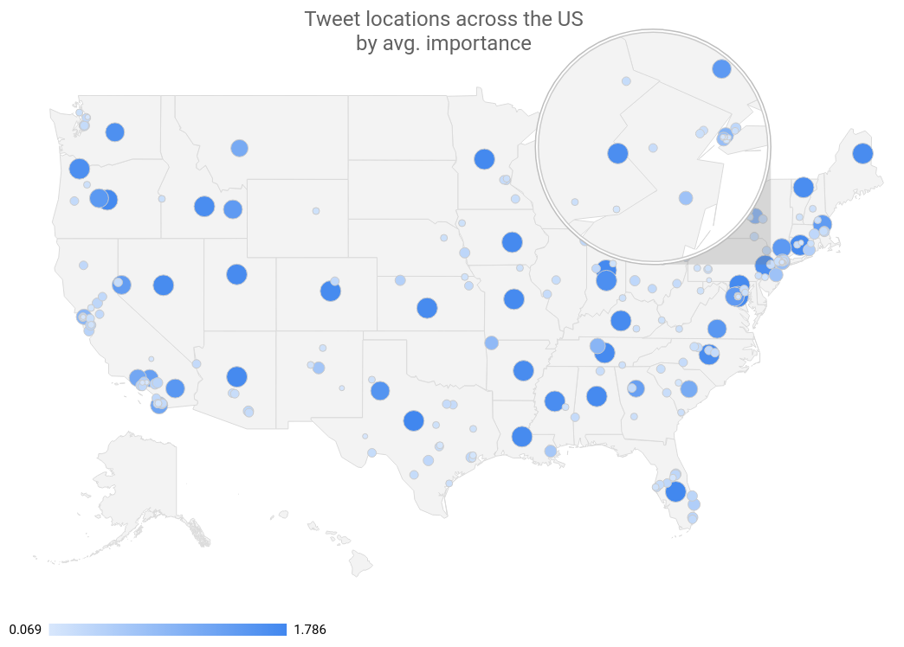 Tweet locations across the US by avg. importance

(In this example, big points indicate a high confidence level; often points in the geographical center of a state hint that the user simply said they were from e.g. "Arizona", "AZ" or "Living BLUE in Red state AZ!")

## Summary

While the example shown here is a simple proof of concept, extending the concept has plenty of opportunities -

- Fine-tune the model, filtering obvious outliers
- Build a data model that connects location data with the tweets, all other available metadata
- Store multiple salience values per analysis, tuning the model based on the data
- Run the topology on scale and apply it to all tweets concerning a certain topic, analyzing the big picture and calculating for false positives
- Run regression or other analysis over users entries with the same ID and potential mismatches, tracking changes in the location; write a pipeline that flags users which use their location and retrofit all old results to an accurate GPS
- Store users without location data and apply the above logic to those

One thing we can conclude is that using a combination of well-known, powerful local Big Data tools in combination with managed, equally powerful Cloud solutions opens the door for a massive variety of new analytics opportunities that required a much higher level of involvement and cost only a few years ago.

The next steps will be to combine this data with the actual location results, create heatmaps, fine-tune the model, and eventually move the whole solution to the Google Cloud Platform.

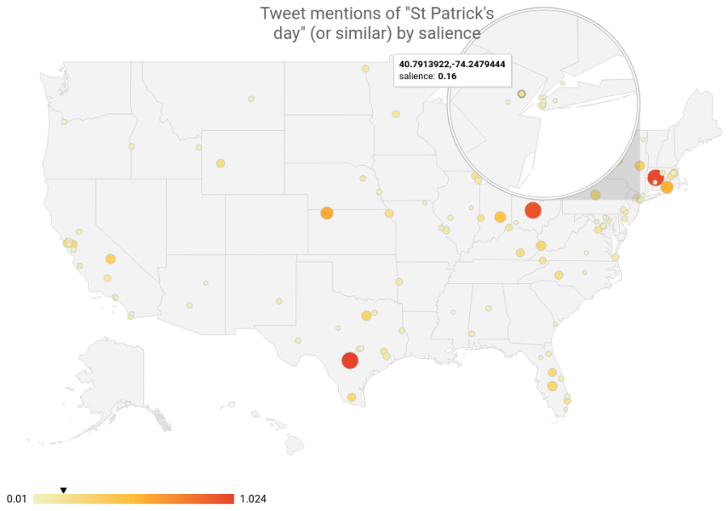 Sample entity analysis

_All development was done under Fedora 27 with 16 AMD Ryzen 1700 vCores @ 3.2Ghz and 32GiB RAM. Nominatim planet data from 2018-03-15 was stored on a 3TB WD RED Raid-1 Array_

_Software Stack:_ _Heron 0.17.6,_ _Google Cloud Language API 1.14.0,_ _Google Cloud BigTable API 1.2.0, Google Cloud BigQuery API 0.32.0-beta,_ _Google Data Studio,_ _Nominatim 3.1.0,_ _PostgreSQL 9.6.8_
