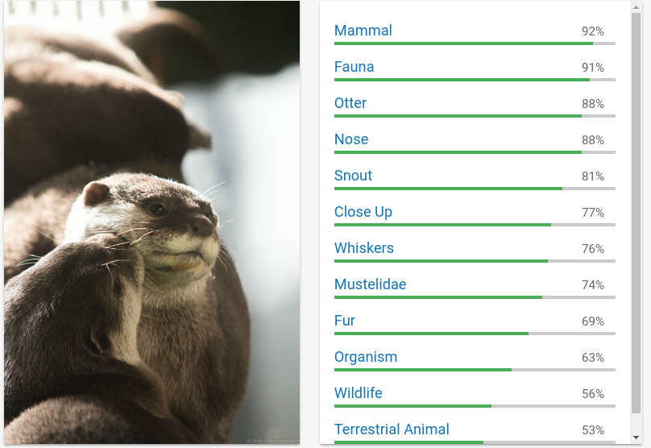
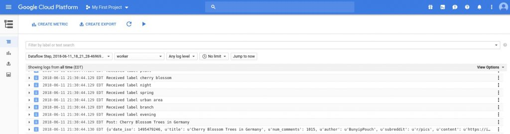
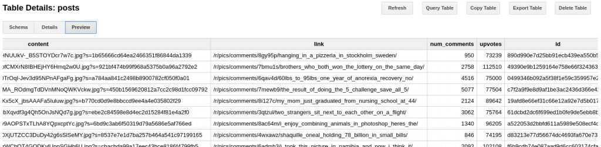
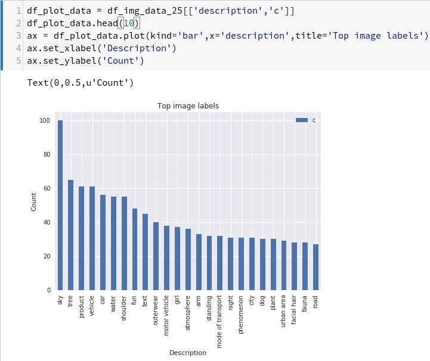
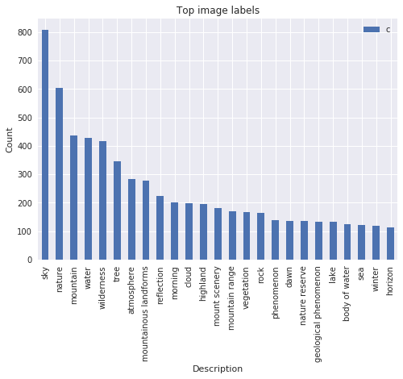
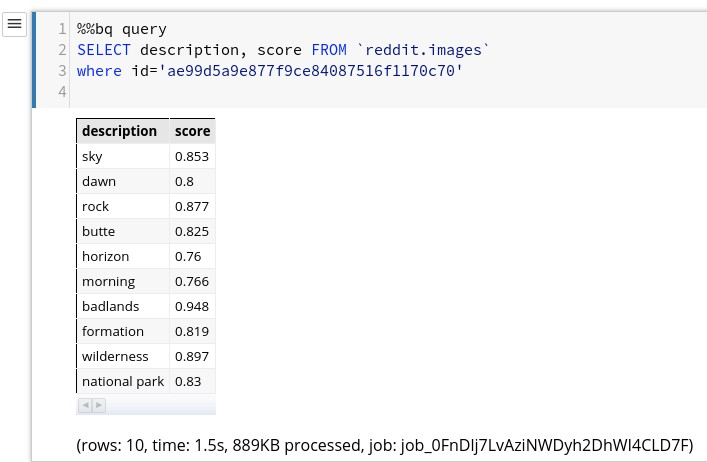
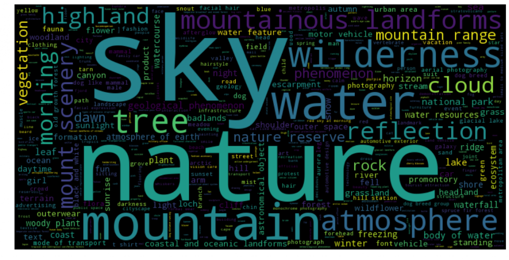
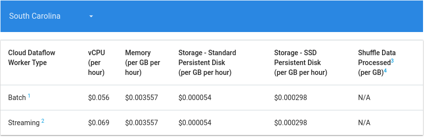
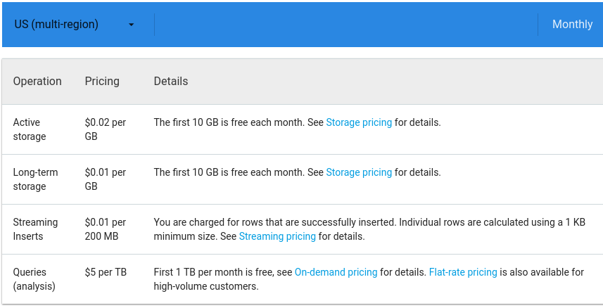
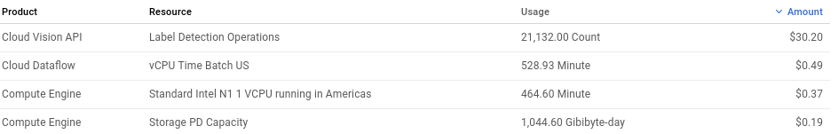

## Introduction

In this article (and its successors), we will use a fully serverless Cloud solution, based on Google Cloud, to analyze the top Reddit posts of the 100 most popular subreddits. We will be looking at images, text, questions, and metadata._

We aim to answer the following questions:

- What are the top posts?
- What is the content of the top posts? What types of images are popular?
- When is the best time to post to reddit?
- Is “99% of the Karma” really in the hand of the “top 1% of posters”?

This will be the first part of multiple; we will be focussing on the data processing pipeline and run some exemplary analysis on certain image-based subreddits using the **Cloud Vision API**.

The source code for this is [available on GitHub](https://github.com/chollinger93/reddit-ml-analysis) under the GNU General Public License v3.0.

## What is Reddit?

Reddit is a social network where people post pictures of cats and collect imaginary points, so-called “upvotes”.

> “**Reddit** ([/ˈrɛdɪt/](https://en.wikipedia.org/wiki/Help:IPA/English), stylized in its logo as **reddit**) is an American [social news](https://en.wikipedia.org/wiki/Social_news) [aggregation](https://en.wikipedia.org/wiki/Social_network_aggregation), web content [rating](https://en.wikipedia.org/wiki/Rating_site), and [discussion](https://en.wikipedia.org/wiki/Internet_forum#Discussion) website. Registered members submit content to the site such as links, text posts, and images, which are then voted up or down by other members. Posts are organized by subject into user-created boards called "subreddits", which cover a variety of topics including news, science, movies, video games, music, books, fitness, food, and image-sharing. Submissions with more up-votes appear towards the top of their subreddit and, if they receive enough votes, ultimately on the site's front page.”

([https://en.wikipedia.org/wiki/Reddit](https://en.wikipedia.org/wiki/Reddit))

Reddit is the [3rd most popular site in the US](https://www.alexa.com/siteinfo/reddit.com) and provides a wonderful basis for a lot of interesting, user-generated data.

## Technology & Architecture

We will be using the following technologies:

- Python 2.7.3
- Cloud Dataflow / Apache Beam
- BigQuery
- Google Cloud Storage (GCS)
- Cloud ML / Vision API
- Cloud Datalab

Resulting in the following architecture -

 Architecture

Compute Engine or Cloud shell are used to run the data gathering Python script and stores the data to Cloud Storage.

Dataflow and Cloud Vision API will be used to process the data and store it to BigQuery.

DataLab will be used to analyze & visualize the data.

## Gathering Data

For gathering the initial data, we will use a simple Python script using the reddit [praw](https://github.com/praw-dev/praw) library. You can run this from your Google Cloud Shell or your local desktop (or a Compute Engine instance).

This code will do the following:

- Pull the “top” posts of all time from the 100 most popular subreddits, up to a limit you define (I took 1,000 for this article)
- Detect the type of post:
    - Self - text
    - Question - simply a title (like in /r/askreddit)
    - extMedia - external media (images, videos)
    - Link - external links, e.g. to blog posts
- Add a unique ID to the post by MD5-hashing the title and timestamp
- Store the result as JSON, split by subreddit
- Upload the JSON to GCS


class DictEncoder(json.JSONEncoder):
    def default(self, obj):
        return obj.__dict__
 
 
class Post:
    def __init__(self, title, subreddit, author, upvotes, date_iso, link, type, num_comments, content):
        self.id = hashlib.md5((title + str(date_iso)).encode('utf-8')).hexdigest()
        self.title = title
        self.subreddit = subreddit
        self.author = author
        self.upvotes = upvotes
        self.date_iso = int(date_iso)
        self.link = link
        self.type = type
        self.num_comments = num_comments
        self.content = content
 
    def __str__(self):
        return "{title}, upvotes: {up}, date: {date}, link: {link}, content: {content}".format(
            title=self.title.encode('utf8'),
            up=self.upvotes,
            date=time.strftime('%Y-%m-%d %H:%M:%S', time.localtime(self.date_iso)).encode('utf8'),
            link=self.link.encode('utf8'),
            content=self.content.encode('utf-8'))
 
 
def get_top_posts(subreddit, reddit, limit):
    # Store posts
    posts = []
 
    for submission in reddit.subreddit(subreddit).top(limit=limit):
        if submission.pinned:
            continue
 
        try:
            if submission.is_self and submission.selftext is not None:
                # Self post - text
                content = submission.selftext
                _type = 'self'
            elif submission.is_self and submission.selftext is None:
                # Self post - no header - askreddit etc.
                content = submission.title
                _type = 'question'
            elif submission.url is not None and submission.preview is not None and submission.preview.__len__ &gt; 0 \
                    and 'images' in submission.preview and submission.preview['images'].__len__ &gt; 0:
                # External media - store preview if available
                content = submission.preview['images'][0].get('source').get('url')
                _type = 'extMedia'
            elif submission.url is not None and submission.media is not None:
                # External media
                content = submission.url
                _type = 'extMedia'
            elif submission.url is not None and submission.media is None:
                # External link
                if 'imgur' in submission.url or '.jpg' in submission.url or '.png' in submission.url or '.gif' in submission.url:
                    _type = 'extMedia'
                else:
                    _type = 'link'
                content = submission.url
            else:
                # Empty post
                content = None
                _type = 'none'
                continue
 
            post = Post(submission.title, submission.subreddit_name_prefixed, submission.author.name, submission.ups,
                        submission.created, submission.permalink,
                        _type, submission.num_comments, content)
            posts.append(post)
            print("subreddit: {subreddit}".format(subreddit=submission.subreddit_name_prefixed))
        except Exception as e:
            print(e)
            continue
 
        # https://github.com/reddit-archive/reddit/wiki/API
        # Honor fair use terms - 60 requests per minute
        time.sleep(1)
 
    return posts
 
 
def write_json_gcp(_input=config.creddit['file'], _output=config.cgcp['file'], bucket_name=config.cgcp['bucket']):
    from google.cloud import storage
    # Instantiates a client
    storage_client = storage.Client()
 
    # Gets bucket
    bucket = storage_client.get_bucket(bucket_name)
    blob = bucket.blob(_output)
 
    # Upload
    blob.upload_from_filename(_input)
    print('Uploaded {} to {} in bucket {}'.format(_input, _output, bucket_name))
 
 
def main():
    # Get reddit instance
    reddit = praw.Reddit(client_id=config.creddit['client_id'],
                         client_secret=config.creddit['client_secret'],
                         user_agent=config.creddit['user_agent'])
    # Set GCP path
    os.environ['GOOGLE_APPLICATION_CREDENTIALS'] = config.cgcp['api_key']
    LIMIT = config.limit
 
    # Define top subreddits
    csv = 'subreddit|type|title|upvotes|num_comments|content|author|date\n'
    subreddits = ['announcements', 'funny']
    # (Full list on GitHub)
    posts = []
    flat_json = ''
    # Enable for debugging
    #subreddits = ['pics']
 
    for subreddit in subreddits:
        flat_json = ''
        try:
            top_posts = get_top_posts(subreddit, reddit, LIMIT)
            posts = posts + top_posts
 
            for post in top_posts:
                flat_json += json.dumps(post.__dict__) + '\n'
 
            if config.use_json_array == 'true':
                # Write back Json as array
                with open(subreddit + config.creddit['file'], 'a') as file:
                    file.write(json.dumps([ob.__dict__ for ob in posts]))
            else:
                # Write back JSON one line at a time for DataFlow
                with open(subreddit + config.creddit['file'], 'a') as file:
                    file.write(flat_json.encode('utf8'))
 
            write_json_gcp(subreddit + config.creddit['file'], subreddit + config.creddit['file'])
        except Exception as e:
            print(e)
            print('Encountered error, skipping record')
            continue
 
 
if __name__ == "__main__":
    main()


The resulting JSON has the following structure:


{
  "date_iso": 1515704703,
  "author": "unknown_human",
  "num_comments": 4109,
  "title": "Meeting Keanu Reeves at a traffic light",
  "subreddit": "r/pics",
  "content": "https://i.redditmedia.com/txql52xsvYCE8qkOxDL3WZfTt9b_bv2XqVI9mopa4kg.jpg?s=2b315defb2812191eb14fea6111376a8",
  "link": "/r/pics/comments/7pnxv2/meeting_keanu_reeves_at_a_traffic_light/",
  "upvotes": 200378,
  "type": "extMedia",
  "id": "4f6541b8b9b98e26346a228312a1b662"
}


The reason we don’t run this through a distributed system is reddit’s “Fair Use” API policy, which limits us to 1 API call per second, therefore rendering high-performance computing fairly pointless.

## Cloud Vision API

Before we dive into the data processing on the cloud, let’s quickly talk about image recognition.

Google’s Cloud Vision API is a powerful tool to quickly analyze an image’s content and detect its relevant features and relative importance within the image.

It abstracts the actual machine learning models from the user and makes it a fantastic tool to integrate in any data processing pipeline, as it doesn’t require you to actually figure out your own model or to train it. While CloudML does enable you to figure all this out with, say, TensorFlow, chances are that a lot of use cases will not require that level of effort.

Take this example of a picture of an otter I took in the Atlanta Zoo the other day and review the labels the Cloud Vision API returned:

 Cloud Vision Example 1

These are the labels the vision API detected -


{
  "labelAnnotations": [
    {
      "mid": "/m/035qhg",
      "description": "fauna",
      "score": 0.9405464,
      "topicality": 0.9405464
    },
    {
      "mid": "/m/089v3",
      "description": "zoo",
      "score": 0.8177689,
      "topicality": 0.8177689
    },
   ...  
   ]


As you can see, the seemingly main content of the image, the animal, has a relatively low score, as it is only a small part of the image. It did, however, interpolate the fact that this was taken in the zoo (as opposed to in the wild) based off the image’s other features, such as the artificial riverbed.

Now, compare it to another picture of two otters I took in a different Zoo in the UK a couple of years ago:

 Cloud Vision Example 2

Here, we can clearly see that the model correctly identified the content, but got into a much higher level of detail, given the absence of noise from the surroundings.

Taking this into account, we need to keep a couple of things in mind about our data:

- We need to filter out low probabilities
- We need to ensure not to consider too generic terms, for instance “meal” when looking at images from /r/food

You can try out the Cloud VIsion API here: [https://cloud.google.com/vision/](https://cloud.google.com/vision/)

## Introducing Data Flow

In the next step, we utilize Cloud Data Flow to process the data further.

Dataflow is based on the Apache Beam API and is an auto-scaling data-processing framework. It follows a fairly simple programming model in either Python or Java, relying on immutable, distributed collections (PCollections) and functions that get applied to one line of an input file at a time.

Dataflow is fully managed (serveless) and auto-scales to more processing nodes when required.

Similar to Apache Spark, Beam can use the same code for streaming and batch data. You can also run it on e.g. Flink or Spark, but for the sake of having a serverless architecture, we will focus on Data Flow.

For more details, I will refer you to the [official Apache Beam documentation](https://beam.apache.org/get-started/wordcount-example/).

## The Data Flow Pipeline

 Data Flow Pipeline

We will be doing the following processing steps:

- Read the JSON, decode it
- Split records with images (type extMedia)
- Get the image [0]
- Apply the VisionAPI
- Store the results (image VisionAPI output and posts) to BigQuery in two separate tables

First off, we read the initial JSON and decode it to a Python dict. The current example reads one JSON at a time; you could also read multiple files.


with beam.Pipeline(options=pipeline_options) as p:
    records = (
        p |
        ReadFromText(known_args.input, coder=JsonCoder()) |
        'Splitting records' &gt;&gt; beam.ParDo(Split())
    )


The code also splits the inputs by their type tag to identify images.


class Split(beam.DoFn):
    def process(self, record):
 
        _type = record['type']
        if _type == 'self' or _type == 'link':
            return [{
                'post': record,
                'image': None
            }]
        elif _type == 'extMedia':
            return [{
                'post': record,
                'image': record['content']
            }]
        else:
            return None


Next, we get the image from the data, store it to GCS, apply the VisionAPI, and finally return another dict for our images table. We resize the image to ensure we don't hit the Vision API's 10MiB file limit per request.


def process(self, record):
    logging.info('Image: ' + record['image'])
    tmpuri = self.tmp_image_loc + record['post']['id'] + '.jpg'
    # Download the image, upload to GCS
    urllib.urlretrieve(record['image'], tmpuri)
    self.write_gcp(tmpuri, self.outputloc + record['post']['id'] + '.jpg', self.bucket)
    labels = self.get_vision(tmpuri, record['post']['id'])


The resulting data contains the unique ID of the post, the subreddit, and label, and its specific topicality (the relevancy of the detected feature in the image) and its score.

Lastly, we write the results back to BigQuery:


posts | 'Write to BQ' &gt;&gt; beam.io.WriteToBigQuery(
    known_args.output,
    schema='date_iso:INTEGER,author:STRING,type:STRING,title:STRING,subreddit:STRING,content:STRING,link:STRING,num_comments:INTEGER,upvotes:INTEGER,id:STRING',
    create_disposition=beam.io.BigQueryDisposition.CREATE_IF_NEEDED,
    write_disposition=beam.io.BigQueryDisposition.WRITE_APPEND)


In order to run this pipeline, upload the file to Cloud Storage, download it to Cloud Shell and execute the following script:


python -m DataFlowReddit \
  --project ${PROJECT} \
  --runner DataflowRunner \
  --input ${INPUT} \
  --temp_location gs://${BUCKET}/tmp/ \
  --bucket ${BUCKET} \
  --staging_location gs://${BUCKET}/stg/ \
  --tmp /tmp/ \
  --useBigQuery true \
  --output reddit.posts \
  --imgOutput reddit.images \
  --requirements_file requirements.txt \
  --max_num_workers 24


During execution, you can always launch StackDriver to analyze the logs for any failures or progress:

 Stackdriver

_[0] As a disclaimer - it is generally speaking not a brilliant idea to run a very expensive operation - like multiple REST calls - on a pipeline. For the sake of simplicity, we will stick to the idea._

## A first look at the data

To take a look at the resulting data, we run a simple BigQuery query on the Web UI to take a look at the post prominent features of some hand-picked subreddit, for instance, /r/pics, where people post pictures of all sorts of things. Keep in mind, the BigQuery Preview feature is free.

 Big Query Example

We can see an overview of posts, upvotes, comments, the content (in this case, a link to the image), and the id. We will use this data to process the data further in DataLab.

## Analyzing the data with DataLab

For analyzing the data, we use DataLab. DataLab is pretty much comparable to Apache Zeppelin - a live, web-based notebook that enables us to analyze data and visualize it in notebooks that can be updated lived and easily shared, based on Jupyter.

It exposes all Google Cloud components in a simple Python environment where we can work on our data with Pandas Dataframes. If you are familiar with Apache Spark, this will come naturally.

In order to get our data, we use the %%bq directive in DataLab to store our query results form BigQuery into a variable. We then expose it to a Pandas Dataframe to take a look at the top results - you can run further data processing here.


%%bq query --name pics
SELECT
id,upvotes,num_comments,title, CAST(TIMESTAMP_SECONDS(date_iso) AS DATETIME) AS dt
FROM `reddit.posts`
WHERE lower(subreddit) = 'r/pics'
ORDER BY dt desc
LIMIT 1000; 
%%bq query --name picsImg
SELECT description,count(*) as c,sum(score) as score FROM `reddit.images`
where (lower(subreddit) like '%pics') and score>0.7 
group by description
order by c desc
LIMIT 1000



import pandas as pd
import google.datalab.storage as storage
from google.datalab import Context
import google.datalab.bigquery as bq
import pandas as pd
from io import BytesIO
 
# Variables
project = Context.default().project_id
BUCKET='your-bucket'
   
# Get dataframe
df_data = pics.execute(output_options=bq.QueryOutput.dataframe()).result()
df_data.head(10)
 
df_img_data = picsImg.execute(output_options=bq.QueryOutput.dataframe()).result()
df_img_data_25 = df_img_data.head(25)
df_img_data.head(10)


 DataLab

Next, we plot our results using our Pandas DataFrame from before.


df_plot_data = df_img_data_25[['description','c']]
df_plot_data.head(10)
ax = df_plot_data.plot(kind='bar',x='description',title='Top image labels')
ax.set_xlabel('Description')
ax.set_ylabel('Count')


 Top labels in /r/pics

As we can see, apparently having a lot of (seemingly beautiful) sky in your pictures gets you far. Trees, water or girls seem to help as well.

We can also take a look at [another popular subreddit](https://www.reddit.com/r/EarthPorn/) in combination with /r/pics. As the unnamed subreddit (for SEO reasons...) is focussed on nature, we get a much broader result concerning "nature" related labels -

 Popular Nature Labels

Finally, let's look at how the Vision API labeled one of the top posts, "Almost slept through this amazing sunrise at Monument valley, was glad I went out anyway! USA (OC)\[1920x1920\]" by /u/crpytodesign with 30k+ upvotes and ID ae99d5a9e877f9ce84087516f1170c70.

 https://redd.it/8q9m30

By simply running another %%bq directive, we can get the labels:

 Example Image Labels

Last but not least, let's generate a nice and simple wordcloud on DataLab using the [wordcloud library](https://github.com/amueller/word_cloud):

 Entity Wordcloud

Granted, this is not exactly an in-depth analysis - but it does illustrate the point on how to work with the data we gathered.

## A word about cost

Google Cloud bills you based on usage and the services we are using scale automatically. While certain services are offered free of charge, it is still important to understand that the cost of the deployed solution will be based on your job’s efficiency and data volume.

Dataflow, for instance, has the following cost structure based (as of June 2018):

 https://cloud.google.com/dataflow/pricing

While you can control the maximum number of workers, an inefficient job will rack up costs fairly quickly.

BigQuery’s pricing is based on the data that your query processes -

 https://cloud.google.com/bigquery/pricing

Which results in an inefficient query that has to read a huge set of data will result in an equally huge bill. Keep in mind that using LIMIT operations will not affect this, at it depends on the columns and resulting data volume that your query processes.

A similar concept applies to the ML APIs - just take a look at my billing data at the time of writing this article:

 Vision API Pricing

## Conclusion

While this exercise was simple in nature, it did illustrate certain key concepts -

- How to utilize a fully-managed Cloud environment on Google Cloud
- How to gather data and use Cloud Storage as a location for further processing
- How to use Cloud Dataflow to process data without having to worry about scaling nodes and even be prepared for a streaming application
- How to simply integrate powerful Machine Learning models
- How to use resources on-demand
- How to analyze data with simple notebooks and even chart the data

If we compare this effort to a “traditional” Hadoop approach, we stop some major differences and advantages -

- Simple, non-demanding development environment
- Existing tools and frameworks most of us are familiar with or at least can get familiar with very quickly (Python, Apache Beam <-> Spark/Storm…, DataLab <-> Zeppelin/Jupyter, BigQuery <-> Hive/Impala etc.)
- Barely any effort to manage environments, nodes, scaling, high-availability and other administrative tasks
- High throughput and performance without big optimization work

We also noticed some drawbacks and caveats to the approach -

- Google Cloud is billed on-demand - while it does prove to lower the overall TCO of a data environment, it is easy to accidentally run expensive queries, start too many workers, or to rack up a high bill by being careless
- We do lack the full control a completely Open Source solution might provide, given enough developer resources

Regardless of this - and other, more enterprise-level considerations - Google Cloud provided a great backend for a solution which would have been undoubtedly more complicated to realize using traditional Hadoop methodologies and tools.

In the next iteration of the article, we will run some more in-depth analysis and run a similar pipeline on other types of posts, such as text-based submissions.

_All development was done under Fedora 27 4.16.13-200.fc27.x86\_64 with 16 AMD Ryzen 1700 vCores @ 3.6Ghz and 32GiB RAM_
