## Introduction
In the [last iteration of this article](https://chollinger.com/blog/posts/2018/10/analyzing-reddits-top-posts-images-with-google-cloud-part-2-automl/), we analyzed the top 100 subreddits and tried to understand what makes a reddit post successful by using Google’s Cloud ML tool set to analyze popular pictures.

In this article, we will be extending the last article’s premise - to analyze picture-based subreddits with Dataflow - by using Google’s AutoML Vision toolset, training a model, and exposing it via REST to recognize new images.

_The source code for this is_ [_available on GitHub_](https://github.com/otter-in-a-suit/reddit-ml-analysis) _under the GNU General Public License v3.0._

## What is Reddit?

Reddit is a social network where people post pictures of cats and collect imaginary points, so-called “upvotes”.

“**Reddit** ([/ˈrɛdɪt/](https://en.wikipedia.org/wiki/Help:IPA/English), stylized in its logo as **reddit**) is an American [social news](https://en.wikipedia.org/wiki/Social_news) [aggregation](https://en.wikipedia.org/wiki/Social_network_aggregation), web content [rating](https://en.wikipedia.org/wiki/Rating_site), and [discussion](https://en.wikipedia.org/wiki/Internet_forum#Discussion) website. Registered members submit content to the site such as links, text posts, and images, which are then voted up or down by other members. Posts are organized by subject into user-created boards called "subreddits", which cover a variety of topics including news, science, movies, video games, music, books, fitness, food, and image-sharing. Submissions with more up-votes appear towards the top of their subreddit and, if they receive enough votes, ultimately on the site's front page.”([https://en.wikipedia.org/wiki/Reddit](https://en.wikipedia.org/wiki/Reddit))

Reddit is the [3rd most popular site in the US](https://www.alexa.com/siteinfo/reddit.com) and provides a wonderful basis for a lot of interesting, user-generated data.

## Technology & Architecture

We will be partly re-using the [architecture of the last article](https://otter-in-a-suit.com/blog/?p=204), with some slight adjustments here and there.

\ Architecture\[/caption\]

As we focus on the image recognition part, we upload a training set of images to Cloud Storage (alongside with our manual classifications), train an AutoML model, and access Reddit data via our Desktop using REST.

The latter part can be automated in subsequent steps, e.g. using Dataflow and PubSub (you can find some prep-work on my [GitHub page](https://github.com/otter-in-a-suit/reddit-ml-analysis)).

### AutoML Vision

Google’s AutoML is a managed machine learning framework. While it is technically still in Beta, it already proves a tremendous advantage: It more or less automates complex segments of “traditional” machine learning, such as image recognition (AutoML Vision) or NLP (AutoML Natural Language and AutoML Translation).

Specifically AutoML Vision enables developers and engineers who are not familiar with the mathematical intricacies of image recognition to build, train, and deploy ML models on the fly - which is why we are going to use it here.

### AutoML vs. Cloud Vision

While the Cloud Vision API gives us access to Google’s ever-growing set of data (that naturally is used to train the internal ML models), we can use AutoML to train our very own model with specific use cases that a common-ground approach - such as Cloud Vision - might not capture.

Now, let’s use one of my favorite topics, cars. The following picture shows the output of the Cloud VIsion API, fed with a picture of my car, an E87 BMW 128i.

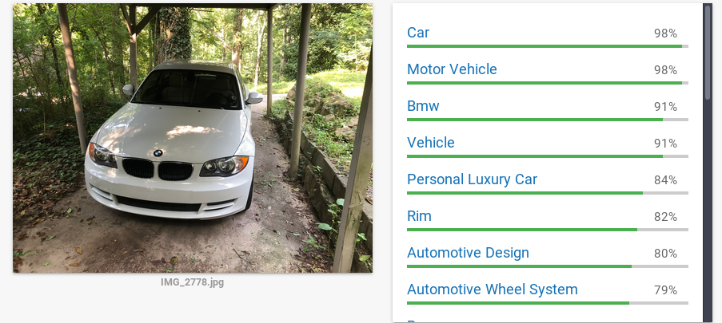 BMW 128i CloudVision

While it did classify the car as both “BMW” and “car”, it failed to recognize any specifics.

Let’s take another example, my old E85 BMW Z4 3.0i, from when I was living in Germany:

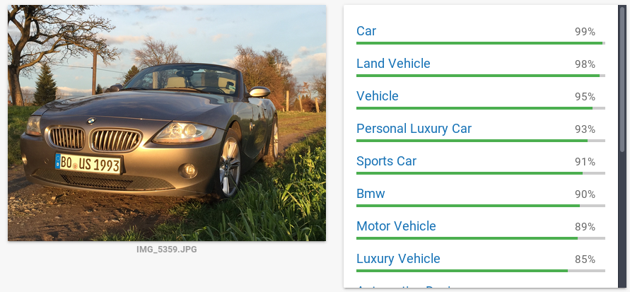 BMW Z4 3.0i CloudVision

Once again, it figured out we are dealing with a BMW, but the fact that the massive hood that houses the beauty that is the naturally aspirated three liter I6, nor the fact that the roof is, in fact, missing told Cloud Vision that this must be a Z4.

The main decision criteria here should be: Is it worth spending the extra effort to train your own model? Is your data set so specific and unique that it warrants its own model? Do you have proper Data Scientists in your organization that could do a (better) custom job?

In our case - yes, it is. So, time to train our own model, without having to deal with Tensorflow, massive coding efforts, or a Masters in Statistics.

# Getting data & classifying images

As we are trying to extend the idea of image recognition, we first need a set of images to get started on. For that, we will use /r/bmw where people show off their BMWs, mostly E30 and F80 M3s (keep at it folks, I cannot get enough of them). What could go wrong with user-generated content for training sets?

A simple script is used to re-use part of our existing reddit/praw and Python setup to simply pull the top posts from the subreddit, filter by the type “extMedia”, save it as image under /tmp and prepare a CSV file that we will use for classification later.

The resulting images wind up on Google Cloud Storage (GCS). 


# encoding=utf8
from __future__ import print_function
 
import config
import os
import praw
import urllib
import re
 
from reddit.Main import get_top_posts
 
__author__ = "Christian Hollinger (otter-in-a-suit)"
__version__ = "0.1.0"
__license__ = "GNU GPLv3"
 
 
def unixify(path):
    return re.sub('[^\w\-_\. ]', '_', path)
 
 
def get_image(post, img_path):
    filename = unixify(post.title)
    tmp_uri = '{}{}'.format(img_path, filename)
    print('Saving {url} as {tmp}'.format(url=post.content, tmp=tmp_uri))
    urllib.urlretrieve(post.content, tmp_uri)
    return tmp_uri, filename
 
 
def write_gcp(_input, _output, bucket_name):
    from google.cloud import storage
    # Instantiates a client
    storage_client = storage.Client()
 
    # Gets bucket
    bucket = storage_client.get_bucket(bucket_name)
    blob = bucket.blob(_output)
 
    # Upload
    blob.upload_from_filename(_input)
 
    print('Uploading {} to bucket {}'.format(_output, bucket_name))
 
 
def csv_prep(gcs_loc):
    return '{gcs_loc}|\n'.format(gcs_loc=gcs_loc).encode('utf-8')
 
 
def main():
    import sys
    reload(sys)
    sys.setdefaultencoding('utf8')
 
    # Get reddit instance
    reddit = praw.Reddit(client_id=config.creddit['client_id'],
                         client_secret=config.creddit['client_secret'],
                         user_agent=config.creddit['user_agent'])
    # Set GCP path
    os.environ['GOOGLE_APPLICATION_CREDENTIALS'] = config.cgcp['api_key']
    LIMIT = config.limit
    bucket_name = config.cgcp['images']
 
    # Settings
    subreddit=config.crawler['subreddit']
    img_path=config.crawler['path']+subreddits
 
    # Get top posts
    top_posts = get_top_posts(subreddit, reddit, LIMIT)
 
    # Filter images
    images = filter(lambda p: p.type == 'extMedia', top_posts)
 
    csv = ''
    # Download images
    for post in images:
        tmp, filename = get_image(post, img_path)
        write_gcp(tmp, subreddit + '/' + filename, bucket_name)
        csv += csv_prep('gs://{bucket_name}/{subreddit}/{filename}'
                        .format(bucket_name=bucket_name, subreddit=subreddit, filename=filename))
 
    # Dump pre-classifier CSV
    with open(img_path+'images.csv', 'a') as file:
        file.write(csv)
 
 
if __name__ == "__main__":
    main()


Now, here’s where the fun begins - we need to **classify the training set by hand**. It is generally recommended to have at least 100 images per category (Google actually offers a human-driven service for this!), but we are going to stick to less - it’s Saturday.

In order to simplify the model, I dumbed-down my categories - 1 and 2 series, 3 and 4 series, 5 and 6 series, concept and modern, Z3, Z4, and Z8 as well as classics, such as the iconic M1 or 850Csi. The latter introduces way to much noise, however, having a folder full of those cars is fun on its own. 


➜  bmw ls -d */
 
1-2series/  3-4series/ 5-6series/  classics/ concept-modern/  z3-4-8/


## Setting up AutoML

After labeling the images, we can proceed to AutoML and point to our CSV file. As the CSV contains the `gs://` path and label, we are presented with an overview that looks like this:

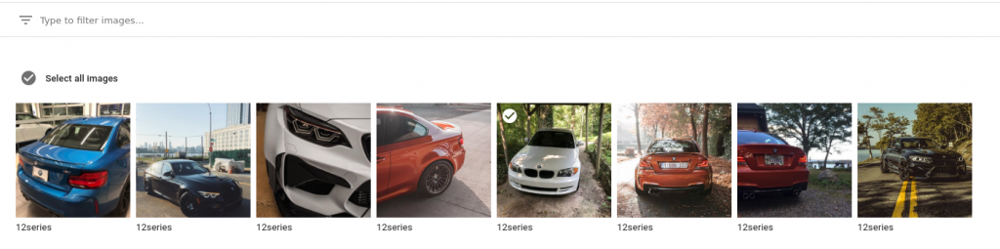 Reddit AutoML Data

Once the labeling is complete, we can train the model from the Web UI. It will warn you that you don’t have enough labels per image.

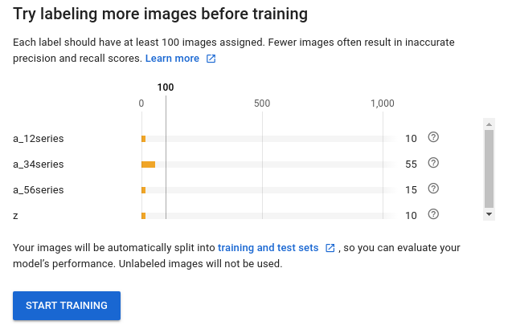 Label Warning

After the training is complete, we can see the model performance.

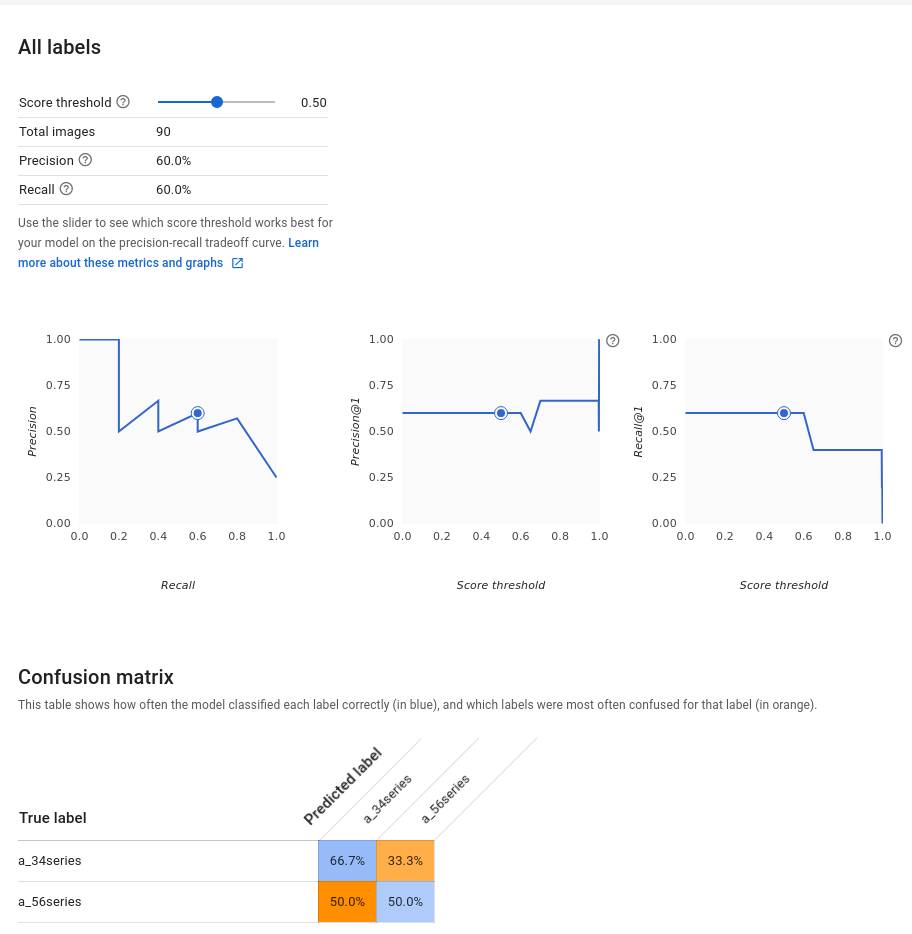 Model Performance (Reddit)

That does not look good. **How did this happen?**

The answer is fairly simple: All of reddit’s images are taken from various angles, in various lighting conditions, and with various model years. The noise in the images is too high to achieve a good result and we don’t have enough data to properly train the model.

## Image Recognition Theory

In order to understand the issue, let’s talk theory for a second. Cloud ML uses TensorFlow to classify our images, exposing the model via an easy API.

_As usual, this is not a scientific paper - I’m one of those engineer-folks who use the research output, not the researcher. Things will simplified and maybe even wrong. But hey, it works in the end!_

## What is TensorFlow?

>“TensorFlow is an interface for expressing machine learning algorithms, and an implementation for executing such algorithms. \[...\] In a TensorFlow graph, each node has zero or more inputs and zero or more outputs, and represents the instantiation of an operation. Values that flow along normal edges in the graph (from outputs to inputs) are tensors, arbitrary dimensionality arrays where the underlying element type is specified or inferred at graph-construction time. Special edges, called control dependencies, can also exist in the graph: no data flows along such edges, but they indicate that the source node for the control dependence must finish executing before the destination node for the control dependence starts executing.” 

(_Abadi, M.; Agarwal, A.; Barham, P.; Brevdo, E.; Chen, Z.; Citro, C.; Corrado, G.S.; Davis, A.; Dean, J.; Devin, M.: Tensorflow: Large-scale machine learning on heterogeneous distributed systems. arXiv:1603.04467_)

While AutoML uses Google’s **NASNet** approach to find the right architecture -

“Our work makes use of search methods to find good convolutional architectures on a dataset of interest. The main search method we use in this work is the Neural Architecture Search (NAS) framework proposed by \[71\]. In NAS, a controller recurrent neural network (RNN) samples child networks with different architectures. The child networks are trained to convergence to obtain some accuracy on a held-out validation set. The resulting accuracies are used to update the controller so that the controller will generate better architectures over time. The controller weights are updated with policy gradient (see Figure 1)."

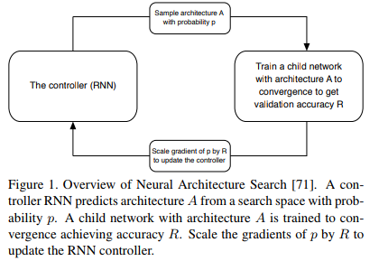

(_Barret Zoph, Vijay Vasudevan, Jonathon Shlens, Quoc V. Le: Learning Transferable Architectures for Scalable Image Recognition. arXiv:1707.07012v4_)

...we will quickly talk about **Convolutional Neural Networks**.

“CNNs use a variation of multilayer perceptrons designed to require minimal preprocessing. They are also known as shift invariant or space invariant artificial neural networks (SIANN), based on their shared-weights architecture and translation invariance characteristics.

Convolutional networks were inspired by biological processes in that the connectivity pattern between neurons resembles the organization of the animal visual cortex. Individual cortical neurons respond to stimuli only in a restricted region of the visual field known as the receptive field. The receptive fields of different neurons partially overlap such that they cover the entire visual field.

CNNs use relatively little pre-processing compared to other image classification algorithms. This means that the network learns the filters that in traditional algorithms were hand-engineered. This independence from prior knowledge and human effort in feature design is a major advantage.”

([https://en.wikipedia.org/wiki/Convolutional\_neural\_network](https://en.wikipedia.org/wiki/Convolutional_neural_network))

Given the nature these networks work - by analyzing an images binary components in a set of computational layers - it is easy to confuse the network with seemingly different, albeit actually very similar images.

Bharath Ray’s article (link below) explains it as follows:

_“It finds the most obvious features that distinguishes one class from another. Here \[an example about cars taken from different angles\], the feature was that all cars of Brand A were facing left, and all cars of Brand B are facing right”_

Check out [this article](https://medium.com/nanonets/how-to-use-deep-learning-when-you-have-limited-data-part-2-data-augmentation-c26971dc8ced) by Bharath Ray on Medium for more details on how do overcome this manually.

## Adjusting the Model

The solution to our problem is fairly simple - we just need a better training set with more data from more images. Car pictures tend to be taken from very similar angles, in similar lighting conditions, and with similar trim styles of vehicles.

First, we’ll use [https://github.com/hardikvasa/google-images-download](https://github.com/hardikvasa/google-images-download) to get ourselves proper training images from Google. Ironic, isn’t it?

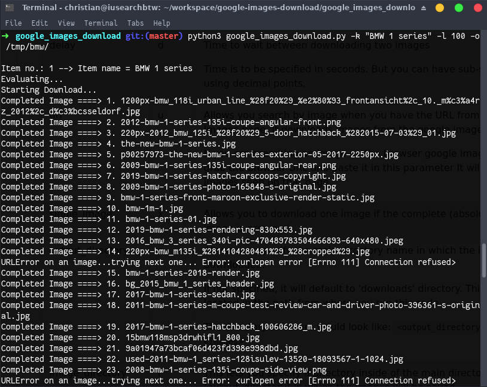 Download Training Set

Next, simply create a mock-CSV and quickly populate the classifiers.


cd '/tmp/bmw/BMW 3 series/'
gsutil -m cp  "./*" gs://calcium-ratio-189617-vcm/bmw-1s
gsutil ls gs://calcium-ratio-189617-vcm/bmw-1s >> ../1series.csv


After getting enough training data, we can go back to AutoML Vision and create a new model based on our new images.

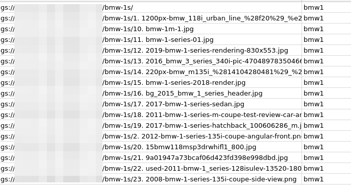 Classification CSV

After importing the file, we are greeted with a much more usable training set:

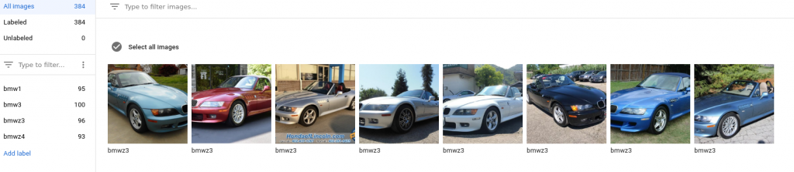 Google AutoML Data

Now, when we evaluate the model, it looks a lot less grim:

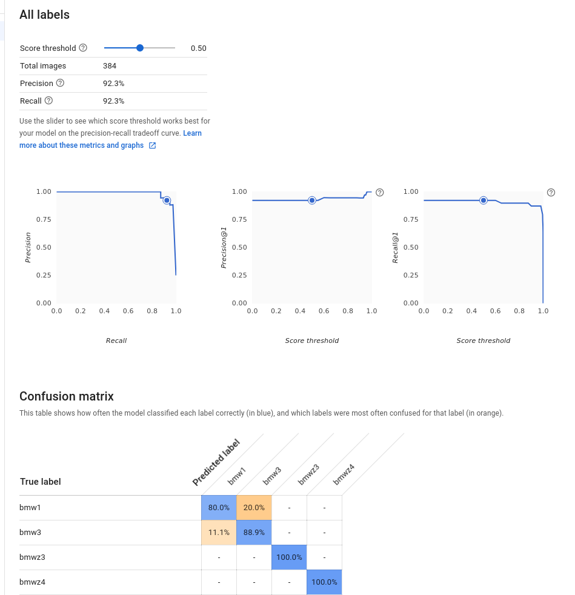 Model Performance

## Using our model with Reddit data

After we figured out the issue with our training set, let’s try out the REST API.

We’ll use this image from reddit:

 by /u/cpuftw at https://www.reddit.com/r/BMW/comments/5ziz5c/my_first_m_2017_nardo_grey_m3/

And simply throw a REST request at it, using a simple Python 2 script:


import sys
 
from google.cloud import automl_v1beta1
from google.cloud.automl_v1beta1.proto import service_pb2
 
"""
This code snippet requests a image classification from a custom AutoML Model
Usage: python2 automl_rest.py $img $project $model_id
"""
 
def get_prediction(_content, project_id, model_id):
    prediction_client = automl_v1beta1.PredictionServiceClient()
 
    name = 'projects/{}/locations/us-central1/models/{}'.format(project_id, model_id)
    payload = {'image': {'image_bytes': _content }}
    params = {}
    request = prediction_client.predict(name, payload, params)
    return request  # waits till request is returned
 
 
if __name__ == '__main__':
    file_path = sys.argv[1]
    project_id = sys.argv[2]
    model_id = sys.argv[3]
 
    with open(file_path, 'rb') as ff:
        _content = ff.read()
 
    print(get_prediction(_content, project_id,  model_id))


And the results are...

 Results M3

On point! Well, it is an M3, but that is still a 3 series BMW.

Next, remember my old Z4?

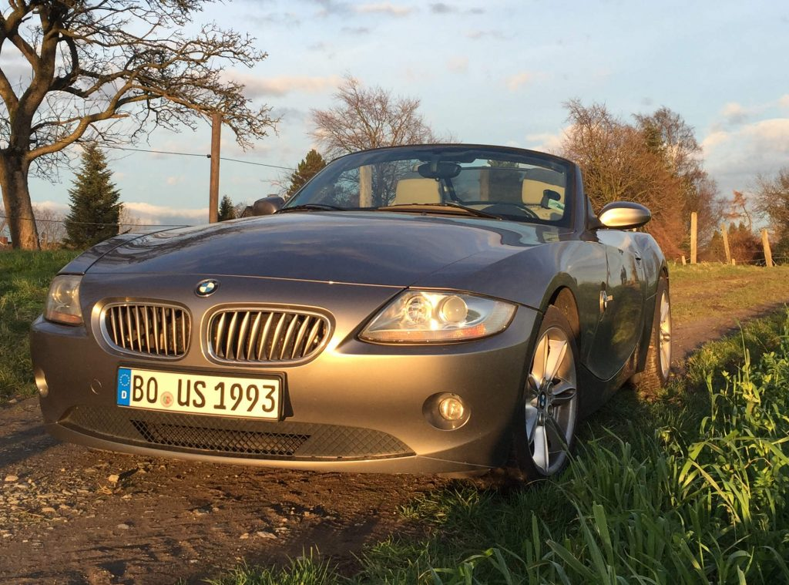 Z4


payload {
classification {
    score: 0.999970555305
}
    display_name: "bmwz4"
}


Yes, sir! That is, in fact, a Z4.

# Conclusion

Now, what did we learn?

First off, using the Cloud Vision API simplifies things tremendously for the overwhelming majority of use cases. It gives you a very accurate output for most standard scenarios, such as detected images not appropriate for your user base (for filtering user-generated content) or for classifying and detecting many factors in an image.

However, when the task becomes too specific, AutoML helps us to build our custom model without having to deal with the intricacies of a custom TensorFlow model. All we need to take care of is good training data and careful labeling before training the model. The simple REST API can be used just like the Cloud Vision API in your custom software.

I don’t know about you, but I’m a big fan - we managed to build a system that would otherwise require a lot of very smart Data Scientists. Granted, it will not achieve the accuracy a good Data Scientists can (on AutoML or not) - these folks know more than I do and can figure out model issues that I cannot; however, this is the key point. Any skilled Engineer with a basic understanding of ML can implement this system and advance your project with a custom ML model. Neato!

_All development was done under Arch Linux on Kernel 4.18.12 with 16 AMD Ryzen 1700 vCores @ 3.6Ghz and 32GiB RAM_
