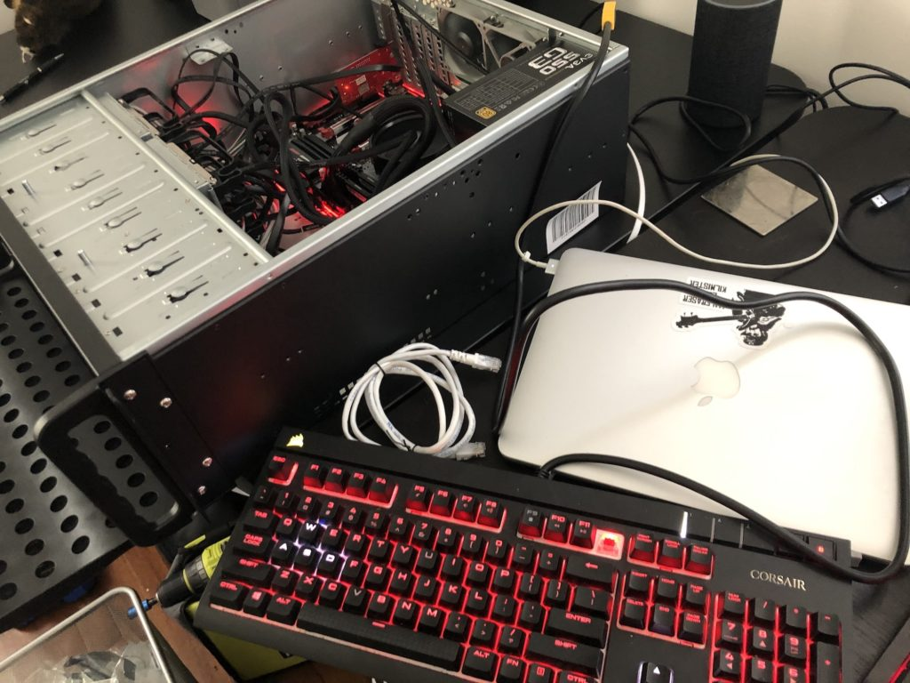
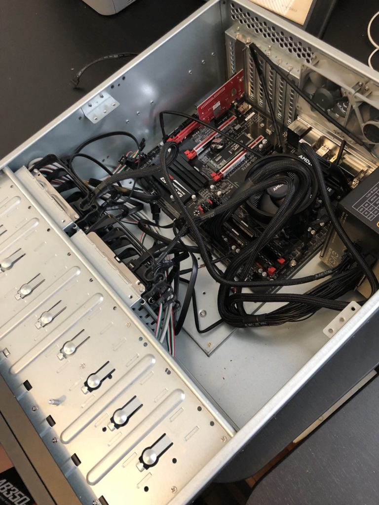
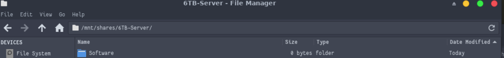
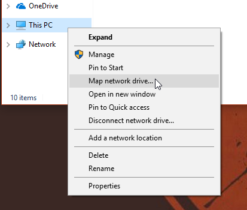
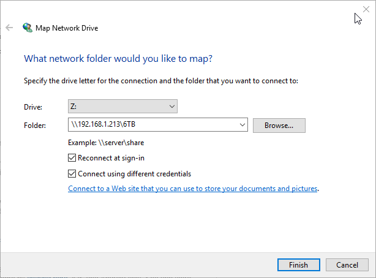
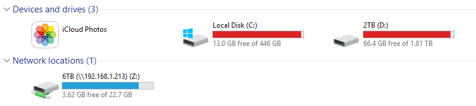
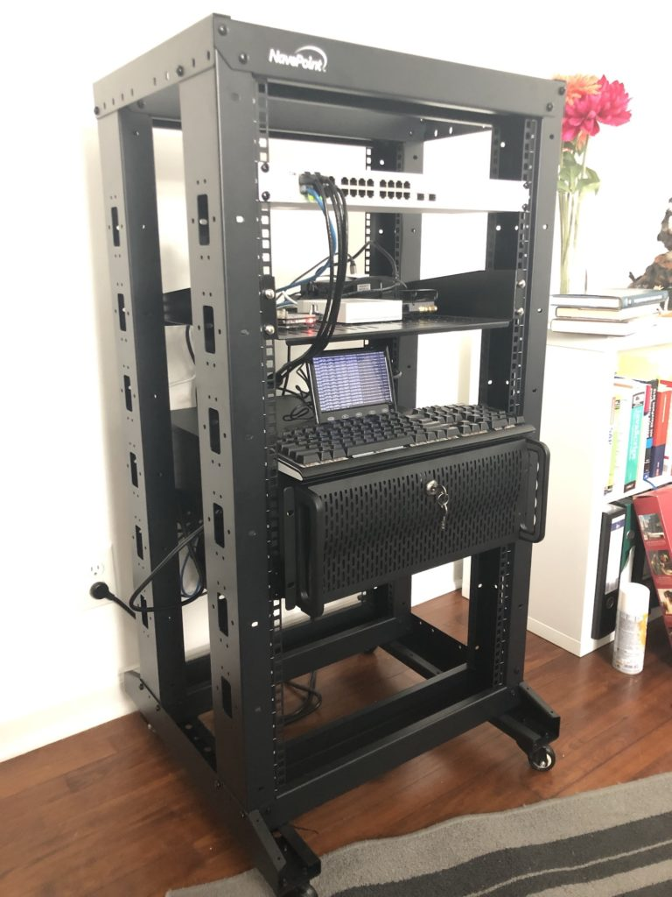

## Introduction

In this article, I’ll document my process of building a home server - or NAS - for local storage, smb drives, backups, processing, git, CD-rips, and other headless computing.  

## Why a Home Server?

The necessity of a NAS these days can be questioned, given the cheap - or free - availability of cloud storage. However, getting into a dependency with an external vendor poses significant security risk for individuals that do not enjoy the same benefits a corporate account with big bills might receive, notably -

- Changes in storage tiers and costs (see [Flickr limiting free user’s storage tier to 1,000 photos](https://news.ycombinator.com/item?id=18362303), from previously 1TB or [Microsoft dropping unlimited storage for OneDrive](https://arstechnica.com/information-technology/2015/11/microsoft-drops-unlimited-onedrive-storage-after-people-use-it-for-unlimited-storage/) - especially fun if you already have gigabytes, if not terabytes, stored there)
- Upload capacity with broadband connections (except for Google Fiber, no American ISP offers symmetric up/down links) - uploading my CD vinyl collection, even ripped as compressed MP3s @ ~70GB, would take me a easily half a day - (not to mention my 2TB Steam collection) and that is only a fraction of our available local storage)
- And hence, high-speed backups from all local devices, such as PCs, Macs, Routers, etc.
- Privacy concerns - while you can, naturally, uploaded encrypted files, you lose the benefit of automatic syncing in most cases
- Flexibility to run additional services such as a pi-hole (DNS ad blocker), monitoring software, local build server and git repositories, or VPN services
- Service outages on cloud services or your local internet

However, for the record - the server where you reading this article on does get backed up to AWS S3 via an encrypted duplicity backup (which is neither free nor user-friendly). There is no “one size fits all” solution.

As a preliminary note: **Do not copy paste any of the commands without making sure all parameters match your system’s configuration!**  

## Hardware

- **CPU**: AMD - Ryzen 3 2200G 3.5 GHz Quad-Core Processor  
- **Motherboard**: Gigabyte - GA-AB350-GAMING 3 ATX AM4 Motherboard
- **Memory**: 2x Corsair - Vengeance LPX 8 GB (1 x 8 GB) DDR4-2400 Memory
- **Storage**: Western Digital - Green 240 GB M.2-2280 Solid State Drive  
- **Storage**: 2x Western Digital - Red 6 TB 3.5" 5400RPM Internal Hard Drive  
- **Storage**: 2x Western Digital - Red 3 TB 3.5" 5400RPM Internal Hard Drive    
- **Power** **Supply**: EVGA - SuperNOVA G3 550 W 80+ Gold Certified Fully-Modular ATX Power Supply
- **Case** **Fan**: 2x Noctua - NF-F12 PWM 54.97 CFM 120mm Fan
- **Case** **Fan**: 2x Noctua - NF-R8 redux-1800 PWM 31.37 CFM 80mm Fan  
- **Case**: Rosewill RSV-R4000, 4U Rackmount Server Case / Server Chassis, 8

The total price (as of 2019-04-06) is roughly $1,200 USD.

I've also added some existing hardware, like 2x 1TB Samsung HDDs and a PCI-to-SATA extension card.  

## Preparation

Make sure you have the follow tools available -

- A laptop or desktop running any GNU/Linux or MacOS (Windows instructions differ - you will need an ssh client like putty or MobaXTerm as well as unetbootin to burn the ISO)
- An ethernet cable
- A keyboard
- A screwdriver
- A USB thumb drive
- All server hardware
- (Optional) Small LCD screen and spare keyboard to access the drive if SSH won't work for some reason

First, we’ll get ourselves a **Debian 9** ISO and burn it to a USB Thumb Drive. Other operating systems are available - I like Debian for it’s stability and easy maintenance and already run several Debian boxes.  


cd ~/Downloads
wget https://cdimage.debian.org/debian-cd/current/amd64/iso-cd/debian-9.8.0-amd64-netinst.iso
sudo fdisk -l | grep -B 2 -A 15 "Flash"
sudo dd bs=4M if=debian-9.8.0-amd64-netinst.iso of=/dev/sdf



➜  Downloads sudo dd bs=4M if=debian-9.8.0-amd64-netinst.iso of=/dev/sdf
73+0 records in
73+0 records out
306184192 bytes (306 MB, 292 MiB) copied, 11.6768 s, 26.2 MB/s


## Hardware setup

This step is fairly straightforward. Assemble the hardware, plug in it, and make sure it posts. In the process, make sure the room you are using to assemble the system looks like a tornado went through it.  

Cable management optional

## Install Operating System

With your hardware connected to a screen, keyboard, and ethernet, it’s time to install the OS. Insert the flash drive, boot into it on the server hardware, and install Debian. I used my M.2 SSD with separate /home and /tmp partitions and enabled disk encryption with LUKS.

## Software setup

Once the installation is completed, we can set up the software.  

First, we need to configure our network. Take a backup of the configuration and edit the file with vi:


sudo cp /etc/network/interfaces /etc/network/interfaces.bak
sudo vi /etc/network/interfaces


Something like this should be the content for your interface file:


auto lo
iface lo inet loopback

iface eth0 inet static
	address	192.168.1.130
	netmask	255.255.255.0	
	network	192.168.1.0	
	broadcast 192.168.1.255
	gateway	192.168.1.1

sudo vi /etc/resolv.conf

nameserver	192.168.1.176


Keep in mind that your IP configuration might be different. Since I am running a pi-hole on IP 192.168.1.176, my DNS configuration refers to that server. For your environment, you probably want to go with 1.1.1.1 and 1.0.0.1 as DNS tuple. You can always check on your other devices via $ ifconfig or similar commands.

Next, we'll configure the hostname and host resolution and restart the network service.

My hostname is "bigiron", which might or might not be a Marty Robbins and Fallout reference. You can choose whatever you like.


sudo echo bigiron > /etc/hostname

sudo vi /etc/hosts



# Example
127.0.0.1     localhost
192.168.1.130   bigiron


Before doing anything, we’ll restart the network service and test the connection. Make sure you can reach google.com.


sudo service networking restart
if [[ $(hostname) == "bigiron" ]]; then echo "success"; else echo "failed"; fi
ping google.com


Then, we’ll update our packages and install all required software:


sudo apt-get update
sudo apt-get upgrade
sudo apt-get install zsh \
vim \
git \
openssh-server \
parted \
wget \
curl \
cryptsetup \
mdadm \
libcups2 samba samba-common cups 


The software we need to install here is fairly standard - **zsh** is going to be our shell, **vim** serves as editor, **git** is used to handle repositories, **openssh-server** is used for SSH connection, **wget** & **curl** are used for downloads and network tests, **cryptsetup** and **mdadm** are used for disk encryption and RAID arrays, and the samba dependencies are for file shares.

**Disclaimer:** There is a known vulnerability for wget, [CVE-2019-5953](https://bugzilla.redhat.com/show_bug.cgi?id=1695679).

> There is a known vulnerability for wget, [CVE-2019-5953](https://bugzilla.redhat.com/show_bug.cgi?id=1695679)

Next, we’ll configure  **[oh-my-zsh](https://github.com/robbyrussell/oh-my-zsh)**, a neat little wrapper around zsh that is my default shell on all \*NIX boxes.  


sh -c "$(wget https://raw.githubusercontent.com/robbyrussell/oh-my-zsh/master/tools/install.sh -O -)"


Now, we need to configure ssh to use the system remotely from our other machine.


sudo vim /etc/ssh/sshd_config


Add the following content (using your user name) and restart ssh. **Please make sure you** [**configure public/private key authentication**](https://wiki.archlinux.org/index.php/SSH_keys) **in due time.**  


# Users
AllowUsers christian
# Logging
SyslogFacility AUTH
LogLevel INFO
# Authentication:
LoginGraceTime 2m
PermitRootLogin no
StrictModes yes
MaxAuthTries 6
MaxSessions 10

service ssh restart


## Hard drive setup

Congratulations, your system is now operational. Granted - it doesn’t do anything. But we’ll change that in a spiffy!

You can now connect to your system using SSH (which is what we are going to do).

One of our most command commands is going to be the following:  


sudo fdisk -l 
service ssh restart



Disk /dev/sdh: 5.5 TiB, 6001175126016 bytes, 11721045168 sectors
Units: sectors of 1 \* 512 = 512 bytes
Sector size (logical/physical): 512 bytes / 4096 bytes
I/O size (minimum/optimal): 4096 bytes / 4096 bytes
Disklabel type: gpt
Disk identifier: 46AAB764-3004-481A-AA2D-5D751D996AC1

Device     Start         End     Sectors  Size Type
/dev/sdh1   2048 11721045134 11721043087  5.5T Linux filesystem
service ssh restart


This shows us the physical disks in the system, as well as their partitions. As I've mentioned before **\- do not simply copy paste these commands**. Otherwise you will risk losing data and messing up your system.

Make sure you always take note of your disks' identifiers (e.g., /dev/sda) and UUIDs.

> Do not copy paste any of the commands without making sure all parameters match your system's configuration

With that out of the way, we will need to add partitions to our first set of hard drives and format them. This will delete all data on the disks.  


sudo parted /dev/sdb
(parted) mklabel gpt                                                      
Warning: The existing disk label on /dev/sdc will be destroyed and all data on this disk will be lost. Do you want to continue?
Yes/No? y                                                                 
(parted) mkpart primary ext 0% 100%                                  
(parted) exit         
sudo mke2fs -t ext4 /dev/sdb2


Once that is done, we need to create our RAID-1 array as such. We use RAID-1 to protect ourselves against disk failures. **A RAID-1 array protects against drive failures - it is not a backup!**  

> A RAID-1 array protects against drive failures - it is not a backup!


mdadm --create --verbose --level=1 --metadata=1.2 --raid-devices=2 /dev/md/6TB /dev/sdb1 /dev/sdc1


You can check the configuration as well as the sync status of your RAID-1 array as such:


➜  ~ sudo mdadm --detail /dev/md127                                                                          
/dev/md127:
        Version : 1.2
  Creation Time : Sat Apr  6 18:27:22 2019
     Raid Level : raid1
     Array Size : 5860390464 (5588.90 GiB 6001.04 GB)
  Used Dev Size : 5860390464 (5588.90 GiB 6001.04 GB)
   Raid Devices : 2
  Total Devices : 2
    Persistence : Superblock is persistent

  Intent Bitmap : Internal

    Update Time : Sat Apr  6 18:27:22 2019
          State : clean, resyncing 
 Active Devices : 2
Working Devices : 2
 Failed Devices : 0
  Spare Devices : 0

  Resync Status : 0% complete

           Name : bigiron:6TB  (local to host bigiron)
           UUID : ffafd947:3c116230:a1e40521:332156c7
         Events : 1

    Number   Major   Minor   RaidDevice State
       0       8       17        0      active sync   /dev/sdb1
       1       8       33        1      active sync   /dev/sdc1


## Encryption with LUKS

Then, we’ll add LUKS encryption to the array:  


sudo cryptsetup luksFormat /dev/md127
sudo cryptsetup luksOpen /dev/md127 6TB\_LUKS
sudo mkfs.ext4 /dev/mapper/6TB\_LUKS
sudo mkdir /mnt/6TB
sudo mount /dev/mapper/6TB\_LUKS /mnt/6TB


Once that is done, we’ll add a key file to make sure we don’t need to punch in the password every time.

This this step, I am using an external USB thumb drive and hence am mounting /dev/sdd1 to /mnt/usb. You can also keep the key file on the system, but that would invalidate the point of having an encrypted disk in the case of theft.


sudo mount /dev/sdc1 /mnt/usb
sudo dd bs=512 count=4 if=/dev/random of=/mnt/usb/keyfile iflag=fullblock



4+0 records in
4+0 records out
2048 bytes (2.0 kB, 2.0 KiB) copied, 891.521 s, 0.0 kB/s



sudo chmod 600 /mnt/usb/keyfile
sudo cryptsetup luksAddKey /dev/md127 /mnt/usb/keyfile --key-slot 1


Wonderful. Now, let’s make sure that the thumb drive containing the key gets mounted on boot by editing /etc/fstab


sudo fdisk -l
sudo blkid /dev/sdc1 | awk -F'"' '{print $2}'
sudo vim /etc/fstab

UUID=b796c692-2ba5-49cf-a45d-dbd62228dd98	/mnt/usb	auto nosuid,nodev,nofail 0 0


Then, we need to add the actual encrypted disk to /etc/fstab as well as /etc/crypttab.


# Get UUID
sudo cryptsetup luksDump /dev/md127 | grep "UUID"
 
# Edit /etc/crypttab
sudo  mdadm --detail /dev/md127
sudo vim /etc/crypttab
# 6TB_LUKS UUID=e4cd8646-375d-4d84-886c-ba80b31698ad /mnt/usb/keyfile luks
sudo vim /etc/fstab
# /dev/mapper/6TB_LUKS  /mnt/6TB    ext4    defaults        0       2


**In my case, I have only enabled this for the data drives, not for the boot drive.** This is a matter of personal preference - I have a small 7" LCD on the 19" rack, including a keyboard, and simply punch in the LUKS key code on reboot. This won't work you are not home, but leaving the thumb-drive in the system while you are away won't help theft prevention of data. Feel free to send me your own best practices.

With all that done, you can test the setup by mounting everything in /etc/fstab by running:


sudo mount -a


Repeat this process for every RAID array in the system. In my case, that would be 2.

Furthermore, to persist names for existing arrays, follow these steps:


sudo mdadm --stop /dev/md126
sudo mdadm --assemble /dev/md3 --name=3TB --update=name /dev/sda /dev/sdb
sudo mdadm -Db /dev/md3 >> /etc/mdadm/mdadm.conf
sudo update-initramfs -u


On a side-node - if you have existing drives, for instance from your desktop PC, make sure to back up all your data to a different disk, **as setting this up will delete all data**. You can do this as such:


sudo rsync --partial  -T /mnt/6TB/tmp -azh /mnt/3TB/ /mnt/6TB/ --exclude=".Trash-1000" --progress


On a related note, since I transferred an existing RAID-1 array, I had some massive drive issues that resulted in odd behavior (like timeouts on the READ() call in the kernel, as followed by strace - please don't ask me why) - if you want to debug issues like these, the following commands might come in handy.

You can see the files being accessed by commands like rsync or cp through /proc with the specific PID of a process:


ps aux | grep rsync
watch sudo ls -l /proc/1446/fd 



Every 2.0s: sudo ls -l /proc/1446/fd                                                                                                                                                                       bigiron: Thu Apr 11 17:36:55 2019
 
total 0
lrwx------ 1 root root 64 Apr 11 17:03 0 -> /dev/tty1
lrwx------ 1 root root 64 Apr 11 17:03 1 -> /dev/tty1
lrwx------ 1 root root 64 Apr 11 17:03 2 -> /dev/tty1
lr-x------ 1 root root 64 Apr 11 17:24 3 -> /mnt/3TB/memes/2019/04/memes_if_i_die_before_game_of_thrones_comes_out/928_meme.jpg
lrwx------ 1 root root 64 Apr 11 17:03 4 -> socket:[18863]
lrwx------ 1 root root 64 Apr 11 17:03 5 -> socket:[18864]


Also, using strace, you can debug very odd, low-level issues like mine:


strace cp broken.txt broken2.txt
ecve("/bin/cp", ["cp", "broken.txt", "broken2.txt"], [/* 24 vars */]) = 0
brk(NULL)                               = 0x55adfb96b000
access("/etc/ld.so.nohwcap", F_OK)      = -1 ENOENT (No such file or directory)
access("/etc/ld.so.preload", R_OK)      = -1 ENOENT (No such file or directory)
open("/etc/ld.so.cache", O_RDONLY|O_CLOEXEC) = 3
fstat(3, {st_mode=S_IFREG|0644, st_size=35999, ...}) = 0
mmap(NULL, 35999, PROT_READ, MAP_PRIVATE, 3, 0) = 0x7f82ba539000
close(3)                                = 0
access("/etc/ld.so.nohwcap", F_OK)      = -1 ENOENT (No such file or directory)
open("/lib/x86_64-linux-gnu/libselinux.so.1", O_RDONLY|O_CLOEXEC) = 3
read(3, "\177ELF\2\1\1\0\0\0\0\0\0\0\0\0\3\0>\0\1\0\0\0000k\0\0\0\0\0\0"..., 832) = 832
fstat(3, {st_mode=S_IFREG|0644, st_size=155400, ...}) = 0
mmap(NULL, 8192, PROT_READ|PROT_WRITE, MAP_PRIVATE|MAP_ANONYMOUS, -1, 0) = 0x7f82ba537000
mmap(NULL, 2259664, PROT_READ|PROT_EXEC, MAP_PRIVATE|MAP_DENYWRITE, 3, 0) = 0x7f82ba0f7000
mprotect(0x7f82ba11c000, 2093056, PROT_NONE) = 0
mmap(0x7f82ba31b000, 8192, PROT_READ|PROT_WRITE, MAP_PRIVATE|MAP_FIXED|MAP_DENYWRITE, 3, 0x24000) = 0x7f82ba31b000
mmap(0x7f82ba31d000, 6864, PROT_READ|PROT_WRITE, MAP_PRIVATE|MAP_FIXED|MAP_ANONYMOUS, -1, 0) = 0x7f82ba31d000
close(3)                                = 0
...


## Network shares

Now, we'll set up network shares with samba. This will allow all devices in the network to access shares on the server.

All we need to do is add a new user for samba (as smb users are separate from the host system's users), backup our samba configuration and add shares, including valid users as such:


sudo smbpasswd -a christian 
sudo cp /etc/samba/smb.conf /etc/samba/smb.conf.bak
sudo vim /etc/samba/smb.conf
sudo service smbd restart


And:

[global]
  server min protocol = NT1
  ; server max protocol = SMB3
 
...
 
[6TB]
path = /mnt/6TB
browseable = yes
writeable = yes
valid users = christian


Test your setup by mounting the smb drive on a different computer. The below example is for Arch Linux. Replace the username and password accordingly.


sudo pacman -S smbclient
sudo mkdir -p /mnt/shares/6TB-Server


Add a secured, read-only file for root to store your passwords:

sudo mkdir -p /etc/samba/credentials/
sudo vim /etc/samba/credentials/share
sudo chown root:root /etc/samba/credentials
sudo chmod 700 /etc/samba/credentials
sudo chmod 600 /etc/samba/credentials/share


Ini:

username=myuser
password=mypass


And try connecting:


sudo mount -t cifs //192.168.1.213/6TB /mnt/shares/6TB-Server -o credentials=/etc/samba/credentials/share


Mounted drive on Arch Linux with KDE

I hate to admit it, but **Windows** makes it a bit easier. :) Please see below for the steps (for Windows 10 Pro):

Right-click on "This PC" and "Map network drive"

Map Drive

Mapped Drive (the size might be off - this happened due to invalid permissions)

## Backups

Last but not least, we'll enable automatic updates for a GNU/Linux machine.

This is done with an encrypted duplicity backup. Make sure you store your GPG keys somewhere secure, like an encrypted USB drive.


sudo su
apt-get install duplicity gpg
gpg --gen-key
gpg --list-keys
# Take the GPG_KEY from here
touch /root/backup_arch.sh
chmod +x /root/backup_arch.sh
vim /root/backup_arch.sh


Script:

#!/bin/sh
export GPG_KEY=YOUR_KEY_HERE
  
if [ "${EUID}" -ne 0 ]; then
  echo "You're not root"
  exit
fi
s
# Check if external drive is mounted
SHARE=/mnt/shares/6TB-Server
if [[ -z $(mount -t cifs | grep "${SHARE}") ]]; then
  echo "Disk not connected, aborting"
  exit 1
else
  echo "Disk available, continuing..."
fi
#MOUNTPONT=$(findmnt -rn -S UUID="${UUID}")
if [ -z "${MOUNTPONT}" ]; then
  mount -t cifs //192.168.1.213/6TB /mnt/shares/6TB-Server -o credentials=/etc/samba/credentials/share
  RET=$?
fi
# Check success
if [ $RET -ne 0 ]; then
  echo "Mount failed!"
  exit 1
fi
  
# Delete any older than 1 month
#duplicity remove-older-than 7D --force --encrypt-key=9CE17035 --sign-key=9CE17035 file:///mnt/5TB/arch_backup/
  
# Make the regular backup
# Will be a full backup if past the older-than parameter
duplicity --full-if-older-than 7D --encrypt-key=${GPG_KEY} --sign-key=${GPG_KEY} -exclude=/proc --exclude=/lost+found --exclude=/backups --exclude=/mnt --exclude=/sys --exclude=/opt/virtual /  file:///mnt/shares/6TB-Server/backups/arch/
  
export GPG_KEY=


You can know schedule this with cron (the below command will run it every day at midnight):


crontab -e
0 0 * * * /root/backup_arch.sh > /var/log/backup/$(date --iso)_backup.log


## Further Steps

There are a lot more steps that you can take to make your server fully operational.

Here are some ideas -

- Plex or other home media shares to access your media on e.g. your AppleTV
- Running your own git server
- Running your own build server
- Running nextCloud
- Enabling wireguard or other VPNs for external access
- Enable rotating logs and log-backups
- Enable a duplicity backup pipeline to an external hard drive to safeguard against fires, electrical issues, or theft (**a RAID-1 array protects against drive failures - it is not a backup!**)

Furthermore, I strongly recommend setting up the following **security best practices**:

- Enable ssh login via public/private keys only
- Enable apparmor to restrict service account's permissions (this can be very, very time intensive and may break existing software)
- Enable proper iptable rules
- Secure your outgoing and incoming ports on your router and physical network (switches)
- Secure your samba configuration

## Conclusion

Running a home server can be taxing on free time and costs, but does allow for some powerful computing capabilities in your own home. Following similar steps like the ones highlighted above allow you to properly own your data, have control over your backups, and be independent of Cloud providers.

It is also a wonderful learning experience for everyone who has interest in GNU/Linux and Sysadmin tasks, but doesn't want to be limited to small computing power (Raspberry Pi) or purely on fun projects (like running a barebones Debian on an old laptop).

While a regular external hard drive for Backups and Cloud services for anything else might be plenty for most people, if you have the energy to be your own admin, I can highly recommend putting a 19" rack in your house.

_Disclaimer: In case you are married, you might need couples counseling after putting 100lbs of solid steel and a plethora of ethernet cables in your office._

Final Setup
