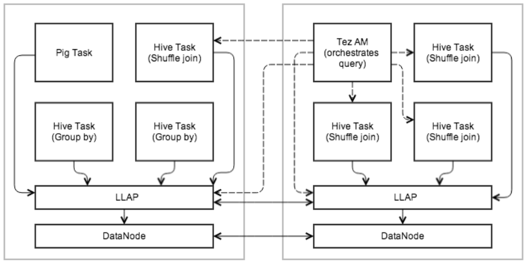
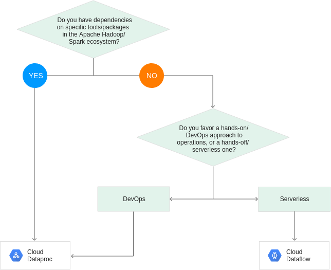

## Introduction

In this article, we'll take a look at whether Apache Hadoop still a viable option in 2019, with Cloud driven data processing an analytics on the rise.

When I first started using the Apache Hadoop Ecosystem, things around the magic buzzwords of “Big Data” and “Machine Learning” were quite different compared to what happened since. In this article, we will take a look at what happened since and how it compares against powerful, managed Cloud providers in 2019. 

## A bit of History

Apache Hadoop, the open source framework for “reliable, scalable, distributed computing”, first saw the light of the day in 2006, based on Google’s "MapReduce: Simplified Data Processing on Large Clusters" whitepaper (available [here](http://ai.google/research/pubs/pub62)) from 2003. Over the coming years, more and more tools (such as Pig by Yahoo) emerge, the major distributions from Hortonworks, Cloudera, and MapR are being released, performance records are being made (2008/2009), SQL-like support by Apache Hive becomes available in 2010 and schedulers like YARN become popular (2012/2013).  

Around 2014/2015, Hadoop finally had a lot of things going for it which other platforms lacked - it was Open Source, already moved past the tedious limitations of Java-based Map/Reduce programs, supported both Batch and Real-Time applications, ran on pretty much every old piece of hardware you could find, could be run by either setting it up yourself (my 2013 Macbook Pro still has a local HDFS, YARN, and Hive instance running) or as enterprise level solution by Hortonworks’ HDP, Cloudera’s CDH, or MapR. It enabled companies to ingest, store, and analyze any data and was used heavily in production across major companies.  

A lot of additional tools supported the framework - the below tables gives a rough overview of components we will mention in this article:  

| Tool  | Description                                  | First Release | Latest Release |
|-------|----------------------------------------------|---------------|----------------|
| [YARN](https://hadoop.apache.org)   | Resource Manager & Scheduler                 | 2006          | 2019-02-06     |
| [Hbase](https://hbase.apache.org/) | no-SQL database                              | 2008          | 2019-06-11     |
| [Hive](https://hive.apache.org/)  | Data Warehouse and SQL abstraction           | 2010          | 2019-05-14     |
| [Sqoop](http://sqoop.apache.org) | RDMBS ingestion pipeline                     | 2009          | 2019-01-18     |
| [Spark](https://spark.apache.org) | Data processing framework and compute engine | 2014          | 2019-05-08     |
| Tez   | Execution frameworks for DAGS on Hive or Pig | 2014          | 2019-03-29     |

As you can see, all recent releases where within the last 6 months (at the time of writing).  

Things were not without their drawbacks, however - like most Open Source software, especially when bundled in a modular way, running on dozens, hundreds, or thousands of machines is not without challenges. Configuration, performance optimization, tool selection, maintenance, operations, and development require deep expertise to make any Hadoop installation run smoothly, as one wrong configuration setting can severely degrade the performance of the overall system. At the same time, this level of granular control also allows for an unmatched level of flexibility and adaptability of your tools.

## The emerging Cloud Market

[https://xkcd.com/1117/](https://xkcd.com/1117/), CC BY-NC 2.5

However, over the past years, more and more companies find their benefits in the major Cloud providers - AWS, Google Cloud, and Microsoft Azure. Their benefits are many - a massively reduced need for local infrastructure and administration, flexible scaling from a couple of GB to TB of memory, storage, and CPU, a flexible bill-by-usage model, out-of-the-box machine learning models, and integration into other, non-”Big Data” tools.  

Companies were able to move from needing to maintain expensive, bare-metal boxes in-house that may run idle for 80% of the day and cause resource constraints and bottlenecks during scheduled batch-runs, limited by tools the organization had Subject Matter Experts or external support for, to reserving resources for massive jobs that can handle terabytes of data in minutes or seconds for a couple of $.  

So the question stands - what has happened with Hadoop since then - and is there still a need for it?  

## A look at the overall ecosystem’s changes

Before we dig into the individual components, let’s briefly talk about what happened from a bird’s-eye view.  

In early 2019, two of the major providers (Hortonworks and Cloudera) announced a massive [merger](http://hortonworks.com/blog/welcome-brand-new-cloudera/) of the two companies. The step made sense for any Software Engineer familiar with the technology - both companies worked on an almost identical tech stack, both were heavily involved in Open Source software, both offered a supported or managed Hadoop stack with convenient administration and a multitude of available tools. Cloudera’s focus on Machine Learning and Hortonwork’s focus on data ingestion and aggregation also provide potential for powerful synergies. Their press release mentions $760M in TTM revenue and $500M in cash without debts.  

One of the key strategic targets of the merger is the focus on Cloud (I quote: “Cloud Everywhere!”) - but a Cloud based on Open Source technology. The company’s target is to provide customers with the benefits of Hadoop and (F)OSS (see above), as well as the advantages of Public Cloud providers.  

This is not a new development - Hortonwork’s 3.0 release already [included support for storage on all Cloud providers](https://docs.hortonworks.com/HDPDocuments/HDP3/HDP-3.0.0/release-notes/hdp-release-notes.pdf) (as opposed to strictly HDFS) in July of 2018. 

At the same time, competitor MapR (who focused mostly on proprietary solutions), [announced job cuts in May of 2019](http://siliconangle.com/2019/05/30/mapr-may-shut-investor-pulls-following-extremely-poor-results/) and finally announced the intent to [sell the company](https://www.datanami.com/2019/06/18/mapr-says-its-close-to-deal-to-sell-company/) in June 2019. The company struggled with the monetization of the business model and the strong drive towards Cloud native operations.  

During all this, the Public Cloud market only knew one direction: [Skywards](https://www.skyhighnetworks.com/cloud-security-blog/microsoft-azure-closes-iaas-adoption-gap-with-amazon-aws/). The revenue of AWS, GCP, and Azure provide large portions of the respective companies earnings and seemingly every new conference provides impressive advancements in the respective technologies and fewer companies rely on their local data centers.  

And [IBM](https://www.ciodive.com/news/ibm-still-sees-value-in-hadoop-based-technologies/557326/) still sees value in Hadoop.

## What happened in the Open Source space since then?

While the above certainly doesn’t inspire confidence, we also should take a look at what actually happened over the past years - while the Cloud providers did show some amazing, easy-to-use products from data ingestion all the way through to Machine Learning and Analytics use cases, development in the (F)OSS space did not stop.  

### Hadoop Overall

Hadoop 3.0 made some [huge additions](https://hadoop.apache.org/old/releases.html) to the feature set.

YARN now supports [docker containers](https://hadoop.apache.org/docs/r3.1.2/hadoop-yarn/hadoop-yarn-site/DockerContainers.html), [GPU scheduling](https://hadoop.apache.org/docs/r3.1.2/hadoop-yarn/hadoop-yarn-site/UsingGpus.html) for e.g. TensorFlow, more advanced scheduling features, the overall platform offers native support for [AWS S3](http://hadoop.apache.org/docs/current/hadoop-aws/tools/hadoop-aws/index.html).  

These changes enable organizations running Hadoop clusters to move away from the traditional approach of running mostly large Batch jobs on YARN and separate ML jobs on premise to switch to a more modern container-based approach and utilize GPU-driven Machine Learning and also integrate Cloud providers into either “hybrid” or even native Cloud model.  

### HBase

Apache HBase is one of those things I have a love-hate relationship with - it is very fast, very powerful and can be even simple to use once you grasp the basics, but can also be a beast to tame once it scales up.  

Similar to Spark, Hbase had a major version bump to 2.x., but the changes are less obvious than more end-user facing tools such as Hive. As a reminder, HBase (out of the box) offers a Ruby-based shell and APIs for various languages and is rarely used as a standalone tool - with the notable exception of [Apache Phoenix](https://phoenix.apache.org), which we won’t cover in this article.  

You can find those releases notes on the project’s homepage for [2.0.5](https://apache.org/dist/hbase/2.0.5/RELEASENOTES.md), [2.1.5](https://apache.org/dist/hbase/2.1.5/RELEASENOTES.md), [2.2.0](https://apache.org/dist/hbase/2.2.0/RELEASENOTES.md), as well as the project’s [JIRA](https://issues.apache.org/jira/browse/HBASE-22596?jql=project%20%3D%20HBASE%20AND%20issuetype%20in%20(Improvement%2C%20%22New%20Feature%22)%20AND%20status%20in%20(Resolved%2C%20Closed)%20AND%20fixVersion%20%3D%203.0.0).  

Risking to offend some people - Hbase is a project that follows the UNIX philosophy - do one thing and do it right - a lot more than other projects and hence, it’s improvements over the years are less apparent. Looking at the associated tools, libraries, and frameworks will give you a better overview.  

[Google Cloud’s BigTable](https://cloud.google.com/bigtable/) is interoperable with Hbase and hence works with all existing HBase projects, as a cloud-native, managed service.

### Hive

Hive’s compatibility is usually tied to the [release of Hadoop](http://hive.apache.org/downloads.html) - Hive 3.x works with Hadoop 3.x, Hive 2.x works with Hadoop 2.x and so on.  

Just focussing on the [3.x release branches](https://issues.apache.org/jira/secure/ReleaseNote.jspa?version=12340268&styleName=Text&projectId=12310843), Hive went from being a rather limited, not exactly fast, Map-Reduce driven SQL-layer to a low-latency, in-memory driven, powerful analytics framework.

The introduction of [Hive **LLAP**](https://cwiki.apache.org/confluence/display/Hive/LLAP) (low-latency analytical processing), first introduced in Hive 2.0, provides exactly what the name entails. It runs a daemon service on YARN that coordinates job runs, where smaller runs are being orchestrated directly by the daemon and larger, more resource intensive jobs are going through a fully-fledged YARN job. This method allows for much quicker queries, while still giving users the option to run large jobs that access large volumes of data and hence comes closer to the benefits of a large RDMBS cluster, such as Postgres.  

[https://cwiki.apache.org/confluence/display/Hive/LLAP](https://cwiki.apache.org/confluence/display/Hive/LLAP)

Furthermore, it also finally allowed support for [**ACID** transactions,](https://cwiki.apache.org/confluence/display/Hive/Hive+Transactions) a surprisingly new feature for Hive data. Where the legacy versions of Hive mostly relied on immutable data, where updates could only be realized using INSERT OVERWRITE or CTAS statements.

While ACID does come with it’s own challenges and limitations, it moves Hive closer and closer to the likes of either a traditional RDMBS or a Google BigQuery (which has update support, albeit limited).  

### Sqoop

Sqoop is a powerful tool, as it allows you to ingest data into Hadoop from various RDMBS. While this seems like a trivial task, it is usually an operation dominated by the likes of Informatica or Pentaho ETL.  

Similar to HBase, its improvements are mostly under the hood. See the release notes of [1.4.7](https://sqoop.apache.org/docs/1.4.7/sqoop-1.4.7.releasenotes.html), currently shipped with HDP 3.1, for reference.  

A special thing to mention here is the lack of comparable tools for most Cloud providers. Sqoop talks to a database, either via integrated incremental or full loads, or even custom SQL, and stores the data on HDFS (and Hive, if required). It makes ingesting data from operational source systems that do not take analytical or ETL load straightforward and easy. As a matter of fact, AWS EMR [supports Sqoop loads to S3](https://docs.aws.amazon.com/emr/latest/ReleaseGuide/emr-sqoop-considerations.html).  

This point might be controversial and I would gladly take insights into other FOSS tools providing similar capabilities to the big managed SQL-likes of the cloud proviers as well as their storage components (S3, GCS etc.).  

### Spark

Apache Spark (which is not strictly tied to Hadoop, more on that later), had a major version change from 1.6.x to [2.x](https://spark.apache.org/releases/spark-release-2-0-0.html), changing the API and introducing a lot of new features.

The 2.x and subsequent releases enabled more comprehensive SQL support on various platforms, huge performance increases on SQL operations on DataFrames/DataSets (2-10X), more support for underlying file formats (ORC, Parquet), native support for Kafka in 2.1, more advanced and reliable streaming in 2.2, support for Kubernetes, updated History server, a new data source API (e.g., reading CSV files natively) in 2.3, and more support for advanced execution modes for Machine Learning / “Deep Learning”, higer order functions and more in [2.4](https://spark.apache.org/releases/spark-release-2-3-0.html).  

Spark is available on Java, Scala, Python, and R and hence provides interfaces for various popular languages an organization might have SMEs for.  

Furthermore, the Spark framework is detached from Hadoop as such and is available on [AWS EMR](https://aws.amazon.com/emr/features/spark/), Google Cloud [Dataproc](https://cloud.google.com/dataproc/), and Azure [HDInsights](https://docs.microsoft.com/en-us/azure/hdinsight/spark/apache-spark-overview), allowing developers to lift-and-shift existing Spark applications (whether a small helper script or a massive, multi-tier application) to the Cloud on fully-managed services.

This enables companies to not only re-use existing IP, but also to provide a level of independence towards a single, external provider. Despite my high praises for the likes of GCP in previous publications, this independence can be a strategic advantage.  

[https://cloud.google.com/dataproc/](https://cloud.google.com/dataproc/)

### TEZ

Apache TEZ allows Hive and PIG to run DAGs, as opposed to M/R jobs. While clearly a Hadoop-exclusive component, it is still worth looking into.

The changes TEZ made are sometimes user facing, like the new TEZ UI in [0.9.0](http://tez.apache.org/releases/0.9.0/release-notes.txt), but mostly also operate under the hood to provide better performance and scalability than previous versions. It’s biggest strength is the additional performance and monitoring capabilities that it offers over M/R jobs.  

### So what?

Now, we’ve talked at length about what happened in some cherry-picked Hadoop and related tools. But what does this mean for you?  

One thing is clear - running an Open Source tech stack on bare metal in your data center has its disadvantages, as well as clear advantages. You own your data, you own your tech stack, you have the capability to commit back to the ecosystem by contributing to Open Source. You have the ability to work on the features you need and are not forced to take the ones offered by third parties.  

The independence from Cloud providers gives companies the sovereignty over their data and make them independent of bandwidth constraints or regulatory issues (not to be confused with “no regulatory compliance necessary on-premise).  

Hadoop’s new features and stability improvements make using the platform and it’s tools (including all the ones we haven’t touched upon in this article) more and more convenient and powerful. The advancements in the ML space, specifically on Spark(ML) and YARN, also pave the way for more analytics and less aggregation and traditional database modelling.  

The steady rise of Cloud-driven data processing and analytics and a [lowering interest in Hadoop](https://www.wsj.com/articles/cloudera-struggles-highlight-rapid-rise-of-public-cloud-11559865497) might lead to the belief that it’s a “black and white” situation - either move to Cloud or stay on-premise.  

I disagree - hybrid approaches are real and can offer the best of both worlds. You can maintain a local Hadoop instance and combine it with, for instance, a  managed Machine Learning service like [Google Cloud AutoML](https://cloud.google.com/automl/) on BigQuery with a subset of your data, stripped from PII.

You can also move your existing Hadoop workloads to the Cloud with the likes of EMR or Dataproc, taking advantage of the Cloud’s scabality and cost savings, whilst developing portable software across Cloud providers.  

The latter is roughly the route I can see Cloudera/Hortonworks taking in the future - take advantage of FOSS, while benefiting from the vast amount of proprietary and powerful solutions the Public Cloud offers.  

In some instances, moving legacy systems to the Cloud is not a realistic option without a fully-fledged, multi-year migration effort - for instance, 20, 30 (or even older!) year old database systems that manage a business's daily operations. However, combining the strength of custom software and Open Source, tailored towards your business needs, can prove invaluable.  

In the end, it depends - Hadoop is certainly not dead, but the continued investment by Amazon, Google, and Microsoft certainly might change this in the upcoming years.
