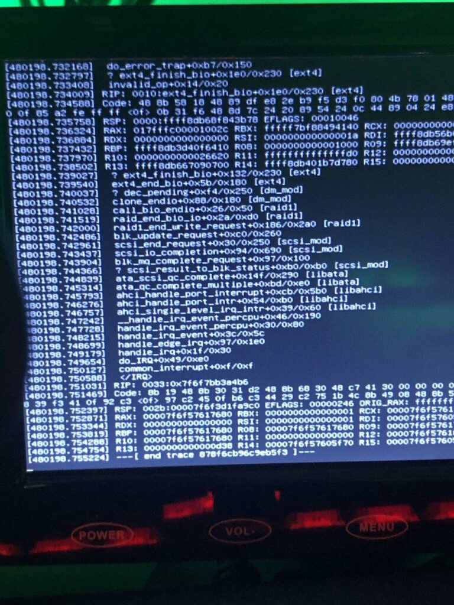
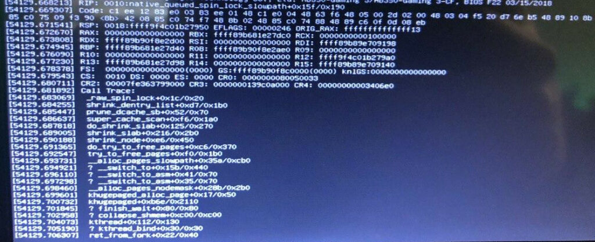

Most of us have seen, debugged, and solved a lot of tech issues in our lives - from understanding that cheap PSU mean a lot of smoke, through off-by-one errors in your favorite programming language, all the way to [finding segfaults in grep](http://blog.loadzero.com/blog/tracking-down-a-segfault-in-grep/).

This is the story on how a broken stick of DDR-4 memory was hiding in plain sight for almost a year.

## Humble beginnings

In April of 2019, [I built a home server](https://chollinger.com/blog/2019/04/building-a-home-server/). It ran great, for the most part. The only thing that was always weird: My two oldest drives, a pair of WD Red 3TB NAS drives, young for their age with only ~20,000 or so hours on the clock, seemingly refused to accept larger volumes of data.

A simple `rsync` run like this:


sudo rsync -P -aht --out-format="%t %f %b" /mnt/3TB/ /mnt/6TB/ --exclude=".Trash-1000" --exclude="Thumbs.db" 


Would randomly stop, seemingly for no good reason. Not only did it stop, it also rendered the entire machine unusable.

When piping the whole thing to a log, including `stderr`, the output would stop like such:


3TB/Photos/2002/02/dad/IMG-0814.JPG
# <- nothing here


## Configuration mishaps

The drives in question were up as software RAID-1 with `mdadm`, LUKS encryption on top of `ext4` as file system, it wasn't exactly a very sophisticated setup that caused me to believe I messed up the configuration. Still, worth a look.

Checking the array with `mdadm --detail` didn't show any signs of issues, pending resyncs, or any other obvious misconfigurations. The same could be said about `cryptsetup luksDump` - all was set up as desired (comments on the lack of ZFS, btrfs, or even LVMs will be piped to `/dev/null`).

Even `badblocks`, the tool to check for bad sectors, didn't yield any results.


nohup badblocks -nvs /dev/sda 1>&2  | tee sda.out &


I even tried to hunt down the original command using `strace`:


sudo strace -o strace-output.log -f rsync -P -aht --out-format="%t %f %b" /mnt/3TB/ /mnt/6TB/ --exclude=".Trash-1000" --exclude="Thumbs.db"


To no avail.

So, must be a dead hard-drive (or maybe a SATA cable or a dying PCI-to-SATA card). Granted, the chances that both drives die at the same time are low, but not impossible.

## Blaming the wrong thing

So, I proceeded to simply not mount the array. After all, the server was brand new and still had plenty of space until I finally migrate all existing backup drives to it. So why bother?

My laziness was quick to bite me. After a couple of month, I migrated my `pihole`, a DNS-based, network-level ad and tracking blocker, on the server. It also happens to be a DHCP server.

The thing about DHCP servers is that their lack of availability isn't immediately obvious. If every device on the network has an IP assigned, there is little cause for concern. The same can be said for DNS - most devices will simply talk to their fallback DNS, like `8.8.8.8` or `1.1.1.1`.

One day, my internet was seemingly down. Quick to blame Comcast, I furiously proceed to restart both modem and router, to no avail. WiFi is there, but devices don't get IPs. Hm, weird.

After a while, it clicked - the server is the one doing the address assignment. If it's down, no device can join the network. Being stressed for time, I restarted the server, decrypted the drives, and went on my merry way, blaming a freak accident.

Back later, I proceed to look through `/var/log`, angrily searching for the deliquient. Porbably the Hipster technology's fault - Kubernetes, Docker, nodejs, golang - devil's work, I do declare!

Well, finding logs on a dead kernel is diffiult - after all, without a kernel to do I/O, the dead kernel writing to logs is unlikely. But one thing stood out: `munin`.

The last log that came in before the inevitable hard reset looked as follows:


bigiron smartd[786]: Device: /dev/sdd [SAT], SMART Usage Attribute: 194 Temperature_Celsius changed from 113 to 112
22:43:15 bigiron smartd[786]: Device: /dev/sdf [SAT], 1 Currently unreadable (pending) sectors
22:43:15 bigiron smartd[786]: Device: /dev/sdf [SAT], SMART Usage Attribute: 194 Temperature_Celsius changed from 61 to 60
22:50:01 bigiron CRON[9239]: (root) CMD (if [ -x /etc/munin/plugins/apt_all ]; then /etc/munin/plugins/apt_all update 7200 12 >/dev/null; elif [ -x /etc/munin/plug
ins/apt ]; then /etc/munin/plugins/apt update 7200 12 >/dev/null; fi)
08:09:52 bigiron systemd-modules-load[465]: Inserted module 'lp'


Munin, being the battle-hardened monitoring software it is, probably suffered from bad configuration, outdated packages, or anything of that nature. Makes sense - a single server in a house somewhere in North America uncovers a game-breaking bug on a software that monitors thousands and thousands of machines worldwide.

Not wanting to bother with it any further, I removed munin. I'm too stupid for it anyways.

## Farenheit 233

But another thing bothered me: Hard-drive temparatures of >110C are also not exactly likely - most will probably fail at around 80C. On a reddit thread (about my very server, no less!), user `Tired8281` posted:

> `Unfortunately I made a single stupid mistake with the hardware setup and the software setup I used didn't catch it, and three months later half of the drives died`
> 
> `[...]`
> 
> `Promise you won't laugh? I installed the fan wrong. Instead of sucking the hot air from the CPU out of the case, it sent that hot air into the drive cage, slow roasting my hard drives`
> 
> [https://old.reddit.com/r/linux/comments/cq9few/building\_a\_home\_server/ewvcx9o/](https://old.reddit.com/r/linux/comments/cq9few/building_a_home_server/ewvcx9o/)

I did not laugh. I thought I did the same thing. Sitting down, taking the thing part, checking airflow, even searching "how to install case fans" - something I have done dozens upon dozens of times (I have way too many computers) - only to realize that everything was fine and in fact, nothing in there seemed absurdly warm. There is an A/C vent right next to the box and I use plenty of high-quality fans.

Must be S.M.A.R.T. Stupid thing, never reliable. And even more reason to blame the drives!

Only... /dev/sdf was never part of the seemingly broken 3TB array.

## Chasing the wrong thing

Let's summarize: Melting hard drives. A deadlocked system when copying data. Log messages right before the system locks up by a monitoring software, probably doing plenty of I/O.

Time to track this down: Starting yet another rsync on the "bad" drives, I am greeted with this:  

Ha, **I knew it**! `ext4_finish_bio`! Ext4! `fs` module! It must be the hard drive! Here is the pesky thing:


static void ext4\_finish\_bio(struct bio \*bio)
static void ext4_finish_bio(struct bio *bio)
{
    int i;
    struct bio_vec *bvec;
 
    bio_for_each_segment_all(bvec, bio, i) {
        struct page *page = bvec->bv_page;
#ifdef CONFIG_EXT4_FS_ENCRYPTION
        struct page *data_page = NULL;
#endif
        struct buffer_head *bh, *head;
        unsigned bio_start = bvec->bv_offset;
        unsigned bio_end = bio_start + bvec->bv_len;
        unsigned under_io = 0;
        unsigned long flags;
 
        if (!page)
            continue;
 
#ifdef CONFIG_EXT4_FS_ENCRYPTION
        if (!page->mapping) {
            /* The bounce data pages are unmapped. */
            data_page = page;
            fscrypt_pullback_bio_page(&amp;page, false);
        }
#endif
 
        if (bio->bi_status) {
            SetPageError(page);
            mapping_set_error(page->mapping, -EIO);
        }
        bh = head = page_buffers(page);
        /*
         * We check all buffers in the page under BH_Uptodate_Lock
         * to avoid races with other end io clearing async_write flags
         */
        local_irq_save(flags);
        bit_spin_lock(BH_Uptodate_Lock, &amp;head->b_state);
        do {
            if (bh_offset(bh) < bio_start ||
                bh_offset(bh) + bh->b_size > bio_end) {
                if (buffer_async_write(bh))
                    under_io++;
                continue;
            }
            clear_buffer_async_write(bh);
            if (bio->bi_status)
                buffer_io_error(bh);
        } while ((bh = bh->b_this_page) != head);
        bit_spin_unlock(BH_Uptodate_Lock, &amp;head->b_state);
        local_irq_restore(flags);
        if (!under_io) {
#ifdef CONFIG_EXT4_FS_ENCRYPTION
            if (data_page)
                fscrypt_restore_control_page(data_page);
#endif
            end_page_writeback(page);
        }
    }
}

[https://elixir.bootlin.com/linux/v4.19.106/source/fs/ext4/page-io.c#L62](https://elixir.bootlin.com/linux/v4.19.106/source/fs/ext4/page-io.c#L62)

After searching for it, here's the entirety of the internet's wisdom on it, in mailing list thread from 2005: [https://www.redhat.com/archives/dm-devel/2015-October/msg00046.html](https://www.redhat.com/archives/dm-devel/2015-October/msg00046.html)

Only... I'm running `Debian 10`, Kernel `4.19`.

More confused than ever before - how a standard call in the `ext4` kernel module could cause a deadlock, on a recent (stable) kernel, that was beyond me.

Also, we can see this:

invalid_op+0x14/0x20

Uh, an invalid op code?

ENTRY(invalid_op)
    ASM_CLAC
    pushl   $0
    pushl   $do_invalid_op
    jmp error_code
END(invalid_op)

[https://elixir.bootlin.com/linux/v4.2/source/arch/x86/entry/entry\_32.S#L743](https://elixir.bootlin.com/linux/v4.2/source/arch/x86/entry/entry_32.S#L743)

Hm, a CPU problem? Knowing the types of issues older BIOS version can cause with AMD Ryzen CPUs, I now proceed to update the BIOS, hoping for change. It did not happen.

## Finding a clue

Frustrated, I'm almost ready to spend the hundreds of dollars a fresh pair of NAS drives would cost me. Forunately, one Sunday afternoon at Costco, my partner and I see an 8TB external drive on sale for $120. That seemed like a good investment to run some additional backups before finally replacing the drives. Alongside a galon of olive oil and chicken stock in restaurant-supply quantities, we get home and I start setting up th drive.

Naive like I am, I plug it into the server, format it to ext4, add LUKS... and am met with an "Invalid Passphrase", even for a single-character password. Blaming a broken USB port, I plug it into my Laptop - running popOS! and a more recent kernel, I might add - and it works like a charm.

Back to the server it goes, start `rsync`, and I leave it alone.

This greeted me the next morning:  

Excuse me? [`_raw_sping_lock`](https://www.kernel.org/doc/Documentation/locking/spinlocks.txt)? What does **THAT** have to do with anything? Well, I suppose it the machine locks up, getting an exception from a call for multi-threading and interrupts makes some sense, but this time I couldn't blame `ext4`. What was going on?

## Realizing the true evil

Then it dawned on me. The server usually crashes at night. Automated backups run at night, but often times, they don't do a whole lot, given their incremental nature (especially if all I do is to play World of Warcraft on a Windows box). As these backups never hit the seemingly dead drives, I never fully made that connection.

`rsync` reads, compares, and writes data. The underlying kernel calls cache data, allocate pages, and process throug all required modules - the file system, mdadm, dm-crypt (which in term uses the kernel's crypto APIs) - and all while handling multiple threads.

While those operations might not cause a huge load on the system - in absolute terms, as in percentage of CPU cores used - it does a lot of small operations which all require synchronization

If at any point of these, bad memory causes the kernel to mess up the respective locks, it might very well deadlock and render the system unuseable, without greeting me with an actual Kernel Panic.

The more I started looking into this, the more I found:

Message from syslogd@bigiron at Feb 22 12:38:40 ...
kernel:\[ 7467.252060\] page:ffffe29fc735a400 count:-1 mapcount:-1 mapping:0000000000000000 index:0x1
 kernel:\[53370.089111\] watchdog: BUG: soft lockup - CPU#0 stuck for 22s! \[smbd:21214\]

Memory corruption can also explain a lot of the weirder issues - like hard drives seemingly about to melt into a fiery death, despite being at a comfortable temperature.

## Checking the hypothesis

This was easy: I ran `memtester` on the live system and found multiple issues; then, I used use `memtest86` on a bootable USB drive, only find plenty of issues. Theory confirmed.

After switching out the RAM - the one in question is a set of CORSAIR Vengeance LPX 2x8GB DDR4 CMK8GX4M1A2400C16 - force a large `rsync` job, and watch the machine do it's job like it was built for it.

## Conclusion

I'm not entirely sure what to say - but I sincerely hope somebody finds this while searching for obscure, seemingly random and unrelated issue, and is stopped from going insane.

I, for one, will start replacing RAM modules before going down the latter route.
