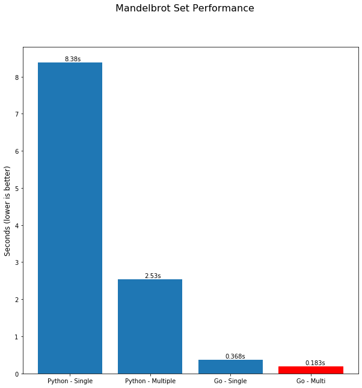
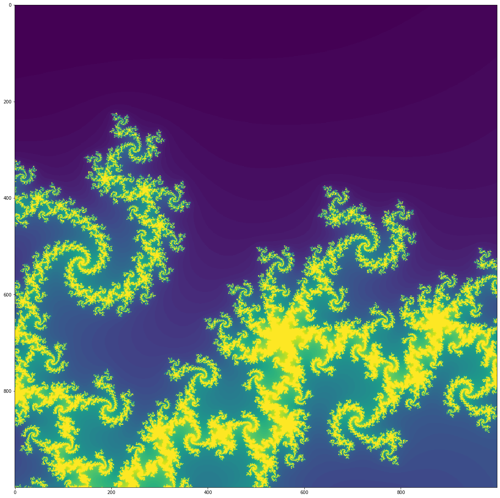
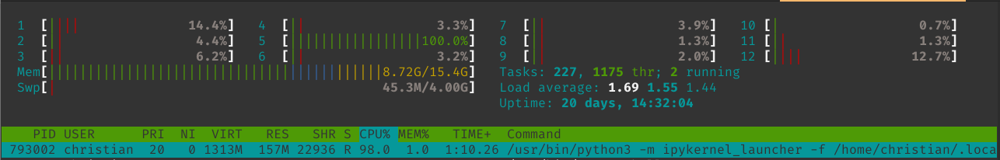
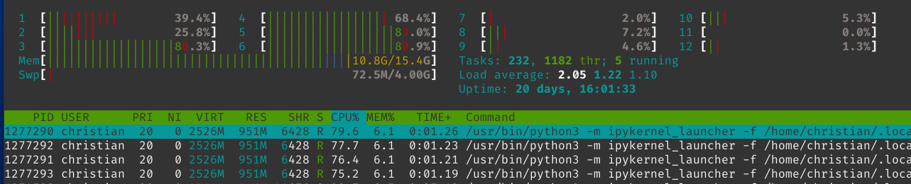
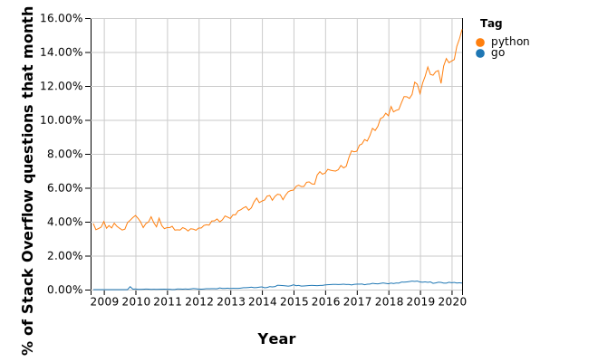
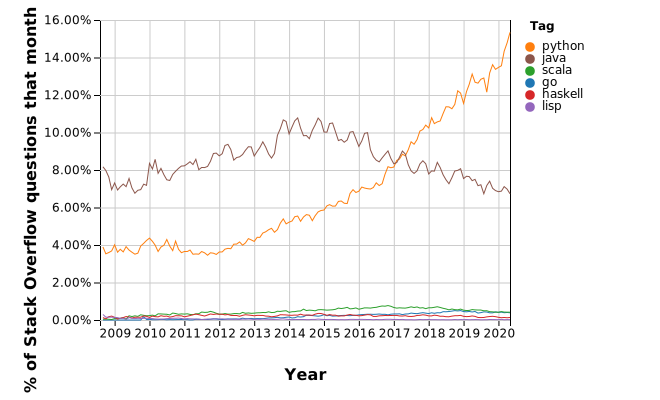
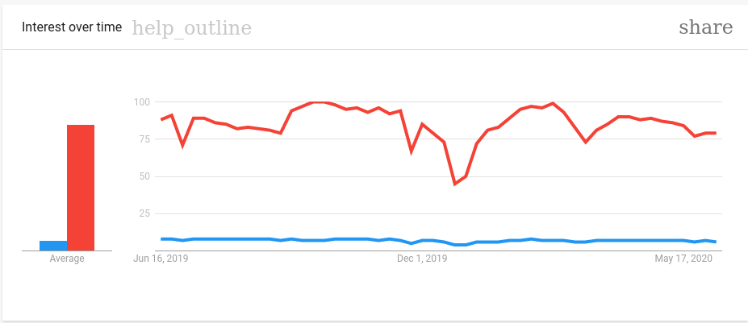
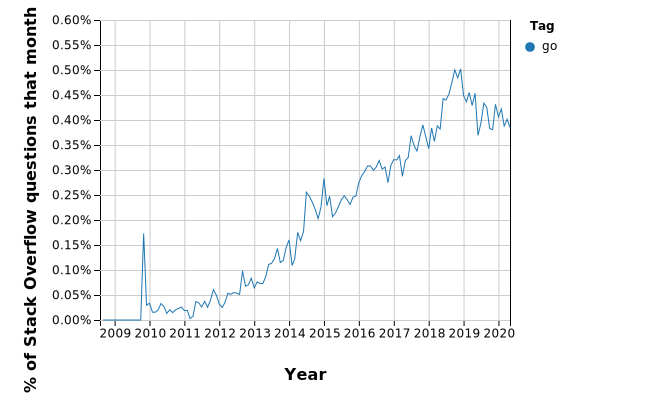

## Introduction 
> Exploring golang - can we ditch Python for go? And have we (as in "folks that work with a lot of data regularly") finally found a use case for go? Part 1 explores high-level differences between Python and go and gives specific examples on the two languages, aiming to answer the question based on Apache Beam and Google Dataflow as a real-world example.

[Apache Beam](https://beam.apache.org/) is something I've used on this blog a couple of times before: It's a unified programming model for both batch and streaming use cases that can handle [delightfully parallel workloads](https://en.wikipedia.org/wiki/Embarrassingly_parallel), allows for a lot of custom I/O and other connectors, and runs on a multitude of execution platforms, most notably Flink, Spark, and Google Cloud's Dataflow.

You can use it for streaming or batching data to analyze it, run ETL, enrich it - you name it. I've actually used `Beam` some years ago [here](https://chollinger.com/blog/2018/06/analyzing-reddits-top-posts-images-with-google-cloud-part-1/#introducing-data-flow).

Now, if you were to go to Beam's website, you'll find this wonderful graphic:

Which tells you that Beam is to be written in either `Java` or `Python` and everything else falls under "Other Languages". 

There is, however, an "experimental" [`go sdk`](https://beam.apache.org/documentation/sdks/go/) ([GitHub](https://github.com/apache/beam/tree/master/sdks/go)) that promises us to use `go` instead of `Python` - and that's what got me excited.

The next section will poorly attempt to give a "short" (~3,000 word) introduction to `go` and compare it to `Python` based on the different handling data engineering specific use cases and when using multi-threaded applications. Please note that this is by no means a full comparison.

> This is Part 1 of 2, focussing on the two languages and the current state of the Apache Beam SDK. In part 2 (coming soon), we'll explore how to use the `Beam` `go` SDK, what limitations we'll face on GCP, and where the journey for `go` for data engineers is headed. 

*All example code is available on [GitHub](https://github.com/otter-in-a-suit/chollinger-blog/tree/master/content/posts/2020/06/a-data-engineering-perspective-on-go-vs-python-part-1/code)*

## Go vs. Python
In case you are not familiar, let me quote Wikipedia:
> Go is a statically typed, compiled programming language designed at Google by Robert Griesemer, Rob Pike, and Ken Thompson.
> Go is syntactically similar to C, but with memory safety, garbage collection, structural typing, and CSP-style concurrency. 
> 
> https://en.wikipedia.org/wiki/Go_(programming_language)

`Go` has a lot of concepts that should get you excited for a parallel execution framework that handles data. In the following sections, we'll explore some hand-picked concepts and examples and conclude with a longer, more in-depth concurrency sample.

### Speed
`go`, being a complied as opposed to an interpreted language, is [supposed to be faster than Python](https://benchmarksgame-team.pages.debian.net/benchmarksgame/fastest/go-python3.html). It also has a tendency to compile things really quickly and shipping compiled code to end-users is orders of magnitude easier than attempting to do the same with Python.

You can find some hands-on examples below.

### Static typing
Static, as opposed to `Python`'s dynamic typing, avoids a lot type headaches with using the right data type in the right moment. 

> I am not attempting to start a general comparison between static and dynamic typing and the intricacies of Python, but merely looking at it from my experience, specifically in the data space, on a day-to-day basis.

In data-driven projects, you will constantly find yourself dealing with very strict data type definitions, often an artifact (and rightfully so) of an area where all corporate data was inevitably stored in a large RDMBs, such as Oracle, enforcing strict typing.

Python-based frameworks, such as `pySpark` or even `pandas`, ship with their own abstraction layer for providing types ([see dtypes](https://pandas.pydata.org/pandas-docs/stable/reference/api/pandas.DataFrame.dtypes.html)).

Take this code, written for `pySpark`, a popular data processing framework that is available in Python (amongst others) for instance, using the NYC Yellow Cab data [0].

First, read a CSV file into an `RDD`, a "resilient, distributed dataset", and apply some transformation lambdas on each line in the data set.

# Read data
rdd = sc.textFile('data/yellow_tripdata_2019-01.csv')
# Parse the RDD
rdd = rdd.map(lambda r: r.split(','))\
         .map(lambda r: (r[10],r[13])) # Take 'fare_amount' and 'tip_amount'
rdd = rdd.filter(lambda r: 'fare_amount' not in r) # filter header
rdd.take(1)


Which yields:

[('7', '1.65'), ('14', '1'), ('4.5', '0'), ('3.5', '0'), ('52', '0')]


If we look into one of the tuples:

type(rdd.take(1)[0][0])


We'll see `str` as the data type.

Now, if we were to reduce this to sum up the Taxi fare and tip amount:

def sum_fares(fare, tip):
    return fare + tip

rdd.map(lambda r: sum_fares(*r)).take(5)


As the quotes in the above output indicate, the result is a list of concatenated `strings`.

['71.65', '141', '4.50', '3.50', '520']


Instead of the mathematically correct: 

rdd.map(lambda r: sum_fares(*[float(x) for x in r])).take(5)
# [8.65, 15.0, 4.5, 3.5, 52.0]


Newer versions of Python support `type hints` and the Python interpreter keeps track of variable types. However, as the above example highlights, I personally find it hard to maintain a consistent, readable, and maintainable code base, especially on complex applications.

`go`, on the other hand, is statically typed. 


package main

import (
	"fmt"
	"reflect"
)

func main() {
    // Implicit
	str := "A String"
	fmt.Printf("%s is %s\n", str, reflect.TypeOf(str))

    // Explicit
	var x float64 = 3.14
	fmt.Printf("%v is %s\n", x, reflect.TypeOf(x))
}


Will yield:

go run test.go
A String is string
3.14 is float64


Whereas this:

str = x


Won't compile:


go run testvar.go
# command-line-arguments
./test.go:15:6: cannot use x (type float64) as type string in assignment


Go does not support `Generics`, but neither does `Python`.

> I have skipped over `go`'s `empty interface{}` concept to support arbitrary values and to handle unknown types; it is possible to use this concept for several corner cases where an abstraction of weak types are required

*[0] `Spark`'s SQL interface will infer string types and allows for mathematical operations on Strings, if they are consistent*

### Interfaces and Structs
`Python` does have a `class` structure (and I've used it extensively), whereas `go` uses `structs` and `interfaces` (and this is a terrible simplification). `go` does not have inheritance and relies on interfaces and composition.

In the data world, having a strict class structure, for instance to abstract transformations, statistical models, or just plain old data structures, can be both a pain and a curse.

`Python` makes extensive use of `dicts` that can hold arbitrary key-value pairs and nested structures and are similar in syntax to `JSON`, as well as defined `class`es for structured abstractions of data. Almost every data framework ships with their own `schema` classes. `go`, in theory, could avoid that through a combination of `interfaces` (for standards), static typing (to ensure the right data type is used at the right moment), and `structs` to define structure and logic.

Here's an questionably useful example that uses the interface `CoordinateData`, with the function `calculateDistance`, to calculate a distance between 2 coordinate tuples in the world's worst GIS analytics platform :)


package main

import (
	"fmt"
	"math"
)

// A Resource we're trying to access
type CoordinateData interface {
	calculateDistance(latTo, lonTo float64) float64
}


We then implement Geospatial data and the Haversine function (to approximate distance on earth):

type GeospatialData struct {
	lat, lon float64
}

const earthRadius = float64(6371)
func (d GeospatialData) calculateDistance(latTo, lonTo float64) float64 {
	// Haversine distance
	var deltaLat = (latTo - d.lat) * (math.Pi / 180)
	var deltaLon = (lonTo - d.lon) * (math.Pi / 180)
	
	var a = math.Sin(deltaLat / 2) * math.Sin(deltaLat / 2) + 
		math.Cos(d.lat * (math.Pi / 180)) * math.Cos(latTo * (math.Pi / 180)) *
		math.Sin(deltaLon / 2) * math.Sin(deltaLon / 2)
	var c = 2 * math.Atan2(math.Sqrt(a),math.Sqrt(1-a))
	
	return earthRadius * c
}


And the same on a simple, 2-dimensional plane:

type CartesianPlaneData struct {
	x, y float64
}

func (d CartesianPlaneData) calculateDistance(xTo, yTo float64) float64 {
	// Simple 2-dimensional Euclidean distance 
	dx := (xTo - d.x)
	dy := (yTo - d.y)
	return math.Sqrt( dx*dx + dy*dy )
}


In this case, the `main()` function simply calculates 2 completely different types of distance:

func main() {
	atlanta := GeospatialData{33.753746, -84.386330}
	distance := atlanta.calculateDistance(33.957409, -83.376801) // to Athens, GA
	fmt.Printf("The Haversine distance between Atlanta, GA and Athens, GA is %v\n", distance)

	pointA := CartesianPlaneData{1, 1}
	distanceA := pointA.calculateDistance(5, 5) 
	fmt.Printf("The Pythagorean distance from (1,1) to (5,5) is %v\n", distanceA)
}


Of course, this is a very simplistic example that simply forces structure onto your structs. However, comparing it to Python, my options are limited:


class CoordinateData:
    def calculateDistance(self, latTo, lonTo):
        pass 

class GeospatialData(CoordinateData):
    def __init__(self, lat, lon):
        self.lat = lat
        self.long = lon

    def calculateDistance(self, latTo, lonTo):
        # Haversine goes here :)
        return 95.93196816811724

class CartesianPlaneData(CoordinateData):
    def __init__(self, x, y):
        self.x = y
        self.x = y

    # Let's not implement calculateDistance()

if __name__ == "__main__":
    atlanta = GeospatialData(33.753746, -84.386330)
    distance = atlanta.calculateDistance(33.957409, -83.376801) # to Athens, GA
    print('The Haversine distance between Atlanta, GA and Athens, GA is {}'.format(distance))

    pointA = CartesianPlaneData(1,1)
    distanceA = pointA.calculateDistance(5, 5)
    print('The Pythagorean distance from (1,1) to (5,5) is {}'.format(distanceA))
    print('pointA is of type {}'.format(pointA.__class__.__bases__))


This is valid Python - `CartesianPlaneData` is a subclass (*not an interface* - Python uses duck-typing) of `CoordinateData` and hence, simply uses the `calculateDistance` method without a return type (see above for static vs. dynamic typing), runs, and returns:


python3 interface_example.py
The Haversine distance between Atlanta, GA and Athens, GA is 95.93196816811724
The Pythagorean distance from (1,1) to (5,5) is None
pointA is of type (<class '__main__.CoordinateData'>,)


Python does still allow for interface abstractions and you can absolutely use classes to define hierarchies and logic, as I've done with the below `PluginInterceptor` to determine whether a custom Plugin is part of a defined base class; this, however, is not enforced during runtime and might go belly-up if you implement it incorrectly.


class PluginInterceptor:
    """Loads all allowed plugins, when they are a subclass of `BasePlugin` and have the constant `name` set (not `__name__`)
    """
    def __init__(self):
        self.cls = BasePlugin
        self.allowed_plugins = self.__load__allowed_plugins__()
        
    def __get_all_subclasses__(self, cls):
        return set(cls.__subclasses__()).union(
            [s for c in cls.__subclasses__() for s in self.__get_all_subclasses__(c)]) 
    
    def __load__allowed_plugins__(self):
        __allowed_plugins__ = {}
        for cls in self.__get_all_subclasses__(self.cls):
            if cls.name:
                __allowed_plugins__[cls.name] = cls
        return __allowed_plugins__

https://github.com/otter-in-a-suit/scarecrow/blob/master/plugin_base/interceptor.py#L5

You will also find an example of a struct used in the Mandelbrot example below.

### Pointers
`go` knows pointers, but no pointer arithmetic. Pointers in `go` are used for pass-by-pointer operations, as opposed to pass-by-value. I won't go into this too much  and leave you with an example from `go` and refer you to [this wonderful post](https://robertheaton.com/2014/02/09/pythons-pass-by-object-reference-as-explained-by-philip-k-dick/) for Python.


package main

import "fmt"

func main() {
	i, j := 42, 2701

	p := &i         // point to i
	fmt.Println(*p) // read i through the pointer
	*p = 21         // set i through the pointer
	fmt.Println(i)  // see the new value of i

	p = &j         // point to j
	*p = *p / 37   // divide j through the pointer
	fmt.Println(j) // see the new value of j
}

(From https://tour.golang.org/moretypes/1)

My short summary for `go` would be: As a developer, I am able to control whether I'd like the standard `C`-style behavior - pass-by-value - or a pointer, where I still pass by value - but in this case, a *pointer to the value* as function argument.

## Concurrency with a Mandelbrot Set
Easy, out-of-the-box, easy-to-use concurrency is one of the most wonderful things in `go`. It takes a total of two letters - `go` - to move something from synchronous to concurrent.

Let's use a "pleasingly parallel" algorithm, the **Mandelbrot Set**.

> The Mandelbrot set is the set of complex numbers `c` for which the function  does not diverge when iterated from , i.e., for which the sequence , , etc., remains bounded in absolute value.
>
> https://en.wikipedia.org/wiki/Mandelbrot_set

### Python
Let's look at Python first.

Python offers a multitude of ways to express concurrency - `threading`, `multiprocessing`, `subprocesses`, `concurrent.futures` to name a few - but choosing the correct one *and* writing legible code is a challenge. Allow me to quote the docs:

> The modules described in this chapter provide support for concurrent execution of code. The appropriate choice of tool will depend on the task to be executed (CPU bound vs IO bound) and preferred style of development (event driven cooperative multitasking vs preemptive multitasking)
https://docs.python.org/3/library/concurrency.html

I will not go into the details on what is the right choice for which situation, how the Global Python Interpreter (GIL) affects it, or how everything works under the hood, as there are hundreds of great articles on the topic that can be easily found online. What I would like to focus on, however, are code style, ease-of-use, and performance.

#### Single-Threaded
This can be expressed as such (by [danyaal](https://github.com/danyaal/mandelbrot), with adjustments by yours truly):

> Keep in mind that there are a lot more, quicker, optimized, but also more *complex* versions; the below examples are supposed to be simple & straightforward and can be translated almost 1:1 between `go` and `Python`

First, we define the iterations for the algorithm. This is the part that can be run in parallel, as we'll see in a second.

import numpy as np
import matplotlib.pyplot as plt

# counts the number of iterations until the function diverges or
# returns the iteration threshold that we check until
def countIterationsUntilDivergent(c, threshold):
    z = complex(0, 0)
    for iteration in range(threshold):
        z = (z*z) + c

        if abs(z) > 4:
            break
            pass
        pass
    return iteration


The next function is a bit of a monolith, but in the end, simply creates both the real and imaginary axis, assigns them to a 2-dimensional array, and runs the loop.

 def mandelbrot(threshold, density):
    # location and size of the atlas rectangle
    # realAxis = np.linspace(-2.25, 0.75, density)
    # imaginaryAxis = np.linspace(-1.5, 1.5, density)
    realAxis = np.linspace(-0.22, -0.219, 1000)
    imaginaryAxis = np.linspace(-0.70, -0.699, 1000)
    realAxisLen = len(realAxis)
    imaginaryAxisLen = len(imaginaryAxis)

    # 2-D array to represent mandelbrot atlas
    atlas = np.empty((realAxisLen, imaginaryAxisLen))

    print('realAxisLen: {}, imaginaryAxisLen: {}'.format(realAxisLen, imaginaryAxisLen))
    
    # color each point in the atlas depending on the iteration count
    for ix in range(realAxisLen):
        for iy in range(imaginaryAxisLen):
            cx = realAxis[ix]
            cy = imaginaryAxis[iy]
            c = complex(cx, cy)

            atlas[ix, iy] = countIterationsUntilDivergent(c, threshold)
            pass
        pass

    return atlas.T   


The computation happens on a single thread, as can be seen here:

#### Multi-Threaded
Now, for running it in multiple threads, we can use the `multiprocessing` module and run it like this.

The `calc_row()` function can be simplified, but it indicates what we're doing differently: Calculating the image row-by-row, as opposed to one point at a time.

import multiprocessing as mp
import itertools

def calc_row(cx, cy, threshold=120):
    c = complex(cx[1], cy[1])
    return (cx[0], cy[0], countIterationsUntilDivergent(c, threshold))


Next, I made the questionable decision to simplify the loop by using `starmap` and a `Pool`, giving it permutations of the nested loop directly as arguments.

In other words, we're running `calc_row(cx, cy, threshold)` on however many processes we give the process pool. The `multiprocessing` library takes care of passing the arguments from our `list` or `iterator` respectively.

We are also returning a funky-looking tuple, so we can keep track of the index in the image.


def mandelbrot_multi(threshold, density, cpus=4):
    realAxis = np.linspace(-0.22, -0.219, 1000)
    imaginaryAxis = np.linspace(-0.70, -0.699, 1000)
    realAxisLen = len(realAxis)
    imaginaryAxisLen = len(imaginaryAxis)
    atlas = np.empty((realAxisLen, imaginaryAxisLen))
    
    # Create list of permutations
    realAxis = [(i,e ) for i,e in enumerate(realAxis)] 
    imaginaryAxis = [(i,e ) for i,e in enumerate(imaginaryAxis)] 

    paramlist = list(itertools.product(realAxis, imaginaryAxis))
    paramlist = list(map(lambda t: t + (threshold,),paramlist))
    
    # Create a multiprocessing pool
    pool = mp.Pool(cpus)
    
    n = pool.starmap(calc_row, paramlist)
    pool.close()
    pool.join()
    return n, atlas


Which uses our available resources a lot more cleverly:

From a performance standpoint, we're looking at **8.4s** on a single CPU and **2.53s** concurrently, with a noticeable memory overhead due to the use of the `mutliprocessing` module.

> There are of course a lot of different ways of speeding this up - `Cython`, optimized `numpy`, `tensorflow`, to name a few - but looking at out-of-the-box concurrency, let's compare that to `go`. I am not good at choosing examples and fractals are pretty. :)

### Go
Let's look at how it looks in `go`.

#### Single-Threaded
The single threaded version isn't too different. I'm re-using the same code, but simply re-wrote it in `go`.

> Most `go` implementations are using the `Image` package to generate the image in go - and that makes sense for a self-contained project. Here, however, I wrote the array to disk and read it in `numpy` and therefore, `Python`, to keep the code concise.
> Performance numbers for both `Python` and `go` are **just the calculation**, not I/O or drawing pixels!

First, we import the required packages and write a `np.linespace()` equivalent that returns evenly spaced numbers over a specified interval.

package main

import (
	"bytes"
	"fmt"
	"log"
	"math/cmplx"
	"os"
	"strings"
	"time"

	"encoding/binary"
)

func linspace(start, end float64, num int) []float64 {
	result := make([]float64, num)
	step := (end - start) / float64(num-1)
	for i := range result {
		result[i] = start + float64(i)*step
	}
	return result
}


The rest of the code should look familiar - note the very specific, strongly typed data types, and return types.

func countIterationsUntilDivergent(c complex128, threshold int64) int64 {
	z := complex(0, 0)
	var ix int64 = 0
	for i := int64(0); i < threshold; i++ {
		ix = i
		z = (z * z) + c
		if cmplx.Abs(z) > 4 {
			return i
		}
	}
	return ix
}

func mandelbrot(threshold, density int64) [][]int64 {
	realAxis := linspace(-0.22, -0.219, 1000)
	imaginaryAxis := linspace(-0.70, -0.699, 1000)
	fmt.Printf("realAxis %v\n", len(realAxis))
	fmt.Printf("imaginaryAxis %v\n", len(imaginaryAxis))
	atlas := make([][]int64, len(realAxis))
	for i := range atlas {
		atlas[i] = make([]int64, len(imaginaryAxis))
	}
	fmt.Printf("atlas %v\n", len(atlas))
	for ix, _ := range realAxis {
		for iy, _ := range imaginaryAxis {
			cx := realAxis[ix]
			cy := imaginaryAxis[iy]
			c := complex(cx, cy)
			//fmt.Printf("ix, iy: %v %v\n", ix, iy)
			atlas[ix][iy] = countIterationsUntilDivergent(c, threshold)
		}
	}
	return atlas
}


#### Multi-Threaded
Go makes this a lot easier, by using a concept called `goroutines`. Instead of having to deal with the Python `mutltiprocessing` module, `pools`, `map` vs. `starmap` and the intricacies of the Python Interpreter, we can simply use the `go` directive.

> As I've mentioned earlier, the code here is intentionally simple and could be trivially optimized, but I tried to keep the `go` code as close to the `Python` code as possible. Please forgive any simplifications.

First, we'll re-create the `calc_row` method from Python, this time using a `struct` to return the indexes and the value, as the `channel` we'll use in second won't take multiple return types:

type triple struct {
	ix, iy int64
	c      int64
}

func calcRow(ix, iy int64, c complex128, threshold int64) triple {
	return triple{ix, iy, countIterationsUntilDivergent(c, threshold)}
}


Our main function will use 2 concepts: `channels` and the aforementioned `goroutine`. 

A [goroutine](https://golang.org/doc/effective_go.html#goroutines) has a simple model: it is a function executing concurrently with other goroutines in the same address space. The go docs compare it to the Unix shell `&` operator, which I find to be a great analogy.

The [channel](https://golang.org/doc/effective_go.html#channels) we are using is a *buffered* channel that acts like a pipe for our concurrent function, as non-buffered channels are blocking by nature. 

Which leads to the following code that wraps the inner loop (see above for comments on trivial optimization and the lack thereof here - I believe even a pointer to a `WaitGroup` in the `goroutine` and a smaller `channel buffer` might speed this up, but I haven't tested it yet) in a `goroutine`.

func mandelbrot(threshold, density int64) [][]int64 {
	realAxis := linspace(-0.22, -0.219, 1000)
	imaginaryAxis := linspace(-0.70, -0.699, 1000)
	atlas := make([][]int64, len(realAxis))
	for i := range atlas {
		atlas[i] = make([]int64, len(imaginaryAxis))
	}
	// Make a buffered channel
	ch := make(chan triple, int64(len(realAxis))*int64(len(imaginaryAxis)))

	for ix, _ := range realAxis {
		go func(ix int) {
			for iy, _ := range imaginaryAxis {
				cx := realAxis[ix]
				cy := imaginaryAxis[iy]
				c := complex(cx, cy)
				res := calcRow(int64(ix), int64(iy), c, threshold)
				ch <- res
			}
		}(ix)
	}

	for i := int64(0); i < int64(len(realAxis))*int64(len(imaginaryAxis)); i++ {
		select {
		case res := <-ch:
			atlas[res.ix][res.iy] = res.c
		}
	}
	return atlas
}


Now, for `go`, we're looking at **0.38s** on a single CPU and **0.18s** concurrently in code that, while similar, is a lot more concise.

### Final Performance
I'm just going to leave this here. As I've outlined previously, both the `go` and `Python` code can be further optimized, but we still get  a speedup of ~45x 

## Real-Life Considerations
Talking about theoretical concepts might be interesting, but that is only a relatively small part of the puzzle. While I am sure 2020 will be the year of `Haskell` in widespread production use, my approach to choosing, using, and recommending people to learn a language is mostly based around real-life uses, less so academic ideals. 

### Language Popularity
This is always a fun one. 

As per [StackOverflow](https://insights.stackoverflow.com/trends?tags=go%2Cpython), the popularity of go-related questions doesn't even come close to the major player that is Python.

Plotting this against some other big and small players - Java, Haskell, Scala, Lisp - shows similar results:

Now: Is "% of questions asked" a great metric? Probably not. Python is a very popular language to learn - I was just involved in preparing a training for it myself - and will naturally attract a huge crowd from both beginners and seasoned professionals.

The Google trends show a similar story:

(red - `Python`; blue - `go`)

I think its fair to say that Python is a lot more popular - but also that `go` has at least a niche, if not one one an upward trajectory. With the power of deceptive visualization, we can zoom into the above StackOverflow Graph:

And do, in fact, find an upward trajectory. 

Furthermore, if StackOverflow's yearly [developer survey](https://insights.stackoverflow.com/survey/2019#most-popular-technologies) is to be believed, `go` went up from 7.2% in 2018, to 8.8% in 2019, and up to 9.4% in [2020](https://insights.stackoverflow.com/survey/2020#technology-programming-scripting-and-markup-languages-professional-developers) when asked about "Most Popular Technologies".

As per the [same survey](https://insights.stackoverflow.com/survey/2020#technology-what-languages-are-associated-with-the-highest-salaries-worldwide-united-states), `go` programmers in the United States also rank #2 (up from #3 in 2019) in pay at $140,000 p.a., just behind `Scala` ($150,000).

There is hope! :)

### Ecosystem
Part of what explains the previous 2 graphs is the enormously wide ecosystem for Python - backend, frontend, statistics, machine learning, deep learning, graph analysis, GIS, robotics - it is there and it will have thousands of contributors and tens or hundreds of thousands users.

There are equivalents and I've tried to sum them up, alongside their relative popularity on GitHub here:

| Framework         | Python       | Contributors | Stars  | go                        | Contributors | Stars  |
|-------------------|--------------|--------------|--------|---------------------------|--------------|--------|
| Data Processing   | [Apache Spark](https://github.com/apache/spark) | 1505         | 26300  | [Apache Beam](https://github.com/apache/beam)[1]               | 608          | 4000   |
| Statistics        | [scikit-learn](https://github.com/scikit-learn/scikit-learn) | 1703         | 41100  | [sklearn](https://github.com/pa-m/sklearn)                   | 4            | 200    |
| Numerical Library | [numpy](https://github.com/numpy/numpy)        | 931          | 14000  | [gonum](https://github.com/gonum/gonum)                     | 84           | 3900   |
| Deep Learning     | [tensorflow](https://github.com/tensorflow/tensorflow)   | 2521         | 145000 | [tensorflow](https://github.com/tensorflow/tensorflow/tree/master/tensorflow/go) (experimental) | 2521         | 145000 |
| Dataframes        | [pandas](https://github.com/pandas-dev/pandas)       | 1956         | 25300  | [dataframe-go](https://github.com/rocketlaunchr/dataframe-go)              | 3            | 246    |

It is fairly clear that, at least from a data engineering and data science perspective, the go ecosystem has a long way to go.

_[1] Apache Beam is not a replacement for Spark_

### Learning Curve
This one is subjective - I personally find `Python` to be easier to learn only on the surface. `Python` is truly a rabbit hole, not unlike `Java`, if you really want to understand underlying concepts, architectures, and libraries.

`go`, on the other hand, is a fairly simple language that focusses on certain elements. Allow me to quote:
>  When Go was designed, Java and C++ were the most commonly used languages for writing servers, at least at Google. We felt that these languages required too much bookkeeping and repetition. Some programmers reacted by moving towards more dynamic, fluid languages like Python, at the cost of efficiency and type safety. We felt it should be possible to have the efficiency, the safety, and the fluidity in a single language.
>
> Go attempts to reduce the amount of typing in both senses of the word. Throughout its design, we have tried to reduce clutter and complexity. There are no forward declarations and no header files; everything is declared exactly once. Initialization is expressive, automatic, and easy to use. Syntax is clean and light on keywords. Stuttering (foo.Foo* myFoo = new(foo.Foo)) is reduced by simple type derivation using the := declare-and-initialize construct. And perhaps most radically, there is no type hierarchy: types just are, they don't have to announce their relationships. These simplifications allow Go to be expressive yet comprehensible without sacrificing, well, sophistication.
>
> Another important principle is to keep the concepts orthogonal. Methods can be implemented for any type; structures represent data while interfaces represent abstraction; and so on. Orthogonality makes it easier to understand what happens when things combine. 
>
> https://golang.org/doc/faq#creating_a_new_language

A quick peek at for instance `LinkedIn Learning` shows a total of 4 courses for `go` and 168 for `Python`.

In my very own experience, the most helpful thing was to go through [go by example](https://gobyexample.com/) and actually read the docs. Python, on the other hand, as a much broader level of external tutorials, courses, certifications, blog posts [...] from people like me, universities, and large companies.

> The query "go language tutorial" returns 1.7bn results on Google, whereas "python language tutorial" clocks in at 162bn results

## Apache Beam
Now, we've talked a lot about `go` vs `Python` in general. But what about the opener of this post - where do `Beam` and `Dataflow` come in?

> This section will be brief an extended upon in part 2 of this article

In general, the `beam` `go` SDK does provide the core functionalities you need to run a relatively simple job. It does, however, have a list of drawbacks at the time of writing (2020-06-11).

### Transformations
Let's look at available transformations across `beam`'s languages. I've cherry picked a couple, but feel free to refer to the overall docs to get a full picture:

| Language | ParDo        | Transforms                    | Options         |
|----------|--------------|-------------------------------|-----------------|
| Python   | Class        | Pipe-Apply Syntax of classes  | Argparse        |
| Java     | Static Class | Daisy-chained apply functions | Factory Pattern |
| go       | Function     | Functions                     | flag package    |

The most notable difference for people coming from `Python` will be the overall look of the pipeline.

This is how it's done in `Python` (Side note: There is nothing stoping you from calling `data.apply(func)`, as the operators are simply overloaded):

class CountWords(beam.PTransform):
  def expand(self, pcoll):
    return (
        pcoll
        # Convert lines of text into individual words.
        | 'ExtractWords' >>
        beam.FlatMap(lambda x: re.findall(r'[A-Za-z\']+', x))

        # Count the number of times each word occurs.
        | beam.combiners.Count.PerElement())

counts = lines | CountWords()

(Note the `|` and `>>` notation)

In `go`, it looks a lot more like a regular old function:

func CountWords(s beam.Scope, lines beam.PCollection) beam.PCollection {
	s = s.Scope("CountWords")

	// Convert lines of text into individual words.
	col := beam.ParDo(s, extractFn, lines)

	// Count the number of times each word occurs.
	return stats.Count(s, col)
}


> We will explore these details specificallt in part 2

### I/O
I/O is probably the most limited part of the `go` sdk, with a lot of connectors not being available for go.

> Please see [this link](https://beam.apache.org/documentation/io/built-in/) for an up-to-date overview.

| Type       | Language         | Python | Java | go  |
|------------|------------------|--------|------|-----|
| File-based | FileIO           | Yes    | Yes  | -   |
| File-based | AvroIO           | Yes    | Yes  | Yes |
| File-based | TextIO           | Yes    | Yes  | Yes |
| File-based | TFRecordIO       | Yes    | Yes  | -   |
| File-based | XmlIO            | -      | Yes  | -   |
| File-based | TikaIO           | -      | Yes  | -   |
| File-based | ParquetIO        | Yes    | Yes  | -   |
| File-based | ThriftIO         | -      | Yes  | -   |
| File-based | VcfIO            | Yes    | -    | -   |
| File-based | S3IO             | Yes    | -    | -   |
| File-based | GcsIO            | Yes    | -    | -   |
| FileSystem | HadoopFileSystem | Yes    | Yes  | -   |
| FileSystem | GcsFileSystem    | Yes    | Yes  | Yes |
| FileSystem | LocalFileSystem  | Yes    | Yes  | Yes |
| FileSystem | S3FileSystem     | -      | Yes  | -   |
| FileSystem | In-memory        | -      | -    | Yes |
| Messaging  | KinesisIO        | -      | Yes  | -   |
| Messaging  | AmqpIO           | -      | Yes  | -   |
| Messaging  | KafkaIO          | Yes    | Yes  | -   |
| Messaging  | PubSubIO         | Yes    | Yes  | -   |
| Messaging  | JmsIO            | -      | Yes  | -   |
| Messaging  | MqttIO           | -      | Yes  | -   |
| Messaging  | RabbitMqIO       | -      | Yes  | -   |
| Messaging  | SqsIO            | -      | Yes  | -   |
| Messaging  | SnsIO            | -      | Yes  | -   |
| Database   | CassandraIO      | -      | Yes  | -   |
| Database   | HadoopFormatIO   | -      | Yes  | -   |
| Database   | HBaseIO          | -      | Yes  | -   |
| Database   | HCatalogIO       | -      | Yes  | -   |
| Database   | KuduIO           | -      | Yes  | -   |
| Database   | SolrIO           | -      | Yes  | -   |
| Database   | ElasticsearchIO  | -      | Yes  | -   |
| Database   | BigQueryIO       | Yes    | Yes  | Yes |
| Database   | BigTableIO       | Yes    | Yes  | -   |
| Database   | DatastoreIO      | Yes    | Yes  | -   |
| Database   | SpannerIO        | -      | Yes  | -   |
| Database   | JdbcIO           | -      | Yes  | -   |
| Database   | MongoDbIO        | Yes    | Yes  | -   |
| Database   | MongoDbGridFSIO  | -      | Yes  | -   |
| Database   | RedisIO          | -      | Yes  | -   |
| Database   | DynamoDBIO       | -      | Yes  | -   |
| Database   | ClickHouseIO     | -      | Yes  | -   |
| Database   | DatabaseIO       | -      | -    | Yes |

If I had to give a summary: `go` on `beam` supports essential `Google Cloud` services and local development, whereas `Java` covers almost all cases. [2]

_[2] Keep in mind that some connectors, like `DatabaseIO`, are inherently language-specific_

### Runners
Finally, looking the available runners, `go` is more or less limited to `Direct` and `Dataflow`, falling in line with my statement on I/O.

| Language | Direct | Apex | Fink-Local | Flink-Cluster | Spark | Dataflow | Samza-Local | Nemo | Jet |
|----------|--------|------|------------|---------------|-------|----------|-------------|------|-----|
| Python   | Yes    | -    | (Yes)      | (Yes)         | (Yes) | Yes      | -           | -    | -   |
| Java     | Yes    | Yes  | Yes        | Yes           | Yes   | Yes      | Yes         | Yes  | Yes |
| go       | Yes    | -    | -          | -             | -     | (Yes)    | -           | -    | -   |

> A (yes) means that there are limitations to these runners

### Line-by-Line Example

I suggest going through [`WordCount`](https://beam.apache.org/get-started/wordcount-example/#minimalwordcount-example). 

`WordCount` is a great example, as it demonstrates the following concepts:
- Creating the Pipeline
- Applying transforms to the Pipeline
- Reading input 
- Applying ParDo transforms
- Applying SDK-provided transforms 
- Writing output (in this example: writing to a text file)
- Running the Pipeline

For the sake of brevity, I won't go into those details at this point.

## Conclusion
One of the first questions to ask should be: Is there even a point in comparing the two languages? My answer to that might be obvious - while `go` might have been designed for different use cases (general purpose scripting and machine learning use cases vs. systems / "cloud" programming), the concepts outlined above still make me excited from a data engineering perspective. 

`go` has many a concept that work without a massive `pip` dependency tree, produces clean code, is easy to compile, really fast, and (in my opinion) has a lot of potential for future data and ML use cases.

**In summary: `go` and `Python` are obviously very different languages - as I hopefully successfully outlined with my cherry-picked examples above**.

## Next Steps
As I've only skimmed the surface of `Apache Beam` in this article, the next one will focus on the following questions to use `Dataflow` as a real-world example for "`go` in the wild":
- How mature is the `go` Beam SDK?
- What does it support? What is missing?
- What are fundamental differences?
- (How) can we run a `Dataflow` job on `GCP`?

_All development and benchmarking was done under GNU/Linux [PopOS! 19.10 on Kernel 5.4] with 12 Intel i7-9750H vCores @ 4.5Ghz and 16GB RAM on a 2019 System76 Gazelle Laptop_