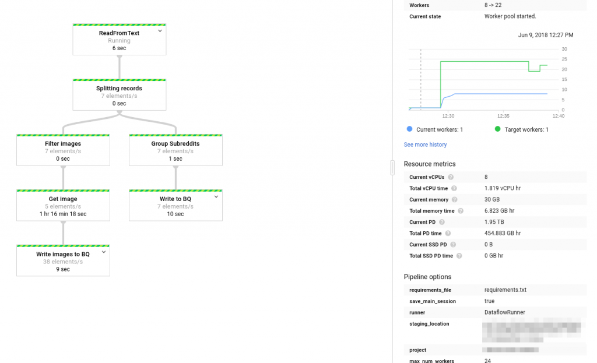
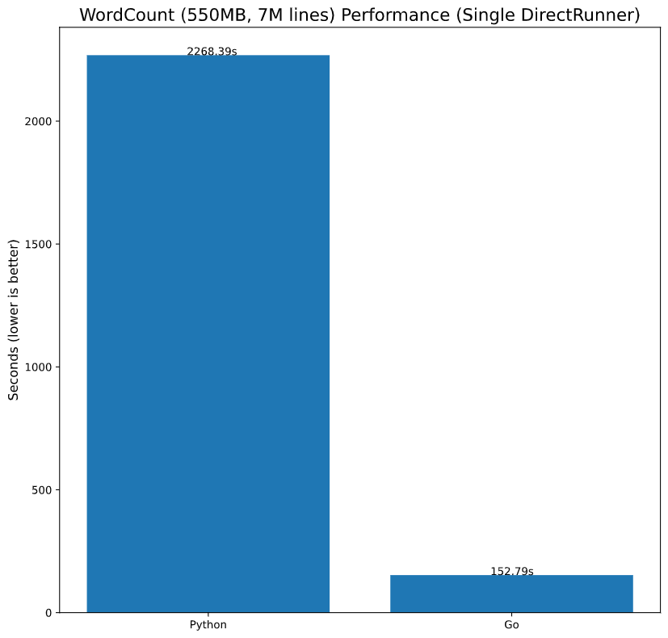
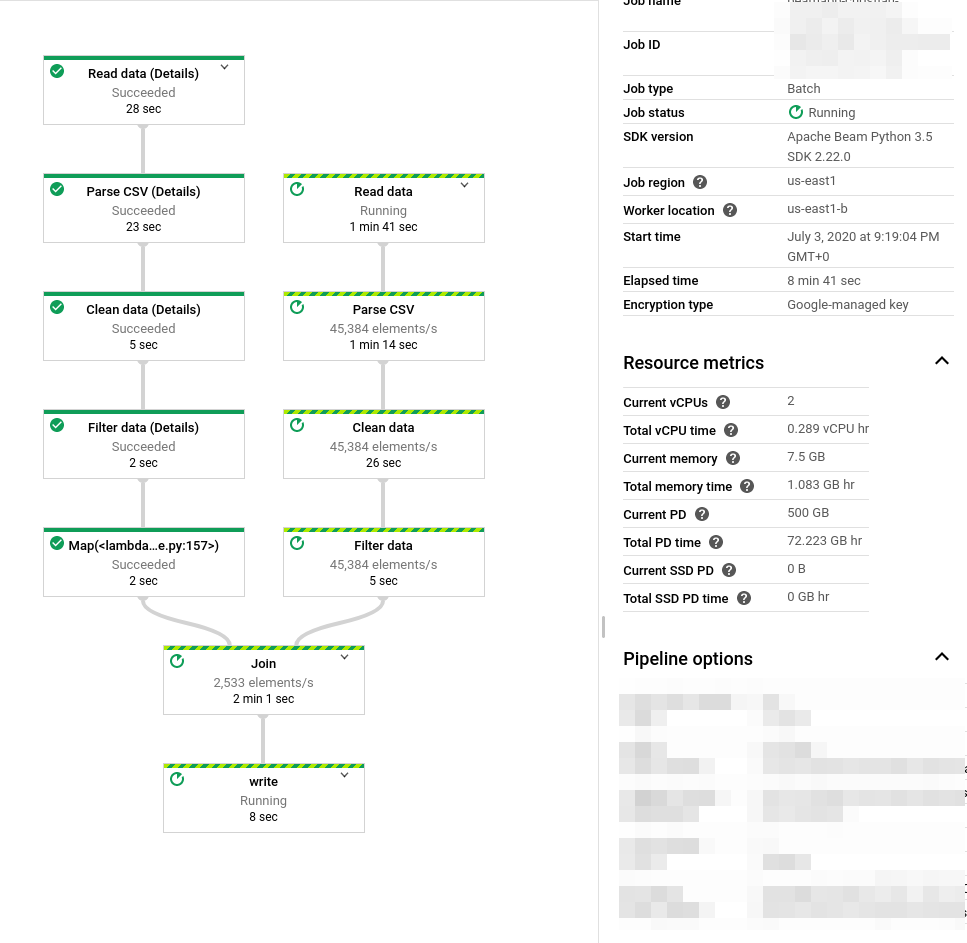
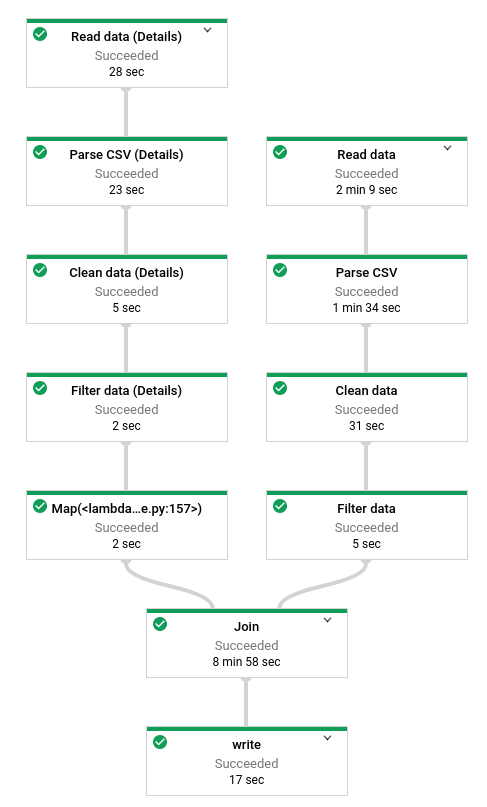
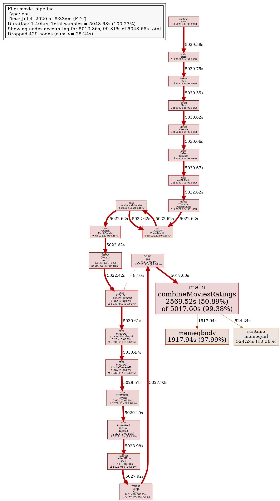
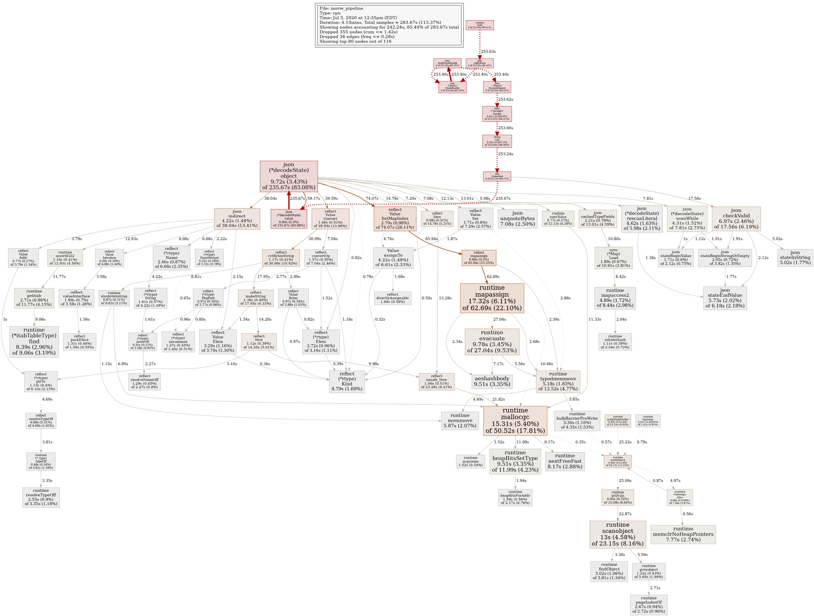
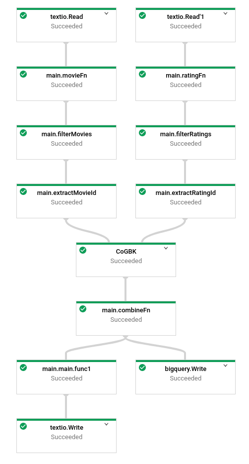
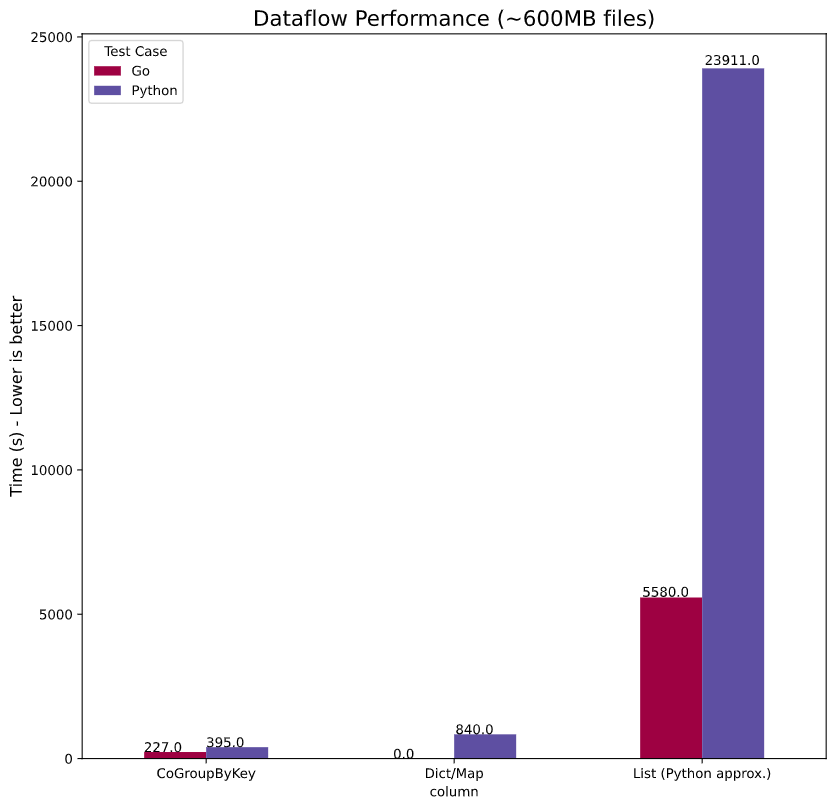

## Introduction 
In Part 2 of our comparison of Python and go from a Data Engineering perspective, we'll finally take a look at Apache Beam and Google Dataflow and how the go SDK and the Python SDK differ, what drawbacks we're dealing with, how fast it is by running extensive benchmarks,and how feasible it is to make the switch.

> You can find [Part 1 here](https://chollinger.com/blog/2020/06/a-data-engineering-perspective-on-go-vs.-python-part-1/)

## Apache Beam & Google Dataflow
While we have used [Apache Beam](https://beam.apache.org/) on several occasions [before](https://chollinger.com/blog/2018/06/analyzing-reddits-top-posts-images-with-google-cloud-part-1/#introducing-data-flow), allow me to give another short introduction.

>Apache Beam is an open source, unified model for defining both batch and streaming data-parallel processing pipelines. Using one of the open source Beam SDKs, you build a program that defines the pipeline. The pipeline is then executed by one of Beam’s supported distributed processing back-ends, which include Apache Flink, Apache Spark, and Google Cloud Dataflow.
>
>https://beam.apache.org/get-started/beam-overview/

Beam can be used for a variety of data use cases, not unlike Apache Spark - ETL (Extract, Transform, Load) pipelines, stream analytics, or simple data movement from, for instance, a file system to an RDMBS.

## Why Beam is interesting
One of the best professional advice I ever got is to ask "So What?". That being said: So what, why do I care about Beam?

For me, one of the most interesting aspects of Beam's model is the decoupling of pipeline logic, language, and execution environment. I can design my logic on a piece of paper (i.e., draw a `DAG` with some `Beam`-specific terminology - we'll do that in a second), implement it in any of the major languages - even multiple - and run it on any of the supported `Runners`.

The last time we used it on this blog, we used it to write a Pipeline to analyze reddit posts and executed it on the `Dataflow` runner as such:

As this pipeline was written in Python, there is nothing stopping us from running *the exact same job* on a on-premise Hadoop cluster, on AWS EMR, or just run it locally using the `DirectRunner`. This level of portability, in combination with a programming model that I happen to find more streamlined than say `Spark`'s, makes `Beam` a very interesting framework.

We'll actually do exactly that in the example section of this article and design a pipeline, write it in both `Python` and `go`, and run it on different `Runners`.

## Core Concepts
Everything in `Beam` starts with a `Pipeline.` The `Beam` programming model works by exposing high-level abstractions through code that allow your `Pipeline` to execute a graph of `PTransforms` on a given dataset, which in term is operating on immutable collections, called `PCollections`, which can be moved to a persistent state through `IO` operations. Jobs can be executed on different `Runners` to provide a (distributed) execution environment.

Let's dig into those concepts before we look at a real-world example.

> This is a condensed version of the [official Apache Beam documentation](https://beam.apache.org/documentation/programming-guide/), which I suggest you read in full for a more in-depth view

### Pipeline
A `Pipeline` object is the starting point of any job, which is usually initialized with a `configuration` object that defines *how* and *where* your pipeline runs.

### PCollections
A `PCollection`, not unlike a Spark `RDD` or `DataFrame`, are immutable collections of data that can be modified in-memory through the lifecycle of a pipeline. 

The data within a `PCollection` can be of any arbitrary type, as long as the elements can be encoded as `string` for serializing them across the workers.

`PCollections` can be of any size, but their elements might be worked on by different workers, if the collection is too large to fit into memory on a single worker node. Furthermore, they can be either *bounded* (i.e., have a fixed size) or *unbounded* (i.e., are "open ended", like in a streaming scenario).

### Transforms
`Transforms` apply logic on individual elements of a `PCollection`, by `apply`ing user code and logic, and returning a full `PCollection` that can be used in a subsequent step.

It is also possible to `branch` a pipeline, by splitting the DAG into multiple, independent steps:

(https://beam.apache.org/documentation/programming-guide/#applying-transforms)

Custom `transforms` need to adhere to some rules, most notably **serializability** (as data needs to be transmitted between workers), **single threaded execution** (as each element should be worked on, as orchestrated by the underlying Runner, in its own thread), and **idempotence** (as re-tries might occur).

`Beam` provides several core `transforms` that can be utilized out-of-the-box:
- `ParDo`
- `GroupByKey`
- `CoGroupByKey`
- `Combine`
- `Flatten`
- `Partition`

#### ParDo
A `ParDo` transform is probably the most common one, as it is comparable to a `map` operation: Applying logic to each element of a `PCollection` and returning said element (or not returning it and hence, `filtering` the collection).

Thing of `ParDo` as your fundamental building blog of a job that applies logic on a flat stream of data, which can then be further enhanced by `grouping`, `flattening`, and other aggregation logic down the line.

To understand what a `ParDo` actually does, the `Beam` docs provide a great explanation of the lifecycle of a `ParDo`:

#### CoGroupByKey
`CoGroupByKey` aggregates all input elements by their key over multiple input collections. CoGroupByKey performs a relational join of two or more key/value PCollections that have the same key type - a very useful thing we'll be using in the example below.

### Schemas
A `Schema` defines the logical structure and data types for the elements within a `PCollection`. `Beam Schemas`, similar to a `parquet` or `database` schema, should define `names`, `types`, and information on whether a field can be `NULL`.

Beam supports the following primitive types:

|   Type   |                       Description                       |
|:--------:|:-------------------------------------------------------:|
| BYTE     | An 8-bit signed value                                   |
| INT16    | A 16-bit signed value                                   |
| INT32    | A 32-bit signed value                                   |
| INT64    | A 64-bit signed value                                   |
| DECIMAL  | An arbitrary-precision decimal type                     |
| FLOAT    | A 32-bit IEEE 754 floating point number                 |
| DOUBLE   | A 64-bit IEEE 754 floating point number                 |
| STRING   | A string                                                |
| DATETIME | A timestamp represented as milliseconds since the epoch |
| BOOLEAN  | A boolean value                                         |
| BYTES    | A raw byte array                                        |

### I/O
`I/O` is needed for providing input data and giving the pipeline one or multiple defined outputs. I will refer to [Part 1](https://chollinger.com/blog/2020/06/a-data-engineering-perspective-on-go-vs.-python-part-1/#io) for a somewhat complete list of all `I/O` connectors by SDK.

`I/O` connectors can also be customized, by inheriting from the existing Base classes to read non-supported file types. This can be challenging (as you want to be able to split a file source so it can be worked on by multiple workers), but after a while, becomes quite straightforward. 

### Runners
`Runners` define which system executes the pipeline, for instance by running locally (`DirectRunner`), on `Google Dataflow`, or via `Apache Spark`.

Similar to `I/O`, please refer to [Part 1](https://chollinger.com/blog/2020/06/a-data-engineering-perspective-on-go-vs.-python-part-1/#runners) for an overview.

## The Use Case for a Sample Job
In order to demonstrate some of the fundamental differences, let's define a sample use case that we can implement in both `Python` and `go`.

In this example, we follow this simple user story: "As a *movie enthusiast*, I want to *find movies that fit my preferences*, so that *I can watch a new movie"*.

Our *preferences* shall be:
1. We want to parse both titles and ratings (*Reading data*)
2. We are only interested in movies, not TV shows; furthermore, movies should be made after 1970, to get some more reliable metadata to base our decision on, as older titles often only have basic information (*Filtering data*)
3. We want both basic title as well as rating information from different sources (*Combining data*)
4. We want the data in a useable format (*Writing data*) [0]

For this, we'll use the [IMDb DataSet](https://www.imdb.com/interfaces/), which can be utilized for non-commercial use and is refreshed daily.

*The full source code is available on [GitHub](https://github.com/chollinger93/beam-examples).*

_[0] You might have gathered by now that these "preferences" are to demonstrate various `Beam` functionality - this is not a fancy recommendation engine and we don't really care about the output_

### Drawing the design
As I've said in the introduction, we can start by designing our pipeline first and then cover the language-specific logic later.

We have 2 main flows here, both of which do similar things: They read data, parse their format, and apply custom filters to the data. Next, they are being combined into one coherent set and written to one or multiple I/O targets.

Let's so how to translate this into code.

### Getting data
If you agree with IMDb's license, you can find the data [here](https://datasets.imdbws.com/).

We'll start with the basic title data and make sure we start with a small test set, so we can develop locally without a cluster. In order to do that, we'll grab random test data, as well as a movie we know fits our criteria, the 1971 classic "Vanishing Point", with the id `tt0067927` (as it is unlikely we'll find more matches between the 2 data sets we'll be using otherwise, given the volume).

wget https://datasets.imdbws.com/title.basics.tsv.gz && gunzip title.basics.tsv.gz 
# Create a small test file
head -1 title.basics.tsv > title.basics.100.tsv
shuf -n 100 title.basics.tsv >> title.basics.100.tsv
grep "tt0067927" title.basics.tsv >> title.basics.100.tsv


#### `title.basics`
This datasets contains basic title information as such and is a *564MB Tab Separated file*.

| Field          | Type          | Description             |
|----------------|---------------|-------------------------|
| tconst         | String        | A unique ID             |
| titleType      | String        | Type of title           |
| primaryTitle   | String        | Popular title           |
| originalTitle  | String        | Original title          |
| isAdult        | Integer       | 0: non adult; 1: adult  |
| startYear      | Integer       | Release date of a title |
| endYear        | Integer       | End date; for TV shows  |
| runtimeMinutes | Integer       | Runtime in minutes      |
| genres         | Array<String> | Genres                  |

We'll be using this to filter the majority of the records.

#### `title.ratings`
This dataset contains ratings of all titles and is a *18MB Tab Separated file*.

| Field           | Type          | Description                  |
|-----------------|---------------|------------------------------|
| tconst          | String        | A unique ID                  |
| averageRating   | Float         | Average rating               |
| numVotes        | Integer       | Number of votes              |

## Creating the Pipeline
The first step in our Beam Pipeline is to create a skeleton code that creates the `Pipeline` object, parsing arguments, and setting up a logger.

### Python
We first need to install Beam by running `pip3 install --upgrade pip` and `pip3 install apache-beam==2.22.0 --upgrade`.

Our skeleton uses `Python`'s standard `logger` module for logging and `argparse` to read arguments that will be passed to the pipeline.


from __future__ import absolute_import

import argparse
import logging
import apache_beam as beam
from apache_beam.io import ReadFromText
from apache_beam.io import WriteToText
from apache_beam.options.pipeline_options import PipelineOptions, GoogleCloudOptions
from apache_beam.options.pipeline_options import SetupOptions

def run(argv=None):
    # Parse arguments
    parser = argparse.ArgumentParser()
    parser.add_argument('--input-ratings',
                        dest='input_ratings',
                        required=True,
                        help='Input rating file to process.')
    parser.add_argument('--input-titles',
                        dest='input_titles',
                        required=True,
                        help='Input title file to process.')
    parser.add_argument('--output',
                        dest='output',
                        required=True,
                        help='Output to write results to.')
    known_args, pipeline_args = parser.parse_known_args(argv)

    pipeline_options = PipelineOptions(pipeline_args)
    pipeline_options.view_as(SetupOptions).save_main_session = True

    # Create the pipeline
    with beam.Pipeline(options=pipeline_options) as p:
        # TODO: Run it
        pass

if __name__ == '__main__':
    # Set the logger
    logging.getLogger().setLevel(logging.INFO)
    logging.basicConfig(format='%(asctime)s,%(msecs)d %(levelname)-8s [%(filename)s:%(lineno)d] %(message)s',
        datefmt='%Y-%m-%d:%H:%M:%S',
        level=logging.INFO)
    # Run the core pipeline
    logging.info('Starting')
    run()


There is not much else of note here - all of our pipeline code will be under the `with` block, which will define the `DAG` we just designed once we wrote our individual steps.

### Go
For `go`, we can install `beam` via `go get` as opposed to `pip` via `go get -u github.com/apache/beam/sdks/go/...`

Next, our pipeline skeleton will use the `flags` package for arguments, as well as `log` for logging.


package main

import (
	"context"
	"flag"
	"log"

	"github.com/apache/beam/sdks/go/pkg/beam"
	"github.com/apache/beam/sdks/go/pkg/beam/io/textio"
	"github.com/apache/beam/sdks/go/pkg/beam/x/beamx"
)

func main() {
	// Define arguments
	var inputBasePath = flag.String("input-basics", "", "Input base file")
	var inputRatingsPath = flag.String("input-ratings", "", "Input ratings file")
	var outputPath = flag.String("output", "", "Output path")
	// Parse flags
	flag.Parse()

	// Initialize Beam
	beam.Init()

	// Input validation. Must be after Init().
	if *inputBasePath == "" || *inputRatingsPath == "" || *outputPath == "" {
		log.Fatal("Usage: movie_pipeline --input-basics $PATH, --input-ratings $PATH --output $PATH")
	}

	// Create a Pipeline
	p := beam.NewPipeline()
	s := p.Root()

    // Pipeline code

	// Concept #1: The beamx.Run convenience wrapper allows a number of
	// pre-defined runners to be used via the --runner flag.
	if err := beamx.Run(context.Background(), p); err != nil {
		log.Fatalf("Failed to execute job: %v", err)
	}
}


There are a couple noteworthy points here. First of, the `flags` package does not support mandatory attributes and as such, we must check the String pointers passed by `flag.Parse()` manually. You will find similar blocks throughout the code, as `go` does not know the concept of an `Exception` and therefore, errors are return elements (i.e., a function might return a tuple of data and an optional error) and need to be checked against manually.

Furthermore, note how `beam.Init()` has to be called before the input validation.

## Reading & Parsing Data
Next, we need to read the data and parse the `TSV` format. We can use our first `ParDo` call to achieve this.

### Python
First, let's define a `ParDo` operation by creating a subclass of `beam.DoFn` as such:


class ParseCsv(beam.DoFn):
    def __init__(self, col_names: list):
        self.col_names = col_names

    def process(self, string: str):
        reader = csv.DictReader(string.splitlines(), fieldnames=self.col_names, delimiter='\t')
        for row in reader:
            yield row

This class will simply parse our CSV from rows of `str` into a `dict`, giving us `dict` as individual elements to work with in the next `transforms`.

For a custom `ParDo`, the method `process` must be overwritten. `process` should be a `generator` and hence, has to `yield` individual records. The function will be called *for each record in the `PCollection`*. You will see what happens if we use `return` instead of `yield` in a second.

Custom arguments can be passed to the class by overwriting the `constructor` in `__init__()`.

For integrating this with the pipeline, we need to define the flow. In the `Beam Python SDK`, the `>>` and `|` operators define our individual processing (`apply`) steps on top of a `PCollection`.

For each step, we can call `beam.ParDo` and provide an Instance of our `DoFn` subclass.


with beam.Pipeline(options=pipeline_options) as p:
    (p  | 'Read data' >> beam.io.ReadFromText(known_args.input_titles, skip_header_lines=1)
        | 'Parse CSV' >> beam.ParDo(ParseCsv(['titleId', 'ordering','title','region','language','types','attributes','isOriginalTitle']))
        | 'Print' >> beam.Map(print)
    )

This will read the Text file, parse the `TSV`, yield a `PCollection`, and use `map` to simply print the values.

The output looks like this:

{'titleId': 'tt0000001', 'ordering': '1', 'title': 'Карменсіта', 'region': 'UA', 'language': '\\N', 'types': 'imdbDisplay', 'attributes': '\\N', 'isOriginalTitle': '0'}
{'titleId': 'tt0000001', 'ordering': '2', 'title': 'Carmencita', 'region': 'DE', 'language': '\\N', 'types': '\\N', 'attributes': 'literal title', 'isOriginalTitle': '0'}


This simple starting point shows the very specific syntax that `Beam` uses with `Python`. While it does create a clear, readable logic, it certainly can be more confusing to read than a regular method-chaining approach.

### Go
Here, we will probably see some of the most striking differences between `Python` and `go` - but as I've found, also evenly striking similarities.

Reading the data and applying the next `ParDo` does not follow `Python`'s overloaded syntax (using `>>` and `|`), *but rather results in various `PCollections` returned after each step*:

	// Parse the movies file
	lines_movies := textio.Read(s, *inputBasePath)
	base_movies := beam.ParDo(s, &movieFn{}, lines_movies)


While this might look very different from `Python`, fundamentally, the same thing is happening: Every step of the graph returns a *new `PCollection`*, which can be worked on by the next step.

Another thing to mention here is the use of pointers. `*inputBasePath` is a pointer to the `flags` argument we gave earlier. In `go`, a `*string` can be `nil`, whereas normal strings cannot (as `nil` in `go` means "it does not point to anything", whereas a `string` can only ever be empty or filled with characters - more on that below). `Python`, rather famously, does not have exposed Pointers (and neither does `Java`, `Beam`'s other major language).

The next seemingly very different thing is the actual `ParDo`. Let's break this down.

`Beam`'s generic `ParDo` function signature looks like this:

func ParDo(s Scope, dofn interface{}, col PCollection, opts ...Option) PCollection {
	ret := MustN(TryParDo(s, dofn, col, opts...))
	if len(ret) != 1 {
		panic(formatParDoError(dofn, len(ret), 1))
	}
	return ret[0]
}


Where `s Scope` is your `pipeline` object, `dofn interface{}` uses `go`'s `empty interface` logic to define an interface that may hold values of any type (I'll get back to that in a second), and `col` is obviously our `PCollection`, similar to what we saw in `Python`.

This means that `beam.ParDo(s, &movieFn{}, lines_movies)` simply states: Apply the function `moveFn`, which has to be a `ParDo` (remember: static typing!), and give it the `PCollection` called `line_movies` as an input.

Once you got over the syntax, this is very similar (if not to say, identical) to what happens with 

| 'Parse CSV' >> beam.ParDo(ParseCsv(['titleId', 'ordering','title','region','language','types','attributes','isOriginalTitle']))


In Python.

We'll take a look at what `&movieFn{}` does in the next section. In any case, at this point, we have a structured representation of each row in the input `TSV`.

## Transforming data
Next, we need to transform our data to make sure we have the right data types that we can use in our output and to make sure our `filter` logic in the next steps is clear.

### Python
Notice how `NULL` in the above output is referenced as `\N` and how `isOriginalTitle` sounds like a `boolean`, but is actually an `integer`.

We can simply create another `ParDo` transformation to handle this scenario. In order to avoid a single `ParDo` class for each file, we'll make it dynamic.

class CleanData(beam.DoFn):
    def __init__(self, bool_cols=[]):
        self.bool_cols = bool_cols

    def process(self, record: dict):
        for k in record:
            # Map \N to None
            if record[k] == '\\N':
                record[k] = None
        # Convert e.g., `isOriginalTitle` to Boolean
        for col in self.bool_cols:
            if record[col] == '0': 
                record[col] = False
            else:
                record[col] = True
        # Return
        yield record


As `Python` `dicts` can accept arbitrary types, simply changing values within the dict is easy. Please note how we have to treat `0` as a `string`, as `Python`, being dynamically typed, does not enforce the type here and given the TSV input, everything is a `str`.

At this point, you might find yourself in one of two schools of thought: Either, you are happy that `Python` allows you to write your Pipeline using `dicts` that do not care about their respective types (or even the number or names of fields within the `dict`!) - which makes writing pipelines a lot easier.

Or, you are missing the strict typing that `Java` and `go` force. In both cases, we are actively forced to care about structure and types before persisting any data anywhere, avoiding invalid conversions or wrong outputs into our target system.

### Go
For `go`, let's re-visit the `&movieFn{}` argument from earlier. 

We've created a `struct` called `moveFn`, which holds the structure of our data and their types:

type movieFn struct {
	tconst, titleType, primaryTitle, originalTitle string
	isAdult                                        bool
	startYear, endYear, runtimeMinutes             int64
	genres                                         string
}


We then define a `ParDo` method on this `struct`:


func (f *movieFn) ProcessElement(line string, emit func(movieFn)) {
	row := strings.Split(line, "\t")
	fmt.Printf("%v\n", row)
	// Skip the header
	if row[0] != "tconst" {
		// Map nulls

		// Convert the types
		startYear, err1 := strconv.ParseInt(row[5], 10, 64)
		endYear, _ := strconv.ParseInt(row[6], 10, 64)
		runtimeMinutes, err3 := strconv.ParseInt(row[7], 10, 64)
		// Convert Boolean
		isAdultInt, err4 := strconv.ParseInt(row[4], 10, 64)
		var isAdult bool
		if isAdultInt == 0 {
			isAdult = false
		} else {
			isAdult = true
		}
		if err1 == nil && err3 == nil && err4 == nil {
			// If the types match, return a rating struct
			m := movieFn{
				tconst:         row[0],
				titleType:      row[1],
				primaryTitle:   row[2],
				originalTitle:  row[3],
				isAdult:        isAdult,
				startYear:      startYear,
				endYear:        endYear,
				runtimeMinutes: runtimeMinutes,
				genres:         row[8],
			}
			fmt.Printf("%v\n", m)
			emit(m)
		}
	}
}


Which combines both parsing the row and converting the types into a single `ParDo`. We've split this up in Python to explain the concepts, but fundamentally, the same thing happens: We need to split the line by the delimiter, a `tab`, and create a `json` like structure (which is what this `struct` will be serialized to internally!).

In order to avoid having to deal with multiple `structs`, as we (as opposed to Python) cannot simply "re-use" the `dict` and change the type[0], we are doing the conversion in a single step.

In the actual call to `ParDo`, `&movieFn{}` simply translates to "a reference to the memory location of the `movieFn` struct, which is initialized as empty".

Last but not least, note how the return of the function is `emit func(movieFn))`. The `Beam` SDK uses reflection to gather the type from the incoming and outgoing `PCollections`, in our case, an input as `line string` and output as `movieFn` - by specifying a function as an *input*, which we then call similar to `Python`'s native `yield`. Please note how the actual function *does not return anything*, as the `emit` function is an argument to our `ParDo`!

You can call this function anything - `emit` is simply the style found in the [go examples](https://github.com/apache/beam/tree/master/sdks/go/examples).

It should be noted that this `struct` can of course also hold custom methods (similar to the `Python` class) by simply providing more methods. 

Let's re-visit the `string` and `nil` comment and try to convert `'\N'` to `nil` to match our `Python` pipeline, assuming we want a `NULL` like type for writing data into e.g. `BigQuery`:


func (f *movieFn) CleanNulls(row []string, nullColIds []int) []string {
	for i, _ := range row {
		if row[i] == "\\N" {
			row[i] = nil
		}
	}
	return row
}


Which of course, the compiler doesn't accept:

cannot use nil as type string in assignment


One way around that is to either use `*string` or to follow, e.g. [`bigquery->InterSchema`](https://godoc.org/cloud.google.com/go/bigquery#InferSchema) to map `NULL` to systems that expect it for Strings.

Furthermore, we need to make sure we don't accidentally export this method, as otherwise, we'll get:

graph.AsDoFn: unexpected exported method CleanNulls present. Valid methods are: [Setup StartBundle ProcessElement FinishBundle Teardown CreateInitialRestriction SplitRestriction RestrictionSize CreateTracker


Which can be fixed by simply not exporting it by starting the function with a lower-case "c":

func (f *movieFn) cleanNulls(row []string) []string {
	for i, _ := range row {
		if row[i] == "\\N" {
			row[i] = ""
		}
	}
	return row
}


This is yet another difference to `Python`, as `go` ensures we follow the `interface` that is expected.

While I personally do think that the logic `go` imposes - a `String` is either empty or not, and having two different "empty" types doesn't add much value - I can see this being very off-putting for somebody coming at `go` from a `Python` or `Java` perspective.

_[0] I assume we could use an `interface{}`_

## Filtering data
Next, we want to filter the data to make sure we only get the movies and ratings we're after.

### Python
Filtering data can be done by using yet another `ParDo` class, but with a catch. Let's try this:


class FilterBasicData(beam.DoFn):
    def process(self, record: dict):
        if record['titleType'] == 'movie' and not record['isAdult']:
            yield record
        else:
            yield None 


The output looks unfortunate:

None
{'tconst': 'tt3080844', 'titleType': 'movie', 'primaryTitle': 'Almost Holy', 'originalTitle': 'Crocodile Gennadiy', 'isAdult': False, 'startYear': '2015', 'endYear': None, 'runtimeMinutes': '96', 'genres': 'Biography,Documentary,Drama'}
None


If we, however, recall that `DoFn` is a generator (and not just a method that for some reason uses `yield` instead of `return`), we can make quick use of that and simply *not return invalid records* (as well as add our other filter criteria) and hence, create a smaller `PCollection` to work with:

class FilterBasicData(beam.DoFn):
    def process(self, record: dict):
        if record['titleType'] == 'movie' and not record['isAdult']: 
            yield record
        # No else - no yield


And get a decent looking output:

{'tconst': 'tt3080844', 'titleType': 'movie', 'primaryTitle': 'Almost Holy', 'originalTitle': 'Crocodile Gennadiy', 'isAdult': False, 'startYear': '2015', 'endYear': None, 'runtimeMinutes': '96', 'genres': 'Biography,Documentary,Drama'}
{'tconst': 'tt7497202', 'titleType': 'movie', 'primaryTitle': 'Wonderful Losers: A Different World', 'originalTitle': 'Wonderful Losers: A Different World', 'isAdult': False, 'startYear': '2017', 'endYear': None, 'runtimeMinutes': '71', 'genres': None}


But what about our filter by year? If we were to try `and record['startYear'] >= 1970:` as a condition, we're met with:


TypeError: '>=' not supported between instances of 'str' and 'int' [while running 'Filter data']


Due to Python's lack of strict typing (remember how we did not define a schema anywhere). We can hotfix this by extending `CleanData`:


class CleanData(beam.DoFn):
    def __init__(self, bool_cols=[], int_cols=[]):
        self.bool_cols = bool_cols
        self.int_cols = int_cols

    def process(self, record: dict):
        for k in record:
            # Map \N to None
            if record[k] == '\\N':
                record[k] = None
        # Convert e.g., `isOriginalTitle` to Boolean
        for col in self.bool_cols:
            if record[col] == '0':
                record[col] = False
            else:
                record[col] = True
        # Force-parse numeric values
        for col in self.int_cols:
            if record[col] and record[col].isdigit():
                record[col] = int(record[col])
        # Return
        yield record


And adjust our filter to:

class FilterBasicData(beam.DoFn):
    def process(self, record: dict):
        if record['titleType'] == 'movie' and not record['isAdult'] and record['startYear'] and record['startYear'] >= 1970:
            yield record
        # No else - no yield


Which gives us a list of movies.

### Go
Filtering here is not much different in `go`. We can make the same mistake as we did in `Python`, but confusing `return` and (in this case) a `emit` function:


// Filters Movies
func filterMovies(movie movieFn) movieFn {
	if !movie.isAdult && movie.startYear >= 1970 {
		return movie
	}
	return movieFn{}
}


Which will return

{    false 0 0 0 }
{tt3080844 movie Almost Holy Crocodile Gennadiy false 2015 0 96 Biography,Documentary,Drama}
{    false 0 0 0 }


Whereas the approach we discussed in the last section works:

// Filters Movies
func filterMovies(movie movieFn, emit func(movieFn)) {
	if !movie.isAdult && movie.startYear >= 1970 {
		emit(movie)
	}
}


Please note how we won't have any `TypeError: '>=' not supported between instances of 'str' and 'int'` type issues with our statically typed `struct`s.

## Side Inputs, CoGroupByKey, and Joins
Due to the relational nature of the `IMDb` data, we will have to deal with multiple files to get all criteria we need.

There are two main ways of doing this: `Side Inputs`, if the data is small enough to comfortably fit in memory, or `CoGroupByKey`, which is a much more expensive variant that will cause a `shuffle`. 

We'll look at both, even though we only need one way of doing it.

Let's get the ratings data and grab a handful of records from the above output to ensure we'll have at least one match:


wget https://datasets.imdbws.com/title.ratings.tsv.gz && gunzip title.ratings.tsv.gz 
# Create a small test file
head -1 title.ratings.tsv > title.ratings.100.tsv # header
shuf -n 100 title.ratings.tsv >> title.ratings.100.tsv
grep "tt0067927" title.ratings.tsv >> title.ratings.100.tsv


## CoGroupByKey
First, let's look at `CoGroupByKey`. This is often the more sensible option, unless one of the datasets is a lot smaller in size and can be passed as in-memory `Side Input`.

### Python
We can simply split our pipeline and this time, return a `PCollection` instead of passing it to `beam.Map(print)`.


    with beam.Pipeline(options=pipeline_options) as p:
        basic_data = (p | 'Read data' >> beam.io.ReadFromText(known_args.input_basics, skip_header_lines=1)
           | 'Parse CSV' >> beam.ParDo(ParseCsv(columns_title_basic))
           | 'Clean data' >> beam.ParDo(CleanData(bool_cols=['isAdult'], int_cols=['startYear', 'endYear', 'runtimeMinutes']))
           | 'Filter data' >> beam.ParDo(FilterBasicData())
         )


As `side inputs` are not `PCollections`, we can transform the `ratings` one to a static `json` using `Map`:

        rating_data = (p | 'Read data (Details)' >> beam.io.ReadFromText(known_args.input_ratings, skip_header_lines=1)
           | 'Parse CSV (Details)' >> beam.ParDo(ParseCsv(columns_ratings))
           | 'Clean data (Details)' >> beam.ParDo(CleanData(int_cols=['numVotes'], float_cols=['averageRating']))
           | 'Filter data (Details)' >> beam.ParDo(FilterRatingData())
         )

        rating_data = (p | 'Read data (Details)' >> beam.io.ReadFromText(known_args.input_ratings, skip_header_lines=1)
           | 'Parse CSV (Details)' >> beam.ParDo(ParseCsv(columns_ratings))
           | 'Clean data (Details)' >> beam.ParDo(CleanData(int_cols=['numVotes'], float_cols=['averageRating']))
           | 'Filter data (Details)' >> beam.ParDo(FilterRatingData())
         )


Once we have both `PCollections`, we can prepare the data for `CoGroupByKey`:

        # Create keys
        movie_keys = (basic_data
               | 'movie key' >> beam.Map(lambda r: (r['tconst'], r))
               #| 'Print' >> beam.Map(print)
        )
        rating_keys = (rating_data
               | 'rating key' >> beam.Map(lambda r: (r['tconst'], r))
        )


And finally, apply the `CoGroupByKey` transform and `FlatMap` them together:

joined_dicts = (
            {'movie_keys': movie_keys, 'rating_keys': rating_keys} 
            | beam.CoGroupByKey()    
            | beam.FlatMap(join_ratings)
            | 'mergedicts' >> beam.Map(lambda dd: {**dd[0], **dd[1]})
            | 'Print' >> beam.Map(print)
        )


Yielding one record (as we chose our input randomly):

{'tconst': 'tt0067927', 'titleType': 'movie', 'primaryTitle': 'Vanishing Point', 'originalTitle': 'Vanishing Point', 'isAdult': False, 'startYear': 1971, 'endYear': None, 'runtimeMinutes': 99, 'genres': 'Action,Crime,Thriller', 'averageRating': 7.2, 'numVotes': 25933}


### Go
One thing you will notice is the lack of examples for these more "advanced" topics, such as `CoGroupByKey`, even though they do in fact exist in the [godocs](https://godoc.org/github.com/apache/beam/sdks/go/pkg/beam#CoGroupByKey). Therefore, figuring this part out took quite a bit longer than I wanted it to, but it makes sense once the logic is understood.

In order to use `CoGroupByKey`, we need to create a `KV` pair per `PCollection`:

func extractRatingId(r ratingFn) (string, ratingFn) {
	return r.tconst, r
}

func extractMovieId(m movieFn) (string, movieFn) {
	return m.tconst, m
}


And transform our collections:


    // Combine
	combined := beam.CoGroupByKey(s,
		beam.ParDo(s, extractMovieId, filtered_movies),
		beam.ParDo(s, extractRatingId, filtered_ratings))


And match them as follows:

func combineFn(tconst string, movieIter func(*movieFn) bool, ratingIter func(*ratingFn) bool, emit func(targetMovie)) {
	// Pointers to structs
	m := &movieFn{tconst: tconst}
	r := &ratingFn{tconst: tconst}
	// If match, emit
	if movieIter(m) && ratingIter(r) {
		fmt.Printf("%v %v\n", tconst, m)
		emit(targetMovie{
			Id:             m.tconst,
			TitleType:      m.titleType,
			PrimaryTitle:   m.primaryTitle,
			OriginalTitle:  m.originalTitle,
			IsAdult:        m.isAdult,
			StartYear:      m.startYear,
			EndYear:        m.endYear,
			RuntimeMinutes: m.runtimeMinutes,
			Genres:         m.genres,
			AverageRating:  r.averageRating,
			NumVotes:       r.numVotes,
		})
	}
}


Note the `func(*movieFn) bool`, expecting a pointer to a `struct` that will tell us whether we have a match or not.

## Side Inputs
`Side Inputs` are a lot trickier than they seem in `go`, but relatively straightforward in `Python`.

### Python
If we want to use `Side Inputs`, we can pass our smaller `ratings` `PCollection` as `list`: 

    joined_dicts = (
        basic_data
        | 'Join' >> beam.ParDo(JoinRatings(), AsList(rating_data))
    )


       
To a new `ParDo`:

class JoinRatings(beam.DoFn):
    def process(self, movie: dict, ratings_side):
        for k in ratings_side:
            if k['tconst'] == movie['tconst']:
                yield {**movie, **k}



Or with a `AsDict` call[0]:

class JoinRatings(beam.DoFn):
    def process(self, movie: dict, ratings_side):
        if 'tconst' in movie and movie['tconst'] in ratings_side:
            yield {**movie, **ratings_side[movie['tconst']]}


And get the same result, this time using a side input.

_[0] A `dict` here would be a lot more efficient than a list; however, as far as I see it, the `go` SDK does not support SideInputs as a `map`; I have therefore implemented both `Python` and `go` with `SideInputs` using both `lists` and `maps`/`dicts`._

### Go
We'll be `SideInput` here to highlight what I've pointed out is possible in the `Python` section.

First, we need another Struct that will be our output structure:

type targetMovie struct {
	Id             string
	TitleType      string
	PrimaryTitle   string
	OriginalTitle  string
	IsAdult        bool
	StartYear      int64
	EndYear        int64
	RuntimeMinutes int64
	Genres         string
	// Ratings
	AverageRating float64
	NumVotes      int64
}


Note the values are [exported](https://golang.org/ref/spec#Exported_identifiers), i.e. start with an Uppercase letter.

We simply define a `combine` type function that expects a `slice` or `ratingFn`, as opposed to a `PCollection`:

func combineMoviesRatings(movie movieFn, ratings []ratingFn, emit func(targetMovie)) {
	for _, r := range ratings {
		if r.tconst == movie.tconst {
			emit(targetMovie{
				Id:             movie.tconst,
				TitleType:      movie.titleType,
				PrimaryTitle:   movie.primaryTitle,
				OriginalTitle:  movie.originalTitle,
				IsAdult:        movie.isAdult,
				StartYear:      movie.startYear,
				EndYear:        movie.endYear,
				RuntimeMinutes: movie.runtimeMinutes,
				Genres:         movie.genres,
				AverageRating:  r.averageRating,
				NumVotes:       r.numVotes,
			})
		}
	}
}


And call it with a `Side Input` as such:


combined := beam.ParDo(s, combineMoviesRatings, filtered_movies,
		beam.SideInput{Input: filtered_ratings})


And with that, we get the same output:

{"Id":"tt0067927","TitleType":"movie","PrimaryTitle":"Vanishing Point","OriginalTitle":"Vanishing Point","IsAdult":false,"StartYear":1971,"EndYear":0,"RuntimeMinutes":99,"Genres":"Action,Crime,Thriller","AverageRating":7.2,"NumVotes":25933}


Similar to what we've seen in `Python`, doing this list comparison n times gives us O(n*n) and will be *tremendously* ineffective. 

As I still don't know whether the `go` SDK has an equivalent to `Python`'s `apache_beam.pvalue.AsDict`, I've came up with this horrifying workaround that passes a single `PCollection` as Singleton SideInput to a `ParDo` and creates a `map[string]ratingFn`:


func makeRatingsMap(rr int, ratings []ratingFn, emit func(map[string]ratingFn)) {
	m := make(map[string]ratingFn)
	for _, r := range ratings {
		m[r.tconst] = r
	}
	emit(m)
}

func combineMoviesRatings(movie movieFn, ratings map[string]ratingFn, emit func(targetMovie)) {
	r, ok := ratings[movie.tconst]
	if ok {
		emit(targetMovie{
			Id:             movie.tconst,
			TitleType:      movie.titleType,
			PrimaryTitle:   movie.primaryTitle,
			OriginalTitle:  movie.originalTitle,
			IsAdult:        movie.isAdult,
			StartYear:      movie.startYear,
			EndYear:        movie.endYear,
			RuntimeMinutes: movie.runtimeMinutes,
			Genres:         movie.genres,
			AverageRating:  r.averageRating,
			NumVotes:       r.numVotes,
		})
	}
}


Which we call as such:


	// Fake PCollection to only run the next parDo once
	fakePCol := beam.CreateList(s, [1]int{
		0,
	})
	// To Map
	filteredRatingsMap := beam.ParDo(s, makeRatingsMap, fakePCol, beam.SideInput{Input: filtered_ratings})
	// And match
	combined := beam.ParDo(s, combineMoviesRatings, filtered_movies,
		beam.SideInput{Input: filteredRatingsMap})


While this might fall under "It's not stupid if it works!", we'll take a look at a lot of issues this caused when trying to use `Dataflow` in a later section - note that this code does work on the `DirectRunner`, however.

## I/O
Finally, let's write our data. We'll focus on writing to disk first.

### Python
In `Python`, a simple call will create a `txt` file, containing the above `json`:


joined_dicts | 'write' >> beam.io.WriteToText('./movies.txt')


### Go
`Go` is once again very similar in that regard - we do, however, have to "encode" our `struct` as `JSON` in an inline `ParDo`:

	combinedString := beam.ParDo(s, func(v targetMovie) string {
		j, _ := json.Marshal(v)
		return fmt.Sprintf(string(j))
	}, combined)
	// Write
	textio.Write(s, *output, combinedString)


## DirectRunner (locally)
Let's run this and talk performance real quick. Last time, `go` was almost x45 faster than `Python` in our `Mandelbrot` benchmark. Let's see how `Beam` holds up.

Comparing performance on the `DirectRunner` is almost a pointless exercise, as this runner is designed for local debugging and development, not production use.

### Benchmarking 
That being said I did run some benchmarks, comparing `go` and `Python`, both using `Side Inputs` with `lists` or `dicts`/`maps` respectively, as well as `CoGroupByKey`, using three different test data sets: 100 records @ ~9KB, 100,000 records @ ~9MB, and 1M records @ 100MB.

Looking at various `Side Inputs` first:

`go` here is significantly faster, but that was expected due to this running essentially single-threaded. Using `lists` as side inputs is a lot slower, to the point where I've given up trying to run the `as list` use case for `go` and `Python` at 1M records.

Now, for `CoGroupByKey`:

Where we see a very similar trend with `go` being orders of magnitude faster. Impressive!

### A Reference Job
I've also benchmarked the `wordcount` example with the `title.basics` data on the `DirectRunner` to ensure I did not compare apples to oranges by writing fundamentally different code by accident.

I did this in `go`:

go install github.com/apache/beam/sdks/go/examples/wordcount
time wordcount --input ~/workspace/beam-examples/data/title.basics.tsv --output countsgo.txt


And `python`:

time python3 -m apache_beam.examples.wordcount --input ~/workspace/beam-examples/data/title.basics.tsv --output wordcountpy.txt # without multiple workers


Which yielded:

Which does fall in line with our observation that, `Beam` with `go` is still a fair bit faster than `Python`.

## Dataflow (Google Cloud)
Now, running this on an external runner only leaves us with one option (as `go` doesn't support other runners), `Google Cloud`'s `Dataflow`. I should add that the `Dataflow` for `go` is still in version `0.5` and not officially supported yet.

Ensure that you have:
1. A Google Cloud Project
2. Billing enabled (or a Free-Tier eligible account)
3. DataFlow APIs enabled
4. `gcloud sdk` installed, ran `gcloud init`, and `gcloud auth login`
5. `GOOGLE_APPLICATION_CREDENTIALS` is set
6. If you are reading this at Google, ensure Christian gets more free credits _(optional step)_

### Python
For `Python`, we need to run it with an authenticated `gcloud sdk`:


pip3 install --upgrade "apache-beam[gcp]"
python3 movie_pipeline.py --input-basics "${BUCKET}/title.basics.tsv" \
    --input-ratings "${BUCKET}/title.ratings.tsv" \
    --output "${BUCKET}/out" \
    --runner dataflow \
    --project "${PROJECT}" \
    --region "${REGION}" \
    --temp_location "${BUCKET}/tmp/" \
    --staging_location "${BUCKET}/binaries/" #\
    #--num_workers 4


It will, however, fail on `Python 3.8` with

Exception: Dataflow only supports Python versions 2 and 3.5+, got: (3, 8)


So use an older `Python` version here, `3.7` works well.

While the job is running, it'll look like this:

And once completed, something like this:

### Dataflow with Go
*This section will walk you through the full exploration and development process, including dead-ends to illustrate some of the challenges I've faced. If you are interested in the solution, jump to the [last section](#finally-running-on-dataflow).*

For `go`, we need to build and run it with an authenticated `gcloud sdk`.

Fist, ensure all custom `structs` are registered in `init()`, similar to what you would do with `Kryo` in `Spark` with `Scala`.


func init() {
	beam.RegisterType(reflect.TypeOf((*ratingFn)(nil)).Elem())
	beam.RegisterType(reflect.TypeOf((*movieFn)(nil)).Elem())
	beam.RegisterType(reflect.TypeOf((*targetMovie)(nil)).Elem())
}


And build and run:

go build movie_pipeline.go
./movie_pipeline --input-basics "${BUCKET}/title.basics.tsv" \
    --input-ratings "${BUCKET}/title.ratings.tsv" \
    --output "${BUCKET}/out" \
    --runner dataflow \
    --project "${PROJECT}" \
    --region "${REGION}" \
    --temp_location "${BUCKET}/tmp/" \
    --staging_location "${BUCKET}/binaries/" \
    --worker_harness_container_image=apache/beam_go_sdk:latest #\
    #--num_workers 4


But it won't run **when trying to use the `Side Input` with a `map` route**:

panic: Failed to encode custom coder for type json. Make sure the type was registered before calling beam.Init. For example: beam.RegisterType(reflect.TypeOf((*TypeName)(nil)).Elem())


### Registering types for Dataflow 
The obvious route here is to simply register the type. However, I've encountered some nasty issues with registering Types in Beam.

> RegisterType inserts "external" types into a global type registry to bypass serialization and preserve full method information. It should be called in init() only. 
> TODO(wcn): the canonical definition of "external" is in v1.proto. We need user facing copy for this important concept. 
> https://godoc.org/github.com/apache/beam/sdks/go/pkg/beam#RegisterType

We can try to register the `map` as such:


func init() {
	// ..
	var m map[string]ratingFn
	beam.RegisterType(reflect.TypeOf(m).Elem())
}


Yields:

panic: Failed to encode custom coder for type json. Make sure the type was registered before calling beam.Init. For example: beam.RegisterType(reflect.TypeOf((*TypeName)(nil)).Elem())
Full error:
        encoding custom coder map[string]main.ratingFn[json] for type map[string]main.ratingFn
unencodable type map[string]main.ratingFn


Of course we can try to register a `map`:

beam.RegisterType(reflect.MapOf(reflect.TypeOf(""), reflect.TypeOf((*ratingFn)(nil)).Elem()))


But that did not have the desired effect. Why?

Digging into the `go` SDK source, I found the following function:


// TypeKey returns the external key of a given type. Returns false if not a
// candidate for registration.
func TypeKey(t reflect.Type) (string, bool) {
	fmt.Printf("%v => PckPath: %v Name: %v Kind: %v\n", t, t.PkgPath(), t.Name(), t.Kind())
	if t.PkgPath() == "" || t.Name() == "" {
		return "", false // no pre-declared or unnamed types
	}
	return fmt.Sprintf("%v.%v", t.PkgPath(), t.Name()), true
}


I've added the `fmt.Printf` for debugging.


main.ratingFn => PckPath: main Name: ratingFn Kind: struct
main.movieFn => PckPath: main Name: movieFn Kind: struct
main.targetMovie => PckPath: main Name: targetMovie Kind: struct
map[string]main.ratingFn => PckPath:  Name:  Kind: map
panic: invalid registration type: map[string]main.ratingFn


This function checks whether the registered type is actually a custom type; a `map` is not. `PckPath` and `Name` are never set, as `map` is not a custom type that can be registered through `reflection`.

Going through [Jira](https://issues.apache.org/jira/browse/BEAM-6652?jql=project%20%3D%20BEAM%20AND%20component%20%3D%20sdk-go%20AND%20text%20~%20%22map%22), I find this [PR](https://github.com/apache/beam/pull/7857), leading me to [this](https://github.com/lostluck/beam/blob/master/sdks/go/pkg/beam/core/typex/class_test.go#L55) unit test - letting me to believe that the `go` SDK does not allow for `maps` with custom types.

Can we use a `list` for the `Side Input` instead to make our lives easier? I guess you know the answer - but let's talk debugging, since we're at it.

### Perf Tools - Profiling `Go`
Let's quickly use [`pprof`](https://blog.golang.org/pprof) to profile what's going on under the hood if we were to use a `list` instead of a `map`.

For this test, I'm using a file with 5,000,000 rows, combined clocking in at about ~500MB. 

First, run the job after following the instructions to add additional `flags` for the profiler:

 go run movie_pipeline.go --input-basics ../data/title.basics.5M.tsv --input-ratings ../data/title.ratings.5M.tsv --output ./test.txt  -cpuprofile ../profiler/cpu.out -memprofile ../profiler/mem.out


This job took *84 Minutes locally*, despite having an Intel i7-9750H, 16GB of DDR4 memory, and an M.2 NVMe SSD at its disposal.

Listen to your poor Laptop sound like a Jet Engine, and print the results:

go tool pprof --svg ./cpu.out > cpu.svg
go tool pprof --svg ./mem.out > mem.svg


And that is the result:

We can see that the `combineMovieRatings`, the inefficient list-iteration, took the majority of the time - and from monitoring `htop`, I can tell you that the job used a single thread the entire time. 

Now, seeing that iterating a list is very inefficient should not be a surprise - but that in combination with the single threaded execution (which I believe to be caused by the `Splittable DoFn` issue), is causing a massive runtime spike.

### A journey to a custom coder
After more digging through Jira and GitHub Pull Requests, I stumbled upon [Custom Coders](https://godoc.org/github.com/apache/beam/sdks/go/pkg/beam#Coder) and their [usage for internal Types](https://github.com/apache/beam/blob/master/sdks/go/pkg/beam/core/runtime/coderx/string.go).

I had the brilliant idea to register a custom coder for our map type:


func NewCustomMap() (*coder.CustomCoder, error) {
	return coder.NewCustomCoder("customMap", reflect.MapOf(reflect.TypeOf(""), reflect.TypeOf((*ratingFn)(nil)).Elem()), encCustomMap, decCustomMap)
}

func encCustomMap(v typex.T) []byte {
	dat, _ := json.Marshal(v)
	return dat
}

func decCustomMap(data []byte) typex.T {
	return string(data)
}


Unfortunately, [`RegisterCoder`](https://github.com/apache/beam/blob/master/sdks/go/pkg/beam/forward.go#L95) looks like this:


func RegisterCoder(t reflect.Type, encoder, decoder interface{}) {
	runtime.RegisterType(t)
	runtime.RegisterFunction(encoder)
	runtime.RegisterFunction(decoder)
	coder.RegisterCoder(t, encoder, decoder)
}


And hence, also calls `RegisterType(t)`, which will once again fail to register our type or Coder.

### Map -> JSON -> Map
While there's a decent change I am misinterpreting all the above `go` code and `Jira` tickets, my next approach was to do the `json` parsing myself.

First, instead of returning a map, we return `[]byte`, which returns a `json` string:

func makeRatingsMap(rr int, ratings []ratingFn, emit func([]byte)) {
	m := make(map[string]ratingFn)
	for _, r := range ratings {
		m[r.tconst] = r
	}
	jsonMap, err := json.Marshal(m)
	if err != nil {
		log.Fatal(err)
	}
	emit(jsonMap)
}


Then, in our combination function, we `unmarshall` that data into a `map[string]ratingFn`. 

func combineMoviesRatings(movie movieFn, ratings []byte, emit func(targetMovie)) {
	ratingsMap := make(map[string]ratingFn)
	err := json.Unmarshal(ratings, &ratingsMap)
	if err != nil {
		log.Fatal(err)
	}
	r, ok := ratingsMap[movie.tconst]
	if ok {
		emit(targetMovie{
			Id:             movie.tconst,
			TitleType:      movie.titleType,
			PrimaryTitle:   movie.primaryTitle,
			OriginalTitle:  movie.originalTitle,
			IsAdult:        movie.isAdult,
			StartYear:      movie.startYear,
			EndYear:        movie.endYear,
			RuntimeMinutes: movie.runtimeMinutes,
			Genres:         movie.genres,
			AverageRating:  r.averageRating,
			NumVotes:       r.numVotes,
		})
	}
}


Now, unfortunately, the `marshalling` needs to be done on every step, which did change the local performance numbers quite drastically:

As you can see, `json (*decodeState)` and `mapassign` cause a massive overhead for the job and, at least on the `DirectRunner`, this is **not a viable alternative**.

### Back to the drawing board
At this point, we have to re-visit `CoGroupByKey` or other options; these issues do, however, show some of the more odd (and, I might add, completely undocumented) issues and shortfalls of the `go` SDK.

It is debatable to say a `Side Input` is a *better* solution than a `CoGroupByKey`, but in my case, I was unable to use a `map` as a `Side Input` in general.

### Finally running on Dataflow
After switching back to `CoGroupByKey`, finally, these changes allow me to submit the job to `Dataflow`. Keep in mind that the *`go` SDK is not officially supported by DataFlow yet*.

Here, we can also add another output for `BigQuery` by adding metadata to our `struct`:

type targetMovie struct {
	Id             string `bigquery:"Id"`
	TitleType      string `bigquery:"TitleType"`
	PrimaryTitle   string `bigquery:"PrimaryTitle"`
	OriginalTitle  string `bigquery:"OriginalTitle"`
	IsAdult        bool   `bigquery:"IsAdult"`
	StartYear      int64  `bigquery:"StartYear"`
	EndYear        int64  `bigquery:"EndYear"`
	RuntimeMinutes int64  `bigquery:"RuntimeMinutes"`
	Genres         string `bigquery:"Genres"`
	// Ratings
	AverageRating float64 `bigquery:"AverageRating"`
	NumVotes      int64   `bigquery:"NumVotes"`
}


And writing to BQ:

	if *bq != "" {
		project := gcpopts.GetProject(ctx)
		bigqueryio.Write(s, project, *bq, combined)
	}


Once, submitted, we'll see our DAG:

### Splittable DoFns 
**Disclaimer**: The `go` SDK might lack behind `Python`'s and `Java`'s performance with use cases where *large files need to be loaded*.

This is due to the fact that **the `go` SDK does not support [Splittable DoFns](https://beam.apache.org/blog/splittable-do-fn/)**. See [BEAM-3301](https://issues.apache.org/jira/browse/BEAM-3301) for reference.

### Dataflow Performance
When comparing performance, we'll look at all 3 approaches:
1. Using a simple list as `Side Input`
2. Using a `dict` as `Side Input` _(Python only)_
3. Using `CoGroupByKey`

I've actually had to calculate the `list` performance on Python, as the job was still running after ~2hrs, with ~8-15 elements/s. I've approximated the runtime by looking at the expected output from the `CoGroupByKey` run and the elapsed time, so the real numbers might be worse!

This falls in-line with what we've seen on the `DirectRunner` - `go` is faster, even though not as much as "regular" `go` vs `Python` code in the last Mandelbrot example. We couldn't compare the `dict`/`map` logic, as this only ran on the `DirectRunner`.

_[0] I am not sure why the `go` SDK does not produce a "Records/s" metric_

### Performance Summary
Last time, `go` was almost x45 faster than `Python` in our `Mandelbrot` benchmark. 

This time, this is how the summary looks:

| Language | Implementation | Input Lines | Runner       | Time (s)       | Improvement |
|----------|----------------|-------------|--------------|----------------|-------------|
| Python   | WordCount      | 7,000,000   | DirectRunner | 2269.39        | -           |
| go       | WordCount      | 7,000,000   | DirectRunner | 152.79         | 1485%       |
| Python   | As Map/Dict    | 100,000     | DirectRunner | 20.46          | -           |
| go       | As Map/Dict    | 100,000     | DirectRunner | 2.04           | 1003%       |
| Python   | As Map/Dict    | 1,000,000   | DirectRunner | 195.9          | -           |
| go       | As Map/Dict    | 1,000,000   | DirectRunner | 7.69           | 2547%       |
| Python   | CoGroupByKey   | 100,000     | DirectRunner | 37.874         | -           |
| go       | CoGroupByKey   | 100,000     | DirectRunner | 2.72           | 1392%       |
| Python   | CoGroupByKey   | 1,000,000   | DirectRunner | 377.25         | -           |
| go       | CoGroupByKey   | 1,000,000   | DirectRunner | 15.53          | 2429%       |
| Python   | As List        | 7,000,000   | Dataflow (4) | (>2 hrs)       | -           |
| go       | AS List        | 7,000,000   | Dataflow (4) | 5580           | -%          |
| Python   | As Map/Dict    | 7,000,000   | Dataflow (4) | 840            | -           |
| go       | As Map/Dict    | 7,000,000   | Dataflow (4) | (incompatible) | -%          |
| Python   | CoGroupByKey   | 7,000,000   | Dataflow (4) | 395            | -           |
| go       | CoGroupByKey   | 7,000,000   | Dataflow (4) | 227            | 174%        |

The average performance gain, across all runners and use cases (exluding 100 records due to overhead and the approximated runtime) is **1290.19%** - and if we were to take the approximation from the `list` runtime, we're looking at *1351.40%*, even though that is not really fair. 

In any case, this is truely impressive. 

## Conclusion
What have we learned?

### Dynamic vs. Static Typing & `dict` vs. `struct`
This part, while tremendously subjective, got me thinking quite a bit. When I first started digging into Part 1, it seemed obvious to me that `Python`'s lack of static typing tends to be a curse, rather than a blessing, more often than not. The amount of times I had to spend long nights to figure out why on earth a job (be that `Beam`, `Spark`, `Pandas`, `Dask`, or anything else) does not do what I want it to or, more pressingly, when I'm getting feedback from users that their data looks "off", it was so frequently caused by issues with types.

I've elaborated on it in part 1 - Python does not enforce typing. I often result to external libraries, like `numpy`, to write classes that force typing using external configurations when dealing with data pipelines. This might follow a logic like "Your dict should have the attribute `averageTemp` (`if 'averageTemp' in dict`), and that is a `FLOAT64`. `FLOAT64` maps to numpy's `np.float64`; to ensure it is actually `FLOAT64`, we'll try a parse at some point of the job; if that fails, silently catch it using `except` and set it to `None`".

In `go`, on the other hand, I cannot comfortably do that. I am forced to abide to structures and types - I can't even set a `string` to `nil`, even though I might be very used to it.

Now, what is better? Well, I believe it to be a matter of perspective on style and design. While I find "production" grade jobs to often be difficult in Python, due to the above edge cases and workarounds (keep in mind: if my data does not follow the format dictated by the database, I am the one at fault!), can be a challenge.

At the same time, it took me *personally* a lot longer to write my jobs in `go` than it did in `Python` - because I needed to think about what I was going to do a lot more. In often treat `Python` like I treat `bash` or `zsh` - type something in, hope it works. Leading me to...

### Compiler
...the compiler. The `go` compiler is a thing I've learned to both hate and adore. Since I haven't mentioned it, let me tell you what the compiler (or rather, the `go` toolchain) does, using a few select examples:

1. You cannot have unused variables
2. You cannot have unused imports
3. You cannot use the wrong types

And by `cannot` I mean: "Neither `go run` nor `go build` will produce a binary".

Seems reasonable, right? Well - piggybacking on my `Python as bash` comment, I find it both helpful and tedious at the same time. Writing `go` code is like writing `Python` code with `pylint` on high-alert - it won't let you do anything that might make the compilers life uncomfortable, while at the same time, ensuring what you are producing will actually work and not have side effects.

At the same time, specific to `Dataflow`, it obviously won't catch anything tool-specific - for instance, not registering classes in `init()` only becomes an issue once you submit your job.

`Python`, on the other hand, lets me write code that gets a 1/10 `pyLint` score and that can be future me's problem.

### Readability
I love `Beam`'s syntax in `Python`. Once you get over how "odd" it looks, it really is a beautiful way to build a `DAG` with something that almost resembles pseudo-code.

`go`'s approach is a lot more academic. It follows a standard language flow - each function returns a `PCollection`. This is a lot more intuitive, but I find it looses the benefits of `Python`'s "DAG-as-code" logic.

But I'll let you judge for yourself - check out the full code for both `Python` and `go` on [GitHub](https://github.com/chollinger93/beam-examples).

### Splittable DoFns & Performance
The performance gain in `go` was massive and, quite honestly, unexpected. An improvement of, on average, *1290.19%* is nothing to scoff at.

`Splittable DoFns`, on the other ahnd, is in fact a big deal - if not even a deal breaker and makes this exercise mostly academic in nature, once we move past relatively small data sets and start talking multiple GB or TB.

### Documentation
This is one of my biggest gripes with the `go` SDK and I feel bad by complaining, because absolutely nothing is stopping me from committing to it (besides time).

The `Beam` docs for `go` are very lackluster - a lot of functionality and examples are only available for `Python` and `Java`. Finding examples, logic, and overall architecture details around `go` is challenging, to say the least. I mostly relied on the `godocs` and reading a fair bit of source code.

The write-up above should be proof of this - there were a lot of dead ends I encountered.

My process when working with the `go` SDK looked a little something like this:
1. Is it on Beam's website? (Usually no)
2. Is there an example with comments in there? I cloned the repo and used `grep` to search for keyword; there is no good overview of examples, and the ones provided often don't have comments
3. Is it in the `godocs`? If so, do they give examples or explain how to use the funcionality? (See the `coder` dead-end above)
4. Read the `go` SDK source code

Needless to say, there are almost zero Google / StackOverflow results to be found.

### Compatibility
I've mentioned this in Part 1 already, but given the experimental nature of the `go` SDK, the compatibility with `Beam` features and `Runners` obviously is not nearly as good as it is in `Python` or `Java`. However, for simple pipelines and using `Dataflow` as a runner, `go` covers the basics for sure. You do lose some of the benefits I've mentioned in the introduction, however - fewer runners mean less options.

## So What?
`go` is a fun language to play with, but after spending many hours on both writing these articles, playing with the code, documentation, and environments, I simply cannot recommend using `go` for a `Beam` pipeline at this point - at least not as a blanket statement.

Sure - it has advantages over `Python`, the language itself is clear, well documented, and fast.

However, the lack of functionality once you move past standard use case, `Splittable DoFns` issue, documentation, and compatible environments make using `Python` (or `Java`) as a default a lot more reasonable. While someone who is a lot more familiar with the `go` SDK for `Beam` could surely iron out some of my issues - like the `map` question above - there are still to many things which make using `go` in production for a `Dataflow` pipeline questionable at least.

For simpler pipelines, however - I believe the performance gain to be worth the other trade offs, if you can live with an officially not-yet-supported runner (`Dataflow`).

That being said, I will surely closely monitor the progress of the `Beam` SDK and, given the chance, hopefully commit to it in the future - because `go` is too interesting a language to just ignore.

_All development and benchmarking was done under GNU/Linux [PopOS! 20.04 on Kernel 5.4] with 12 Intel i7-9750H vCores @ 4.5Ghz and 16GB RAM on a 2019 System76 Gazelle Laptop, using Dataflows Go Runner in Version 0.5_