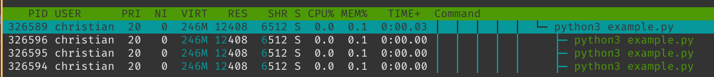
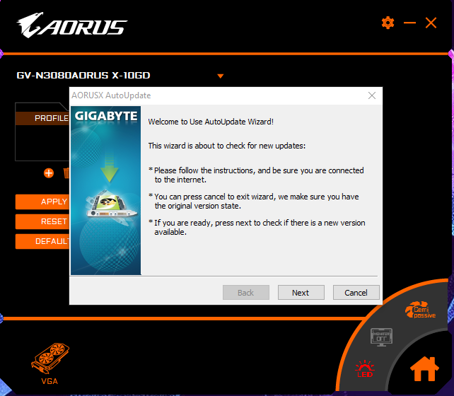
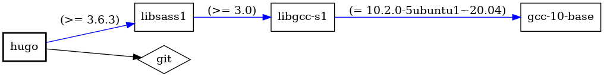

## Introduction
One question I do get in earnest quite frequently is why I put up with running GNU/Linux distributions for development work.

This article aims to clear some of the confusion, without getting lost in technical details or long ramblings about the shortcomings of `systemd`.

I will also refrain from comparing it to `Windows` too much - I use `Windows` for video games and am sure that with modern `Powershell`, some of the things I'll be talking about are covered there as well.

## Cross Platform is slang for "only some things work properly"
The best way to describe my daily work is "Data Engineering": Code, usually in `Python`, `go`, `Scala`, or `Java`, running on a distributed cluster of different machines and/or containers, churning away at large amounts of data.

But be it my line of work or more traditional backend work (like writing API endpoints for your favorite websites and apps), at the end of the day, the software I write will inevitably run on servers that run `Linux`, mostly LTS-variants, such as `Debian` or `RHEL`. They run Linux because it's free (as in cost and source), it's stable and doesn't require reboots, it is extendable and customizable, it can be easily audited, there is tons of software available that was designed for UNIX-likes when Windows was a single-user OS, it's lightweight, there's tons of fun kernel tricks to make sure things run as fast as possible, and people spend a lot of time on making sure there's no security vulnerabilities.

The ability to work on a system that is close to, if not identical to your target platform, avoids many issues that usually occur when going from "Well, it works on my machine!" to production.

The interesting part about Data Engineering in particular is the distributed nature of the work, and the inherently high demand for computational capacity it entails. While a lot of us, even the ones with CS degrees, view the workings of an Operating System something abstract, low-level, and completely irrelevant to the average developer (a `for loop` is a `for loop`, right?), even fairly high-level languages, such as `Python`, have to interact with the OS turning your hardware into more than a shiny block of silicon. 

To give you a tangible example: What does this code do?

import multiprocessing as mp 
import time 
import os 
def worker(i: int):
    print(f'{os.getpid()}: Working hard on {i}')
    time.sleep(2500)
    print(f'{os.getpid()}: Done with {i}!')

def main():
    pool = mp.Pool(4)
    pool.map(worker, (0,1,2,3,))
    pool.close()
    pool.join()
    print('All done!')

if __name__ == '__main__':
    main()


Correct: Pretty much nothing, 4 times in parallel - but for a long time.

If it were an actual problem, we'd need to find out what does it actually *does right now*? We now could take a look at `/proc/$pid/` to see all the different process details.

For instance `/proc/$pid/stack` gives us the main thread's stack:


christian @ pop-os ➜  326589  sudo cat ./stack
[<0>] futex_wait_queue_me+0xbb/0x120
[<0>] futex_wait+0x105/0x240
[<0>] do_futex+0x14d/0x890
[<0>] __x64_sys_futex+0x13f/0x16c
[<0>] do_syscall_64+0x49/0xc0
[<0>] entry_SYSCALL_64_after_hwframe+0x44/0xa9


This, for instance, leads us to [`futex_wait_queue_me`](https://www.kernel.org/doc/htmldocs/kernel-locking/API-futex-wait-queue-me.html), which "queue_me and wait for wakeup, timeout, or signal", which could be caused by a deadlock, as described in [this commit](https://github.com/torvalds/linux/commit/76835b0ebf8a7fe85beb03c75121419a7dec52f0) (in this example, we're intentionally waiting for nothing in particular, of course).

Or maybe we're creating too many file descriptors due to network activity? We can always check `/proc/$pid/fd`. The list goes on.

In any case, chances are that we'd encounter this issue on the local development Linux machine, as well as on our production machines - under Windows, for instance, the spawning of processes works very differently and is, if I may say so, not nearly as transparent. 

And even if we are on different Kernel versions - the approach to debugging will stay the same. 

Most tools are also incredibly portable. I maintain [this little repo on GitHub](https://github.com/chollinger93/debian-scripts) that contains configuration files and other little helper script that I just clone whenever I get to a new machine (unless I cannot, in which case, I can always manually re-create my favorite `.zshrc`).

## Do one thing, and do it well
The "Unix philosophy" is something that might be regarded as archaic by some, given the modern trend of colossal pieces of software that do everything short of making coffee - web browsers are a great example - but here's the summary straight from Wiki regardless:

*(Doug McIlroy by Denise Panyik-Dale, CC BY 2.0: https://en.wikipedia.org/wiki/Douglas_McIlroy#/media/File:Douglas_McIlroy.jpeg)*

> Make each program do one thing well. To do a new job, build afresh rather than complicate old programs by adding new "features".
> 
> Expect the output of every program to become the input to another, as yet unknown, program. Don't clutter output with extraneous information. Avoid stringently columnar or binary input formats. Don't insist on interactive input.
> 
> ...
>
> *Doug McIlroy, 1978*

These principles might not be 100% applicable for actual software development in `$CURRENT_YEAR`, but that doesn't mean the general idea is obsolete.

In any modern Linux-based environment, many daily, repeatable, and ad-hoc tasks can be achieved by piping simple, often single-purpose commands on any shell.

> In Unix-like computer operating systems, a pipeline is a mechanism for inter-process communication using message passing. A pipeline is a set of processes chained together by their standard streams, so that the output text of each process (stdout) is passed directly as input (stdin) to the next one. 
>
> *https://en.wikipedia.org/wiki/Pipeline_(Unix)*

Take this example: *In this blog's repository, how many images are stored in the various sub-folders?* This might be the baseline for a query to make sure all files are compressed, which they are not.

We can get to that answer by simply piping together ("daisy-chaining") some commands:

find ./content -type f -regex '.*\.\(jpg\|jpeg\|png\|svg\|gif\)' | uniq | wc -l


And to break it down:

find ./content -type f -regex '.*\.\(jpg\|jpeg\|png\|svg\|gif\)' # Find every file in the folder `content` that matches the regex (which means "a file ending in either of those suffixes")
uniq # Only show unique results
wc -l # Count the lines on stdout


Each one of those 3 commands does one specific thing:
- `find` - search for files in a directory hierarchy
- `uniq` - report or omit repeated lines
- `wc` - print newline, word, and byte counts for each file 

The ability to build queries for a task, almost based on the English language (**find** files, then make sure they are **uniq**ue, then **w**ord**c**ount them) can automate daily tasks fascinatingly quickly, as it is provides simple, yet effective interfaces that are compatible with one another across environments.

## Dependency Management: On War and Peace
Generally speaking, installing software - or installing software to write software - has always been an ordeal. On `Windows` (which, see above, I use for video games), I find myself dealing with the following:
- Binary blobs (`.exe` files) that..
  - ...don't ship their own update tool. This software will remain on the version it was shipped as, unless I upgrade manually
  - ... ship their custom updater, providing a custom way to "check for updates"
  - ... ship one, but just ask you to download a new `.exe` file from a website
- Portable, binary blobs with the same update-permutations as above
- Windows-store apps
- Custom stores with their own update-processes, such as `GoG` or `Steam`
- `pip3`, `conda`, `chocolatey` and co.
- Some with checksum/signing checks from `Windows`, others without it

Take a look at the updater for the software that my brand-new, shiny Gigabyte RTX 3080 came with:

And now, compare that against say, `Steam`, which neatly updates my games automatically:

Now, as long as we are talking about relatively unimportant software, having a less-than-streamlined process for installing and updating software can be dealt with.

However, once we reach a point where stability, unified management and control, as well as security are important, having a unified package manager that takes care of these things for us becomes paramount.

Depending on your flavor of `Linux`, you'll be dealing with various package managers - `apt`, `yum`, `pacman` - and naturally, you will not get away from cross-platform apps shipping with their own updater. I won't even mention the endless permutations of tools like `snap` or `flatpack`.

However, just using `apt` on `PopOS` as an example, take a look at the dependency tree for `hugo`, which this blog is rendered with:

christian @ pop-os ➜  ~  apt-rdepends hugo      
Reading package lists... Done
Building dependency tree       
Reading state information... Done
hugo
  Depends: libc6 (>= 2.4)
  Depends: libsass1 (>= 3.6.3)
libc6
  Depends: libcrypt1 (>= 1:4.4.10-10ubuntu4)
  Depends: libgcc-s1
libcrypt1
  Depends: libc6 (>= 2.25)
libgcc-s1
  Depends: gcc-10-base (= 10.2.0-5ubuntu1~20.04)
  Depends: libc6 (>= 2.14)
gcc-10-base
libsass1
  Depends: libc6 (>= 2.29)
  Depends: libgcc-s1 (>= 3.0)
  Depends: libstdc++6 (>= 9)
libstdc++6
  Depends: gcc-10-base (= 10.2.0-5ubuntu1~20.04)
  Depends: libc6 (>= 2.18)
  Depends: libgcc-s1 (>= 4.2)


Or, if you care for pretty pictures:

debtree --with-suggests hugo | dot -T png -o hugo-deptree.png


We can see the exact dependencies, including version strings, for each library that `hugo` asks for. `apt` will not only install it for us, it can also keep everything up-to-date.

Interestingly, the concept of a package manager like `apt` (initial release 1998) is pretty much the basis for any modern "app store" - a centralized (albeit expandable) repository of software binaries or src that keep a tree of their respective dependencies. 

This, of course, is great if it works. I haven't actually read Tolstoy's monstrosity, but any form of dependency management is always a story of times of peace and harmony (you update, it works) and war and anguish (you update, it doesn't work), as signatures expire, repositories cease to exist, or dependencies get so out of whack that sometimes installing a package from scratch is the best way to go.

That being said, in the theme of the article, I much prefer `apt install $package` over trying to find some sketchy binary or hoping for it to be in some overly-curated "app store" that I cannot extend with repositories for more obscure use-cases.

## Permissions: Computer says no
Unix-likes have this wonderful system, called `chmod` and `chown`, that controls permissions on each file on the system, which in term make up the system as a whole (as everything is a file). This was invented in 1971 and the idea (independent of the implementation) hasn't changed too much since. 

Each user on the system has exactly one name and potentially many groups. 


christian @ pop-os ➜  ~  id    
uid=1000(christian) gid=1000(christian) groups=1000(christian),4(adm),27(sudo),998(docker)


Each file has 3 permission elements: The `user`, the `group`, and `others`. Each of those can have one of multiple modes:

|    #   |        Permission       |    rwx    |    Binary    |
|:------:|:-----------------------:|:---------:|:------------:|
| 7      | read, write and execute | rwx       | 111          |
| 6      | read and write          | rw-       | 110          |
| 5      | read and execute        | r-x       | 101          |
| 4      | read only               | r--       | 100          |
| 3      | write and execute       | -wx       | 011          |
| 2      | write only              | -w-       | 010          |
| 1      | execute only            | --x       | 001          |
| 0      | none                    | ---       | 000          |

While (like with any topics in this article) you can go into the details on Wikipedia or the [Arch Wiki](https://wiki.archlinux.org/index.php/File_permissions_and_attributes), a dead simple system like this makes working on systems with many users possible.

My `home` directory, for instance, can only be edited by myself (and `root`, of course). A service user, such as `http`, might only be able to read and write data in `/var/www`. Or a CI/CD service user might be eternally damned to a life in a `chroot` jail.

It also adds a security benefit, as files without the `+x` bit cannot be executed - independent of whether they are actually executable files in the first place. 


christian @ pop-os ➜  images git:(development) ✗  ./hugo-deptree.png 
zsh: permission denied: ./hugo-deptree.png
christian @ pop-os ➜  images git:(development) ✗  chmod +x ./hugo-deptree.png 
christian @ pop-os ➜  images git:(development) ✗  ./hugo-deptree.png 
zsh: exec format error: ./hugo-deptree.png


`Windows` (for instance) uses Access Control Entires under NTFS ([ACE](https://docs.microsoft.com/en-us/windows/win32/secauthz/access-control-entries)) that work similarly, but are rarely exposed to the user and an order of magnitude more complicated that the simple & secure system on Linux. `macOS` is POSIX certified, but doesn't expose the root user by default.

Permissions can also be easily validated (for instance, `ssh` keys should not be exposed) and have an equally simple CLI attached to them. They also happen to work on any major file system. As with other examples, simplicity is key.

## GUIs and Terminals: The Metamorphosis
This is certainly a controversial one, but one thing that throws people off when having to deal with Linux is the frequent use of Terminal Emulators (shells). While many consumer focussed distributions, such as `PopOS` or `Ubuntu`, ship with many tools these days that abstract the user from having to deal with them, at the end of the day, a shell is always available.

And my take on that is simple: Working with a shell is faster than working with a GUI, once you are used to it. It also exposes any tool that you have installed (be it on the `PATH` or not) with a couple of keystrokes - you can even launch GUIs from the terminal.

The key to speed, besides the obvious "getting used to a workflow", is little to no context switches and avoid using the mouse. That's why many people, myself included, love `vim` for what is is: A powerful editor that is entirely keyboard based. This philosophy has come to light even in the graphical world, with window managers like [i3](https://wiki.archlinux.org/index.php/i3).

Modern shells, such as `zsh`, provide tons of comfort features such as auto-completion, powerful pattern-matching or fully-indexed search histories - even Bash (3+) has a lot of options hidden in the `.bashrc` file that enable similar feature sets.

So, here's a workflow a lot of you will be familiar with: In a `Python` project, create a new local `git` branch, enable a fresh virtual environment, make sure it's ignored by git, install some packages, get some test data, and run your magical code.

On a shell, it'll look a little something like this:

git checkout -b feature/magic
python3 -m venv env
echo "env" >> .gitignore
source env/bin/activate
pip3 install pandas --upgrade
wget https://example.com/files/abc.csv
python3 main.py


Shells also support forms of multi-threading that I won't get into, but having something like a download run in a browser to not block a shell session is not a concern.

The same workflow, using large IDEs or GUIs in general, would work as such:
1. Create a new branch in your IDE by going to the VCS tab and creating one
1. Open a shell regardless to activate the venv or hope for a plugin
1. Open an editor to add "env" to your .gitignore
1. Jump to a package manager interface to install your packages
1. Go to your browser to download a file and move it to your target directory
1. Context switch to the `Run` tab of your IDE

The fact that I do not do that often might show here.

Furthermore, GUIs expose inherent complexity and design challenges, whereas CLIs are to ship with a `man` page that exposes all options:

christian @ pop-os ➜  ~ ✗  man git | head -15
GIT(1)                                                                                 Git Manual                                                                                 GIT(1)

NAME
       git - the stupid content tracker

SYNOPSIS
       git [--version] [--help] [-C <path>] [-c <name>=<value>]
           [--exec-path[=<path>]] [--html-path] [--man-path] [--info-path]
           [-p|--paginate|-P|--no-pager] [--no-replace-objects] [--bare]
           [--git-dir=<path>] [--work-tree=<path>] [--namespace=<name>]
           [--super-prefix=<path>]
           <command> [<args>]

DESCRIPTION
       Git is a fast, scalable, distributed revision control system with an unusually rich command set that provides both high-level operations and full access to internals.


GUIs have to, one way or another, expose all their options eventually, either through deep setting window trees, or straight up on one screen (or, in recent history, just don't give you any options at all). Take a look at Tortoise Git for Windows' context menu:

(https://tortoisegit.org/about/screenshots)

It might just be me, but I haven't had to create a `patch` in a long time - I did, however, use `git archive` very recently.

Obviously, I don't want to be the "Old Man Yells at Cloud" guy - there is a time and a place for GUIs (I am writing this in VS code with a handful of shell sessions as part of the window), but once you are used to doing things by writing (and frequent use of tabs), rather than "point and click", you will find it hard to go back for most daily development tasks.

I'd also wager to say that most applications are CLI first, GUI second - it's easy to slap a GUI on a tool, once it already does what it needs to do.

(https://blog.codinghorror.com/this-is-what-happens-when-you-let-developers-create-ui/)

My last point here is also a problem that I have encountered primarily with junior developers: Dependence on GUIs abstracts people from the fundamental workings of systems, such as `git`. Every time I find myself in a teaching role, I try to *explain* how `git` works, rather than where to click or what commands to copy-paste: Working directory, staging, local and remote repositories, and where e.g. a `git add` actually affects anything. 

Similar to how people who rely on sat-nav have difficulties remembering which interstate goes where (I am certainly one of them), relying on too many helpers and abstractions will prevent a learning curve that is important to really understand and, eventually, debug issues that inevitably will arise with complex systems. And this is coming from somebody who cannot remember the standard flags to decompress a `tar.gz` bundle. Do as I say, not as I do. :)

## Speed has never killed anyone. Suddenly becoming stationary, however...
My [website](https://chollinger.com/) is very, well, minimalistic. The reason for that is simple: I don't expect everybody to access is on a 10Gbit SFP+ link on a AMD Threadripper with 128GB memory with a set of RTX 3090s.

Depending on your flavor of Linux, it runs on figuratively anything: AMD, Intel, ARM, RISC-V, a lot of memory, not a lot of memory, a screen, many screens, or no screens (...) - it'll run. [`Tiny Core`](http://tinycorelinux.net/faq.html#req) requires a total of 46MB of RAM.

Now, a maybe more common use case is `ssh`. While, yes, you can use `X11` forwarding, by default, you'll be greeted with a blinking cursor on a black screen. Remembering what I said above: Now, you can do everything (except for things that absolutely require a window sever) that the Kernel and your applications can do, all over a very, very slim network link. 

The operating principles are identical to using Linux locally - your permissions, programs, editors (...) work just the same, and from the bed of a truck with a satellite link in rural Wyoming, if you so desire. I've been subject to horrible connections that can barely handle drawing a single image on the screen, not to mention 30, 60, or 120 a second. As the system itself is fundamentally based on being controlled by a shell, you don't really lose anything of value - if you are comfortable with it.

Also, SSH can be very information-dense - because it's text. Here's a picture of my server's UPS (which counts as a GUI, right?):

And here's a lot more information via SSH:

christian @ bigiron ➜  ~  sudo pwrstat -status  
The UPS information shows as following:

	Properties:
		Model Name................... OR1500LCDRM1Ua
		Firmware Number.............. xxx
		Rating Voltage............... 120 V
		Rating Power................. 900 Watt(1500 VA)

	Current UPS status:
		State........................ Normal
		Power Supply by.............. Utility Power
		Utility Voltage.............. 121 V
		Output Voltage............... 121 V
		Battery Capacity............. 100 %
		Remaining Runtime............ 90 min.
		Load......................... 108 Watt(12 %)
		Line Interaction............. None
		Test Result.................. Unknown
		Last Power Event............. Blackout at xxxx for 70 min.


## Flexibility & Open Source
My last point will be kept short, as it has been the inspiration for countless philosophical debates for decades now (do yourself a favor and read some posts from the early 1990's on [Usenet archives](https://www.usenetarchives.com/groups.php?c=comp&p=31)), but having control and insights is better than the opposite.

Everything on a truly free GNU/Linux system is Open Source and licensed appropriately. Issues you encounter can be explained, in most cases, by looking at the code that caused the issue. Configurations and behaviors of seemingly obscure problems (did you know there's limits on the Kernel's keyring in `/proc/sys/kernel/keys/maxkeys`?) can be explained if the system they operate in is transparent.

And if you don't like something about the way your system works, there's virtually nothing stopping you from changing it. Don't like the file manager? Get a new one. Don't like the limit on open file descriptors? Remove it. Don't like the way `syscall` abc works? Change it and build a new Kernel.

You don't *have* to do any of these - but you certainly can. And sometimes, you might even need to, if you find yourself being responsible for a highly-specific use case.

## Conclusion
I've only outlined a handful of points as to why I prefer GNU/Linux over Windows (and even macOS, which I quite enjoy, purely for it's UNIX roots). This is by no means a complete list, or even a very in-depth one; but I hope I was able to enlighten some of you as to why I do what I do and why maybe, you should give it a shot some time.

And, naturally, this is only *my perspective*. I'm simply not a "Windows guy" - but just like with most things, you should be able to use what you feel most comfortable with. Microsoft's WSL adventures to seem to indicate that I am not alone in this, however. :)