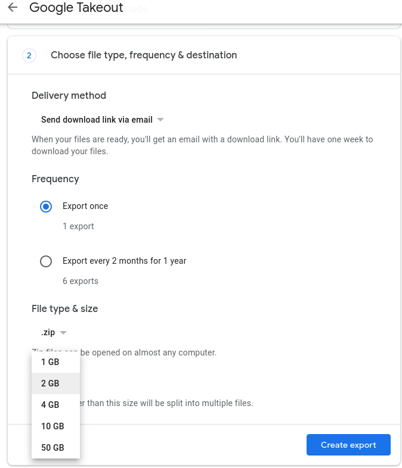
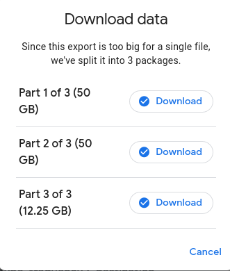
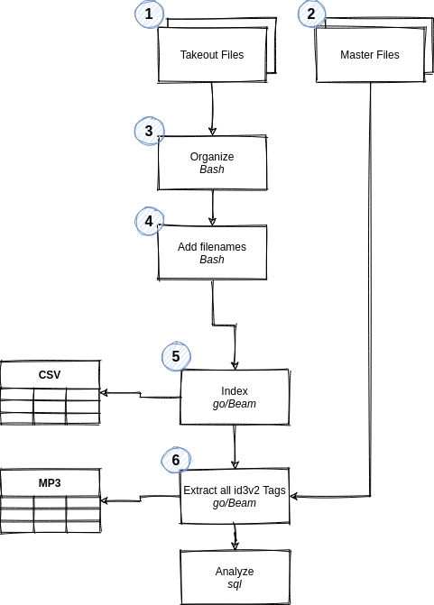
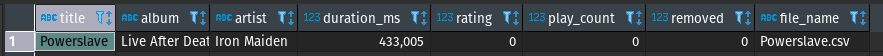
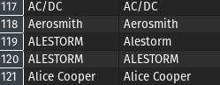
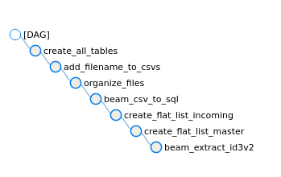
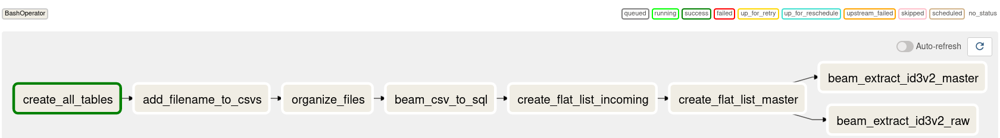

## Introduction
Google Play Music joined its brethren in the [Google Graveyard](https://killedbygoogle.com/) of cancelled products in late 2020. Having used Google Play Music many years ago to back up all my MP3 rips (I collect CDs and Vinyl and have done so for about 17 years), Google sent me several friendly emails, asking me to transfer my music to YouTube Music and/or use Google Takeout to download a copy.

I did the latter. Little did I know that what I would receive would rival even the most horrifying "We've been doing reporting in Excel for 12 years!"-type datasets I've seen throughout the years.[1] This is an attempt to tell the story on how I approach badly documented, rather large datasets from a Data Engineering lense and how I turned a dump of data into something useful.

This article will pretend we're not just organizing some music, but rather write a semi-professional, small-sized (~240GB in total) data pipeline on bare metal, with simple tools. During this, we'll be working with a fairly standard Data Engineering toolset (`bash`, `go`, `Python`, `Apache Beam`/`Dataflow`, `SQL`), as well as work with both `structured` and `unstructured` data.

*(My little KEF LS50 in front of the CDs that started this whole journey)*

_[1] The cynic in me thinks that this is intentional (in order to push you to YouTube Premium) - but I would not be surprised if Google has a perfectly valid Engineering reason for this mess._

**All code can be found on [GitHub](https://github.com/chollinger93/google-music-takeout-data-pipeline)!**

## Making Sense of it: The Google Play Music Takeout Data
Before we even try to attempt to formalize a goal here, let's see what we're working with. I should add that your mileage may vary - I only have my export to work with here.

### Export Process
Exporting your data can be customized quite nicely:

You can select the compression format and archive size. Once you did that, and wait for some nondescript batch-job to complete (that will take several hours), you can download those files:

You can throw that link at `wget`, as to not to be at the mercy of an X-server if you want to push it to a file server directly (in my case, via `ssh`).

The resulting files are just zip archives, which you can extract. 


christian @ bigiron ➜  GooglePlayMusic  ll
total 113G
-rw-r--r-- 1 christian christian  51G Feb 23 08:29 takeout-001.zip
-rw-r--r-- 1 christian christian  51G Feb 23 08:46 takeout-002.zip
-rw-r--r-- 1 christian christian  13G Feb 23 08:50 takeout-003.zip


### Structure
The resulting structure looks like this:


christian @ bigiron ➜  GooglePlayMusic  tree -d
.
└── Takeout
    └── Google Play Music
        ├── Playlists
        │   ├── Dornenreich - In Luft Geritzt.mp3
        │   │   └── Tracks
        │   ├── Ensiferum - Unsung Heroes
        │   │   └── Tracks
        │   ├── Metal Mai 2015
        │   │   └── Tracks
        ├── Radio Stations
        │   └── Recent Stations
        └── Tracks

53 directories


I've cut out some playlists, but other than that, that's it. 3 Main folders: Playlists, Radio Stations, and Tracks. On the root of this folder, there lives a `archive_browser.html` HTML file.

#### Playlists
The playlists folder contains a wild mix of album titles, custom playlists, and generic folders.

Within those folders, taking Austrian Black Metal band [Dornenreich](https://en.wikipedia.org/wiki/Dornenreich)'s album "In Luft Geritzt" as an example, you'll find a bunch of CSV files as such:


christian @ bigiron ➜  Dornenreich - In Luft Geritzt.mp3  ll
total 16K
-rw-r--r--  1 christian christian   90 Feb 22 09:23 Metadata.csv
drwxr-sr-x  3 christian christian 4.0K Feb 23 08:59 .
drwxr-sr-x 27 christian christian 4.0K Feb 23 09:38 ..
drwxr-sr-x  2 christian christian 4.0K Feb 23 10:13 Tracks
christian @ bigiron ➜  Dornenreich - In Luft Geritzt.mp3  ll Tracks 
total 128K
-rw-r--r-- 1 christian christian  141 Feb 22 09:22  Aufbruch.csv
-rw-r--r-- 1 christian christian  138 Feb 22 09:22 'Jagd(1).csv'
-rw-r--r-- 1 christian christian  142 Feb 22 09:22 'Aufbruch(2).csv'
-rw-r--r-- 1 christian christian  149 Feb 22 09:23 'Flügel In Fels(2).csv'


The entire folder doesn't contain a single music file, just csvs.

christian @ bigiron ➜  Playlists  find . -type f -name "*.mp3"


These CSVs have the following structure:

christian @ bigiron ➜  Dornenreich - In Luft Geritzt.mp3  cat Tracks/Aufbruch.csv 
Title,Album,Artist,Duration (ms),Rating,Play Count,Removed,Playlist Index
"Aufbruch","In Luft Geritzt","Dornenreich","292728","0","1","","7"


No music thus far. Let's keep looking.

#### Radio Stations
This one contains a single folder with a bunch of `csv` files showing me metadata about "recent" radio stations:


christian @ bigiron ➜  Recent Stations  cat Dream\ Theater.csv 
Title,Artist,Description,Removed,"Other artists on this station","Similar stations"
"Dream Theater Radio","Dream Theater","Hear songs by Dream Theater, Liquid Tension Experiment, Symphony X, James LaBrie, and more.","","Liquid Tension Experiment, Symphony X, James LaBrie, Jordan Rudess, Mike Portnoy, Steve Vai, Flying Colors, Circus Maximus, Liquid Trio Experiment, Joe Satriani, Pain of Salvation, Yngwie Malmsteen, Andromeda, Shadow Gallery, Kiko Loureiro, Ark, Derek Sherinian, ","The Journey Continues: Modern Prog, Progressive Metal, Instru-Metal, Presenting Iron Maiden, Presenting Rush, Judas Priest&#39;s Greatest Riffs, Defenders of the Olde, Reign in Blood, Swords &amp; Sorcery, New Wave of British Heavy Metal, The World of Megadeth, Metal&#39;s Ambassadors, Bludgeoning Riffery, The Black Mass, Closer to the Edge: Classic Prog, Rock Me Djently, 


Not overly helpful **and** in a broken encoding (`text/plain; charset=us-ascii`, which causes special characters like apostrophes to be escaped). What more could you ask for?

#### Tracks
The `Tracks` folder is a monolith of, in my case, **23,529** files. *11,746* are `csv` files, *11,763* are `mp3`.

The `csv` files don't necessarily correspond to a `mp3` (but some do!) and are also not unique:


christian @ bigiron ➜  Tracks  cat Paschendale
Paschendale\(1\).csv  Paschendale\(2\).csv  Paschendale.csv  
# ^ this is zsh auto-complete
christian @ bigiron ➜  Tracks  cat Paschendale*.csv
Title,Album,Artist,Duration (ms),Rating,Play Count,Removed
"Paschendale","Dance of Death","Iron Maiden","507123","0","0",""
Title,Album,Artist,Duration (ms),Rating,Play Count,Removed
"Paschendale","From Fear To Eternity The Best Of 1990-2010 [Disc 1]","Iron Maiden","507123","0","0",""
Title,Album,Artist,Duration (ms),Rating,Play Count,Removed
"Paschendale","Death On The Road [Live] [Disc 1]","Iron Maiden","617465","0","0",""


Delightful - `Paschendale (0)` through `(2)` as a CSV file, but not actual music.

When it comes to the actual music files, it appears that they do contain `id3v2` tags:


christian @ bigiron ➜  Tracks  id3v2 -l 'Dornenreich - Flammentriebe - Flammenmensch.mp3'
id3v2 tag info for Dornenreich - Flammentriebe - Flammenmensch.mp3:
TIT2 (Title/songname/content description): Flammenmensch
TPE1 (Lead performer(s)/Soloist(s)): Dornenreich
TPE2 (Band/orchestra/accompaniment): Dornenreich
TALB (Album/Movie/Show title): Flammentriebe
TYER (Year): 2011
TRCK (Track number/Position in set): 1/8
TPOS (Part of a set): 1/1
TCON (Content type): Black Metal (138)
APIC (Attached picture): ()[, 3]: image/jpeg, 14297 bytes
PRIV (Private frame):  (unimplemented)
Dornenreich - Flammentriebe - Flammenmensch.mp3: No ID3v1 tag


#### `archive_browser.html`
I've pointed a local `Apache` web server at that file and we can find a rough description of the exported data:

Which is not overly helpful, but gives us rough data dictionaries for all CSV files.

## What we have so far
We now somewhat understand what's going on here - the export contains all `mp3` files that were uploaded (as a backup) at one point. Music files that were never uploaded and just streamed - or not exported, for some reason - will show up as `csv` files.

There are duplicates and there are no naming conventions kept (e.g. `$ARTIST/$ALBUM/$INDEX-$TRACK`). 

We also now that the data doesn't contain any form of `keys` or `indexes`, meaning we won't have anything to uniquely match for instance band or album names.

Last but not least, file na,es contain spaces and special characters, which aren't great for use in e.g. `bash`.

To summarize:
- Some files exists as `mp3`, others only as `metadata`/`csv`
- Naming conventions are non-existent
- There are duplicates
- The `csv`s are not consistently encoded as `utf-8`
- There are no keys to match to other data
- The `mp3`s have some `id3v2` tags
- File names are not in a `UNIX` style, i.e. contain spaces

## The End-Goal: Organization
With this out of the way, let's see what we can do with this.

I already maintain my music, a more recent copy, in the format mentioned above, i.e. `$ARTIST/$ALBUM/$INDEX-$TRACK`, with `id3v2` tags on all files, for instance - 


christian @ bigiron ➜  cd $MUSIC/Dornenreich/Flammentriebe 
christian @ bigiron ➜  Flammentriebe  id3v2 -l 01\ Flammenmensch.mp3
id3v1 tag info for 01 Flammenmensch.mp3:
Title  : Flammenmensch                   Artist: Dornenreich                   
Album  : Flammentriebe                   Year: 2011, Genre: Black Metal (138)
Comment:                                 Track: 1
id3v2 tag info for 01 Flammenmensch.mp3:
TIT2 (Title/songname/content description): Flammenmensch
TPE1 (Lead performer(s)/Soloist(s)): Dornenreich
TRCK (Track number/Position in set): 1/8
TALB (Album/Movie/Show title): Flammentriebe
TPOS (Part of a set): 1/1
TCON (Content type): Black Metal (138)
TMED (Media type): CD


If we were able to...
- Re-organize all files into a logical naming convention
- Remove all duplicates, keeping only the "best" copy (based on compression/quality)
- Match them with the master data copy of music on my server and add all that are missing to it
- Match all non-existent mp3 files to the master data copy of music, and call out all that are missing

In order to achieve this, let's pretend this is not a weekend during COVID, but rather a professional Data Engineering project - and over-engineer the hell out of it. For fun. And out of desparation.

## Step 1: Build an Architecture
First, we'll design a quick architecture that uses proven tools - we don't need a lot, as we're really only trying to parse and move around 100GB around. 

1. **Takeout files** are our incoming data 
2. **Master files** are our existing library
3. **Organize** will simply move `csv` and `mp3` files into their own respective directories
4. **Add filenames** will add filenames to the `csv`s (see below)
5. **Index** will move all `csv` files, i.e. structured data, to tables
6. **Extract id3v2** will extract the unstructured data's `id3v2` tags
7. **Analyze** will be the `sql` portion of the exercise, where we try to make sense of our data

When it comes to technology, I'll be using `bash` for scripting, `go` with `Apache Beam` for more intense workloads, and `MariaDB` for a quick-and-easy database that can handle the number of records we can expect. Plus I have one running on my server anyways.

## Step 2: Provisioning a "Dev Environment"
Since we're at it, we might as well grab a representative set of data in a test environment. For this, I simply created local folders on a different drive-array and copied some data:

mkdir -p "$DEV_ENV/GooglePlayMusic/Takeout/Google Play Music/"
cp -r "$PROD_ENV/GooglePlayMusic/Takeout/Google Play Music/Radio\ Stations" "$DEV_ENV/GooglePlayMusic/Takeout/Google Play Music/"
cp -r "$PROD_ENV/GooglePlayMusic/Takeout/Google Play Music/Playlists" "$DEV_ENV/GooglePlayMusic/Takeout/Google Play Music/"
find "/mnt/6TB/Downloads/GooglePlayMusic/Takeout/Google Play Music/Tracks/" -maxdepth 1 -type f | shuf | head -1000 > /tmp/sample.txt
while read l; do cp "${l}" "/mnt/1TB/Dev/GooglePlayMusic/Takeout/Google Play Music/Tracks/"; done < /tmp/sample.txt


The last lines is the only funky one and simply copies 1,000 random files from the "Tracks" directory. I find it a good idea to pipe to an output file for deterministic behavior's sake, rather than piping directly to `xargs` and `cp`. `xargs` would be much faster, though.

## Step 3: Re-Organizing files 
The first step for any data project (besides figuring out what you're trying to do) should be to get an understanding of the data we're working with. We've already made the first steps by going through that >100GB dump above, but formalizing it will help us to truly understand what's going on and to ensure we can script out everything without missing corner cases.

Given that our input file structure is all over the place (with >20,000 mixed-type files in one directory!), we can script that out to make it a repeatable process.

One word of advice here - **even if you think you'll never use the script again and you're the only person ever using it, just assume that to be wrong** and that somebody in your organization will have to use it at a later point. 

This is why we woefully over-engineer this thing - argument parsing, escaping Strings, all that - because chances are, you'll see it pop up soon. This comes from a decent amount of experience - I find scripts I wrote for myself ages ago in the wild way too often.


#!/bin/bash

# Exit on error
set -e

POSITIONAL=()
while [[ $# > 0 ]]; do
    case "$1" in
        -b|--base-dir)
        BASE_DIR="${2}"
        shift 2 
        ;;
        -t|--target-dir)
        TARGET_DIR="${2}"
        shift 2 
        ;;
        *) 
        POSITIONAL+=("$1")
        shift
        ;;
    esac
done

set -- "${POSITIONAL[@]}" 

# Check args
if [[ -z "${BASE_DIR}" || -z "${TARGET_DIR}" ]]; then 
    echo "Usage: organize.sh --base-dir \$PATH_TO_EXPORT --target_dir \$PATH_TO_OUTPUT"
    exit 1
fi 

# Set base folders
TRACK_FOLDER="${BASE_DIR}/Tracks"
PLAYLISTS_FOLDER="${BASE_DIR}/Playlists"
RADIO_FOLDER="${BASE_DIR}/Radio Stations"

# Check folder
if [[ ! -d "${TRACK_FOLDER}" || ! -d "${PLAYLISTS_FOLDER}" || ! -d "${RADIO_FOLDER}" ]]; then 
    echo "--base-dir must point to the folder containing /Tracks, /Playlists, and /Radio\ Stations"
    exit 1
fi

# Define targets
echo "Creating target dirs in $TARGET_DIR..."
mkdir -p "${TARGET_DIR}"
CSV_TARGET="${TARGET_DIR}/csv/"
MP3_TARGET="${TARGET_DIR}/mp3/"
PLAYLIST_TARGET="${TARGET_DIR}/playlists/"
RADIO_TARGET="${TARGET_DIR}/radios/"

# Create structure for CSVs and MP3s
mkdir -p "${CSV_TARGET}"
mkdir -p "${MP3_TARGET}"
mkdir -p "${PLAYLIST_TARGET}"
mkdir -p "${RADIO_TARGET}"

# Copy flat files files
echo "Copying files from $TRACK_FOLDER..."
find "${TRACK_FOLDER}" -type f -iname "*.csv" -exec cp -- "{}" "${CSV_TARGET}" \;
find "${TRACK_FOLDER}" -type f -iname "*.mp3" -exec cp -- "{}" "${MP3_TARGET}" \;

# Playlists need to be concatenated
echo "Copying files from $PLAYLISTS_FOLDER..."
find "${PLAYLISTS_FOLDER}" -type f -mmin +1 -print0 | while IFS="" read -r -d "" f; do
    # Ignore summaries 
    if [[ ! -z $(echo "${f}" | grep "Tracks/" ) ]]; then 
        # Group
        playlistName="$(basename "$(dirname "$(dirname "${f}")")")"
        targetCsv="${PLAYLIST_TARGET}/$playlistName.csv"
        touch "${targetCsv}"
        echo "Working on playlist $playlistName to $targetCsv"
        # Add header
        if [[ -z $(cat "${targetCsv}" | grep "Title,Album,Artist") ]]; then 
            echo "Title,Album,Artist,Duration (ms),Rating,Play Count,Removed,Playlist Index" > "${targetCsv}"
        fi
        echo "$(tail -n +2 "${f}")" >> "${targetCsv}"
    fi
done

# Just flat file copy 
echo "Copying files from $RADIO_TARGET..."
find "${RADIO_FOLDER}" -type f -exec cp -- "{}" "${RADIO_TARGET}" \;


The script should be decently self-explanatory - it copies data into a new, flat structure. We do some pseudo-grouping to concatenate all Playlists into single CSVs. Please note that this is all single-threaded, which I don't recommend - with `nohup` and the like, you can trivially parallelize this.

Once we run it, we get a nice and clean structure:

christian @ bigiron ➜  ./organize.sh --base-dir "$DEV_ENV" --target-dir ./clean/
christian @ bigiron ➜  clean  tree -d .
.
├── csv
├── mp3
├── playlists
└── radios
christian @ bigiron ➜  clean  du -h --max-depth=1 .
2.1M	./csv
4.7G	./mp3
5.1M	./playlists
4.0K	./radios
4.7G	


This dataset will be our starting point. In real data pipelines, it is not uncommon to do some basic cleanup before starting the real work - just because it makes our lives so much easier down the line.

## Step 4: Creating Data Dictionaries 
Based on our initial cleanup, we can now automatically profile our csv files, given that we have all of them in one place.

`Python` and `pandas` are great tools to have at hand for that - 


import pandas as pd 
import glob
import argparse

if __name__ == '__main__':
    parser = argparse.ArgumentParser()
    parser.add_argument('-i', '--in_dir', type=str, required=True, help='Input directory')
    args = parser.parse_args()

    df = pd.concat((pd.read_csv(f) for f in glob.glob(args.in_dir)))
    print(f'Schema for %s is:', in_dir)
    print(df.info(show_counts=True))


Which gives us outputs like this:

<class 'pandas.core.frame.DataFrame'>
Int64Index: 1283 entries, 0 to 0
Data columns (total 8 columns):
 #   Column          Non-Null Count  Dtype  
---  ------          --------------  -----  
 0   Title           1283 non-null   object 
 1   Album           1283 non-null   object 
 2   Artist          1283 non-null   object 
 3   Duration (ms)   1283 non-null   int64  
 4   Rating          1283 non-null   int64  
 5   Play Count      1283 non-null   int64  
 6   Removed         0 non-null      float64
 7   Playlist Index  1283 non-null   int64  
dtypes: float64(1), int64(4), object(3)
memory usage: 90.2+ KB


Which we can use to build out our tables:

| Table    | Column         | Type    |
|----------|----------------|---------|
| Playlist | Title          | STRING  |
| Playlist | Album          | STRING  |
| Playlist | Artist         | STRING  |
| Playlist | Duration (ms)  | INTEGER |
| Playlist | Rating         | INTEGER |
| Playlist | Play Count     | INTEGER |
| Playlist | Removed        | FLOAT   |
| Playlist | Playlist Index | INTEGER |

| Table | Column        | Type    |
|-------|---------------|---------|
| Song  | Title         | STRING  |
| Song  | Album         | STRING  |
| Song  | Artist        | STRING  |
| Song  | Duration (ms) | INTEGER |
| Song  | Rating        | INTEGER |
| Song  | Play Count    | INTEGER |
| Song  | Removed       | FLOAT   |

| Table | Column                        | Type   |
|-------|-------------------------------|--------|
| Radio | Title                         | STRING |
| Radio | Artist                        | STRING |
| Radio | Description                   | STRING |
| Radio | Removed                       | FLOAT  |
| Radio | Other artists on this station | STRING |
| Radio | Similar stations              | STRING |
| Radio | Artists on this station       | STRING |

These data dictionaries and table definitions will help us to understand the structure of the data. Documentation is boring, yes, but critically important for any data project.

Note that the `float`s here aren't really that - they are binary indicators well change later. `float` is the `pandas` default, I believe.

## Step 5: Building a Database Schema
We can now turn those data dictionaries into simple `MariaDB` tables, by just abiding to the SQL engine's naming conventions and restrictions.

Our schema should, at the very least, do the following:
1. Contain all the data we have without loss
1. Contain data that is close, but not necessarily identical, to the raw data
1. Abide to semi-useful naming conventions

For instance, for our `Song` `csvs`, we might want something like this:


CREATE DATABASE IF NOT EXISTS `googleplay_raw`;

CREATE OR REPLACE TABLE `googleplay_raw`.`song` (
    `title`	        TEXT,
    `album`	        TEXT,
    `artist`	    TEXT,
    `duration_ms`	INTEGER,
    `rating`	    INTEGER,
    `play_count`	INTEGER,
    `removed`	    FLOAT,
    `file_name`     TEXT
);


All names are clear, have a clear data type, and contain all data we have.

## Step 6: Indexing all Metadata
Now to the fun part: Actually touching the data. You might have realized that until now (apart from some profiling), we haven't even bothered to really read any data.

We'll be using [`Apache Beam`](https://chollinger.com/blog/2020/07/a-data-engineering-perspective-on-go-vs.-python-part-2-dataflow/) for it and because I hate myself, we'll be writing it in `go`.

Beam is useful in the sense that we can relatively quickly build a pipeline, using pre-built `PTransforms`, rather than having to manage separate `goroutines`, deal with `channels`, deal with custom `IO` - in short, it would, in theory, be a fast and easy way to process the CSV files.

You might have noticed that we've added one field - `file_name` - in the previous section. Now, since we'll be using `Apache Beam` in the next step, there's 2 schools of thought: Force `Beam` to provide the `PCollection`'s file name (that is not something you can easily do, given the way their `SplittableDoFns` work) or manipulate your input data to provide this information.

We'll do the latter. So, `bash` to the rescue, once again:


#!/bin/bash

# Exit on error
set -e

POSITIONAL=()
while [[ $# > 0 ]]; do
    case "$1" in
        -b|--base-dir)
        BASE_DIR="${2}"
        shift 2 
        ;;
        *) 
        POSITIONAL+=("$1")
        shift
        ;;
    esac
done

set -- "${POSITIONAL[@]}" 

# Check args
if [[ -z "${BASE_DIR}" ]]; then 
    echo "Usage: add_filename_to_csv.sh --base-dir \$PATH_TO_EXPORT"
    exit 1
fi 

find "${BASE_DIR}" -type f -name "*.csv" -print0 | while IFS= read -r -d '' f; do
    echo "" > /tmp/out.csv
    bname=$(basename "${f}")
    echo "Adding $bname to $f"
    ix=0

    while read l; do
        if [[ $ix -eq 0 ]]; then 
            echo "${l},file_name" >> /tmp/out.csv
        else 
            echo "${l},${bname}" >> /tmp/out.csv
        fi 
        ix=$(($ix + 1))
    done < "$f"
    IFS=$OLDIFS
    if [[ $ix -ne 0 ]]; then 
        cat "/tmp/out.csv" > "${f}"
    else 
        echo "File $f is empty"
    fi
done


Note the re-using of `IFS`, the Internal Field Separator, here. This is why you don't use spaces in file names.

This script turns:


cat clean/csv/Loki\ God\ of\ Fire.csv 
Title,Album,Artist,Duration (ms),Rating,Play Count,Removed
"Loki God of Fire","Gods of War","Manowar","230016","0","1",""


Into


Title,Album,Artist,Duration (ms),Rating,Play Count,Removed,file_name
"Loki God of Fire","Gods of War","Manowar","230016","0","1","","Loki God of Fire.csv"


And we can use this data to create a pipline.


import (
//..

	"github.com/apache/beam/sdks/go/pkg/beam"
// ..
)

type Song struct {
	Title       string `column:"title"`
	Album       string `column:"album"`
	Artist      string `column:"artist"`
	// ..
}

func (s Song) getCols() []string {
	return []string{"title", "album", "artist", "duration_ms", "rating", "play_count", "removed", "file_name"}
}

func (f *Song) ProcessElement(w string, emit func(Song)) {
	data := strings.Split(w, ",")
	//..

	// Filter non-null fields
	if data[0] != "" {
		fmt.Printf("Song: %v\n", s)
		emit(*s)
	}
}

func main() {
//..
	beam.Init()
	p := beam.NewPipeline()
	s := p.Root()
	// Build pipeline
	lines := textio.Read(s, *trackCsvDir)
	songs := beam.ParDo(s, &Song{}, lines)
	// Write to DB
	databaseio.Write(s, "mysql", conStr, "song", Song{}.getCols(), songs)

	// Run until we find errors
	if err := beamx.Run(context.Background(), p); err != nil {
		log.Fatalf("Failed to execute job: %v", err)
	}
}


This pipeline would read all our `Song` csv files and write it to our `Songs` table. It uses the `TextIO ParDo` to read each CSV, custom `ParDos` to map the data to `structs` to map our table, and writes it to it.

That being said, the `Beam` documentation remains rather... sparse. [1]

> `func Write(s beam.Scope, driver, dsn, table string, columns []string, col beam.PCollection)`
> 
> Write writes the elements of the given PCollection<T> to database, if columns left empty all table columns are used to insert into, otherwise selected 
>
> https://pkg.go.dev/github.com/apache/beam/sdks/go/pkg/beam/io/databaseio#Write

O... okay. `PCollection<T>` is my favorite. `go` doesn't have generics. At least not yet - ETA for generics in go is end of this year (`<T>` is `Java`/`Scala` for "`PCollection` of Type `T`"). Yes, yes - if you actually read the source, you'll quickly find some interesting uses of `Reflect` to build some bastardized generics-type structure, but my point remains - `Beam`'s (and by proxy, Google's `Dataflow` documentation) leaves a lot to be desired.

For instance, this error:

8: ParDo[beam.createFn] Out:[7]
        caused by:
        creating row mapper
failed to matched a main.Song field for SQL column: title
exit status 1

([Source](https://github.com/apache/beam/blob/7c43ab6a8df9b23caa7321fddff9a032a71908f6/sdks/go/pkg/beam/io/databaseio/util.go#L52))

Was ultimately caused by not exporting (which, in `go`, is done by using an uppercase character to start a `struct` field) and aliasing the `struct` fields:

type Song struct {
	Title       string `column:"title"`
	Album       string `column:"album"`
	Artist      string `column:"artist"`
	Duration_ms int    `column:"duration_ms"`
	Rating      int    `column:"rating"`
	Play_count  int    `column:"play_count"`
	Removed     int    `column:"removed"`
}


Don't ever believe that this is documented anywhere. I found the mapping in their unit tests.

But, in any case, the pipeline above creates records as such:

We can simply extend this to also cover all three other CSV files, using the same logic and clean it up a bit.

*Note: The code on GitHub uses a `utils.go` module, so we avoid copy-paste code*


package main

import (
	"context"
	"flag"
	"fmt"
	"log"
	"strconv"

	"github.com/apache/beam/sdks/go/pkg/beam"
	"github.com/apache/beam/sdks/go/pkg/beam/io/databaseio"
	"github.com/apache/beam/sdks/go/pkg/beam/io/textio"
	"github.com/apache/beam/sdks/go/pkg/beam/x/beamx"
	_ "github.com/go-sql-driver/mysql"
)

var (
	trackCsvDir      = flag.String("track_csv_dir", "", "Directory containing all track CSVs")
	playlistsCsvDir  = flag.String("playlist_csv_dir", "", "Directory containing all playlist CSVs")
	radioCsvDir      = flag.String("radio_csv_dir", "", "Directory containing all radio CSVs")
	databaseHost     = flag.String("database_host", "localhost", "Database host")
	databaseUser     = flag.String("database_user", "", "Database user")
	databasePassword = flag.String("database_password", "", "Database password")
	database         = flag.String("database", "googleplay_raw", "Database name")
)

type Playlist struct {
	Title         string `column:"title"`
	Album         string `column:"album"`
	Artist        string `column:"artist"`
	Duration_ms   int    `column:"duration_ms"`
	Rating        int    `column:"rating"`
	Play_count    int    `column:"play_count"`
	Removed       bool   `column:"removed"`
	PlaylistIndex int    `column:"playlist_ix"`
}

func (s Playlist) getCols() []string {
	return []string{"title", "album", "artist", "duration_ms", "rating", "play_count", "removed", "playlist_ix"}
}

func (f *Playlist) ProcessElement(w string, emit func(Playlist)) {
	data, err := PrepCsv(w)
	if err != nil {
		return
	}
	duration_ms, _ := strconv.Atoi(GetOrDefault(data, 3))
	rating, _ := strconv.Atoi(GetOrDefault(data, 4))
	playCount, _ := strconv.Atoi(GetOrDefault(data, 5))
	playlist_ix, _ := strconv.Atoi(GetOrDefault(data, 7))

	s := &Playlist{
		Title:         GetOrDefault(data, 0),
		Album:         GetOrDefault(data, 1),
		Artist:        GetOrDefault(data, 2),
		Duration_ms:   duration_ms,
		Rating:        rating,
		Play_count:    playCount,
		Removed:       ParseRemoved(data, 6),
		PlaylistIndex: playlist_ix,
	}

	fmt.Printf("Playlist: %v\n", s)
	emit(*s)
}

type Song struct {
	Title       string `column:"title"`
	Album       string `column:"album"`
	Artist      string `column:"artist"`
	Duration_ms int    `column:"duration_ms"`
	Rating      int    `column:"rating"`
	Play_count  int    `column:"play_count"`
	Removed     bool   `column:"removed"`
	FileName    string `column:"file_name"`
}

func (s Song) getCols() []string {
	return []string{"title", "album", "artist", "duration_ms", "rating", "play_count", "removed", "file_name"}
}

func (f *Song) ProcessElement(w string, emit func(Song)) {
	data, err := PrepCsv(w)
	if err != nil {
		return
	}
	duration_ms, _ := strconv.Atoi(GetOrDefault(data, 3))
	rating, _ := strconv.Atoi(GetOrDefault(data, 4))
	playCount, _ := strconv.Atoi(GetOrDefault(data, 5))

	s := &Song{
		Title:       GetOrDefault(data, 0),
		Album:       GetOrDefault(data, 1),
		Artist:      GetOrDefault(data, 2),
		Duration_ms: duration_ms,
		Rating:      rating,
		Play_count:  playCount,
		Removed:     ParseRemoved(data, 6),
		FileName:    GetOrDefault(data, 7),
	}

	fmt.Printf("Song: %v\n", s)
	emit(*s)
}

type Radio struct {
	Title                   string `column:"title"`
	Artist                  string `column:"artist"`
	Description             string `column:"description"`
	Removed                 bool   `column:"removed"`
	Similar_stations        string `column:"similar_stations"`
	Artists_on_this_station string `column:"artists_on_this_station"`
}

func (s Radio) getCols() []string {
	return []string{"title", "artist", "description", "removed", "similar_stations", "artists_on_this_station"}
}

func (f *Radio) ProcessElement(w string, emit func(Radio)) {
	data, err := PrepCsv(w)
	if err != nil {
		return
	}

	s := &Radio{
		Title:                   GetOrDefault(data, 0),
		Artist:                  GetOrDefault(data, 1),
		Description:             GetOrDefault(data, 2),
		Removed:                 ParseRemoved(data, 3),
		Similar_stations:        GetOrDefault(data, 4),
		Artists_on_this_station: GetOrDefault(data, 5),
	}

	fmt.Printf("Radio: %v\n", s)
	emit(*s)
}

func process(s beam.Scope, t interface{}, cols []string, inDir, dsn, table string) {
	// Read
	lines := textio.Read(s, inDir)
	data := beam.ParDo(s, t, lines)
	// Write to DB
	databaseio.Write(s, "mysql", dsn, table, cols, data)
}

func main() {
	// Check flags
	flag.Parse()
	if *trackCsvDir == "" || *playlistsCsvDir == "" || *radioCsvDir == "" || *databasePassword == "" {
		log.Fatalf("Usage: index_match --track-csv_dir=$TRACK_DIR --playlist_csv_dir=$PLAYLIST_DIR --radio_csv_dir=$RADIO_DIR--database_password=$PW [--database_host=$HOST --database_user=$USER]")
	}
	dsn := fmt.Sprintf("%v:%v@tcp(%v:3306)/%v", *databaseUser, *databasePassword, *databaseHost, *database)
	fmt.Printf("dsn: %v\n", dsn)
	fmt.Printf("cols: %v\n", Song{}.getCols())
	// Initialize Beam
	beam.Init()
	p := beam.NewPipeline()
	s := p.Root()
	// Songs
	process(s, &Song{}, Song{}.getCols(), *trackCsvDir, dsn, "song")
	// Radio
	process(s, &Radio{}, Radio{}.getCols(), *radioCsvDir, dsn, "radio")
	// Playlists
	process(s, &Playlist{}, Playlist{}.getCols(), *playlistsCsvDir, dsn, "playlists")
	// Run until we find errors
	if err := beamx.Run(context.Background(), p); err != nil {
		log.Fatalf("Failed to execute job: %v", err)
	}
}


In case this seems confusing, please take a look at an [older article](https://chollinger.com/blog/2020/07/a-data-engineering-perspective-on-go-vs.-python-part-2-dataflow/) I wrote on the topic.

Once done, let's run the pipeline as such:

export GOLANG_PROTOBUF_REGISTRATION_CONFLICT=ignore

go get github.com/go-sql-driver/mysql
go get -u github.com/apache/beam/sdks/go/...

PW=password
DB_USER=takeout
DB_HOST=bigirion.local

go run 03-beam-csv-to-sql.go \
	--track_csv_dir="$(pwd)/test_data/clean/csv/*.csv" \
	--playlist_csv_dir="$(pwd)/test_data/clean/playlists/*.csv" \
	--radio_csv_dir="$(pwd)/test_data/clean/radios/*.csv" \
	--database_host=$DB_HOST \
	--database_user=$DB_USER \
	--database_password="${PW}"


*[1] Indeed, I should raise a PR for it*

## Step 7: Indexing all non-structured data
What you will notice, however, is that we are thus far only touching the `csv` files, not the `mp3`s.

Here, once again, multiple schools of thought are at play: Do you combine pipelines for `structured` and `unstructured` data or do you keep them separate?

Now naturally, this all depends on your project and environment; genereally speaking, I am a big fan of separation of duties for jobs and on relying on shared codebases - libraries, modules and the like - do implement specific functions that might share common attributes.

This provides several benefits during operations - jobs operating on separate data sources can be updated, scaled, and maintained independently (which is why the previous job should really have a flag that runs a single type of source data per instance!), while still having the chance to be customized to truly fit a specific use case.

For unstructured data, `Apache Beam` tends not the be the right tool, given the `Beam` usually operates on the splittable elements of files, e.g. lines in a `csv` files or records in `avro` files. You can absolutely do it, but as I've mentionend above, I do not believe there to be anything wrong with structured data preparation prior to your core pipelines.

With that being said, we'll simply sent *metadata* to another `Beam` pipeline, by providing a list of all MP3 files and their corresponding path:


find $(pwd)/clean/mp3 -type f -name "*.mp3" > all_mp3.txt


With this approach, we can actually re-use our `Beam` pipeline, as we now use it to maintain metadata and references towards unstructured files, without actually touching them. In this case, I have written a separate pipeline for easier presentation.

When it comes to writing it, we can use [bogem/id3v2](https://github.com/bogem/id3v2), an `id3v2` library for `go`.

`id3v2`, however, the standard is not exactly perfect to work with - all tags, similar to `EXIF` on images, are entirely optional and depend on somebody, well, adding them to the file - that is not always a given with CD rips or even digital downloads, which you often get from vinyl purchases.

Hence, we'll focus on some basic tags:

type Id3Data struct {
	Artist    string `column:"artist"`   // TPE1
	Title     string `column:"title"`    // TIT2
	Album     string `column:"album"`    // TALB
	Year      int    `column:"year"`     // TYER
	Genre     string `column:"genre"`    // TCON
	TrackPos  int    `column:"trackPos"` // TRCK
	TrackMax  int    `column:"maxTrackPos"`
	PartOfSet string `column:"partOfSet"` // TPOS
	FileName  string `column:"file_name"`
	FullPath  string `column:"full_path"`
	//Other     string
}


Which gives us this pipeline:

package main

// go get -u github.com/bogem/id3v2

import (
	"context"
	"flag"
	"fmt"
	"log"
	"path/filepath"
	"strconv"
	"strings"

	"github.com/apache/beam/sdks/go/pkg/beam"
	"github.com/apache/beam/sdks/go/pkg/beam/io/databaseio"
	"github.com/apache/beam/sdks/go/pkg/beam/io/textio"
	"github.com/apache/beam/sdks/go/pkg/beam/x/beamx"
	"github.com/bogem/id3v2"

	_ "github.com/go-sql-driver/mysql"
)

var (
	mp3File          = flag.String("mp3_list", "", "File containing all Mp3 files")
	databaseHost     = flag.String("database_host", "localhost", "Database host")
	databaseUser     = flag.String("database_user", "", "Database user")
	databasePassword = flag.String("database_password", "", "Database password")
	database         = flag.String("database", "googleplay_raw", "Database name")
)

type Id3Data struct {
	Artist    string `column:"artist"`   // TPE1
	Title     string `column:"title"`    // TIT2
	Album     string `column:"album"`    // TALB
	Year      int    `column:"year"`     // TYER
	Genre     string `column:"genre"`    // TCON
	TrackPos  int    `column:"trackPos"` // TRCK
	TrackMax  int    `column:"maxTrackPos"`
	PartOfSet string `column:"partOfSet"` // TPOS
	FileName  string `column:"file_name"`
	FullPath  string `column:"full_path"`
	//Other     string
}

func (s Id3Data) getCols() []string {
	return []string{"artist", "title", "album", "year", "genre", "trackPos", "maxTrackPos", "partOfSet", "file_name", "full_path"}
}

func convTrackpos(pos string) (int, int) {
	if pos != "" {
		data := strings.Split(pos, "/")
		fmt.Println(data)
		if len(data) > 1 {
			trck, err1 := strconv.Atoi(data[0])
			mtrck, err2 := strconv.Atoi(data[1])
			if err1 == nil && err2 == nil {
				return trck, mtrck
			}
		} else if len(data) == 1 {
			trck, err := strconv.Atoi(data[0])
			if err == nil {
				return trck, -1
			}
		}
	}
	return -1, -1
}

func getAllTags(tag id3v2.Tag) []string {
	all := tag.AllFrames()
	keys := make([]string, len(all))

	i := 0
	for k := range all {
		// Skip APIC, PRIV (album image binary)
		if k != "APIC" {
			keys[i] = k
		}

		i++
	}

	for i := range keys {
		fmt.Printf("%v: %v\n", keys[i], tag.GetTextFrame(keys[i]))
	}
	return keys
}

func parseMp3ToTags(path string) (Id3Data, error) {
	tag, err := id3v2.Open(path, id3v2.Options{Parse: true})
	if err != nil {
		return Id3Data{}, err
	}
	defer tag.Close()
	//getAllTags(*tag)
	year, _ := strconv.Atoi(tag.GetTextFrame("TYER").Text)
	tpos, mpos := convTrackpos(tag.GetTextFrame("TRCK").Text)
	return Id3Data{
		Artist:    tag.GetTextFrame("TPE1").Text,
		Title:     tag.GetTextFrame("TIT2").Text,
		Album:     tag.GetTextFrame("TALB").Text,
		Genre:     tag.GetTextFrame("TCON").Text,
		Year:      year,
		TrackPos:  tpos,
		TrackMax:  mpos,
		PartOfSet: tag.GetTextFrame("TPOS").Text,
		FileName:  filepath.Base(path),
		FullPath:  path,
		//Other:     getAllTags(tag),
	}, nil
}

func (f *Id3Data) ProcessElement(path string, emit func(Id3Data)) {
	data, err := parseMp3ToTags(path)
	if err != nil {
		fmt.Printf("Error: %\n", err)
		return
	}
	emit(data)
}

func process(s beam.Scope, t interface{}, cols []string, inDir, dsn, table string) {
	// Read
	lines := textio.Read(s, inDir)
	data := beam.ParDo(s, t, lines)
	// Write to DB
	databaseio.Write(s, "mysql", dsn, table, cols, data)
}

func main() {
	flag.Parse()
	if *mp3File == "" || *databasePassword == "" {
		log.Fatalf("Usage: extract_id3v2 --mp3_list=$TRACK_DIR --database_password=$PW [--database_host=$HOST --database_user=$USER]")
	}
	dsn := fmt.Sprintf("%v:%v@tcp(%v:3306)/%v", *databaseUser, *databasePassword, *databaseHost, *database)

	// Initialize Beam
	beam.Init()
	p := beam.NewPipeline()
	s := p.Root()
	process(s, &Id3Data{}, Id3Data{}.getCols(), *mp3File, dsn, "id3v2")
	// Run until we find errors
	if err := beamx.Run(context.Background(), p); err != nil {
		log.Fatalf("Failed to execute job: %v", err)
	}
}


## Step 8: Running all pipelines
First, `csv_to_sql`:

2021/02/27 11:38:37 written 511 row(s) into song
2021/02/27 11:38:37 written 15 row(s) into radio
2021/02/27 11:38:37 written 1982 row(s) into playlists
1.57s user 0.25s system 135% cpu 1.336 total


Followed by 
First, `csv_to_sql`:

2021/02/27 11:40:16 written 493 row(s) into id3v2
1.54s user 0.23s system 135% cpu 1.309 total


And naturally, we'll need to run `extract_id3v2` against the master list of music as well, another ~120GB:

find $(pwd)/Music -type f -name "*.mp3" > all_mp3_master.txt
go run extract_id3v2.go utils.go \
	--mp3_list="$(pwd)/all_mp3_master.txt" \
	--database_host=$DB_HOST \
	--database_user=$DB_USER \
	--database_password="${PW}" \
	--database=googleplay_master | grep "unsupported version of ID3" >> unsup.txt
2021/02/27 12:25:09 written 8668 row(s) into id3v2
go run extract_id3v2.go utils.go --mp3_list="$(pwd)/all_mp3_master.txt"      5.45s user 1.16s system 92% cpu 7.115 total


Here, unforunately, we find ourselves in a bit of a pickle - the library we're using does not support `ID3v2.2`, only `2.3+`. Rather than making this article even longer, I've simply piped out the broken records separately, knowing that we need to ignore them. About ~2,100 files are affected.

## Step 9: Matching
Now that we have all data on a `sql` database, we can start matching.

Note how we didn't normalize our fields, for instance -


SELECT s.artist AS csv_arist, i.artist AS mp3_artist 
FROM googleplay_raw.song AS s
LEFT OUTER JOIN googleplay_raw.id3v2 AS i
ON LOWER(i.artist) = LOWER(s.artist)
ORDER BY i.artist ASC


Gives us matches, but not exact ones:

Again, another philosophical point - we loaded raw data into a format we can query and analyze. We did not clean it up, as to not alter the raw data, short of changing the encoding. There are points to be made to replicate this dataset now and provide a cleaned or processed dataset, but I'll be skipping that in the interest of time. We'll do it live using `sql`.

So, let's first see if *there are `csv` files that point to `mp3`s that already exist*.


SELECT 
	s.artist AS csv_arist
	,i.artist AS mp3_artist 
	,s.album  AS csv_album
	,i.album AS mp3_album
	,s.title AS csv_title
	,i.title  AS mp3_title
	,s.file_name 
FROM googleplay_raw.song AS s
LEFT OUTER JOIN googleplay_raw.id3v2 AS i
ON (
	TRIM(LOWER(i.artist)) = TRIM(LOWER(s.artist))
	AND TRIM(LOWER(i.album)) = TRIM(LOWER(s.album))
	AND TRIM(LOWER(i.title)) = TRIM(LOWER(s.title))
	)
WHERE i.artist IS NOT NULL
ORDER BY i.artist ASC


And indeed, we get matches!

christian @ bigiron ➜  Dev  ll clean/csv/Bite\ the\ Hand.csv 
-rw-r--r-- 1 christian christian 146 Feb 27 11:04 'clean/csv/Bite the Hand.csv'
christian @ bigiron ➜  Dev  ll clean/mp3/Megadeth\ -\ Endgame\ -\ Bite\ the\ Hand.mp3 
-rw-r--r-- 1 christian christian 9.3M Feb 27 08:50 'clean/mp3/Megadeth - Endgame - Bite the Hand.mp3'


So we already know to *ignore* those records.

Let's try to find records that *have been added through the export, i.e. don't exist in our master list yet*:


SELECT iv2.artist, iv2.album, iv2.title, iv2.full_path 
FROM  googleplay_master.id3v2 AS iv2 
WHERE NOT EXISTS (
	SELECT iv.artist, iv.album, iv.title FROM googleplay_raw.id3v2 iv 
) 


And I am glad to report that the answer to this query is: All records exist already (for both "Dev" and the whole data set). The export, being an old backup, is a subset of the music stored in the server, even though the files are named differently. :)

## Step 9: Orchestration
Assuming all previous steps ran on the test data, let's orchestrate this pipeline, with all its components, using [Apache Airflow](https://airflow.apache.org/). 

`Airflow` uses `Python` to build out pipelines to orchestrate steps, and if you care for details, take a look at the [GitHub](https://github.com/chollinger93/google-music-takeout-data-pipeline) repository.

Or as Graph:

I will happily admit that my `Airflow` knowledge has been outdated since ca. 2017, so please keep that in mind while reading this `DAG`. The pipeline is rather simple and just runs all steps as `Bash` steps sequentially (except for the last 2) - it's essentially a glorified shell script, but you can, of course, make it "production ready" by spending more time on it. Airflow is also available on [Google Cloud](https://cloud.google.com/composer/docs/concepts/overview) as `Cloud Composer`, which is pretty neat.

## Next Steps
Now we have all music, both Takeout and existing data, organized in a nice, performant SQL environment. Nothing is stopping us from running more analytics, visualizing the data, or using it as a baseline for a homegrown `Discogs`-type alternative. We should probably also de-duplicate the data.

For instance, here's the top mentions of bands across tables in the export for me:

Which seems about right.

Naturally, we are also somewhat ignoring non-`mp3` files, such as `flac` or `m4a`s, but that is a story for another time. We would have to tackle pipelines for each type, which I won't do for this article.

## Conclusion
Well this was a giant waste of time again - I thoroughly enjoyed it. 

What we essentially did was play pretend and used a fairly standard `Data Engineering` toolset to tackle some real-world, bad data. 

We've used tools many Data Engineers will be familiar with - `Python`, `Apache Beam`, `Airflow`, `SQL`, `csv` files - but also some maybe more obscure things, such as `go` and using `unstructured` files. I've semi-seriously [made a point](https://chollinger.com/blog/2020/09/re-throw-away-code-use-go-not-python-or-rust/) for using `go` instead of `Rust` for prototyping, which is just enforcing the old rule of "Use whatever tool you are most comfortable with" - and I've been on a streak with `go` these past months, for sure. 

When it comes to `Beam`, however, please use `Python` or `Java`, as these SDKs are much, much more mature. I've done both, and `Java` has the edge when it comes to performance and features, but I find `Python` to be more fun to write (everything winds up being a `dict`).

We've also shown that you do not need a 100 node Hadoop cluster or Cloud-job to waltz through ~240GB in total. This entire thing ran on my [Home Server](https://chollinger.com/blog/2019/04/building-a-home-server/), the humble `bigiron.local`, which rocks a Ryzen 2200G (4 cores, 4 threads), 32GB of non-ECC memory, 6 HDDs with `ext4` and `LUKS`, behind a `Mikrotik` switch and `Mikrotik RB4011` Ethernet-router. In other words, a relatively modest machine via Gigabit ethernet. The longest running task was by far copying data between my spinning drives!

I've also learned that my discipline regarding backups is good - nothing in this export wasn't already on the server. You might find different result, if you are actually care to run this.

But maybe it inspires some folks to look into the field of Data Engineering - which, sadly, is often seen as a lesser Software Engineering discipline - and for those of y'all who are already in the field, maybe you learned something new.

_All development and benchmarking was done under GNU/Linux [PopOS! 20.04 on Kernel 5.8] with 12 Intel i7-9750H vCores @ 4.5Ghz and 16GB RAM on a 2019 System76 Gazelle Laptop, using [bigiron.local](https://chollinger.com/blog/2019/04/building-a-home-server/) as endpoint_