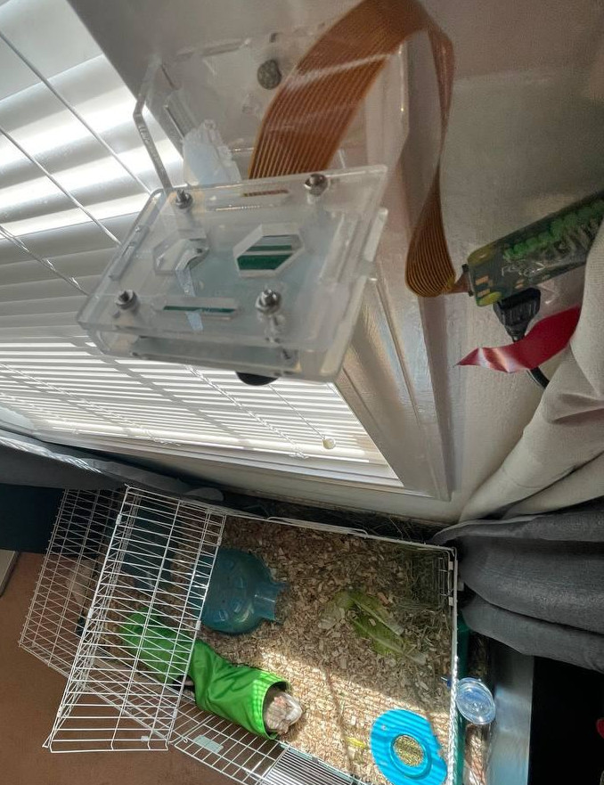
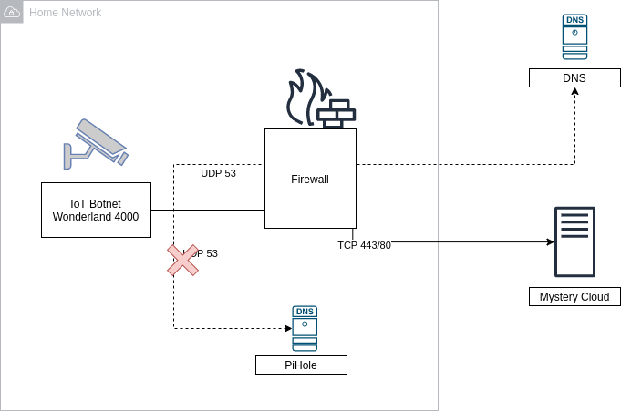
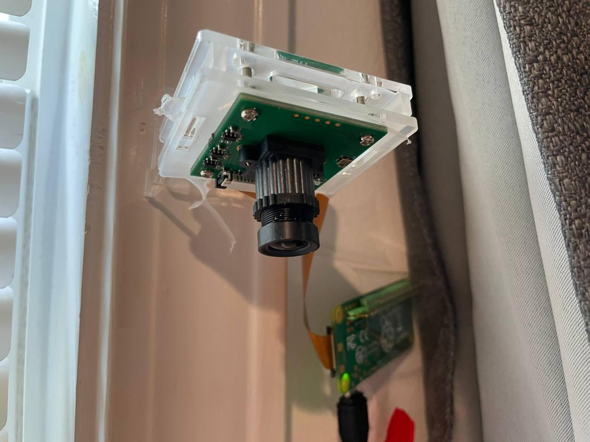
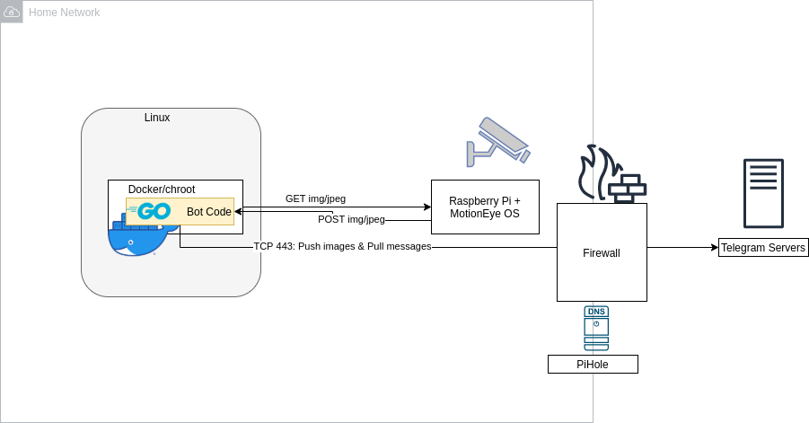
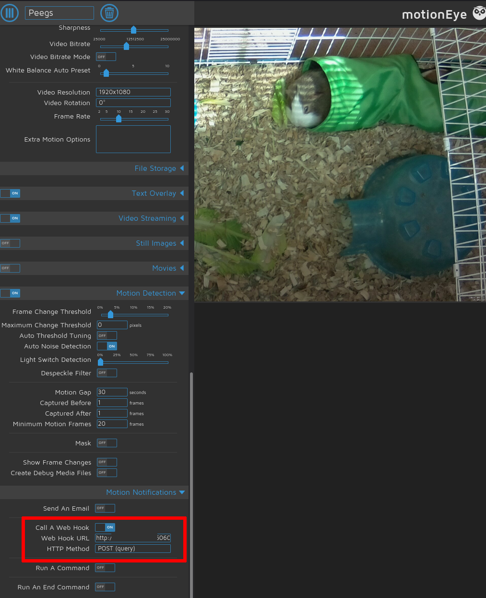
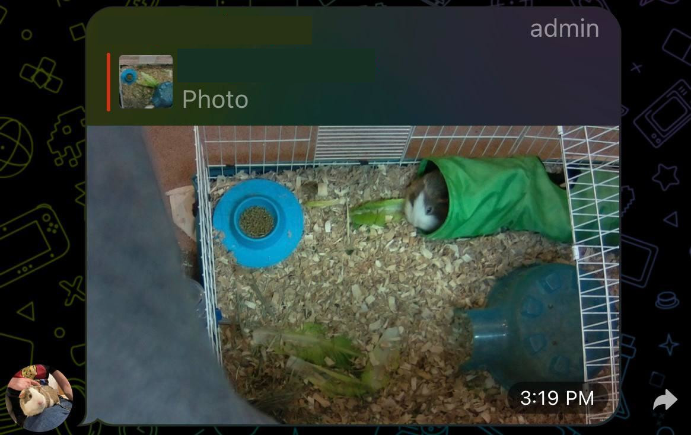
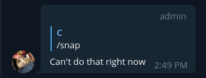
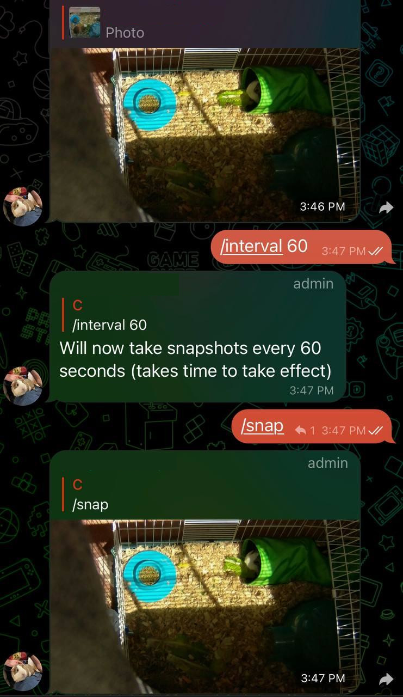

## Introduction
I am not known to always spend my time super-wisely; sometimes, I get these odd obsessions with problems that aren't really problems. But hear me out on this one!

We were planning to take a short vacation, and while not at home, there are still things that would be nice to observe from afar, namely our two guinea pigs, Porkchop and Hamhock. Now, naturally, this is a problem that has been solved time and time again, usually by way of cheap IoT cameras (you can find them on Amazon for $30-$40) that somehow, magically, allow you to see what's going on via an app.

While for the non tech-savvy crowd this would seem like a great deal, for other people that just screams "security nightmare" (please scream along). See, the way these companies manage to provide you outside access to an inside asset is usually by virtue of talking to a server, somewhere in the world, that simply stores your pictures and videos and sometimes provide `ffmpeg`-type streams over the network.

While that is undoubtedly convenient, it also requires a *lot* of trust in a (most likely) unknown camera brand to not only store your data, but also essentially giving them access to your home network (you installed a physical device on your own WiFi, remember?).

Now you might be thinking "Hm, that's not a big deal! I have a PiHole and just filter DNS requests that are fishy!". While that is indeed a good idea (and precisely what I'm doing as well), a lot of these devices straight up hard-code their own DNS server - you won't be able to change it. 

Or a firewall, maybe? Hm? What was that? You *don't* want to block 443 and 80? Oh, hm, carry on then. Or maybe I'm being too paranoid? [Nope](https://krebsonsecurity.com/2020/06/new-charges-sentencing-in-satori-iot-botnet-conspiracy/), don't think [I am](https://securityintelligence.com/posts/internet-of-threats-iot-botnets-network-attacks/).

Of course, there's the whole "maker" space as an alternative - folks building cameras using Raspberry Pis or Arduinos (myself [included](https://chollinger.com/blog/2019/12/tensorflow-on-edge-or-building-a-smart-security-camera-with-a-raspberry-pi/)), but these projects almost always provide access via a VPN, such as Wireguard or OpenVPN. However, the idea of opening incoming connections to my home network simply terrifies me, and I won't pretend that I have the networking knowledge to make that system secure.

All I want is the following:
- A way to get a view of what the camera is seeing, on demand; doesn't have to be a live-stream
- Periodic updates via still images
- Motion-triggered still images
- All while not at home, without a VPN, and without a "black box" somewhere in the middle

## Telegram Bots to the rescue
In order to get to the footage from the outside, I came up with a middle ground between "trust a random vendor", "trust a known brand", or "tunnel into your home network" - by using a **Telegram bot**.

Telegram, a cross-platform messenger with optional end-to-end encryption, provides a fairly rich [Bot API](https://core.telegram.org/bots/api), which in turn has wrappers and SDKs in various [languages](https://core.telegram.org/bots/samples).

Telegram bots are pretty simple: Telegram offers a bot to create a bot (it's like compilers written in the language they compile to, just don't question it), called *@BotFather*.

These bots can respond to messages, send images, video, audio and even implement new keyboard layouts and games. 

On the simplest level, however, the API allows a program to read and respond to messages - such as responding to "take a picture of the guinea pigs" with a picture of the guinea pigs it just took.

The neat thing about this, besides the obvious fact that Telegram bots are just neat in general, that this allows us to exclusively rely on a *Pull* approach, i.e. we can write a small piece of software that simply talks to an `HTTP` endpoint, re-use the existing monitoring and security infrastructure (network-level firewall, PiHole/DNS filters), and shove everything in a `chroot` jail aka a `docker` container.

## Hardware & MotionEye OS
But where would we get the footage from? Well, by virtue of cheap `Raspberry Pi`s, of course!

Using a `Raspberry Pi Zero` ($10), a mini-USB power cable and power brick ($2), a cheap micro SD card ($3), and a camera ($15 - $30), we can build a little camera for about ~$35. There are many, many blogs describing this process (usually as a CCTV-type setup), so I'll spare you the details.

Yes, I hammered that thing into the window frame like the savage I am, and the Pi is fixed by means of electrical tape. But if it works, it can't be *that* stupid, right?

Software wise, we can use [MotionEyeOS](https://github.com/ccrisan/motioneyeos), which is a lightweight Linux distribution for building security cameras. It comes with support for motion detection (via software, not infrared), triggering API endpoints, live streaming video, storing footage to external services, and more. Most importantly, it allows us to **trigger a snapshot via a REST request**.

Setting this up is as simple as throwing it on a micro SD card - and all of a sudden, you can talk to the camera via REST. It also comes with a neat little monitoring interface.

## Architecture
That put into an architecture diagram looks a bit like this:

The bot itself runs in a `docker` container and uses a [go API](https://github.com/go-telegram-bot-api/telegram-bot-api) for Telegram to communicate. On request (or on a timer), it can request data from the camera. If the camera itself detects motion, it can send a REST request itself and send a snapshot to Telegram. 

Let's do this!

_All code can be found on [GitHub](https://github.com/chollinger93/telegram-camera-bridge)_

## Configuring the Camera
This step is pretty straightforward: Go to the `Raspberry Pi`'s web ui and enable motion detection and a web endpoint:

Make sure to select the right camera and play around with bitrate and compression settings, where desired.

## Writing the Bot
For writing the bot, I've used `go`, because it compiles to small binaries, is fast, has great support for parallelism, is strongly typed, and is written quickly. [I've praised `go` before](https://chollinger.com/blog/2020/09/re-throw-away-code-use-go-not-python-or-rust/).

### The Config File
Let's start with the configuration file that shall control the bot's configuration. It's a `yaml` and looks like this:

# General settings
general:
  # REST Settings
  server: "0.0.0.0"
  port: "6060"
  # Rate filter for heavy motion; only applies to REST calls from motion detection; 0 == unlimited
  max_requests_per_hr: 0

telegram:
  # Bot Name
  bot_name: "@your_bot_name"
  # Bot API Key
  api_key: "ID:Key"
  # Chat ID; get from `https://api.telegram.org/bot<YourBOTToken>/getUpdates`
  chat_id: 000000

# Snapshots module
snapshots:
  enabled: true
  interval_s: 1200 # Every 20 mins
  snapshot_url: "http://camera.local/picture/1/current/?_username=whoami&_signature=KEY"
  # Hours active, in local TZ, as 24:00
  active_time:
    from_time: "08:30"
    to_time: "22:30"


This more or less describes how the application works - I'll explain specific sections below, where relevant.

This gets read by using [GitHub's Viper](https://github.com/spf13/viper) and gets unmarshalled to a handful of `structs`:

func initConfig() {
	if cfgFile != "" {
		// Use config file from the flag.
		viper.SetConfigFile(cfgFile)
	} else {
		printUsage("--config is required")
	}

	viper.AutomaticEnv() // read in environment variables that match
}


### Cobra
For the project setup, I've used [cobra](https://github.com/spf13/cobra), which allows for a neat CLI-like structure that allows us to add more commands to the program and makes flag parsing a bit easier.

We start with a `root.go` command file:


package cmd

import (
	"github.com/spf13/cobra"
	"go.uber.org/zap"

	"github.com/spf13/viper"
)

var cfgFile string
var isDebug bool

// rootCmd represents the base command when called without any subcommands
var rootCmd = &cobra.Command{
	Use:   "telegram-camera-bridge",
	Short: "A bridge between a camera / MotionEye and Telegram",
	Long:  `A bridge between a camera / MotionEye and Telegram`,
	// Uncomment the following line if your bare application
	// has an action associated with it:
	// Run: func(cmd *cobra.Command, args []string) { },
}

// Execute adds all child commands to the root command and sets flags appropriately.
// This is called by main.main(). It only needs to happen once to the rootCmd.
func Execute() {
	cobra.CheckErr(rootCmd.Execute())
}

func init() {
	cobra.OnInitialize(initConfig)
	cobra.OnInitialize(initLogging)
	// Here you will define your flags and configuration settings.
	// Cobra supports persistent flags, which, if defined here,
	// will be global for your application.

	rootCmd.PersistentFlags().StringVar(&cfgFile, "config", "", "Path to config file yaml")
	rootCmd.PersistentFlags().BoolVar(&isDebug, "debug", false, "Enable debug logging")

	// Cobra also supports local flags, which will only run
	// when this action is called directly.
	rootCmd.Flags().BoolP("toggle", "t", false, "Help message for toggle")
}


Which then creates the actual command (and also parses the config!):

// serveCmd represents the serve command
var serveCmd = &cobra.Command{
	Use:   "serve",
	Short: "Start the service",
	Long:  `Start the integration service between MotionEye OS and Telegram.`,
	Run: func(cmd *cobra.Command, args []string) {
		app := newApp()
		// Rest
		app.Serve()
	},
}

type App struct {
	Router  *mux.Router
	Cfg     *c.Config
	RestUri string
	// Modules
	Snapshots           c.CamModule
	SnapshotTimeoutChan chan int
}

func newApp() *App {
	app := &App{}

	// Read the config
	cfg := &c.Config{}
	err := viper.ReadInConfig()
	if err != nil {
		zap.S().Fatalf("Cannot read config")
	}
	err = viper.Unmarshal(cfg)
	if err != nil {
		zap.S().Fatalf("Cannot read config")
	}
    / ...


### The Camera Module
For the camera interaction, I've created a very simple interface:

type CamModule interface {
	Capture() (image.Image, error)
	Send(image.Image) error
	SendTo(image.Image, int) error
	HandleCommands(chan int) error
}


And implemented that in a module I called `Snapshots`, which in turn is responsible for taking, well, snapshots:

type Snapshots struct {
	Cfg    *Config
	Client *http.Client
	TgBot  *tgbotapi.BotAPI
}


The implementation of functionality is super straightforward: To take a picture, fire a `REST` request:

func (a *Snapshots) Capture() (image.Image, error) {
	method := "GET"
	req, err := http.NewRequest(method, a.Cfg.Snapshots.SnapshotUrl, nil)
	zap.S().Debugf("Sending request to %s", a.Cfg.Snapshots.SnapshotUrl)

	if err != nil {
		return nil, err
	}
	req.Header.Add("Cookie", "capture_fps_1=14.0; monitor_info_1=; motion_detected_1=false")

	res, err := a.Client.Do(req)
	if err != nil {
		return nil, err
	}
	defer res.Body.Close()

	img, _, err := image.Decode(res.Body)
	if err != nil {
		return nil, err
	}
	return img, nil
}


In order to send it to a chat, use the API:

func (a *Snapshots) sendToChat(file *os.File, replyId int) {
	defer os.Remove(file.Name())

	zap.S().Debugf("Authorized on account %s", a.TgBot.Self.UserName)

	u := tgbotapi.NewUpdate(0)
	u.Timeout = 60
	zap.S().Infof("File; %s", file.Name())
	msg := tgbotapi.NewPhotoUpload(a.Cfg.Telegram.ChatId, file.Name())
	if replyId != 0 {
		msg.ReplyToMessageID = replyId
	}
	_, err := a.TgBot.Send(msg)
	if err != nil {
		zap.S().Error(err)
	}
}


`*tgbotapi.BotAPI` is a pointer to the authenticated client, which we can keep in memory.

### Intermission
Too much code? Fear not, here's an adorable guinea pig photo (a pig-ture, if you will), to lighten the mood:

### Getting User Input
If a user wants to trigger a picture, we can respond to that request as follows:


func (a *Snapshots) HandleCommands(ch chan int) error {
	u := tgbotapi.NewUpdate(0)
	u.Timeout = 60

	updates, err := a.TgBot.GetUpdatesChan(u)

	if err != nil {
		return err
	}

	for update := range updates {
		if update.Message == nil { // ignore any non-Message Updates
			continue
		}
        if update.Message.Chat.ID != a.Cfg.Telegram.ChatId {
			zap.S().Warnf("Ignoring message from %s [%v] via %s", update.Message.From.UserName, update.Message.From.ID, update.Message.Chat.ID)
			continue
		}

		zap.S().Debugf("[%s] `%s`", update.Message.From.UserName, update.Message.Text)

		// Take a snapshot
		if update.Message.Text == "/snap" || update.Message.Text == fmt.Sprintf("%s %s", a.Cfg.Telegram.BotName, "/snap") {
			img, err := a.Capture()
			if err != nil {
				zap.S().Error(err)
				msg := tgbotapi.NewMessage(update.Message.Chat.ID, "Can't do that right now")
				msg.ReplyToMessageID = update.Message.MessageID
				a.TgBot.Send(msg)

				return err
			}
			// Send picture ootherwise
			a.SendTo(img, update.Message.MessageID)
// ...


And it works like this:

And it something fails:

### Periodic Updates
Another feature is to get periodic updates and snapshots.

Doing that is trivial:

func (a *App) periodicUpdater() {
	// Snapshots
	if a.Cfg.Snapshots.Enabled {
		interval := a.Cfg.Snapshots.IntervalS
		zap.S().Infof("Snapshot updater running every %vs", interval)
		ticker := time.NewTicker(time.Second * time.Duration(interval))

		for {
			select {
			case <-a.SnapshotTimeoutChan:
				zap.S().Infof("Updated Snapshot updater running every %vs", a.Cfg.Snapshots.IntervalS)
				ticker.Stop()
				ticker = time.NewTicker(time.Second * time.Duration(a.Cfg.Snapshots.IntervalS))
			case <-ticker.C:
				zap.S().Debugf("Tick, taking screenshot after %vs", a.Cfg.Snapshots.IntervalS)
				go a.handleSnapshots()
			}

		}
	}
}


But as you can tell by the use of the `channel`, this also supports updates via another command, `/interval`. That command allows us to remotely change the interval of snapshots on the fly! `go`'s `channels` are super useful for IPC and communication between `goroutines`, and this illustrates a prime use case for it.

If you just change the value of `a.Cfg.Snapshots.IntervalS` - which you can, because it's a pointer to the `struct` and hence would be seen by the `serve` command - the `ticker` would not update. `Tickers` themselves are implemented as channels.

### Reacting to Motion Sensing Events
Remember when we [set up](#configuring-the-camera) the motion detection and web hooks for that? Well, every time `MotionEyeOS` notices significant changes in the pixel data, it'll send a POST request.

We'll capture those by exposing a local `REST` endpoint, using the trusty [`gorilla/mux`](https://github.com/gorilla/mux) library, by first creating a router:

func (app *App) buildRouter() {
	app.Router = mux.NewRouter()

    // ..
	app.Router.HandleFunc("/motion", app.PostHandlerMotion).Methods(http.MethodPost)
	http.Handle("/", app.Router)
}

func (a *App) Serve() {
	// Update snapshots and videos
	go a.periodicUpdater()
	// Handle commands
	go a.commandHandler()

	// Server
	uri := fmt.Sprintf("%s:%s", a.Cfg.General.Server, a.Cfg.General.Port)
	zap.S().Infof("Listening on %s", uri)
	a.RestUri = uri
	log.Fatal(http.ListenAndServe(uri, a.Router))
}


And handle actual requests:

func (a *App) PostHandlerMotion(w http.ResponseWriter, r *http.Request) {
	if r.Body == nil {
		zap.S().Error("Null request")
		a.sendErr(w, "", http.StatusBadRequest)
		return
	}
	defer r.Body.Close()

	// IP range filter
	if err := a.filterRequest(w, r); err != nil {
		return
	}
	_, err := ioutil.ReadAll(r.Body)
	if err != nil {
		zap.S().Error(err)
		a.sendErr(w, "", http.StatusBadRequest)
		return
	}
	// Handle Snapshots
	if a.Cfg.Snapshots.Enabled {
		err = a.handleSnapshots()
		if err != nil {
			zap.S().Error(err)
			a.sendErr(w, "", http.StatusInternalServerError)
		}
	}
}


Using the same interface as before. Easy peasy!

### Rate Limiting & Time Filters
Another neat feature I thought was useful was rate limiting - i.e. ignoring very active motion detection phases that trigger many a snapshots - and "active hours", where it tends to be bright enough to see anything (and where we would most likely be awake).

The former is using [throttled](https://github.com/throttled/throttled) as a library, and here's how the actual `buildRouter()` method looks like with throttling enabled:

func (app *App) buildRouter() {
	app.Router = mux.NewRouter()
	if app.Cfg.General.RateFilter != 0 {
		// Throttling
		store, err := memstore.New(65536)
		if err != nil {
			log.Fatal(err)
		}

		quota := throttled.RateQuota{
			MaxRate:  throttled.PerHour(app.Cfg.General.RateFilter),
			MaxBurst: 0,
		}
		rateLimiter, err := throttled.NewGCRARateLimiter(store, quota)
		if err != nil {
			zap.S().Fatal(err)
		}

		httpRateLimiter := throttled.HTTPRateLimiter{
			Error:       app.denyHandler,
			RateLimiter: rateLimiter,
			VaryBy:      &throttled.VaryBy{Path: true},
		}
		// Handle
		app.Router.Use(httpRateLimiter.RateLimit)
		app.Router.HandleFunc("/motion", app.PostHandlerMotion).Methods(http.MethodPost)
		http.Handle("/", httpRateLimiter.RateLimit(app.Router))

	} else {
		app.Router.HandleFunc("/motion", app.PostHandlerMotion).Methods(http.MethodPost)
		http.Handle("/", app.Router)
	}
}


Which just shows up as `mux middleware`:

// MiddlewareFunc is a function which receives an http.Handler and returns another http.Handler.
// Typically, the returned handler is a closure which does something with the http.ResponseWriter and http.Request passed
// to it, and then calls the handler passed as parameter to the MiddlewareFunc.
type MiddlewareFunc func(http.Handler) http.Handler

// middleware interface is anything which implements a MiddlewareFunc named Middleware.
type middleware interface {
	Middleware(handler http.Handler) http.Handler
}

...and limits motion requests to as set number per hour. Others get a `429` code back.

For active hours, a simple set of functions just ceases operation when outside those hours:

func isWithinActiveHours(now, start, end string) bool {
	startTime, err := time.Parse("15:04", start)
	if err != nil {
		zap.S().Error(err)
		return false
	}
	endTime, err := time.Parse("15:04", end)
	if err != nil {
		zap.S().Error(err)
		return false
	}
	nowTime, err := time.Parse("15:04", now)
	if err != nil {
		zap.S().Error(err)
		return false
	}
	return inTimeSpan(nowTime, startTime, endTime)
}

func inTimeSpan(check, start, end time.Time) bool {
	if start.Before(end) {
		return !check.Before(start) && !check.After(end)
	}
	if start.Equal(end) {
		return check.Equal(start)
	}
	return !start.After(check) || !end.Before(check)
}

func getNowAsHrMinString() string {
	now := time.Now()
	return fmt.Sprintf("%02d:%02d", now.Hour(), now.Minute())
}


### Privacy and Public Bots
One thing worth noting - Telegram bots are public. If you know the name, you can find them.

Which is why it's important that we have this little snippet right here:

 if update.Message.Chat.ID != a.Cfg.Telegram.ChatId {
			zap.S().Warnf("Ignoring message from %s [%v] via %s", update.Message.From.UserName, update.Message.From.ID, update.Message.Chat.ID)
			continue
		}


It simply discards any message that didn't come from an authorized chat ID, which we've set in the config file. That way, people can chat up the bot, but it won't respond.

And given that this is a *pull* approach, i.e. our bot polls the Telegram chat for messages periodically, as can be seen in the library:


// GetUpdates fetches updates.
// If a WebHook is set, this will not return any data!
//
// Offset, Limit, and Timeout are optional.
// To avoid stale items, set Offset to one higher than the previous item.
// Set Timeout to a large number to reduce requests so you can get updates
// instantly instead of having to wait between requests.
func (bot *BotAPI) GetUpdates(config UpdateConfig) ([]Update, error) {
	v := url.Values{}
	if config.Offset != 0 {
		v.Add("offset", strconv.Itoa(config.Offset))
	}
	if config.Limit > 0 {
		v.Add("limit", strconv.Itoa(config.Limit))
	}
	if config.Timeout > 0 {
		v.Add("timeout", strconv.Itoa(config.Timeout))
	}

	resp, err := bot.MakeRequest("getUpdates", v)
	if err != nil {
		return []Update{}, err
	}

	var updates []Update
	json.Unmarshal(resp.Result, &updates)

	bot.debugLog("getUpdates", v, updates)

	return updates, nil
}


It is unlikely that a malicious actor could essentially `DDos` the server (because we pull all buffered messages and don't expose a REST endpoint ourselves). And even if, given that this runs via `docker,` we can set resource limits:


CONFIG_FILE=$(pwd)/config/sample.yaml
docker build . -t telegram-motioneye
docker run -d  \
    -p "$(cat $CONFIG_FILE | grep port | cut -d'"' -f2 | xargs)":6060 \
    -v $(pwd)/config:/config \
    --memory=128m --cpus=1.5 \
    telegram-motioneye \
    /app/server serve --config /config/$(basename $CONFIG_FILE)
    

Not that that is terribly necessary by default:

docker stats $CONTAINER
CONTAINER ID   NAME           CPU %     MEM USAGE / LIMIT    MEM %     NET I/O         BLOCK I/O        PIDS
0c781692b7e2   motioneye-tele   0.00%     15.05MiB / 29.4GiB   0.05%     517kB / 328kB   12.3kB / 295kB   7


You *can* use `WebHooks` if you so desire, though:

> We currently support two ways of processing bot updates, `getUpdates` and `setWebhook`. `getUpdates` is a pull mechanism, `setwebhook` is push.
>
> https://core.telegram.org/bots/webhooks

## Conclusion

This project, to my own surprise, can actually be filed under "kind of useful!". It's not terribly complicated, can be written in one afternoon, and is arguably pretty useful to check in on the two demanding pigs when away from home.

_All code can be found on [GitHub](https://github.com/chollinger93/telegram-camera-bridge)_

_All development and benchmarking was done under GNU/Linux [PopOS! 21.04 on Kernel 5.11] with 12 Intel i7-9750H vCores @ 4.5Ghz and 16GB RAM on a 2019 System76 Gazelle Laptop, as well as a Raspberry Pi Zero W, using [bigiron.local](https://chollinger.com/blog/2019/04/building-a-home-server/) as endpoint_