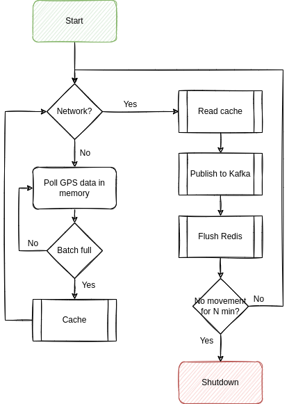

## Introduction

This article talks about building our own `Raspbian` image, reading `gpsd` data,  dealing with issues withing GPS and NMEA, caching everything with `redis`, trying strongly typed domain modeling in `Python` (of all places) and using concepts borrowed from `scala` and `Haskell` to first scaffold function signatures, then building them  (specifically around types and how we can use effects to annotate our scaffolding, even though we don't have an effect framework); on how we can use `scala` with `Flink` and `Kafka` to consume a stream with (more or less) *exactly-once* semantics in a handful of lines, and how we can visualize and analyze GPS data via `Superset`.

In other words, it's a bit of a wild ride and, as I'll be the first to admit, not always the most straightforward.



You *might* be interested in this article if...

- You like `Linux`. This article makes heavy use of it, down to the serial ports.
- You like playing around with `Python` and `Scala` and want to weirdly reason about types in a language that thinks `3*3 is '333'` and where that makes perfect sense, coming from a language where a frameworks' `log.info()` type signature reads `def info(message: => String): F[Unit] `  (because, of course, they are *effectful* and log messages are *functions*. It's a lot of fun and even semi-productive!)
- You think cars are cool and/or have a knack for GPS data everything geospatial (can I interest you in map projections and call out flaws in `EPSG:4326`?)
- You think streaming systems are neat and `Flink` and `Kafka` are interesting
- You think building a system that's designed to cache offline and then turn into a streaming client sounds interesting (you can call that "IoT" if you think it's cool)
- You generally like somewhat low-tech things talking to somewhat high-tech things, in this case going from serial devices that care about baud rates all the way through real-time, persistent streaming systems that can write `Iceberg` data into cool, distributed data lakes, or anything in between

Then carry on!

This is Part 1. [Part 2](/blog/2022/09/tiny-telematics-tracking-my-trucks-location-offline-with-a-raspberry-pi-redis-kafka-and-flink-part-2/) can be found here.

*All code can be found on [GitHub](https://github.com/chollinger93/TinyTelematics/).*

## Structure
Since this article is pretty long, here's whats going to happen. Feel free to skip sections, I think most things can stand on their own.

1. We'll talk [architecture](#the-plan). Systems Design!
2. Building a custom `Linux` image: A [deep dive](#building-a-custom-raspbianlinux-image) on how to do it and why you should bother
4. Next, we'll design the [client](#the-client-collecting-data--caching-it) by reasoning about types in `Python` 
5. And we'll talk about [implementation](#implementation-python-yay) details, also `Python` 
9. [Conclusion](#conclusion) & Next time in [Part 2](/blog/2022/09/tiny-telematics-tracking-my-trucks-location-offline-with-a-raspberry-pi-redis-kafka-and-flink-part-2/)

## Telematics (once again)

I wrote about the topic [before](blog/2019/08/how-i-built-a-tiny-real-time-telematics-application-on-aws/) (twice, [actually](blog/2017/03/tiny-telematics-with-spark-and-zeppelin/)). Telematics just means "creepily tracking your every move while you operate your vehicle (and maybe plug into your OBD port).

Now, the thing is: I mostly drive a 2021 RAM 1500 Truck. RAM already offers what they call "RAM Telematics™":

> Ram Telematics™ is a web-based fleet management solution designed to  help you monitor your entire business with real-time data and insights.  Talk to your local dealer to learn how Ram Telematics helps business  owners and managers with fleets of all sizes improve day-to-day  operational efficiency.
>
> https://www.ramtrucks.com/telematics.html

It is, however, *also* not available for me, a mere plebeian who uses his truck to haul dirt and mulch and go up mountain roads, because 4x4s are fun.

Sure - you can get [hum](https://www.hum.com/), but that'll run you $99 retail, a $35 activation fee *and* it's $15/mo. Also, I really don't want anybody to have all my (real-time!) location data, and the more I think about it, the less do I need this to be actually real time.

But it *is* cool to see where you're going and data mine all that data, and it's even cooler if you can do it without giving all your data away for free to Google Maps. 

So why don't I do what I do best and overengineer something myself?

## The Plan

In the last iteration, everything was done via `AWS` - this was a fun project to play around with AWS IoT [Greengrass](https://aws.amazon.com/greengrass/) and the like, but the solution ultimately ran on somebody else's computer ("the cloud") and the client application ran on my full-size System76 laptop, which isn't exactly portable. 

Also, [this](https://news.ycombinator.com/item?id=32475298) just happened. Also this:



The [first](blog/2017/03/tiny-telematics-with-spark-and-zeppelin/) iteration in 2017 used Hadoop and an app to collect the data.

So, this time, we'll do it differently - we'll do it offline and *completely* "in-house". Which is ironic, given the topic, but I was told not to make too many stupid puns.

### A (simple) cached, offline architecture

What made the previous iterations somewhat complicated (as they were mostly intended as a tech showcase) was their dependency on the internet and third party tools. While fun to play around with, not super usable. 

This topic is actually something I'm somewhat passionate about - I have a thing for maps, geospatial data, zoning, geography (...), both in real-life as well as on a theoretical level. In fact, I've recently amused a bunch of people greatly by saying 

>  "Oh, that's like 2 Walmarts!" 

(~20 acres or 8 hectares, since I previously looked up the local Wally World on the county's GIS map), which was dubbed as something along the lines of *"the most American unit of measurement"*. Anyways....

So, we'll keep it simple this time around and focus on the following architecture:


We'll go through the details, but it boils down to the following principles:

1. Use `gpsd` to get geo data from a physical USB GPS dongle
2. Work offline by default. Cache all your data if there's no internet available
3. If you can (i.e., are online), publish all your data to a streaming pipeline via `Kafka`
4. Said pipeline persists the data 

#### 1. Collect data via GPS

A Raspberry Pi Zero (the original one, that is - `armv6` and all) collects GPS data via a USB OTG dongle. The code for that is trivial - here's the [entirety](https://github.com/chollinger93/TinyTelematics/blob/aws/lambda/telematics-input/lambda_function.py#L32) of it from last time around:

```python
def poll_gps(_gpsd, batch=128):
    print('Starting GPS poll, batch: {}'.format(batch))
    data = []
    i = 0
    while True:
        report = _gpsd.next()
        # TPV - Time Position Velocity
        if report['class'] == 'TPV':
            # Get data
            lat = getattr(report, 'lat', 0.0)
            long = getattr(report, 'lon', 0.0)
            time = getattr(report, 'time', '')
            altitude = getattr(report, 'alt', 'nan')
            speed = getattr(report, 'speed', 'nan')
            record = Record(lat, long, altitude, time, speed)
            data.append(json.dumps(record.__dict__))
            if i >= batch:
                push_to_iot_core(data)
                data = []
                i = 0
            else:
                i += 1
```

(We'll soon learn how the devil's in the details with this snippet)

#### 2. Cache data

Now, instead of calling something like `push_to_iot_core`, we'll have a different control structure:  In case we are offline (the default), push data into `redis`. Without wanting to go into too much implementation detail, this is a matter of having a tiny client that calls `RPUSH` occasionally. 

`redis` can run with a very minimal memory and CPU footprint. Given the nature of data we're collecting, we can set lax data persistence expectations. It also has native ARM support.

#### 3. Send data if you can

However, once have a connection to a pre-determined WiFi network, we'll grab all data from our local cache and push it to an `Apache Kafka` instance which can serve as a message broker. In fairness, we could use any type of message broker or `REST` endpoint here - but `Kafka` plays nicely with others.

#### 4. Process data

From Kafka, we'll use [Apache Flink](https://flink.apache.org/) to consume data. The resulting data can be written to Apache Iceberg or any other format (see [here](blog/2021/12/building-a-data-lake-with-spark-and-iceberg-at-home-to-over-complicate-shopping-for-a-house/)).

***Note**: In this article, we'll write to a `MariaDB` SQL database instead of `Iceberg` + `Trino`, because there is enough infrastructure and complexity to deal with as-is. Iceberg is a fascinating piece of tech and I've played [around](http://localhost:1313/) with it before, but this article is already pretty long. Also, `MariaDB` can do spatial functions, which will come in handy later on.* 

#### 5. Visualization

At the end, we'll use `Apache Superset` to visualize the data:




#### Other assumptions & language choice

Since we're running on a low-powered SBC, we'll be single-threaded and block on each IO operation. This makes fulfilling the contract (see below) very easy.

Since we'll be on a small Raspberry Pi Zero, we'll also assume power saving is relevant and that it should auto-terminate if not in use (see below).

With regards to **languages**, we'll use `Python` for the client (because we have code we can re-use - see above) and `Scala` for the `Flink` app, because `Scala` is fun and I feel like it.  ¯\\_(ツ)_/¯ 

### An equally simple contract & model

We need 2 things for a decent design for our client (the starting point) here: A *contract* (What can the client guarantee and what can downstream plan for?) and a *model*, i.e. what we're trying to produce. I'd love to introduce a metadata layer and schema registry here, but I'll refrain from doing so.

#### Contract

The contract can be simple, but must be as follows:

- We do **not** guarantee exactly-once delivery (we can send duplicates)
- We **do** guarantee at-least once delivery (we won't drop messages)
- We **do** guarantee order

The latter is easy to realize, since we have distinct, autonomous, single-threaded clients that block on each `IO` interaction. "Not exactly-once, but at-least once" is also an equally simple pattern, as this simply means "if it fails, just do it again".

#### Model

I'll steal the model from last time, with minor adjustments:

```python
@dataclass
class GpsRecord:
    tripId: int # on arm64/x86, 64 bit; otherwise, 32
    lat: float # for SQL, a high-precision DECIMAL!
    lon: float
    altitude: float
    speed: float
    timestamp: int = int(time.time() * 1000) # just because timestamps are a pain
    userId: int = uuid.getnode()
```

Simple, but does what we need it to do for now. 

***Note**: This is not a good model that would support multi-user use cases - it lacks good primary keys, partitions, even more attributes (`nmea` data is rich), but good enough to support a handful of users that drive different trips in different vehicles.*

The `userId` is based on the hardware address as a 48-bit positive integer, which is a naive approach that'll work for now. 

The `tripId` is a random `32bit integer` on a Raspberry Pi Zero, and a random `64bit` long on systems that support it. This works well enough to uniquely identify a trip, since our entire process terminates every time it believes a trip to be over and hence, generates a new UUID upon restarting.

Realistically, with a 32bit length, we'd need to do collision checks in the streaming pipeline.

## Building a custom Raspbian/Linux image

Now that we have the design out of the way, let's consider our execution environment. It's somewhat important to understand where our code will run.

### Power Savings: Car Batteries are weird

Now, my truck comes with two 400W regular 115V power outlets and a 12V outlet with a 20Ah fuse (240Wh max), plus USB A and C ports - that is ample power to power a full size laptop (and I've done it before). So a Raspberry Pi should be a trivial thing to operate.

However, assuming a car battery for an older vehicle, say a 1998 Chevy Lumina with the 3.8L V6 (a more appropriate vehicle to jam random electronics into), would probably have a capacity of 600 or so Wh (12V at 45Ah), which of course isn't exactly what a car battery is designed for (they are designed to output short bursts of extremely high current and are usually specified via "Cold Cranking Amps", a delightfully obscure unit of measurement defining the sustained Amps a 12V battery can deliver at 0F for 30 seconds, but that doesn't matter).

Suppose, now, that our Raspberry Pi Zero W with a dongle pulls in 1A (which is high, but its rated for up to 2.5A). Assume 50% efficiency from a cheap PSU/voltage converter (since the Pi takes 5V), so we really need 2A. So the little Pi could, theoretically, drain a car battery after 300 hours, or **5 days** on 24hr power draw. I certainly have not moved my vehicle for 5 days at a time (think vacation), so that is a surprising amount. Somebody check my math here, because I was expecting to write a bit about how it would last 6 months and that we need to still prepare for no good reason whatsoever. 

### Measuring & Reducing Power Draw

Now, originally, I built this *extremely* cursed measuring apparatus:



Which, while it works (iTs nOt fUseD yadda yadda, nobody cares), is not necessarily precise (even though this board had, if I recall correctly, WiFi enabled and ran some `python` garbage, so 120mA seems about right). I wager to guess that the redneck-engineering nature of it added an ohm or two of resistance. 

*Anyways*, fortunately for us, smart people with good equipment have already done all this work for us: Raspi.tv did some [benchmarking](http://raspi.tv/2017/how-much-power-does-pi-zero-w-use) and various other folks around the web ran tests (like [this](https://blues.io/blog/tips-tricks-optimizing-raspberry-pi-power/) or [that](https://www.jeffgeerling.com/blogs/jeff-geerling/raspberry-pi-zero-conserve-energy)) around disabling things.

- A standard, idling Zero W runs at about 120mA
- Disabling HDMI, LEDs, and minimizing background tasks (i.e., aiming for low utilization) is worth about 40mA (even though others report more, which I find... unlikely)

While 120mA doesn't exactly sound like it'll drain a full size truck's battery any time soon, it's still a good idea to at least consider bloat and power draw.

### Reproducible Builds & Speed

One way to save power - and to make reproducible builds - is to build our own Linux image.

You can do all of what follows on the Raspberry, but especially things like compiling `redis` tend to be a *whole lot* faster and easier on a full-powered `GNU/Linux` computer. 

> Speed has never killed anyone. Suddenly becoming stationary, that's what gets you.
>
> \- Jeremy Clarkson

It also allows you to keep and re-deploy the `img` file onto different machines. I tend not to do this, but every time I come back to a project, setting up an environment becomes a nightmare - but not if you keep an image file around! 

It's essentially what you did before `Docker` to make your builds work every time! [1]

So: Reproducible Environment + Speed = Great Success.

*[1]  For the love of god, do not take this seriously. It is, however, a decent idea to at least consider for a decent dev cycle - a more honest comparison is to build your own `Docker` **base** image.*

### Building a small image

Let's do it. Your mileage may vary based on architecture and base image.

#### Getting Started

To poke around, we can download a `Raspbian Lite` [image](https://www.raspberrypi.com/software/operating-systems/) and mount it, keeping in mind that we have 2 partitions available. 

In other words, you need to tell your tools where to start reading data. It's like plugging in a USB thumb drive... but with math involved. Isn't that *fun*?

```bash
❯ unxz 2022-04-04-raspios-bullseye-armhf-lite.img.xz
❯ fdisk -u -l 2022-04-04-raspios-bullseye-armhf-lite.img
Disk 2022-04-04-raspios-bullseye-armhf-lite.img: 1.88 GiB, 2017460224 bytes, 3940352 sectors
Units: sectors of 1 * 512 = 512 bytes
Sector size (logical/physical): 512 bytes / 512 bytes
I/O size (minimum/optimal): 512 bytes / 512 bytes
Disklabel type: dos
Disk identifier: 0x7d5a2870

Device                                      Boot  Start     End Sectors  Size Id Type
2022-04-04-raspios-bullseye-armhf-lite.img1        8192  532479  524288  256M  c W95 FAT32 (LBA)
2022-04-04-raspios-bullseye-armhf-lite.img2      532480 3940351 3407872  1.6G 83 Linux

❯ mkdir -p /mnt/raspi
# 532480 * 512 = 272629760
❯ sudo mount -o loop,offset=272629760 2022-04-04-raspios-bullseye-armhf-lite.img /mnt/raspi
```

There are some tools that do this for you, but all you really need is `mount` (and maybe a calculator to figure out the offset in bytes). See `mount`'s [man page](https://man7.org/linux/man-pages/man8/mount.8.html#LOOP-DEVICE_SUPPORT) for details.

>  This type of mount knows about three options, namely `loop`, `offset` and `sizelimit`, that are really options to [losetup](https://man7.org/linux/man-pages/man8/losetup.8.html)(8). (These options can be used in addition to those specific to the filesystem type.)
>
> https://man7.org/linux/man-pages/man8/mount.8.html#LOOP-DEVICE_SUPPORT

#### Resizing

Since the default image file is small, let's make it a big bigger so we have space to work with, by first resizing the image file, then the partition.

```bash
# Cutting the branch you're sitting on and all that
❯ sudo umount /mnt/raspi
# Resize the img file
❯ qemu-img resize ./2022-04-04-raspios-bullseye-armhf-lite.img 4G
# Resize the partition
❯ sudo parted ./2022-04-04-raspios-bullseye-armhf-lite.img
GNU Parted 3.4
Using /home/christian/Downloads/raspi/2022-04-04-raspios-bullseye-armhf-lite.img
Welcome to GNU Parted! Type 'help' to view a list of commands.
(parted) print                                                            
Model:  (file)
Disk /home/christian/Downloads/raspi/2022-04-04-raspios-bullseye-armhf-lite.img: 4295MB
Sector size (logical/physical): 512B/512B
Partition Table: msdos
Disk Flags: 

Number  Start   End     Size    Type     File system  Flags
 1      4194kB  273MB   268MB   primary  fat32        lba
 2      273MB   2017MB  1745MB  primary  ext4

(parted) resizepart                                                       
Partition number? 2                                                       
End?  [2017MB]? 4295MB                                                    
(parted) print                                                            
Model:  (file)
Disk /home/christian/Downloads/raspi/2022-04-04-raspios-bullseye-armhf-lite.img: 4295MB
Sector size (logical/physical): 512B/512B
Partition Table: msdos
Disk Flags: 

Number  Start   End     Size    Type     File system  Flags
 1      4194kB  273MB   268MB   primary  fat32        lba
 2      273MB   4295MB  4022MB  primary  ext4

(parted)  
# exit & resize2fs & persist
❯ sudo udisksctl loop-setup -f 2022-04-04-raspios-bullseye-armhf-lite.img
❯ lsblk
NAME            MAJ:MIN RM   SIZE RO TYPE  MOUNTPOINTS
loop0             7:0    0     4G  0 loop  
├─loop0p1       259:7    0   256M  0 part  
└─loop0p2       259:8    0   3.7G  0 part  
❯ sudo e2fsck -f /dev/loop0p2
❯ sudo resize2fs /dev/loop0p2
# Unmount everything, mount again
❯ sudo losetup -D
❯ sudo mount -o loop,offset=272629760 2022-04-04-raspios-bullseye-armhf-lite.img /mnt/raspi
```

#### chroot & setup

We can now `chroot` into this - or use `systemd-nspawn` to avoid having to manually mount `/proc` and the like (which you can). You'll probably need `qemu` for the (presumably) x86 -> ARM emulation. On a side note, I'd be curious to see how an M1 Mac handles this. 

```bash
sudo apt-get install systemd-container qemu qemu-user-static binfmt-support qemu-utils
# root@raspi:~#
# root@raspi:~# df -hT
# Filesystem            Type   Size  Used Avail Use% Mounted on
# /dev/loop0            ext4   3.7G  1.2G  2.3G  35% /
```

And now we can set this up just the way we like it - in this case, installing some dependencies ahead of time and disabling some stuff.

We'll start by setting up some basic dependencies and the user:

```bash
raspi-config # disable I2C, SPI
echo 'hdmi_blanking=1' > /boot/config.txt # disable HDMI

# We need this for the GPS dongle
apt update
apt-get install gpsd gpsd-tools gpsd-clients ntp -y
# And for Python
apt-get install python3-distutils python3-apt git vim libffi-dev -y
# Set up the telematics user with it
useradd telematics 
passwd telematics
usermod -aG sudo telematics
sudo mkdir /home/telematics && sudo chown telematics:telematics /home/telematics 
su telematics && cd ~
```

Followed by the `Python` environment - keep in mind that `pyenv` builds from source, and that `Python` is really mostly `C`.

```bash
# Install poetry
curl -sSL https://raw.githubusercontent.com/python-poetry/poetry/master/get-poetry.py | python -
echo 'PATH=$PATH:$HOME/.poetry/bin' >> /home/telematics/.bashrc
# Install an appropriate python version
curl https://pyenv.run | bash
echo 'export PYENV_ROOT="$HOME/.pyenv"' >> /home/telematics/.bashrc
echo 'command -v pyenv >/dev/null || export PATH="$PYENV_ROOT/bin:$PATH"' >> /home/telematics/.bashrc
echo 'eval "$(pyenv init -)"' >> /home/telematics/.bashrc
source /home/telematics/.bashrc
# To build python
apt-get install make build-essential libssl-dev zlib1g-dev libbz2-dev libreadline-dev libsqlite3-dev wget curl llvm libncursesw5-dev xz-utils tk-dev libxml2-dev libxmlsec1-dev libffi-dev liblzma-dev -y
# And install
pyenv install 3.8.13
# Alternatively
sudo add-apt-repository ppa:deadsnakes/ppa
sudo apt-get update
sudo apt-get install python3.8 -y
```

We'll then install the application (more on that in a minute). Depending on whether it's an original Raspberry Pi Zero (W), we might need to use a `systemd` service. Otherwise, `Docker` would work well. We'll come back to that. We'll also build `redis` and enable a service for that.

```bash
# Install the application + all dependencies
git clone https://github.com/chollinger93/TinyTelematics.git && cd TinyTelematics
poetry env use ~/.pyenv/versions/3.8.13/bin/python3
poetry shell
pip3 install --upgrade pip
poetry install
poetry build
# Set up a service (if we're not running via docker, see below)
sudo cp system/tiny-telematics.service /etc/systemd/system
sudo systemctl enable /etc/systemd/system/tiny-telematics.service
# Back to root
exit

# Build / install redis
VERSION="7.0.4"
mkdir /etc/redis/
wget https://github.com/redis/redis/archive/${VERSION}.tar.gz -O  /etc/redis/redis-${VERSION}.tar.gz
cd /etc/redis
tar xzf redis-${VERSION}.tar.gz && rm redis-${VERSION}.tar.gz 
cd redis-${VERSION}
make
ln -s /etc/redis/redis-7.0.4/ /etc/redis/latest
mkdir /etc/redis/latest/bin
mv /etc/redis/latest/src/redis-server /etc/redis/latest/bin/
echo 'export PATH=$PATH:/etc/redis/latest/bin' >> /home/telematics/.bashrc

# And set up a systemd service
cat <<EOT >> /etc/systemd/system/redis.service
[Unit]
Description=Redis
After=syslog.target

[Service]
ExecStart=/etc/redis/latest/bin/redis-server /etc/redis/latest/redis.conf
RestartSec=5s
Restart=on-success

[Install]
WantedBy=multi-user.target
EOT
systemctl enable /etc/systemd/system/redis.service

# Install docker
# See armv6 woes: https://markmcgookin.com/2019/08/04/how-to-install-docker-on-a-raspberry-pi-zero-w-running-raspbian-buster/
sudo curl -sL get.docker.com | bash

# use apt to remove packages, add your wpa_supplicant.conf, change configs, replace existing tools with more lightweight options - do whatever
# for me, I've edited /etc/resolv.conf for my custom DNS server and /etc/hostname + /etc/hosts
```

And there you go, your very own Raspbian distribution! 

#### Flash to an SD card

Use the [imager](https://www.raspberrypi.com/software/) tool to flash it to an SD card & make sure you customize your WiFi settings.


*Fun fact: On `PopOS!` with an NVidia GPU **not** running in hybrid mode with the IGPU, this tool crashes and I have no idea why, but I assume GTK explodes somehow.*

### A note on the usefulness of building an image

There are many other ways of doing this - [DietPi](https://dietpi.com/) comes to mind - and the benefits for this particular application in terms of power saving are dubious at best. It is, however, a good exercise to know how to do it, and, perhaps more importantly, makes this process much easier to test and reproduce builds, something that always tends to be a nightmare with Raspberry or embedded builds.

One thing I will say - doing it like this shaves hours off compilation time, e.g. when `pyenv install` compiles `CPython` from scratch. Especially when working with multiple small computers, not having to write a script and run it for ages is *very* valuable. 

What I would do differently, however, is to also compiled `gpsd` at this step, but that's a bit of a tall order.

We'll call out how to use `docker` later to bundle dependencies and build multi-arch images, but that'll only work for `armv7` and `arm64` architectures. I've personally had to use bare metal with `systemd`. I do not particularly like `systemd`.

## The Client: Collecting Data & Caching it

Since we now have a leg to stand on (i.e., an image), let's put together the client ~~real quick~~. For this, we can re-use some old [code](https://github.com/chollinger93/TinyTelematics/blob/aws/lambda/telematics-input/lambda_function.py). I'm keeping this nice and simple, rather than trying to build anything fancy.

Please note that we haven't set up `Kafka` yet - that'll happen in [Part 2](/blog/2022/09/tiny-telematics-tracking-my-trucks-location-offline-with-a-raspberry-pi-redis-kafka-and-flink-part-2/).

### Setup

First, we'll use [`poetry`](https://python-poetry.org/docs/) this time around to make the environment a bit easier to handle. I cannot express how much I love `poetry`.

Install it:

```bash
curl -sSL https://raw.githubusercontent.com/python-poetry/poetry/master/get-poetry.py | python3 -
```

And create a new project:

```bash
poetry new tiny-telematics
mv tiny-telematics/tests tiny-telematics/tiny_telematics tiny-telematics/*toml .
```

From there on, we can use neat things such as `poetry add` to add dependencies that grab proper versions. It's like `sbt` or `maven` or even `gem`, but for `Python`! It's incredible!

All in all, `poetry` makes a *lot* of things I despise about `Python` - project setup, virtual environments, dependency management, endless scripts - much, much easier. Big fan.

### Scaffolding by means of reasoning about types

Okay, environment down. Let's talk code.

Taking a page from my `scala` [experiments](blog/2022/06/functional-programming-concepts-i-actually-like-a-bit-of-praise-for-scala-for-once/), let's not overthink this and just sketch out a handful of method signatures and approach this mostly procedurally (rather than really *functional*, since we're doing nothing to avoid effects).

***Note**: This is a real thing I do in every language that's forced upon me - `python`, `scala`, `Java`, `go`, `Ruby`, `TypeScript` - I plan out functions and their types before anything else, and accept the fact that I'm often wrong and change things. In fact, what you see here isn't a 100% match to what's on GitHub. But it is how I work, and I've recently added the whole "effectful" thing to that methodology, as called out in the linked article.*

I'll be writing this as if we had an `IO` monad and a `Resource`, just to *call out* side effects, but I won't reason about any other algebras or higher-kinded types. Think of it as documentation. The official `Python` docs are open about the languages shortcomings (for once):

> Python programs written in functional style usually won’t go to the extreme of avoiding all I/O or all assignments; instead, they’ll provide a functional-appearing interface but will use non-functional features internally. For example, the implementation of a function will still use assignments to local variables, but won’t modify global variables or have other side effects.
>
> https://docs.python.org/3/howto/functional.html

I am, however, curious if people have made attempts at more formal implementations of typing effectful computations. If anyone knows more (I didn't find anything), please shoot me a message!

For the record, I'll also refrain from complex abstractions - such as a generic / abstract class (or typeclasses) for the cache. I'm just going to assume that your production code should look closer to this:

```scala
def cache[F[_] : Cache, K, V]: Resource[F, K, V]
```

Than that:

```scala
def RedisCache(): Resource[RedisClient[String,String]]
def InMemoryCache(): Resource[RefMap[String,String]]
```

But what we'll do here is closer to the latter, since there's a lot to get done.

An for the record, in `scala`, we *would* do all those things and would start by modeling the logic by means of small algebras as an abstract concept before all that:

> Now it is time to get to work, as we apply these techniques to our business domain.
> A common way to get a feature design started is to decompose business requirements into small, self-contained algebras.
>
> Volpe, Gabriel: Practical FP in Scala

For instance - 

```scala
trait Cache[F[_], K, V] {
    def get(k: K): F[V]
    def set(k: K, v: V): F[Unit]
    // ...
}
```

 Do as I say, not as I do, you know the drill.

#### A nice UML diagram

In a very procedural fashion, this simple process lends itself to create an UML diagram first, since we know the rough steps:



A handful of things to call out here:

- We should batch everything that we can. Remember our guarantees - they're very lax, but they are **guarantees**!
- We should shut ourselves down if there was no movement for N minutes - so assume the car is parked at home (which we can determine by checking the WiFi connection)

Let's sketch the signatures:

#### We need to capture GPS data

Straightforward: Talk to the GPS receiver, get data back. Has effects, since we might not be able to talk to it. Make sure it has the `trip_id`, so we know what trip we're talking about.

```python
def poll_gps(gps_client: Resource[GpsRecord], trip_id: int) -> IO[GpsData]
```

***Note**: If you're familiar with `gpsd`, you'll realize that this has a flaw: The `gps_client` really is a `gps_session` and behaves as a mutable wrapper around the most recent `nmea` buffer and should **not** be passed around. The final version looks quite different, but we'll talk about this further down.*

#### We need to store data into `redis`

Really just a wrapper (or a weak abstraction) around the `redis` [library](https://github.com/redis/redis-py) calls. The input shouldn't be empty.

```python
def write_cache(client: Resource[Redis], records: NonEmptyList[GpsRecord]) -> IO[Unit]
```

#### We need to read from `redis` 

Same for reading the cache. Here, we can make this a generator as well, since we'll most likely immediately push this to `Kafka.`

```python
def read_cache(client: Resource[Redis]) -> Generator[GpsRecord]
```

#### We need to push to `Kafka`

Which is another library wrapper.

```python
def publish_data(client: Resource[Kafka], record: GpsRecord) -> IO[Unit]
```

#### We need to determine when to read & publish

Since we can only publish once we have network connection, this can be a simple boolean test.

```python
def is_network_available(expected_network: str) -> IO[bool]
```

#### We need to determine whether movement has happened

This can be 2 neat functions:

```python
def calculate_distance_in_m(x, y: GpsData) -> float
def movement_has_changed_during_observation(records: List[GpsRecord], threshold_m: float) -> bool: 
```

There's many ways of doing this, but since we've already established we'll buffer data before writing to `redis`, we can simply:

1. Calculate a simple distance (Pythagorean) between two points (or use a more complex function that "accurately" reflects distance on ~~a~~ not-quite-a sphere, such as a Haversine or Vincenty distance)
2. Do this for each record in the buffer; if the mean of these points exceeds the threshold (a movement of >0m, calibrated to the precision of the GPS device), return `true`, otherwise, assume we're moving

This simple approach of course requires us to keep a buffer that has enough points to make an informed decision. If we don't want to do that, we can simply keep a rolling average in a ring buffer (or, in `Python`, a double-ended queue, which can be bondend and has wonderful performance KPIs). Either way, the method signature does not care and simply expects a correct list that models the observation window.

## Implementation: `Python`, yay!

I'm not going to call out everything here, but some interesting highlights:

### Scaffolding allows you to write your main logic without thinking about it

What I mean by that: Once we have all these method signatures drafted (and ideally, annotated with comments), we can write the `main` function without having any functionality implemented yet. Note how this is a very naive implementation, without any buffering, retries, or the like -  you'll find that the actual on on `GitHub` is quite a bit different, but keeps the same general structure. Also the concept of `main` methods suck, but I won't get into it - keep it simple, rememeber?

```python
def main(
    gps_client: GpsClient,
    redis_client: RedisClient,
    kafka_producer: KafkaProducer,
    # Those should probably in a config file
    kafka_topic: str,
    expected_network: str,
    buffer_size=10,
    max_no_movement_s=300,
) -> None:
    ring_buffer: deque[GpsRecord] = deque(maxlen=max_no_movement_s)
    _buffer: NonEmptyGpsRecordList = NonEmptyGpsRecordList(item=[])
    for record in poll_gps(gps_client):
        # With or without network, we just collect data
        if len(_buffer) - 1 >= buffer_size:
            # Flush
            write_cache(redis_client, _buffer)
            _buffer = NonEmptyGpsRecordList(item=[])
        # Only store valid records
        if record:
             _buffer.append(record)
             ring_buffer.extend([record])
        # Flush data when you can
        if is_network_available(expected_network):
            for r in read_cache(redis_client):
                publish_data(kafka_producer, kafka_topic, r)
                clear_cache()
            # If we're at a standstill, shut down after N minutes
            if movement_has_changed_during_observation(
                list(ring_buffer), threshold_m=0.1
            ):
                break
        # Collect one record per second
        time.sleep(1)
```

Keep in mind, none of these functions have a body yet.

We could also immediately unit test against this, even though that makes mocking the library classes exceedingly difficult. I unit tested as I went about implementing functionality and wound up with ~90% line coverage at the end of this.

Also, remember the `time.sleep(1)` - it'll show up again in a very fundamental bug at the end of this.

### Types

In `scala`, we'd define custom types for things, so we can a) reason about functions based on their type signature and b) have the compiler yell at us if we break the contract.

Unfortunately, to the best of my knowledge, even something simple like this isn't possible (see [here](https://github.com/python/mypy/issues/3331)) with `mypy` (which is already a superset of the language) in `Python`:

```python
T = TypeVar('T')
NonEmptyList[T] = NewType('NonEmptyList', List[T])
```

However, this is:

```python
T = TypeVar('T')
NonEmptyGpsRecordList = NewType('NonEmptyGpsRecordList', List[GpsRecord])
```

So we'll take what we can get, I guess.

### Finding what WiFi network is available

This is something where we have to rely on the OS to tell us, which doesn't make this very portable. 

```python
def is_network_available(expected_network: str) -> bool:
    try:
        return subprocess.check_output(['iwgetid', '-r']).decode('ascii').replace('\n','') == expected_network
    except Exception:
        return False
```

For instance, once we're offline:

```bash
❯ iwgetid -r
❯ echo $?
255
```

I'd be glad to find out if there's a better way, short of doing something that starts with `if uname == 'darwin'...`.

But sometimes, using `subprocess` isn't the worst thing in the world. Portable software is a lie, anyways.

### Config Parsing via Domain Models

Another case for good models: Configuration files. This:

```python
@dataclass
class GeneralConfig:
    expected_wifi_network: str
    shutdown_timer_s: int = 10
    cache_buffer: int = 10

# ...

@dataclass
class Config:
    general: GeneralConfig
    cache: CacheConfig
    kafka: KafkaConfig
```

Is a very clear model with a clear accessor pattern, default and mandatory values, and a clear hierarchy we can read into from any `dict` via [dacite](https://github.com/konradhalas/dacite). 

No more `try: int(config.get('someSuperSpecificKey', '0'))` ... to parse a config. And barely more coding work to set up, even for a fun weekend/after work project!

### Unit Testing `gpsd` & more type trouble: `Python` `class` vs. `dict` war stories

Another fun example of "typing is cool", the return type of `gps_client.next()` is... well, not specified. However, we know that the actual GPSD protocol is built on top of `json`:

> The GPSD protocol is built on top of JSON, JavaScript Object Notation, as specified in [[RFC-7159\]](https://gpsd.gitlab.io/gpsd/gpsd_json.html#RFC-7159): The JavaScript Object Notation (JSON) Data Interchange Format. Similar to ECMA 404.
>
> ...
>
> Responses are single JSON objects that have a "class" attribute the value of which is the object type . Object types include, but are not limited to: "TPV", "SKY", "DEVICE", and "ERROR".  Objects are sent both in response to commands, and periodically as gpsd sends reports.  Each object is terminated by a carriage return and a new line (CR-NL).
>
> https://gpsd.gitlab.io/gpsd/gpsd_json.html

Which is why we need to check for the `class` attribute of the returned "thing"/`object` and filter out the TPV object (Time Position Velocity), since that is what we need. *However*...

Here's how a "raw" TPV object looks like:

```json
{"class":"TPV","device":"/dev/pts/1",
    "time":"2005-06-08T10:34:48.283Z","ept":0.005,
    "lat":46.498293369,"lon":7.567411672,"alt":1343.127,
    "eph":36.000,"epv":32.321,
    "track":10.3788,"speed":0.091,"climb":-0.085,"mode":3}
```

In standard `python`, you can turn this into an `dict` by pasting it just like that into your REPL. However, the old code I used 3 years ago used `getattr` *and* a subscribtable accessor (`__get_item__(self, item)`):

```python
if report["class"] == "TPV":
	long = getattr(report, "lon", 0.0)
```

Why, you ask? Well, the official [docs](https://gpsd.gitlab.io/gpsd/gpsd-client-example-code.html) access object attributes directly:

```python
 if ((gps.isfinite(session.fix.latitude) and
             gps.isfinite(session.fix.longitude))):
            print(" Lat %.6f Lon %.6f" %
                  (session.fix.latitude, session.fix.longitude))
        else:
            print(" Lat n/a Lon n/a")
```

While other [parts](https://gpsd.gitlab.io/gpsd/client-howto.html#_python_examples) of the official docs pretend it's a `dict`:

```python
    if session.data['class'] == 'DEVICE':
        # Clean up our current connection.
        session.close()
        # Tell gpsd we're ready to receive messages.
        session = gps(mode=WATCH_ENABLE)
    # Do more stuff
```

Now, `getattr` is used for getting named attributes in objects. The neat thing is: It can provide defaults, since many values in the `GPSD` spec are optional. Based on the official docs, `getattr` is the logical conclusion here (and that's why you'll find it in blog posts, of course as usual, without any rhyme or reason, presumably copy-pasted from elsewhere).

It does, however, **not** work on `dicts`:

```python
>>> tpv={"class":"TPV","device":"/dev/pts/1",
...     "time":"2005-06-08T10:34:48.283Z","ept":0.005,
...     "lat":46.498293369,"lon":7.567411672,"alt":1343.127,
...     "eph":36.000,"epv":32.321,
...     "track":10.3788,"speed":0.091,"climb":-0.085,"mode":3}
>>> 
>>> tpv['class']
'TPV'
>>> getattr(tpv, "lon", 0.0)
0.0 
>>> # 0.00 is clearly wrong!
```

At the same time, the same fun combo of accessor methods doesn't work on regular old classes:

```python
>>> from dataclasses import dataclass
>>> @dataclass
... class Example:
...     lon: float 
... 
>>> e = Example(10.0)
>>> getattr(e, 'lon', 0.0) # works
10.0
>>> getattr(e, 'class', None)
>>> e['class'] 
Traceback (most recent call last):
  File "<stdin>", line 1, in <module>
TypeError: 'Example' object is not subscriptable
```

So, how *does* the library do it? Well, they (just like any other, older `Python` package) defines their own `dict` wrapper:

```python
lass dictwrapper(object):
    "Wrapper that yields both class and dictionary behavior,"

    def __init__(self, ddict):
        "Init class dictwrapper"
        self.__dict__ = ddict

# ...

    def __getitem__(self, key):
        "Emulate dictionary, for new-style interface."
        return self.__dict__[key]
# ...
# See https://gitlab.com/gpsd/gpsd/-/blob/release-3.19/gps/client.py#L296
```

Which now of course works with both `getattr` *and* a direct accessor.

Which means... this works just fine:

```python
if report['class'] == 'TPV':
    # Get data
    lat = report.get('lat', 0.0)
    lon = report.get('lon', 0.0)
    altitude = report.get('alt', 0.0)
    speed = report.get('speed', 0.0)
    return GpsRecord(lat, lon, altitude, speed, datetime.now())
```

While this is easy to test once you have unit tests, I actually connected the physical GPS dongle to my laptop and hooked up a debugger before simply changing it to `report.get(field, default)`, like any other `dict`. I just didn't trust what I read after that rollercoaster ride.

You know what would have avoided this? **A type signature!** 


### Version Trouble

The `gps` package *published to `PyPi`* is only compatible with `Python 3.8`, because `3.9` removed the `encoding` keyword in `JSONDecoder`:

```bash
TypeError: JSONDecoder.__init__() got an unexpected keyword argument 'encoding'
```

This can be fixed via

```bash
pyenv install 3.8.13
poetry env use ~/.pyenv/versions/3.8.13/bin/python3
poetry shell
poetry install
```

This is, however, *not* the fault of the maintainers of `gpsd`, see the issue [here](https://gitlab.com/gpsd/gpsd/-/issues/122), since they do not maintain the `pip` project (or any binaries for that matter). If you can, build it from scratch.

### ipv6 loopback needs to be enabled

Please see https://bugs.debian.org/cgi-bin/bugreport.cgi?bug=818332

```bash
sudo sysctl -w net.ipv6.conf.lo.disable_ipv6=0
```

Why? I have no clue. `gpsd` binds to `127.0.0.1:2947`  if I'm not mistaken, but who knows.

### `redis`: The usual sweetheart

A note on `redis`: As usual, it's been just... *pleasant*. *And* well documented. [`lrange`](https://redis.io/commands/lrange/):

> **Available since**: 1.0.0
>
> **Time complexity**: O(S+N) where S is the distance of start offset from HEAD  for small lists, from nearest end (HEAD or TAIL) for large lists; and N  is the number of elements in the specified range.
>
> **ACL categories**: `@read`, `@list`, `@slow`
>
> https://redis.io/commands/lrange/

My code:

```python
def read_cache(client: RedisClient) -> Generator[GpsRecord, None, None]:
    """Reads from the redis cache, returning all records that have been buffered.

    Has side effects!

    Args:
        client (RedisClient): Redis client

    Yields:
        Generator[GpsRecord]: One record at a time, non-empty, non-null
    """
    for r in client.lrange(REDIS_KEY, 0, -1):
        v = jsonpickle.decode(r)
        logger.debug("Decoded %s", r)
        yield v
```

¯\\_(ツ)_/¯

### First Tests

First tests were done at my desk:

```bash
2022-08-01 00:00:00,311 - DEBUG main.py:main():200 - Found network Mynetwork
2022-08-01 00:00:00,312 - DEBUG main.py:publish_data():144 - Publishing record: {"py/object": "__main__.GpsRecord", "lat": 0.0, "lon": 0.0, "altitude": -17.0, "timestamp": null, "speed": 0.0, "id": "0x5f534ad170dd"}
2022-08-01 00:00:00,325 - DEBUG main.py:publish_data():144 - Publishing record: {"py/object": "__main__.GpsRecord", "lat": 0.0, "lon": 0.0, "altitude": -17.0, "timestamp": null, "speed": 0.0, "id": "0x5f534ad170dd"}
2022-08-01 00:00:00,325 - DEBUG main.py:main():211 - No data yet, cannot determine standstill (buffer: 16)
2022-08-01 00:00:00,326 - DEBUG main.py:main():218 - Polling GPS (buffer: 5)
2022-08-01 00:00:00,326 - DEBUG main.py:poll_gps():96 - Point: {"py/object": "__main__.GpsRecord", "lat": 0.0, "lon": 0.0, "altitude": -17.0, "timestamp": {"py/function": "None.datetime.timestamp"}, "speed": 0.0, "id": "0x5f534ad170dd"}
```

The data quality was as expected (note the `null` timestamp, the lack of filters for `0/0` lat/long tuples), but work it does.

`redis` had data, even though as inefficient `string`/`json`:

```bash
127.0.0.1:6379> keys *
1) "buffer"
127.0.0.1:6379> lrange buffer 0 5
1) "{\"py/object\": \"__main__.GpsRecord\", \"lat\": 0.0, \"lon\": 0.0, \"altitude\": -17.0, \"timestamp\": {\"py/function\": \"None.datetime.timestamp\"}, \"speed\": 0.0, \"id\": \"0x5f534ad170dd\"}"
```

And we're getting data via Kafka:

```bash
docker exec --interactive --tty broker \
kafka-console-consumer --bootstrap-server broker:9092 \
                       --topic test \
                       --from-beginning
{"py/object": "__main__.GpsRecord", "lat": 0.0, "lon": 0.0, "altitude": -17.0, "timestamp": null, "speed": 0.0, "id": "0x5f534ad170dd"}
{"py/object": "__main__.GpsRecord", "lat": 0.0, "lon": 0.0, "altitude": -17.0, "timestamp": null, "speed": 0.0, "id": "0x5f534ad170dd"}
{"py/object": "__main__.GpsRecord", "lat": 0.0, "lon": 0.0, "altitude": -17.0, "timestamp": null, "speed": 0.0, "id": "0x5f534ad170dd"}
```

And if we don't move (at a stationary desk...), it terminates:

```bash
2022-08-01 00:00:00,160 - DEBUG main.py:main():205 - Found network Mynetwork
2022-08-01 00:00:00,162 - INFO main.py:movement_has_changed_during_observation():186 - Mean distance in m: 0.0
2022-08-01 00:00:00,163 - WARNING main.py:main():212 - Suspect standstill, shutting down
```

Works, ship it.

### Unit and Integration Tests

As mentioned before, the repository has **unit** tests that makes heavy use of `mock`. This was slightly challenging due to all the `IO`.

```python
@mock.patch("subprocess.check_output")
def test_send_available_data_if_possible(
    self, mock_subproc, mock_empty_redis, mock_kafka
):
    with mock.patch("tiny_telematics.main.KafkaProduction.create") as m_kafka:
        mock_subproc.return_value = b"WiFi"
        m_kafka.return_value = mock_kafka
        r = send_available_data_if_possible(
            "WiFi",
            redis_client=mock_empty_redis,
            kafka_topic="test",
            bootstrap_servers="server",
        )
        # No data returned
        assert r == 0
        # also, mock_empty_redis throws on delete()
        # i.e., this tests makes sure we don't delete data
```

With regards to **integration** tests and synthetic data, please see [`gpsfake`](#gpsfake).

### Containerize it

Speaking of, since all these steps we did manually here are very tedious, a simple `Dockerfile` helps greatly:

```dockerfile
FROM python:3.8-slim-bullseye

VOLUME /config

COPY sbin/ .
COPY sbin/init.sh .
COPY tiny_telematics/ ./tiny_telematics/
COPY pyproject.toml .

# Deps
RUN ./setup_gps.sh
# For crypography/poetry, we need the Rust compiler for ARM
RUN apt-get update 
RUN apt-get install cargo -y
RUN pip install --upgrade pip
RUN pip install poetry==1.1.14
# Build
RUN poetry build
RUN pip install --force-reinstall dist/tiny_telematics-0.1.0-py3-none-any.whl

# Start
ENTRYPOINT ["/bin/bash", "init.sh"]
```

The `ENTRYPOINT` here is just a simple script that makes sure `gpsd` is running:

```bash
#!/bin/bash
/bin/bash setup_gps.sh
python -m tiny_telematics.main "$@"
```

Even though that entire `setup_gps.sh` script is a story of "works on my machine(s)", but that's a story for another time. For now, let's just assume you need that.

This also allows us to deploy this onto the `Raspberry Pi` with ease. 

For that, we'll need to simply build a multi-arch image:

```bash
# Set a new builder
❯ docker buildx ls
NAME/NODE DRIVER/ENDPOINT STATUS  PLATFORMS
default * docker                  
  default default         running linux/amd64, linux/arm64, linux/riscv64, linux/ppc64le, linux/s390x, linux/386, linux/arm/v7, linux/arm/v6
❯ docker buildx create --name cross --config ./buildkitd.toml
# Build & push
❯ docker buildx use cross
❯ docker buildx build --platform linux/amd64,linux/arm/v7,linux/arm64 -t bigiron.lan:5001/tiny-telematics:latest --push .
```

We can now pull this image from the container registry (`bigiron.lan:5001`) on the Pi!

To run it, give it access to `/dev` and the host network (so it may detect the WiFi):

```bash
docker run -v $(pwd)/config:/config --device=/dev/ttyACM0 --net=host --restart=on-failure:5 tiny-telematics --config /config/default.yaml
```

### A note on `armv6`

The original `Raspberry Pi Zero W` runs `armv6`. I was not able to get this to work - 

- A cross-platform build got stuck while trying to compile the `cryptography` package
- `docker` on the `Raspberry Pi Zero W` does not work; while there used to be [workarounds](https://markmcgookin.com/2019/08/04/how-to-install-docker-on-a-raspberry-pi-zero-w-running-raspbian-buster/), namely downgrades, those stopped working as well

So, using `docker` works fine on more modern RasPis that use `armv7` or `arm64`. The GitHub project outlines steps to run this on `systemd` instead. 

Point still stands: Multi-arch images hosted in your basement are cool. 

## Conclusion

Given the absurd length of this article, this concludes part 1. 

We've done a lot of heavy lifting here: Building a reproducible execution environment for a `Raspberry Pi`, designing the application, thinking through the model & the overall flow of data, actually building the application, and doing some basic testing due diligence. The client application can collect data via `gpsd`, cache it in `redis`, and can talk to `Kafka`, even though we haven't set up the latter.

Once everything gets up together, we get neat maps as such:


## Next time

[Next time](/blog/2022/09/tiny-telematics-tracking-my-trucks-location-offline-with-a-raspberry-pi-redis-kafka-and-flink-part-2/), we'll cover...

- Setting up a lot of backend infrastructure: `Flink`, `Kafka`, `mariaDB`, mostly via `Docker`
- Building a streaming pipeline in `Flink`: Fun times in `scala`! Additional guests: `newtype`, `circe`, and others!
- All is put together, let's go on the road: Real-life testing
- Data visualization: Using `Apache Superset` to build cool maps
- Conclusion & Lessons learned

All code is on [GitHub](https://github.com/chollinger93/TinyTelematics/) as usual.

*All development and benchmarking was done under GNU/Linux [PopOS! 22.04 on Kernel 5.18] with 12 Intel i7-9750H vCores @ 4.5Ghz and 32GB RAM on a 2019 System76 Gazelle Laptop, using `scala` `2.12.16`*