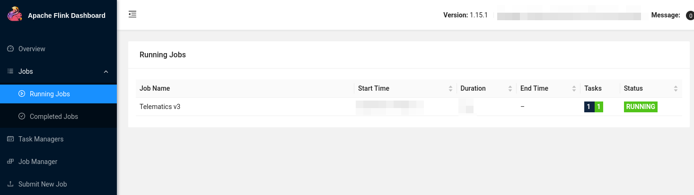
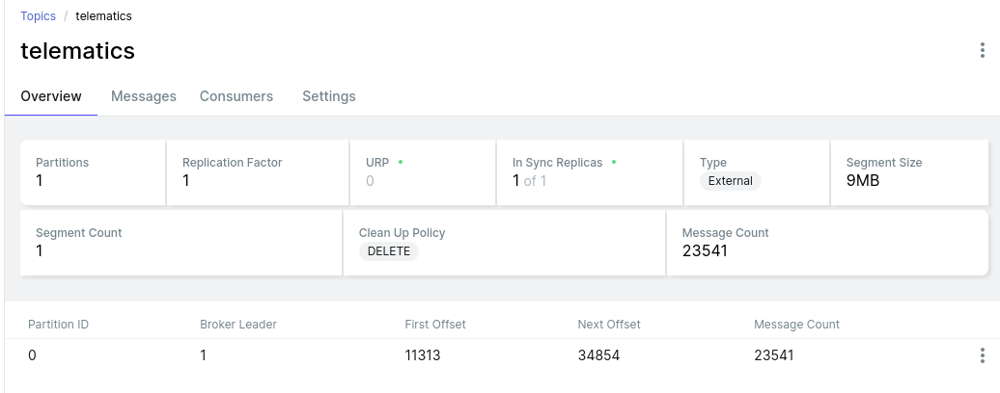
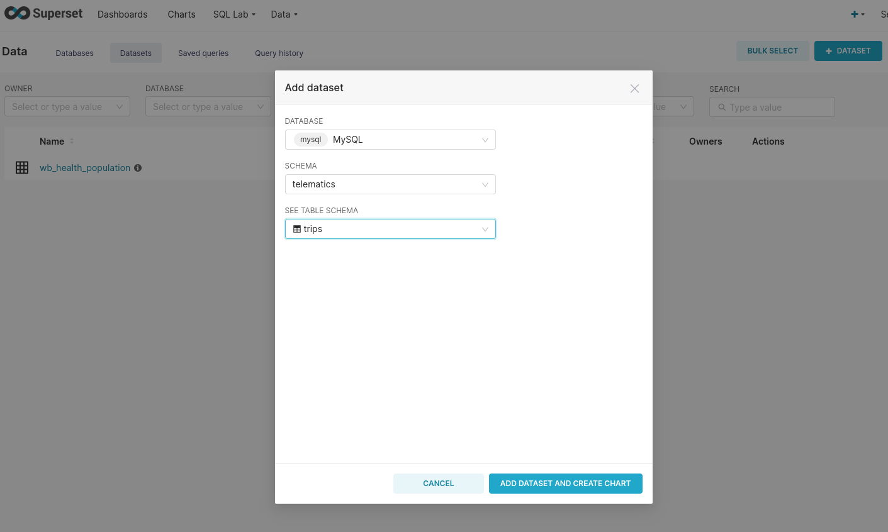

## Introduction

This article talks about building our own `Raspbian` image, reading `gpsd` data,  dealing with issues withing GPS and NMEA, caching everything with `redis`, trying strongly typed domain modeling in `Python` (of all places) and using concepts borrowed from `scala` and `Haskell` to first scaffold function signatures, then building them  (specifically around types and how we can use effects to annotate our scaffolding, even though we don't have an effect framework); on how we can use `scala` with `Flink` and `Kafka` to consume a stream with (more or less) *exactly-once* semantics in a handful of lines, and how we can visualize and analyze GPS data via `Superset`.

In other words, it's a bit of a wild ride and, as I'll be the first to admit, not always the most straightforward.



You *might* be interested in this article if...

- You like `Linux`. This article makes heavy use of it, down to the serial ports.
- You like playing around with `Python` and `Scala` and want to weirdly reason about types in a language that thinks `3*3 is '333'` and where that makes perfect sense, coming from a language where a frameworks' `log.info()` type signature reads `def info(message: => String): F[Unit] `  (because, of course, they are *effectful* and log messages are *functions*. It's a lot of fun and even semi-productive!)
- You think cars are cool and/or have a knack for GPS data everything geospatial (can I interest you in map projections and call out flaws in `EPSG:4326`?)
- You think streaming systems are neat and `Flink` and `Kafka` are interesting
- You think building a system that's designed to cache offline and then turn into a streaming client sounds interesting (you can call that "IoT" if you think it's cool)
- You generally like somewhat low-tech things talking to somewhat high-tech things, in this case going from serial devices that care about baud rates all the way through real-time, persistent streaming systems that can write `Iceberg` data into cool, distributed data lakes, or anything in between

Then carry on!

*All code can be found on [GitHub](https://github.com/chollinger93/TinyTelematics/).*

## Structure
Since this article is pretty long, here's whats going to happen. Feel free to skip sections, I think most things can stand on their own.

1. We'll talk [architecture](#the-plan). Systems Design!
2. Building a custom `Linux` image: A [deep dive](#building-a-custom-raspbianlinux-image) on how to do it and why you should bother
3. Then, setting up a lot of [infrastructure](#setup-up-a-backend): `Flink`, `Kafka`, `mariaDB`, mostly via `Docker`
4. Next, we'll design the [client](#the-client-collecting-data--caching-it) by reasoning about types in `Python` 
5. And we'll talk about [implementation](#implementation-python-yay) details, also `Python` 
6. Then, we'll build a [streaming pipeline](#building-a-streaming-pipeline) in `Flink`: Fun times in `scala`! Additional guests: `newtype`, `circe`, and others!
7. All is put together, let's go on the [road](#road-test): Real-life testing
8. Data [visualization](#visualize-data): Using `Apache Superset` to build cool maps
9. [Conclusion](#conclusion) & Lessons learned

## Telematics (once again)

I wrote about the topic [before](blog/2019/08/how-i-built-a-tiny-real-time-telematics-application-on-aws/) (twice, [actually](blog/2017/03/tiny-telematics-with-spark-and-zeppelin/)). Telematics just means "creepily tracking your every move while you operate your vehicle (and maybe plug into your OBD port).

Now, the thing is: I mostly drive a 2021 RAM 1500 Truck. RAM already offers what they call "RAM Telematics™":

> Ram Telematics™ is a web-based fleet management solution designed to  help you monitor your entire business with real-time data and insights.  Talk to your local dealer to learn how Ram Telematics helps business  owners and managers with fleets of all sizes improve day-to-day  operational efficiency.
>
> https://www.ramtrucks.com/telematics.html

It is, however, *also* not available for me, a mere plebeian who uses his truck to haul dirt and mulch and go up mountain roads, because 4x4s are fun.

Sure - you can get [hum](https://www.hum.com/), but that'll run you $99 retail, a $35 activation fee *and* it's $15/mo. Also, I really don't want anybody to have all my (real-time!) location data, and the more I think about it, the less do I need this to be actually real time.

But it *is* cool to see where you're going and data mine all that data, and it's even cooler if you can do it without giving all your data away for free to Google Maps. 

So why don't I do what I do best and overengineer something myself?

## The Plan

In the last iteration, everything was done via `AWS` - this was a fun project to play around with AWS IoT [Greengrass](https://aws.amazon.com/greengrass/) and the like, but the solution ultimately ran on somebody else's computer ("the cloud") and the client application ran on my full-size System76 laptop, which isn't exactly portable. 

Also, [this](https://news.ycombinator.com/item?id=32475298) just happened. Also this:



The [first](blog/2017/03/tiny-telematics-with-spark-and-zeppelin/) iteration in 2017 used Hadoop and an app to collect the data.

So, this time, we'll do it differently - we'll do it offline and *completely* "in-house". Which is ironic, given the topic, but I was told not to make too many stupid puns.

### A (simple) cached, offline architecture

What made the previous iterations somewhat complicated (as they were mostly intended as a tech showcase) was their dependency on the internet and third party tools. While fun to play around with, not super usable. 

This topic is actually something I'm somewhat passionate about - I have a thing for maps, geospatial data, zoning, geography (...), both in real-life as well as on a theoretical level. In fact, I've recently amused a bunch of people greatly by saying 

>  "Oh, that's like 2 Walmarts!" 

(~20 acres or 8 hectares, since I previously looked up the local Wally World on the county's GIS map), which was dubbed as something along the lines of *"the most American unit of measurement"*. Anyways....

So, we'll keep it simple this time around and focus on the following architecture:


We'll go through the details, but it boils down to the following principles:

1. Use `gpsd` to get geo data from a physical USB GPS dongle
2. Work offline by default. Cache all your data if there's no internet available
3. If you can (i.e., are online), publish all your data to a streaming pipeline via `Kafka`
4. Said pipeline persists the data 

#### 1. Collect data via GPS

A Raspberry Pi Zero (the original one, that is - `armv6` and all) collects GPS data via a USB OTG dongle. The code for that is trivial - here's the [entirety](https://github.com/chollinger93/TinyTelematics/blob/aws/lambda/telematics-input/lambda_function.py#L32) of it from last time around:

```python
def poll_gps(_gpsd, batch=128):
    print('Starting GPS poll, batch: {}'.format(batch))
    data = []
    i = 0
    while True:
        report = _gpsd.next()
        # TPV - Time Position Velocity
        if report['class'] == 'TPV':
            # Get data
            lat = getattr(report, 'lat', 0.0)
            long = getattr(report, 'lon', 0.0)
            time = getattr(report, 'time', '')
            altitude = getattr(report, 'alt', 'nan')
            speed = getattr(report, 'speed', 'nan')
            record = Record(lat, long, altitude, time, speed)
            data.append(json.dumps(record.__dict__))
            if i >= batch:
                push_to_iot_core(data)
                data = []
                i = 0
            else:
                i += 1
```

(We'll soon learn how the devil's in the details with this snippet)

#### 2. Cache data

Now, instead of calling something like `push_to_iot_core`, we'll have a different control structure:  In case we are offline (the default), push data into `redis`. Without wanting to go into too much implementation detail, this is a matter of having a tiny client that calls `RPUSH` occasionally. 

`redis` can run with a very minimal memory and CPU footprint. Given the nature of data we're collecting, we can set lax data persistence expectations. It also has native ARM support.

#### 3. Send data if you can

However, once have a connection to a pre-determined WiFi network, we'll grab all data from our local cache and push it to an `Apache Kafka` instance which can serve as a message broker. In fairness, we could use any type of message broker or `REST` endpoint here - but `Kafka` plays nicely with others.

#### 4. Process data

From Kafka, we'll use [Apache Flink](https://flink.apache.org/) to consume data. The resulting data can be written to Apache Iceberg or any other format (see [here](blog/2021/12/building-a-data-lake-with-spark-and-iceberg-at-home-to-over-complicate-shopping-for-a-house/)).

***Note**: In this article, we'll write to a `MariaDB` SQL database instead of `Iceberg` + `Trino`, because there is enough infrastructure and complexity to deal with as-is. Iceberg is a fascinating piece of tech and I've played [around](http://localhost:1313/) with it before, but this article is already pretty long. Also, `MariaDB` can do spatial functions, which will come in handy later on.* 

#### 5. Visualization

At the end, we'll use `Apache Superset` to visualize the data:




#### Other assumptions & language choice

Since we're running on a low-powered SBC, we'll be single-threaded and block on each IO operation. This makes fulfilling the contract (see below) very easy.

Since we'll be on a small Raspberry Pi Zero, we'll also assume power saving is relevant and that it should auto-terminate if not in use (see below).

With regards to **languages**, we'll use `Python` for the client (because we have code we can re-use - see above) and `Scala` for the `Flink` app, because `Scala` is fun and I feel like it.  ¯\\_(ツ)_/¯ 

### An equally simple contract & model

We need 2 things for a decent design for our client (the starting point) here: A *contract* (What can the client guarantee and what can downstream plan for?) and a *model*, i.e. what we're trying to produce. I'd love to introduce a metadata layer and schema registry here, but I'll refrain from doing so.

#### Contract

The contract can be simple, but must be as follows:

- We do **not** guarantee exactly-once delivery (we can send duplicates)
- We **do** guarantee at-least once delivery (we won't drop messages)
- We **do** guarantee order

The latter is easy to realize, since we have distinct, autonomous, single-threaded clients that block on each `IO` interaction. "Not exactly-once, but at-least once" is also an equally simple pattern, as this simply means "if it fails, just do it again".

#### Model

I'll steal the model from last time, with minor adjustments:

```python
@dataclass
class GpsRecord:
    tripId: int # on arm64/x86, 64 bit; otherwise, 32
    lat: float # for SQL, a high-precision DECIMAL!
    lon: float
    altitude: float
    speed: float
    timestamp: int = int(time.time() * 1000) # just because timestamps are a pain
    userId: int = uuid.getnode()
```

Simple, but does what we need it to do for now. 

***Note**: This is not a good model that would support multi-user use cases - it lacks good primary keys, partitions, even more attributes (`nmea` data is rich), but good enough to support a handful of users that drive different trips in different vehicles.*

The `userId` is based on the hardware address as a 48-bit positive integer, which is a naive approach that'll work for now. 

The `tripId` is a random `32bit integer` on a Raspberry Pi Zero, and a random `64bit` long on systems that support it. This works well enough to uniquely identify a trip, since our entire process terminates every time it believes a trip to be over and hence, generates a new UUID upon restarting.

Realistically, with a 32bit length, we'd need to do collision checks in the streaming pipeline.

## Building a custom Raspbian/Linux image

Now that we have the design out of the way, let's consider our execution environment. It's somewhat important to understand where our code will run.

### Power Savings: Car Batteries are weird

Now, my truck comes with two 400W regular 115V power outlets and a 12V outlet with a 20Ah fuse (240Wh max), plus USB A and C ports - that is ample power to power a full size laptop (and I've done it before). So a Raspberry Pi should be a trivial thing to operate.

However, assuming a car battery for an older vehicle, say a 1998 Chevy Lumina with the 3.8L V6 (a more appropriate vehicle to jam random electronics into), would probably have a capacity of 600 or so Wh (12V at 45Ah), which of course isn't exactly what a car battery is designed for (they are designed to output short bursts of extremely high current and are usually specified via "Cold Cranking Amps", a delightfully obscure unit of measurement defining the sustained Amps a 12V battery can deliver at 0F for 30 seconds, but that doesn't matter).

Suppose, now, that our Raspberry Pi Zero W with a dongle pulls in 1A (which is high, but its rated for up to 2.5A). Assume 50% efficiency from a cheap PSU/voltage converter (since the Pi takes 5V), so we really need 2A. So the little Pi could, theoretically, drain a car battery after 300 hours, or **5 days** on 24hr power draw. I certainly have not moved my vehicle for 5 days at a time (think vacation), so that is a surprising amount. Somebody check my math here, because I was expecting to write a bit about how it would last 6 months and that we need to still prepare for no good reason whatsoever. 

### Measuring & Reducing Power Draw

Now, originally, I built this *extremely* cursed measuring apparatus:



Which, while it works (iTs nOt fUseD yadda yadda, nobody cares), is not necessarily precise (even though this board had, if I recall correctly, WiFi enabled and ran some `python` garbage, so 120mA seems about right). I wager to guess that the redneck-engineering nature of it added an ohm or two of resistance. 

*Anyways*, fortunately for us, smart people with good equipment have already done all this work for us: Raspi.tv did some [benchmarking](http://raspi.tv/2017/how-much-power-does-pi-zero-w-use) and various other folks around the web ran tests (like [this](https://blues.io/blog/tips-tricks-optimizing-raspberry-pi-power/) or [that](https://www.jeffgeerling.com/blogs/jeff-geerling/raspberry-pi-zero-conserve-energy)) around disabling things.

- A standard, idling Zero W runs at about 120mA
- Disabling HDMI, LEDs, and minimizing background tasks (i.e., aiming for low utilization) is worth about 40mA (even though others report more, which I find... unlikely)

While 120mA doesn't exactly sound like it'll drain a full size truck's battery any time soon, it's still a good idea to at least consider bloat and power draw.

### Reproducible Builds & Speed

One way to save power - and to make reproducible builds - is to build our own Linux image.

You can do all of what follows on the Raspberry, but especially things like compiling `redis` tend to be a *whole lot* faster and easier on a full-powered `GNU/Linux` computer. 

> Speed has never killed anyone. Suddenly becoming stationary, that's what gets you.
>
> \- Jeremy Clarkson

It also allows you to keep and re-deploy the `img` file onto different machines. I tend not to do this, but every time I come back to a project, setting up an environment becomes a nightmare - but not if you keep an image file around! 

It's essentially what you did before `Docker` to make your builds work every time! [1]

So: Reproducible Environment + Speed = Great Success.

*[1]  For the love of god, do not take this seriously. It is, however, a decent idea to at least consider for a decent dev cycle - a more honest comparison is to build your own `Docker` **base** image.*

### Building a small image

Let's do it. Your mileage may vary based on architecture and base image.

#### Getting Started

To poke around, we can download a `Raspbian Lite` [image](https://www.raspberrypi.com/software/operating-systems/) and mount it, keeping in mind that we have 2 partitions available. 

In other words, you need to tell your tools where to start reading data. It's like plugging in a USB thumb drive... but with math involved. Isn't that *fun*?

```bash
❯ unxz 2022-04-04-raspios-bullseye-armhf-lite.img.xz
❯ fdisk -u -l 2022-04-04-raspios-bullseye-armhf-lite.img
Disk 2022-04-04-raspios-bullseye-armhf-lite.img: 1.88 GiB, 2017460224 bytes, 3940352 sectors
Units: sectors of 1 * 512 = 512 bytes
Sector size (logical/physical): 512 bytes / 512 bytes
I/O size (minimum/optimal): 512 bytes / 512 bytes
Disklabel type: dos
Disk identifier: 0x7d5a2870

Device                                      Boot  Start     End Sectors  Size Id Type
2022-04-04-raspios-bullseye-armhf-lite.img1        8192  532479  524288  256M  c W95 FAT32 (LBA)
2022-04-04-raspios-bullseye-armhf-lite.img2      532480 3940351 3407872  1.6G 83 Linux

❯ mkdir -p /mnt/raspi
# 532480 * 512 = 272629760
❯ sudo mount -o loop,offset=272629760 2022-04-04-raspios-bullseye-armhf-lite.img /mnt/raspi
```

There are some tools that do this for you, but all you really need is `mount` (and maybe a calculator to figure out the offset in bytes). See `mount`'s [man page](https://man7.org/linux/man-pages/man8/mount.8.html#LOOP-DEVICE_SUPPORT) for details.

>  This type of mount knows about three options, namely `loop`, `offset` and `sizelimit`, that are really options to [losetup](https://man7.org/linux/man-pages/man8/losetup.8.html)(8). (These options can be used in addition to those specific to the filesystem type.)
>
> https://man7.org/linux/man-pages/man8/mount.8.html#LOOP-DEVICE_SUPPORT

#### Resizing

Since the default image file is small, let's make it a big bigger so we have space to work with, by first resizing the image file, then the partition.

```bash
# Cutting the branch you're sitting on and all that
❯ sudo umount /mnt/raspi
# Resize the img file
❯ qemu-img resize ./2022-04-04-raspios-bullseye-armhf-lite.img 4G
# Resize the partition
❯ sudo parted ./2022-04-04-raspios-bullseye-armhf-lite.img
GNU Parted 3.4
Using /home/christian/Downloads/raspi/2022-04-04-raspios-bullseye-armhf-lite.img
Welcome to GNU Parted! Type 'help' to view a list of commands.
(parted) print                                                            
Model:  (file)
Disk /home/christian/Downloads/raspi/2022-04-04-raspios-bullseye-armhf-lite.img: 4295MB
Sector size (logical/physical): 512B/512B
Partition Table: msdos
Disk Flags: 

Number  Start   End     Size    Type     File system  Flags
 1      4194kB  273MB   268MB   primary  fat32        lba
 2      273MB   2017MB  1745MB  primary  ext4

(parted) resizepart                                                       
Partition number? 2                                                       
End?  [2017MB]? 4295MB                                                    
(parted) print                                                            
Model:  (file)
Disk /home/christian/Downloads/raspi/2022-04-04-raspios-bullseye-armhf-lite.img: 4295MB
Sector size (logical/physical): 512B/512B
Partition Table: msdos
Disk Flags: 

Number  Start   End     Size    Type     File system  Flags
 1      4194kB  273MB   268MB   primary  fat32        lba
 2      273MB   4295MB  4022MB  primary  ext4

(parted)  
# exit & resize2fs & persist
❯ sudo udisksctl loop-setup -f 2022-04-04-raspios-bullseye-armhf-lite.img
❯ lsblk
NAME            MAJ:MIN RM   SIZE RO TYPE  MOUNTPOINTS
loop0             7:0    0     4G  0 loop  
├─loop0p1       259:7    0   256M  0 part  
└─loop0p2       259:8    0   3.7G  0 part  
❯ sudo e2fsck -f /dev/loop0p2
❯ sudo resize2fs /dev/loop0p2
# Unmount everything, mount again
❯ sudo losetup -D
❯ sudo mount -o loop,offset=272629760 2022-04-04-raspios-bullseye-armhf-lite.img /mnt/raspi
```

#### chroot & setup

We can now `chroot` into this - or use `systemd-nspawn` to avoid having to manually mount `/proc` and the like (which you can). You'll probably need `qemu` for the (presumably) x86 -> ARM emulation. On a side note, I'd be curious to see how an M1 Mac handles this. 

```bash
sudo apt-get install systemd-container qemu qemu-user-static binfmt-support qemu-utils
# root@raspi:~#
# root@raspi:~# df -hT
# Filesystem            Type   Size  Used Avail Use% Mounted on
# /dev/loop0            ext4   3.7G  1.2G  2.3G  35% /
```

And now we can set this up just the way we like it - in this case, installing some dependencies ahead of time and disabling some stuff.

We'll start by setting up some basic dependencies and the user:

```bash
raspi-config # disable I2C, SPI
echo 'hdmi_blanking=1' > /boot/config.txt # disable HDMI

# We need this for the GPS dongle
apt update
apt-get install gpsd gpsd-tools gpsd-clients ntp -y
# And for Python
apt-get install python3-distutils python3-apt git vim libffi-dev -y
# Set up the telematics user with it
useradd telematics 
passwd telematics
usermod -aG sudo telematics
sudo mkdir /home/telematics && sudo chown telematics:telematics /home/telematics 
su telematics && cd ~
```

Followed by the `Python` environment - keep in mind that `pyenv` builds from source, and that `Python` is really mostly `C`.

```bash
# Install poetry
curl -sSL https://raw.githubusercontent.com/python-poetry/poetry/master/get-poetry.py | python -
echo 'PATH=$PATH:$HOME/.poetry/bin' >> /home/telematics/.bashrc
# Install an appropriate python version
curl https://pyenv.run | bash
echo 'export PYENV_ROOT="$HOME/.pyenv"' >> /home/telematics/.bashrc
echo 'command -v pyenv >/dev/null || export PATH="$PYENV_ROOT/bin:$PATH"' >> /home/telematics/.bashrc
echo 'eval "$(pyenv init -)"' >> /home/telematics/.bashrc
source /home/telematics/.bashrc
# To build python
apt-get install make build-essential libssl-dev zlib1g-dev libbz2-dev libreadline-dev libsqlite3-dev wget curl llvm libncursesw5-dev xz-utils tk-dev libxml2-dev libxmlsec1-dev libffi-dev liblzma-dev -y
# And install
pyenv install 3.8.13
# Alternatively
sudo add-apt-repository ppa:deadsnakes/ppa
sudo apt-get update
sudo apt-get install python3.8 -y
```

We'll then install the application (more on that in a minute). Depending on whether it's an original Raspberry Pi Zero (W), we might need to use a `systemd` service. Otherwise, `Docker` would work well. We'll come back to that. We'll also build `redis` and enable a service for that.

```bash
# Install the application + all dependencies
git clone https://github.com/chollinger93/TinyTelematics.git && cd TinyTelematics
poetry env use ~/.pyenv/versions/3.8.13/bin/python3
poetry shell
pip3 install --upgrade pip
poetry install
poetry build
# Set up a service (if we're not running via docker, see below)
sudo cp system/tiny-telematics.service /etc/systemd/system
sudo systemctl enable /etc/systemd/system/tiny-telematics.service
# Back to root
exit

# Build / install redis
VERSION="7.0.4"
mkdir /etc/redis/
wget https://github.com/redis/redis/archive/${VERSION}.tar.gz -O  /etc/redis/redis-${VERSION}.tar.gz
cd /etc/redis
tar xzf redis-${VERSION}.tar.gz && rm redis-${VERSION}.tar.gz 
cd redis-${VERSION}
make
ln -s /etc/redis/redis-7.0.4/ /etc/redis/latest
mkdir /etc/redis/latest/bin
mv /etc/redis/latest/src/redis-server /etc/redis/latest/bin/
echo 'export PATH=$PATH:/etc/redis/latest/bin' >> /home/telematics/.bashrc

# And set up a systemd service
cat <<EOT >> /etc/systemd/system/redis.service
[Unit]
Description=Redis
After=syslog.target

[Service]
ExecStart=/etc/redis/latest/bin/redis-server /etc/redis/latest/redis.conf
RestartSec=5s
Restart=on-success

[Install]
WantedBy=multi-user.target
EOT
systemctl enable /etc/systemd/system/redis.service

# Install docker
# See armv6 woes: https://markmcgookin.com/2019/08/04/how-to-install-docker-on-a-raspberry-pi-zero-w-running-raspbian-buster/
sudo curl -sL get.docker.com | bash

# use apt to remove packages, add your wpa_supplicant.conf, change configs, replace existing tools with more lightweight options - do whatever
# for me, I've edited /etc/resolv.conf for my custom DNS server and /etc/hostname + /etc/hosts
```

And there you go, your very own Raspbian distribution! 

#### Flash to an SD card

Use the [imager](https://www.raspberrypi.com/software/) tool to flash it to an SD card & make sure you customize your WiFi settings.


*Fun fact: On `PopOS!` with an NVidia GPU **not** running in hybrid mode with the IGPU, this tool crashes and I have no idea why, but I assume GTK explodes somehow.*

### A note on the usefulness of building an image

There are many other ways of doing this - [DietPi](https://dietpi.com/) comes to mind - and the benefits for this particular application in terms of power saving are dubious at best. It is, however, a good exercise to know how to do it, and, perhaps more importantly, makes this process much easier to test and reproduce builds, something that always tends to be a nightmare with Raspberry or embedded builds.

One thing I will say - doing it like this shaves hours off compilation time, e.g. when `pyenv install` compiles `CPython` from scratch. Especially when working with multiple small computers, not having to write a script and run it for ages is *very* valuable. 

What I would do differently, however, is to also compiled `gpsd` at this step, but that's a bit of a tall order.

We'll call out how to use `docker` later to bundle dependencies and build multi-arch images, but that'll only work for `armv7` and `arm64` architectures. I've personally had to use bare metal with `systemd`. I do not particularly like `systemd`.

## Setup up a Backend

Anyways - now that we have a good execution environment in the frontend, we can do the same for the backend - i.e., the `Kafka` cluster and storage. This is where things go from "low level stuff" to "pretend a `Docker` container can abstract the complexities of distributed systems away". I'm still very grateful for it, having set up multiple bare-metal `Hadoop` environments in my time. This *is* easier for protoyping and at-home use.

### Kafka & Negotiating brokers

Since we don't need a large, fancy cluster & the server isn't reachable from the internet anyways (i.e., we don't need auth), we can get away with the following on your server. 

```bash
# Add your user - we did this in the image earlier, but you might want this locally too
sudo useradd -m -g users -G docker telematics
sudo passwd telematics
sudo su - telematics
# Take the default docker-compose.yaml (see below)
vim docker-compose.yaml
# Start it
docker-compose up -d
# Start a topic
docker exec broker \
kafka-topics --bootstrap-server broker:9092 \
             --create \
             --topic telematics
```

This is also how I run `Kafka` locally at work (just via `podman`) - it's *fantastic* to have on your laptop if you're a heavy `Kafka` user.

For the `docker-compose.yaml`, see https://developer.confluent.io/quickstart/kafka-docker/ 

```yaml
---
version: '3'
services:
  zookeeper:
    image: confluentinc/cp-zookeeper:7.0.1
    container_name: zookeeper
    environment:
      ZOOKEEPER_CLIENT_PORT: 2181
      ZOOKEEPER_TICK_TIME: 2000

  broker:
    image: confluentinc/cp-kafka:7.0.1
    container_name: broker
    ports:
    # To learn about configuring Kafka for access across networks see
    # https://www.confluent.io/blog/kafka-client-cannot-connect-to-broker-on-aws-on-docker-etc/
      - "9092:9092"
      - "19092:19092"
    depends_on:
      - zookeeper
    environment:
      KAFKA_BROKER_ID: 1
      KAFKA_ZOOKEEPER_CONNECT: 'zookeeper:2181'
      KAFKA_LISTENER_SECURITY_PROTOCOL_MAP: PLAINTEXT:PLAINTEXT,PLAINTEXT_INTERNAL:PLAINTEXT,EXTERNAL_DIFFERENT_HOST:PLAINTEXT
      KAFKA_ADVERTISED_LISTENERS: PLAINTEXT://localhost:9092,PLAINTEXT_INTERNAL://broker:29092,EXTERNAL_DIFFERENT_HOST://bigiron.lan:19092
      KAFKA_OFFSETS_TOPIC_REPLICATION_FACTOR: 1
      KAFKA_TRANSACTION_STATE_LOG_MIN_ISR: 1
      KAFKA_TRANSACTION_STATE_LOG_REPLICATION_FACTOR: 1
```

Please note the inclusion of `EXTERNAL_DIFFERENT_HOST` to ensure the initial Kafka broker (`bigiron.lan:9092`) returns the correct address for the client to connect to. See [here](https://www.confluent.io/blog/kafka-client-cannot-connect-to-broker-on-aws-on-docker-etc/) for an explanation. If you don't see this, the next step will yield something along the lines of:

```bash
 WARN [Producer clientId=console-producer] Connection to node 1 (localhost/127.0.0.1:9092) could not be established. Broker may not be available. (org.apache.kafka.clients.NetworkClient)

```

As `bigiron.lan:9092` tells us "hey, talk to `localhost:9092`", which of course, isn't the correct machine. `bigiron.lan`, of course, is curtesy of my DNS resolver knowing about [`bigiron`](blog/2019/04/building-a-home-server/)'s IP.



Anyways, we can test this from our RasPi or laptop via:

```bash
# Download & install
sudo mkdir -p /opt/kafka && cd /opt/kafka
sudo wget https://downloads.apache.org/kafka/3.2.1/kafka-3.2.1-src.tgz
sudo tar -xzf kafka-3.2.1-src.tgz
sudo ln -s /opt/kafka/kafka-3.2.1-src /opt/kafka/latest
sudo /opt/kafka/latest/gradlew jar -PscalaVersion=2.13.6

# bigiron.lan is https://chollinger.com/blog/2019/04/building-a-home-server/
/opt/kafka/latest/bin/kafka-console-producer.sh --bootstrap-server bigiron.lan:19092 \
                       --topic telematics
> test
```

You can do this via `docker` as well, I think. I just chose not to - I like my `cli` tools be `cli` tools and the services to be services (i.e., containers nowadays). I've run Linux servers for well over a decade and `docker` has been a godssent for services.

Anyhow, to make sure it works:

```bash
telematics@bigiron:~$ docker exec --interactive --tty broker \
kafka-console-consumer --bootstrap-server broker:9092 \
                       --topic telematics \
                       --from-beginning
test
```

Wonderful!

As much as I like simple `docker` deploys, I'm sure we can all agree that this is not the way you'd deploy this in production @ work... but the server in my basement is also not exactly a data center.

### Storage & DDL

Originally, I wanted to use `Apache Iceberg` for this part, but we'll stick to a standard `MariaDB` instance for now. You can grab a copy [here](https://hub.docker.com/_/mariadb).

Our table definition looks like this:

```sql
CREATE TABLE telematics.trips (
    `id` BIGINT NOT NULL AUTO_INCREMENT,
	`tripId` BIGINT NOT NULL,
	`userId` BIGINT NOT NULL,
     -- DOUBLE in MySql lacks the precision for geospatial data!
	`lat` DECIMAL(11,8),
	`lon` DECIMAL(11,8),
	`altitude` DOUBLE,
	`speed` DOUBLE,
	`ts` TIMESTAMP NOT NULL,
	`updated_at` TIMESTAMP NOT NULL,
	PRIMARY KEY(id)
);
```

Which is simply the model translated into `sql`.  

### Types!

Note the type for `lat` and `lon` as `DECIMAL`. Most people are familiar with very strict types in `sql`, but somehow not in e.g. `Python`. We'll get back to that momentarily. For this example, consider the following:

`34.42127702575059, -84.11905647651372` is Downtown **Dawson**ville, GA. `(34.4, -84.1)`  is 2.2 miles away, `(34.0, -84.0)` is 40 miles away in **Lawrence**ville, GA. That's `DECIMAL(11,8)` vs `DOUBLE` vs `FLOAT` in `MariaDB` (the latter, more or less, but it drives home a point).


Keep in mind:

| decimal places | degrees    | distance |
| -------------- | ---------- | -------- |
| 0              | 1.0        | 111 km   |
| 1              | 0.1        | 11.1 km  |
| 2              | 0.01       | 1.11 km  |
| 3              | 0.001      | 111 m    |
| 4              | 0.0001     | 11.1 m   |
| 5              | 0.00001    | 1.11 m   |
| 6              | 0.000001   | 0.111 m  |
| 7              | 0.0000001  | 1.11 cm  |
| 8              | 0.00000001 | 1.11 mm  |

*Source: http://wiki.gis.com/wiki/index.php/Decimal_degrees*

I know most people are familiar - but it is worth pointing out early in the process.

## The Client: Collecting Data & Caching it

With the server now being able to listen to messages (even though we have nothing to route them with), let's put together the client ~~real quick~~. For this, we can re-use some old [code](https://github.com/chollinger93/TinyTelematics/blob/aws/lambda/telematics-input/lambda_function.py). I'm keeping this nice and simple, rather than trying to build anything fancy.

### Setup

First, we'll use [`poetry`](https://python-poetry.org/docs/) this time around to make the environment a bit easier to handle. I cannot express how much I love `poetry`.

Install it:

```bash
curl -sSL https://raw.githubusercontent.com/python-poetry/poetry/master/get-poetry.py | python3 -
```

And create a new project:

```bash
poetry new tiny-telematics
mv tiny-telematics/tests tiny-telematics/tiny_telematics tiny-telematics/*toml .
```

From there on, we can use neat things such as `poetry add` to add dependencies that grab proper versions. It's like `sbt` or `maven` or even `gem`, but for `Python`! It's incredible!

All in all, `poetry` makes a *lot* of things I despise about `Python` - project setup, virtual environments, dependency management, endless scripts - much, much easier. Big fan.

### Scaffolding by means of reasoning about types

Okay, environment down. Let's talk code.

Taking a page from my `scala` [experiments](blog/2022/06/functional-programming-concepts-i-actually-like-a-bit-of-praise-for-scala-for-once/), let's not overthink this and just sketch out a handful of method signatures and approach this mostly procedurally (rather than really *functional*, since we're doing nothing to avoid effects).

***Note**: This is a real thing I do in every language that's forced upon me - `python`, `scala`, `Java`, `go`, `Ruby`, `TypeScript` - I plan out functions and their types before anything else, and accept the fact that I'm often wrong and change things. In fact, what you see here isn't a 100% match to what's on GitHub. But it is how I work, and I've recently added the whole "effectful" thing to that methodology, as called out in the linked article.*

I'll be writing this as if we had an `IO` monad and a `Resource`, just to *call out* side effects, but I won't reason about any other algebras or higher-kinded types. Think of it as documentation. The official `Python` docs are open about the languages shortcomings (for once):

> Python programs written in functional style usually won’t go to the extreme of avoiding all I/O or all assignments; instead, they’ll provide a functional-appearing interface but will use non-functional features internally. For example, the implementation of a function will still use assignments to local variables, but won’t modify global variables or have other side effects.
>
> https://docs.python.org/3/howto/functional.html

I am, however, curious if people have made attempts at more formal implementations of typing effectful computations. If anyone knows more (I didn't find anything), please shoot me a message!

For the record, I'll also refrain from complex abstractions - such as a generic / abstract class (or typeclasses) for the cache. I'm just going to assume that your production code should look closer to this:

```scala
def cache[F[_] : Cache, K, V]: Resource[F, K, V]
```

Than that:

```scala
def RedisCache(): Resource[RedisClient[String,String]]
def InMemoryCache(): Resource[RefMap[String,String]]
```

But what we'll do here is closer to the latter, since there's a lot to get done.

An for the record, in `scala`, we *would* do all those things and would start by modeling the logic by means of small algebras as an abstract concept before all that:

> Now it is time to get to work, as we apply these techniques to our business domain.
> A common way to get a feature design started is to decompose business requirements into small, self-contained algebras.
>
> Volpe, Gabriel: Practical FP in Scala

For instance - 

```scala
trait Cache[F[_], K, V] {
    def get(k: K): F[V]
    def set(k: K, v: V): F[Unit]
    // ...
}
```

 Do as I say, not as I do, you know the drill.

#### A nice UML diagram

In a very procedural fashion, this simple process lends itself to create an UML diagram first, since we know the rough steps:


A handful of things to call out here:

- We should batch everything that we can. Remember our guarantees - they're very lax, but they are **guarantees**!
- We should shut ourselves down if there was no movement for N minutes - so assume the car is parked at home (which we can determine by checking the WiFi connection)

Let's sketch the signatures:

#### We need to capture GPS data

Straightforward: Talk to the GPS receiver, get data back. Has effects, since we might not be able to talk to it. Make sure it has the `trip_id`, so we know what trip we're talking about.

```python
def poll_gps(gps_client: Resource[GpsRecord], trip_id: int) -> IO[GpsData]
```

***Note**: If you're familiar with `gpsd`, you'll realize that this has a flaw: The `gps_client` really is a `gps_session` and behaves as a mutable wrapper around the most recent `nmea` buffer and should **not** be passed around. The final version looks quite different, but we'll talk about this further down.*

#### We need to store data into `redis`

Really just a wrapper (or a weak abstraction) around the `redis` [library](https://github.com/redis/redis-py) calls. The input shouldn't be empty.

```python
def write_cache(client: Resource[Redis], records: NonEmptyList[GpsRecord]) -> IO[Unit]
```

#### We need to read from `redis` 

Same for reading the cache. Here, we can make this a generator as well, since we'll most likely immediately push this to `Kafka.`

```python
def read_cache(client: Resource[Redis]) -> Generator[GpsRecord]
```

#### We need to push to `Kafka`

Which is another library wrapper.

```python
def publish_data(client: Resource[Kafka], record: GpsRecord) -> IO[Unit]
```

#### We need to determine when to read & publish

Since we can only publish once we have network connection, this can be a simple boolean test.

```python
def is_network_available(expected_network: str) -> IO[bool]
```

#### We need to determine whether movement has happened

This can be 2 neat functions:

```python
def calculate_distance_in_m(x, y: GpsData) -> float
def movement_has_changed_during_observation(records: List[GpsRecord], threshold_m: float) -> bool: 
```

There's many ways of doing this, but since we've already established we'll buffer data before writing to `redis`, we can simply:

1. Calculate a simple distance (Pythagorean) between two points (or use a more complex function that "accurately" reflects distance on ~~a~~ not-quite-a sphere, such as a Haversine or Vincenty distance)
2. Do this for each record in the buffer; if the mean of these points exceeds the threshold (a movement of >0m, calibrated to the precision of the GPS device), return `true`, otherwise, assume we're moving

This simple approach of course requires us to keep a buffer that has enough points to make an informed decision. If we don't want to do that, we can simply keep a rolling average in a ring buffer (or, in `Python`, a double-ended queue, which can be bondend and has wonderful performance KPIs). Either way, the method signature does not care and simply expects a correct list that models the observation window.

## Implementation: `Python`, yay!

I'm not going to call out everything here, but some interesting highlights:

### Scaffolding allows you to write your main logic without thinking about it

What I mean by that: Once we have all these method signatures drafted (and ideally, annotated with comments), we can write the `main` function without having any functionality implemented yet. Note how this is a very naive implementation, without any buffering, retries, or the like -  you'll find that the actual on on `GitHub` is quite a bit different, but keeps the same general structure. Also the concept of `main` methods suck, but I won't get into it - keep it simple, rememeber?

```python
def main(
    gps_client: GpsClient,
    redis_client: RedisClient,
    kafka_producer: KafkaProducer,
    # Those should probably in a config file
    kafka_topic: str,
    expected_network: str,
    buffer_size=10,
    max_no_movement_s=300,
) -> None:
    ring_buffer: deque[GpsRecord] = deque(maxlen=max_no_movement_s)
    _buffer: NonEmptyGpsRecordList = NonEmptyGpsRecordList(item=[])
    for record in poll_gps(gps_client):
        # With or without network, we just collect data
        if len(_buffer) - 1 >= buffer_size:
            # Flush
            write_cache(redis_client, _buffer)
            _buffer = NonEmptyGpsRecordList(item=[])
        # Only store valid records
        if record:
             _buffer.append(record)
             ring_buffer.extend([record])
        # Flush data when you can
        if is_network_available(expected_network):
            for r in read_cache(redis_client):
                publish_data(kafka_producer, kafka_topic, r)
                clear_cache()
            # If we're at a standstill, shut down after N minutes
            if movement_has_changed_during_observation(
                list(ring_buffer), threshold_m=0.1
            ):
                break
        # Collect one record per second
        time.sleep(1)
```

Keep in mind, none of these functions have a body yet.

We could also immediately unit test against this, even though that makes mocking the library classes exceedingly difficult. I unit tested as I went about implementing functionality and wound up with ~90% line coverage at the end of this.

Also, remember the `time.sleep(1)` - it'll show up again in a very fundamental bug at the end of this.

### Types

In `scala`, we'd define custom types for things, so we can a) reason about functions based on their type signature and b) have the compiler yell at us if we break the contract.

Unfortunately, to the best of my knowledge, even something simple like this isn't possible (see [here](https://github.com/python/mypy/issues/3331)) with `mypy` (which is already a superset of the language) in `Python`:

```python
T = TypeVar('T')
NonEmptyList[T] = NewType('NonEmptyList', List[T])
```

However, this is:

```python
T = TypeVar('T')
NonEmptyGpsRecordList = NewType('NonEmptyGpsRecordList', List[GpsRecord])
```

So we'll take what we can get, I guess.

### Finding what WiFi network is available

This is something where we have to rely on the OS to tell us, which doesn't make this very portable. 

```python
def is_network_available(expected_network: str) -> bool:
    try:
        return subprocess.check_output(['iwgetid', '-r']).decode('ascii').replace('\n','') == expected_network
    except Exception:
        return False
```

For instance, once we're offline:

```bash
❯ iwgetid -r
❯ echo $?
255
```

I'd be glad to find out if there's a better way, short of doing something that starts with `if uname == 'darwin'...`.

But sometimes, using `subprocess` isn't the worst thing in the world. Portable software is a lie, anyways.

### Config Parsing via Domain Models

Another case for good models: Configuration files. This:

```python
@dataclass
class GeneralConfig:
    expected_wifi_network: str
    shutdown_timer_s: int = 10
    cache_buffer: int = 10

# ...

@dataclass
class Config:
    general: GeneralConfig
    cache: CacheConfig
    kafka: KafkaConfig
```

Is a very clear model with a clear accessor pattern, default and mandatory values, and a clear hierarchy we can read into from any `dict` via [dacite](https://github.com/konradhalas/dacite). 

No more `try: int(config.get('someSuperSpecificKey', '0'))` ... to parse a config. And barely more coding work to set up, even for a fun weekend/after work project!

### Unit Testing `gpsd` & more type trouble: `Python` `class` vs. `dict` war stories

Another fun example of "typing is cool", the return type of `gps_client.next()` is... well, not specified. However, we know that the actual GPSD protocol is built on top of `json`:

> The GPSD protocol is built on top of JSON, JavaScript Object Notation, as specified in [[RFC-7159\]](https://gpsd.gitlab.io/gpsd/gpsd_json.html#RFC-7159): The JavaScript Object Notation (JSON) Data Interchange Format. Similar to ECMA 404.
>
> ...
>
> Responses are single JSON objects that have a "class" attribute the value of which is the object type . Object types include, but are not limited to: "TPV", "SKY", "DEVICE", and "ERROR".  Objects are sent both in response to commands, and periodically as gpsd sends reports.  Each object is terminated by a carriage return and a new line (CR-NL).
>
> https://gpsd.gitlab.io/gpsd/gpsd_json.html

Which is why we need to check for the `class` attribute of the returned "thing"/`object` and filter out the TPV object (Time Position Velocity), since that is what we need. *However*...

Here's how a "raw" TPV object looks like:

```json
{"class":"TPV","device":"/dev/pts/1",
    "time":"2005-06-08T10:34:48.283Z","ept":0.005,
    "lat":46.498293369,"lon":7.567411672,"alt":1343.127,
    "eph":36.000,"epv":32.321,
    "track":10.3788,"speed":0.091,"climb":-0.085,"mode":3}
```

In standard `python`, you can turn this into an `dict` by pasting it just like that into your REPL. However, the old code I used 3 years ago used `getattr` *and* a subscribtable accessor (`__get_item__(self, item)`):

```python
if report["class"] == "TPV":
	long = getattr(report, "lon", 0.0)
```

Why, you ask? Well, the official [docs](https://gpsd.gitlab.io/gpsd/gpsd-client-example-code.html) access object attributes directly:

```python
 if ((gps.isfinite(session.fix.latitude) and
             gps.isfinite(session.fix.longitude))):
            print(" Lat %.6f Lon %.6f" %
                  (session.fix.latitude, session.fix.longitude))
        else:
            print(" Lat n/a Lon n/a")
```

While other [parts](https://gpsd.gitlab.io/gpsd/client-howto.html#_python_examples) of the official docs pretend it's a `dict`:

```python
    if session.data['class'] == 'DEVICE':
        # Clean up our current connection.
        session.close()
        # Tell gpsd we're ready to receive messages.
        session = gps(mode=WATCH_ENABLE)
    # Do more stuff
```

Now, `getattr` is used for getting named attributes in objects. The neat thing is: It can provide defaults, since many values in the `GPSD` spec are optional. Based on the official docs, `getattr` is the logical conclusion here (and that's why you'll find it in blog posts, of course as usual, without any rhyme or reason, presumably copy-pasted from elsewhere).

It does, however, **not** work on `dicts`:

```python
>>> tpv={"class":"TPV","device":"/dev/pts/1",
...     "time":"2005-06-08T10:34:48.283Z","ept":0.005,
...     "lat":46.498293369,"lon":7.567411672,"alt":1343.127,
...     "eph":36.000,"epv":32.321,
...     "track":10.3788,"speed":0.091,"climb":-0.085,"mode":3}
>>> 
>>> tpv['class']
'TPV'
>>> getattr(tpv, "lon", 0.0)
0.0 
>>> # 0.00 is clearly wrong!
```

At the same time, the same fun combo of accessor methods doesn't work on regular old classes:

```python
>>> from dataclasses import dataclass
>>> @dataclass
... class Example:
...     lon: float 
... 
>>> e = Example(10.0)
>>> getattr(e, 'lon', 0.0) # works
10.0
>>> getattr(e, 'class', None)
>>> e['class'] 
Traceback (most recent call last):
  File "<stdin>", line 1, in <module>
TypeError: 'Example' object is not subscriptable
```

So, how *does* the library do it? Well, they (just like any other, older `Python` package) defines their own `dict` wrapper:

```python
lass dictwrapper(object):
    "Wrapper that yields both class and dictionary behavior,"

    def __init__(self, ddict):
        "Init class dictwrapper"
        self.__dict__ = ddict

# ...

    def __getitem__(self, key):
        "Emulate dictionary, for new-style interface."
        return self.__dict__[key]
# ...
# See https://gitlab.com/gpsd/gpsd/-/blob/release-3.19/gps/client.py#L296
```

Which now of course works with both `getattr` *and* a direct accessor.

Which means... this works just fine:

```python
if report['class'] == 'TPV':
    # Get data
    lat = report.get('lat', 0.0)
    lon = report.get('lon', 0.0)
    altitude = report.get('alt', 0.0)
    speed = report.get('speed', 0.0)
    return GpsRecord(lat, lon, altitude, speed, datetime.now())
```

While this is easy to test once you have unit tests, I actually connected the physical GPS dongle to my laptop and hooked up a debugger before simply changing it to `report.get(field, default)`, like any other `dict`. I just didn't trust what I read after that rollercoaster ride.

You know what would have avoided this? **A type signature!** 


### Version Trouble

The `gps` package *published to `PyPi`* is only compatible with `Python 3.8`, because `3.9` removed the `encoding` keyword in `JSONDecoder`:

```bash
TypeError: JSONDecoder.__init__() got an unexpected keyword argument 'encoding'
```

This can be fixed via

```bash
pyenv install 3.8.13
poetry env use ~/.pyenv/versions/3.8.13/bin/python3
poetry shell
poetry install
```

This is, however, *not* the fault of the maintainers of `gpsd`, see the issue [here](https://gitlab.com/gpsd/gpsd/-/issues/122), since they do not maintain the `pip` project (or any binaries for that matter). If you can, build it from scratch.

### ipv6 loopback needs to be enabled

Please see https://bugs.debian.org/cgi-bin/bugreport.cgi?bug=818332

```bash
sudo sysctl -w net.ipv6.conf.lo.disable_ipv6=0
```

Why? I have no clue. `gpsd` binds to `127.0.0.1:2947`  if I'm not mistaken, but who knows.

### `redis`: The usual sweetheart

A note on `redis`: As usual, it's been just... *pleasant*. *And* well documented. [`lrange`](https://redis.io/commands/lrange/):

> **Available since**: 1.0.0
>
> **Time complexity**: O(S+N) where S is the distance of start offset from HEAD  for small lists, from nearest end (HEAD or TAIL) for large lists; and N  is the number of elements in the specified range.
>
> **ACL categories**: `@read`, `@list`, `@slow`
>
> https://redis.io/commands/lrange/

My code:

```python
def read_cache(client: RedisClient) -> Generator[GpsRecord, None, None]:
    """Reads from the redis cache, returning all records that have been buffered.

    Has side effects!

    Args:
        client (RedisClient): Redis client

    Yields:
        Generator[GpsRecord]: One record at a time, non-empty, non-null
    """
    for r in client.lrange(REDIS_KEY, 0, -1):
        v = jsonpickle.decode(r)
        logger.debug("Decoded %s", r)
        yield v
```

¯\\_(ツ)_/¯

### First Tests

First tests were done at my desk:

```bash
2022-08-01 00:00:00,311 - DEBUG main.py:main():200 - Found network Mynetwork
2022-08-01 00:00:00,312 - DEBUG main.py:publish_data():144 - Publishing record: {"py/object": "__main__.GpsRecord", "lat": 0.0, "lon": 0.0, "altitude": -17.0, "timestamp": null, "speed": 0.0, "id": "0x5f534ad170dd"}
2022-08-01 00:00:00,325 - DEBUG main.py:publish_data():144 - Publishing record: {"py/object": "__main__.GpsRecord", "lat": 0.0, "lon": 0.0, "altitude": -17.0, "timestamp": null, "speed": 0.0, "id": "0x5f534ad170dd"}
2022-08-01 00:00:00,325 - DEBUG main.py:main():211 - No data yet, cannot determine standstill (buffer: 16)
2022-08-01 00:00:00,326 - DEBUG main.py:main():218 - Polling GPS (buffer: 5)
2022-08-01 00:00:00,326 - DEBUG main.py:poll_gps():96 - Point: {"py/object": "__main__.GpsRecord", "lat": 0.0, "lon": 0.0, "altitude": -17.0, "timestamp": {"py/function": "None.datetime.timestamp"}, "speed": 0.0, "id": "0x5f534ad170dd"}
```

The data quality was as expected (note the `null` timestamp, the lack of filters for `0/0` lat/long tuples), but work it does.

`redis` had data, even though as inefficient `string`/`json`:

```bash
127.0.0.1:6379> keys *
1) "buffer"
127.0.0.1:6379> lrange buffer 0 5
1) "{\"py/object\": \"__main__.GpsRecord\", \"lat\": 0.0, \"lon\": 0.0, \"altitude\": -17.0, \"timestamp\": {\"py/function\": \"None.datetime.timestamp\"}, \"speed\": 0.0, \"id\": \"0x5f534ad170dd\"}"
```

And we're getting data via Kafka:

```bash
docker exec --interactive --tty broker \
kafka-console-consumer --bootstrap-server broker:9092 \
                       --topic test \
                       --from-beginning
{"py/object": "__main__.GpsRecord", "lat": 0.0, "lon": 0.0, "altitude": -17.0, "timestamp": null, "speed": 0.0, "id": "0x5f534ad170dd"}
{"py/object": "__main__.GpsRecord", "lat": 0.0, "lon": 0.0, "altitude": -17.0, "timestamp": null, "speed": 0.0, "id": "0x5f534ad170dd"}
{"py/object": "__main__.GpsRecord", "lat": 0.0, "lon": 0.0, "altitude": -17.0, "timestamp": null, "speed": 0.0, "id": "0x5f534ad170dd"}
```

And if we don't move (at a stationary desk...), it terminates:

```bash
2022-08-01 00:00:00,160 - DEBUG main.py:main():205 - Found network Mynetwork
2022-08-01 00:00:00,162 - INFO main.py:movement_has_changed_during_observation():186 - Mean distance in m: 0.0
2022-08-01 00:00:00,163 - WARNING main.py:main():212 - Suspect standstill, shutting down
```

Works, ship it.

### Unit and Integration Tests

As mentioned before, the repository has **unit** tests that makes heavy use of `mock`. This was slightly challenging due to all the `IO`.

```python
@mock.patch("subprocess.check_output")
def test_send_available_data_if_possible(
    self, mock_subproc, mock_empty_redis, mock_kafka
):
    with mock.patch("tiny_telematics.main.KafkaProduction.create") as m_kafka:
        mock_subproc.return_value = b"WiFi"
        m_kafka.return_value = mock_kafka
        r = send_available_data_if_possible(
            "WiFi",
            redis_client=mock_empty_redis,
            kafka_topic="test",
            bootstrap_servers="server",
        )
        # No data returned
        assert r == 0
        # also, mock_empty_redis throws on delete()
        # i.e., this tests makes sure we don't delete data
```

With regards to **integration** tests and synthetic data, please see [`gpsfake`](#gpsfake).

### Containerize it

Speaking of, since all these steps we did manually here are very tedious, a simple `Dockerfile` helps greatly:

```dockerfile
FROM python:3.8-slim-bullseye

VOLUME /config

COPY sbin/ .
COPY sbin/init.sh .
COPY tiny_telematics/ ./tiny_telematics/
COPY pyproject.toml .

# Deps
RUN ./setup_gps.sh
# For crypography/poetry, we need the Rust compiler for ARM
RUN apt-get update 
RUN apt-get install cargo -y
RUN pip install --upgrade pip
RUN pip install poetry==1.1.14
# Build
RUN poetry build
RUN pip install --force-reinstall dist/tiny_telematics-0.1.0-py3-none-any.whl

# Start
ENTRYPOINT ["/bin/bash", "init.sh"]
```

The `ENTRYPOINT` here is just a simple script that makes sure `gpsd` is running:

```bash
#!/bin/bash
/bin/bash setup_gps.sh
python -m tiny_telematics.main "$@"
```

Even though that entire `setup_gps.sh` script is a story of "works on my machine(s)", but that's a story for another time. For now, let's just assume you need that.

This also allows us to deploy this onto the `Raspberry Pi` with ease. 

For that, we'll need to simply build a multi-arch image:

```bash
# Set a new builder
❯ docker buildx ls
NAME/NODE DRIVER/ENDPOINT STATUS  PLATFORMS
default * docker                  
  default default         running linux/amd64, linux/arm64, linux/riscv64, linux/ppc64le, linux/s390x, linux/386, linux/arm/v7, linux/arm/v6
❯ docker buildx create --name cross --config ./buildkitd.toml
# Build & push
❯ docker buildx use cross
❯ docker buildx build --platform linux/amd64,linux/arm/v7,linux/arm64 -t bigiron.lan:5001/tiny-telematics:latest --push .
```

We can now pull this image from the container registry (`bigiron.lan:5001`) on the Pi!

To run it, give it access to `/dev` and the host network (so it may detect the WiFi):

```bash
docker run -v $(pwd)/config:/config --device=/dev/ttyACM0 --net=host --restart=on-failure:5 tiny-telematics --config /config/default.yaml
```

### A note on `armv6`

The original `Raspberry Pi Zero W` runs `armv6`. I was not able to get this to work - 

- A cross-platform build got stuck while trying to compile the `cryptography` package
- `docker` on the `Raspberry Pi Zero W` does not work; while there used to be [workarounds](https://markmcgookin.com/2019/08/04/how-to-install-docker-on-a-raspberry-pi-zero-w-running-raspbian-buster/), namely downgrades, those stopped working as well

So, using `docker` works fine on more modern RasPis that use `armv7` or `arm64`. The GitHub project outlines steps to run this on `systemd` instead. 

Point still stands: Multi-arch images hosted in your basement are cool. 

## Building a Streaming Pipeline

Once again, we're moving from low to high-tech: Let's talk streaming. Briefly.

### About Apache Flink

Now, we have infrastructure, we have a producer application (with a cache!), let's talk about consuming these events. We'll use [`Apache Flink`](https://flink.apache.org/):




If you used something like `Spark`, `Storm`, `Heron`, or `Beam` before, this is nothing new conceptually. Since I don't have the space or time to talk about when you'd use what, let's just leave it at this: Stateful, real-time stream processing with either bounded or unbounded streams and several layers of abstraction that allow you to write both very simple, boilerplated jobs, as well as complex stream processing pipelines that can [do really cool stuff](https://shopify.engineering/bfcm-live-map-2021-apache-flink-redesign). 

What makes `Flink` interesting for this project in particular (besides the fact that I want to play around with it) is twofold:

If we ever wanted to graduate from `MariaDB`, `Flink` has an Apache `Iceberg` [connector](https://iceberg.apache.org/docs/latest/flink-connector/), as well as a `JDBC` connector, which makes writing data much easier than having to roll our own.

Secondly, the way it approaches [snapshots](https://nightlies.apache.org/flink/flink-docs-release-1.15/docs/concepts/stateful-stream-processing/#exactly-once-vs-at-least-once): While I invite you to read the linked tech doc, a (rough) two sentence summary is:

> A barrier separates the records in the data stream into the set of records that goes into the current snapshot, and the records that go into the next snapshot. [...]
>
> Once the last stream has received barrier *n*, the operator emits all pending outgoing records, and then emits snapshot *n* barriers itself.

This means, we *can* process with *exactly-once* semantics; remember that our producer guarantees are "*at least once*", so the best stateful snapshotting process in the world won't save us from producing duplicates if we introduce them ourselves. [1]

However, unless latency is a top priority (which here, it clearly isn't, as we're already caching most of our data and have at most a handful of users, one for each vehicle in the household), adding a handful of ms of latency to our stream for the benefit of getting exactly-once semantics will greatly increase the resulting data quality. 

Also, `Flink` has a neat, persistent UI, which e.g. `Spark` still really doesn't have.

**Note**: We need `scala` `2.12.16`, not `2.13.x`:

```bash
sdk use scala 2.12.16
sbt compile
```

*[1]  You'll quickly note that, while possible (and I called out how to do it), the pipeline presented herein isn't actually following exactly-once semantics yet. I plan to add that in the future after I replace `MariaDB` - currently, the abstraction from a full database to a decoupled storage and compute engine is too weak to spend the effort in making this exactly-once, since I'd have to do it again later on.*

### Getting started

We can start by getting the `sbt` quickstart set up:

```bash
bash <(curl https://flink.apache.org/q/sbt-quickstart.sh)
```

This generates an template project we can customize.

The job we need is deceptively simple: 

1. Read from Kafka in an unbounded stream; make sure the messages are keyed by client
2. Write them to a sink, e.g. `Iceberg` files or a `JDBC` sink, periodically & snapshot after

### Standard Flink vs. Libraries

I'm adding a handful of, in my opinion, good-practice `scala` libraries to `Flink`, which is not something you'll see in many tutorials for `Flink` or *any* Data Engineering articles. Most of them are inspired by Gabriel Volpe's excellent "[Practical FP in Scala](https://leanpub.com/pfp-scala)" book.



### The Domain Model

First things first: Let's make sure we have our domain model ready to go. The heavy lifting was done beforehand, so this should be easy.

##### Modeling

We'll make full use of a smart type system and model our `@dataclass` from `Python` in `scala` as unambiguous as possible:

```scala
class GpsModel {

  sealed trait GpsMeasurement{
    def value: Double
  }
  final case class Latitude(value: Double) extends GpsMeasurement
  final case class Longitude(value: Double) extends GpsMeasurement

  @newtype final case class Altitude(meters: Double)
  @newtype final case class Speed(metersPerSecond: Double)

  type ID = Long
  final case class GpsPoint(tripId: ID, userId: ID, lat: Latitude, lon: Longitude, altitude: Altitude, speed: Speed, timestamp: EpochMs)
}
```

Note that this time we'll *always* have real 64bit values available.

We'll rely on the ever-useful [newtype](https://github.com/estatico/scala-newtype) library, as well as [circe](https://circe.github.io/circe/) for JSON SerDe (see below).

Keep in mind, since we have to use `scala 2.12`, we need to add 

```scala
addCompilerPlugin("org.scalamacros" % "paradise" % "2.1.1" cross CrossVersion.full)
```

to the `build.sbt`.

##### Serializing & Deserializing: JSON

Since we probably don't want to write our own SerDe by hand, we can use [derevo](https://github.com/tofu-tf/derevo) to automatically derive encoders and decoders by using some compiler annotations:

```scala
  @derive(encoder, decoder)
  final case class GpsPoint(
      tripId: ID,
      userId: ID,
      lat: Latitude,
      lon: Longitude,
      altitude: Altitude,
      speed: Speed,
      timestamp: EpochMs
  )
```

Which is neat, because now, we can get `import io.circe.syntax.EncoderOps` into scope and say:

```scala
val p = GpsPoint( // ...)
p.asJson
// {"userId":85383823942605,"lat":10.0,"lon":-10.0,"altitude":0.0,"speed":0.0,"timestamp":1660690181680}
```

We can easily test this for isomorphism by writing a unit test:

```scala
class GpsModelTest extends AnyFunSuite {
  test("GpsPoint encodes both ways") {
    val p = GpsPoint(
      100L,
      0x4da7f87ee3cdL,
      Latitude(10.0),
      Longitude(-10.0),
      Altitude(0.0),
      Speed(0.0),
      1660690181680L
    )
    val json: Json = p.asJson
    val decoded    = jawn.decode[GpsModel.GpsPoint](json.noSpaces)
    assert(decoded.isRight)
    decoded match {
      case Right(p2) => assert(p2 == p)
      case _         => assert(false)
    }
  }
}
```

However, when dealing with `newtypes`, we sometimes might need to write our own encoders and decoders:

```scala
  @newtype final case class Altitude(meters: Double)
  object Altitude {
    implicit val encoder: Encoder[Altitude] = new Encoder[Altitude]() {
      override def apply(a: Altitude): Json = a.meters.asJson
    }
    implicit val decoder: Decoder[Altitude] = new Decoder[Altitude]() {
      override def apply(c: HCursor): Result[Altitude] = {
        for {
          v <- c.value.as[Double]
        } yield {
          new Altitude(v)
        }
      }
    }
  }
```

Which, while possible, is mildly awkward; by default, it would encode it as:

```json
{"userId":85383823942605,"lat":{"value":10.0},"lon":{"value":-10.0},"altitude":0.0,"speed":0.0,"timestamp":1660690181680}
```

Note the `"value: 10.0"` map, rather than having a straight mapping as `"lat": 10.0`. [1]

Since we probably won't need custom `apply()` and `unapply()` methods or other shenanigans, this led me to simplify our model to:

```scala
  type Meters          = Double
  type MetersPerSecond = Meters
  type Latitude        = Meters
  type Longitude       = Meters
  type Altitude        = Meters
  type Speed           = MetersPerSecond

  type ID = String
  @derive(encoder, decoder)
  final case class GpsPoint(
      id: ID,
      lat: Latitude,
      lon: Longitude,
      altitude: Altitude,
      speed: Speed,
      timestamp: Long
  )
  object GpsPoint {
    implicit val typeInfo: TypeInformation[GpsPoint] = TypeInformation.of(classOf[GpsPoint])
  }
```

*[1] If there's an easier way around that, somebody please let me know.*

#### Reading from Kafka

Now, going from and to `string` is cool, but not quite what we need when we need to talk to `Kafka`. Take a look at the following function:

```scala
  def buildSource[A](
      bootstrapServers: String,
      topics: String,
      groupId: String
  )(implicit
      deserializer: Decoder[A],
      typeInfo: TypeInformation[A]
  ): KafkaSource[A] = {
    KafkaSource
      .builder[A]
      .setBootstrapServers(bootstrapServers)
      .setTopics(topics)
      .setGroupId(groupId)
      // Start from committed offset, also use EARLIEST as reset strategy if committed offset doesn't exist
      .setStartingOffsets(
        OffsetsInitializer.committedOffsets(OffsetResetStrategy.EARLIEST)
      )
      .setDeserializer(
        new KafkaRecordDeserializationSchema[A] {
          override def deserialize(
              record: ConsumerRecord[Array[Byte], Array[Byte]],
              out: Collector[A]
          ): Unit = {
            val s                         = new StringDeserializer().deserialize(topics, record.value())
            val v: Either[circe.Error, A] = jawn.decode[A](s)
            v match {
              case Left(e)      => println(e)
              case Right(value) => out.collect(value)
            }
          }

          override def getProducedType: TypeInformation[A] = typeInfo
        }
      )
      .build
  }
```

Now this looks a little more complicated that it needs to, so let's break it down.

##### Signature & Types

The *signature* is `A => KafkaSource[A]`, with `KafkaSource` being a  

```java
public class KafkaSource<OUT>
        implements Source<OUT, KafkaPartitionSplit, KafkaSourceEnumState>,
                ResultTypeQueryable<OUT> 
```

The *type* of the function is `A` without any bounds (if you're suspicious, carry on).

The *arguments* ask for three `Strings`, which could new `@newtype`'d if you want to, and all three simply refer to standard `Kafka` settings we've already discussed. We'll refactor this in a minute once we load a config file.

```scala
 def buildSource[A](
      bootstrapServers: String,
      topics: String,
      groupId: String
  )(implicit
      deserializer: Decoder[A],
      typeInfo: TypeInformation[A]
  ): KafkaSource[A] = 
```

The last section asks for 2 `implicits`: A `Decoder[A]` and `TypeInformation[A]`. These are, essentially type bounds that say "the type `A` must have a `Decoder` and `TypeInformation` available and in scope".

A `Decoder` can be provided by `derevo`, see above. `TypeInformation` can be inferred as such:

```scala
  object GpsPoint {
    implicit val typeInfo: TypeInformation[GpsPoint] = TypeInformation.of(classOf[GpsPoint])
  }
```

This means, we can also express this by means of a type class: 

```scala
def buildSource[A: Decoder : TypeInformation]
```

Which would be simply sugar for the aforementioned `implicit`s. As long as we have everything in scope, we simply define very clear bounds for the type of `A`, meaning if you don't tell it how to deserialize your weird custom data structures, it won't to it.

##### Building a source

The next part simply sets up our `FlinkSource`. The only thing of note is the comment above `setStartingOffset`:

```scala
    KafkaSource
      .builder[A]
      .setBootstrapServers(bootstrapServers)
      .setTopics(topics)
      .setGroupId(groupId)
      // Start from committed offset, also use EARLIEST as reset strategy if committed offset doesn't exist
      .setStartingOffsets(
        OffsetsInitializer.committedOffsets(OffsetResetStrategy.EARLIEST)
      )
```

##### Deserializing

Unsurprisingly, we'll now use the aforementioned implicit `Decoder[A]` to build a concrete instance of a `KafkaRecordDeserializationSchema` by taking the incoming, raw `Array[Byte]` from `Kafka` and piping them through `circe` back to `JSON` back to a `scala` object:

```scala
      .setDeserializer(
        new KafkaRecordDeserializationSchema[A] {
          override def deserialize(
              record: ConsumerRecord[Array[Byte], Array[Byte]],
              out: Collector[A]
          ): Unit = {
            val s                         = new StringDeserializer().deserialize(topics, record.value())
            val v: Either[circe.Error, A] = jawn.decode[A](s)
            v match {
              case Left(e)      => println(e)
              case Right(value) => out.collect(value)
            }
          }

          override def getProducedType: TypeInformation[A] = typeInfo
        }
      )
```

And that's our source!

#### Writing to the database

This can be done via the standard JDBC [connector](https://nightlies.apache.org/flink/flink-docs-release-1.13/docs/connectors/datastream/jdbc/). Keep in mind that in order to support exactly-once delivery, your database needs to support the [XA Spec](https://mariadb.com/kb/en/xa-transactions/).

That being said, all we need to do in the `Flink` world is convert some `Java` to `scala` syntax.

```scala
  def jdbcSink(config: JdbcConfig): SinkFunction[GpsPoint] = {
    JdbcSink.sink[GpsPoint](
      GpsPoint.query,
      GpsPoint.statement,
      JdbcExecutionOptions
        .builder()
        .withBatchSize(1000)
        .withBatchIntervalMs(200)
        .withMaxRetries(5)
        .build(),
      new JdbcConnectionOptions.JdbcConnectionOptionsBuilder()
        .withUrl(config.url)
        .withDriverName(config.driverName)
        .withUsername(config.user)
        .withPassword(config.password)
        .build()
    )
  }
```

But our statement builder has to be very Java-esque and mutable:

```scala
  object GpsPoint {
    implicit val typeInfo: TypeInformation[GpsPoint] = TypeInformation.of(classOf[GpsPoint])
    val query: String =
      "insert into trips (tripId, userId, lat, lon, altitude, speed, ts, updated_at) values (?, ?, ?, ?, ?, ?, ?, ? )"
    // noinspection ConvertExpressionToSAM
    // Otherwise: Caused by: java.io.NotSerializableException: Non-serializable lambda
    def statement: JdbcStatementBuilder[GpsPoint] = {
      new JdbcStatementBuilder[GpsPoint] {
        override def accept(statement: PreparedStatement, e: GpsPoint): Unit = {
          statement.setLong(1, e.tripId)
          statement.setLong(2, e.userId)
          statement.setDouble(3, e.lat) // <- Double is fine here, it has enough precision in scala!
          statement.setDouble(4, e.lon)
          statement.setDouble(5, e.altitude)
          statement.setDouble(6, e.speed)
          statement.setTimestamp(7, new Timestamp(e.timestamp))
          statement.setTimestamp(8, new Timestamp(new Date().getTime))
        }
      }
    }
  }
```

#### Configuration

You've seen it in the previous section, but we'll use [pureconfig](https://github.com/pureconfig/pureconfig) for reading config files. To keep it simple, we'll define a minimal model and read it from `resources/application.conf`:

```scala
object Config {
  final case class Config(kafka: KafkaConfig, jdbc: JdbcConfig)
  final case class KafkaConfig(bootstrapServers: String, topics: String, groupId: String)
  final case class JdbcConfig(url: String, driverName: String, user: String, password: String)

  def loadConfig(): Either[ConfigReaderFailures, Config] = sys.env.get("RUN_LOCALLY") match {
    case Some(_) => ConfigSource.default.load[Config]
    case _       => ConfigSource.resources("production.conf").load[Config]
  }
}
```

#### Putting it all together

Lastly, we'll need an entrypoint:

```scala
  def main(args: Array[String]): Unit = {
    // Require a streaming environment
    val env = StreamExecutionEnvironment.getExecutionEnvironment
    env.setRestartStrategy(
      RestartStrategies.fixedDelayRestart(
        3,                            // number of restart attempts
        Time.of(10, TimeUnit.SECONDS) // delay
      )
    )
    // Load config
    val config = Config.loadConfig() match {
      case Right(c) => c
      case Left(e)  => throw new Exception(e.prettyPrint())
    }
    // Build source
    implicit val encoder: Encoder[GpsPoint] = implicitly
    val data: DataStream[GpsPoint] = env.fromSource(
      buildSource[GpsPoint](config.kafka),
      WatermarkStrategy.forBoundedOutOfOrderness(JDuration.ofSeconds(10)),
      "Kafka Source"
    )
    // Print for testing
    val _: DataStreamSink[GpsPoint] = data.print()
    // Write to JDBC
    data.addSink(Sinks.jdbcSink(config.jdbc))
    // execute program
    env.execute("Telematics v3")
  }
```

To test our job, we can run `sbt run` and it'll consume previously collected data from `Kafka`:

```bash
[info] 11> GpsPoint(61573282483598,0.0,0.0,0.0,0.0,1659355200000)
```

And writes it diligently to `MariaDB`:


### Cluster Setup

We'll run this on a simple, single-node cluster in session mode, which allows us to submit jobs towards the cluster. Once again, we can [containerize](https://nightlies.apache.org/flink/flink-docs-master/docs/deployment/resource-providers/standalone/docker/#session-mode-1) all this:

```yaml
version: "2.2"
services:
  jobmanager:
    image: flink:latest
    ports:
      - "8082:8081"
    command: jobmanager
    environment:
      - |
        FLINK_PROPERTIES=
        jobmanager.rpc.address: jobmanager        

  taskmanager:
    image: flink:latest
    depends_on:
      - jobmanager
    command: taskmanager
    scale: 1
    environment:
      - |
        FLINK_PROPERTIES=
        jobmanager.rpc.address: jobmanager
        taskmanager.numberOfTaskSlots: 2       
```

And we can submit the job:

```bash
sbt clean assembly
flink run \
      --detached \
      --jobmanager bigiron.lan:8082 \
      ./target/scala-2.12/TinyTelematics-assembly-0.1.jar
```

## Road Test

Time to take this on the road and see what  happens.

### Infrastructure Launch Check

Now that we have all components ready to go, let's go over the infrastructure one more time:

#### Kafka

`Kafka` runs in `docker` on a remote server that's accessible on the local subnets. 


#### Flink

`Flink` runs in session mode and executes our job from before.



#### MariaDB

The database is not something we've set up in this article, but has been running diligently forever. 

#### Raspberry Pi

The Raspberry Pi runs our client app :

```bash
telematics@raspberrypi:/var/log/telematics$ sudo service tiny-telematics status
● tiny-telematics.service - tiny-telematics
     Loaded: loaded (/etc/systemd/system/tiny-telematics.service; enabled; vendor preset: enabled)
     Active: active (running) since Sun 2022-08-01 00:00:00 EDT; 32s ago
   Main PID: 3877 (run_client.sh)
      Tasks: 4 (limit: 415)
        CPU: 31.240s
     CGroup: /system.slice/tiny-telematics.service
             ├─3877 /bin/bash /home/telematics/TinyTelematics/sbin/run_client.sh
             ├─4029 /bin/bash /home/telematics/TinyTelematics/sbin/run_client.sh
             ├─4030 /home/telematics/.pyenv/versions/3.8.13/bin/python3.8 /home/telematics/.pyenv/versions/3.8.13/bin/pip3 list
             └─4031 grep tiny-telematics
```

And of course, we need to confirm it survives a restart - 

```bash
sudo reboot 0
ssh pi@pi-telematics.lan
tail -100 /var/log/telematics/err.log
# 2022-08-01 00:00:00,498 - WARNING main.py:poll_gps():94 - Empty record, filtering
# 2022-08-01 00:00:00,503 - DEBUG main.py:main():237 - No GPS record returned
```

### Setting up the physical hardware

This was a matter of plugging in the Pi into a USB port and checking that everything worked:



The only mishap here was the fact that we didn't set up any `udev` rules that would ensure we can always talk to e.g. `/dev/ttyGps`, rather than `/dev/ttyACM$N`, where `$N` might not always be consistent, resulting in a pack on GPS connectivity.

> *udev* is a userspace system that enables the operating system  administrator to register userspace handlers for events. The events  received by *udev*'s daemon are mainly generated by the (Linux) kernel in response to physical events relating to peripheral devices. As such, *udev*'s main purpose is to act upon peripheral detection and hot-plugging,  including actions that return control to the kernel, e.g., loading  kernel modules or device firmware.
>
> https://wiki.archlinux.org/title/udev

This can, in *theory*, be fixed as such:

```bash
pi@raspberrypi:~ $ udevadm info /dev/ttyACM0
P: /devices/platform/soc/20980000.usb/usb1/1-1/1-1:1.0/tty/ttyACM0
N: ttyACM0
L: 0
S: gps0
S: serial/by-id/usb-u-blox_AG_-_www.u-blox.com_u-blox_7_-_GPS_GNSS_Receiver-if00
S: serial/by-path/platform-20980000.usb-usb-0:1:1.0
E: DEVPATH=/devices/platform/soc/20980000.usb/usb1/1-1/1-1:1.0/tty/ttyACM0
E: DEVNAME=/dev/ttyACM0
E: MAJOR=166
E: MINOR=0
E: SUBSYSTEM=tty
# ...

echo 'SUBSYSTEM=="tty", ATTRS{idVendor}=="1546", ATTRS{idProduct}=="01a7, SYMLINK+="ttyGPS"' >> /etc/udev/rules.d/99-com.rules
sudo udevadm control --reload
```

I have, however, not gotten it to work as of time of writing this. The hotfix might be stupid,  but works:

```bash
function replaceDevices(){
	for i in $(seq 0 2); do
		local id=$i
		echo "Probing /dev/ttyACM$id"
		if [[ -n $(udevadm info "/dev/ttyACM$id" | grep GPS) ]]; then 
			echo "Replacing gpsd devices with /dev/ttyACM$id"
			sed -i "s#DEVICES=\"\"#DEVICES=\"/dev/ttyACM$id\"#g" ${GPSD}
			sed -iE "s#/dev/ttyACM[0-9]#/dev/ttyACM$id#g" ${GPSD}
			echo "New gpsd config:"
			cat ${GPSD}
			break
		fi
	done
}
```

So is it *really* stupid? (yes, yes it is)

### Driving around

This was distinctly one of the weirder developer environments I've worked in - during my test trip(s) (one graciously done by my significant other), having a Raspberry Pi and an obnoxiously blinking GPS dongle in the middle console is odd to say the least. Then again, probably less irritating than Carplay and others, so there's that.




Also, I'll buy whoever recognizes this location a beer at the next conference. It is, unfortunately, not our back yard.

### Checking the data

Once home, the first check is to see if we have data in `Kafka`. 


Success!

And next, in `MariaDB`:

```sql
SELECT COUNT(*) FROM telematics.trips WHERE lat != 0;
-- 1,798
```

Also a success!

### Minor issues during testing

I'll admit it - the drive to the lakes wasn't the only test I'd have to do. There were some other issues encountered during these road tests, and I'll sum them up briefly:

- Due to the nature of the caching mechanism, it takes quite a while to the data to be sent back to Kafka. This means, if you unplug the Pi and plug it back in inside, chances are, it won't get a GPS fix; this means the buffer doesn't fill and hence, our data is stuck in `redis`. The fix is trivial - if there's data in `redis`, send that after a restart.
- In a similar vein, not getting a GPS fix can cause the `poll_gps()` loop to practically deadlock. We *can* time out that process, but it makes little difference, because...
- ...I made a fundamental error by using `time.sleep()` within the loop. Rather, we should be relying on the GPS receiver's update frequency - 1Hz - because otherwise we'll get the same record from the buffer over and over [again](https://lists.gnu.org/archive/html/gpsd-users/2019-08/msg00044.html). We need to correct *drift*. See [below](#drift-do-not-fall-asleep).
- However, sometimes a cheap USB GPS dongle simply doesn't get a good signal and hence, does not report GPS data or, worse, somehow does a cold boot and needs a new satellite discovery process & fix. This happened several times, where I see the first GPS point 5 to 10 minutes after I leave the house. And while where we live has been described as "chicken country" to me, in reality, it isn't what I'd call remote - *certainly* not some odd GPS blind spot where it's impossible to get enough satellites for a signal.
- The `Kafka` client was created prematurely and assumed WiFI connection was a given, meaning the service couldn't start up again after a stop at Costco outside WiFi range.
- An indentation error & lack of unit test (despite pretty good coverage) caused the cache to be deleted prematurely.
- Lastly, another fundamental hardware issue; Postmortem can be found [here](#re-configuring-the-gps-chipset). 

Turns out, writing a fully cached, offline system isn't as easy as I thought. 

### Drift: Do not fall asleep

What we did originally: `yield`, do a bunch of expensive operations, `time.sleep(1)`, go back to `gpsd` and ask for the next record.

However, that next record comes in at a frequency of 1-10Hz, and our other operations (especially calling `subprocess` can be relatively slow). So, if we encounter *drift*, i.e. where we're falling behind with processing records, we have to skip them - otherwise, we'll never catch up.

```python
# Account for drift, i.e. the rest of the program lags behind the gpsd buffer
# In that case, just throw away records until we're current
gps_time = ts.timestamp()
now = time.time()
drift_s = now - gps_time
if drift_s >= max_drift_s:
    logger.warning("Correcting %ss drift, skipping record", drift_s)
    continue
```

In a similar vein: Do not `yield None` - that causes expensive stuff to be run without rhyme or reason.

Originally, I thought this bug alone caused this:

```sql
SELECT COUNT(*) as C, lat, lon FROM telematics.trips GROUP BY  lat, lon HAVING lat != 0;
-- 1276	33.x2	-84.x5
-- 6630	33.x0	-84.4x0
-- 2 more rows from 2 1hr each trips. x => redaction
```

It did not.

### We're still not moving

While the above rings true and was an issue, after fixing this and driving a solid 200mi one Saturday, my GPS map looked like this: [1]


The distance between those points is only a handful of miles, but I'm cropping out the rest for privacy reasons. On the real map, there's 6 or so more points - one for each stop or restart.

Point being: There should be hundreds of points! Matter of fact, there should be 23,541 points:



However, in `sql`, let's ask for "how many points have the exact same location?":

```sql
SELECT COUNT(*) as C FROM telematics.trips GROUP BY  lat, lon HAVING lat != 0
ORDER BY C DESC 
-- 6028
-- 5192
-- 2640
-- 2200
-- 1885
-- 1356
-- 1320
-- ...
```

This is the same as before, but worse!

Here's me walking around the property, staring at debug logs (our neighbors, strangely, still like us...), trying to figure out why on earth the GPS location isn't changing - as we've established before, GPS isn't super precise, but does go down to 1.11 mm in precision in theory; ergo, walking a couple of feet ought to change my location in the logs, even if only by margin of error, **right**?





I've tried everything - simulated gps data (various formats!), `Python 2` style (call `next()`), `Python 3` style (use `__next__`, i.e. `for report in gps_client`), printed out the raw (very mutable `GpsClient`):

```python
2022-08-01 00:00:00,0 - ERROR main.py:poll_gps():67 - gps_session: Time:     2022-08-01T00:00:00.000Z
Lat/Lon:  XX YY # <- real location, but always the same 
Altitude: 328.110000
Speed:    0.000000
Track:    0.000000
Status:   STATUS_NO_FIX
Mode:     MODE_3D
Quality:  4 p=9.41 h=7.40 v=5.81 t=3.49 g=10.03
Y: 18 satellites in view:
    PRN:   1  E:  19  Az: 275  Ss:   0 #....
```

Which changes data like satellites every time, **but not the location**.

Ignore the `STATUS_NO_FIX` - that's frequently not reported by the receiver. `MODE_3D` and `17 satellites in view` means it clearly can talk to the mighty sky orbs it so desperately desires.

### Re-Configuring the GPS chipset

Turns out: The device I'm using, a u-blox G7020-KT (based on a u-blox **7** chip), so we can use `ubxtool` to get to the nitty-gritty details:

```bash
export UBXOPTS="-P 14"
ubxtool -p MON-VER
#UBX-MON-VER:
#  swVersion 1.00 (59842)
#  hwVersion 00070000
#  extension PROTVER 14.00
#  extension GPS;SBAS;GLO;QZSS
```

This means, we can fine-tune the receiver config. As the physical dongle caches configurations, including previous satellite locks and supported satellite constellations, we can simply reset the entire thing back to default:

```bash
# This is important, but depends on your device, see PROTVER above
export UBXOPTS="-P 14"
# Reset configuration to defaults (UBX-CFG-CFG).
ubxtool -p RESET

# Disable sending of the basic binary messages.
ubxtool -d BINARY
# Enabke sending basic NMEA messages. The messages are GBS, GGA, GSA, GGL, GST, GSV, RMC, VTG, and ZDA.
# My reciever can only do basic NMEA0183 
ubxtool -e NMEA
# Enable GPS
ubxtool -e GPS
# Save
ubxtool SAVE
```

We can then check if everything is in-line with what we expect. The receiver I'm using is fairly primitive (only supports the L1 GPS band and uses a pretty ancient chip), but it can to up to 10Hz (allegedly), but we want the 1Hz default, so it's a good quick check:

```bash
# Poll rate
pi ubxtool -p CFG-RATE
#UBX-CFG-RATE:
# measRate 1000 navRate 1 timeRef 1 (GPS)
```

Somehow, somewhere, something changed some **physical aspect of my one and only GPS receiver, and that messed up all physical road tests**.

Don't believe me? Real "trip":


Needless to say, after wasting *hours* of my life on this - unpaid, of course, because *clearly* I'm slowly loosing it - it finally worked again.

So... test your hardware, folks. And **test the software running your hardware with your actual hardware, do not rely on integration tests.**

This is not something I do on the daily. My hardware is in "the cloud" and consists of some Kubernetes nodes somewhere in `$BIG_TECH`'s datacenters.

I've had to debug Kernel problems, network issues, DNS issues, saw UDP used where TCP should have been used, NTP issues, crypto key exchange issues - I'm saying, I'm used to debugging stuff that's outside of "just debug your code" (I'm sure you're familiar). 

My hardware broken, that happened once and I wrote [about it](/blog/2020/02/how-a-broken-memory-module-hid-in-plain-sight/). But a USB dongle (essentially a dumb terminal) being somehow mis-configured, *that's* a first for me. You may laugh at me.

*[1] Yes, those coordinates represent the Buc-cee's in Calhoun, GA, and it's wonderful.*

## Visualize Data

With all those issues fixed, let's take a visual look at the data, using some fantastic open source software.

### A note on the data shown

Most GPS points here are either synthetic (thanks to [nmeagen.org](https://www.nmeagen.org/)) or altered as to avoid detailing actual trips for the purpose of this blog article (for obvious privacy reasons). In other words, I *probably* did not drive straight through some poor guy's yard in Arlington, GA.

You can find a sample trip [here](https://graphhopper.com/maps/?point=34.4212%2C-84.1191&point=33.9562%2C-83.988&locale=en-US&elevation=true&profile=car&use_miles=false&layer=Omniscale). I've converted it to `csv` and `nmea` [here ](https://www.gpsvisualizer.com/convert_input)and [here](https://www.gpsvisualizer.com/gpsbabel/) which ran `gpsbabel -w -r -t -i gpx -f "GraphHopper.gpx"  -o nmea -F "GraphHopper.nmea"`. I then piped this data to the `TinyTelematics` application via `gpsfake` - everything else was running the real pipeline.

Keep in mind that this data is missing some important attributes, namely speed, altitude, and real, realistic timestamps that would drive many KPIs.

Some trips and screenshots are real.

### Apache Superset

We can use [`Apache Superset`](https://superset.apache.org/) for this. Superset is super cool - it's a web-based, open source data visualization platform that supports [MapBox](https://www.mapbox.com/) for geospatial data, who have a very generous free tier.



We can set it up via `Docker`:

```bash
git clone https://github.com/apache/superset.git
docker-compose -f docker-compose-non-dev.yml pull
docker-compose -f docker-compose-non-dev.yml up
```

Note that for using `mapbox`, you'll need to edit `docker/.env-non-dev` and add your `MAPBOX_API_KEY`.

### Add a dataset

Once it's running, we can add the `trips` table as a dataset:



(Keep in mind that, while running in `docker`, `superset` will try to use your service account from a different IP than your computer, so `GRANT ALL PRIVILEGES ON telematics.* TO 'telematics'@'127.0.01';` or similar does not work!)

### Create charts & dashboard

Creating custom charts & a dashboard is also pretty straightforward and my (very basic one) looked like this:


Zooming in on a (synthetic) trip shows individual points:


Note the distance between the points. In this example, the reason for this pattern is simply the way the data has been generated - see below for some thoughts and issues around synthetic testing.

### Visualization vs. Analysis

But even with real trips, at a sample rate of 1 sample/s and a speed of 60 miles/hr (or 26.82 meters/s), our measured points would be almost 27 meters or 88 ft apart. 

Zoomed out, however, this is a much more coherent trip, even with synthetic data:


The problems with bad sample rates (which can also happen by simply not finding a GPS fix, see "Issues during testing" above!) is that *analysis* of this data is difficult, even if the zoomed out view (this trip would take about an hour in real life) is certainly coherent.

Compare this to the zoomed in view of a real trip collected while driving:


A much more consistent sample rate. However, we can see the GPS precision (or lack thereof) in action once we're zoomed in real far:


Again, I did not go off-road there. The labels represent speed in meters per second.

However, with this data, we could actually calculate some interesting KPIs via `WINDOW` functions, such as acceleration or bearing via some trigonometry.

### Superset vs `geopandas` + `folium`

This whole process is eons easier than dealing with (the undoubtedly fantastic!) `Python` libraries like `geopandas` or `folium`. Open source data visualization has come a long way over the years, and not having to know what on earth `GeoJSON` is is surely helpful to make this more accessible.

However, this particular chart type is missing some of the flexibility e.g. `folium` would give - it's great at rendering clusters of points, not such my individual points.

However, we can use the `deck.gl Geojson` map type and get close-ish to what one does with e.g. `folium`. Since `MySQL` (and `MariaDB`) supports [spatial functions](https://dev.mysql.com/doc/refman/8.0/en/spatial-function-reference.html), we can add a custom column:

```sql
SELECT ST_AsGeoJSON(POINT(lat,lon)) FROM telematics.trips t 
```

Yields valid `geojson`: `{"type": "Point", "coordinates": [XXX, YYY]}`

Or, why not create an aggregate view?

```sql
CREATE OR REPLACE VIEW telematics.tripLines AS (
SELECT
	tripId,
	ST_AsGeoJSON(
		LineStringFromText(
			CONCAT("LINESTRING(", 
				GROUP_CONCAT(
				CONCAT(lon, " ", lat))
				, ")")
		) 
	) as tripLine,
	AVG(speed) as averageSpeed,
	COUNT(*) as points,
	MIN(ts) as start_ts,
	MAX(ts) as end_ts
FROM (SELECT * FROM telematics.trips ORDER BY ts ASC) t
GROUP BY
	tripId
)
```

We then can use this data to render smooth lines:


But cracks are starting to show: In order to color these lines in, you need custom `JavaScript` and for some reason, it did not take my clearly well formated `geojson`.  But it is possible!

## Conclusion

This was a *lot* harder than I thought it would be and hence, was a fantastic learning-by-doing exercise. I'm decently familiar with all the things I've used here, but starting from scratch, including setting up *all infrastructure* down to the `Linux` image was an experience. 

Just, looking at the code, you'd probably say "That doesn't look that hard!" - and you'd be right. But as I've called out above (and am about to again), the devil's truly in the *tiniest* of details here.

### Things that broke

Things that broke, in no particular order - 

- `armv6` support for Docker
- A mini-USB cable
- The `Raspbian` `iso` file while trying to re-size and `chroot` into it, repeatedly
- My spice grinder (that one was unrelated, but it was _unreasonably_ tedious to repair and I'm shaming it publicly here)
- The caching logic with `redis`
- ` java.io.NotSerializableException: Non-serializable lambda` in `Flink`
- `systemd` and `gpsd` and of course, the combination thereof
- Distributed systems such as `Kafka` and `Flink` via `Docker` as single-node instances - much more pleasant than bare metal installs, but annoying for different reasons, especially once you deploy them alongside things like `Kafka UI` or `Kafka Registry` or `Kafka Registry UI` (things I didn't even write about here, expect for screenshots)
- The Mapbox API key for `Apache Superset` (it's an environment variable, who knew?)
- `udev` mappings
- The `Flink` TaskManager randomly crashes and I haven't even read any logs yet
- `gpsfake` with `apparmor` and *my* `root` access to `/dev/pts/`
- Everything relating to a physical device - see above (I have since purchased a backup device with a different chipset)
- Frankly, various other things I probably forgot 

### Being intentionally offline

Due to all these issues, this was extremely interesting to test. I've mentioned synthetic data and integration tests before. We're probably all used to network and system outages, and that's why doing something along those lines:

```scala
def getGpsRecords(query: Query): IO[List[GpsRecord]] = {
	for {
		data <- queryDatabase(query)
		res = data.filter(r => r.lat != 0f)
	} yield res
}
```

Is so delightful (it fails fast, predictably, and has a type signature to support it). At the very least, we know to throw an `Exception` and recover from it eventually or at least fail gracefully and try again later. We can even say `queryDatabase(query).handleErrorWith(e => ...)`, since we know from the type that an `Exception` is a possibility.

In this case, a lot of what is usually good advice just goes out the window.

Once you're dealing with a system which *intentionally* is offline, things change quite a bit. A usual strategy of creating & caching an expensive client (say, `Kafka`) doesn't work at all, once you realize that you can't keep that connection alive, since you *expect* to be offline any time soon. Testing this at home, of course, works well - every time the application is started or debugged, it can talk to Kafka. If it can't, you automatically assume you broke something. 

Also, due to the nature of GPS, testing has to be in-person and on the road, in real conditions - unit and integration tests can only do so much. A quick trip down the road isn't *hard*, per se, but it's *much* more effort than running a test suite. 

The closest I've dealt with something like that in the past was an herein unspecified project that used physical RFID scanners and required frequent trips to the midwest and delightful conversations about grain elevators with Uber drivers while there.

### `gpsfake`

"But...!", I hear you ask. "There's `gpsfake`, is there not? Say, does it not open..."

> ... a pty (pseudo-TTY), launches a **gpsd** instance that thinks the slave side of the pty is its GNSS device, and repeatedly feeds the contents of one or more test logfiles through the master side to the GNSS receiver.
>
> https://gpsd.gitlab.io/gpsd/gpsfake.html

Why yes, of course there is! But it took me much more time than I'm willing to admit until I realized that this:

```bash
❯ sudo gpsfake output.nmea -n
/usr/bin/gpsfake:21: DeprecationWarning: The distutils package is deprecated and slated for removal in Python 3.12. Use setuptools or check PEP 632 for potential alternatives
  from distutils import spawn
Processing output.nmea
gpsd:ERROR: SER: device open of /dev/pts/3 failed: Permission denied - retrying read-only
gpsd:ERROR: SER: read-only device open of /dev/pts/3 failed: Permission denied
gpsd:ERROR: SER: device open of /dev/pts/3 failed: Permission denied - retrying read-only
gpsd:ERROR: SER: read-only device open of /dev/pts/3 failed: Permission denied
gpsd:ERROR: /dev/pts/3: device activation failed, freeing device.
gpsfake: log cycle of output.nmea begins.
❯ ll /dev/pts/3
crw-rw-rw- 1 christian tty 136, 3 Aug 25 17:46 /dev/pts/3
# tf?
```

Was caused by: 

```bash
newfstatat(AT_FDCWD, "/tmp/gpsfake-39276.sock", {st_mode=S_IFSOCK|0775, st_size=0, ...}, 0) = 0
socket(AF_UNIX, SOCK_STREAM|SOCK_CLOEXEC, 0) = 8
connect(8, {sa_family=AF_UNIX, sun_path="/tmp/gpsfake-39276.sock"}, 25) = 0
sendto(8, "+/dev/pts/10\r\n\0", 15, 0, NULL, 0) = 15
recvfrom(8, gpsd:ERROR: SER: device open of /dev/pts/10 failed: Permission denied - retrying read-only
gpsd:ERROR: SER: read-only device open of /dev/pts/10 failed: Permission denied
"ERROR\n", 12, 0, NULL, NULL) = 6
close(8)                                = 0
wait4(39278, gpsd:ERROR: SER: device open of /dev/pts/10 failed: Permission denied - retrying read-only
```

***Note**: "Once you need `strace`, just stop" is usually a more reasonable approach.*

And what can even deny `root` access  to run a stupid syscall like `sendto(2)`? Correct, `apparmor` and `SELinux`. (╯°□°)╯︵ ┻━┻

```bash
❯ sudo apparmor_status
apparmor module is loaded.
29 profiles are loaded.
27 profiles are in enforce mode.
   ...
   /usr/sbin/gpsd
```

This was one of those things where there's one mailing list thread from [2012](https://lists.gnu.org/archive/html/gpsd-dev/2012-05/msg00167.html) as a response that doesn't solve the issue. 

> ```
> > Regressions run just fine here.
> 
> Does me no good. :-)
> ```

For the record, if you're here via Google: Just set `/usr/sbin/gpsd` to `complain` mode and it'll work...

Anyways - this is synthetic data. It does not test getting an actual GPS fix in the car, the service starting alongside the vehicle, `gpsd` talking to the right device, changing WiFi environments, intentional and unintentional network outages, weather conditions, tree canopy and so on and so forth. 

You've seen some of this data in the previous section - it doesn't have realistic speeds, altitudes, pauses, traffic conditions etc.

It also, very obviously, did not catch the hardware / configuration issue we've dealt with a handful of paragraphs above. Needless to say, it wouldn't have caught the duplicate record issue neither.

### Next Steps?

While this was fun (and very usable! Tried it in 2 cars, even!), we really should really be able to...

- Write `Apache Iceberg` instead of plain SQL
- Make it actually exactly-once
- Generally, do more logic and aggregation in the `Flink` stream - right now, it's just a dumb sink
- Automatically power the Raspberry on and off (not just the application). This currently happens because my truck cuts USB power after a while, not because it shuts itself down - works in my vehicle, but probably not in yours.
- Integrate `OBD2` data 
- Identify trips more consistently 
- Improve the domain model. It could be much richer
- Maybe customize some visualization
- Fix some `gpsd` mishaps and dig deeper and avoid the stupid workarounds



### So long and thanks for all the fish

Anyways - I hope you enjoyed it. If you want to try this for yourself, all code is on [GitHub](https://github.com/chollinger93/TinyTelematics/) as usual.

*_**All development and benchmarking was done under GNU/Linux [PopOS! 22.04 on Kernel 5.18] with 12 Intel i7-9750H vCores @ 4.5Ghz and 32GB RAM on a 2019 System76 Gazelle Laptop, using* *`scala`* *`2.12.16`**_*