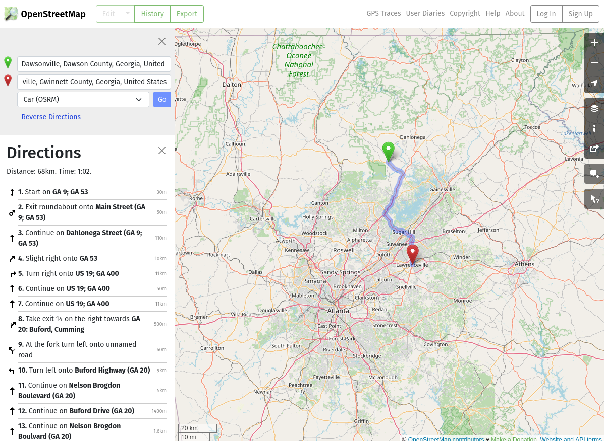
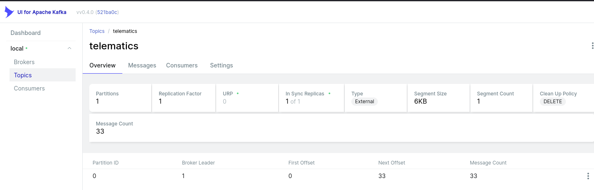
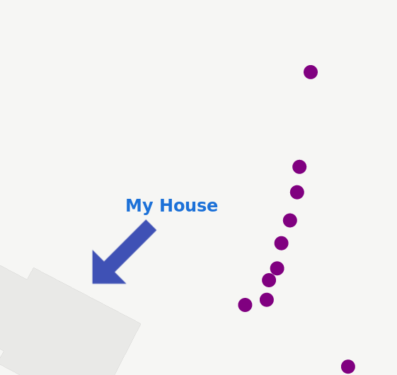
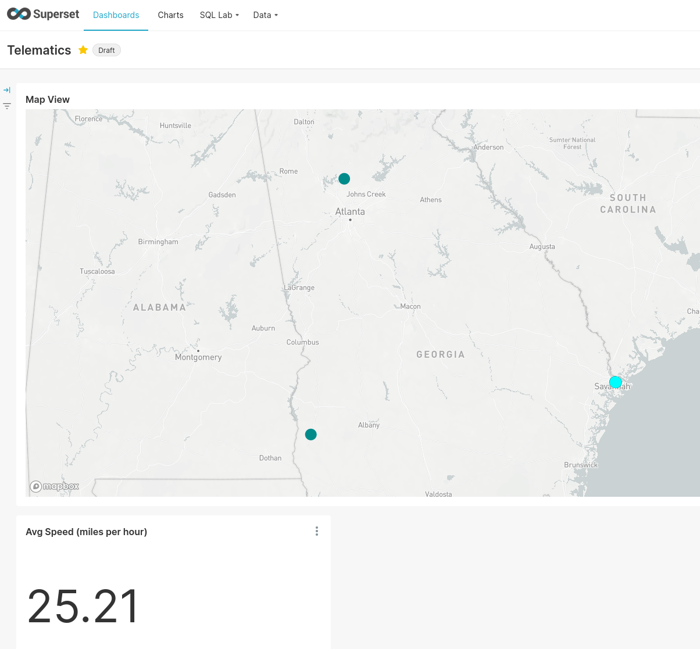
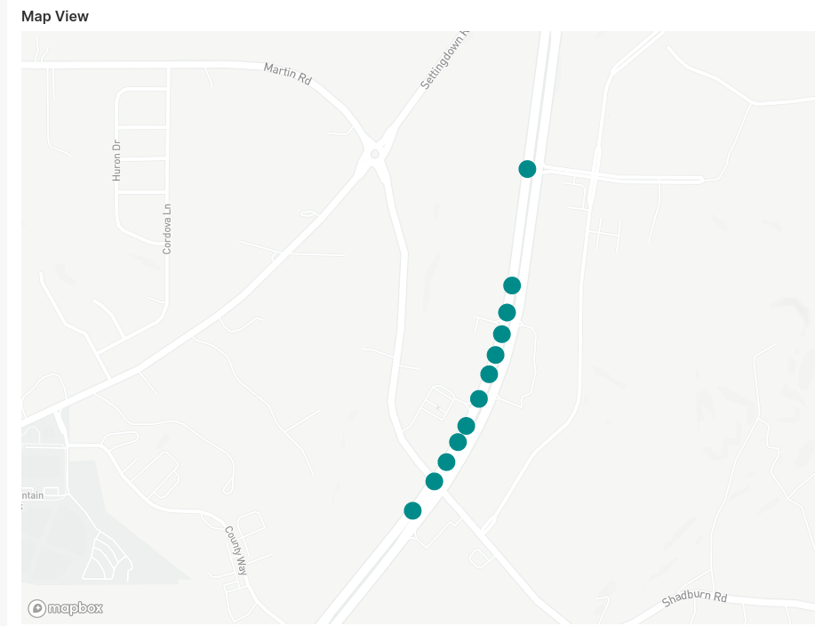

## Introduction

This is **Part 2**. Part 1 can be found [here](/blog/2022/08/tiny-telematics-tracking-my-trucks-location-offline-with-a-raspberry-pi-redis-kafka-and-flink-part-1/), where we discussed goals and architecture, built a custom `Raspbian` `Linux` image, implemented the client part of the application in `Python`, using `gpsd`, with concepts borrowed from `scala`.

Or, take it from the [GitHub](https://github.com/chollinger93/TinyTelematics/) page:

> Track your vehicle's live location offline by using little more than a Raspberry Pi & a gps dongle (aka "Tiny Telematics")

This time, we'll...

- We'll do a quick [architecture](#architecture-recap) recap.
- Then, setting up a lot of [infrastructure](#setup-up-a-backend): `Flink`, `Kafka`, `mariaDB`, mostly via `Docker`
- Then, we'll build a [streaming pipeline](#building-a-streaming-pipeline) in `Flink`: Fun times in `scala`! Additional guests: `newtype`, `circe`, and others!
- Test this on the [road](#road-test)
- Use `Apache Superset` to [visualize]() the data
- Talk about things that broke & lessons learned
- Discuss next steps 



*All code can be found on [GitHub](https://github.com/chollinger93/TinyTelematics/).*

## Architecture Recap

Just as a reminder, what we're doing here:


1. Use `gpsd` to get geo data from a physical USB GPS dongle
2. Work offline by default. Cache all your data if there's no internet available
3. If you can (i.e., are online), publish all your data to a streaming pipeline via `Kafka`
4. Said pipeline persists the data 

## Setup up a Backend

In [Part 1](/blog/2022/08/tiny-telematics-tracking-my-trucks-location-offline-with-a-raspberry-pi-redis-kafka-and-flink-part-1/), we built a good execution environment in the frontend, we can do the same for the backend - i.e., the `Kafka` cluster and storage. This is where things go from "low level stuff" to "pretend a `Docker` container can abstract the complexities of distributed systems away". I'm still very grateful for it, having set up multiple bare-metal `Hadoop` environments in my time. This *is* easier for protoyping and at-home use.

### Kafka & Negotiating brokers

Since we don't need a large, fancy cluster & the server isn't reachable from the internet anyways (i.e., we don't need auth), we can get away with the following on your server. 

```bash
# Add your user - we did this in the image earlier, but you might want this locally too
sudo useradd -m -g users -G docker telematics
sudo passwd telematics
sudo su - telematics
# Take the default docker-compose.yaml (see below)
vim docker-compose.yaml
# Start it
docker-compose up -d
# Start a topic
docker exec broker \
kafka-topics --bootstrap-server broker:9092 \
             --create \
             --topic telematics
```

This is also how I run `Kafka` locally at work (just via `podman`) - it's *fantastic* to have on your laptop if you're a heavy `Kafka` user.

For the `docker-compose.yaml`, see https://developer.confluent.io/quickstart/kafka-docker/ 

```yaml
---
version: '3'
services:
  zookeeper:
    image: confluentinc/cp-zookeeper:7.0.1
    container_name: zookeeper
    environment:
      ZOOKEEPER_CLIENT_PORT: 2181
      ZOOKEEPER_TICK_TIME: 2000

  broker:
    image: confluentinc/cp-kafka:7.0.1
    container_name: broker
    ports:
    # To learn about configuring Kafka for access across networks see
    # https://www.confluent.io/blog/kafka-client-cannot-connect-to-broker-on-aws-on-docker-etc/
      - "9092:9092"
      - "19092:19092"
    depends_on:
      - zookeeper
    environment:
      KAFKA_BROKER_ID: 1
      KAFKA_ZOOKEEPER_CONNECT: 'zookeeper:2181'
      KAFKA_LISTENER_SECURITY_PROTOCOL_MAP: PLAINTEXT:PLAINTEXT,PLAINTEXT_INTERNAL:PLAINTEXT,EXTERNAL_DIFFERENT_HOST:PLAINTEXT
      KAFKA_ADVERTISED_LISTENERS: PLAINTEXT://localhost:9092,PLAINTEXT_INTERNAL://broker:29092,EXTERNAL_DIFFERENT_HOST://bigiron.lan:19092
      KAFKA_OFFSETS_TOPIC_REPLICATION_FACTOR: 1
      KAFKA_TRANSACTION_STATE_LOG_MIN_ISR: 1
      KAFKA_TRANSACTION_STATE_LOG_REPLICATION_FACTOR: 1
```

Please note the inclusion of `EXTERNAL_DIFFERENT_HOST` to ensure the initial Kafka broker (`bigiron.lan:9092`) returns the correct address for the client to connect to. See [here](https://www.confluent.io/blog/kafka-client-cannot-connect-to-broker-on-aws-on-docker-etc/) for an explanation. If you don't see this, the next step will yield something along the lines of:

```bash
 WARN [Producer clientId=console-producer] Connection to node 1 (localhost/127.0.0.1:9092) could not be established. Broker may not be available. (org.apache.kafka.clients.NetworkClient)

```

As `bigiron.lan:9092` tells us "hey, talk to `localhost:9092`", which of course, isn't the correct machine. `bigiron.lan`, of course, is curtesy of my DNS resolver knowing about [`bigiron`](blog/2019/04/building-a-home-server/)'s IP.



Anyways, we can test this from our RasPi or laptop via:

```bash
# Download & install
sudo mkdir -p /opt/kafka && cd /opt/kafka
sudo wget https://downloads.apache.org/kafka/3.2.1/kafka-3.2.1-src.tgz
sudo tar -xzf kafka-3.2.1-src.tgz
sudo ln -s /opt/kafka/kafka-3.2.1-src /opt/kafka/latest
sudo /opt/kafka/latest/gradlew jar -PscalaVersion=2.13.6

# bigiron.lan is https://chollinger.com/blog/2019/04/building-a-home-server/
/opt/kafka/latest/bin/kafka-console-producer.sh --bootstrap-server bigiron.lan:19092 \
                       --topic telematics
> test
```

You can do this via `docker` as well, I think. I just chose not to - I like my `cli` tools be `cli` tools and the services to be services (i.e., containers nowadays). I've run Linux servers for well over a decade and `docker` has been a godssent for services.

Anyhow, to make sure it works:

```bash
telematics@bigiron:~$ docker exec --interactive --tty broker \
kafka-console-consumer --bootstrap-server broker:9092 \
                       --topic telematics \
                       --from-beginning
test
```

Wonderful!

As much as I like simple `docker` deploys, I'm sure we can all agree that this is not the way you'd deploy this in production @ work... but the server in my basement is also not exactly a data center.

### Storage & DDL

Originally, I wanted to use `Apache Iceberg` for this part, but we'll stick to a standard `MariaDB` instance for now. You can grab a copy [here](https://hub.docker.com/_/mariadb).

Our table definition looks like this:

```sql
CREATE TABLE telematics.trips (
    `id` BIGINT NOT NULL AUTO_INCREMENT,
	`tripId` BIGINT NOT NULL,
	`userId` BIGINT NOT NULL,
     -- DOUBLE in MySql lacks the precision for geospatial data!
	`lat` DECIMAL(11,8),
	`lon` DECIMAL(11,8),
	`altitude` DOUBLE,
	`speed` DOUBLE,
	`ts` TIMESTAMP NOT NULL,
	`updated_at` TIMESTAMP NOT NULL,
	PRIMARY KEY(id)
);
```

Which is simply the model translated into `sql`.  

### Types!

Note the type for `lat` and `lon` as `DECIMAL`. Most people are familiar with very strict types in `sql`, but somehow not in e.g. `Python`. We'll get back to that momentarily. For this example, consider the following:

`34.42127702575059, -84.11905647651372` is Downtown **Dawson**ville, GA. `(34.4, -84.1)`  is 2.2 miles away, `(34.0, -84.0)` is 40 miles away in **Lawrence**ville, GA. That's `DECIMAL(11,8)` vs `DOUBLE` vs `FLOAT` in `MariaDB` (the latter, more or less, but it drives home a point).



Keep in mind:

| decimal places | degrees    | distance |
| -------------- | ---------- | -------- |
| 0              | 1.0        | 111 km   |
| 1              | 0.1        | 11.1 km  |
| 2              | 0.01       | 1.11 km  |
| 3              | 0.001      | 111 m    |
| 4              | 0.0001     | 11.1 m   |
| 5              | 0.00001    | 1.11 m   |
| 6              | 0.000001   | 0.111 m  |
| 7              | 0.0000001  | 1.11 cm  |
| 8              | 0.00000001 | 1.11 mm  |

*Source: http://wiki.gis.com/wiki/index.php/Decimal_degrees*

I know most people are familiar - but it is worth pointing out early in the process.

## Building a Streaming Pipeline

While [Part 1](/blog/2022/08/tiny-telematics-tracking-my-trucks-location-offline-with-a-raspberry-pi-redis-kafka-and-flink-part-1/) talked a lot about low-tech and nitty-gritty details, we're now moving from low to high-tech: Let's talk streaming. Briefly.

### About Apache Flink

Now, we have infrastructure, we have a producer application (with a cache!), let's talk about consuming these events. We'll use [`Apache Flink`](https://flink.apache.org/):




If you used something like `Spark`, `Storm`, `Heron`, or `Beam` before, this is nothing new conceptually. Since I don't have the space or time to talk about when you'd use what, let's just leave it at this: Stateful, real-time stream processing with either bounded or unbounded streams and several layers of abstraction that allow you to write both very simple, boilerplated jobs, as well as complex stream processing pipelines that can [do really cool stuff](https://shopify.engineering/bfcm-live-map-2021-apache-flink-redesign). 

What makes `Flink` interesting for this project in particular (besides the fact that I want to play around with it) is twofold:

If we ever wanted to graduate from `MariaDB`, `Flink` has an Apache `Iceberg` [connector](https://iceberg.apache.org/docs/latest/flink-connector/), as well as a `JDBC` connector, which makes writing data much easier than having to roll our own.

Secondly, the way it approaches [snapshots](https://nightlies.apache.org/flink/flink-docs-release-1.15/docs/concepts/stateful-stream-processing/#exactly-once-vs-at-least-once): While I invite you to read the linked tech doc, a (rough) two sentence summary is:

> A barrier separates the records in the data stream into the set of records that goes into the current snapshot, and the records that go into the next snapshot. [...]
>
> Once the last stream has received barrier *n*, the operator emits all pending outgoing records, and then emits snapshot *n* barriers itself.

This means, we *can* process with *exactly-once* semantics; remember that our producer guarantees are "*at least once*", so the best stateful snapshotting process in the world won't save us from producing duplicates if we introduce them ourselves. [1]

However, unless latency is a top priority (which here, it clearly isn't, as we're already caching most of our data and have at most a handful of users, one for each vehicle in the household), adding a handful of ms of latency to our stream for the benefit of getting exactly-once semantics will greatly increase the resulting data quality. 

Also, `Flink` has a neat, persistent UI, which e.g. `Spark` still really doesn't have.

**Note**: We need `scala` `2.12.16`, not `2.13.x`:

```bash
sdk use scala 2.12.16
sbt compile
```

*[1]  You'll quickly note that, while possible (and I called out how to do it), the pipeline presented herein isn't actually following exactly-once semantics yet. I plan to add that in the future after I replace `MariaDB` - currently, the abstraction from a full database to a decoupled storage and compute engine is too weak to spend the effort in making this exactly-once, since I'd have to do it again later on.*

### Getting started

We can start by getting the `sbt` quickstart set up:

```bash
bash <(curl https://flink.apache.org/q/sbt-quickstart.sh)
```

This generates an template project we can customize.

The job we need is deceptively simple: 

1. Read from Kafka in an unbounded stream; make sure the messages are keyed by client
2. Write them to a sink, e.g. `Iceberg` files or a `JDBC` sink, periodically & snapshot after

### Standard Flink vs. Libraries

I'm adding a handful of, in my opinion, good-practice `scala` libraries to `Flink`, which is not something you'll see in many tutorials for `Flink` or *any* Data Engineering articles. Most of them are inspired by Gabriel Volpe's excellent "[Practical FP in Scala](https://leanpub.com/pfp-scala)" book.



### The Domain Model

First things first: Let's make sure we have our domain model ready to go. The heavy lifting was done beforehand, so this should be easy.

##### Modeling

We'll make full use of a smart type system and model our `@dataclass` from `Python` in `scala` as unambiguous as possible:

```scala
class GpsModel {

  sealed trait GpsMeasurement{
    def value: Double
  }
  final case class Latitude(value: Double) extends GpsMeasurement
  final case class Longitude(value: Double) extends GpsMeasurement

  @newtype final case class Altitude(meters: Double)
  @newtype final case class Speed(metersPerSecond: Double)

  type ID = Long
  final case class GpsPoint(tripId: ID, userId: ID, lat: Latitude, lon: Longitude, altitude: Altitude, speed: Speed, timestamp: EpochMs)
}
```

Note that this time we'll *always* have real 64bit values available.

We'll rely on the ever-useful [newtype](https://github.com/estatico/scala-newtype) library, as well as [circe](https://circe.github.io/circe/) for JSON SerDe (see below).

Keep in mind, since we have to use `scala 2.12`, we need to add 

```scala
addCompilerPlugin("org.scalamacros" % "paradise" % "2.1.1" cross CrossVersion.full)
```

to the `build.sbt`.

##### Serializing & Deserializing: JSON

Since we probably don't want to write our own SerDe by hand, we can use [derevo](https://github.com/tofu-tf/derevo) to automatically derive encoders and decoders by using some compiler annotations:

```scala
  @derive(encoder, decoder)
  final case class GpsPoint(
      tripId: ID,
      userId: ID,
      lat: Latitude,
      lon: Longitude,
      altitude: Altitude,
      speed: Speed,
      timestamp: EpochMs
  )
```

Which is neat, because now, we can get `import io.circe.syntax.EncoderOps` into scope and say:

```scala
val p = GpsPoint( // ...)
p.asJson
// {"userId":85383823942605,"lat":10.0,"lon":-10.0,"altitude":0.0,"speed":0.0,"timestamp":1660690181680}
```

We can easily test this for isomorphism by writing a unit test:

```scala
class GpsModelTest extends AnyFunSuite {
  test("GpsPoint encodes both ways") {
    val p = GpsPoint(
      100L,
      0x4da7f87ee3cdL,
      Latitude(10.0),
      Longitude(-10.0),
      Altitude(0.0),
      Speed(0.0),
      1660690181680L
    )
    val json: Json = p.asJson
    val decoded    = jawn.decode[GpsModel.GpsPoint](json.noSpaces)
    assert(decoded.isRight)
    decoded match {
      case Right(p2) => assert(p2 == p)
      case _         => assert(false)
    }
  }
}
```

However, when dealing with `newtypes`, we sometimes might need to write our own encoders and decoders:

```scala
  @newtype final case class Altitude(meters: Double)
  object Altitude {
    implicit val encoder: Encoder[Altitude] = new Encoder[Altitude]() {
      override def apply(a: Altitude): Json = a.meters.asJson
    }
    implicit val decoder: Decoder[Altitude] = new Decoder[Altitude]() {
      override def apply(c: HCursor): Result[Altitude] = {
        for {
          v <- c.value.as[Double]
        } yield {
          new Altitude(v)
        }
      }
    }
  }
```

Which, while possible, is mildly awkward; by default, it would encode it as:

```json
{"userId":85383823942605,"lat":{"value":10.0},"lon":{"value":-10.0},"altitude":0.0,"speed":0.0,"timestamp":1660690181680}
```

Note the `"value: 10.0"` map, rather than having a straight mapping as `"lat": 10.0`. [1]

Since we probably won't need custom `apply()` and `unapply()` methods or other shenanigans, this led me to simplify our model to:

```scala
  type Meters          = Double
  type MetersPerSecond = Meters
  type Latitude        = Meters
  type Longitude       = Meters
  type Altitude        = Meters
  type Speed           = MetersPerSecond

  type ID = String
  @derive(encoder, decoder)
  final case class GpsPoint(
      id: ID,
      lat: Latitude,
      lon: Longitude,
      altitude: Altitude,
      speed: Speed,
      timestamp: Long
  )
  object GpsPoint {
    implicit val typeInfo: TypeInformation[GpsPoint] = TypeInformation.of(classOf[GpsPoint])
  }
```

*[1] If there's an easier way around that, somebody please let me know.*

#### Reading from Kafka

Now, going from and to `string` is cool, but not quite what we need when we need to talk to `Kafka`. Take a look at the following function:

```scala
  def buildSource[A](
      bootstrapServers: String,
      topics: String,
      groupId: String
  )(implicit
      deserializer: Decoder[A],
      typeInfo: TypeInformation[A]
  ): KafkaSource[A] = {
    KafkaSource
      .builder[A]
      .setBootstrapServers(bootstrapServers)
      .setTopics(topics)
      .setGroupId(groupId)
      // Start from committed offset, also use EARLIEST as reset strategy if committed offset doesn't exist
      .setStartingOffsets(
        OffsetsInitializer.committedOffsets(OffsetResetStrategy.EARLIEST)
      )
      .setDeserializer(
        new KafkaRecordDeserializationSchema[A] {
          override def deserialize(
              record: ConsumerRecord[Array[Byte], Array[Byte]],
              out: Collector[A]
          ): Unit = {
            val s                         = new StringDeserializer().deserialize(topics, record.value())
            val v: Either[circe.Error, A] = jawn.decode[A](s)
            v match {
              case Left(e)      => println(e)
              case Right(value) => out.collect(value)
            }
          }

          override def getProducedType: TypeInformation[A] = typeInfo
        }
      )
      .build
  }
```

Now this looks a little more complicated that it needs to, so let's break it down.

##### Signature & Types

The *signature* is `A => KafkaSource[A]`, with `KafkaSource` being a  

```java
public class KafkaSource<OUT>
        implements Source<OUT, KafkaPartitionSplit, KafkaSourceEnumState>,
                ResultTypeQueryable<OUT> 
```

The *type* of the function is `A` without any bounds (if you're suspicious, carry on).

The *arguments* ask for three `Strings`, which could new `@newtype`'d if you want to, and all three simply refer to standard `Kafka` settings we've already discussed. We'll refactor this in a minute once we load a config file.

```scala
 def buildSource[A](
      bootstrapServers: String,
      topics: String,
      groupId: String
  )(implicit
      deserializer: Decoder[A],
      typeInfo: TypeInformation[A]
  ): KafkaSource[A] = 
```

The last section asks for 2 `implicits`: A `Decoder[A]` and `TypeInformation[A]`. These are, essentially type bounds that say "the type `A` must have a `Decoder` and `TypeInformation` available and in scope".

A `Decoder` can be provided by `derevo`, see above. `TypeInformation` can be inferred as such:

```scala
  object GpsPoint {
    implicit val typeInfo: TypeInformation[GpsPoint] = TypeInformation.of(classOf[GpsPoint])
  }
```

This means, we can also express this by means of a type class: 

```scala
def buildSource[A: Decoder : TypeInformation]
```

Which would be simply sugar for the aforementioned `implicit`s. As long as we have everything in scope, we simply define very clear bounds for the type of `A`, meaning if you don't tell it how to deserialize your weird custom data structures, it won't to it.

##### Building a source

The next part simply sets up our `FlinkSource`. The only thing of note is the comment above `setStartingOffset`:

```scala
    KafkaSource
      .builder[A]
      .setBootstrapServers(bootstrapServers)
      .setTopics(topics)
      .setGroupId(groupId)
      // Start from committed offset, also use EARLIEST as reset strategy if committed offset doesn't exist
      .setStartingOffsets(
        OffsetsInitializer.committedOffsets(OffsetResetStrategy.EARLIEST)
      )
```

##### Deserializing

Unsurprisingly, we'll now use the aforementioned implicit `Decoder[A]` to build a concrete instance of a `KafkaRecordDeserializationSchema` by taking the incoming, raw `Array[Byte]` from `Kafka` and piping them through `circe` back to `JSON` back to a `scala` object:

```scala
      .setDeserializer(
        new KafkaRecordDeserializationSchema[A] {
          override def deserialize(
              record: ConsumerRecord[Array[Byte], Array[Byte]],
              out: Collector[A]
          ): Unit = {
            val s                         = new StringDeserializer().deserialize(topics, record.value())
            val v: Either[circe.Error, A] = jawn.decode[A](s)
            v match {
              case Left(e)      => println(e)
              case Right(value) => out.collect(value)
            }
          }

          override def getProducedType: TypeInformation[A] = typeInfo
        }
      )
```

And that's our source!

#### Writing to the database

This can be done via the standard JDBC [connector](https://nightlies.apache.org/flink/flink-docs-release-1.13/docs/connectors/datastream/jdbc/). Keep in mind that in order to support exactly-once delivery, your database needs to support the [XA Spec](https://mariadb.com/kb/en/xa-transactions/).

That being said, all we need to do in the `Flink` world is convert some `Java` to `scala` syntax.

```scala
  def jdbcSink(config: JdbcConfig): SinkFunction[GpsPoint] = {
    JdbcSink.sink[GpsPoint](
      GpsPoint.query,
      GpsPoint.statement,
      JdbcExecutionOptions
        .builder()
        .withBatchSize(1000)
        .withBatchIntervalMs(200)
        .withMaxRetries(5)
        .build(),
      new JdbcConnectionOptions.JdbcConnectionOptionsBuilder()
        .withUrl(config.url)
        .withDriverName(config.driverName)
        .withUsername(config.user)
        .withPassword(config.password)
        .build()
    )
  }
```

But our statement builder has to be very Java-esque and mutable:

```scala
  object GpsPoint {
    implicit val typeInfo: TypeInformation[GpsPoint] = TypeInformation.of(classOf[GpsPoint])
    val query: String =
      "insert into trips (tripId, userId, lat, lon, altitude, speed, ts, updated_at) values (?, ?, ?, ?, ?, ?, ?, ? )"
    // noinspection ConvertExpressionToSAM
    // Otherwise: Caused by: java.io.NotSerializableException: Non-serializable lambda
    def statement: JdbcStatementBuilder[GpsPoint] = {
      new JdbcStatementBuilder[GpsPoint] {
        override def accept(statement: PreparedStatement, e: GpsPoint): Unit = {
          statement.setLong(1, e.tripId)
          statement.setLong(2, e.userId)
          statement.setDouble(3, e.lat) // <- Double is fine here, it has enough precision in scala!
          statement.setDouble(4, e.lon)
          statement.setDouble(5, e.altitude)
          statement.setDouble(6, e.speed)
          statement.setTimestamp(7, new Timestamp(e.timestamp))
          statement.setTimestamp(8, new Timestamp(new Date().getTime))
        }
      }
    }
  }
```

#### Configuration

You've seen it in the previous section, but we'll use [pureconfig](https://github.com/pureconfig/pureconfig) for reading config files. To keep it simple, we'll define a minimal model and read it from `resources/application.conf`:

```scala
object Config {
  final case class Config(kafka: KafkaConfig, jdbc: JdbcConfig)
  final case class KafkaConfig(bootstrapServers: String, topics: String, groupId: String)
  final case class JdbcConfig(url: String, driverName: String, user: String, password: String)

  def loadConfig(): Either[ConfigReaderFailures, Config] = sys.env.get("RUN_LOCALLY") match {
    case Some(_) => ConfigSource.default.load[Config]
    case _       => ConfigSource.resources("production.conf").load[Config]
  }
}
```

#### Putting it all together

Lastly, we'll need an entrypoint:

```scala
  def main(args: Array[String]): Unit = {
    // Require a streaming environment
    val env = StreamExecutionEnvironment.getExecutionEnvironment
    env.setRestartStrategy(
      RestartStrategies.fixedDelayRestart(
        3,                            // number of restart attempts
        Time.of(10, TimeUnit.SECONDS) // delay
      )
    )
    // Load config
    val config = Config.loadConfig() match {
      case Right(c) => c
      case Left(e)  => throw new Exception(e.prettyPrint())
    }
    // Build source
    implicit val encoder: Encoder[GpsPoint] = implicitly
    val data: DataStream[GpsPoint] = env.fromSource(
      buildSource[GpsPoint](config.kafka),
      WatermarkStrategy.forBoundedOutOfOrderness(JDuration.ofSeconds(10)),
      "Kafka Source"
    )
    // Print for testing
    val _: DataStreamSink[GpsPoint] = data.print()
    // Write to JDBC
    data.addSink(Sinks.jdbcSink(config.jdbc))
    // execute program
    env.execute("Telematics v3")
  }
```

To test our job, we can run `sbt run` and it'll consume previously collected data from `Kafka`:

```bash
[info] 11> GpsPoint(61573282483598,0.0,0.0,0.0,0.0,1659355200000)
```

And writes it diligently to `MariaDB`:


### Cluster Setup

We'll run this on a simple, single-node cluster in session mode, which allows us to submit jobs towards the cluster. Once again, we can [containerize](https://nightlies.apache.org/flink/flink-docs-master/docs/deployment/resource-providers/standalone/docker/#session-mode-1) all this:

```yaml
version: "2.2"
services:
  jobmanager:
    image: flink:latest
    ports:
      - "8082:8081"
    command: jobmanager
    environment:
      - |
        FLINK_PROPERTIES=
        jobmanager.rpc.address: jobmanager        

  taskmanager:
    image: flink:latest
    depends_on:
      - jobmanager
    command: taskmanager
    scale: 1
    environment:
      - |
        FLINK_PROPERTIES=
        jobmanager.rpc.address: jobmanager
        taskmanager.numberOfTaskSlots: 2       
```

And we can submit the job:

```bash
sbt clean assembly
flink run \
      --detached \
      --jobmanager bigiron.lan:8082 \
      ./target/scala-2.12/TinyTelematics-assembly-0.1.jar
```

## Road Test

Time to take this on the road and see what  happens.

### Infrastructure Launch Check

Now that we have all components ready to go, let's go over the infrastructure one more time:

#### Kafka

`Kafka` runs in `docker` on a remote server that's accessible on the local subnets. 



#### Flink

`Flink` runs in session mode and executes our job from before.


#### MariaDB

The database is not something we've set up in this article, but has been running diligently forever. 

#### Raspberry Pi

The Raspberry Pi runs our client app :

```bash
telematics@raspberrypi:/var/log/telematics$ sudo service tiny-telematics status
● tiny-telematics.service - tiny-telematics
     Loaded: loaded (/etc/systemd/system/tiny-telematics.service; enabled; vendor preset: enabled)
     Active: active (running) since Sun 2022-08-01 00:00:00 EDT; 32s ago
   Main PID: 3877 (run_client.sh)
      Tasks: 4 (limit: 415)
        CPU: 31.240s
     CGroup: /system.slice/tiny-telematics.service
             ├─3877 /bin/bash /home/telematics/TinyTelematics/sbin/run_client.sh
             ├─4029 /bin/bash /home/telematics/TinyTelematics/sbin/run_client.sh
             ├─4030 /home/telematics/.pyenv/versions/3.8.13/bin/python3.8 /home/telematics/.pyenv/versions/3.8.13/bin/pip3 list
             └─4031 grep tiny-telematics
```

And of course, we need to confirm it survives a restart - 

```bash
sudo reboot 0
ssh pi@pi-telematics.lan
tail -100 /var/log/telematics/err.log
# 2022-08-01 00:00:00,498 - WARNING main.py:poll_gps():94 - Empty record, filtering
# 2022-08-01 00:00:00,503 - DEBUG main.py:main():237 - No GPS record returned
```

### Setting up the physical hardware

This was a matter of plugging in the Pi into a USB port and checking that everything worked:



The only mishap here was the fact that we didn't set up any `udev` rules that would ensure we can always talk to e.g. `/dev/ttyGps`, rather than `/dev/ttyACM$N`, where `$N` might not always be consistent, resulting in a pack on GPS connectivity.

> *udev* is a userspace system that enables the operating system  administrator to register userspace handlers for events. The events  received by *udev*'s daemon are mainly generated by the (Linux) kernel in response to physical events relating to peripheral devices. As such, *udev*'s main purpose is to act upon peripheral detection and hot-plugging,  including actions that return control to the kernel, e.g., loading  kernel modules or device firmware.
>
> https://wiki.archlinux.org/title/udev

This can, in *theory*, be fixed as such:

```bash
pi@raspberrypi:~ $ udevadm info /dev/ttyACM0
P: /devices/platform/soc/20980000.usb/usb1/1-1/1-1:1.0/tty/ttyACM0
N: ttyACM0
L: 0
S: gps0
S: serial/by-id/usb-u-blox_AG_-_www.u-blox.com_u-blox_7_-_GPS_GNSS_Receiver-if00
S: serial/by-path/platform-20980000.usb-usb-0:1:1.0
E: DEVPATH=/devices/platform/soc/20980000.usb/usb1/1-1/1-1:1.0/tty/ttyACM0
E: DEVNAME=/dev/ttyACM0
E: MAJOR=166
E: MINOR=0
E: SUBSYSTEM=tty
# ...

echo 'SUBSYSTEM=="tty", ATTRS{idVendor}=="1546", ATTRS{idProduct}=="01a7, SYMLINK+="ttyGPS"' >> /etc/udev/rules.d/99-com.rules
sudo udevadm control --reload
```

I have, however, not gotten it to work as of time of writing this. The hotfix might be stupid,  but works:

```bash
function replaceDevices(){
	for i in $(seq 0 2); do
		local id=$i
		echo "Probing /dev/ttyACM$id"
		if [[ -n $(udevadm info "/dev/ttyACM$id" | grep GPS) ]]; then 
			echo "Replacing gpsd devices with /dev/ttyACM$id"
			sed -i "s#DEVICES=\"\"#DEVICES=\"/dev/ttyACM$id\"#g" ${GPSD}
			sed -iE "s#/dev/ttyACM[0-9]#/dev/ttyACM$id#g" ${GPSD}
			echo "New gpsd config:"
			cat ${GPSD}
			break
		fi
	done
}
```

So is it *really* stupid? (yes, yes it is)

### Driving around

This was distinctly one of the weirder developer environments I've worked in - during my test trip(s) (one graciously done by my significant other), having a Raspberry Pi and an obnoxiously blinking GPS dongle in the middle console is odd to say the least. Then again, probably less irritating than Carplay and others, so there's that.




Also, I'll buy whoever recognizes this location a beer at the next conference. It is, unfortunately, not our back yard.

### Checking the data

Once home, the first check is to see if we have data in `Kafka`. 


Success!

And next, in `MariaDB`:

```sql
SELECT COUNT(*) FROM telematics.trips WHERE lat != 0;
-- 1,798
```

Also a success!

### Minor issues during testing

I'll admit it - the drive to the lakes wasn't the only test I'd have to do. There were some other issues encountered during these road tests, and I'll sum them up briefly:

- Due to the nature of the caching mechanism, it takes quite a while to the data to be sent back to Kafka. This means, if you unplug the Pi and plug it back in inside, chances are, it won't get a GPS fix; this means the buffer doesn't fill and hence, our data is stuck in `redis`. The fix is trivial - if there's data in `redis`, send that after a restart.
- In a similar vein, not getting a GPS fix can cause the `poll_gps()` loop to practically deadlock. We *can* time out that process, but it makes little difference, because...
- ...I made a fundamental error by using `time.sleep()` within the loop. Rather, we should be relying on the GPS receiver's update frequency - 1Hz - because otherwise we'll get the same record from the buffer over and over [again](https://lists.gnu.org/archive/html/gpsd-users/2019-08/msg00044.html). We need to correct *drift*. See [below](#drift-do-not-fall-asleep).
- However, sometimes a cheap USB GPS dongle simply doesn't get a good signal and hence, does not report GPS data or, worse, somehow does a cold boot and needs a new satellite discovery process & fix. This happened several times, where I see the first GPS point 5 to 10 minutes after I leave the house. And while where we live has been described as "chicken country" to me, in reality, it isn't what I'd call remote - *certainly* not some odd GPS blind spot where it's impossible to get enough satellites for a signal.
- The `Kafka` client was created prematurely and assumed WiFI connection was a given, meaning the service couldn't start up again after a stop at Costco outside WiFi range.
- An indentation error & lack of unit test (despite pretty good coverage) caused the cache to be deleted prematurely.
- Lastly, another fundamental hardware issue; Postmortem can be found [here](#re-configuring-the-gps-chipset). 

Turns out, writing a fully cached, offline system isn't as easy as I thought. 

### Drift: Do not fall asleep

What we did originally: `yield`, do a bunch of expensive operations, `time.sleep(1)`, go back to `gpsd` and ask for the next record.

However, that next record comes in at a frequency of 1-10Hz, and our other operations (especially calling `subprocess` can be relatively slow). So, if we encounter *drift*, i.e. where we're falling behind with processing records, we have to skip them - otherwise, we'll never catch up.

```python
# Account for drift, i.e. the rest of the program lags behind the gpsd buffer
# In that case, just throw away records until we're current
gps_time = ts.timestamp()
now = time.time()
drift_s = now - gps_time
if drift_s >= max_drift_s:
    logger.warning("Correcting %ss drift, skipping record", drift_s)
    continue
```

In a similar vein: Do not `yield None` - that causes expensive stuff to be run without rhyme or reason.

Originally, I thought this bug alone caused this:

```sql
SELECT COUNT(*) as C, lat, lon FROM telematics.trips GROUP BY  lat, lon HAVING lat != 0;
-- 1276	33.x2	-84.x5
-- 6630	33.x0	-84.4x0
-- 2 more rows from 2 1hr each trips. x => redaction
```

It did not.

### We're still not moving

While the above rings true and was an issue, after fixing this and driving a solid 200mi one Saturday, my GPS map looked like this: [1]


The distance between those points is only a handful of miles, but I'm cropping out the rest for privacy reasons. On the real map, there's 6 or so more points - one for each stop or restart.

Point being: There should be hundreds of points! Matter of fact, there should be 23,541 points:


However, in `sql`, let's ask for "how many points have the exact same location?":

```sql
SELECT COUNT(*) as C FROM telematics.trips GROUP BY  lat, lon HAVING lat != 0
ORDER BY C DESC 
-- 6028
-- 5192
-- 2640
-- 2200
-- 1885
-- 1356
-- 1320
-- ...
```

This is the same as before, but worse!

Here's me walking around the property, staring at debug logs (our neighbors, strangely, still like us...), trying to figure out why on earth the GPS location isn't changing - as we've established before, GPS isn't super precise, but does go down to 1.11 mm in precision in theory; ergo, walking a couple of feet ought to change my location in the logs, even if only by margin of error, **right**?





I've tried everything - simulated gps data (various formats!), `Python 2` style (call `next()`), `Python 3` style (use `__next__`, i.e. `for report in gps_client`), printed out the raw (very mutable `GpsClient`):

```python
2022-08-01 00:00:00,0 - ERROR main.py:poll_gps():67 - gps_session: Time:     2022-08-01T00:00:00.000Z
Lat/Lon:  XX YY # <- real location, but always the same 
Altitude: 328.110000
Speed:    0.000000
Track:    0.000000
Status:   STATUS_NO_FIX
Mode:     MODE_3D
Quality:  4 p=9.41 h=7.40 v=5.81 t=3.49 g=10.03
Y: 18 satellites in view:
    PRN:   1  E:  19  Az: 275  Ss:   0 #....
```

Which changes data like satellites every time, **but not the location**.

Ignore the `STATUS_NO_FIX` - that's frequently not reported by the receiver. `MODE_3D` and `17 satellites in view` means it clearly can talk to the mighty sky orbs it so desperately desires.

### Re-Configuring the GPS chipset

Turns out: The device I'm using, a u-blox G7020-KT (based on a u-blox **7** chip), so we can use `ubxtool` to get to the nitty-gritty details:

```bash
export UBXOPTS="-P 14"
ubxtool -p MON-VER
#UBX-MON-VER:
#  swVersion 1.00 (59842)
#  hwVersion 00070000
#  extension PROTVER 14.00
#  extension GPS;SBAS;GLO;QZSS
```

This means, we can fine-tune the receiver config. As the physical dongle caches configurations, including previous satellite locks and supported satellite constellations, we can simply reset the entire thing back to default:

```bash
# This is important, but depends on your device, see PROTVER above
export UBXOPTS="-P 14"
# Reset configuration to defaults (UBX-CFG-CFG).
ubxtool -p RESET

# Disable sending of the basic binary messages.
ubxtool -d BINARY
# Enabke sending basic NMEA messages. The messages are GBS, GGA, GSA, GGL, GST, GSV, RMC, VTG, and ZDA.
# My reciever can only do basic NMEA0183 
ubxtool -e NMEA
# Enable GPS
ubxtool -e GPS
# Save
ubxtool SAVE
```

We can then check if everything is in-line with what we expect. The receiver I'm using is fairly primitive (only supports the L1 GPS band and uses a pretty ancient chip), but it can to up to 10Hz (allegedly), but we want the 1Hz default, so it's a good quick check:

```bash
# Poll rate
pi ubxtool -p CFG-RATE
#UBX-CFG-RATE:
# measRate 1000 navRate 1 timeRef 1 (GPS)
```

Somehow, somewhere, something changed some **physical aspect of my one and only GPS receiver, and that messed up all physical road tests**.

Don't believe me? Real "trip":



Needless to say, after wasting *hours* of my life on this - unpaid, of course, because *clearly* I'm slowly loosing it - it finally worked again.

So... test your hardware, folks. And **test the software running your hardware with your actual hardware, do not rely on integration tests.**

This is not something I do on the daily. My hardware is in "the cloud" and consists of some Kubernetes nodes somewhere in `$BIG_TECH`'s datacenters.

I've had to debug Kernel problems, network issues, DNS issues, saw UDP used where TCP should have been used, NTP issues, crypto key exchange issues - I'm saying, I'm used to debugging stuff that's outside of "just debug your code" (I'm sure you're familiar). 

My hardware broken, that happened once and I wrote [about it](/blog/2020/02/how-a-broken-memory-module-hid-in-plain-sight/). But a USB dongle (essentially a dumb terminal) being somehow mis-configured, *that's* a first for me. You may laugh at me.

*[1] Yes, those coordinates represent the Buc-cee's in Calhoun, GA, and it's wonderful.*

## Visualize Data

With all those issues fixed, let's take a visual look at the data, using some fantastic open source software.

### A note on the data shown

Most GPS points here are either synthetic (thanks to [nmeagen.org](https://www.nmeagen.org/)) or altered as to avoid detailing actual trips for the purpose of this blog article (for obvious privacy reasons). In other words, I *probably* did not drive straight through some poor guy's yard in Arlington, GA.

You can find a sample trip [here](https://graphhopper.com/maps/?point=34.4212%2C-84.1191&point=33.9562%2C-83.988&locale=en-US&elevation=true&profile=car&use_miles=false&layer=Omniscale). I've converted it to `csv` and `nmea` [here ](https://www.gpsvisualizer.com/convert_input)and [here](https://www.gpsvisualizer.com/gpsbabel/) which ran `gpsbabel -w -r -t -i gpx -f "GraphHopper.gpx"  -o nmea -F "GraphHopper.nmea"`. I then piped this data to the `TinyTelematics` application via `gpsfake` - everything else was running the real pipeline.

Keep in mind that this data is missing some important attributes, namely speed, altitude, and real, realistic timestamps that would drive many KPIs.

Some trips and screenshots are real.

### Apache Superset

We can use [`Apache Superset`](https://superset.apache.org/) for this. Superset is super cool - it's a web-based, open source data visualization platform that supports [MapBox](https://www.mapbox.com/) for geospatial data, who have a very generous free tier.



We can set it up via `Docker`:

```bash
git clone https://github.com/apache/superset.git
docker-compose -f docker-compose-non-dev.yml pull
docker-compose -f docker-compose-non-dev.yml up
```

Note that for using `mapbox`, you'll need to edit `docker/.env-non-dev` and add your `MAPBOX_API_KEY`.

### Add a dataset

Once it's running, we can add the `trips` table as a dataset:


(Keep in mind that, while running in `docker`, `superset` will try to use your service account from a different IP than your computer, so `GRANT ALL PRIVILEGES ON telematics.* TO 'telematics'@'127.0.01';` or similar does not work!)

### Create charts & dashboard

Creating custom charts & a dashboard is also pretty straightforward and my (very basic one) looked like this:



Zooming in on a (synthetic) trip shows individual points:



Note the distance between the points. In this example, the reason for this pattern is simply the way the data has been generated - see below for some thoughts and issues around synthetic testing.

### Visualization vs. Analysis

But even with real trips, at a sample rate of 1 sample/s and a speed of 60 miles/hr (or 26.82 meters/s), our measured points would be almost 27 meters or 88 ft apart. 

Zoomed out, however, this is a much more coherent trip, even with synthetic data:


The problems with bad sample rates (which can also happen by simply not finding a GPS fix, see "Issues during testing" above!) is that *analysis* of this data is difficult, even if the zoomed out view (this trip would take about an hour in real life) is certainly coherent.

Compare this to the zoomed in view of a real trip collected while driving:


A much more consistent sample rate. However, we can see the GPS precision (or lack thereof) in action once we're zoomed in real far:


Again, I did not go off-road there. The labels represent speed in meters per second.

However, with this data, we could actually calculate some interesting KPIs via `WINDOW` functions, such as acceleration or bearing via some trigonometry.

### Superset vs `geopandas` + `folium`

This whole process is eons easier than dealing with (the undoubtedly fantastic!) `Python` libraries like `geopandas` or `folium`. Open source data visualization has come a long way over the years, and not having to know what on earth `GeoJSON` is is surely helpful to make this more accessible.

However, this particular chart type is missing some of the flexibility e.g. `folium` would give - it's great at rendering clusters of points, not such my individual points.

However, we can use the `deck.gl Geojson` map type and get close-ish to what one does with e.g. `folium`. Since `MySQL` (and `MariaDB`) supports [spatial functions](https://dev.mysql.com/doc/refman/8.0/en/spatial-function-reference.html), we can add a custom column:

```sql
SELECT ST_AsGeoJSON(POINT(lat,lon)) FROM telematics.trips t 
```

Yields valid `geojson`: `{"type": "Point", "coordinates": [XXX, YYY]}`

Or, why not create an aggregate view?

```sql
CREATE OR REPLACE VIEW telematics.tripLines AS (
SELECT
	tripId,
	ST_AsGeoJSON(
		LineStringFromText(
			CONCAT("LINESTRING(", 
				GROUP_CONCAT(
				CONCAT(lon, " ", lat))
				, ")")
		) 
	) as tripLine,
	AVG(speed) as averageSpeed,
	COUNT(*) as points,
	MIN(ts) as start_ts,
	MAX(ts) as end_ts
FROM (SELECT * FROM telematics.trips ORDER BY ts ASC) t
GROUP BY
	tripId
)
```

We then can use this data to render smooth lines:


But cracks are starting to show: In order to color these lines in, you need custom `JavaScript` and for some reason, it did not take my clearly well formated `geojson`.  But it is possible!

## Conclusion

This was a *lot* harder than I thought it would be and hence, was a fantastic learning-by-doing exercise. I'm decently familiar with all the things I've used here, but starting from scratch, including setting up *all infrastructure* down to the `Linux` image was an experience. 

Just, looking at the code, you'd probably say "That doesn't look that hard!" - and you'd be right. But as I've called out above (and am about to again), the devil's truly in the *tiniest* of details here.

### Things that broke

Things that broke, in no particular order - 

- `armv6` support for Docker
- A mini-USB cable
- The `Raspbian` `iso` file while trying to re-size and `chroot` into it, repeatedly
- My spice grinder (that one was unrelated, but it was _unreasonably_ tedious to repair and I'm shaming it publicly here)
- The caching logic with `redis`
- ` java.io.NotSerializableException: Non-serializable lambda` in `Flink`
- `systemd` and `gpsd` and of course, the combination thereof
- Distributed systems such as `Kafka` and `Flink` via `Docker` as single-node instances - much more pleasant than bare metal installs, but annoying for different reasons, especially once you deploy them alongside things like `Kafka UI` or `Kafka Registry` or `Kafka Registry UI` (things I didn't even write about here, expect for screenshots)
- The Mapbox API key for `Apache Superset` (it's an environment variable, who knew?)
- `udev` mappings
- The `Flink` TaskManager randomly crashes and I haven't even read any logs yet
- `gpsfake` with `apparmor` and *my* `root` access to `/dev/pts/`
- Everything relating to a physical device - see above (I have since purchased a backup device with a different chipset)
- Frankly, various other things I probably forgot 

### Being intentionally offline

Due to all these issues, this was extremely interesting to test. I've mentioned synthetic data and integration tests before. We're probably all used to network and system outages, and that's why doing something along those lines:

```scala
def getGpsRecords(query: Query): IO[List[GpsRecord]] = {
	for {
		data <- queryDatabase(query)
		res = data.filter(r => r.lat != 0f)
	} yield res
}
```

Is so delightful (it fails fast, predictably, and has a type signature to support it). At the very least, we know to throw an `Exception` and recover from it eventually or at least fail gracefully and try again later. We can even say `queryDatabase(query).handleErrorWith(e => ...)`, since we know from the type that an `Exception` is a possibility.

In this case, a lot of what is usually good advice just goes out the window.

Once you're dealing with a system which *intentionally* is offline, things change quite a bit. A usual strategy of creating & caching an expensive client (say, `Kafka`) doesn't work at all, once you realize that you can't keep that connection alive, since you *expect* to be offline any time soon. Testing this at home, of course, works well - every time the application is started or debugged, it can talk to Kafka. If it can't, you automatically assume you broke something. 

Also, due to the nature of GPS, testing has to be in-person and on the road, in real conditions - unit and integration tests can only do so much. A quick trip down the road isn't *hard*, per se, but it's *much* more effort than running a test suite. 

The closest I've dealt with something like that in the past was an herein unspecified project that used physical RFID scanners and required frequent trips to the midwest and delightful conversations about grain elevators with Uber drivers while there.

### `gpsfake`

"But...!", I hear you ask. "There's `gpsfake`, is there not? Say, does it not open..."

> ... a pty (pseudo-TTY), launches a **gpsd** instance that thinks the slave side of the pty is its GNSS device, and repeatedly feeds the contents of one or more test logfiles through the master side to the GNSS receiver.
>
> https://gpsd.gitlab.io/gpsd/gpsfake.html

Why yes, of course there is! But it took me much more time than I'm willing to admit until I realized that this:

```bash
❯ sudo gpsfake output.nmea -n
/usr/bin/gpsfake:21: DeprecationWarning: The distutils package is deprecated and slated for removal in Python 3.12. Use setuptools or check PEP 632 for potential alternatives
  from distutils import spawn
Processing output.nmea
gpsd:ERROR: SER: device open of /dev/pts/3 failed: Permission denied - retrying read-only
gpsd:ERROR: SER: read-only device open of /dev/pts/3 failed: Permission denied
gpsd:ERROR: SER: device open of /dev/pts/3 failed: Permission denied - retrying read-only
gpsd:ERROR: SER: read-only device open of /dev/pts/3 failed: Permission denied
gpsd:ERROR: /dev/pts/3: device activation failed, freeing device.
gpsfake: log cycle of output.nmea begins.
❯ ll /dev/pts/3
crw-rw-rw- 1 christian tty 136, 3 Aug 25 17:46 /dev/pts/3
# tf?
```

Was caused by: 

```bash
newfstatat(AT_FDCWD, "/tmp/gpsfake-39276.sock", {st_mode=S_IFSOCK|0775, st_size=0, ...}, 0) = 0
socket(AF_UNIX, SOCK_STREAM|SOCK_CLOEXEC, 0) = 8
connect(8, {sa_family=AF_UNIX, sun_path="/tmp/gpsfake-39276.sock"}, 25) = 0
sendto(8, "+/dev/pts/10\r\n\0", 15, 0, NULL, 0) = 15
recvfrom(8, gpsd:ERROR: SER: device open of /dev/pts/10 failed: Permission denied - retrying read-only
gpsd:ERROR: SER: read-only device open of /dev/pts/10 failed: Permission denied
"ERROR\n", 12, 0, NULL, NULL) = 6
close(8)                                = 0
wait4(39278, gpsd:ERROR: SER: device open of /dev/pts/10 failed: Permission denied - retrying read-only
```

***Note**: "Once you need `strace`, just stop" is usually a more reasonable approach.*

And what can even deny `root` access  to run a stupid syscall like `sendto(2)`? Correct, `apparmor` and `SELinux`. (╯°□°)╯︵ ┻━┻

```bash
❯ sudo apparmor_status
apparmor module is loaded.
29 profiles are loaded.
27 profiles are in enforce mode.
   ...
   /usr/sbin/gpsd
```

This was one of those things where there's one mailing list thread from [2012](https://lists.gnu.org/archive/html/gpsd-dev/2012-05/msg00167.html) as a response that doesn't solve the issue. 

> ```
> > Regressions run just fine here.
> 
> Does me no good. :-)
> ```

For the record, if you're here via Google: Just set `/usr/sbin/gpsd` to `complain` mode and it'll work...

Anyways - this is synthetic data. It does not test getting an actual GPS fix in the car, the service starting alongside the vehicle, `gpsd` talking to the right device, changing WiFi environments, intentional and unintentional network outages, weather conditions, tree canopy and so on and so forth. 

You've seen some of this data in the previous section - it doesn't have realistic speeds, altitudes, pauses, traffic conditions etc.

It also, very obviously, did not catch the hardware / configuration issue we've dealt with a handful of paragraphs above. Needless to say, it wouldn't have caught the duplicate record issue neither.

> TBD - move

### Next Steps?

While this was fun (and very usable! Tried it in 2 cars, even!), we really should really be able to...

- Write `Apache Iceberg` instead of plain SQL
- Make it actually exactly-once
- Generally, do more logic and aggregation in the `Flink` stream - right now, it's just a dumb sink
- Automatically power the Raspberry on and off (not just the application). This currently happens because my truck cuts USB power after a while, not because it shuts itself down - works in my vehicle, but probably not in yours.
- Integrate `OBD2` data 
- Identify trips more consistently 
- Improve the domain model. It could be much richer
- Maybe customize some visualization
- Fix some `gpsd` mishaps and dig deeper and avoid the stupid workarounds



### So long and thanks for all the fish

Anyways - I hope you enjoyed it. If you want to try this for yourself, all code is on [GitHub](https://github.com/chollinger93/TinyTelematics/) as usual.

*All development and benchmarking was done under GNU/Linux [PopOS! 22.04 on Kernel 5.18] with 12 Intel i7-9750H vCores @ 4.5Ghz and 32GB RAM on a 2019 System76 Gazelle Laptop, using `scala` `2.12.16`*