## Introduction

Sometimes, I come across software that makes me wonder: "How didn't I know about this before‽". `QGIS` is such software.

> A Free and Open Source Geographic Information System
>
> https://www.qgis.org/en/site/

As a bit of background - I've always been a fan of playing with geospatial data, as evidenced most recently in my [Tiny Telematics](/blog/2022/08/tiny-telematics-tracking-my-trucks-location-offline-with-a-raspberry-pi-redis-kafka-and-flink-part-1/) project series or how I built a Data Lake with [geospatial data](/blog/2021/12/building-a-data-lake-with-spark-and-iceberg-at-home-to-over-complicate-shopping-for-a-house/) when we bought our house. *[1]*

It's an *awesome* field, because it not only maps (heh) the real world around you onto something quantifiable, it *also* enables you to tap into the absolute wealth of *public* data that is available at your fingertips. Census data, demographics, structure polygons of your neighbors houses, barns, and sheds, NASAs elevation data project, flood plains, soil data, light pollution, zoning codes - you name it. It's out there. And it is genuinely useful.

Also - you're paying for the data already! *[2]* Go use it!

But you have to put all of it together. And that's where `QGIS` comes in.

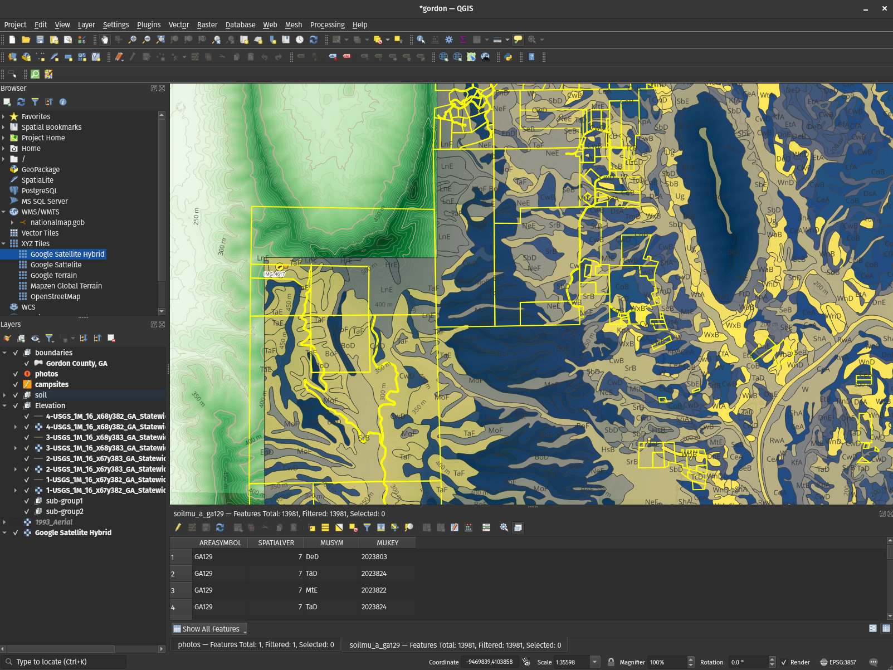

A note for my European friends - some of these links might not work from outside the US, as some `.gov` links tend not to.

*[1]:  Good fun, recommend the read.*

*[2]: If you're a US tax payer.*

## Why? A real-world use case

I don't generally work with geospatial data in my day job (and I'm too dense for any of the advanced trigonometry that these jobs tend to entail), which makes the field even more appealing for playing around with on my own. My use case was not purely academic, though. I've recently purchased a "recreational property", which is a loaded term, but allow me to quote:

> Recreational land can be defined as  any piece of property with land used for purposes of recreation. This  specific use can be anything from hunting, fishing, ATV-ing, camping, or any combination of the like. **The main difference between this type of  property and any other rural property can be profit**, as many other rural properties like this are purchased for reasons such as farming,  ranching, or timber harvesting.
>
> https://www.landleader.com/what-is-recreational-land

This is a pretty common thing in the US South, since we have a big lack of public land  and the availability of the public land that is leased by the state and made available for use (mostly Wildlife Management Areas, which are crucial for the wildlife ecosystem of the state!) is under constant [threat](https://www.bizjournals.com/atlanta/news/2022/05/10/19000-acres-northwest-ga.html) - and the land that *is* available usually comes with restrictions. Truly unrestricted land is mostly managed by the [Bureau of Land Management](https://www.blm.gov/) and generally unrestricted, but we (the fine state of Georgia) only have a [tiny](https://www.backcountrychronicles.com/public-hunting-land/) amount of that. 

So, a lot of people - often "hunting clubs", whether they actually hunt or just like the outdoors - buy their own land and maintain it as best they can.

When it comes to privately owned recreational property for the common person (read; no land barons), almost all of this land is very rural and, unless you are very wealthy, usually *relatively* small (5 - 50 acres). *Because* these properties are small, the surrounding land is extremely important - if you buy 5 acres and your neighbor plans to raze 30 to build a 80 house subdivision, your deer might be unhappy (or, like most of these predatory developments, simply cause the deer to disappear, alongside any other form of biodiversity, but I digress).



Some of these properties are well documented when they are listed, especially when talking about subdividing large plots and farms into small lots (usually in the 1-4 acre range) for the express purpose of building cabins, farms, or other forms of home sites. These properties are expensive, but pretty easy to handle: You generally get a land survey, connection to the power grid, a septic system (or, at the very least, a percolation test), and a pre-drilled well or even public water. Some of these are really suburban-like subdivisions with extra steps and worse internet (the latest in developer newspeak appears to be "Estate Lots" for this type of development). 

This means: Looking at Google Maps usually tells you most of what you know.

The other extreme are properties that have none of that, the buyer pays for a survey, descriptions are done via drone pictures and GPS locations, and existing satellite footage tends to be *very* low resolution. This means: Looking at Google Maps usually tells you that trees, generally, show up as a green shape on Google Maps.



Now, if Google Maps tells you a lot or a little: Before closing on a property, it's generally a good idea to know *as much as possible* about it. Meet `QGIS` and public data.

## Public Data

A lot of people don't know this, but basically everything the government does in the United States is public record. This includes small, rural counties in the Southeast. This transparency (if you look for it) is *excellent* for many reasons, but especially in this case, where we can siphon all this data.

What we'll build in this article will use a plot of land owned by the US Forest Service in Gordon County, GA, (rather than a private individual) which is actually part of the Chattooga River District, which is some of the actual public land we have. I'd just rather use that than zoom in onto some poor schmuck's barn to tell you about `shp` files.

### County GIS Maps

Basically every county in the US will give you a result for "`$County` + GIS" on Google. GIS meaning "Geographic Information System", of course. These systems, in my localized experience, are usually run by `qPublic.net` or `ArcGIS`. They generally work the same - they give you data on what parcels exist, who owns them, how they are zoned, how they are taxed, what their "Fair Market Value" is (which, these days, tends to be far below what they are actually worth), recent sales, permits, and with rural land, often data about soil productivity.



Here's an [example](https://qpublic.schneidercorp.com/Application.aspx?AppID=629&LayerID=11198&PageTypeID=4&PageID=4598&KeyValue=005%20%20%20%20%20%20%20004).

Please note that the friendly warning you get when opening these sites is to be taken seriously - the lines you see are never legal boundaries. You need an actual land survey for that, and we'll see a bit why that might be in a second.

In addition to that, these systems also give you overlays for school zones, waterways, lakes, rail routes, tax district, urban planning, historical aerial photography and much more. These maps are very handy for homeowners.

Even better, they usually allow selective downloads:



This data allows rough (again, not legal!) boundaries to understand where a plot of land starts and ends, even though that is often semi-useful without real world reference points. It's a starting point - and it only works if the land's planned subdivisions (since few people can buy hundreds of acres, at least here) has already been recorded with the county and reflected in the GIS, which is often a slow process.

In the case of Gordon County, the data came as a `kml` file, which is basically geospatial XML. Looks a little something like this:

```xml
<kml xmlns="http://www.opengis.net/kml/2.2">
  <Document>
    <name>Gordon County, GA</name>
    <open>1</open>
    <Placemark xmlns="">
      <name>001       001</name>
      <styleUrl>#m_ylw-pushpin</styleUrl>
      <MultiGeometry>
        <Polygon>
          <outerBoundaryIs>
            <LinearRing>
              <coordinates>-85.0515678459741,34.6157654210014,0.002583347260952 -85.0512951573579,34.6152839041382,0.0025832513347268</coordinates>
            </LinearRing>
          </outerBoundaryIs>
        </Polygon>
      </MultiGeometry>
    </Placemark>
```

### Elevation Data

If you ever looked for elevation data (say, to gauge if you could build something somewhere), the resolution for these is usually in the hundreds of meters, not in the meter range.

Fortunately, NASA has this wonderful project called "[Shuttle Radar Topography Mission](https://www2.jpl.nasa.gov/srtm/)", a mission that captured world wide, high resolution elevation data, which recently got a data [overhaul](https://www.earthdata.nasa.gov/esds/competitive-programs/measures/nasadem) (since the mission flew over 20 years ago!) with higher resolution (1 measurement per meter/3ft) as DEM files ("digital elevation model").

You can find this data [here](https://apps.nationalmap.gov/downloader/#/). We'll see in a second how `QGIS` can help process this into more conventional elevation maps.





### Base Maps

Base maps turn a blank coordinate system into what we consider a "map". They are generally Tile Map Services (TMS), i.e. web APIs. Google Maps Hybrid lives at `https://mt1.google.com/vt/lyrs=y&x={x}&y={y}&z={z}` and is a good starting point, but many other options are available (e.g., Here, Bing Maps, or Mapbox). Google Maps and others are still amazing resources to take advantage of.

### Historical Base Maps

Google Maps is useful, but how about some historical data? Say, you want to know how an area changed over the years and where the journey might go before making a long-term investment? *[1]*

No problem, the Georgia University system has you [covered](https://dlg.usg.edu/records?collection_record_id=gyca_gaphind&f%5Bcounties_facet%5D%5B%5D=Gordon&only_path=true)! This data here is a `jpeg`, but often times those are `tiff` or even `pdfs`, usually without geospatial information. No worries, `QGIS` can help with that. Just search for "historical maps + `$county`" and chances are something shows up.



*[1]: That is a use case I've had, but we'll also be using this as a proxy for a survey, or any other non-geotagged image that might exist out there.*

### Soil Data

An honorable mention: The US Soil Survey is very interesting if you're curious about what "dirt" really means in Country songs. Data can be found [here](https://websoilsurvey.sc.egov.usda.gov/App/WebSoilSurvey.aspx). They explain what the data means [here](https://www.nrcs.usda.gov/sites/default/files/2022-06/Soil%20Taxonomy.pdf).

 Most soil on my property is "Morley silt loam".

> The Morley series consists of very deep, moderately well drained soils that are moderately deep to dense till
>
> https://soilseries.sc.egov.usda.gov/OSD_Docs/M/MORLEY.html

I will admit that *even I* don't find this as deeply fascinating as other topics - and I'm the one writing this article, at the end of the day. But for forestry, sustainable agriculture or even homesteads or gardens, **this data is out there**, accessible, and very well documented. I think that's the truly fascinating part.

## Building a map with QGIS

Let's use all that and map out this forest service land.

### Data Recap

Thus far, we have -

- `kml` data for modern lot boundaries
- `dem` data for elevation
- A `TMS` API for a base map
- A `jpeg` with a 1993 aerial photography index base map, with no geospatial information
- Soil data as `shp` file

### Creating a project and selection a projection

The world's not round (it's an ellipsoid!), and a flat map doesn't model the magical sky orb too well, so we'll chose `EPSG:3857: WGS 84 / Pseudo-Mercator`. I'll let the GIS geeks hash out the pros and cons, but `EPSG:3857` is what basically *every* online mapping service uses (a coordinate system projected *from* an ellipsoid *onto* a flat map), and using this eliminates a need to translate between systems when importing existing data (e.g., `GeoPDF`s). Here's a good [summary](https://source.opennews.org/articles/choosing-right-map-projection/).

### Adding a base map

`QGIS` starts with a white void, but we can easily add the base map as tile service:

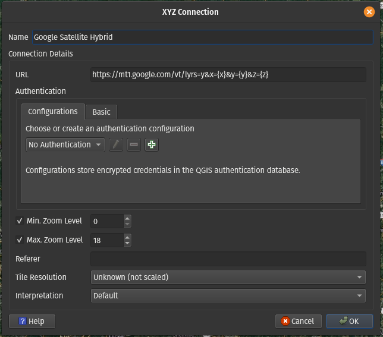

### Importing the County data

We can simply import the `kml` file we got from the county earlier.

Once this data is added as a layer, we can find basically a copy of the boundary lines from the QPublic interface within `QGIS`:

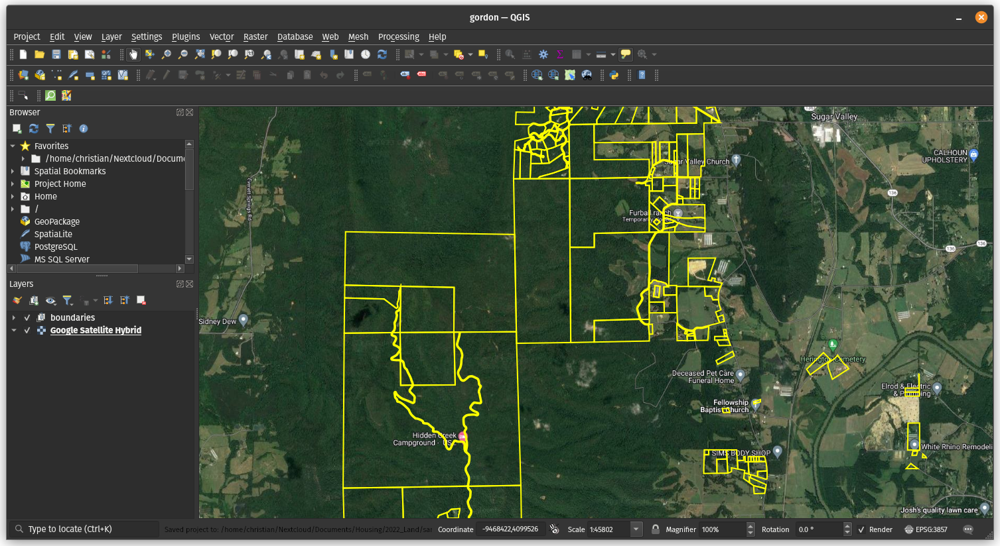

Layers can also be styled, but we'll leave it as bright yellow for now. Please note that these tend to not live up to surveys, but we'll get to that.

### Switching out the base layer: Georeferencing JPEGs and PDFs

County lines on top of Google Maps is useful, but how about some historical data? No problem, the old aerial photography we've downloaded earlier shall serve as a proxy for a scan of a land survey you will need to get as a prospective buyer (or owner), and these tend to not have any geospatial information attached to them. Being able to map a property survey onto the map is extremely helpful, but really, adding coordinates to any form of non-geotagged image-file is useful. This process is known as "*georeferencing*".

This process works by picking some known coordinates, such as landmarks, county lines, or old roads, and attaching coordinates to them, which then can be used to interpolate the rest of the coordinates on the image. Just make sure that the old thing you pick still exists on a modern map - even county lines can change! The story of [this](https://en.wikipedia.org/wiki/Milton,_Georgia) wealthy Atlanta exurb's county can tell you a [tale](https://en.wikipedia.org/wiki/Milton_County,_Georgia) about that.

Since the maps here are low resolution, we can pick some recognizable points (e.g., county lines crossing highways) and grab the coordinates from Google Maps. This works **much** better on smaller images, where you often can pick out bends in roads or other local landmarks to grab relatively accurate coordinates from (or even do this in the field). Remember that the input and target CRS are not the same when doing this from Google Maps.

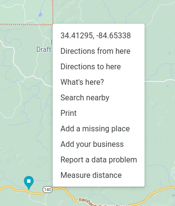

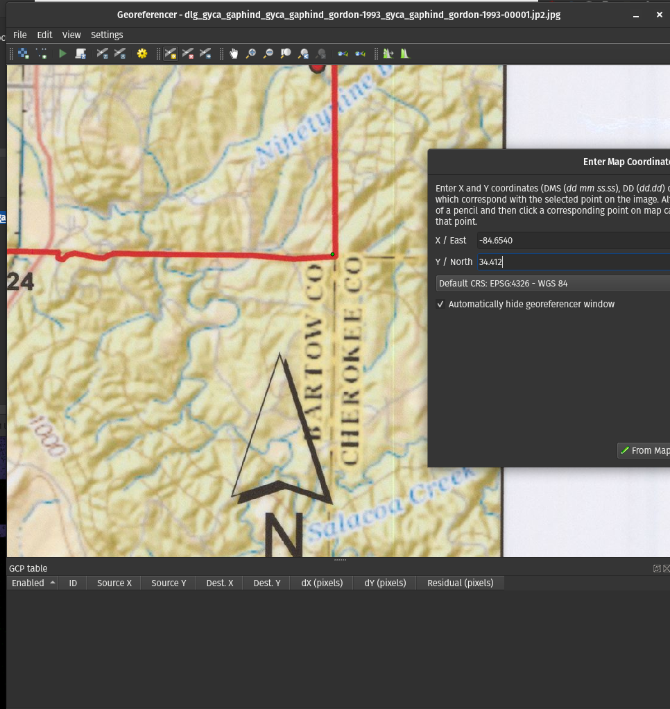

And we get a neat overlay, albeit as exact as I promised (due to the inaccurate source of coordinates - I used county lines, but the line on the image is probably 100ft wide in real life):

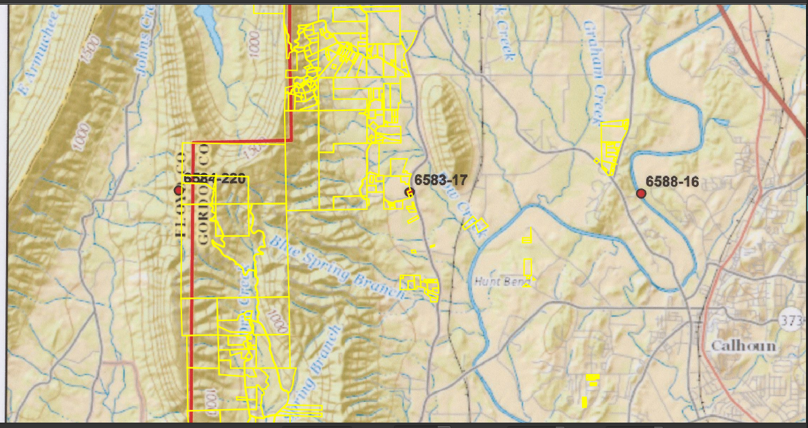

Do, however, keep in mind that the county GIS data is almost always inaccurate to a degree. Here's a real screenshot from my property survey (which I georeferenced very, very carefully) overlayed with the county's online GIS records:

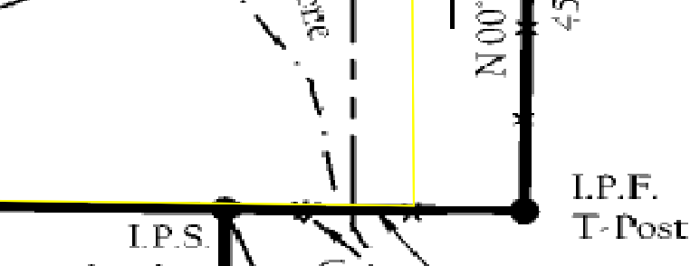

We'll re-visit "Why online data doesn't replace a survey" in a bit.

### Adding Elevation Data

Back to building maps, adding the raw DEM files we grabbed earlier provides a heat map of the elevation, which comes in charming grayscale:

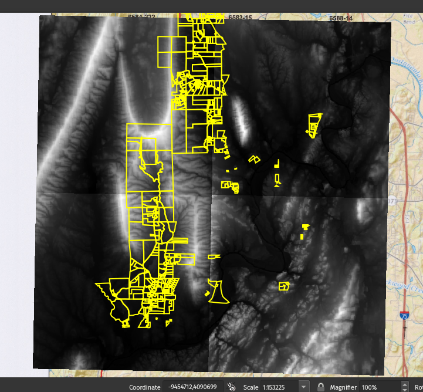

This doesn't look like it, but this data is very high reslution.

Fortunately, basically everything in `QGIS` can bes styled to your heart's content:

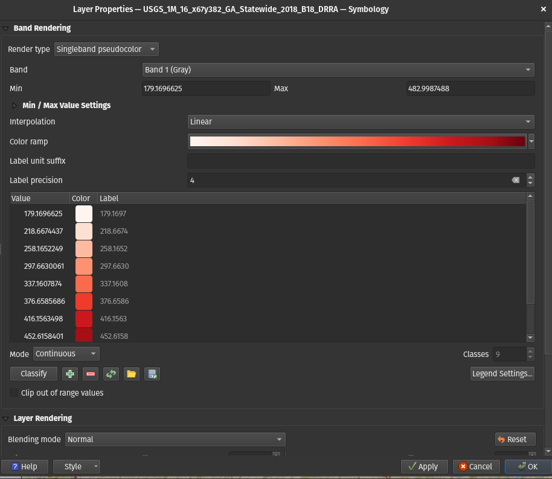

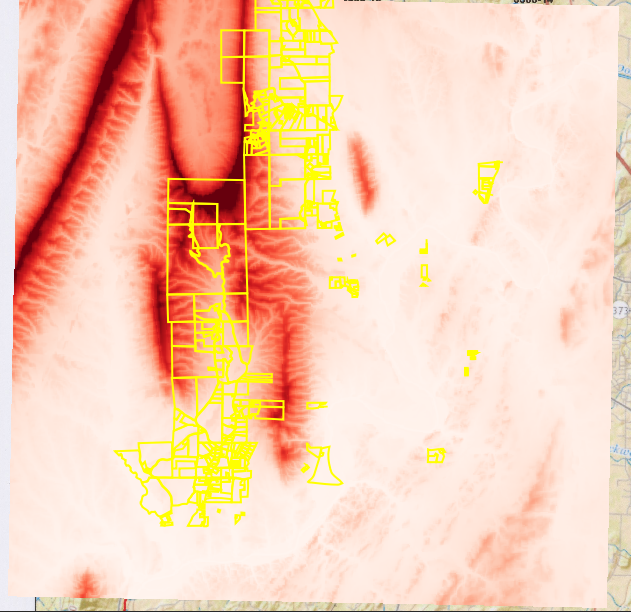

This is a nice for an overview of thousands of acres, but since the data here is available with a resolution of **1m**, that's high enough of a resolution to figure out **individual camp or home sites**.

`QGIS` can use `gdal` under the hood to turn all these elevation points into human-readable contour lines:

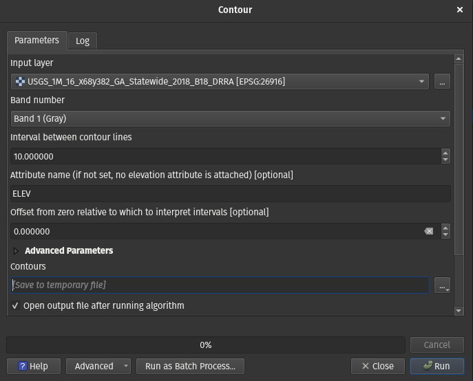

Which really runs:

```bash
gdal_contour -b 1 -a ELEV -i 10.0 -f "GPKG" USGS_1M_16_x68y382_GA_Statewide_2018_B18_DRRA.tif USGS_1M_16_x67y382_GA_Statewide_2018_B18_DRRA.gpkg
```

And results in turning the various color shades into distinct elevations:

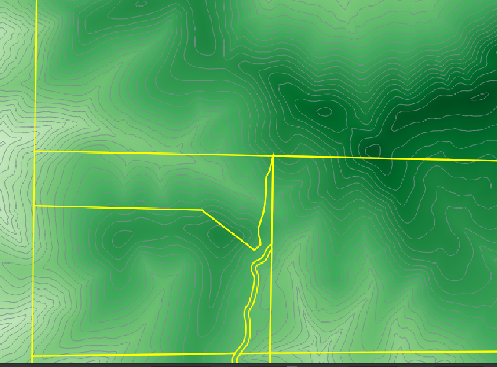

The result can be styled further - we can add [labels](https://opensourceoptions.com/blog/how-to-create-contour-lines-and-labels-with-qgis/), for instance:

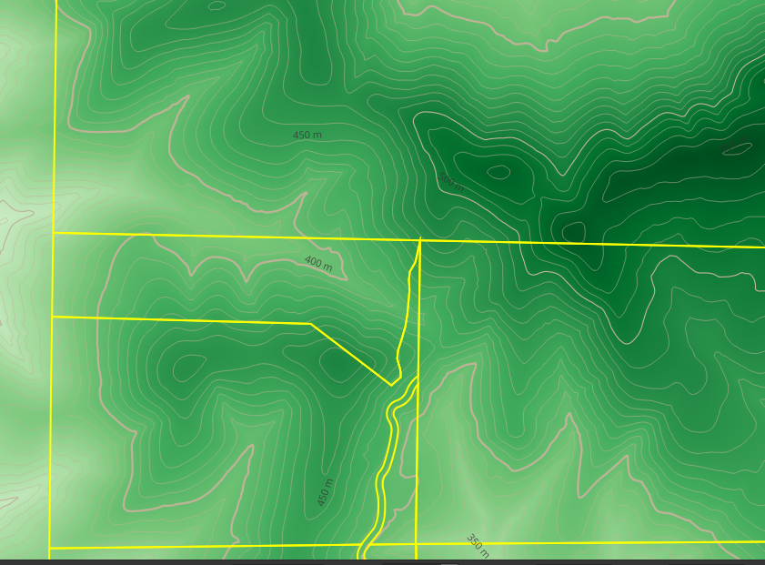

Or even build hillshade maps:

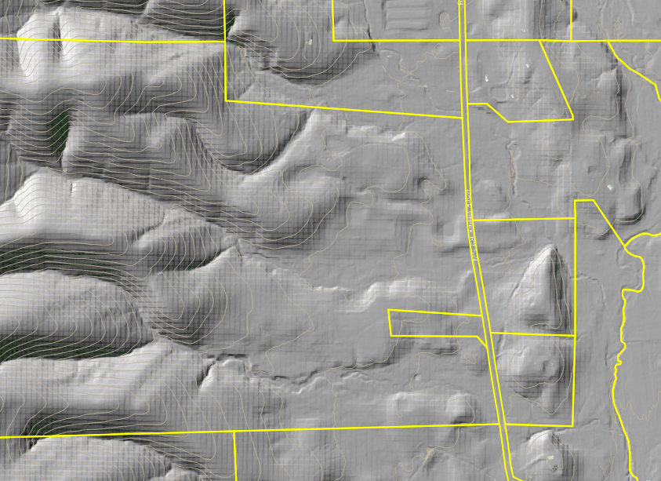

Especially on a zoomed out map, this trumps everything you'll find on Google Maps:

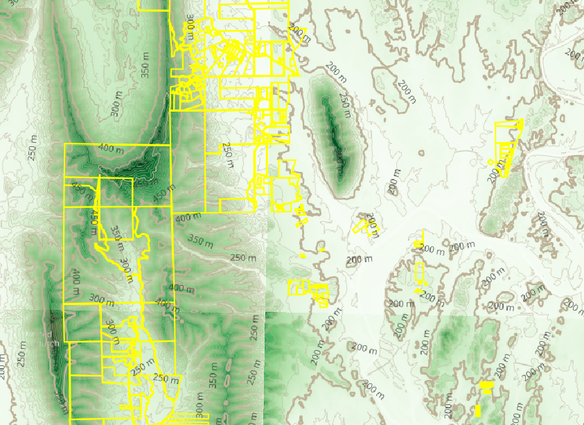

And if you don't zoom out, you can easily analyze slopes for even smaller lots and gauge e.g. the ability to build, like on this ~10ac lot:

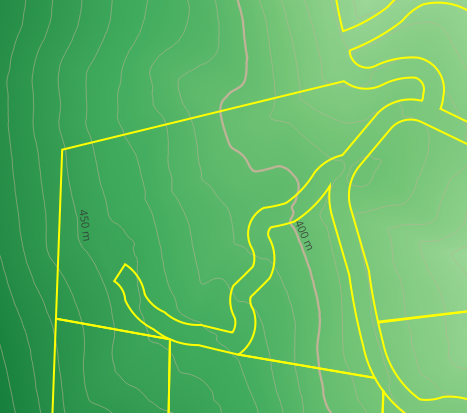

I've used high-resolution DEM data to find local plateaus that map to former logging sites and roads, which I then proceeded to find in the real world. 

### Soil Data

Soil data is presented to us common peons as `shape files` - polygons with metadata in this case - but an extensive data model exists [here](https://www.nrcs.usda.gov/resources/data-and-reports/ssurgo/stats2go-metadata). The both good and bad thing is - the data model is very complex, since `shp` files are a very powerful, but very "low level" tool and format. We'll focus on one field for simplicity - `MUSYM` - "the symbol used to identify the soil map unit comp on the soil map" ([source](https://www.fsl.orst.edu/pnwerc/wrb/metadata/soils/ssurgo.pdf)).

This data does come with a variety of shape files, including tables we *could* join the `MUKEY` (the foregin key) on to get more details, but even if we do that, we still do not have an inherent color scheme based on text based data. We could maybe grab some aggregated data and map it against quantifiers such as "Farmland class", but I can't say I'm in the mood to untangle a massive database model if all I care about is "What soil to I stand on".

Fortunately, `QGIS` can help us classify data based on standard color scale - in this case, simply lexicographically sorted - and make the map legible:

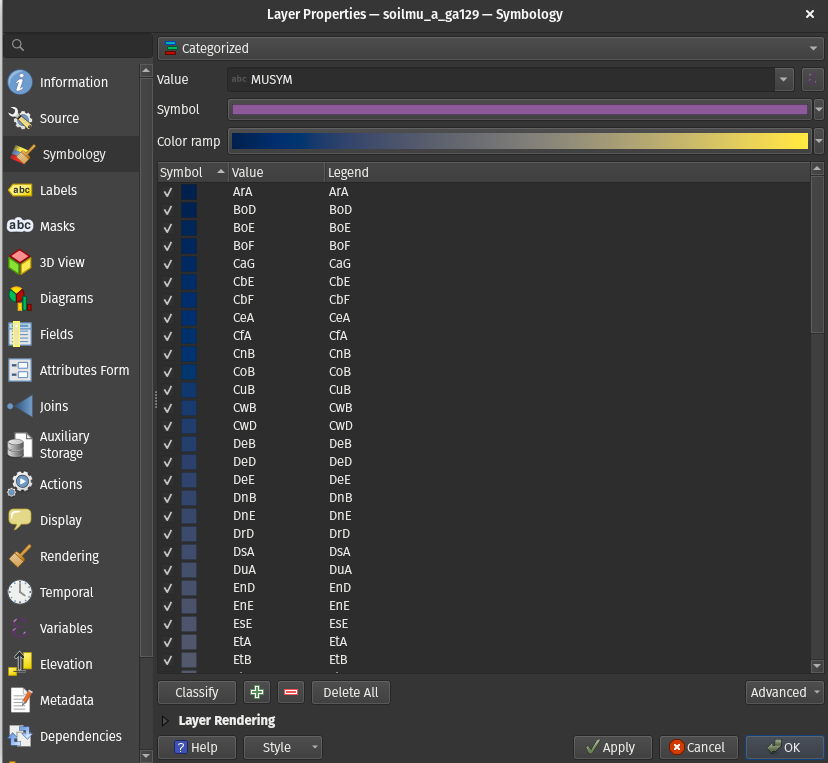

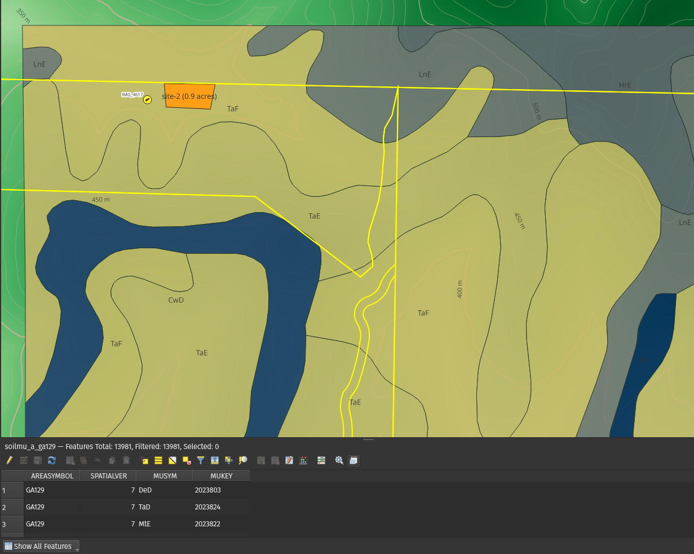

So even if you don't want to join the different shape files and change the labels to build a super-duper useful, standalone map, *features like these make the data useable*.

You can still look up stuff such as farmland [class](https://casoilresource.lawr.ucdavis.edu/soil_web/ssurgo.php?action=explain_mapunit&mukey=562864) manually online. In this example, the "TaF" in the example above maps to [this](https://casoilresource.lawr.ucdavis.edu/soil_web/ssurgo.php?action=explain_mapunit&mukey=2023790) composition. Not every piece of information does necessarily need to be *on* the map for it to be useful for us!

## Bring the map to life: Custom Data

This is all very neat (and, needless to say, only the very tip of the Iceberg). But where `QGIS` really shines is when you combine public data with your *own*.

### Add geospatial features

Since `QGIS` simply imports and adds metadata to a bunch of existing geospatial files, it's very easy to add custom features. Things that I've used most are twofold:

- Points to flag certain geographical features (e.g., where a gate would be or is)
- Polygons to mark areas (potential homesites or easements where I'm restricted in what I can do)

For instance, we can simply use `QGIS` to *create* a shapefile (similar to the soil data - which, of course, can also be read in `Python` + `folium`, for instance) with custom metadata:

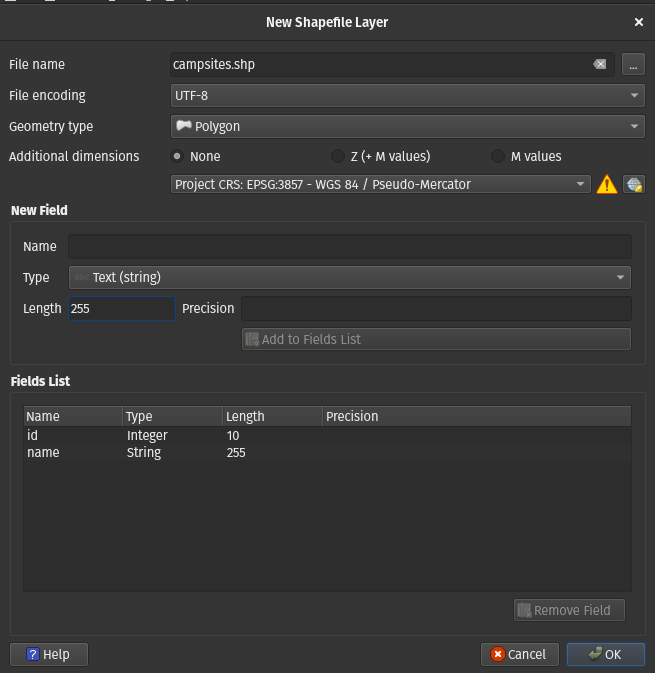

We can then use this to draw custom shapes, like this fictional campsite:

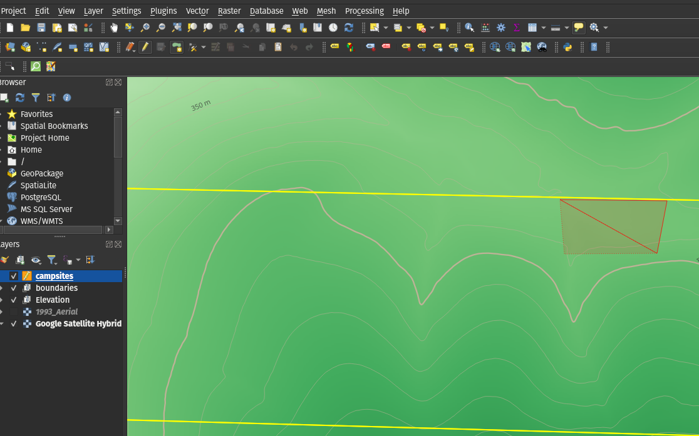

Even better, we can auto-generate metadata with a very handy function editor:

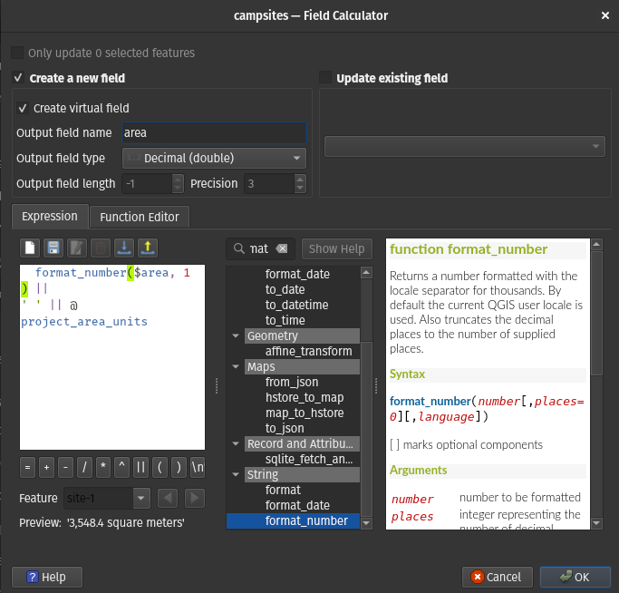

And create custom annotations via styling:

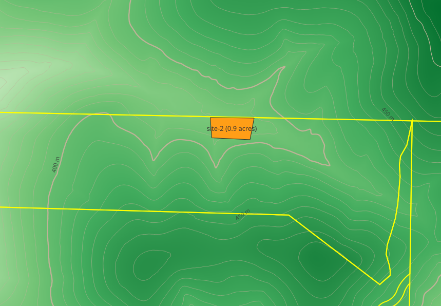

And outline a potential ~3,900sqft camp site on the property.

### Add Photos

Most (if not all) modern phones tag GPS information to the pictures they take. While the quality of that GPS information isn't amazing - more on that in a second - it's more than good enough to put your pictures on a map.

Take this photo, which I've taken in a public WMA and edited the GPS location on, since I don't happen to have photos from the property we've been using here handy:



The metadata looks like this:

```bash
❯ exiftool IMG_4617.JPEG | grep GPS
GPS Latitude Ref                : North
GPS Longitude Ref               : West
GPS Altitude Ref                : Above Sea Level
GPS Speed Ref                   : km/h
GPS Speed                       : 0
GPS Img Direction Ref           : True North
GPS Img Direction               : 237.6976776
GPS Dest Bearing Ref            : True North
GPS Dest Bearing                : 237.6976776
GPS Horizontal Positioning Error: 4.698147517 m
GPS Altitude                    : 898.2 m Above Sea Level
GPS Latitude                    : 34 deg 32' 6.03" N
GPS Longitude                   : 85 deg 5' 16.33" W
GPS Position                    : 34 deg 32' 6.03" N, 85 deg 5' 16.33" W
```

Importing these photos into `QGIS` is not very spectacular:

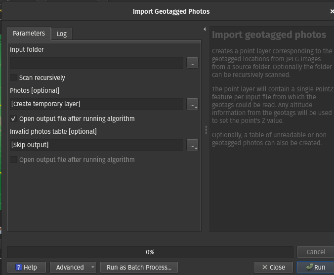

And simply appends a geo database to the project and adds a point on the map:

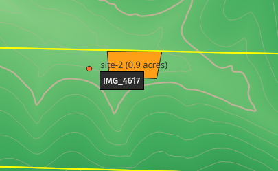

### Customize Photos & GPS Error

But, as we've seen before, we can tap into the combination of endless metadata + a capable scripting editor to add -

- Direction (bearing)
- A preview
- GPS accuracy

Before we can do this, let's re-format some metadata in the database.

To keep this portable, I've come to add something like this as a virtual field, since I've had trouble opening files on different computers: *[1]*

```
'file://' ||   file_path( @project_path)  || '/photos/' || "filename" || '.JPEG'
```

To add a semi-portable path, as the other attributes always refer to an absolute path and we need the `file://` prefix in a second:

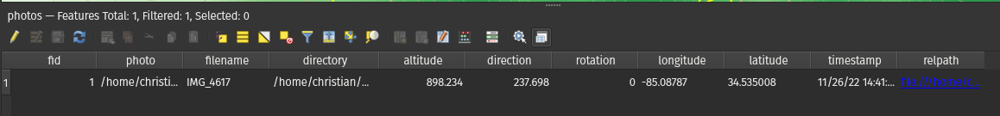

Next, we can extract raw EXIF metadata, namely the positioning error:

```
 exif(  replace("relpath", 'file://', ''), 'Exif.GPSInfo.GPSHPositioningError')
```

We can then use this data to apply *conditional styling* and change the format of the dot to something like this:

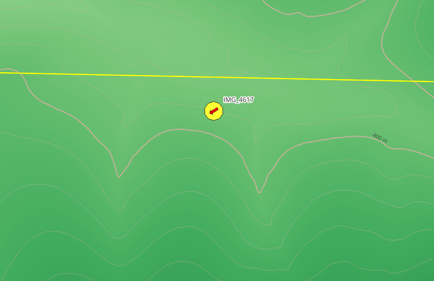

By making the color a function of `gps_error` (in meters):

```basic
CASE
  WHEN "gps_error" <= 3 THEN color_rgb(0, 255, 0)
  WHEN "gps_error" > 3 AND "gps_error" < 8 THEN color_rgb(255, 255, 51)
  WHEN "gps_error" >= 8 AND "gps_error" < 20 THEN color_rgb(255, 180, 51)
  ELSE color_rgb(255, 0, 0)
END
```

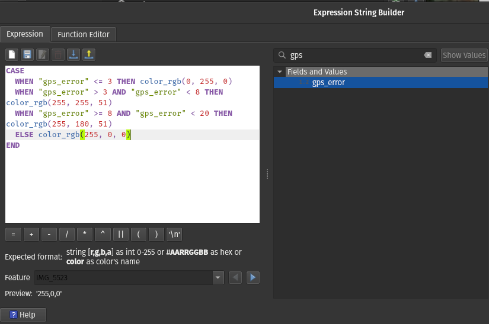

And adding an arrow as a function of bearing (so we know which direction the image was taken at, which is incredibly important in dense forest):

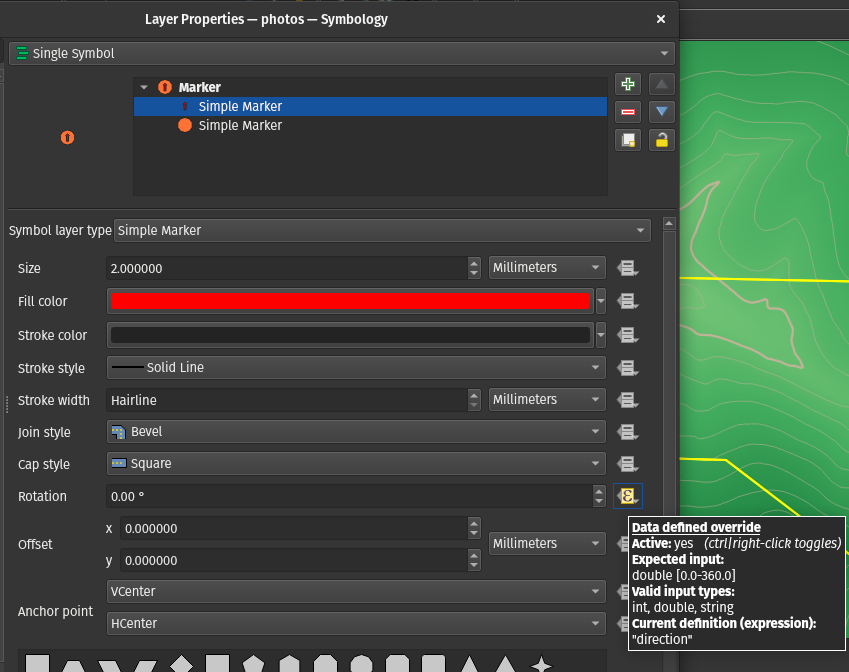

While a marker itself is now arguably much more information dense, we still don't see the picture itself. For that, we can actually - terrifyingly so - use  `HTML` that has access to all our layer metadata:

```html
<a href=[% "relpath" %]>
	
</a>
```


This enable a neat tool tip that links to the actual file and the result looks like this on hover:

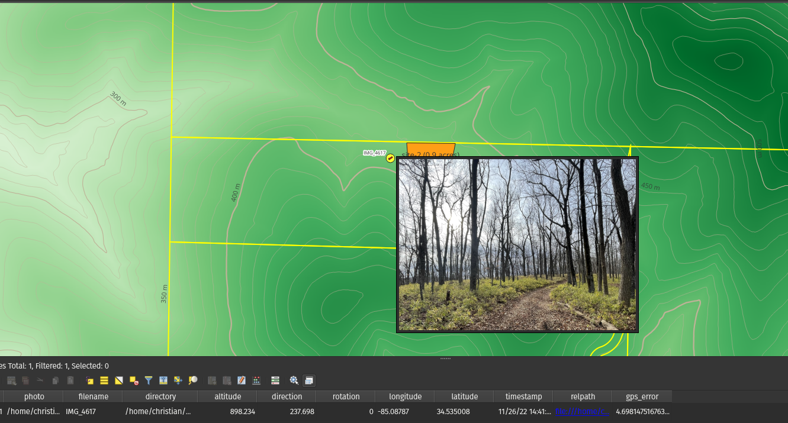

Worth noting, you can also use actual `Python` scripts at this point to do even more magic, but I haven't dabbled in that just yet.

*[1]: Just for completeness' sake - I have the project file on `Nextcloud` and it usually works like a charm on a synced drive. Paths, however, can be finicky.*

### GPS Accuracy Metadata is very helpful

And finally, here's a real life example and something that ties this back to the survey comments from earlier - a picture I took marking the boundary of my real property suffering under a bad GPS connection, now being marked as 200+ feet into the neighbor's lot:

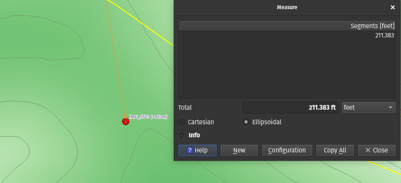

But it's bright red (and I print out the accuracy), so I know to ignore it.

This is a real, re-occurring problem - while GPS is already not accurate by design (something about ICBMs and the Cold War :) ), being in remote areas often takes a toil on the signal your phone can reasonably get. The best accuracy I am able to report is 4 meters, which is simply a circle around the roughly ~2m/6'6" accuracy GPS has with a perfect view on 3+ satellites.

I found a mobile deer stand on my land, which (based on the property boundary markers I've seen) should be about ~25ft or so on my property. Accounting for zoom on the camera, I'd expect the GPS marker for the picture to show up ~45ft from the property line.

However, the picture I later saw on mapped `QGIS` was reported as almost *60ft* from my property line. This can be the difference between an innocent mistake and a boundary dispute (for the record, not in this *particular* case - but it is a good example why property surveys are a thing and your phone doesn't replace those).

However, it makes sense when you consider the self-reported error budget of around 4.6m or 15ft. Assuming I took the picture from 20ft away, we now have a much clearer picture - 25ft on the property + 20ft focal distance + 15ft inaccuracy => 60ft from the line.

Needless to say, the satellite photos did *not* help in figuring this out - but GPS accuracy did help tell a story:

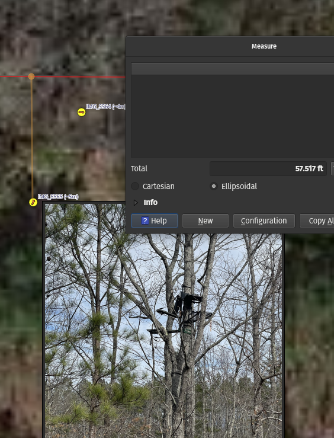

### Take the map into the field

Last but not least, did you know `GeoPDFs` are a thing? That's right, that's a `PDF` with geospatial information. `QGIS` can export them and [Avenza Maps](https://apps.apple.com/us/app/avenza-maps-offline-mapping/id388424049) can read them, meaning you can walk around on your maps. I've used this to map the property survey to real-world locations (as inaccurate as that might be) in the field:

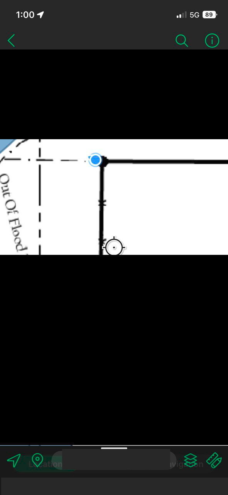

And I cannot overstate how useful that is - you can *physically* walk the map you've build, which takes it from just a curiosity, to an essential tool in navigating a pre-planned environment (e.g., we could find that perfect camp site from earlier).

## Conclusion

Nothing in this article is purely academic in nature - I use `QGIS` a *ton*. Even found a [bug](https://github.com/qgis/QGIS/issues/51480) the other day! I've mapped out both my recreational property, as well as our neighborhood, including property surveys, flood plains, easement data, and much more.

I also frequently refer to this data when I'm on said property. While buying mine, one of the first things I did was to georeference the property survey draft as `GeoPDF`, so I could walk boundary lines (again, roughly, not legally speaking :) ) before the surveyors put down the actual survey markers.

Even better, I basically find new datasets I find interesting on a  weekly basis and play around with `QGIS` to see if I can integrate them. I will admit, not all of this is useful and maybe I should spend my time learning `Rust` instead - yes, light pollution tends to be less then in a big city, I guess I could just look out the window - but it's still absolutely *fascinating*.

More than that, as a Data Engineer by day, `QGIS` + geospatial data is just like doing my job and using related tools that end-users might use (think `Apache Trino`), but different enough to be interesting. 

You're dealing with huge volumes (`1.7GiB` for the *tiny* map in this article!), a wide variety of formats (see above), normalized data (geospatial joins across shapefiles), unstructured data (photos), semi-structured data (metadata), data quality issues (see above for that whole spiel about GPS accuracy), and you're very much linked to the real world. It's a fun challenge with much more tooling support, but just as much hidden complexity as you'd have, say, screaming at `Kafka Connect` during the day.

*All development and benchmarking was done under GNU/Linux [PopOS! 22.04 on Kernel 6.0.12] with 12 Intel i7-9750H vCores @ 4.5Ghz and 32GB RAM on a 2019 System76 Gazelle Laptop, using* *`QGIS`* *`3.28`.*
