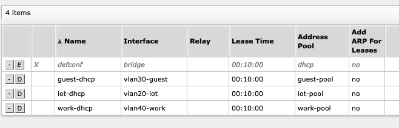
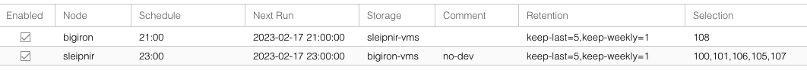

## Introduction

In 2019, I [built a home server](/blog/2019/04/building-a-home-server/). It was pretty fun. Consumer hardware running Debian, all contained in a 19" Rack. 

It continued to hum along, basically unchanged (except for some RAM), serving a `PiHole` (DNS + DHCP), a `UniFi` controller for WiFi, `smb` shares for network drives (including `TimeMachine`), data backups, `duplicati` for system backups , a `wikijs` instance, and a bunch of rather short-lived experiments, such as a `Kafka` cluster. 

A heavily used system, but not one without many flaws - it is safe to say that I learned quite a bit about running servers these past 4 years. It is also safe to say that I am **not** a network or datacenter person, but like any software engineer, I know *just* enough to be dangerous.

This setup was never ideal, for a variety of reasons (most of which we'll go over in this article), but the migration wasn't without hiccups - and this article will walk you through why that was.

And before you ask, yes: This could have been an off-the shelf NAS, but that would have been way too easy.



## How it started

To explain some of my ailments, allow me to first walk you through the way everything was set up in the before times.

We'll talk about two different things: The overall *network* and the spot the server has in it, as well as the *server* itself, including the logical *data layout* (and why that demands special attention).

### Network

Now, this is more of a sketch than anything, but you probably get the idea:


The hardware is simple: XFinity Modem Box in Passthrough mode, to an ethernet-only router from Mikrotik, via SFP+ to a Mikrotik switch, from there into the wall and all throughout the house, as well as to an older Luxul PoE switch that powers 3 Ubiquiti AP 6 Pro Access Points.

The primary network - matter of fact, the *only* network - ran on subnet `192.168.1.0/24` (more on that below). Bunch of devices connected via ethernet, the rest via 3 Ubiquiti APs on a single WiFi network.

Connectivity works as follows:

1. Device talks to WiFi Access point
2. That routes through the PoE switch, to the regular switch, into the router
3. Device to the router, router has a DHCP Relay configured, pointing the client toward `bigiron.lan` to get an IP
4. On subsequent requests, the router also tells it to ask `bigiron.lan` to resolve DNS
5. ???
6. Profit

`bigiron.lan` also hosted a simple `nginx` server with links to various services, such as the `pihole`. All on the same host, of course.

This setup is easy to understand and, as far as I can tell, basically what you'd get with a regular Ubiquiti setup, which aren't that uncommon for at-home use - only that you'd probably run everything through one UniFi PoE switch + controller (like their [Dream Machine](https://store.ui.com/collections/products/products/dream-machine-se)) and have the Ubiquiti gear do more routing for you. 

Following the UniFi channel at work, you can do some really neat stuff with that, but I have a soft spot for tinkering with stuff, so that would be *way* too easy.

From a hardware perspective, I'm using mostly Mikrotik gear, because RouterOS is the most configurable networking OS you'll probably ever find and their Wiki rivals the Arch Wiki in some aspects. Not that I need most of that, but once you use even *one* of the more advanced settings, you'll never go back to consumer hardware.

The gear I'm using also uses SFP+ for all ethernet routing, which gives a sleek 10GBps throughput for all ethernet clients simultaneously, which is very important for big file transfers and backups running in parallel to regular operations. The switch was cheap and manages some impressive [throughput](https://mikrotik.com/product/CSS326-24G-2SplusRM#fndtn-testresults) for $160:



The PoE switch doesn't have SFP+, but since it only powers WiFi, Gigabit is (realistically) enough. 

Overall, if you were to hand me a 48 port PoE+ 10Gbps switch, would I complain? No, surely not.

But I won't upgrade any time soon on my own, except for maybe testing out a small 2.5Gbps subnet with a tiny, non-rack mounted switch, since I wired the house for Cat 6a and, theoretically, could take advantage of that with an extra switch, a 2.5Gbps PCI-e card and a Thunderbolt adapter for my laptop. 

With that said, the rest of the article will touch on the topic of networking, but mostly from a resiliency perspective; the physical routing is (mostly) fine and the hardware is enough for a small business, so I'd wager to say it can sustain 2 laptops during business hours.

### Server 

The server itself isn't super powerful - Ryzen 2200G with 4 cores, 32GB non-ECC RAM - but nothing to overly complain about. While it's clearly powerful enough to run daily tasks at basically no utilization, it does struggle when it comes to offloading heavy tasks (think compiling a codebase as part of a build server). Realistically, though, the biggest bottleneck is disk I/O, and that won't change any time soon - I'm not Linus Tech Tips and can't set up an SSD-only data server. 

The bigger issue was the way the machine was set up software wise: Vanilla `Debian` with a mix of bare metal software and `Docker` containers, with a bunch of helpful scripts and a whole lot of system users. This system was, in essence, not reproducible - after years and years of experiments, trying out new software, thinks breaking, and other things needing to stay consistent (especially the network software), everything that couldn't be moved in-place (like a `Docker` container) or had a configuration export was, as far as I'm concerned, ephemeral. 

Some of this stuff was scripted properly, others was an exercise of `history | grep $thing` (I don't believe in CTRL+R), which is also not brilliant.

Sure, you *could* make a clean copy happen and `dd` everything to a new box, but that simply wasn't something that any sane person would undertake.

One of my colleagues actually convinced me when it comes to the advantages of `NixOS`, but that would have been an equally as daunting migration for me. And I'll be a whole lot faster at fixing issues with `Debian` (and derivatives) then on any other OS, purely due to experience, which I found somewhat important for a 24/7 machine I *actually* want to use.

### Data Layout

The even more pressing issue for me was **data**. I am one of those people that never throws data away and even have high school homework saved somewhere, since you never know when you will need *that* again. Needless to say, I am also somewhat attached to it and have quite a few copies all about the place, including off-site backups.

All the data resided on `bigiron.lan` and 2 external hard drives (1x 5TB, 1x 8TB) served as backups. The internal drive were identical pairs of 6TB, 3TB, and 1TB, connected to an ancient PCI-e-to-SATA card, which I am reasonably certain pre-dates the *introduction* of PCI-E 3.0 (not that it makes a difference). Don't tell me you don't need that mystery box of cables!

> I’ve also added some existing hardware, like 2x 1TB Samsung HDDs and a PCI-to-SATA extension card.
>
> https://chollinger.com/blog/2019/04/building-a-home-server/#hardware

The drives were all formatted as `ext4` with `LUKS` encryption without any LVMs - including the root drive - mounted as separate mount points as `/mnt/${CAPACITY}TB`. 

This resulted in situations like this:

```bash 
root @ bigiron ➜  8TB_LUKS_ext  find . -maxdepth 3 -type d -iname "backup*"
./6TB/Backups
./3TB/backups
./1TB/Backups
```

Were, due to size constraints, each drive had a form of `backup` folder with different datasets. Some were targets for `duplicity`, others for `rsync`. This layout was replicated to the external drives via something like:

```bash 
rsync --progress --numeric-ids  --no-compress -avHAXS /mnt/6TB/ /mnt/8TB_LUKS_ext/6TB/
```

Which, as you can guess by the volumes, excluded backing up certain folders on the 5TB external drive, since that lacked space.

The mount drive used `Debian`'s default layout across partitions, which resulted in a ~9GiB `/var` partition which got filled up so frequently that I symlinked `/var/docker` to a hard drive. One time, audit logs in SMB caused the server to deadlock, since `/var/log` filled up. 

Increasing partition space (or changing the layout in general) was a terrifying prospect since, as I've outlined above, the system wasn't *reproducible*. Sure, the *data* was backed up constantly, but the OS wasn't. Messing this up would have meant setting up the entire server again, including all stupid little experiments (want to try `Kafka` transactions? Have a `Kafka` cluster!). A `ln -s` was much, much, much easier.

## Goals for the Redesign

So, needless to say, there were plenty of concerns to address! I only touched on a handful above, so here's the full list:

### Network

- Abstraction & Security
  - Establish VLANs and separate use cases - no work computer needs access to the home server: Work, IoT, Guests, Home
- Usability
  - Make the system accessible via more WebUIs and less obscure config files where you forget the path every 2 months
- Redundancy/WFH
  - Provide *physical* redundancy to ensure we are online, even if the power goes out - coax usually carries separate power, so you can be online even if the lights are out
  - Remove the Single Point of Failure in form of the PiHole, to make sure we're online in case of software issues or hardware failures

### Server 

- Usability
  - Make the system multi-user friendly - provide separate SMB shares for different users (rather than one share with `allowed users = christian`), actually use NFS shares for POSIX devices etc. 
- Overall 

  - Use a modern filesystem, such as `zfs` or `btrfs`. I want snapshots for my data at the minimum.
  - Get rid individual data pools as RAID-1 mirrors, allow for a large, striped, redundant pool (`/mnt/6TB`, `/mnt/3TB` etc. should all become `/mnt/tank`). Ideally, do this with new hardware and retire the old drives
  - Based on that, clean up the paths and data - no more `/mnt/6TB/backups/system76` and `/mnt/3TB/backups/timemachine` because I ran out of space)
  - Mirror this pool on separate hardware as a full backup - have the same capacity on the backup server as the main server, if not more

  - Migrate from `Plex` to `Jellyfin` because requiring me to have a cloud account for a locally installed service is simply silly
  - Docker ALL the things - no more mix of bare-metal and container hardware. *Exception*: Database servers

### Data

- Abstraction & Security

  - Abstract more things - like good software design, an interface should be what I interact with, and not with implementation details (such as which hard drive I write this backup to)
- Backups

  - Ensure data backups are *automated*, 24/7/365. Connecting an external hard drive manually does not meet this criteria
  - Make sure everything is backed up, including `docker` containers, config files, and shitty one-off scripts; if need be, add capacity 
  - *Simplify* backups: Consolidate `rsync`, `duplicati`, `TimeMachine`, and `rclone` jobs
  - Make backups and disaster recovery easier to test
- Redundancy/WFH

  - Automate SMART checks and set up reasonable alerting

We'll talk about some of these points in more detail soon.

## New Tech: Proxmox and TrueNAS

Before we get to the re-design, let's talk about some services that will make up the foundation of the new architecture.

### Proxmox

> **Proxmox Virtual Environment** (**Proxmox VE** or **PVE**) is a [hyper-converged infrastructure](https://en.wikipedia.org/wiki/Hyper-converged_infrastructure) [open-source software](https://en.wikipedia.org/wiki/Open-source_software). It is a hosted [hypervisor](https://en.wikipedia.org/wiki/Hypervisor) that can run operating systems including Linux and Windows on x64 hardware. It is a [Debian](https://en.wikipedia.org/wiki/Debian)-based [Linux distribution](https://en.wikipedia.org/wiki/Linux_distribution) with a modified [Ubuntu](https://en.wikipedia.org/wiki/Ubuntu) LTS kernel[[5\]](https://en.wikipedia.org/wiki/Proxmox_Virtual_Environment?useskin=vector#cite_note-5) and allows deployment and management of [virtual machines](https://en.wikipedia.org/wiki/Virtual_machine) and [containers](https://en.wikipedia.org/wiki/OS-level_virtualization).
>
> https://en.wikipedia.org/wiki/Proxmox_Virtual_Environment?useskin=vector

What this means in human speak is: Proxmox is a type-1 hypervisor for virtual machines with a neat web UI to control them, run backups, monitor, and do fun stuff like set up clustered file systems, administer ZFS, set up firewall rules, or set up highly available / redundant machines. 

Using Virtual Machines is the abstraction I mentioned earlier - they allow me to have self-contained Linux systems that serve a specific purpose that can be backed up wholesale and snapshotted internally, meaning something like a major Debian update can simply be tested out in a clone of a VM, rather than restoring a backup into a local VM and seeing what happens (which I used to do) .

VMs, of course, have been the de-facto standard in enterprise forever, but at home, I always found the overhead (in terms of memory and storage) to be not worth it. This time, however, I am convinced - Proxmox makes it convenient enough for me to bother. 

A great example are automated backups via the WebUI:


Each server backs up their VMs onto the respective *other* server, onto a `zfs` pool that's shared via `nfs`, all set up via the `proxmox` UI. 

### TrueNas

In addition to having `Proxmox` as a pure Hypervisor (with auxiliary functions, such as backups and clustering), I've also wanted to get out of the business of managing `smb`, `nfs`, `zfs` snapshots, backup retention,`ACLs` (...) via SSH. These are all very, very well established patterns with very little variation, so not using a GUI with established best practices for this seemed silly - just google how to set up a `macOS` compatible `smb` share for TimeMachine and ask yourself if copy-pasting obscure `smb.conf` settings is worth your time.

And `TrueNas` does exactly that - it's a BSD (TrueNAS CORE) or Debian (TrueNAS SCALE) based OS that ships with an opinionated GUI and does all the things I called out, plus has a plugin system to run containers on top of Kubernetes. 




### OpenMediaVault

One alternative that I originally ran was `OpenMediaVault`, or OMV. I personally, however, found the experience a lot rougher around the edges. OMV is much less opinionated than TrueNas (which disables `apt`...), but is dependent on *plugins* for `zfs`, which is a first-class citizen in TrueNas. After learning that periodic snapshot replication is done by means of basically cronjobs + shellscripts, I installed TrueNas on a parallel VM and patched the `zfs` pool through that VM instead - and stayed with it. It is, however, entirely possible I'm missing some killer feature OMV has that I didn't see (or need). Honorable mention, in any case.

## The Redesign

As a word of warning - the actual redesign is an artifact of me replacing my aging System76 laptop with a new Macbook Pro, since the System76 machine got about half an hour of battery life (sometimes more, sometimes less), weighed about 6lbs, and had many, many annoying software quirks. Also, the ball bearings in one of the fans are failing, so the thing got terribly, terribly loud. 

I really admire the company - they do a ton of cool OSS work -  but that laptop was clearly EoL.

This left me with a very powerful machine - Intel i7-9750H with 6 cores and 12 threads, 32GB of DDR4-2666 RAM, and a GTX 1660Ti, all alongside 1.25TB NVMe SSD storage and 2TB of spinning disk storage. Also one with, basically, an internal UPS - the laptop battery. 

I did originally plan to *build* another server: 12 cores, 64-128GB of ECC memory, proper HBA card for PCI-e to SATA, new, high capacity, helium filled drives... you get the idea. However, the idea of spending something north of $2,000 wasn't super exciting, and neither was the idea of very loud, very power hungry used enterprise hardware. So, I wound up with the laptop as a centerpiece. Neat - zero cost network upgrade (or so I thought).

### Network

The first step was toto simply add VLANs, i.e. isolated, virtual networks for IoT, Guests, and Work. This was easy, since all the hardware already supported this.


Non ID 0 VLANs use external DNS (such as Cloudflare) and the routers DHCP servers:



And run on a different subnet, meaning they cannot talk to the internal DNS on the old server anyways. Each subnet maps to a separate WiFi network. No physical ethernet jacks are in specific VLANs yet, every port is set up as a trunk.

This was simply to separate use cases and avoid issues with the PiHole blocking things that the Internet Of Shit needs to run. While I avoid these devices, sometimes they do sneak in; if they do, they get thrown into a VLAN jail. 

### Server

Having a single server - `bigiron.lan` - made way for a mini-cluster:


The first obvious addition is a new server, called `sleipnir.lan`, named after Óðinn's horse from Norse Myths. A workhorse with many (eight, to be precise) legs. Would be funnier if the laptop had 8 cores, but you can't have everything.

The other rather obvious change is the use of a `Proxmox` cluster (a fancy Hypervisor - more on that later), alongside a whole bunch of virtual machines, all doing a very specific thing:

- `nas.lan`  is a pure NAS - network attached storage - that provides storage access. Implicitly, this also means `smb`, `nfs`, and other network targets. Runs `TrueNAS Scale`.
- `dvalinn.lan` - named after another Norse, this time a dwarf, whose name means "the slumbering one" - is the redundant copy of `nas.lan` - all it does it accept backups. Also runs `TrueNAS Scale`.
- `pi.lan` runs the PiHole, DHCP and DNS. Runs `Debian`.
- `unifi.lan` runs the Ubiquiti controller software. Runs `Debian`.
- `db.lan` runs a `MariaDB` database for all hosts that need one. Runs `Debian`.
- `gaia.lan` - not named after the greeks, but rather Horizon Zero Dawn, but you may *pretend* the naming scheme is more elaborate - runs services that do not warrant their own VM, where the memory and storage overhead exceeds their usefulness. Examples include `wiki.js`, `gitea`, or `Jenkins`.
- `dev.lan` is a development box that is reasonably fast, but runs proper `amd64` `Linux`, and not `MacOS` with `arm64` (which can cause issues). Think "VS Code Remote Target". Runs `Ubuntu Server`.

And before you ask, why yes, I *do* like `Debian`, thank you very much. Matter of fact, all VMs here use a template that installs stuff like `zsh`, `vim`, `git`, `oh-my-zsh`, `docker` and pre-loads user `christian` with id 1000, hardens `sshd` a bit, but otherwise stock, non GUI Debian.

### Data

The data section here builds on a core of `zfs`. 

#### zfs

Let's talk about `zfs` for a hot minute. 

`zfs` is a file system that does a bunch of interesting stuff, but for my use case, can do the following:

- Create drive pools with differently sized drives. Not *recommended*, but possible.
- Abstracts storage pools (`zpools`) and datasets (*basically* partitions with more features and a concept of inheritance)
- Can do snapshots for each dataset
- Snapshots can be backed up trivially over the network
- Protects against data corruption via checksums (but wants ECC memory, eh)
- Can do native encryption
- Is as old and boring as `ext4` and hence, has plenty of resources available online

[This](https://arstechnica.com/information-technology/2020/05/zfs-101-understanding-zfs-storage-and-performance/) is a good article talking about it. 

My main reason for choosing `zfs` (over `reiserfs` or `btrfs`) *for me personally* is the tooling support - `zfs` is ancient and, as such, well supported. Old is generally good when it comes to Linux (and BSD).

`TrueNAS` (which we'll cover later) is essentially a `zfs` UI and I found that I like `TrueNAS` more than `Open Media Vault` or the closed-source `Unraid`, which can do `btrfs` or `xfs`. `Proxmox` - also a separate chapter here - also defaults to `zfs`, but supports `btrfs` as well.

**I really have little opinion on the matter, as long as it works.** I you know me, that's rather... rare. I tend to be an opinionated fella on tech topics, but simply know too little about file system internals to argue.

`btrfs` is part of the kernel, which might be a benefit for your use case:

> The Linux Kernel is licensed under the GNU General Public License Version 2 ([GPLv2](http://www.gnu.org/licenses/gpl2.html)). While both (OpenZFS and Linux Kernel) are free open source licenses they are restrictive licenses. The combination of them causes problems because it prevents using pieces of code exclusively available under one license with pieces of code exclusively available under the other in the same binary. In the case of the Linux Kernel, this prevents us from distributing OpenZFS as part of the Linux Kernel binary. However, there is nothing in either license that prevents distributing it in the form of a binary module or in the form of source code.
>
> https://openzfs.github.io/openzfs-docs/License.html

For me, the (subjectively) better tooling support was more important than the license, but your mileage may vary.

Frankly, knowing myself, I'll probably deep-dive into `btrfs` and others at some point and see what happens, but for the time, my surface-level understanding of different filesystems is really a blessing, because sometimes "good enough" truly is "good enough" - as long as I can get away from `for $fs in /dev/mapper[a-z]; do rsync ....; done` for backups, I'm a happy camper... for now.

#### Physical Layout

No matter what file system you chose, you need to put it on a drive to use it. In this case, my setup simply re-used the existing drives: Everything is set up as a striped mirror, where each former RAID-1 array (2x6TB etc) continue to exist, but are all on one logical `zfs pool`. 

This is apparently *not recommended* (somebody on [reddit](https://old.reddit.com/r/zfs/comments/85nf1y/zfs_with_different_size_disks/dvyv4b0/) categorized multiple logical storage layouts from "sane" to "insane"), but I was not in the business of buying new hard drives, as I've elaborated earlier. This can tolerate a single hard drive loss per mirror, which is the same setup as before as far as redundancy goes, so I don't quite get the disdain for it. Even `TrueNAS` whines:


RAID is not backup, and I don't see how `zfs` or `ext4` change that.

For completeness' sake, this was done via:

```bash 
zpool create "${POOL}" \
 mirror ${DISK_1TB_1} ${DISK_1TB_2} \
 mirror ${DISK_3TB_1} ${DISK_3TB_2} \
 mirror ${DISK_6TB_1} ${DISK_6TB_2}
```

#### Logical Layout

Logically, it sets up datasets in the following hierarchy:


Which now all can provide different mount points, ACL, and retention policies. Some datasets are further subdivided, such as `tank/enc/backups` by machine. The pool also uses native `zfs` encryption, but excludes things like copies of public data from encryption (e.g., an offline backup of Wikipedia).

#### Backups

Based on this, the **backup** strategy consists of two pillars: VM images and data. Both pillars operate under the assumption that `nas.lan` is capable of mirroring `sleipnir.lan`, and vice-versa.

**VM images** are done via `Proxmox` and solve the issue of *"I don't want `NixOS` and won't be able to re-create the server otherwise!"* and back up logical machines, including all configuration, users, settings etc. (but *not* the `zfs` pool!), so they can be replicated on a different environment. This is automated in the `Proxmox` GUI and very pleasant. Also, small volumes - we're talking about ~240GiB for backups for 7 VMs.



**Data** backups are sent to `dvalinn.lan`, which mirrors `nas.lan` with some differences:

- Its 12TB `zfs` pool has no redundancy and is a single drive
- The logical datasets are only a subset of `nas.lan`, since certain things might not warrant a backup (since `dvallin.lan` has more capacity than `nas.lan`, that point is largely theoretical)
- Each server runs periodic `zfs` backups 
- Each snapshot gets transferred from `nas.lan` to `dvalinn.lan` but, unlike VM images, not back, since they are essentially full mirrors
- Periodically, the entirety of `dvalinn.lan` gets mirrored to a 12TB external hard drive that's identical to the one that already serves at its pool, but in cold storage (and not connected permanently)

This creates three redundant copies of all data. 

Really important documents are stored off-site too. However, I don't have the upload bandwidth to mirror several TiB and maybe, just maybe, I don't *need* to backup rejected RAW photos from 2007.



## Issues along the way & Lessons Learned

Unsurprisingly, this migration wasn't exactly without issues, so I'm going to RCA a bit here for my own sanity. This is the part where you can make fun of me!

In summary, the following lessons were learned:

- A broken hard drive can cause hard kernel crashes and freezes, almost the same effect that broken RAM has on a Kernel
- Not using a Host Bus Adapter (HBA) card for `zfs` drives within VMs == bad time
- Memory Ballooning is hard
- More RAM is best RAM
- `zfs add` is a one-way operation
- Mixing block size is a bad idea

We'll go through them one-by-one.

### Proxmox: A journey of constant crashes

While setting the system up, I had a myriad of obscure issues. 

**tl;dr:** *All boiled down to a hardware problem with a hard drive*. I wasn't able to detect said hardware problem before because, presumably, I didn't interact with the broken sectors of the drive and hence, incorrectly, assumed that all was well, since writing to it worked like a charm before.

I wrote about it on the Proxmox [Forum](https://forum.proxmox.com/threads/heavy-i-o-causes-kernel-panics-deadlocks-and-file-system-corruption-on-ext4.122008). 

I'll mostly quote myself directly here in a short version:

> Every time I'm seeing very high I/O usage, my system completely locks up *or* gets Kernel Panics. I am thus unable to migrate an existing data pool onto ZFS/proxmox. I've seen posts about this here, although most are over a year old and based on Kernel and proxmox versions that are no longer applicable.
>
> ...
>
> **Details**
>
> Once I start copying ~6TB in ~15 `rclone` processes on the host (not in a VM), the system locks up or kernel panics after everywhere between 5 minutes and 5 hours. Only a physical hard reset fixes this. A physical tty session is not responsive.
>
> Original Kernel Panic:
>
> 
>
> [...]
>
> **Kernel Panic -> Freezes/Deadlocks (`xhci_hcd` ?)**
>
> I've then made the entire ZFS pool available as NFS share to a Debian based VM (via `zfs` directly), alognside an NFS share for the external drive (via old-school `/etc/export`, using `no_root_squash` and hence, said `root` user), which **had exactly the same effect** - a freeze after 2hrs. I am not surprised, but at least for me, that locates the issue firmly within kernel-space and whatever I'm doing within userspace shouldn't matter.
>
> At this point, I got a bunch of logs that all pointed towards `xhci_hcd` , the USB driver:
>
> 
>
> This is not a hardware issue (qed, see below), as this exact machine ran standard Debian for years (with a >365d uptime) and ran heavy I/O every night (incoming backups from several machines) as well as right before the migration (I/O to the same external disk, using the same `rclone` setup, via USB). This only started after installing proxmox. The only substantial difference (besides `proxmox` instead of `Debian`) was the usage of a single, large `zfs` pool instead of 3 separte `mdadm` software RAID-1s via `ext4` + `LUKS` on separate drives. (*sic!*)

I will interrupt this to remind you again: This **was** a hardware issue - the correlation of "it ran fine all year!" is sound in itself, but also nothing restored from that backup all year, so it's also flawed. 


>
>`sdh` is the USB drive. I can't say I really understand these issues, but for me, this reads like either the drive is kaput or the USB port or controler are, or their respective kernel modules are.
>
>At this point, I've simply changed the USB port from 3.1 to 3.0, since I figured there could be either a hardware issue or a Kernel issue with this driver + USB 3.1. I find the latter very unlikely, since I use this hard drive for monthy backups of this server, but I also wouldn't bet money on me always using the same port.
>
> **File System is now corrupt**
>
>Changing that did not fix it. I've been getting a whole bunch of
>
>```
>[  +0.001284] Buffer I/O error on dev dm-0, logical block 0, lost sync page write
>[  +0.000688] EXT4-fs (dm-0): I/O error while writing superblock
>[  +2.628873] EXT4-fs warning (device dm-0): htree_dirblock_to_tree:1072: inode #127271092: lblock 0: comm nfsd: error -5 reading directory block
>[  +0.357568] EXT4-fs warning (device dm-0): htree_dirblock_to_tree:1072: inode #200474667: lblock 0: comm nfsd: error -5 reading directory block
>[  +0.764766] EXT4-fs warning (device dm-0): htree_dirblock_to_tree:1072: inode #200605711: lblock 0: comm nfsd: error -5 reading directory block
>[  +0.002122] EXT4-fs error: 11 callbacks suppressed
>[  +0.000003] EXT4-fs error (device dm-0): __ext4_get_inode_loc_noinmem:4596: inode #189137947: block 1513095265: comm nfsd: unable to read itable block
>[  +0.001141] buffer_io_error: 11 callbacks suppressed
>[  +0.000004] Buffer I/O error on dev dm-0, logical block 0, lost sync page write
>[  +0.001243] EXT4-fs: 11 callbacks suppressed
>[  +0.000004] EXT4-fs (dm-0): I/O error while writing superblock
>[  +0.000421] EXT4-fs error (device dm-0): __ext4_get_inode_loc_noinmem:4596: inode #189137947: block 1513095265: comm nfsd: unable to read itable block
>[  +0.001608] Buffer I/O error on dev dm-0, logical block 0, lost sync page write
>[  +0.000676] EXT4-fs (dm-0): I/O error while writing superblock
>[  +0.238153] EXT4-fs warning (device dm-0): htree_dirblock_to_tree:1072: inode #200605746: lblock 0: comm nfsd: error -5 reading directory block
>[  +0.176934] EXT4-fs warning (device dm-0): htree_dirblock_to_tree:1072: inode #200540510: lblock 0: comm nfsd: error -5 reading directory block
>...
>[  +0.000796] Buffer I/O error on dev dm-0, logical block 0, lost sync page write
>[  +0.000786] EXT4-fs (dm-0): I/O error while writing superblock
>```
>
>*[...]*
>
>After this, I couldn't even *mount* the drive - I'm now looking at "Can't read superblock" and other things hinting at a broken `ext4`. I killed the terminal and didn't save exact logs.
>
>I then took the hard drive out of the enclosure (breaking it, because this particular manufacturer is anti-consumer) and connected it directly via SATA, making sure the internal USB controller isn't broken (I've yet to confirm that) and ran `fsck` from a live Debian ISO, which got stuck on - as per `strace` - `FUTEX_WAIT_PRIVATE` - which could be anything). But I *think* it fixed some bad blocks (or, rather, found a usable backup superblock??) by that point, since I was able to mount it and browse some files. That, however, can be misleading - if we have a bunch of broken sectors (inodes? other magic file system words I don't really get?), you can still `ls /mnt` , see a bunch of directories, only to me met with `I/O Errors` once you `cd` into them - which is what happend before.

To clarify some things here, since I was forced to dig deeper while debugging this later:
- `FUTEX_WAIT_PRIVATE` is a synchronization syscall and yes, that could deadlock anywhere with a lot of multi-threaded I/O and hence, be anything
- A `superblock` is a block of metadata containing size, status, and layout of the file system and in the case of `ext4`, it's stored redundantly, i.e. as long as the system can read *one* of them, you should be fine. Ask me how I know 🙃
- An `inode` stores information about a file or directory. Basically, a "superblock", but for a file, rather than a whole file *system*. Could be corrupted if the hardware is corrupted.
- A bad block is a section of the (physical) disk that is damaged and cannot be read from or written to reliably. The file system makes these blocks usable *and* re-allocates data if blocks physically fail, which clearly happened here (at least somewhat) - `unable to read itable block` tells us as much

In other words, all my rambling regarding different broken parts of the hardware + file system combinations here are not *wrong* - they *were* all affected - but it didn't quite "click" yet that the underlying hardware caused all of them.


>*[...]*
>
>The last time I've seen a kernel exploding and deadlocking was with broken memory, but never by means of a broken USB port/controller, so I'm dying to find out what is going on here.

At this point, I assumed that the combination of crashes and lack of `fsck` on the `ext4` FS caused corruption in the file system or that the USB controller was faulty, so I shucked the drive and connected it via SATA.

I backed up the entire drive via `ddrescue` to a new backup drive I bought for that very purpose. After all data was rescued and safely stored on the internal `zfs` array (a handful of files needed to be grabbed from another external drive, but 99.99% got copied), I changed the USB controller, nuked the drive, set up a `zfs` FS, ran snapshots aaaand... my backup VM, `dvalinn.lan`, locked up. Once it was responsive again, the drive was... gone. Not there anymore. Direct Disk/SCSI passthrough, by the way.

Well, the kernel logs know more:

```
Feb  9 10:13:18 sleipnir kernel: [932399.816498] blk_update_request: critical medium error, dev sdd, sector 2048 op 0x0:(READ) flags 0x0 phys_seg 32 prio class 0
Feb  9 10:13:18 sleipnir kernel: [932399.818115] sd 6:0:0:0: [sdd] tag#0 FAILED Result: hostbyte=DID_OK driverbyte=DRIVER_OK cmd_age=0s
Feb  9 10:13:18 sleipnir kernel: [932399.819194] sd 6:0:0:0: [sdd] tag#0 Sense Key : Medium Error [current]
Feb  9 10:13:18 sleipnir kernel: [932399.820050] sd 6:0:0:0: [sdd] tag#0 Add. Sense: Unrecovered read error
Feb  9 10:13:18 sleipnir kernel: [932399.820902] sd 6:0:0:0: [sdd] tag#0 CDB: Read(16) 88 00 00 00 00 03 a3 80 e8 00 00 00 01 00 00 00
Feb  9 10:13:18 sleipnir kernel: [932399.821763] blk_update_request: critical medium error, dev sdd, sector 15628036096 op 0x0:(READ) flags 0x0 phys_seg 32 prio class 0
Feb  9 10:14:18 sleipnir kernel: [932459.922796] sd 6:0:0:0: [sdd] tag#0 timing out command, waited 60s
Feb  9 10:14:22 sleipnir kernel: [932464.376101] buffer_io_error: 6 callbacks suppressed
Feb  9 10:14:22 sleipnir kernel: [932464.376103] Buffer I/O error on dev dm-0, logical block 0, async page read
Feb  9 10:14:22 sleipnir kernel: [932464.377963] Buffer I/O error on dev dm-0, logical block 1, async page read
```

Mounting it greeted me with a generic I/O error that went away after a reboot, and that's when it occurred to me to look past the "SMART: PASSED" test - this drive was clearly not okay and this time, it *wasn't* the file system.

I could tell you all the other stuff I had to do and tried, I'll shorten it with this:

```
SMART overall-health self-assessment test result: PASSED

Vendor Specific SMART Attributes with Thresholds:
ID# ATTRIBUTE_NAME          FLAG     VALUE WORST THRESH TYPE      UPDATED  WHEN_FAILED RAW_VALUE
184 End-to-End_Error        0x0032   001   001   099    Old_age   Always   FAILING_NOW 420

Error 9247 occurred at disk power-on lifetime: 4079 hours (169 days + 23 hours)
  When the command that caused the error occurred, the device was active or idle.

  After command completion occurred, registers were:
  ER ST SC SN CL CH DH
  -- -- -- -- -- -- --
  40 53 00 ff ff ff 0f  Error: WP at LBA = 0x0fffffff = 268435455
```

It turns out, the file system wasn't corrupted, the drive was *actually* toast and this was, indeed, a hardware issue. I simply got lucky when writing the original backups (as well as all incremental backups). 

> SMART overall-health self-assessment test result: PASSED

That was a lie.

> S.M.A.R.T. parameter is a part of HP's SMART IV technology and it means that after transferring through the  cache RAM data buffer, the parity data between the host and the hard  drive did not match
> https://kb.acronis.com/content/9119

*However*, because this might caused by issues outside of  the drive itself, such as memory or others hardware components, this still `PASSED` the entire SMART test. A good monitor would have thrown a warning (TrueNAS [does](https://www.truenas.com/community/threads/failed-smart-usage-attribute-184-end-to-end_error.85070/), btw).

That night, I bought *another* 12TB external drive, because one contained a 8TB `ddrescue` image. We're now $400 into this "zero cost" network upgrade. Oh well - all data is safe and sound.

We'll talk more about automated SMART tests in a second, but first...

### HBA Cards are useful

One thing you should know when using `zfs`: Do **not** put middleware - i.e., a RAID controller - between a disk and the file system. Unsurprisingly, using a virtual machine with SCSI passthrough (i.e., virtual disks instead of real ones) isn't the best decision, and neither is a hardware RAID controller:

> Hardware RAID controllers should not be used with ZFS. While ZFS will likely be more reliable than other filesystems on Hardware RAID, it will not be as reliable as it would be on its own. (...)
>
> https://openzfs.github.io/openzfs-docs/Performance%20and%20Tuning/Hardware.html#sas-versus-sata

But I figured, hey, my ancient PCI-e-to-SATA bridge is fine, it worked without issues on bare metal for ages! And, if I'm honest with myself, it probably *was*. 

So, my original setup simply did this and added devices to the VM via QEMU passthrough:

```bash
qm set 104 -scsi2 /dev/disk/by-id/ata-WDC...
```

These devices would show up as virtual devices, without any SMART data or sensor information, but `zfs` would still somewhat work. Close enough... or so I thought. 

Sometimes, randomly, SATA drives disappeared. They simply didn't show up in `Proxmox` or any of its VMs.



The best way to pass through a bunch of raw hardware to a VM is an enterprise grade RAID controller like [this](https://www.ebay.com/itm/162958581156) one from ArtOfServer (who also runs a [YouTube channel](https://www.youtube.com/c/ArtofServer/about)!), flashed into IT mode, which turns off all RAID functionality (since we just established that `zfs` doesn't like that).

IT stands for Initiator Target mode and turns the RAID controller into a Host Bus Adapter (HBA), i.e. a shinier PCI-to-SATA bridge for all intents and purposes. I'm not 100% sure if the old card I used to use would have worked just as well in PCI passthrough mode.

A card like that plus a bunch of `SFF-8087` to SATA connectors runs about $110. You can find cheaper cards on ebay, but ArtOfServer provides support, tests stuff, and doesn't sell counterfeits, so you might want to think twice before saving $30. Not affiliated, just appreciative. 

Once you install the card:


You need to tell the kernel what to do - which is, ignore the card and give it to a VM - where I found [this reddit thread](https://old.reddit.com/r/Proxmox/comments/lcnn5w/proxmox_pcie_passthrough_in_2_minutes/) to be tremendously helpful for general PCI passthrough. The [RHEL](https://access.redhat.com/documentation/en-us/red_hat_virtualization/4.1/html/installation_guide/appe-configuring_a_hypervisor_host_for_pci_passthrough) wiki also helps.

I believe it boils down to this:

- Enable virtualization and IOMMU extensions in the BIOS (this is already needed for `Proxmox`)
- Tell `grub`, the boot loader, to tell the Kernel to enable the CPU's IOMMU driver
- Make sure you load the `vfio_iommu_type1` kernel module
- Add the PCI device to the VM 

The kernel module is the key part here:`vfio_iommu_type1` provides a framework for allowing direct device assignment to virtual machines using the `VFIO` driver. Once a device is assigned to a virtual machine, it becomes unavailable to the host system and can *only* be accessed by the virtual machine. This allows the virtual machine to have exclusive access to the device and can achieve near-native performance (and nothing else messes with it).

Once that's done, the VM now gets to experience the LSI controller's init code directly (rather than the host) and the disks won't be visible to the host system any longer:


The other advantage of this: We now have raw disk information, including SMART, and can automate those checks + get emails if one fails:


Hopefully avoiding issues like the one in the previous chapter all together. These checks look for errors, not just for a "PASSED" result, which is what was missing last time:


After 19,398 power-on lifetime hours, that's understandable (not great, but understandable) - the other disk had a tiny fraction of that. 

### TrueNAS: Memory Ballooning is hard

Fun fact, I saw this exact `dmesg` kernel message at work the other day:


And if you made it that far, I'm reasonably certain you've seen it, too. This is a very simple out of memory error, where the kernel nukes processes when it's low on available RAM. This happened while running `zfs` backups.

The issue here was simply to little allocated memory to the `TrueNAS` VM on `dvalinn.lan`; ballooning memory was enabled, but I simply messed up the config.

See, memory ballooning is used in virtualization to dynamically adjust the amount of memory available to VMs, based on their  usage at the time. The hypervisor can reclaim memory from idle or underutilized VMs and  allocate it to other VMs that need more memory. 

For TrueNAS, I started too low: `TrueNAS` truly *needs* 8GB; otherwise, your web UI vanishes and you won't even get logs during replications, making debugging pretty tricky. This should have been set up as "8GB min, 12GB max". Oops. 

The way you're *supposed* to set this up is to set the minimum memory to whatever is truly required, always, at all times (8GB for `TrueNAS`). Once the *host* is over 80% memory usage, it will re-claim memory from ballooning VMs until it hits the minimum configured for the guest, rather than the other way round.

Here's an experiment on a VM with 512MB to 1024MB of RAM configured and host RAM usage at 95% (i.e., it won't kick in):


```bash 
christian @ nas ➜  ~  sudo swapoff -a
christian @ nas ➜  ~  free -h
               total        used        free      shared  buff/cache   available
Mem:           463Mi       257Mi        71Mi       4.0Mi       134Mi        69Mi
Swap:             0B          0B          0B
christian @ nas ➜  ~  /usr/bin/cat /dev/zero | head -c 256m | tail
[1]    2298 broken pipe  /usr/bin/cat /dev/zero |
       2299 broken pipe  head -c 256m |
       2300 killed       tail
christian @ nas ➜  ~  sudo dmesg | tail -1
[  627.248557] Out of memory: Killed process 2300 (tail) total-vm:123608kB, 
  anon-rss:116384kB, file-rss:0kB, shmem-rss:0kB, UID:1000 pgtables:276kB oom_score_adj:
christian @ nas ➜  ~  free -h
               total        used        free      shared  buff/cache   available
Mem:           463Mi       278Mi        91Mi       4.0Mi        93Mi        66Mi
Swap:             0B          0B          0B
```

In this scenario, the setting has no effect.

Now, run the same experiment when the host's memory usage is < 80%:

```bash 
christian @ nas ➜  ~  free -h
               total        used        free      shared  buff/cache   available
Mem:           863Mi       292Mi       501Mi       4.0Mi        70Mi       464Mi
Swap:             0B          0B          0B
```

And now, we *start out* with 1GB of memory. Once the memory pressure in the hypervisor goes up, however, that memory is reclaimed and your stuff OOMs.

Note to self: RTFM.

### Buy more RAM

Unsurprisingly, running a bunch of VMs eats a lot of RAM in any scenario, since they have quite a bit of memory overhead - I managed to OOM more than once, even outside the ballooning mishap. 

I will probably transplant my laptop RAM into the server by means of a SO-DIMM adapter and buy new laptop RAM, getting the total cluster capacity up to 128GB. I'm not convinced on whether SO-DIMM Adapters (which should just be dumb pin mappings) are a good idea or not, but in any case, the laptop *needs* to max out its RAM to the full 64GB it supports, as it is currently running at 87.84% (27.29 GiB of 31.07 GiB) *without* the `dev.lan` VM.



### `zfs add` is a one-way operation

The following was another good learning experience and a good test of all my backups. 

Notice something that doesn't quite match how I described the storage layout earlier? Remember, striped `zpool` of 3 pools is what we want.

```bash
root@truenas[~/migration]# zpool status tank
  pool: tank
 state: ONLINE
  scan: scrub repaired 0B in 13:08:40 with 0 errors on Wed Feb  8 23:44:42 2023
config:

	NAME                                      STATE     READ WRITE CKSUM
	tank                                      ONLINE       0     0     0
	  8e232f61-9d27-f74b-9e12-0ba22f2a8c3c    ONLINE       0     0     0
	  mirror-1                                ONLINE       0     0     0
	    f7cac229-9b27-9a48-862e-310298988e8c  ONLINE       0     0     0
	    5859ebf2-5cfd-ae4e-bd6d-d483e3d40814  ONLINE       0     0     0
	  mirror-2                                ONLINE       0     0     0
	    b7bba239-ebf1-0f4e-b39a-868a813fc4c9  ONLINE       0     0     0
	    0f39a0c7-3f7e-1949-aae2-2428a09d8b37  ONLINE       0     0     0
	  wwn-0x50014ee2660892cf                  ONLINE       0     0     0

errors: No known data errors
```


In case you'd like to laugh at me with a more informed mindset, this happened after I migrated from SSCI passthrough (virtual disks) to throwing the VM the entire PCI device, in this case, the LSI HBA. 

Previously, the pool referred to `/dev/sdg` (which is dumb in the first place - use `/dev/disk/by-id` ...), so, uh, `zfs add` seemed like a good option to fix the degraded pool. 'twas not. I should have replaced the disk - the easiest would have been to nuke it and have `zfs` re-replicate the data. Oh well. I wisely did that migration after all backups were done an redundant, so it was a matter of letting the restore run while I slept. 

### Mixing Block Size is a bad idea (and silent)

`TrueNAS` also helpfully reminded me of mismatched block sizes for my array, ever since I replaced the the disk I called out above.

Turns out, the old disk had 512 byte sectors (aka `ashift=9` in zfs terms) and the new disks had the contemporary 4096 bytes (aka `ashift=12`). Replacing a disk via the UI used the old `ashift` value and I finally understood why people in Forum posts were making sure to hammer it into people to _always_ create pools with an explicit block size setting, or deal with degraded performance.

Well, turns out, that's an immutable setting, so off I went re-building the `zfs` array from the backup for the third (and final time). Needless to say, the backups no work. 

## Conclusion

This was quite a journey (and learning experience) and, as usual, hunting down issues without checking the most basic things (like hardware) first leads to a world of hurt.

However, since everything was fixed, both servers have been humming along quietly and without any issues. Ultimately, I can't say I recommend doing this, but like so many things I blog about here - it's a great learning experience and quite satisfying once it works. Also, being *forced* to test your backups is not a terrible thing in hindsight.

I will leave you with some random exceptions and you can see if you can figure out what could cause those:

- `cannot mount 'tank/enc/backups/nas.lan/backups/savegames': Permission denied` (*hint*: It's neither ACL, nor Unix permissions)
- `Passive side: cannot send 'tank/enc/media/books': Connection reset by peer
  Active side: cannot receive incremental stream: IV set guid mismatch. See the 'zfs receive' man page section
   discussing the limitations of raw encrypted send streams.`
- `[EFAULT] Failed to get user quota for  tank/enc/backups/nas.lan/data: [cannot get used/quota for  tank/enc/backups/nas.lan/data: unsupported version or feature ]` 

Straightforward, right? 🙃

*All development and benchmarking was done under MacOS 13.3 (Ventura) with 12 M2 arm64 cores and 32GB RAM on a 2023 MacBook Pro*

