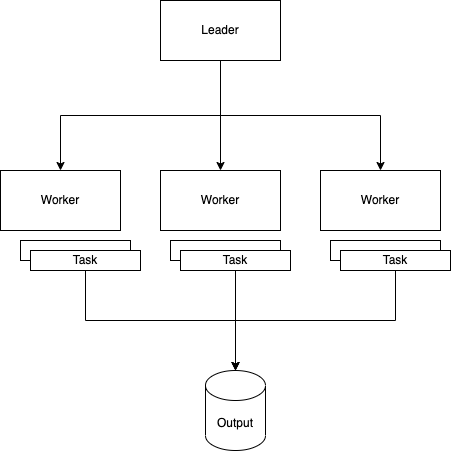
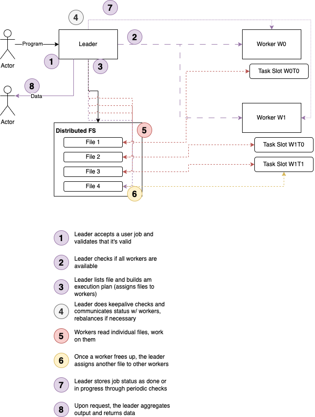

## Introduction

Having found myself recently fun-employed in the great tech layoffs of 2023 (cue ominous thunder in the background) [1], I found myself in a bit of a conundrum: For landing a job, one needs to pass interviews. For passing interviews, one needs to jump through ridiculous hoops and, one of my *favorite* phrases, "grind Leetcode".

That is associated with two problems: It is ridiculously boring, dull, and, more importantly, completely (pardon my French) *f\*cking useless*. 

The other problem was that I found myself with quite a bit of time on my hand to do stuff 9-5 that nobody needs to pay me for: I could finally read "*Crafting Interpreters*" by Robert Nystrom! I could learn `Rust`! I could deep dive into `Scala 3`! Or, of course, I could solve Binary Tree problems in untyped `Python` that have like, *one*, bespoke solution. And I'd have to pay for it, probably.

Now, this article originally stems from a rant against Leetcode - which I still might write - which famously tests your ability to memorize patterns, rather than good software design.

So, I'll cut this short: Instead of doing that, I built a simple, `WordCount`-esque, distributed data processing system from scratch in `Scala 3` w/ `cats-effect`. Seemed like a reasonable, way more interesting challenge.

Now, if you're asking why: I'm in Data Engineering or, how I like to quantify these days, Data *Platform* Engineering. My desire to churn out copy-paste `pySpark` jobs is *low*, but my desire to build high-performance, high-throughput Data Platforms is high - DE is a specialization of SWE, so we should treat it as such.

Now, these Data Platforms tend to be built on top of existing Distributed Systems (and you, as an Engineer, need to deal with the associated challenges, which requires an understanding of how they work) - `Kafka`, `Spark`, `Flink`, `Beam` etc., and of course every database with more than one server are *all* distributed systems. We'll quantify what I mean by that later, by comparing to a "distributed" `REST` API - hint, it's got to do with state.

However, using those (and writing jobs *for* them) is one thing. *Writing* one  - now that's an opportunity to go into some unchartered terretory. I can assure you, I've learned a *lot* more doing that than "grinding Leetcode" (whoever came up with that phrase should consider hugging a running angle grinder, btw) could *ever* teach me.

Grab a coffee or something, this article turned out to be a *bit* on the long side. *[2]*

*[1] I've since accepted an offer!*

*[2]:* 🫠

```bash 
❯ scc -i scala -c
───────────────────────────────────────────────────────────────────────────────
Language                     Files       Lines     Blanks    Comments      Code
───────────────────────────────────────────────────────────────────────────────
Scala                           51        3783        545         223      3015
───────────────────────────────────────────────────────────────────────────────
Total                           51        3783        545         223      3015
───────────────────────────────────────────────────────────────────────────────
Estimated Cost to Develop (organic) $86,069
Estimated Schedule Effort (organic) 5.42 months
Estimated People Required (organic) 1.41
───────────────────────────────────────────────────────────────────────────────
Processed 139689 bytes, 0.140 megabytes (SI)
───────────────────────────────────────────────────────────────────────────────
```

*Code is available on [GitHub](https://github.com/chollinger93/bridgefour)*.

## Goals

That being said, the goals here are threefold: 

1. Learn more about distributed systems by building a simple one from scratch - at the end, it can do a worse version of `WordCount` (not as `Map/Reduce`, though). Emphasis on *simple* - we'll go over all that's missing and omitted in this article
2. Get more familiar with `Scala 3` and the Typelevel ecosystem (+ the changes that `Scala 3` made there, too). A side goal here is also to set up a new `sbt` project from scratch, with `scalafmt`, `scalafix`, and all the fixins. 
3. Write a lot of good (or at least *decent*) code that isn't bogged down by corporate necessities (such as "making money" or other such nonsense :-) ) & plan out features properly



### Distributed System

"Distributed System" here means **a system that executes a workload on multiple machines/instances in parallel, communicates via the network, shares resources, and perhaps most importantly, is responsible for its own state management**. The goal here is *not* to build something inherently useful, but rather build out a project that uses interesting (but real-world feasible) tech to deeply explore some important concepts.

The system should behave *somewhat* similar to [Kafka Connect](https://docs.confluent.io/platform/current/connect/index.html), with independent connectors that span *N* tasks and all work on an independent set of data, albeit from the same source (rather than Spark's approach of building out execution graphs w/ adaptive query execution and other rather advanced and, shall we say, rather *involved* features). 

While the final job for this "Part 1" will do something like `WordCount`, it's not quite `WordCount` - but we'll get to that.

*Noteworthy fact:* While I'm quite comfortable *using* distributed systems and building platforms around them, I am not a Distributed Systems Engineer, i.e. I don't spend my day building databases, processing frameworks, or HPCs. As with most things on my blog, it's mostly a learning experience and an excuse to build something. You can, of course, always reach out via email if I'm spewing nonsense here.

### Scala 3

The `Scala 3` migration is a notorious sh*tshow that doesn't need to hide behind the famous "Oh we're still on Python 2" stories I'm sure we're all familiar with. *[1]*

The language made changes, namely:

1. A revised syntax (*looks like Python, not a fan*)
2. Union types (*If you have to use those, you did something wrong, if you ask me*)
3. Introduces the `given` and `using` clauses for better implicit resolution (*pretty neat, but haven't dug into the details of how it affects scope*)
4. Multiversal Equality - easier comparisons without `equals` (*also pretty neat*)
5. Extension methods, basically a better way of using implicit classes (*big fan*)
6. Native support for enums aka a more concise syntax for ADTs (*big fan, too*)
7. Metaprogramming and Macros Scala 3: See below (*way above my head, but caused headaches* - see below)

So, one of the goals of this project was to get more familiar with `Scala 3`, especially compared to `Scala 2`. We'll touch upon most of these organically over the course of the article.

*[1] Yes, I am aware why some of that is the way it is - doesn't change the fact that `Scala 3` is still a rarity in the real world.* 

### Writing (decent) code

Another goal for this project was for me to write more code than I usually might on a given day, but not only for the sake of writing it, but rather doing in such a way that challenges me to put my PM head on and think about features, requirements, and the implementation of those. You know, useful, albeit terribly dull stuff. 

I've also written a lot of this as wannabe-test-driven-development, i.e. actually wrote a bunch of unit tests. I don't believe in minimum test coverage, however, and find the code coverage %s meaningless.

## Planning

Expanding on the last point, knowing what to build, what *not* to build, why, and when is half the battle sometimes, so I treated this a bit like I would a *$CORPORATION* project.

### Requirements

Vaguely inspired by the concept of the "[Build your Own X](https://build-your-own.org/database/)" books, requirements are simple, but cover enough basics to be useful:

- **Overall**
  - The system shall be called `Bridge Four` (if you're into obscenely long fantasy books, you'll figure the module names out)
  - The system takes user programs that implement a simple interface. The sample program will be a variant of `WordCount`
  - The system can process files from a distributed filesystem and operates in batch mode
  - There is no network discovery or configuration balancing or consistency checks; configuration files are manually propagated to the leader and each worker
  - The system aims for atomicity, but won't provide guarantees (at least in the first iteration)
  - The system manages state in memory, i.e. we won't externalize this to e.g. `redis`, which would defeat the purpose of building a distributed system with challenging state management
- **Leader**
  - The leader module shall be called `Kaladin`
  - The system is a single leader, multiple follower system with no leader quorums or other redundancy
  - The leader's main function is to assign **jobs** via splittable **tasks** to workers and ensure the completion of said jobs
  - One *task maps to one input file*, i.e. the system is dependent on decent file splits
  - The leader has the following subsystems:
    - **Canary** / **System Monitor**: Checks if all workers are alive. Talks to the coordinator if one dies. Collects status data to mark completion of a job.
    - **Coordinator** / **Balancer**: Assigns tasks, re-assigns them if workers break
    - **Collector**: Collects a job's output and reports it
  - The leader has the following interfaces:
    - A `REST` service to interact with users submitting **jobs** and checking status
    - A Background worker that automatically executes service routines
- **Workers**
  - The worker module shall be called `Rock` (I should have named it `Spren`)
  - Workers have *N* static **slots** available for **tasks**. A single worker may complete the entirety or part of a **job**. This is the worker's only subsystem.
  - Worker Slots execute their tasks on a single thread and write data directly to the target
  - The worker has the following interfaces:
    - A **`REST` service** to interact with the leader, reporting status and accepting **tasks**
    - A **Background Worker** that automatically executes **tasks**
- **User Jobs**
  - User jobs will be part of the worker code base for simplicity, but will use an interface, as if they were just reading a dependency and building a jar
- **Implementation Details**
  - The system will be written in `Scala 3`, with `cats-effect`
  - The system will be coupled to the language, i.e. has no plans to support other, non-JVM languages
  - Communication between leader and workers is done via `JSON`, not because it's efficient, but because it's easy
  - User talks to leader, user does not talk to workers
  - Leader talks to workers, workers do not talk to leader
  - The aim is to provide reasonable abstractions, within reason

### MVP Scope

I'll further narrow this down for this "Part 1" article and define a minimum viable product, too:

- It can run a bad version of `WordCount` across multiple workers and present output
- Updating state and checking for workers and all the other canary / monitoring tasks outlined above are done via `pull`, i.e. the user has to *ask* the system to reach out to the workers to update its state, so we don't need to build a background worker system on *both* leader and workers

### Terminology

To sum up some terms from above:

- A **job** reads files, performs computations, and writes output files
- Each **job** executes *N* **tasks** (N > 0)
- Each **task** executes on a **worker**
- Each **worker** has a set number of **slots** with each can execute exactly 1 **task** in parallel 

## Architecture

### Leader/Worker/Task Hierarchy

Putting this together, we get the following hierarchy:



### Starting a Job

Consider the following, general purpose diagram for "starting a job":



Which is really 5 main building blocks:

1. User interaction (user demands a job to be started and/or to see data)
2. Leader splitting job into chunks and assigning them to the workers
3. Workers doing independent chunks of work
4. Leader doing periodic checks to assign more tasks and collect status
5. Leader aggregating data from workers

### `WordCount` & `MapReduce`

Now, especially the last point might have raised some eyebrows, so let's remind ourself how "proper" `WordCount` works:



This is, more generally, of course simply known as "`Map/Reduce`", which is not what we're doing here. 

### How this System differs

What we're doing for the same example:



In other words, instead of the leader assigning lines of input to mappers that emit individual key-value pairs that get moved deterministically (shuffled) and then reduced to an output, our system is more naive:

It reads *pre-split* files (assume e.g. a `Spark` output with properly sized files) which can be read in parallel and write independent outputs, which the leader at the end doing the final aggregation, akin to e.g. a `Spark` `collect()` call that sends data to the `Driver`, with the idea being that each worker's output is a  fraction of the original input file. Please see below for a caveat on that in the "Breaking it" section.

That, of course, is not realistic - outside of **embarrassingly parallel problems**, most systems would run into a massive bottleneck at the leader's end. [1]

However, consider a more computationally intense problem, such as [distributed.net](https://en.wikipedia.org/wiki/Distributed.net?useskin=vector) - brute forcing ciphers. With minimal adjustments - namely, a mechanism for a worker to report definitive success, which would cause the leader to ignore other worker's output - our system here could feasibly model this, assuming we can pre-generate a set of *seed files*:

For a naive brute force, task *A* tries all combinations starting with the letter "a", task `B` tries all starting with "b" and so on - the input file can be a single letter in a `txt` file. "Naive" is definitely the word of the hour here.

Lastly, please check the last section for a retrofit of Partitioning into Bridge Four, making this look more similar to classic `Map/Reduce`. Spoiler:



_[1] Keep in mind, that this general purpose architecture *could still support this in the future* - I just probably won't build it._

### Distributed System Challenges 

So, of course, our system isn't nearly as sophisticated as even old-school `Map/Reduce`, but it still provides enough challenges to be interesting (and keep in mind, this is a learning-by-doing-I'm-unemployed-anyways-project):

- **Consistency**: How do we ensure users get a consistent view on the data?
- **Consensus**: Do we need it? If so, how?
- **Scalability**: Say we do have *do* crack that MD5 password: How can we make it go faster? Does horizontal scaling work? If so, how?
- **Fault tolerance**: What happens if a node goes offline? What happens if the leader goes offline? (Spoiler for the ladder: It implodes)
- **Data Replication**: Instead of having a replication factor of 1, can we have a higher factor? If so, how can we support this?
- **Task assignment**: With a single-leader system responsible for task assignment, what strategies can we employ? What are pros and cons?
- **Retrofitting other problems**: Could this system behave like a distributed database which, instead of *computing* results, *stores* data? Or could it behave like `Kafka`, i.e. as a distributed message queue, where each worker maintains static data, but gets a constant influx of new data?

Note that we won't be talking about *all* of those things in this article, but they're certainly interesting problems to consider - and fun future problems to build.


## Some thoughts about functional programming

Before we continue onto building what we've discussed above, let's talk programming languages and paradigms a bit.

I've chosen to use `Scala` for this, including an effect framework, so allow me to set the stage a bit more.

### Tagless Final Encoded Algebras to structure code

This project follows roughly what I would consider "standard" functional `Scala`, inspired by Gabriel Volpe's "[Practical FP in Scala](https://leanpub.com/pfp-scala)" (which in term is referencing [this](https://okmij.org/ftp/tagless-final/) writeup by Oleg Kiselyo) albeit with some adjustments from my previous job and personal preference: 

1. Define your DSL as tagless final encoded algebras
2. Define your interpreters that implement the algebras with specific typeclasses (don't forget tests)
3. Define stateless programs that encapsulate your interpreters and model business logic
4. While doing so, define your model 

For instance - 

```scala 
// Algebra (Service)
sealed trait HealthMonitorService[F[_]] {
  def checkWorkerStatus(workerCfg: WorkerConfig): F[WorkerStatus]
  def checkClusterStatus(workers: List[WorkerConfig]): 
  	F[Map[BridgeId, WorkerStatus]]
}

// Interpeter
object HealthMonitorService {
  def make[F[_]: Sync: Parallel: ThrowableMonadError]
  (cfg: ServiceConfig, client: Client[F]): HealthMonitorService[F] =
    new HealthMonitorService[F] // ...
```

### On the usefulness of abstract effects

There's an argument to be made that tagless final encoding (which relies on higher kinded types for the generic type `F[_]`) often times adds little benefit over your most  *highest* common denominator (rather than the *lowest*) - say, `IO`. 

I will add that my argument here hinges on the fact that the higher-order kinds I'm talking about here are realistically usually *effects* in the `cats-effect` sense, but the same underlying logic also applies to other type constructors, albeit to a lesser degree, since it's easier to accurately reason about non-IO typeclasses' behavior, since `I/O` (in this case, as "Input/Output" the program doesn't control) is going to break *eventually* .

So, for instance:

```scala
def make[F[_]: Sync: Parallel: ThrowableMonadError]
	(cfg: ServiceConfig, client: Client[F]): HealthMonitorService[F] =
  new HealthMonitorService[F] {

    override def checkWorkerStatus(workerCfg: WorkerConfig): F[WorkerStatus] = {
      ThrowableMonadError[F].handleError(client.get(s"${workerCfg.uri()}/worker/status") { r =>
        Sync[F.blocking(r.status match {
          case Status.Ok => WorkerStatus.Alive
          case _         => WorkerStatus.Dead
        })
      })(_ => WorkerStatus.Dead)
    }
```

The `F[_]` here is a HKT, indicating that the constructor `make` is polymorphic over a type constructor `F` and that `F` needs a `Sync` instance (in this example). By requiring an implicit `Sync[F]`, we're declaring that `F` must have a `Sync` instance, which we can summon `implicitly` and use it (or summon it inline as `Sync[F].f(...`)).

> `Sync` is the synchronous [Foreign Function Interface](https://en.wikipedia.org/wiki/Foreign_function_interface) (FFI) for suspending side-effectful operations. 
>
> https://typelevel.org/cats-effect/docs/typeclasses/sync

In this case, `Sync` *also* implies a bunch of other typeclasses, making choosing the lowest common denominator challenging (and the `Scala` compiler does not help you):




In *theory*, this allows us to specify a different execution model later on (say, `Concurrent`), as long as we set the type bounds to the lowest common denominator. We could also implement this with e.g. `ZIO`.

Or, to put this in even simpler terms: These are *generics for types* in combination with general-purpose abstraction of interface and implementation, which is certainly more layers of abstractions about 99.9% of all "enterprise" code out there will ever see.

Where `Int` is a *value* type (or zero-order), `List[Int` is also a value type, but `List[A]` (the condition to constructing `List[Int]`) is using generics to make it a *first-order type* (since `List` cannot exist as a type, requiring one abstraction - so first-order types, as they also exist in `Java`, are type constructors), whereas *higher-order types* are repetitions of the previous steps, i.e. abstraction-over-abstraction, e.g. a `Monoid`.

I found this overview very helpful to visualize this:



I will note that the nomenclature here is horribly fuzzy and I tried my best to sum it up in a way that I *believe* to be correct - ChatGPT (which I *tried* to use to fact check this) is hallucinating (I'm pretty sure), and literature and sources online use different names and definitions throughout the [board](https://blog.rockthejvm.com/scala-types-kinds/). I'm fairly certain "Category Theory For Programmers" doesn't touch on the subject at all. 

Back to reality: In practice, using HKTs to use Tagless Final, *does* makes testing easier (since individual algebras can be implemented with other effects that are within bounds) and one could argue it makes parametric reasoning easier  - although *I* would argue, it makes parametric reasoning *only* possible for interpreters, not algebras, because the HKTs are simply *too* abstract for real-world systems to reason about.

In any case, it is a very heavy handed abstraction that takes the mantra of "write generic, extendable code" to 11.

Now, compare this to a concrete implementation with the all-powerful `IO`:

```scala 
def makeIO(cfg: ServiceConfig)(client: Client[IO]): HealthMonitorService[IO] = 
new HealthMonitorService[IO] {
  override def checkWorkerStatus(workerCfg: WorkerConfig): IO[WorkerStatus] = {
    IO.handleError(client.get(workerCfg.uri()) { r =>
      IO(r.status match {
        case Status.Ok => WorkerStatus.Alive()
        case _         => WorkerStatus.Dead()
      })
    }
  })(_ => WorkerStatus.Dead)
}
// Doing something with it
def restartWorker(): IO[Unit] = ???
def example(service: HealthMonitorService[IO], workerCfg: WorkerConfig): IO[Unit] =
  service.checkWorkerStatus(workerCfg).map {
    case WorkerStatus.Dead() => restartWorker()
    case _                   => IO.unit
  }
```

Given that our leader and worker will *always* communicate via the network outside of unit tests, using `IO` could be seen as a very reasonable default here (`IO` is easily unit-testable) and, arguably, would yield much simpler code with a lot less choices around type classes.

For this (intentionally simple) example, `IO` and `Sync` look similar, but the more complex the signatures get, the more headaches does it cause: `DelayedBridgeFourJob[F[_]: Async: Temporal: Logger]` drove me up the wall and I will let the readers guess why that is. *Hint*: The concept of `implicit` imports has something to do with it.

The conversation here is certainly different for a super abstract *library* (and one could argue, that's what we're doing here) vs. for the every-day *applications* most of us actually get paid to write: A library benefits from heavy abstractions, so it does not box the user into `cat-effect`'s `IO` monad.

However, I still have a hard time seeing the real-world benefit in most day-to-day applications. We should write code to solve problems, not to appear smart - and HKTs certainly have a habit of feeling like **very complex, premature abstraction**.

But no matter where you stand here, the overall technique certainly makes for more properly abstracted and modular code, and following the pattern of "a program is a collection of algebras and other programs" allow you to write your entire logic without actually writing any implementation code, which is very neat - but I think that also works with one concrete type.

As a final note, I've had this conversation at *$FORMER_WORK* months ago and we did, in fact, decide *not* to use HKTs for a particular project. Funnily enough, while writing this up, I found a similar piece by [John A De Goes](https://degoes.net/articles/tagless-horror) (who's stuff is always worth a read, btw!), which raises similar concerns about premature abstraction (+ a bunch of other things I invite you to read).

> If you *commit to not committing*, you’re stuck with the weakest `F[_]`, which means much of the power of an effect system remains inaccessible. 
>
> https://degoes.net/articles/tagless-horror

For the record, all my code here *does* use Tagless Final + HKTs, because it is a library-like thing and has no corporate pressure to be done on time.

### A note on "functional" styles and readability

One of the bigger derivations from the tagless final pattern is my use OOP to cut down on copy-paste code *without* being overly clever with FP (which is idiomatic `Scala`, for all intents and purposes). I find the more "proper" FP implementations often too hard to read, usually due to a ton of `implicit` imports and/or rather complex type signatures and/or composition techniques where I'm clearly to dense for (anything currying for instance maybe proper, but reads insane, if you ask me).

Because of that, you will also find OOP-inspired patterns in my code, such as protected members:

```scala 
trait Route[F[_]] {
  protected def prefixPath: String
  protected def httpRoutes(): HttpRoutes[F]
  def routes: HttpRoutes[F]
}
// ...
case class WorkerRoutes[F[_]: Monad]() extends Http4sDsl[F] with Route[F] // ...
```

Or even implemented functions in traits, as long as they are pure.

My only rule with these non-algebra interfaces is that `traits` inherently define *functions*, not variables (as traits have no member variables), hence `prefixPath` is a function, but the implementation can be a `val`.

Lastly, I also like having descriptive, `Java`-style package names, but still organize them (mostly) the same way, i.e. `services`, `programs`, `models`, `routes` etc., rather than very deeply nested packages.

## Execution: Three Phases

With all that out of the way, the rest of the article will talk about noteworthy implementations (but by no means everything). Please note that this project certainly has a "forever WIP" feel to it, which means it's **by no means complete**. See above for the "MVP" scope.

I basically tried to build this MVP in three phases, not counting planning or setting up a new cats project from scratch and yelling at `sbt`: 

1. First, we set the baseline and define all the abstract "things" we need, such as a `BackgroundWorker` or a `Persistence` layer. When bootstrapping a project, there is sometimes things we know must exist, so we can define them and test them in a vacuum. This is also the point where we'll pick up some Distributed Systems conversations from earlier.
2. Next, we make the leader and workers talk: This includes designing interfaces, actually implementing routes (by building services), building data models, defining configurations, and testing communication. At the end of the day, the leader should be able to talk to the workers.
3. Lastly, we make the workers do actual work, i.e. execute real tasks, see what happens, and discuss what's next and how one can easily break this

## Phase 1: Set up a baseline: Shared components

Let's talk about some of the shared / mandatory components we know we need.

### A conversation about state

A *Background Worker* is an abstract thing that can execute arbitrary tasks in *parallel* and collect results. We need this for a single worker to execute *N* tasks, which is a multi-threading, not a distributed problem.

However, if you squint at that problem hard enough, you might realize that this is essentially the **mini version (or subset) of a distributed system** - just that the distribution here happens on a single machine across multiple executors (in this case, green threads, known as `Fibers`).

Some characteristics are remarkably similar: Both do concurrent execution (on multiple machines vs. within a process), both allow for scaling (via more machines / horizontal vs. via more threads / vertical), both have overhead cost to consider, both can use a leader or leaderless architecture (if you consider e.g. the parent process as a leader), both have challenging communication paths (across-machine vs. IPC/ITC), both have to handle failures (failing machines / network [remember, the CAP theorem is garbage] vs. failing threads), both require synchronization techniques. 

Of course, this tells a very flawed story if you take a step back: Many distributed systems can solve non-trivial concurrent problems and what I brushed off as "IPC/ITC and cross-machine communication" is a *lot* more complicated than two threads writing to a concurrent queue, which is why many (most) systems require *consensus* algorithms (see below), whereas with multi-threading (or even multi-processing), we can rely on both the JVM as well as the Kernel to do a lot of heavy lifting for us.

The (IMO) biggest question when talking about distributed-vs-threaded is: **Who manages state**? Arguably, a bunch of REST servers behind a load balancer, where each  server gets a message to work on in, say, a Round Robin fashion, *is* a distributed system - the system processes a request as a whole on interconnected machines. Some of the complexities apply. 

*However, in a cluster of REST services, each service itself is stateless*, somewhat by definition. While the communication between requestor (user) and rest service via the LB is bi-directional, there is no shared state between them. Therefore, it doesn't match the definition we used for this project.

A distributed system, such as this one, *does* manage it's own state, with clearly defined responsibilities:




- The leader knows about which workers are online, which jobs are running (+ where), and which tasks are running (+ where). The leader has a holistic view of the system, albeit at a point in time
- The workers know about the status of their own tasks: Fibers running within their own JVMs
- The tasks running in the worker's slots know only about their individual subset and their own progress

No single worker knows everything about the system, but does carry their own *subset* of the system (since the workers make up the system).

### Consistency

Which brings us to a classic distributed systems problem: Consistency! Which consistency guarantees can our system provide and how?




We're making this very easy for ourselves here: Since our system is a single leader system, it has very **strong consistency**  (albeit not technically sequential), since we have a single leader coordinating any and all interaction with the user. 

Consider this not-a-sequence-diagram:



In this (simplified example) two actors, A and B, try to *get* data for job X (actor A), as well as start another instance/writer of job X, *writing* to the same data set.

In a single leader system, the access is sequential: The leader will only accept access to the job (writing to it or reading from it) from one actor at the time, meaning readers always get a consistent view of the system.

Furthermore, while workers *do* operate independently from one another, their output is discarded as meaningless if an entire job has not completed yet (which is, again, entirely controlled by the leader):




### Consensus & Fault Tolerance, and Replicated State Machines

This single-leader system with "dumb" workers works differently for systems that employ something called *replicated state machines*, where, quote "state machines on a collection of servers compute identical copies of the same state and can continue operating even if some of the servers are down", hence providing **fault tolerance**. One of the big and obvious drawbacks of a single leader system, like Bridge Four, is the lack thereof.

See:


This diagram is taken from the `Raft` consensus algorithm, which *also* works with a single leader and then syncs all changes to said leader. The difference being, however, that workers can be **promoted** to leaders by employing the consensus algorithm, something that Bridge Four cannot do. 




This is an obvious, albeit deliberate choice that was made for simplicity. 

### Our State Machines

We still have multiple Finite State Machines - not replicated, but mirrored to degree, since the leader mirrors point-in-time snapshots of the worker's state, which take precedence over the worker's *actual* state.

#### Finite State Machines

All implementations are based on simple Finite State Machine principles outlined [here](https://erlang.org/documentation/doc-4.8.2/doc/design_principles/fsm.html):

> A FSM can be described as a set of relations of the form:
>
> ```
> State(S) x Event(E) -> Actions (A), State(S')
> ```

Actions here are a little bit more involved (see the rest of the article :-) ), so we can boil this down to the following in its simplest form:

```scala 
trait StateMachine[S, E] {
  def transition(initState: S, event: E): S
}
```

Naturally, an `action` could also be modeled as

```scala 
trait StateMachineWithAction[S, E, A] {
  def transition(initState: S, event: E, action: (S, A) => A): (S, A)
}
```

But I will admit that the implementation in Bridge Four is a bit janky at the time.

> **State machine improvement**: The state machines are simple FSMs, but do not model transitions and actions well and rely to heavily on the `JobDetails` model
>
> From the `README.md`

The original implementation was basically this:

```scala 
def transition(j: JobDetails): JobDetails
```

Which meant, you could do simple composition:

```scala 
SM2.transition(SM1.transition(jd))
```

But that, of course, is very hard to reason about. The current implementation stands somewhere in the middle, still making heavy use of the `JobDetails` model. 

For the record, I believe the de-facto reference implementation here exists in [`Akka`](https://doc.akka.io/docs/akka/current/typed/fsm.html), but I'm not going to start pulling that dependency in.

#### Job Execution Status

The execution status machine models the movement of job. It is based on the following Algebraic Data Type (ADT) (note the `Scala3` `enum` type):

```scala
enum ExecutionStatus derives JsonTaggedAdt.Codec {
  case NotStarted
  case InProgress
  case Halted
  case Done
  case Error
  case Missing
}
```

It describes the transition between for a *job* execution status, which of course is actually a list of *tasks*:



The "Zero State" is what the identity element is to the Monoid, i.e. any state is always missing until it its not (it's a NoOp).

Other than that, the flow is relatively clear:

1. If worker slots are available, a job starts and moves to `InProgress`
2. Otherwise, it is `Halted`, which is similar to `InProgress`, but requires an additional state change to perform work
3. Once `InProgress`, it either has a no-op transition (the tasks is in progress) or it changes state to either `Done` (terminal) 
4. ...or `Error`, which will retry by going back to `NotStarted` (since we don't know if we have executors to move it to`InProgress`)

The whole thing is a function of the `isEmpty` property of the `open`, `inProgress`, and `completed` tasks within a job (which are states in their own right):



#### Assignment

The Assignment describes whether a job's tasks are fully, partially, or not assigned at all:



Similar to the overall task, this is also a function of the three task lists a `JobDetails` object carries.

#### Task Execution Status

The `task` execution is based on a subset of the same `ADT`. However, a task can never be on "Hold" or "Missing" - it either exists and runs somewhere or doesn't.



One thing to note, while a `task` (in the distributed job sense), a `BackgroundWorker` fiber can be *absolutely* missing if the leader somehow passes an invalid ID. 

That, however, isn't truly a state, since a task gets constructed by the leader - meaning, while calling `GET http://{{rockServer}}:{{rockPort}}/task/status/$INVALID_ID` *will* return a "Missing" result, that doesn't model part of the lifecycle of a task, which is what we care about in this section. 

### `BackgroundWorker`

That was a long winded way to get to talking about a `BackgroundWorker` :-). 

The algebra for this is looking a little wild with types, but breaks down into fairly simple steps:

```scala 
trait BackgroundWorker[F[_], A, M] {
  def start(key: Long, f: F[A], meta: Option[M] = None): F[ExecutionStatus]
  def get(key: Long): F[Option[FiberContainer[F, A, M]]]
  def getResult(key: Long): F[BackgroundWorkerResult[F, A, M]]
  def probeResult(key: Long, timeout: FiniteDuration): F[BackgroundWorkerResult[F, A, M]]
}
// ...
case class FiberContainer[F[_], A, M](fib: Fiber[F, Throwable, A], meta: Option[M])
case class BackgroundWorkerResult[F[_], A, M](res: Either[ExecutionStatus, A], meta: Option[M])
```

`def start(key: Long, f: F[A], meta: Option[M] = None): F[ExecutionStatus]` starts a function that returns `F[A]` and, optionally, allows for the provision of metadata of type `M`. 

The `key` is any `Long` (a generic type `K` made this even more unwieldy), which in case of the worker implementation is the `SlotTaskIdTuple` (basically all IDs we need to match a slot to a job).

The metadata is tremendously useful when probing for results, i.e. getting metadata about a task when a task hasn't completed yet. 

In a world without metadata, `get` (or `probe`) would return a `Option[Fiber[F, Throwable, A]]` (or an `Either[ExecutionStatus, Fiber[...]]`), which means we would need a separate system to keep track of what exists within the `BackgroundWorker`. For instance, if we use the `BackgroundWorker` to start a 2 *tasks* from 2 *jobs* on a *worker* (and hence, in 2 *slots*), how do we know which job the task in e.g. slot 0 belongs to?

At the same time, this also throws a bit of a wrench into the state machine definition from above once we need to use this for the `TaskExecutor` (see below):

With the (*generic*) `BackgroundWorker` being responsible for returning an `ExecutionStatus` *too*, the pattern match for the `TaskExecutionStateMachine` is far from ideal, since it doesn't accurately model a *transition* anymore, since that is a property of the `BackgroundWorker` we're discussing here:

```scala 
  def transition(initialSlot: SlotState, event: 
                 BackgroundWorkerResult[_, TaskState, SlotTaskIdTuple]): SlotState =
    event.res match
      case Right(r) => 
				SlotState(initialSlot.id, available = true, status = r.status, Some(r.id))
      case Left(s) =>
        event.meta.match {
          // BackgroundWorker takes some responsibility for state transitions - bad coupling
          case Some(m) =>
            s match {
              case ExecutionStatus.InProgress => 
              	SlotState(m.slot, available = false, status = s, Some(m.task))
              // This does not re-start these tasks anywhere, that is done in the leader
              case ExecutionStatus.Done | ExecutionStatus.Error | ExecutionStatus.Halted =>
                SlotState(m.slot, available = true, status = s, Some(m.task))
              case ExecutionStatus.Missing => SlotState.empty(initialSlot.id)
            }
          case _ => SlotState.empty(initialSlot.id)
        }
```

However, this boils down to a classical issue of "too little or too much abstraction" at point X - this can be cleaned up, but is an almost impossible task to get right from the get go if we want to get anything functional done.

Also, note that this algebra doesn't specify a capacity: That is a function of an implementation, which we'll skip for now, since we need to talk about a prerequisite fist.

### `Persistence`

And that would be persistence. Since we also talked extensively about state in the previous section, let's define a way to store state (and, by proxy, make our generic worker able to store tasks and results):

```scala 
sealed trait Persistence[F[_], K, V] {
  def put(key: K, value: V): F[Option[V]]
  def get(key: K): F[Option[V]]
  def del(key: K): F[Option[V]]
}
```

This is very similar to e.g. a `Map` implementation: You get `put`, `get`, and `delete`.

A simple implementation is worth briefly discussing at this point:

```scala 
object InMemoryPersistence {
  def makeF[F[_]: Sync, K, V](): F[Persistence[F, K, V]] = {
    for {
      storage <- MapRef.ofScalaConcurrentTrieMap[F, K, V]
    } yield new Persistence[F, K, V]() {
      def put(key: K, value: V): F[Option[V]] = storage(key).getAndSet(Some(value))
      def get(key: K): F[Option[V]] = storage(key).get
      def del(key: K): F[Option[V]] = storage(key).getAndSet(None)
    }
  }
}
```

The eagle-eyed among you will have noticed the use of `MapRef`, rather than a regular data structure, which provides a [`Ref`](https://typelevel.org/cats-effect/docs/std/ref) - a concurrent mutable reference - around a map.

If we were to use a, say, `ConcurrentTrieMap` without a `Ref`, the entire map would need to be re-written on each access, not to mention the need for rolling our own concurrency primitives. This makes this a lot easier, but makes searching near impossible, at least without another locking mechanism + persistence store. 

Bridge Four solves this by assigning slot IDs sequentially starting at `0`, meaning you can scan all slots if you know about the worker's slot capacity.

Tradeoffs all around.

### `Counter`

Another form of this is a `Counter` that stores key-value pairs with an associated count:

```scala 
sealed trait Counter[F[_], K] {
  def inc(key: K): F[Unit]
  def dec(key: K): F[Unit]
  def set(key: K, value: Long): F[Unit] 
  def get(key: K): F[Long]
}
```

We don't necessarily need one (I thought we did at one point, so I built it - once with `MapRef`, once with `Ref` + `Mutex`), but it's fun talking about it.

The implementation here looks similar, but has much harsher concurrency penalties (in theory): In a regular `MapRef`, if two threads write to the same key, one will ultimately prevail, which is generally expected behavior. The previous value is generally discarded. 

For a counter, race conditions can be a bigger problem, since the current view of the data always depends on the *previous* state of the data.

If Threads 1 and 2 both increment a counter and Thread 3 decrements it, the result will always be the same, since operations are all commutative:

```scala 
List(1,1,1,1,-1,-1).permutations.map(_.foldLeft(0){case(n1,n2) => n1+n2}).toList.distinct
val res1: List[Int] = List(2)
```
*(Peak mathematical proof, ca. 2023, colorized)*

However, if you *skip* an operation (or call a `set()` in the middle of it), the result is obviously not the same!

Now, for a multi-threaded problem, this is on the edge of "testing library code in unit tests" (which we'll do in a second), but consider for just a moment that we'd have the same counter *across the entire cluster*. How does that change things?

At that point, we'd have to talk about **delivery guarantees** (which is a subset of consistency, arguably), which I will refrain from doing now - but keep in mind that these are the types of issues that are similar in multi-threaded problems, but certainly not the same as the same problem in distributed workloads.

For the record, I'm not against "testing library functionality" for concurrency stuff, just because concurrency is hard and easy to mess up, so it doesn't hurt:

```scala
test("InMemoryCounter works across threads") {
  Random
    .scalaUtilRandom[IO]
    .map { ev =>
      Range(0, 11).toList.traverse { _ =>
        def countT(ctr: Counter[IO, Int], i: Int, key: Int = 0): IO[Unit] = for {
          r <- Random[IO](ev).betweenInt(1, 25)
          _ <- IO.sleep(FiniteDuration(r, TimeUnit.MILLISECONDS))
          _ <- if (i == 1) ctr.inc(key) else ctr.dec(key)
          r <- Random[IO](ev).betweenInt(1, 25)
          _ <- IO.sleep(FiniteDuration(r, TimeUnit.MILLISECONDS))
        } yield ()
        for {
          ctr <- InMemoryCounter.makeF[IO]()
          f1  <- Range(0, 1001).toList.map(_ => countT(ctr, 1, 0).start).sequence
          f2  <- countT(ctr, -1).start
          _   <- f1.traverse(_.join)
          _   <- f2.join
          r   <- ctr.get(0)
          _    = assertEquals(r, 1000L)
        } yield ()
      }
    }
    .flatten
}
```

### `TaskExecutor` (Worker only)

The combination of BackgroundWorker + Persistence is a construct I called a `TaskExecutor`, which looks like this:

```scala 
/** An task executor service that maintains state internally, 
  * usually by maintaining a BackgroundWorker[F, TaskState,
  * SlotState], but other implementations that a
  * re stateful are possible
  *
  * @tparam F
  *   Effect
  */
trait TaskExecutor[F[_]] {
  def start(tasks: List[AssignedTaskConfig]): F[Map[TaskId, ExecutionStatus]]
  def getSlotState(id: SlotIdTuple): F[SlotState]
  def getStatus(id: SlotIdTuple): F[ExecutionStatus]
}
```

A `TaskExecutor` is ultimately the Worker service that  reports the internal *state* of the individual workers back to the leader. We'll talk about communication in the next section.

Thes resulting program requires a specific `BackgroundWorker` that can store `TaskState` + metadata about *slot* + *task* ids.:

```scala 
def make[F[_]: ThrowableMonadError: Sync: Monad: Logger](
    sCfg: RockConfig,
    bg: BackgroundWorker[F, TaskState, SlotTaskIdTuple],
    jc: JobCreator[F]
)
```

### `JobController` & `JobConfigParser` (Leader only)

The leader has two main algebras, `JobController` & `JobConfigParser`, split for easy testing:

```scala  
trait JobConfigParser[F[_]] {
  def splitJobIntoFiles(config: JobConfig): F[List[File]]
}
sealed trait JobController[F[_]] {
  def startJob(cfg: UserJobConfig): F[JobDetails]
  def stopJob(jobId: JobId): F[ExecutionStatus]
  def getJobResult(jobId: JobId): F[ExecutionStatus]
  def checkAndUpdateJobProgress(jobId: JobId): F[ExecutionStatus]
  def calculateResults(jobId: JobId): F[Either[ExecutionStatus, Json]]
}
```

Those do what we discussed: Split a job, plan out assignment to workers, and start tasks on workers, as well as model most other leader functionalities, namely getting result.

Note that this explicitly does not handle state as part of the algebra, but does as part of the resulting *program*:

```scala 
case class JobControllerService[F[_]: ThrowableMonadError: Concurrent: Async: Logger](
    client: Client[F],
    ids: IdMaker[F, Int],
    workerOverseerService: WorkerOverseer[F],
    splitter: JobSplitter[F],
    state: Persistence[F, JobId, JobDetails],
    stateMachine: JobDetailsStateMachine[F],
    leaderJob: LeaderCreator[F],
    cfg: ServiceConfig
) extends JobController[F] 
```

## Phase 2: Make leader & workers talk

At this point, we have a skeleton project (quite literally with a `IO.println("HelloWorld")` in there), but we've already established that our leader-to-worker communication is going to be done via `REST`.

Remember our rules:

- The User talks to leader, user does not talk to workers
- The Leader talks to workers, workers do not talk to the leader

### Building Routes

With that knowledge - and the general understanding that we need to start jobs and assign them - we can build routes:

Defining the routes beforehand helps us to understand and check the flow of the application and helps us structure our code:

| Component | Method | Route   | Call             | Payload    | Returns                      | Description                                                  | Implemented |
| --------- | ------ | ------- | ---------------- | ---------- | ---------------------------- | ------------------------------------------------------------ | ----------- |
| Kaladin   | POST   | /       | start            | JobConfig  | JobDetails                   | Starts a job                                                 | X           |
| Kaladin   | GET    | /       | list / $JobId    | -          | JobDetails                   | Lists a single job                                           |             |
| Kaladin   | GET    | /       | list             | -          | list[JobDetails]             | Lists all jobs                                               |             |
| Kaladin   | GET    | /       | status / $JobID  | -          | ExecutionStatus              | Gets the result of a job, as Status                          | X           |
| Kaladin   | GET    | /       | refresh / $JobID | -          | ExecutionStatus              | Gets the result of a job and starts more teasks, if necessary,  as Status. Stop-gap until this is automated | X           |
| Kaladin   | GET    | /       | data / $JobID    | -          | Either[ExecutionStatus,JSON] | Gets data, if its available. Like a Spark.collect() - moves  data from workers to leader | X           |
| Kaladin   | GET    | /       | cluster          | -          | Map[WorkerId, WorkerStatus]  | List cluster status                                          | X           |
| Rock      | GET    | /worker | state            | -          | -                            | 200 OK for health                                            | X           |
| Rock      | GET    | /worker | status           | -          | WorkerState                  | Details on slots + tasks                                     | X           |
| Rock      | GET    | /task   | status / $TaskId | -          | ExecutionStatus              | Gets the status of a task                                    |             |
| Rock      | POST   | /task   | start            | TaskConfig | ExecutionStatus              | Starts a tasks as a member of a job                          | X           |
| Rock      | PUT    | /task   | stop / $TaskId   | -          | ExecutionStatus              | Stops a task                                                 |             |

I won't go over each and every route here, but this overview should give us an idea on what to build. It is also useful for PM to track the implementation status of each route, since realistically, each route would be its own ticket. 

### `http4s` (aka "useful Kleislis")

`http4s` is the HTTP framework of choice. Here's a great [talk](https://www.youtube.com/watch?v=urdtmx4h5LE) about it. In a nutshell: 

> HTTP applications are just a Kleisli function from a streaming request to a polymorphic effect of a streaming response

Yeah. mmhm. *I know some of these words*!

Okay, I stole this from the talk, but `http4s` really is a functional HTTP library that benefits greatly from FP.

The general idea is: A HTTP server is a function of `Request => Response`, but since it's also effectful and not all routes always exist, it boils down to a `Request => OptionT[F, Response]` (or `Request => F[Option[Resonse]`, with `F` being the effect). If we apply another Monad Transformer (to make two different Monads compose, in this case with a function) to that, we get `Kleisli[Option[T, *], Request, Response]`, leading us to the type alias in the actual library:

```scala 
type Http[F[_], G[_]] = Kleisli[F, Request[G], Response[G]]
```

In case the last step was unclear, these simple functions turned into `Kleislis`:

```scala 
def getUserById(id: Int): IO[Option[String]] = ???
val getUser: Kleisli[IO, Int, Option[String]] = Kleisli(getUserById)
def processName(name: String): IO[String] = ???
val processUser: Kleisli[IO, Option[String], String] = Kleisli(processName)
```

Can now be composed:

```scala 
val getUserAndProcessName: Kleisli[IO, Int, String] = getUser.andThen(processUser)
```

Whereas without that, we'd have a bunch of repeated `match` and `flatMap` operations across both the `IO` and the `Options`, which is fine for 2 functions, but not for large HTTP servers w/ a bunch of middleware.

In practice, it looks something like this:

```scala
val service = HttpRoutes.of[IO] {
  case _ =>
    IO(Response(Status.Ok))
}.orNotFound
```

And can do a lot of neat things: Composable routes & middlewares, easy to test, reasonable encoding and decoding support, and very... strict... adherence to the HTTP standard. Works great with `circe`, `cats-retry` etc.

### Defining a Model

Before we get to building the actual routes, let's talk about defining models. I won't go over all models, but some noteworthy ones used for user-to-leader and leader-to-workers communication. *[1]*

Consider this overview:




*[1] I'm pretty unhappy with this model and will probably simplify it in the future - it has too many independent sub-types and is generally over-abstracted, which doesn't help readability.*

#### UserJobConfig

A user provides a job config as such:

```scala 
// The input a user provides for a job
case class UserJobConfig(
    name: JobName,
    jobClass: JobClass,
    input: DirPath,
    output: DirPath,
    userSettings: Map[String, String]
) extends JobConfig
    derives Encoder.AsObject,
      Decoder
```

Which translates to:

```json
{
    "name": "Example job",
    "jobClass": {
        "type": "DelayedWordCountJob"
    },
    "input": "/tmp/in",
    "output": "/tmp/out",
    "userSettings": {"timeout": "2"}
}
```

#### AssignedTaskConfig

Once a task is assigned, a leader sends the following to workers:

```scala 
case class AssignedTaskConfig(
    taskId: TaskIdTuple,
    slotId: SlotIdTuple,
    input: FilePath,
    output: DirPath,
    jobClass: JobClass,
    userSettings: Map[String, String]
) extends TaskConfig
    derives Encoder.AsObject,
      Decoder
```

And yes, a `UnasssignedTaskConfig` also exists, but it's mostly a `TaskConfig`:

```scala 
sealed trait TaskConfig derives Encoder.AsObject, Decoder {
  def jobClass: JobClass
  def input: FilePath
  def output: DirPath
  def userSettings: Map[String, String]
}
```

That is mostly because assigning IDs is a side-effect.

#### IDs & Collisions

IDs model a simple hierarchy, but are worth calling out here to connect the dots:



And hence, get a couple of tuple containers:

```scala 
object IDs {
  type JobId    = Int
  type TaskId   = Int
  type WorkerId = Int
  type SlotId   = Int
  case class TaskIdTuple(id: TaskId, jobId: JobId) derives Encoder.AsObject, Decoder
  case class SlotIdTuple(id: SlotId, workerId: WorkerId) derives Encoder.AsObject, Decoder
}
```

On thing worth mentioning here is that in large systems, ID collisions are a huge problem that is non-trivial to solve - here, the use of `Int` isn't ideal, but it did make testing easier (rather than copying 128bit UUIDs). 

The interpreter for the `IdMaker[F[_], A]` algebra is literally called `NaiveUUIDMaker`, which cuts down pseudo-random UUUIDs to 32bits, whereas the one used in the unit tests always returns sequential number starting from 100.

#### WorkerState

Lastly, `WorkerState` is worth calling out:

```scala 
case class WorkerState(
    id: WorkerId,
    slots: List[SlotState],
    allSlots: List[SlotId],
    availableSlots: List[SlotId],
    runningTasks: List[TaskIdTuple]
    // See https://github.com/circe/circe/pull/2009
) derives Encoder.AsObject,
      Decoder
```

This tells the leader about the state of an individual worker. A lack of a response (w/ retries) constitutes a dead worker.

This is the definitive source of truth for the leader to figure out what's going on on the worker, in one single operation. **The fewer distinct operations we have, the easier it is to add atomicity support later**.

### On Encoding & Decoding

This is a common, albeit surprisingly not all that trivial problem: Encoding domain models.

#### `Scala 2`: All your `implicit` are belong to us

Scala 2 had a bunch of libraries that worked together to use compiler macros to derive type classes instances, namely via [`derevo`](https://github.com/tofu-tf/derevo) and its modules for e.g. `circe` or `pureconfig`:

```scala 
@derive(encoder, decoder, pureconfigReader)
case class SlotState(
    id: SlotId,
    workerId: WorkerId,
    available: Boolean,
    task: Option[TaskState]
)

def foo[F[_], A: Encoder](x: A): F[Unit] = ???
```

This was a really easy way to build domain models that could be shared across e.g. `http4s` and `pureconfig` (or any DSL). Importing them put e.g. an `EntityEncoder[F, SlotState]` into `implicit` scope. Sometimes, you'd hand-roll more complex serializers in the companion object, albeit rarely.

One of the things that made it easy was the fact that it properly abstracted the wild world of compiler macros from me, your average idiot (tm). Use the annotation, pull in the right implicit scope, do something useful.




#### `Scala 3`: `derives` drives me nuts

Well, `Scala 3` now has the `derives` keyword, as I've called out earlier:

```scala
case class Thing() derives Encoder.AsObject
```

Which, on paper, is great! Unfortunately, years after it's release, it still causes 2 main issues:

- The compiler doesn't give the same useful, abstracted error messages than e.g. `derevo` does, forcing me to go down a rabbit hole (bear with me, I'll take you with me)
- Library support is often not needed anymore, but the docs are helplessly outdated, and, unless you're a total `Scala` geek, "just read the type signature, bro" is *really* not helpful

Now, for the rabbit hole, take this:

```scala
case class Stuff()
@derive(encoder, decoder, pureconfigReader)
case class ThingWithStuff(stuff: List[Stuff])
foo(ThingWithStuff(List(Stuff(), Stuff(), Stuff())))
```

Can you spot what's wrong with it? 

Easy, it's a chicken-and-egg problem, and `derevo` tells us as much:

```scala 
Could not find io.circe.Encoder instance for List[com.chollinger.Stuff]
  @derive(encoder, decoder, pureconfigReader)
```

`Scala 3`, however, will tell you this:

```scala
// Maximal number of successive inlines (32) exceeded,
// Maybe this is caused by a recursive inline method?
// You can use -Xmax-inlines to change the limit.
```

Now, what in all that's holy is a `successive inline`, what does it have to do with my serializers, and why do I care?

Well,  a function is marked as `inline`, it tells the compiler to substitute the method body directly at the call site during compilation. Straight from the docs:

```scala
// definition
inline def logged[T](level: Int, message: => String)(inline op: T): T =
  println(s"[$level]Computing $message")
  val res = op
  println(s"[$level]Result of $message: $res")
  res
// call
logged(logLevel, getMessage()) {
  computeSomething()
}
// compile result
val level  = logLevel
def message = getMessage()

println(s"[$level]Computing $message")
val res = computeSomething()
println(s"[$level]Result of $message: $res")
res
```

`inline` is what is now used as a replacement for compiler macros, in the form of "[Inline Metaprogramming](https://docs.scala-lang.org/scala3/reference/metaprogramming/index.html)" (that just rolls off the tongue!).

It also happens to be the mechanism by which the `derives` keyword works. For [instance](https://docs.scala-lang.org/scala3/reference/contextual/derivation.html#):

```scala 
import scala.deriving.Mirror

inline def derived[T](using m: Mirror.Of[T]): Eq[T] =
  lazy val elemInstances = summonInstances[T, m.MirroredElemTypes] // (1)
  inline m match                                                   // (2)
    case s: Mirror.SumOf[T]     => eqSum(s, elemInstances)
    case p: Mirror.ProductOf[T] => eqProduct(p, elemInstances)
```

> Inlining of complex code is potentially expensive if overused (meaning  slower compile times) so we should be careful to limit how many times `derived` is called for the same type. For example, when computing an instance for a sum type, it may be necessary to call `derived` recursively to compute an instance for a one of its child cases. That  child case may in turn be a product type, that declares a field  referring back to the parent sum type. To compute the instance for this  field, we should not call `derived` recursively, but instead  summon from the context. Typically the found given instance will be the  root given instance that initially called `derived`.

In this case, because we have a mutually dependent derivation, the compiler gives up inlining anything after 32 attempts, throwing that *super-not-user-friendly* error at me.

While it's great that the language itself could replace a bunch of libraries -  on paper - it really soured more than one morning, since I was forced to actually dig into the language docs to solve issues which can *already* be annoying with a much more mature ecosystem of libraries (which is ironic).

In other words, I should not need to read parts of a language spec to do something so trivial as serializing a bunch of domain models.

### Implementing the HTTP server

Anyways! With the model roughly defined, we can build some communication paths. Make the robots talk. What could go wrong?

#### Routes

"Building" these routes does not mean implementing business logic, but rather talking to specific algebras (and programs) - which we defined earlier! 

For instance, the `task` routes boil down to taking the `TaskExecutor` from above:

```scala 
case class TaskRoutes[F[_]: Concurrent](executor: TaskExecutor[F]) 
extends Http4sDsl[F] with Route[F] {

  protected val prefixPath: String = "/task"

  // TODO: centralize implicits in companions
  given EntityDecoder[F, AssignedTaskConfig]           = 
  	accumulatingJsonOf[F, AssignedTaskConfig]
  given EntityEncoder[F, Map[TaskId, ExecutionStatus]] = 
  	jsonEncoderOf[F, Map[TaskId, ExecutionStatus]]
  
  protected def httpRoutes(): HttpRoutes[F] = {
    HttpRoutes.of[F] {
      case req @ POST -> Root / "start" =>
        Ok(for {
          tasks <- req.as[List[AssignedTaskConfig]]
          res   <- executor.start(tasks)
        } yield res)
      // ...
    }
  }

  def routes: HttpRoutes[F] = Router(
    prefixPath -> httpRoutes()
  )
}
```

Which, as we recall, only manages an individual worker's state.

Similarly, the worker route follows a similar example:

```scala 
case class WorkerRoutes[F[_]: Monad](workerSrv: WorkerService[F]) 
extends Http4sDsl[F] with Route[F] {
	// ...
  protected def httpRoutes(): HttpRoutes[F] = {
    HttpRoutes.of[F] {
      case GET -> Root / "status" => Ok()
      case GET -> Root / "state" =>
        workerSrv.state().flatMap { (state: WorkerState) =>
          Ok(state.asJson)
        }
    }
  }
```

#### Server

Routes also need a server, which is actually responsible for building out all services:

```scala 
  def run[F[_]: Async: Parallel: Network: Logger](cfg: ServiceConfig): 
  F[Nothing] = {
    val mF = implicitly[Monad[F]]
    for {
      state <-
        Resource.make(InMemoryPersistence
        	.makeF[F, Long, FiberContainer[F, TaskState, SlotState]]())(_ => mF.unit)
      bgSrv     = BackgroundWorkerService.make[F, TaskState, SlotState](state)
      jcSrv     = JobCreatorService.make[F]()
      execSrv   = TaskExecutorService.make[F](cfg.self, bgSrv, jcSrv)
      workerSrv = WorkerService.make[F](cfg.self, execSrv)
      httpApp: Kleisli[F, Request[F], Response[F]] = (
                                         TaskRoutes[F](execSrv).routes <+>
                                         WorkerRoutes[F](workerSrv).routes
                                     ).orNotFound
      // ...
```

This is especially helpful if you're dealing with constructors that return an `F[ServiceImpl]`, which happens of the construction is dependent on an effect. 

You may also have spotted `InMemoryPersistence`, which indoes means that a dead leader takes all state with it.

### Define a Job

You may have noticed we've barely talked about what constitutes a job, and that was intentional: The complexity here is not to re-write `WordCount`, the complexity here is around making a distributed system that is halfway-well designed (or, at least, is *aware of its limitations*) that can do any distributed task, and even if that's just writing "Hello World" and having a leader that's aware of what "Hello World" means.

#### Worker Jobs

The way this *should* work is the user should submit a jar (or at least a package name as String), with bespoke config options, and the system should execute it.

The way it *does* work is by having a summoner - `def make[F[_]: Async: Temporal: Logger](): JobCreator[F] = (cfg: AssignedTaskConfig) ` - that simply runs the `run: F[Unit]` method on each worker (with, if the job is implemented correctly, reads `AssignedTaskConfig.input` of type `FilePath`, which is a `String` alias) and writes to `outputFile(): String`.

If you've been paying attention, you will also have realized the complete lack of abstraction from an actual file system (this basically assumes you're on a UNIX-like and have something like NFS at the worker nodes available).

**I am aware that this is hot garbage** , thank you very much, but this was one of those points where I had to take a step back and not also build a good job interface, but rather focus on the system as a whole. This can all be replaced later, as the coupling is pretty loose. 

But, for completeness' sake, here's the (placeholder) interface I've been using:

```scala 
  trait BridgeFourJob[F[_]] {
    // this is a simple workaround to map code in this repo (BridgeFourJobs) to a Job
    def jobClass: JobClass
    /** Each job must work on exactly one file and write to one directory
      *
      * TODO: this limitations are for simple implementations and somewhat arbitrary
      */
    def config: AssignedTaskConfig
    // I know this is sh*tty
    def outputFile(): FilePath = 
    	s"${config.output}/part-${config.taskId.id}-${config.taskId.jobId}.txt"
    /** Each job must be able to do computations on the output data */
    def run(): F[TaskState]

  }
```

For an implementation, which is literally "Sh*tty wordcount":

```scala 
  case class DelayedWordCountBridgeFourJob[F[_]: Async: Temporal: Logger]
	  (config: AssignedTaskConfig) extends BridgeFourJob[F] {

    val jobClass: JobClass = DelayedJob()
    val aF: Async[F]       = implicitly[Async[F]]

    private def wordCount(wrds: List[String], counts: Map[String, Int]): Map[String, Int] = {
      if (wrds.isEmpty) return counts
      wordCount(wrds.tail, counts.updatedWith(wrds.head)(ov => Some(ov.getOrElse(0) + 1)))
    }

    private def lineByLineWordCount(lns: List[List[String]], 
    counts: Map[String, Int] = Map.empty): Map[String, Int] = {
      if (lns.isEmpty) return counts
      lineByLineWordCount(lns.tail, wordCount(lns.head, counts))
    }

    private def processFile(in: FilePath): F[Map[String, Int]] = {
      Resource.make[F, BufferedSource]
      	(aF.blocking(Source.fromFile(in)))
         (r => aF.blocking(r.close())).use { fn =>
          for {
            _     <- Logger[F].debug(s"Reading: $in")
            lns   <- aF.blocking(fn.getLines().toList)
            _     <- Logger[F].debug(s"Data: ${lns.size} lines")
            counts = lineByLineWordCount(lns.map(_.split(" ").toList))
            _     <- Logger[F].debug(s"Word count: $counts")
          } yield counts
        }
    }

    private def writeResult(out: FilePath, data: Map[String, Int]) =
      Resource.make[F, PrintWriter]
      (aF.blocking(PrintWriter(out)))
      (w => aF.blocking(w.close())).use { w =>
        data.toList.traverse { case (k, v) => 
        aF.blocking(w.write(s"$k,$v${System.lineSeparator}")) }
          >> Logger[F].info(s"Wrote ${data.size} lines to $out")
      }

    override def run(): F[TaskState] = for {
      _        <- Logger[F].info(s"Starting job for file ${config.input}")
      count    <- processFile(config.input)
      _        <- writeResult(outputFile(), count)
      waitTimeS = config.userSettings.getOrElse("timeout", "30").toInt
      _        <- Temporal[F].sleep(FiniteDuration(waitTimeS, TimeUnit.SECONDS))
      _        <- Logger[F].info(s"Done with job after $waitTimeS for file ${config.input}")
      r        <- Async[F].delay(TaskState(id = config.taskId, status = ExecutionStatus.Done))
    } yield r

  }
```

#### Leader jobs

The same logic also applies to Leader jobs, which are the equivalent to `collect()` calls sending data to the driver in `Spark`, but with the difference being that the worker doesn't send data - the leader receives it, once its state machine has marked a job as `Done`:

```scala 
  // TODO: See all the other "TODOs" in this file (there are 8)
  // - this is a placeholder
  /** Runs on leader. Reads each input file and returns a 
  result as String, because of the sh*tty way we construct
    * these tasks. Once the system accepts JARs, this all 
    * goes into the trash
    */
trait LeaderJob[F[_]] {
  def jobClass: JobClass
  def job: JobDetails
  protected def allFiles: List[FilePath] = job.completedTasks.map(_.outputFile)
  def collectResults(): F[Json]
}
```

## Phase 3: Try it & Break it

While this is all super, super basic, let's try this "version 0.1". 

### Starting the system

For this setup, we start one leader, 2 workers:

```bash 
WORKER1_PORT=$WORKER1_PORT WORKER2_PORT=$WORKER2_PORT sbt leader/run 
# [io-compute-blocker-7] INFO  c.c.b.k.Main - Summoning bridge boy at http://localhost:5555
WORKER_PORT=5554 WORKER_ID=0 sbt worker/run
# [io-compute-blocker-5] INFO  c.c.b.rock.Main - Summoning hungry Horneater at http://localhost:5554 
WORKER_PORT=5553 WORKER_ID=1 sbt worker/run
```

Side note, overwriting config settings via environment variables is probably *the* most useful `HOCON` feature out there.

We can ask the leader for a status:

```bash 
curl -Ss --location 'http://localhost:5555/cluster'
{"0":{"type":"Alive"},"1":{"type":"Alive"}}%
```

While we shouldn't in general, for this demonstration, we can also talk to the workers to get their individual state:

```bash 
❯ curl -Ss --location 'http://localhost:5553/worker/state'
{"id":0,"slots":[{"id":{"id":0,"workerId":0},"available":true,"status":{"type":"Missing"},"taskId":null},
{"id":{"id":1,"workerId":0},"available":true,"status":{"type":"Missing"},"taskId":null}],
"allSlots":[0,1],"availableSlots":[0,1],"runningTasks":[]}%
```

```bash
❯ curl -Ss --location 'http://localhost:5554/worker/state'
{"id":1,"slots":[{"id":{"id":0,"workerId":1},"available":true,"status":{"type":"Missing"},"taskId":null},
{"id":{"id":1,"workerId":1},"available":true,"status":{"type":"Missing"},"taskId":null}],
"allSlots":[0,1],"availableSlots":[0,1],"runningTasks":[]}%
```

We can see that both have 2 slots, but aren't doing any work.

### Happy path: Run a job and watch it to its thing

Let's make the cluster do some work: The same job as above will simply run sh*tty `WordCount` on a large file, provided it has been pre-split beforehand. Again, manufactured example, but assume you're processing the output of a different system and have a bunch of properly-sized files available.

#### Setup

First, we need some data: We'll use "War and Peace" by Leo Tolstoy, since it's long and in the public domain. We'll create three files, each triggering a task, meaning we get **five tasks** on **2 workers** with **2 slots each**.

```bash 
function createData() {
  mkdir -p /tmp/data
  mkdir -p /tmp/in
  rm -rf /tmp/in/*
  mkdir -p /tmp/out
  rm -rf /tmp/out/*
  wget https://www.gutenberg.org/cache/epub/2600/pg2600.txt -O /tmp/data/war_and_peace.txt
  # 66030 lines => 4 workers => ~16500 lines per worker
  split -l 16500 /tmp/data/war_and_peace.txt /tmp/data/war_and_peace.txt.
  mv /tmp/data/war_and_peace.txt.a* /tmp/in
  #touch /tmp/in/file{0..2}.csv
}

```

Then, we submit a job to the cluster:

```bash 
function startJob() {
  start=$(curl -sS --location 'http://localhost:5555/start' \
    --header 'Content-Type: application/json' \
    --data '{
                        "name": "Example job",
                        "jobClass": {
                            "type": "DelayedWordCountJob"
                        },
                        "input": "/tmp/in",
                        "output": "/tmp/out",
                        "userSettings": {"timeout": "2"}
                    }')
  JOB_ID=$(echo "$start" | jq '.jobId')
  echo "${start}"
}
```

This results in these files:

```bash 
❯ ls /tmp/in
war_and_peace.txt.aa war_and_peace.txt.ab war_and_peace.txt.ac war_and_peace.txt.ad war_and_peace.txt.a
```

Then, periodically, we'll check both the job and individual worker status:

```bash 
# Observe status on the leader
while true; do
  status=$(curl -sS --location "http://localhost:5555/refresh/$JOB_ID")
  echo "${status}"
  typ=$(echo "$status" | jq '.type')
  if [[ $typ != '"InProgress"' && $typ != '"Halted"' ]]; then
    echo "Job done"
    break
  fi
  echo "Worker 1"
  printWorkerState $WORKER1_PORT
  echo "Worker 2"
  printWorkerState $WORKER2_PORT
  echo "Sleeping for $sleep seconds"
  sleep $sleep
done
```

#### Starting the job

Once the job starts, the leader reports that it has accepted the job and managed to **partially assign** 4/5 tasks to workers (we only have 2x2 slots, remember?):

```json
{
  "jobId": -468597755,
  "jobConfig": {
    "id": -468597755,
    "name": "Example job",
    "jobClass": {
      "type": "DelayedWordCountJob"
    },
    "input": "/tmp/in",
    "output": "/tmp/out",
    "userSettings": {
      "timeout": "2"
    }
  },
  "executionStatus": {
    "type": "InProgress"
  },
  "assignmentStatus": {
    "type": "PartiallyAssigned"
  },
  "assignedTasks": [
    {
      "taskId": {
        "id": 1934932286,
        "jobId": -468597755
      },
      "slotId": {
        "id": 0,
        "workerId": 0
      },
      "input": "/tmp/in/war_and_peace.txt.aa",
      "output": "/tmp/out",
      "jobClass": {
        "type": "DelayedWordCountJob"
      },
      "userSettings": {}
    },
   // .. three more
  ],
  "openTasks": [
    {
      "input": "/tmp/in/war_and_peace.txt.ad",
      "output": "/tmp/out",
      "jobClass": {
        "type": "DelayedWordCountJob"
      },
      "userSettings": {
        "timeout": "2"
      }
    }
  ],
  "completedTasks": []
}
```

#### Monitor Progress

If we ask the leader for a status for the job, we simply get

```bash 
{
    "type": "InProgress"
}
```

The workers *do* report what they are working on if we ask them nicely:

```json
{
    "id": 0,
    "slots": [
        {
            "id": {
                "id": 0,
                "workerId": 0
            },
            "available": false,
            "status": {
                "type": "InProgress"
            },
            "taskId": {
                "id": -2127932014,
                "jobId": 1371676241
            }
        },
        {
            "id": {
                "id": 1,
                "workerId": 0
            // ... in progress
    ],
    "allSlots": [0,1],
    "availableSlots": [],
    "runningTasks": [
        {
            "id": -2127932014,
            "jobId": 1371676241
        },
        {
            "id": -1172791338,
            "jobId": 1371676241
        }
    ]
}
```

In this case, asking both workers at the same time will show 4/4 slots in use and 1/4 slots after the first batch completes.

Looking at the worker logs reports its progress for the available slots:

```bash
[io-compute-3] DEBUG c.c.b.rock.Main - Started fiber: Some(FiberContainer(cats.effect.IOFiber@15fb1a55 
	RUNNING: delay @ #...
[io-compute-3] INFO  c.c.b.rock.Main - Started worker task 
DelayedWordCountBridgeFourJob # ...
[io-compute-blocker-1] DEBUG c.c.b.rock.Main - Reading: /tmp/in/war_and_peace.txt.ae 
// 30s later (note the artifical delay)
[io-compute-0] INFO  c.c.b.rock.Main - Done with job after 30 for file /tmp/in/war_and_peace.txt.ae
```

Where the leader also reports the progress of the assignments:

```bash
[io-compute-4] DEBUG c.c.b.k.Main - JobID -468597755 State Change: ExecutionStatus: NotStarted => InProgress 
[io-compute-4] DEBUG c.c.b.k.Main - JobID -468597755 State Change: AssignmentStatus: NotAssigned => PartiallyAssigned 
[io-compute-4] DEBUG c.c.b.k.Main - JobID -468597755 State Change: Completed: 0->0, Open: 5->1, Assigned: 0->4 
[io-compute-4] DEBUG c.c.b.k.Main - JobID -468597755 State Change: Completed: List(), 
Open: List(/tmp/in/war_and_peace.txt.ad), 
Assigned: List(/tmp/in/war_and_peace.txt.aa, 
/tmp/in/war_and_peace.txt.ae, /tmp/in/war_and_peace.txt.ab, 
/tmp/in/war_and_peace.txt.ac) 
// ... until
[io-compute-2] DEBUG c.c.b.k.Main - JobID -468597755 State Change: ExecutionStatus: InProgress => Done 
[io-compute-2] DEBUG c.c.b.k.Main - JobID -468597755 State Change: AssignmentStatus: FullyAssigned => NotAssigned 
[io-compute-2] DEBUG c.c.b.k.Main - JobID -468597755 State Change: Completed: 4->5, Open: 0->0, Assigned: 1->0 
[io-compute-2] DEBUG c.c.b.k.Main - JobID -468597755 State Change: Completed: List(/tmp/in/war_and_peace.txt.aa, 
/tmp/in/war_and_peace.txt.ae, /tmp/in/war_and_peace.txt.ab,
/tmp/in/war_and_peace.txt.ac, /tmp/in/war_and_peace.txt.ad), 
Open: List(), 
Assigned: List() 
```

If we ask for data before the job completes, we get

```bash 
{
    "type": "InPogress"
}
```

Meaning our **consistency guarantees** work!

#### Job Completes

After a while, the leader reports success:

```json
{
    "type": "Done"
}
```

And the individual workers report the same:

```json
{
    "id": 0,
    "slots": [
        {
            "id": {
                "id": 0,
                "workerId": 0
            },
            "available": true,
            "status": {
                "type": "Done"
            },
            "taskId": {
                "id": 846991437,
                "jobId": -468597755
            }
        },
        {
            "id": {
                "id": 1,
                "workerId": 0
            // ... also done
    ],
    "allSlots": [0,1],
    "availableSlots": [0,1],
    "runningTasks": []
}
```

### Getting the data

For getting the data, we just ask the leader again, this time seeing data:

```bash 
❯ curl -sS --location 'http://localhost:5555/data/1685886579' | jq \
 'to_entries | sort_by(-.value) | from_entries' | head -20
{
  "the": 31714,
  "and": 20560,
  "": 16663,
  "to": 16324,
  "of": 14860,
 # ...
```

Those counts aren't entirely correct, because it's sh*tty `WordCount` and special characters are part of words, leading to gems such as `"‘King’?”": 1,`. But, again, that's not the point - it works to do the task!

### Unhappy path: Nuke workers from orbit during execution

Here's where we break things and explore how well our basic fault tolerance works.

#### Setup

We'll adjust the script to add a function to non-gracefully nuke a worker:

```bash 
function killOnPort() {
  local port=$1
    pid=$(lsof -iTCP:$port -sTCP:LISTEN  | cut -d' ' -f5 | xargs)
    echo "Killing worker on port $port with pid $pid"
    kill -9 $pid
}
function killIf() {
  local worker=$1
  local port=$2
  local thres=$3
  local i=$4
  if [[ $i -lt $thres ]]; then
    echo "Worker $worker"
    printWorkerState port
  fi
  if [[ $i -eq $thres ]]; then
    killOnPort $port
  fi
}
```

After some iterations:

```bash 
while true; do
  status=$(curl -sS --location "http://localhost:5555/refresh/$JOB_ID")
  echo "${status}"
  typ=$(echo "$status" | jq '.type')
  if [[ $typ != '"InProgress"' && $typ != '"Halted"' ]]; then
    echo "Job done"
    break
  fi
  killIf 1 $WORKER1_PORT 1 $i
  killIf 2 $WORKER2_PORT 2 $i

  i=$((i + 1))

  echo "Sleeping for $sleep seconds"
  sleep $sleep
done
```

#### Running

```bash
{"jobId":947090173,"jobConfig":{"id":947090173,"name":"Example job","jobClass":
{"type":"DelayedWordCountJob"},
"input":"/tmp/in",
"output":"/tmp/out",
"userSettings":{"timeout":"2"}},"executionStatus":{"type":"InProgress"},
"assignmentStatus":{"type":"PartiallyAssigned"},
"assignedTasks":[{"taskId":{"id":2035800465,"jobId":947090173}, #...
,"openTasks":[{"input":"/tmp/in/war_and_peace.txt.ad"," # ...
# Started job 947090173
{"type":"InProgress"}
# Worker 1
{"id":0,"slots":[{"id":{"id":0,"workerId":0},"available":false,"status":{"type":"InProgress"}, #...
# Worker 2
{"id":1,"slots":[{"id":{"id":0,"workerId":1},"available":false,"status":{"type":"InProgress"}, #...
# Sleeping for 10 seconds
{"type":"InProgress"}
# Killing worker on port 5554 with pid 78450
# Worker 2
{"id":1,"slots":[{"id":{"id":0,"workerId":1},"available":false,"status":{"type":"InProgress"}, #...
# Sleeping for 10 seconds
{"type":"InProgress"}
# Killing worker on port 5553 with pid 78370
# Sleeping for 60 seconds
{"type":"Halted"}
// ...
```

This will happen in perpetuity, since we do not have workers in the cluster, as the cluster status reports:

```json
{
    "0": {
        "type": "Dead"
    },
    "1": {
        "type": "Dead"
    }
}
```

We can't get data, since all we get is

```json
{
    "type": "Halted"
}
```

Which, as we recall from the state machine exercise, means the job (and all tasks) are in limbo (since we have no workers). We can confirm that by looking at the job details:

```json 
{
    "Right": {
        "jobId": 947090173,
        "jobConfig": {
            "id": 947090173,
            "name": "Example job",
            "jobClass": {
                "type": "DelayedWordCountJob"
            },
            "input": "/tmp/in",
            "output": "/tmp/out",
            "userSettings": {
                "timeout": "2"
            }
        },
        "executionStatus": {
            "type": "Halted"
        },
        "assignmentStatus": {
            "type": "NotAssigned"
        },
        "assignedTasks": [],
        "openTasks": [
            {
                "input": "/tmp/in/war_and_peace.txt.ad",
                "output": "/tmp/out",
                "jobClass": {
                    "type": "DelayedWordCountJob"
                },
                "userSettings": {
                    "timeout": "2"
                }
            },
            {
                "input": "/tmp/in/war_and_peace.txt.aa",
                "output": "/tmp/out",
                "jobClass": {
                    "type": "DelayedWordCountJob"
                },
                "userSettings": {}
            },
            {
                "input": "/tmp/in/war_and_peace.txt.ae",
                "output": "/tmp/out",
                "jobClass": {
                    "type": "DelayedWordCountJob"
                },
                "userSettings": {}
            },
            {
                "input": "/tmp/in/war_and_peace.txt.ab",
                "output": "/tmp/out",
                "jobClass": {
                    "type": "DelayedWordCountJob"
                },
                "userSettings": {}
            },
            {
                "input": "/tmp/in/war_and_peace.txt.ac",
                "output": "/tmp/out",
                "jobClass": {
                    "type": "DelayedWordCountJob"
                },
                "userSettings": {}
            }
        ],
        "completedTasks": []
    }
}
```

#### Recovery

The good news is: Once we restart a worker, we're back in business:

```bash 
 WORKER_PORT=5553 WORKER_ID=1 sbt worker/run
 curl -Ss --location 'http://localhost:5555/refresh/947090173'
 {"type":"InProgress"}
```

We now see that the cluster is degraded:

```json
{
    "0": {
        "type": "Dead"
    },
    "1": {
        "type": "Alive"
    }
}
```

And that the job will take a lot longer to complete (twice as long, in fact), since it can only assign two jobs at a time:

```json
{
    "Right": {
        "jobId": 947090173,
        "jobConfig": {
            "id": 947090173,
            "name": "Example job",
            "jobClass": {
                "type": "DelayedWordCountJob"
            },
            "input": "/tmp/in",
            "output": "/tmp/out",
            "userSettings": {
                "timeout": "2"
            }
        },
        "executionStatus": {
            "type": "InProgress"
        },
        "assignmentStatus": {
            "type": "PartiallyAssigned"
        },
        "assignedTasks": [
            {
                "taskId": {
                    "id": 1175901155,
                    "jobId": 947090173
                },
                "slotId": {
                    "id": 0,
                    "workerId": 1
                },
                "input": "/tmp/in/war_and_peace.txt.ad",
                "output": "/tmp/out",
                "jobClass": {
                    "type": "DelayedWordCountJob"
                },
                "userSettings": {}
            },
            {
                "taskId": {
                    "id": 143103729,
                    "jobId": 947090173
                },
                "slotId": {
                    "id": 1,
                    "workerId": 1
                },
                "input": "/tmp/in/war_and_peace.txt.aa",
                "output": "/tmp/out",
                "jobClass": {
                    "type": "DelayedWordCountJob"
                },
                "userSettings": {}
            }
        ],
        "openTasks": [
            {
                "input": "/tmp/in/war_and_peace.txt.ae",
                "output": "/tmp/out",
                "jobClass": {
                    "type": "DelayedWordCountJob"
                },
                "userSettings": {}
            },
            {
                "input": "/tmp/in/war_and_peace.txt.ab",
                "output": "/tmp/out",
                "jobClass": {
                    "type": "DelayedWordCountJob"
                },
                "userSettings": {}
            },
            {
                "input": "/tmp/in/war_and_peace.txt.ac",
                "output": "/tmp/out",
                "jobClass": {
                    "type": "DelayedWordCountJob"
                },
                "userSettings": {}
            }
        ],
        "completedTasks": []
    }
}
```

After a while, the last task gets assigned:
```json
{
    "Right": {
        "jobId": 947090173,
        // ...
        "executionStatus": {
            "type": "InProgress"
        },
        "assignmentStatus": {
            "type": "FullyAssigned"
        },
        "assignedTasks": [
            {
                "taskId": {
                    "id": 977317405,
                    "jobId": 947090173
                },
                "slotId": {
                    "id": 0,
                    "workerId": 1
                },
                "input": "/tmp/in/war_and_peace.txt.ac",
                "output": "/tmp/out",
                "jobClass": {
                    "type": "DelayedWordCountJob"
                },
                "userSettings": {}
            }
        ],
        "openTasks": [],
        "completedTasks": [
            // 4 in total
        ]
    }
}
```

But with enough patience, we get the job done (heh):

```bash 
❯ curl -sS --location 'http://localhost:5555/data/947090173' | jq \
 'to_entries | sort_by(-.value) | from_entries' | head -20
{
  "the": 31714,
  "and": 20560,
  "": 16663,
  "to": 16324,
  "of": 14860,
  # ...
```

Now, if we kill the worker again, we can still get the same data:

```bash 
[io-compute-5] INFO  o.h.s.m.Logger - # ...
^C
[warn] Canceling execution...
Cancelled: worker/run
[error] Cancelled: worker/run
❯ curl -sS --location 'http://localhost:5555/data/947090173' | jq \
 'to_entries | sort_by(-.value) | from_entries' | head -20
{
  "the": 31714,
  "and": 20560,
  # ...
```

Because the leader now manages that data and scope, feeding off a cached copy of the data - it doesn't need to ask the workers to provide data to it (which is different than say a `Spark` `collect()`, which I've used as a comparison before).

While this isn't nearly the same fault tolerance as self-healing system with consensus algorithms can provide (where we can replace the leader), it's still somewhat fault tolerant.

## Phase 3 and beyond: But what about...

Now, if you made it this far (or skipped ahead), you might be skeptical: Is this really a "distributed system" in the traditional sense? But what about `$THING` we didn't do?

Well, I've tried to touch upon most of the important Distributed Systems components, challenges, and (probably most importantly) the tradeoffs we made here when we decided not to support a characteristic or feature, where I simply decided that it's "good enough for now".

Nevertheless, allow me to look ahead into some (theoretical, maybe real) next steps for this system.

### Partitioning

I touched upon this in the `WordCount` vs `sh*tty WordCount` example, but as a reminder, `Map/Reduce` and other distributed frameworks (`Kafka` partitions or `Spark` stages) assign keyed messages deterministically to workers, where our leader assignment process is *greedy* (fills up a worker until moving to the next one) and *not deterministic*, i.e. agnostic to the underlying file.

Those were decisions made for simplicity, but retrofitting some of this is certainly not out of the question, since that's all done by this algebra:

```scala
trait JobSplitter[F[_]] {
  def splitJobIntoTasks(jd: JobDetails, workers: List[WorkerState], ids: IdMaker[F, Int]): F[TaskAssignmentTuple]
}
```

Where, conceivably, we could imagine a two step process with two lexicographical partitions (*A-L*, M-Z, for instance):




Which looks a lot closer to `Map/Reduce`, with the big difference being that the **partitioned output would be re-assigned to another set of workers by the leader**.

But you can hopefully see where this is going!

### Ordering & Total Order Broadcast

> Total Order Broadcast s a communication protocol to ensure that messages are delivered to all  participants in the same order. It guarantees that every worker in the system receives the same sequence of messages, regardless of the order in which they were sent or network blips.

I'm calling it out for the sake of having it called out: Message ordering is a big rabbit hole which currently isn't relevant, but could be if we were to do the `WordCountV2` implementation from earlier.

### Transactions, Atomic Operations, and 2 Phase Commits
> Two-Phase Commit (2PC) is a distributed protocol used to achieve atomicity and consistency in distributed transactions across multiple participating nodes or databases. It ensures that all participating nodes either commit or abort a transaction in a coordinated manner, thereby maintaining data integrity.

Another one worth considering: How can we ensure our operations are atomic? While we're somewhat close - remember, one leader - there are still a lot of failure scenarios in which we would break that guarantee.

### Other

Taken from the GitHub readme:

- **Partitioning**: File assignment is greedy and not optimal
- **Worker Stages**: Jobs start and complete, the leader only checks their state, not intermediate *stages* (i.e., we can't build a shuffle stage like `Map/Reduce` right now)
- A sane **job interface** and a way to provide jars - the `BridgeFourJob` trait + an `ADT` is pretty dumb and nothing
  but a stop gap. See the article for tdetails
- **Global leader locks**: The `BackgroundWorker` is concurrency-safe, but you can start two jobs that work on the same
    data, causing races - the leader job controller uses a simple `Mutex[F]` to compensate
- **Atomic** operations / 2 Phase Commits
- **Consensus**: Leader is a Single Point of Failure
- **Consistency** guarantees: The single-leader natures makes it almost sequentially consistent, but I cannot provide
  guarantees
- **State machine improvement**: The state machines are simple FSMs, but do not model transitions and actions well and rely to heavily on the `JobDetails` model
- I've been very heavy handed with `Sync[F].blocking`, which often isn't the correct effect
- **File System Abstraction**: This assumes a UNIX-like + something like NFS to be available, which isn't ideal and has
  it's
  own locking problems

## Conclusion

When "grinding" Leetcode, I found myself drifting off, my body actively rebelling against the notion of wasting time in the time wasting machine, for the purpose of "let's pretend we're all cool FAANG people".

**This project, on the other hand, was actually fun!** Sh\*tton of work, yes, but *actually fun*!

While the cynics among you might scoff and say "you just built a `REST` API, what's the big deal" - at least I got to play with `Scala 3` a bunch then.

Don't get me wrong, I *disagree* - you have about ~10,000 words above outlining *why* I think this is a bona fide distributed compute engine, albeit one that skips a lot of the really complicated topics for now.

But, I *cannot* stress this enough: The thing actually works. You can try it if you want. :-)

*Code is available on [GitHub](https://github.com/chollinger93/bridgefour)*

----

*All development and benchmarking was done under MacOS 13.4 (Ventura) with 12 M2 arm64 cores and 32GB RAM on a 2023 MacBook Pro*

