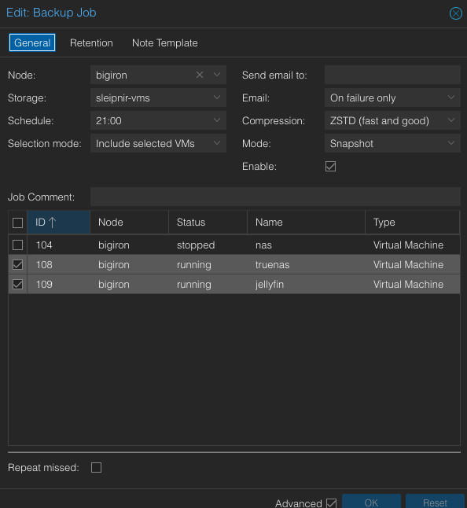
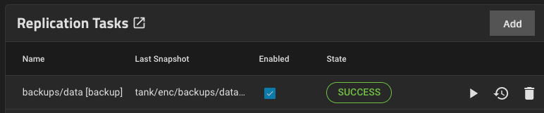
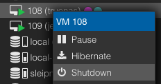
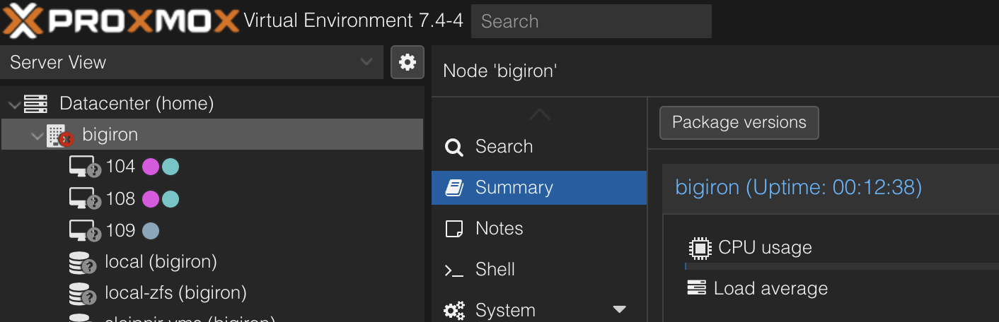
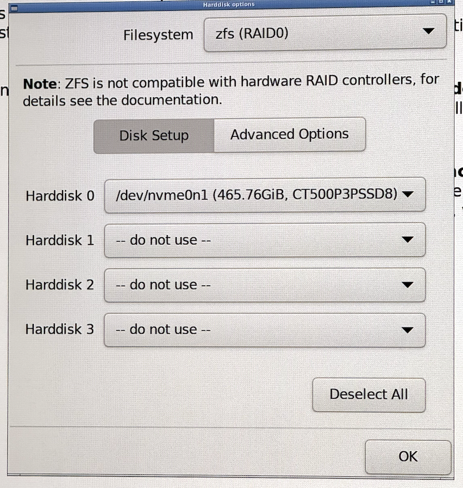
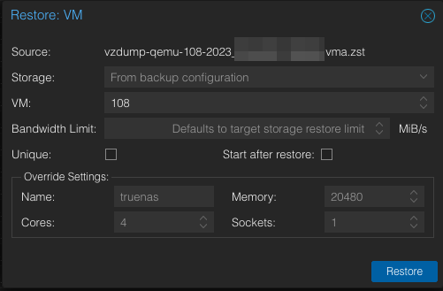
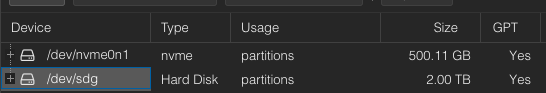
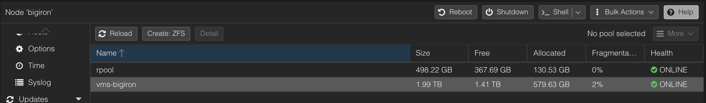
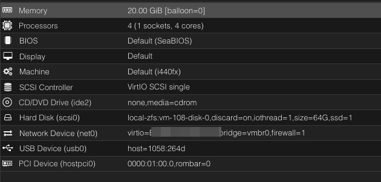
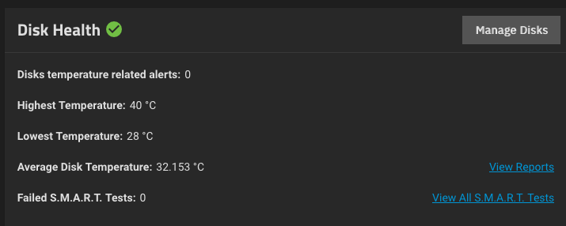

## Introduction

My [home server](/blog/2023/04/migrating-a-home-server-to-proxmox-truenas-and-zfs-or-how-to-make-your-home-network-really-complicated-for-no-good-reason/) is a Proxmox cluster. Recently, one of the host's SSDs indicated it needed a replacement.

I run [TrueNas SCALE](https://www.truenas.com/truenas-scale/) on it by passing through all my hard drives via LSI HBA so that `zfs` has access to the raw hardware, which makes the migration to a new SSD a bit tricker. For added difficulty, this process assumes the SSD is a NVMe drive on a system with a single m.2 slot.

This article just outlines the steps on how to do it, since it's not super obvious. Please do not blindly copy paste commands, otherwise you **will** loose your data. You have been warned.

*Names used*: `sleipnir.lan`: Node that stays online. `bigiron.lan`: Node where we'll replace a drive.

***Note**: If you've been here before, you might know that I normally don't write "tutorial" style articles, but I found this obscure and somewhat interesting enough a case study to make an exception. No, I'm not procrastinating on part 2 of [`bridgefour`](/blog/2023/06/building-a-functional-effectful-distributed-system-from-scratch-in-scala-3-just-to-avoid-leetcode-part-1/), you are. I added [`docker`](https://github.com/chollinger93/bridgefour/commit/945621b8e23373878db745f9e26baaf087ebbff3) support!*

## Prepare the server

Start by taking snapshots of your VMs and ensure you have backups and send them to your standby/backup server.



Since the TrueNAS VM doesn't store any data itself, ensure its replica has a copy of your `zfs` snapshots, too:



Next, turn off all existing VMs on the host. If any of the VMs runs critical services, migrate them onto a different host (if they're not HA in the first place).



Lastly, prepare the network for the loss of node in the cluster, e.g. if you run a DNS resolver or any other network software that is not redundant on it. 

## Back up the `zfs` root of the host

The default `zfs` pool in Proxmox is called `rpool`. Create a recursive snapshot.

```bash 
zfs snapshot -r rpool@new-root-drive
```

Confirm it exists:

```bash
root @ bigiron ➜  ~  zfs list -t snapshot | grep new-root-drive
rpool@new-root-drive                                 0B      -      104K  -
rpool/ROOT@new-root-drive                            0B      -       96K  -
rpool/ROOT/pve-1@new-root-drive                   5.12M      -     9.73G  -
# ...
```

This process is almost instant, since it only tracks metadata and doesn't actually copy any of your data.

Next, send it to a suitable backup location. This can be an external hard drive or your backup server.

```bash
zfs send -Rv rpool@new-root-drive | ssh sleipnir.lan zfs recv rpool/bigiron-host-backup
```

Alternatively, on the same server on a different drive:

```bash
zfs send -Rv rpool@new-root-drive | zfs recv vms-bigiron/bigiron-host-backup
```

`-R` is recursive and `-v` gives useful output:

```
total estimated size is 153G
TIME        SENT   SNAPSHOT rpool/data@new-root-drive
18:09:57   8.27K   rpool/data@new-root-drive
#...
```

If you get an instant result here, though, maybe consider being skeptical on how your computer *actually copied* (presumably) hundreds of GiB within seconds. `zfs` will **not** warn you that it just copied *only* the 104K root without `-v`.

Conceptually, you could also pipe this to a file, but I haven't tried that myself. 

Confirm it exists:

```bash
root @ bigiron ➜  ~ zfs list  | grep vms-bigiron/bigiron-host-backup
vms-bigiron/bigiron-host-backup/ROOT/pve-1                   9.52G  1.23T     9.51G  /
# ...
```

Validate the backup by `zfs import`ing it and poking around in it.

## Prepare bootable USB drives

Flash a new Proxmox ISO onto a bootable USB drive ([balenaEtcher](https://etcher.balena.io/) is a good tool).

## Prepare the cluster

***Note**: This process will remove the old node and re-add it, since the documentation warns [against](https://pve.proxmox.com/pve-docs/pve-admin-guide.html#_remove_a_cluster_node) doing it differently. On paper, you *are* be able to skip this and restore the entire `rpool` later. That didn't work too well for me. See the [notes](#youre-done--notes).*

On the remaining node, remove the old node. Make sure to set the quorum to 1 first. You won't need this if you're actually left with a quorum.

```bash
pvecm expected 1
pvecm delnode bigiron
pvecm status
```

You might want to clean up `/etc/pve/priv/authorized_keys`.

Make sure `/etc/pve/nodes/` doesn't contain the node you just removed.

If you don't do this, you will get into funny state territory:



Note how the node shows up as unavailable, but the server is actually online?

Your cluster doesn't have consensus as to what's happening here, and clearly you polling the state of `bigiron.lan` vs the UI state presented by, presumably, the other node(s) in the cluster differs. Also, all nodes have a quorum vote of 1, so good luck without an *actual* quorum (i.e., an uneven number of nodes).

## Prepare the new SSD

Shut down the server (the cluster will now be degraded I you missed out on the previous step), connect an external screen and other I/O, switch out the SSDs, boot from USB, and install a new Proxmox environment. Ensure to format the drive as `zfs`.



The system will reboot once it's done. Poke around on the web UI to make sure everything looks fine.

## Restore the backup

At this point, you have the new SSD installed, and the snapshot of the old SSD available either on the network or a different drive. 

First, import the backup pool if you used an internal drive as backup target.

```
zpool import vms-bigiron -f
zpool import boot-pool -f
```

Confirm. Do the names match? Do the sizes match?

```bash
root@bigiron:~# zpool list
NAME          SIZE  ALLOC   FREE  CKPOINT  EXPANDSZ   FRAG    CAP  DEDUP    HEALTH  ALTROOT
boot-pool      63G  6.92G  56.1G        -         -     8%    10%  1.00x    ONLINE  -
rpool        464G  1.18G   463G        -         -     0%     0%  1.00x    ONLINE  -
vms-bigiron  1.81T   540G  1.29T        -         -     2%    29%  1.00x    ONLINE  -
```

Also check ` zfs list -t snapshot`.

Next, we'll selectively grab the `data` dataset from the backup and write it to the new `rpool`.

```bash
nohup sh -c "zfs send -Rv vms-bigiron/bigiron-host-backup/data@new-root-drive | zfs recv -Fuv rpool/data" &
```

Beware of the `-F` flag:

> If the **-F** flag is specified when this stream is received, snapshots and file systems that do not exist on the sending side are destroyed.

`-v` is what you think it is and `-u` just doesn't mount the result.

`grep "total estimated" nohup.out` should give you something close to `total estimated size is 153G` from before. Mine was `135GB`.

At this point, your brand new SSD should have a pool called `rpool` that contains all your old data and VMs. Do the usual validation. I also copied my `nohup.out` file.

Now, and this is critical, confirm that no two mountpoints overlap:

```bash
zfs list 
```

For me, this happened:

```bash
root@bigiron:~# zfs list | grep -E "/$"
rpool/ROOT/pve-1                                             1.32G   336G     1.32G  /
vms-bigiron/bigiron-host-backup/ROOT/pve-1                   9.52G  1.23T     9.51G  /
```

Note the two identical mount points. I have no idea why this is allowed in `zfs`.

This caused:

```bash
root@bigiron:~# systemctl list-units --failed
  UNIT                   LOAD   ACTIVE SUB    DESCRIPTION
● chrony.service         loaded failed failed chrony, an NTP client/server
● lxcfs.service          loaded failed failed FUSE filesystem for LXC
● modprobe@drm.service   loaded failed failed Load Kernel Module drm
```

And a lot of erratic behavior.

Fix by this by:

```bash 
zfs set mountpoint=/vms-bigiron/bigiron-host-backup/ROOT/pve-1 vms-bigiron/bigiron-host-backup/ROOT/pve-1
```

And reboot.

Next, confirm everything's happy via

```bash 
root@bigiron:~# systemctl list-units --failed
  UNIT LOAD ACTIVE SUB DESCRIPTION
0 loaded units listed
```

## Confirm the HBA is set up correctly

Since we only restored the `data` dataset, we need to do this again. `ssh` into the new-old machine. If you're brave and restored the entire `rpool` in the previous step, this will all be set.

### `/etc/default/grub`

Should contain the line:

```bash
GRUB_CMDLINE_LINUX_DEFAULT="quiet amd_iommu=on iommu=pt"
```

For AMD. For Intel:

```bash
GRUB_CMDLINE_LINUX_DEFAULT="quiet intel_iommu=on iommu=pt"
```

Run:

```bash 
update-grub2
```

This will tell the kernel to use the CPU's Input-Output Memory Management Unit (IOMMU). `iommu=pt` enables this only for pass through devices.

### `/kernel/commandline`

Should exist and contain only

```bash
root=ZFS=rpool/ROOT/pve-1 boot=zfs quiet amd_iommu=on iommu=pt
```

For AMD. For Intel:

```bash
root=ZFS=rpool/ROOT/pve-1 boot=zfs quiet intel_iommu=on iommu=pt
```

Run:

```bash 
pve-efiboot-tool refresh
```

For the record - I stole this from the reddit post from the [acknowledgments](#Acknowledgments) section - I actually doubt this does anything.

### `/etc/modules`

Should exist and contain only

```bash
# /etc/modules: kernel modules to load at boot time.
#
# This file contains the names of kernel modules that should be loaded
# at boot time, one per line. Lines beginning with "#" are ignored.
vfio vfio_iommu_type1 vfio_pci vfio_virqfd
```

On both Intel and AMD.

Run:

```bash
update-initramfs -u -k all
```

This loads the required kernel modules for PCI passthrough. 

Now reboot the box.

## Fix the cluster

If you run a single-node cluster, skip this. Or go on the internet and buy a couple of servers. I suggest the latter.

Since we removed the new-old node from the cluster earlier, all we need to do is the following on `bigiron.lan`:

```bash
pvecm add sleipnir.lan
```

Next, go to your backups in the `Proxmox` UI and restore the VMs. Again, if you restored the entire `rpool`, they should just show up.



Lastly, run an update.

```bash
echo 'deb http://download.proxmox.com/debian/pve bullseye pve-no-subscription' >> /etc/apt/sources.list
apt-get update
apt-get upgrade
```

## Validate the system

Ensure all disks exist. The `Proxmox` UI should **not** list the disks controlled by the HBA!



Ensure all `zfs` pools exist. In my case, I replaced a 240G SSD with a 500G SSD, so that's easy:



Ensure all VMs exist.


Ensure your `TrueNAS` instance has the proper passthrough settings:



Start the VMs and ensure they do what you want them to do.

Especially for TrueNAS, check that the pool(s) exist and you can access S.M.A.R.T attributes as a proxy for the passthrough working as indented.



## You're done! (& Notes)

Congratulations! Your comically over-engineered server is back online. Isn't `zfs` neat?

On a side note - if you think you can just restore `rpool` wholesale (i.e., not just `/data`), this might break the cluster. The `Proxmox` docs warn against this. I tried that and couldn't get it to work. In no particular order:

- No `ntp` service would work, with odd errors I attribute to `selinux` or `AppArmor` (randomly no access to the `pid` file)
- `[quorum] crit: quorum_initialize failed: 2`
- `CAN'T OPEN SYMLINK (/etc/cron.d/vzdump)`
- `Permission denied - invalid PVE ticket`

I do encourage you to try, though. Theoretically, I don't really see a reason why this shouldn't work. I believe my main problem was having overlapping `/` rootpoints and since Proxmox nodes should be cattle, not pets, quickly restoring a couple of VMs wasn't the end of the world.

## Acknowledgements

This [thread](https://old.reddit.com/r/Proxmox/comments/lcnn5w/proxmox_pcie_passthrough_in_2_minutes/) was the main source of inspiration for when I originally set up the card.

This article does something [similar](https://lucatnt.com/2019/11/moving-proxmox-zfs-boot-drive-to-a-new-disk/), but not quite the same (it doesn't use PCI passthrough or m.2 drives). It was useful to confirm that what I was planning to do here was feasible.

And of course, the official [docs](https://pve.proxmox.com/pve-docs/pve-admin-guide.html#_remove_a_cluster_node).
