## Introduction

I run a homelab. I suggest reading my  [last article](/blog/2024/08/why-i-still-self-host-my-servers-and-what-ive-recently-learned/) about it for some context!

But I also figured I'd use the new year as an excuse to write down some updates I did over these past months. I enjoy reading these on other people's blogs, so I presume others do the same.

**tl;dr**: I basically used the time around the holidays to install a Dell PowerEdge R740XD in my basement and am herby justifying my actions.




## A short recap

The main goal of my homelab is to learn & experiment and be reasonably independent of your favorite `$GIANT_CORPORATION` selling you `$PRODUCT` by, well, doing it yourself.

### Services

It looked basically as follows: A 3 node Proxmox cluster with various self-hosted services and a NAS + redundant copies of several of these services, including the NAS.


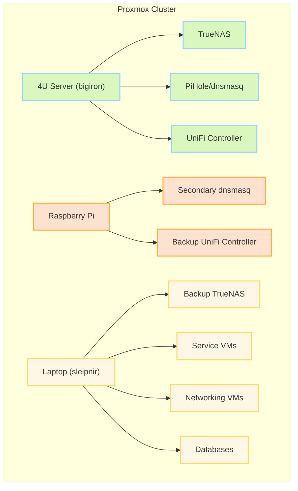

### Hardware

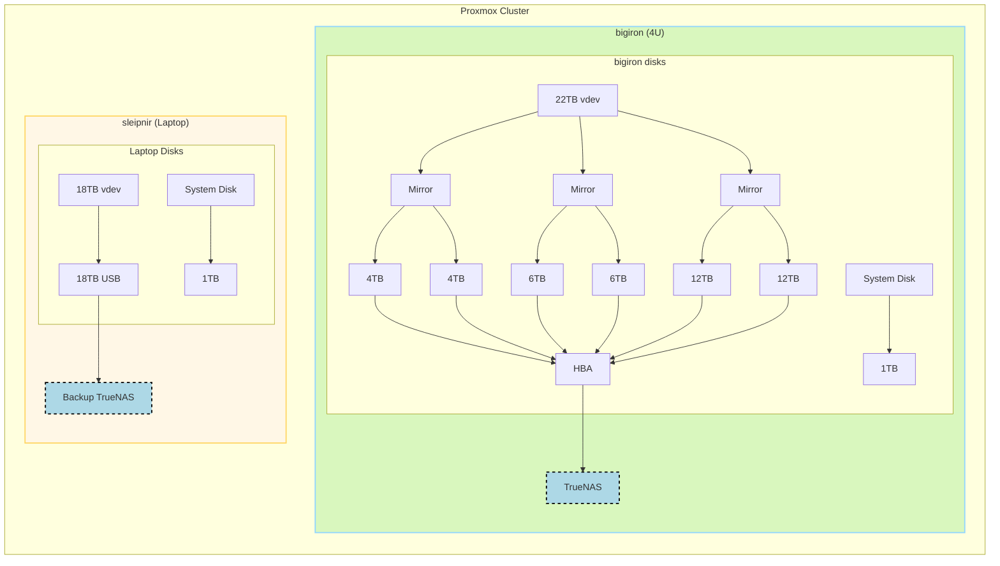

`bigiron` was built in [2019](blog/2019/04/building-a-home-server/) from commodity hardware in a 4U case and runs a virtualized TrueNAS instance (w/ HBA passthrough) and core network services.

> [!INFO]
> `bigiron`: Ryzen 3 2200G (4C/4T), 32GB DDR4-2400 RAM (non-ECC), single Gbit networking,  an LSI HBA (9211-8i), 6 mixed capacity HDDs

Then we have `sleipnir`, an old System76 laptop, that ran all other services, as well as a backup NAS, again via TrueNAS.


> [!INFO]
> `sleipnir`:  Intel i7-9750H (6C/12T), 32GB DDR4-2666 RAM (non-ECC), single Gbit networking, NVidia 1660Ti, 1TB NVME storage + an external 18TB disk via USB

A Raspberry Pi 5 simply ran and runs fallover copies for networking services like Pi-Hole/`dnsmasq` and the UniFi WiFi controller.

Networking wise, all flowing through a Mikrotik CSS326-24G-2S+ and Mikrotik RB4011. The two Mikrotik devices talk via SFP+, but all Proxmox nodes via a single 1 GBit ethernet cable each.

In other words, doing a lot of things not recommended by the software used here, but workable if the goal is to re-use existing hardware (e.g., mixed capacity `vdev`s, `zfs` over USB, virtualized TrueNAS, using non ECC-memory etc).

Rack wise:


### Some Benchmarks

While most things work well, performance certainly degraded over time as I've continued to add more services and re-use more and more hardware that somehow showed up in my basement.

To put some of my frustrations here in numbers, here's some benchmarks.

>[!NOTE]
>
> Something, something "synthetic benchmarks are not real world use cases". Is "it's slow at times, trust me" better? You'll decide.

#### I/O Performance

Those are `fio` synthetic + `dd` benchmarks to test performance of both the raw `zfs` storage as well as the `NFS` connection. I did not measure IOPS (aka "I forgot to save the results"), this aims to model more "realistic" usage in our household - and at that, it was often frustratingly slow.

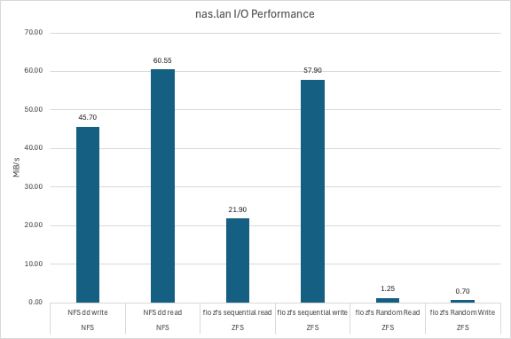

They were executed as follows on the `zfs` pool (or the `nfs` share, respectively) using the `--directory` flag.

```bash
fio --name=randwrite-test --ioengine=posixaio \
	--rw=randwrite --bs=4k --size=4G \
	--iodepth=32 --runtime=60 --time_based --end_fsync=1
```

Part of this slowness is the suboptimal configuration (striped mixed capacity mirrors), the VM overhead, and (for the purpose of benchmarks, most notably) the lack of ARC space (aka RAM). I had to have the following setting active, due to memory pressure and seeing OOM kills:

```bash
options zfs zfs_arc_max="8589934592"
```

Which is 8GiB and hence, less than the conventional wisdom of "1GB per TB of `zfs` capacity", which would work out to ~22GB of memory. I know this topic is controversial and I'll leave it at that, but this ran a suboptimal configuration out of necessity.

#### CPU & Memory

For testing CPU and memory performance, I'm using [Passmark](https://www.cpubenchmark.net/), so these values are relative to other scores on their platform:


Note that the VM here had an aggressive artificial CPU limit applied.

#### Network

Benchmarking the network is pointless - it's a shared Gbit connection. The reason why I'm doing it, and you'll see that later, is to highlight the benefits of data locality.

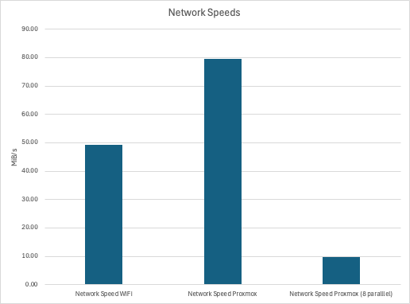

This really was just a `iperf3` command from my Macbook (~15ft from an access point), one from one cluster node to the other, and one from one cluster node to the other with 8 parallel connections.

Note that this is in MiB/s, not Mbit/s.

### Other frustrations

But wait, there's more.

#### Hardware capacity

Basically, the existing hardware was often redlining in terms of CPU and memory and hit a nightly network cap when automated backups were running. This graph illustrates an idle load:

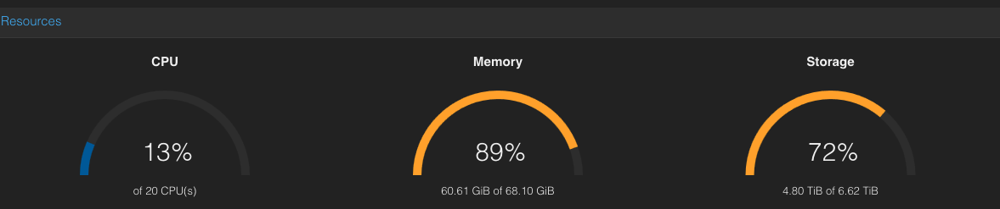

What this picture doesn't show you: If you run, for instance, a large import in [Immich](https://immich.app/) (see below), you will see the CPU struggling _hard_, which is why I turned off services I would love to run.

If you think expanding memory is easy: Well yes, but no. Not only is SO-DIMM DDR4-2666 (for the laptop) unreasonably expensive, but I couldn't re-use hardware I had laying around!

The laptop will crash/deadlock/randomly stop responding to anything if you install anything >= 2.6 GHz memory above 32GB (it supports faster memory if you use <= 32GB), since the proprietary firmware doesn't allow setting RAM speed settings/XMP and the memory will run at an unsupported speed, rather than downclocking the RAM, like a sane system, *all while passing `memtest86`*. Good fun.

>[!NOTE]
>
> Some of the memory pressure is going to be the `zfs` cache, albeit intentionally not enough, as the benchmarks above show.

I was also _constantly_ running out of disk space - one world I didn't show you in the intro was how the disk overview looked just a month or two ago:

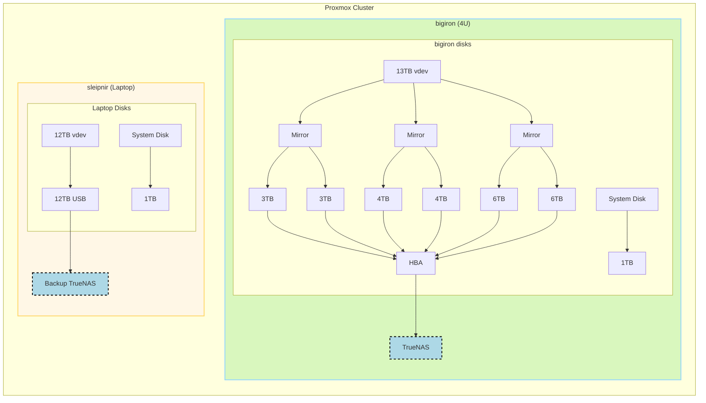

If you don't spot the difference, my original setup **only had ~12TB of actual capacity**. And while I don't use much more at the time of writing, that was perpetually full - 6TB of TimeMachine backups alone will do that to you.

The limit lies in the backup capacity: The backup TrueNAS instance can only be as big as you can fit *onto a single disk* (as it's connected via USB and I have feelings about JBOD drive bays, see [below](#new-hardware)).

Meaning, even though I have 8 HDD slots on the 4U server, other than buying really large drives, my expansion plans were very limited by what I could replicate.

Which is why I wound up buying 2x18TB drives and re-used the two existing 12TB drives in the `bigiron` server, giving me a realistic **~18TB capacity**. But other than repeating that once that's full - say, with a [$440+ 24TB](https://pcpartpicker.com/products/internal-hard-drive/#A=24000000000000&sort=price&page=1) drive - I will always be limited by a single port, just to support a configuration that's unsupported in the first place (that is, `zfs` over USB).

Not to mention the fact that that means that the backup NAS is not using redundant drives. Also not to mention cold storage backups.

The _host_ drives - i.e., the ones used by Proxmox for VM disks and backups - were also constantly filling up.

#### Device passthroughs, zfs, and all sorts of issues

Another motivating factors for changing this setup, aside from the performance, were the hard limits in terms of hardware compatibility I've encountered with my consumer hardware and with avoiding these unsupported configurations.

Two general wisdoms online are:

- The hypervisor (the Proxmox instance) is cattle and can be replaced ad-hoc and shouldn't be configured/have stuff installed on
- Everything that needs access to raw hardware - for me, most notably `zfs` - needs exclusive access via device passthrough, so that the hypervisor doesn't mess with it

So how *do* you host your TrueNAS (or OMV/Unraid/whatever "NAS" OS)?

The conventional wisdom online for virtualizing TrueNAS is *not to do it* - just buy a dedicated machine. I did not believe that, since lots of people seem to do it and apparently, there's a feud between reddit and the TrueNAS forums about it.

*If* you do, pass through the entire device, such an [HBA](/blog/2023/10/moving-a-proxmox-host-with-a-sas-hba-as-pci-passthrough-for-zfs--truenas/). Not doing so can cause data issues. And even doing so can [cause data issues](https://forums.truenas.com/t/zfs-pool-cannot-be-imported-after-reboot/28757/10) - you should really blacklist the device on the hypervisor! Proxmox can, for instance, automatically scan for `zfs` pools, which can cause [corruption](https://openzfs.github.io/openzfs-docs/msg/ZFS-8000-EY/index.html)!

> [!NOTE]
> If you think that's theoretical, you're like me. Despite passing through the HBA, but making small mistakes a long the way, I have been in the "horrible data corruption" world before and sat in my basement until 1am trying to fix my `zfs` pool, followed by a week of restoring backups.

Needless to say, that is impossible on a laptop and barely works (in my experience) with a full-sized server with dedicated PCI-E lanes.

It's also not possible to pass through a shared device - such as a laptop GPU - that shares resources/PCI lanes/other hardware, in other words, something that isn't an entire IOMMU group in itself - so I can't even use the fancy (albeit old) 1660Ti in the laptop to use e.g. hardware encoding.

The laptop BIOS also predates the Sytem76 open firmware (I've tried...) and the Intel BIOS has very limited options. See above for my RAM issues.

In other words, it's all very, very frustrating and only worked by a mix of sheer luck and some rather, say, arcane workarounds.

With all that said, I'm done with it, and suggest you do the same.

## New Hardware

So, the first update I did was in the hardware department. I first experimented with a JBOD-type USB disk array, thinking I could get away with a $150 piece of hardware and some new HDDs, but that was a disaster due to *very* unreliable connections. Also generally a bad idea, since it continues the "ZFS-over-USB" pattern, but I guess I have to learn things the hard way. ¯\\_(ツ)_/¯

```bash
[Sat Dec  7 12:30:49 2024] usb 2-3-port4: cannot reset (err = -110)
[Sat Dec  7 12:30:49 2024] usb 2-3-port4: Cannot enable. Maybe the USB cable is bad?
[Sat Dec  7 12:30:50 2024] usb 2-3-port4: cannot disable (err = -110)
[Sat Dec  7 12:30:55 2024] hub 2-3:1.0: hub_ext_port_status failed (err = -110)
```

### Meet my new-to-me Dell PowerEdge

I then simply bit the bullet and ordered a refurbished/used sever, namely a **Dell PowerEdge R740XD** 12LFF/2SFF. Codename [Yggdrasil](https://en.wikipedia.org/wiki/Yggdrasil?useskin=vector). These 14th gen Dells can be had for reasonable prices and seemed like they offer good price-to-performance ratio and are reasonably energy efficient.
> [!NOTE]
> `yggdrasil`: 2x Xeon Gold 6248 CPUs 20C/40T ea @ 2.5Ghz,  256GB DDR4-2666 ECC RAM, Dell BOSS card with 2xWD Green 480GB m.2 SATA SSDs, H730p drive controller, and 57800S 2х10Gb SFP+/ 2x1Gb networking, 2x12TB used SAS WD Ultrastar DC HC520 drives, 2x18TB SATA Seagate Ironwolf Pro, 2x3TB WD Red

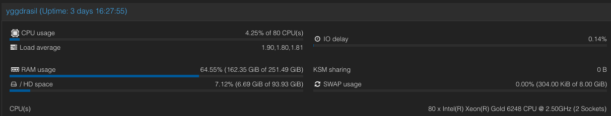

One thing I plan on adding is more fast SSD storage for VMs that would benefit from more IOPS.

In any case, this turned 6 cores / 12 threads and 32GB of memory with (realistically) one drive bay (via USB) into 40 cores / 80 threads with 256GB memory with 14 drive bays + double 10Gbps networking. If we add the NAS into the mix, that quadrupled memory and compute capacity, and 20x the networking capacity. Quite an update!

We're now looking at about ~130TB of raw storage - which, of course, is mildly absurd, considering I actually _use_ about 12TB - but at least all the hardware is redundant and we finally have enough space for VM images and VM backups and I got to re-use old drives I previously had no real place for (namely, 2x 3TB WD Reds).

With this new hardware, the new layout looks like this:

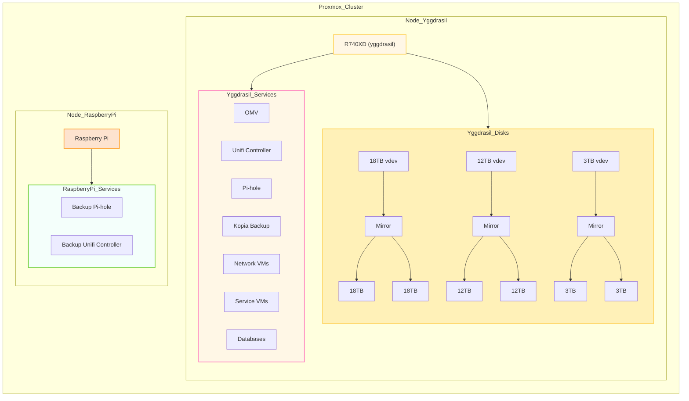

Which essentially moves all services (except for the backup TrueNAS) to the new server and kicks the Bigiron node out of Proxmox and turns it into a bare-metal TrueNAS backup box. More on that on a bit.

I'm keeping the Raspberry Pi as a Proxmox node - while not supported, it exclusively runs things like a secondary Pi-Hole (aka "`dnsmasq` with a Web UI"), which is very useful for failovers. Works very well, despite scary warnings - and it's okay if it explodes, since it's just for redundancy that rarely kicks in:

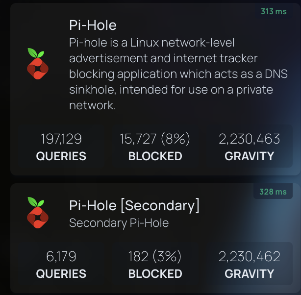

Which also means we now have 2 standalone devices not managed by Proxmox - and I'll tell you why in a second.

The rack now looks like this:


### Neat enterprise features

One great thing that comes with these 14th gen PowerEdge servers is [iDRAC](https://en.wikipedia.org/wiki/Dell_DRAC?useskin=vector) 9, Dell's management platform, which can be used to set up, monitor, power manage, and control the server. Has a separate ethernet port, too.

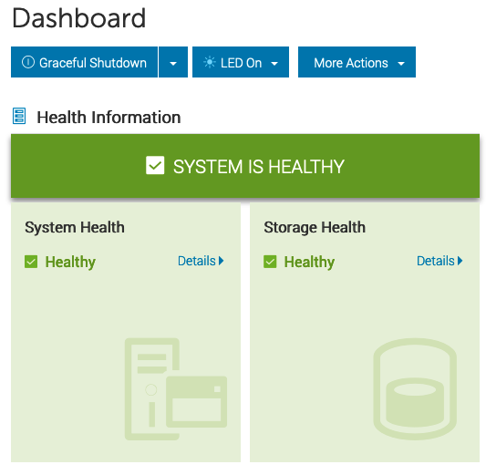

This has been pretty awesome and also works when the main sever is off. It's probably old news if you're used to this stuff, but it was pretty awesome for me, coming from a world where you'd have to set up a lot of this stuff by hand.

Hardware wise, having removable/hot swappable drive bays has been a game changer. Not taking out the server (I don't have sliding rails for the old 4U box), opening it, digging around in hard drive cages, dealing with SATA-to-SAS cables (...) has been pretty sweet.

### A world without device passthrough

As outlined above, the new server (`yggdrasil.lan`) now runs basically everything.

>  [!IMPORTANT]
>
> This adds a single point of failure.

First of all, __I now have Proxmox manage `zfs`__. Proxmox can do the basics in the UI. The Raid controller is set to HBA mode in iDRAC and Proxmox gets access to the raw disks, not virtualized.

A 12TB mirror and a 3TB mirror (as separate zfs pools) are used to run VMs, store VM disks/ backups/snapshots/ISOs and the like. These pools are exclusively used by Proxmox directly - VMs get virtual disks.

A 18TB mirror (using SATA IronWolf Pros) is the new NAS drive. This can be easily extended later by getting 2x more 18TB drives (or a single one and move to RAIDZ1).

The laptop (`sleipnir.lan`) continues to serve as a bare-metal Ubuntu server machine that can be `ssh`'d into and used as a remote dev box. It's primary purpose is the fact that is has an NVidia GPU and runs Linux. While the new server is much faster, as is my Macbook, the combination of direct hardware access + Linux + a GPU is great for things like playing with ML models.

The old main 4U server (`bigiron.lan`) also retires from Proxmox and runs TrueNAS on bare metal (so yes, the TrueNAS community forum won in the end :-) ). It continues to exclusively operate as a backup NAS and, ironically, has now more capacity than the main NAS.

### Turning Proxmox into a NAS (somewhat)

Proxmox is not a NAS OS, and that is OK. We can make do - in this setup, we still have 2 `zfs` pools on two different machines, albeit only one with a neat middleware layer (that would be TrueNAS).

But, if you set up SSH keys, you can of course still do snapshots and `zfs send`/`recv` over the network, just like you would with 2 TrueNAS instances.

TrueNAS can do backups via push and pull, i.e. as long as there is a valid `ssh` connection, the secondary TrueNAS instance can be used to initialize, monitor, and control backups via pull, without having to deal with various other third party tools or scripts.

The only thing that really needs to run on the host is something for automatic snapshots, like [`zfs-auto-snapshot`](https://github.com/zfsonlinux/zfs-auto-snapshot), the rest can be done in TrueNAS.

For accessing the data on the primary node, we do lose the convenient `smb` and `nfs` management UI options from TrueNAS, but those are ultimately just 2 config files we can trivially throw in a `git` repo.

It's also possible to use an LXC container (if unprivileged, then it needs some UID/GID remapping shenanigans) with something like [Cockpit](https://cockpit-project.org/) or [OMV](https://www.openmediavault.org/), since you can pass arbitrary host paths to LXC containers (unlike VMs, which get virtual disks or device passthrough, neither of which we want) - as long as we don't have anything else manage `zfs`.

### New Benchmarks

Let's compare the before and after.

#### I/O Performance

Unsurprisingly, we're doing a *lot* better on I/O. The following parameters have changed:

- We have a _lot_ more memory and no artificial limits for the ARC cache
- There's no longer any abstractions in form of a VM
- Caching. Did I mention it?
- The disks are newer and faster

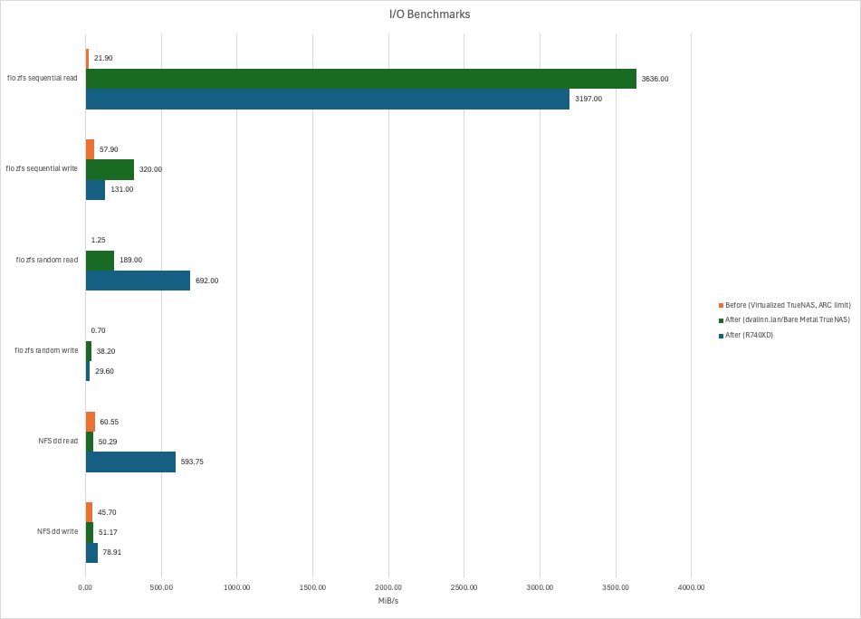

Of course, these sequential read numbers are absurd - see [this](https://pv-tech.eu/posts/common-pitfall-when-benchmarking-zfs-with-fio/) article. The graph looks cool, though. It certainly *feels* snappier. And positive feelings are just what I want after re-wiring my basement.

A file copy from a Windows box via a hardwired connection ran at a steady ~80MB/s.

#### CPU & Memory

The new hardware is faster. No surprise here. Memory is about the same. None here either.

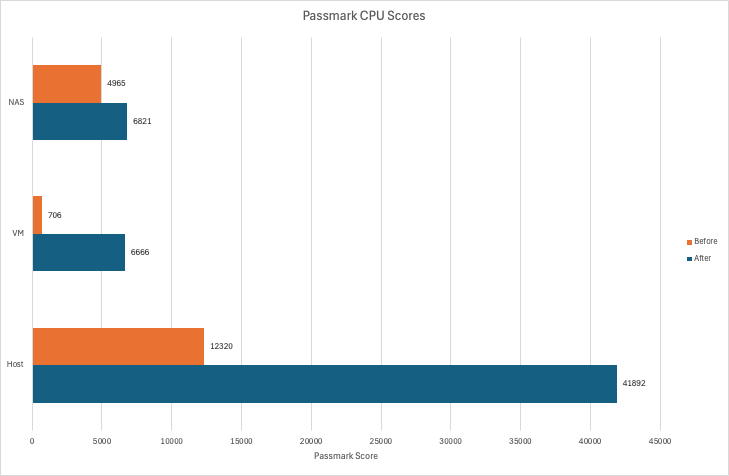


One thing these benchmark comparisons won't tell you the *headroom* we now have available. As I've outlined earlier, I ran some VMs with aggressive CPU limits or a lot less memory than they could use - all of which are now things of the past. Want more RAM? Have more RAM.

#### Network

Now, i've said it above - benchmarking the network is pointless, since we know what the ports and cables are capable of.

However! This new setup now has the "NAS" (aka the `zfs` pool + NFS/SMB shares) - which stores all of the data - on the same machine as all the services, including the I/O intensive ones, which means, we've now got data locality (i.e., the data lives on the same physical node as the service), which is, unsurprisingly, a lot faster than dealing with network overhead.

Basically, we can avoid this being the upper limit:

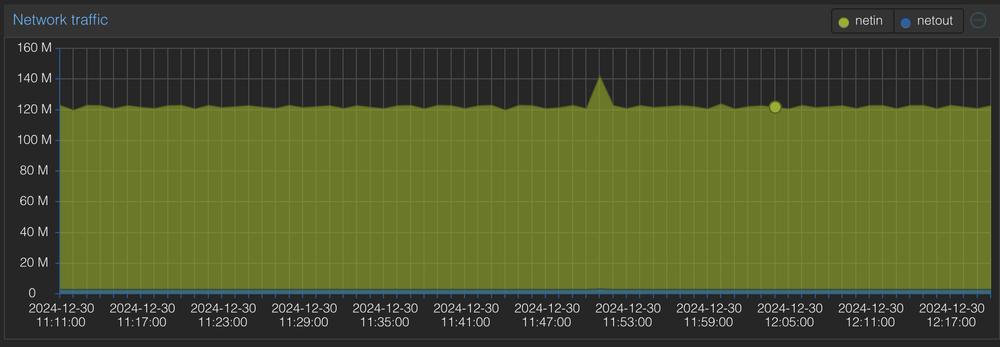

And just to entertain you, here's how that plays out if we run `iperf3`, but not actually use a physical network, but rather talk from the host to the VM:

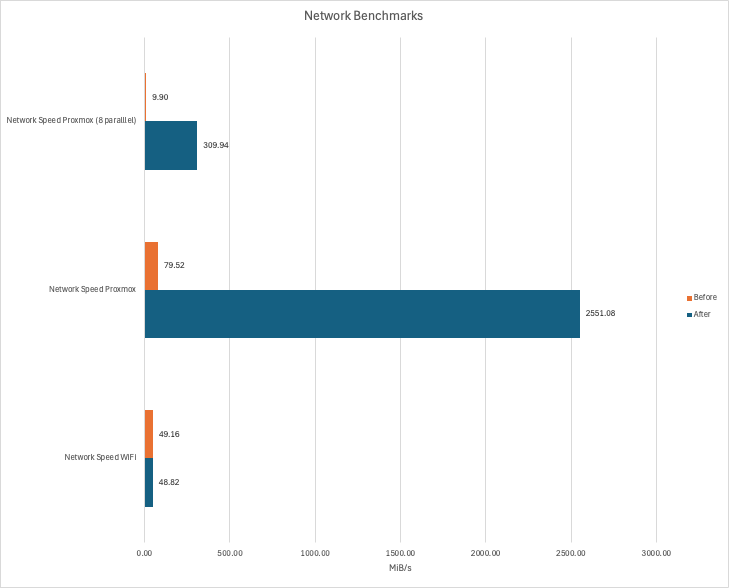

An unseen consequence: While running a network transfer that effectively maxes out the Gbit port - see the Proxmox graph above - we can hammer the same node from various other Gbit connections and not break a sweat. Here's the Pi node `iperf`ing to a VM on `yggdrasil`:

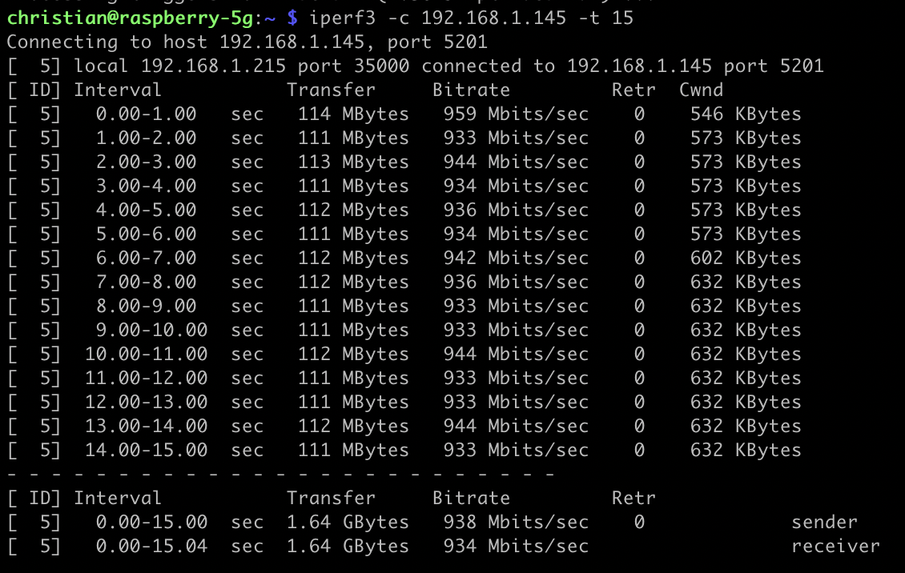

And we'll just see basically 2xGbit connections on the host:

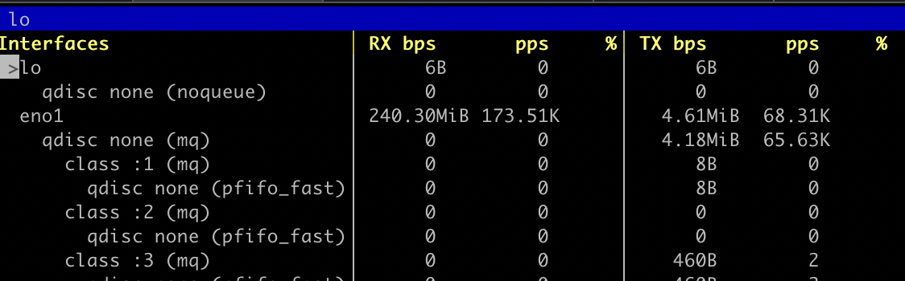

Not surprising, but appreciated.

## New Services

That much for hardware. Let's talk software.

In all fairness, I've set up most of them before I even got new hardware, but if you want to nerd-snipe yourself, I suggest re-creating some of these.

> [!INFO]
> If you've made it this far, you probably don't need this disclaimer, but I've [written about](blog/2024/08/why-i-still-self-host-my-servers-and-what-ive-recently-learned/) **why** I self host last year.
>
>
>
> **tl;dr**, it's a great learning-by-doing exercise for niche networking and DevOps topics, while also providing a lot of software freedom and privacy - just in case you're wondering "Why would you do that‽".

### TLS with Traefik

I would never do this in production/at work, but for home use, I've set up [Traefik](https://traefik.io/traefik/) as an application proxy that provides real TLS certificate via Let's Encrypt to a wildcard domain underneath an actual domain I own.

This was fun, since it requires you to mess with TLS and routing a bit more than just hosting `dnsmasq` and pointing IPs to e.g. `nas.lan` via an `A` record.

Essentially - and you can do this with e.g. nginx proxy manager too but `traefik` is all config/`yaml` based and works great with VC - I've set up `CNAME` records that all point to `traefik.mysubdomain.example.org` for each service, which itself is an `A` record, pointing to that instance.

Within `traefik`, it listens to ports 80, 443, 3306 (and so on) and patches requests through routers into services, which themselves point to the actual service IPs + ports, running in Proxmox VMs.

These routers have a configuration  like this:

```yaml
router-$service:
  entryPoints:
    - websecure
  rule: Host(`$service.$subdomain`)
  service: svc-$service
  tls:
    certResolver: letsencrypt
    domains:
      - main: "*.$subdomain"
```

Traefik then handles the TLS certificates, which uses [Let's Encrypt](https://letsencrypt.org/) as ACME. Since it's internal, we can use e.g. Cloudflare to use a DNS-01 [challenge](https://doc.traefik.io/traefik/https/acme/#dnschallenge) - since Cloudflare can use an API call to set up the required temporary public `TXT` record to fulfill the challenge and get a wildcard cert for this subdomain.

In other words, all internal HTTP communication can now be HTTP**S**!

That is, of course, a giant waste of time, since chances of somebody siphoning off network traffic in an essentially airgapped environment (as far as inbound traffic goes) are low, but I guess never zero. Was fun to set up though.

I also use it as a source of truth for other services that don't strictly need (but could use) TLS, but just a convenient domain name (e.g., `postgres`). It's nice to have one config file that has all these mappings.

### Homepage.dev instead of Heimdall

Our LAN landing page is now [Homepage.dev](https://gethomepage.dev/). It's main draw is the fact that it's also configured via a `yaml` file, but it has more nice, niche features over [Heimdall](https://heimdall.site/), such as application monitors and stats.

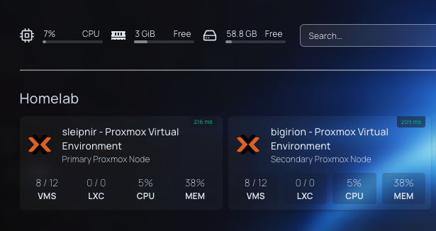

### Mealie

[Mealie](https://mealie.io/) is a recipe manager that replaced bookmarks, scanned PDFs, printed out recipes with hand written annotations, and some hand-curated markdown files.

It's all based on the [Recipe JSON schema](https://schema.org/Recipe), which means it can easily import recipes into its database from compliant CRMs - and also means there's no vendor lock-in. Same way how e.g. [Google](https://developers.google.com/search/docs/appearance/structured-data/recipe) shows recipe data!

I also wrote some short lived Python scripts to translate a lot of recipes I wrote in Word (thankfully, using a template) to a Recipe JSON over the years and digitized some PDF scans (like my grandmother's cookie recipes) via OCR and sent all of it to the Mealie API. Since I keep my files well organized, folders served as tags.

```json
{
  "@context": "https://schema.org/",
  "@type": "Recipe",
  "name": "Mai Tai",
  "recipeIngredient": [
    "3/4 oz fresh lime juice",
    "1/4 oz Pierre Ferrand orange curaçao",
    "1/2 oz orgeat",
    "2 oz demarara rum (e.g., Hamilton 86) or a blend with a funky Jamaican like Smith & Cross"
  ],
  "recipeInstructions": [
    {
      "@type": "HowToStep",
      "text": "Shake over crushed ice, serve with crushed ice, half a lime, and fresh mint"
    }
  ],
  "keywords": [
    "cocktails",
    "rum",
    "wikijs_import"
  ]
}
```

That all worked pretty well, all things considered - some things needed fixing by hand, but by basically throwing together a simple parser + some API calls, I was able to automate a _very_ daunting task largely away. We're talking 400+ recipes here.

I did go through all of them by hand over the weeks to add categories and more tags, but overall, I'm very happy with it and have already gotten into the habit of importing into Mealie, rather than into a bookmark.

### Other services that deserve a mention

[dockge](https://github.com/louislam/dockge) has been a helpful overview about running Docker compose files, although I don't run it for management (the `docker-compose.yamls` are all mounted as `ro`), it's been great for a quick overview of "what's running on this VM?". Also, less complexity than portainer.

[Netbox](https://netboxlabs.com/docs/netbox/en/stable/) is not something I needed, far from it, but it's been fun to LARP as an actual data center. I have not touched the IPAM component.

[Immich](https://immich.app/) has shown a lot of promise for picture management (I've usually relied on a Finder window + a `smb` mount... which doesn't do much in the way of "management"), but using external storage is certainly treated as a 2nd class citizen there - you need an external Python script to create albums based on folders if you don't let Immich re-organize your files. Overall, I'm very keen on experimenting a lot more with it since it genuinely seems fantastic, but perhaps with a copy of all my photos, rather than a shared drive.

I've also started working on CI/CD and even a developer CLI (think "deploy this service from your terminal"), but I will spare you the writeup of me re-inventing a cursed chimera between Helm and Jenkins for now. It uses a lot of jinja. Maybe a Helm/Jenkins/dbt chimera...?

## Outside Ingress with ngrok

I usually don't need outside access, since most services are LAN only, but mealie specifically is useful while shopping.

I've used [ngrok](https://ngrok.com/) with a [Traffic Policy](https://ngrok.com/docs/traffic-policy/) + an OAuth scope that let me do that, but only from within the country, since I don't really need my recipe list accessible overseas, which is a nice touch for security and peace-of-mind.

This simply blocks access from outside of the US:

```yaml
on_http_request:
  - expressions:
      - conn.geo.country_code != 'US'
    name: Only allow US traffic
    actions:
      - type: custom-response
        config:
          status_code: 401
          content: Unauthorized request due to country of origin
on_http_response: []
```

And:

```bash
ngrok http --url=$MEALIE_DOMAIN 9000 --traffic-policy-file policy.yaml --oauth google --oauth-allow-email $ALLOWED_USER
```

And it just works(tm). This can just be part of the [docker-compose.yaml](https://ngrok.com/docs/using-ngrok-with/docker/).

## Smaller changes

Worth noting, perhaps, are some smaller changes.

- I've used up more ports on my PoE switch to (in theory) provide a dedicated 1Gbps port per Ubiquiti AP, since the PoE switch can't do SFP+. Makes no real world difference, of course, but still.
- I've moved from Google to [kagi.com](https://kagi.com/), since I found Google to be more and more unusable, especially with their atrocious "AI" generated results
- I purchased a copy of [Royal TSX](https://www.royalapps.com/ts/mac/features), which is a nice, convenient connection manager and terminal for having a lot of SSH (or other) connections. No subscription!

## Side notes

### How to manually migrate a Proxmox VM

Remember how I mentioned the laptop crashing under load with memory that's too fast, since an XMP setting in the firmware is too much to ask? Yeah.

If your Proxmox node crashes during a VM migration, I messes up state and you get various fun errors, so don't bother with the UI. It's not atomic _at all_. *Something, something, distributed systems.*

So, helpful as I aim to be, here's steps to move a VM from A to B manually. The VM has the ID 106, lives on 192.168.1.214 and is being migrated to 192.168.1.216.

```bash
# on 192.168.1.214, as root
cd /etc/pve/qemu-server/
zfs snapshot rpool/data/vm-106-disk-0@manual-migration
zfs send rpool/data/vm-106-disk-0@manual-migration | ssh root@192.168.1.216 "zfs receive ygg_tank/vm-106-disk-0"
mv 106.conf 106.conf.bkp
scp 106.conf.bkp root@192.168.1.216:/etc/pve/qemu-server/106.conf
# on .216
cd /etc/pve/qemu-server/
sed -i 's/scsi0: local-zfs/scsi0: ygg_tank' 106.conf
# magic happens in the UI
```

### Power Consumption & Fans

We're looking at ~270Wh with a 2.2/2.64/2.81 load average on the PowerEdge (as per iDRAC) and 252W reported by the UPS.

Fun fact: iDRAC tells me that the server used ~16,000 kWh since its first boot in mid-2020, with a historical peak of 922Wh.

Average fan speed is 20.33% PWM in the same scenario in a ~65F/~18C basement, which is not terribly loud.

## Conclusion

I am now officially a fan of used enterprise hardware. Case closed. More to come!
