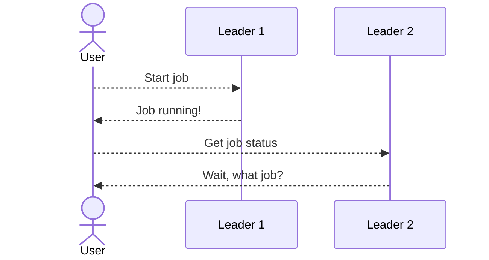
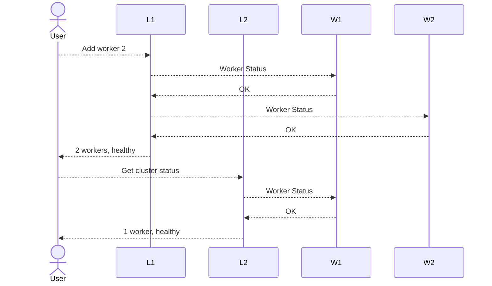
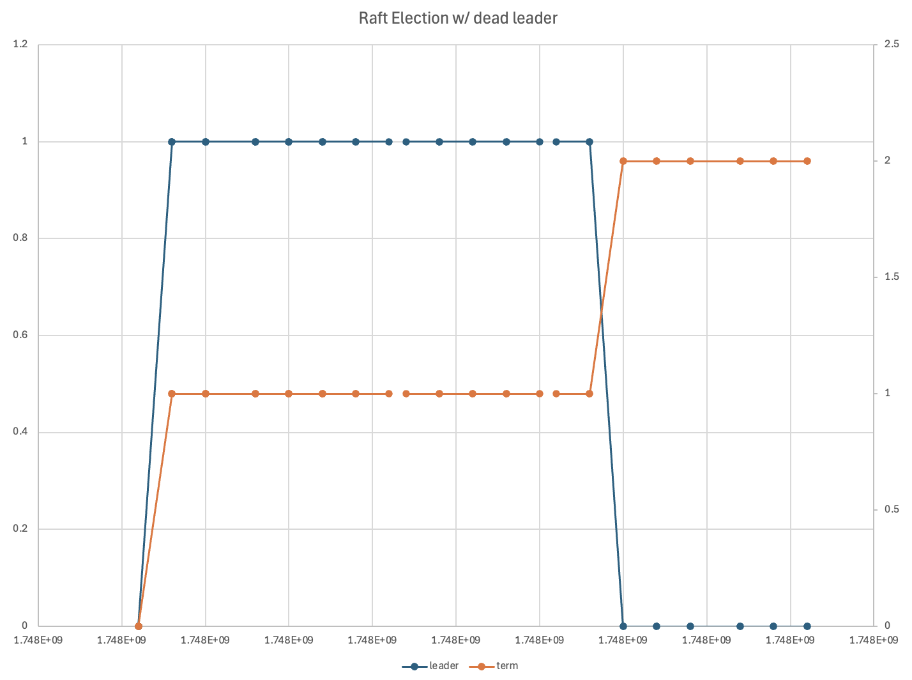

## Introduction

It's been a minute since we've talked about Bridge Four, my distributed system from scratch in Scala 3.

If you haven't read [parts 1](/blog/2023/06/building-a-functional-effectful-distributed-system-from-scratch-in-scala-3-just-to-avoid-leetcode-part-1/) and [two](/blog/2024/02/improving-my-distributed-system-with-scala-3-consistency-guarantees-background-tasks-part-2/), I suggest you do so. This is purely a vanity project for me to mess around with distributed systems and Scala 3, since I very much believe in learning by doing. And as they say, journey before destination...

> [!TIP]
>
> Super short cliff notes and semantics of the system:
>
> - Single leader, multi-worker
> - Eventually consistent (see below)
> - Redundant workers, SPOF in the leader
> - “Self”-healing (workers can be killed and re-started during execution, the leader will recover)
> - And for some **terminology**:
>   - A **job** reads files, performs computations, and writes output files
>   - Each **job** executes *N* **tasks** (N > 0)
>   - Each **task** executes on a **worker** (aka a `spren`)
>   - Each **worker** has a set number of **slots** with each can execute exactly 1 **task** in parallel
>   - The **leader** is called `kaladin`
>
> Lastly, any implementation avoids libraries, pre-built algorithms, or things like databases or `etcd` - that would defeat the purpose.

In this article, we'll discuss the following updates:

- The system will support a quorum of leaders, synchronized via [Raft](#getting-consensus) (albeit no log replication)
- We'll be able to dynamically [scale](#autoscaling-fundamentals) workers
- We'll be able to [submit](#jobs-and-jars) jobs via a class name/path, rather than a hard-coded ADT


## Scala Updates: First things first


> [!TIP]
> Code diff [here](https://github.com/chollinger93/bridgefour/pull/3/files).


Scala 3 is actually getting pretty frequent updates. For a "dead language" - source, reddit, of course - it's quite impressive. The original version of this project was on Scala 3.3, and now it's 3.6.4. A lot has happened in ~2 years. I have not updated to 3.7 just yet.

> [!NOTE]
>
> Before the keyboard warriors come out: Yes, of course Python is more popular, yes, of course, Scala is niche. Doesn't mean it doesn't still have an active community, which for me would be part of the "dead language" claim.

I've actually been chasing bleeding edge Scala versions at work, since each version has offered something substantial that was worth the hassle of upgrading.

In [Scala **3.6.3**](https://www.scala-lang.org/news/3.6.3/), we got `-Yprofile-trace` for generating trace events in a standard JSON format. This is not quite the same as [scalac-profiling](https://github.com/scalacenter/scalac-profiling) from 2.x, but it helps. It was useful for me to figure out our long build times at work, where I make heavy use of `scalapb` and `avro4s`.

**[3.6.2](https://www.scala-lang.org/news/3.6.2/)** actually carried substantial syntax features. Most interestingly (for me):

- you can now replace the `with` keyword with `:` when defining simple type classes,
- context bounds can now be named and aggregated using `T : {A, B}` syntax,

But there's a bunch more.

[**3.5.2**](https://www.scala-lang.org/news/3.5.2/) added `-Wall` for all available linting. I don't believe in custom code style guides (within reason) and _always_ have robots do & enforce reasonable standards - which is why I like `black`'s philosophy in `python` and despise the Scala 3 indentation debate.

**[3.5.0](https://www.scala-lang.org/blog/2024/08/22/scala-3.5.0-released.html)** made Scala CLI the default, but most importantly, made [pipelined builds](https://www.youtube.com/watch?v=1uuFxEAiPuQ&t=1473s) available. I think I updated our work codebase the day this came out.

It also added `language.experimental.namedTuples` as defined [here](https://docs.scala-lang.org/sips/named-tuples.html), which I find... curious. I'm allergic to unnamed tuples, since they're hard to read and hard to reason about, especially if you let the compiler figure out the types.

Since I write a lot of `go` at work, I write a lot of 2-value `struct`s. Similarly, in Scala, I write a lot of `case class`es, and in Python a bunch of `@dataclass` garbage. I'm not convinced that named tuples solve this issue - and I haven't used them yet - but it beats `_.1` and others by a large margin.

**[3.4.0](https://www.scala-lang.org/blog/2024/02/29/scala-3.4.0-and-3.3.3-released.html)** also had a lot of improvements. Perhaps most importantly for this project, the following syntax is now officially deprecated:

- `_` type wildcards (rewrite to `?`)
- `private[this]` (rewrite to `private`)
- `var x = _` (rewrite to `var x = scala.compiletime.uninitialized`)
- `with` as a type operator (rewrite to `&`)
- `xs: _*` varargs (rewrite to `xs*`)
- trailing `_` to force eta expansion (can be just omitted)

So we can do `-rewrite -source 3.4-migration`.

I also upgraded `scalfmt` from 3.6.1 to 3.9.4.

Scalafix now finally has `RemoveUnused` support with Scala 3.4.

Most changes from `scalafmt`/`scalafix` were around imports:

```diff
index cf13c15..f5d44e1 100644
--- a/modules/spren/src/main/scala/com/chollinger/bridgefour/spren/http/WorkerRoutes.scala
+++ b/modules/spren/src/main/scala/com/chollinger/bridgefour/spren/http/WorkerRoutes.scala
@@ -1,28 +1,18 @@
 package com.chollinger.bridgefour.spren.http

 import cats.Monad
-import cats.effect.*
-import cats.effect.kernel.Sync
-import cats.syntax.all.*
+import cats.syntax.all._
...
```

All in all, I think Scala 3 generally got a lot better in the last 2 years.

## Pre-Commits

Speaking of formatting, I've also re-written a good chunk of [scala-pre-commit](https://github.com/softwaremill/scala-pre-commit-hooks/pull/16) and added this to the project. I find having a `.pre-commit-config.yaml` is a good practice, but I am very biased in favor of pre commits and letting robots make decisions on formatting and such. We now also use this fork at $WORK.

## Jobs and Jars

> [!TIP]
> Code diff [here](https://github.com/chollinger93/bridgefour/pull/4/files).

For a more substantial change: One strange thing has always been how Bridge Four submit jobs - we just baked it into the job and pattern matched over an ADT of pre-defined job classes.

```scala
def make[F[_]: Async: Temporal: Logger](): JobCreator[F] = (cfg: AssignedTaskConfig) =>
  cfg.jobClass match
    case JobClass.SampleJob           => SampleBridgeFourJob(cfg)
    case JobClass.DelayedWordCountJob => DelayedWordCountBridgeFourJob(cfg)
    case _                            => ???
```

From the `README.md`'s "not implemented" section':

> - A sane **job interface** and a way to provide jars - the `BridgeFourJob` trait + an `ADT` is pretty dumb and nothing  but a  stop gap. See the article for details

### Using reflection to get jobs

However, the JVM actually makes side loading classes very easy, since we can just expect a class name like `com.chollinger.bridgefour.shared.jobs.SampleJob` and create a job via reflection.

However - and this is a big "however" - this is only easy for concrete types. But keep in mind, `bridgefour` uses [Higher Kinded Types](blog/2023/06/building-a-functional-effectful-distributed-system-from-scratch-in-scala-3-just-to-avoid-leetcode-part-1/#some-thoughts-about-functional-programming), with the [Tagless Final pattern](https://www.baeldung.com/scala/tagless-final-pattern) (although not for the jobs themselves), i.e. the framework itself largely defines "twice abstracted" interfaces, including abstracted types; it does conceptually work with a `cats.effect.IO`, as well as with `ZIO` or your own framework.

As such, both of these are valid jobs one can submit:

```scala
// Abstract
case class SampleBridgeFourJob[F[_]: Async](cfg: AssignedTaskConfig) extends BridgeFourJob[F]
// Concrete
case class IOBridgeFourJob(cfg: AssignedTaskConfig) extends BridgeFourJob[IO]
```

Therefore, if we _know_ it'll be `[F[_] : Async]`, we know that we get a constructor like this (you can see this with a debugger + some reflection, btw):

````java
SampleBridgeFourJob(com.chollinger.bridgefour.shared.models.Task$AssignedTaskConfig,cats.effect.kernel.Async)
````

And so, we could do:

```scala
  def makeJob(className: String, cfg: AssignedTaskConfig): BridgeFourJob[F] = {
    val cls      = Class.forName(className)
    val ctor     = cls.getDeclaredConstructor(classOf[AssignedTaskConfig], classOf[Async[F]])
    val instance = ctor.newInstance(cfg, summon[Async[F]])
    instance.asInstanceOf[BridgeFourJob[F]]
  }
```

Because we can `summon[Async[F]]`, since we know about it.

But because type parameters (`F[_]`) are erased at runtime, we have no idea what `F` *actually* is, i.e. we can't `summon[MagicType]`, despite the following:

```scala
val cls = Class.forName(className)
val params: Array[Type] =
      cls.getAnnotatedInterfaces.head.getType.asInstanceOf[ParameterizedType].getActualTypeArguments
```

Returning e.g. `[cats.effect.IO]`, but we cannot summon an `IO`.

So making this generic - in a generic framework - is challenging.

### Best Guess

Conceptually, the following works, where we explicitly provide an instance of the effect (or other parameters as `AnyRef`) at compile time:

```scala
// deps: e.g. IO
def makeJob[F[_]](className: String, cfg: AssignedTaskConfig, deps: AnyRef*): BridgeFourJob[F] = {
  val cls = Class.forName(className)

  // Build out the arguments
  val args = cfg +: deps
  val argTypes = AssignedTaskConfig.getClass +: deps.map {
    case null => classOf[Object]
    case x    => x.getClass
  }

  // ...and search for a matching constructor
  val ctor = cls.getConstructors.find { c =>
    val paramTypes = c.getParameterTypes
    paramTypes.length == argTypes.length &&
    paramTypes.zip(argTypes).forall { case (p, a) => p.isAssignableFrom(a) }
  }.getOrElse {
    val argsStr = argTypes.map(_.getName).mkString(", ")
    throw new NoSuchMethodException(s"No constructor found for $className with args: $argsStr")
  }

  val instance = ctor.newInstance(args*)
  instance.asInstanceOf[BridgeFourJob[F]]
}
// ...
def myProgram[F[_]: Async](): F[Unit] = {
  // Async[F] as AnyRef
	makeJob(TestJobs.sampleJobClass, Config(), summon[Async[F]])
}
```

But, of course, if `F` is actually `IO` at runtime...

```scala
myProgram[IO]()
```

...then `summon[Async[F]]` actually summons `IO` - since it fulfills the constraints - and it can't find a constructor for

```scala
SampleBridgeFourJob[F[_]: Async](cfg: AssignedTaskConfig) extends BridgeFourJob[F]
```

anymore. Similarly, if we define a job concretely:

```scala
case class IOBridgeFourJob(cfg: AssignedTaskConfig) extends BridgeFourJob[IO]
```

Then the constructor will actually be `IOBridgeFourJob(AssignedTaskConfig)`, rather than  `IOBridgeFourJob(AssignedTaskConfig, cats.effect.IO)`.

### Why so complicated

> [!NOTE]
>
> I'm at about the bleeding edge of my JVM reflection + effect knowledge here, so if you know if there's a better way to do this, please reach out.

I ultimately used the [grugbrain](https://grugbrain.dev/) solution:

```scala
trait BridgeFourJobCreator[F[_]] {
  def makeJob(className: String, cfg: AssignedTaskConfig): BridgeFourJob[F] = {
    val cls      = Class.forName(className)
    val ctor     = cls.getDeclaredConstructor(classOf[AssignedTaskConfig])
    val instance = ctor.newInstance(cfg)
    instance.asInstanceOf[BridgeFourJob[F]]
  }
}
```

And simply declared:

```scala
/** The base job interface. Since these jobs are summoned, they need a concrete effect type in their implementation
  *
  * @tparam F
  *   Effect, e.g. IO
  */
trait BridgeFourJob[F[_]: Async]
```

And honestly - since jobs _are_ concrete implementations, writing them with HKTs seems marginally useful (which is a polite way of saying "not useful at all"). 🤷‍♂️

### Creating jobs

For creating jobs, we can create a new repo that just contains jobs. We could also do a module, but for the sake of the exercise, having a standalone repo is more realistic.

> [!Tip]
>
> You can find this repo [here](https://github.com/chollinger93/bridgefour-example-jobs).

Now, I don't publish `bridgefour` as a `sbt` dependency, but we can set up a `build.sbt` as such:

```scala
lazy val bridgefourShared = ProjectRef(
  uri("https://github.com/chollinger93/bridgefour.git"),
  "shared"
)

lazy val root = (project in file("."))
  .settings(
    commonSettings,
    name := "wordcount",
    libraryDependencies ++= sharedDeps,
  )
  .dependsOn(bridgefourShared)
lazy val root = (project in file("src"))
  .settings(
    commonSettings,
    name := "wordcount",
    libraryDependencies ++= sharedDeps,
  ).dependsOn(RootProject(uri("https://github.com/chollinger93/bridgefour.git")))
```

Which is a neat trick I didn't know before. The job looks like it did before, just with a concrete effect:

```scala
case class DelayedWordCountLeaderJob(job: JobDetails) extends LeaderJob[IO] {
  // ...logger, encoder
  private def readFileAsCsv(in: FilePath): IO[Map[String, Int]] = // ...

  def collectResults(): IO[Json] = for {
    counts <- allFiles.parTraverse(f => readFileAsCsv(f))
    res = counts.foldLeft(Map[String, Int]()) { case (m1, m2) =>
            m1 ++ m2.map { case (k, v) => k -> (v + m1.getOrElse(k, 0)) }
          }
  } yield res.asJson
}
```

And we can use trusty old `sbt assembly` to build a fat jar.

We can then just add a volume and set the classpath as env var in the main `bridgefour` `build.sbt`:

```scala
lazy val dockerSettings = Seq(
  dockerUpdateLatest   := true,
  dockerBaseImage      := "eclipse-temurin:17-jdk",
  dockerExposedVolumes += "/jars",
  scriptClasspath     ++= Seq("/jars/*")
)
```

### Submitting

And submit the job with a class name (and ensure we add the jar to `/jars` as a docker volume):

```json
{
    "name": "Example job",
    "jobClass": "com.chollinger.bridgefour.jobs.example.DelayedWordCountBridgeFourJob",
    "input": "/tmp/in",
    "output": "/tmp/out",
    "userSettings": {
        "timeout": "2"
    }
}
```

If we don't, we get:

```
2025-05-09 19:38:16 spren-01-1  | [io-compute-2] INFO  o.h.s.m.Logger - service raised an error: class java.lang.ClassNotFoundException
```

It would be better to validate this during job submission, but I've simply updated the existing `JobCreator` service so summon this class at runtime - that way, it doesn't change the API.

## Autoscaling Fundamentals

Wouldn't it be neat not having to know how many workers we need before starting a cluster?

> [!TIP]
> Code diff [here](https://github.com/chollinger93/bridgefour/pull/5/files).

### To scale, you need to be flexible

I should get a job to write inspirational quotes for Hallmark cards, but the title is true: When we talk about scaling, we usually (at least in the "data" world) refer to *horizontal* scaling, i.e. adding more workers/pods/... to our workload to process more data in parallel. This is equally applicable to a web server as it is to a Spark job.

Kubernetes even has native constructs for this, such as the [Horizontal Pod Autoscaler](https://kubernetes.io/docs/tasks/run-application/horizontal-pod-autoscale/) which does exactly that - adding pods to work on the same workload.

This, of course, requires our system to be scalable in its codebase. For instance, a web server can simply accept (and route) requests without much coordination (since REST is, by definition, stateless). But a system consuming from e.g. Kafka can only consume as much in parallel as there are things to consume from (e.g., topic partitions).

### Adding workers as runtime state

For Bridge Four, we can't just add more containers/pods/machines, since Kaladin (the leader) must be aware about his workers in order to assign tasks. Thus far, this was done by a static configuration file - at startup, we know how many workers we need.

Fortunately, this is a relatively easy fix, since the state of the cluster isn't actually hard-coded. The leader simply refers to its own `Config` and generally does a

```scala
 cfg.workers.parTraverse(f: A => M[B]))
```

The `Config` itself, of course, _is_ a constant. But by changing our programs from just relying on a `ServiceConfig`, we can wrap this in our general purpose KV wrapper (`Persistence`).

```scala
case class ClusterControllerImpl[F[_]: ThrowableMonadError: Concurrent: Async: Logger](
    // ...
    cfg: ServiceConfig,
    workerConfig: Persistence[F, WorkerId, WorkerConfig]
```

I put this in a thin wrapper:

```scala
sealed trait WorkerCache[F[_]] {
  def get(id: WorkerId): F[Option[WorkerConfig]]
  def add(cfg: WorkerConfig): F[Unit]
  def list(): F[Map[WorkerId, WorkerConfig]]
}
// ...
def makeF[F[_]: Async](
    cfg: ServiceConfig,
    workers: Persistence[F, WorkerId, WorkerConfig]
): F[WorkerCache[F]] = ???
```

Using `makeF` ensures the cache is seeded. A small, but useful abstraction.

And so, we can make changes as such:

```diff
       override def getClusterState(): F[ClusterState] =
         for {
-          _ <- Logger[F].debug(s"Configured workers: ${cfg.workers}")
-          state <- cfg.workers
+          workerMap <- workerConfig.list()
+          workers    = workerMap.values.toList
+          _         <- Logger[F].debug(s"Configured workers: $workers")
+          state <- workers
                      .parTraverse(c => checkWorkerState(c))
           _      <- Logger[F].debug(s"Worker responses: $state")
-          cluster = ClusterState(cfg.workers, state)
+          cluster = ClusterState(workers, state)
           _      <- Logger[F].debug(s"Cluster: $cluster")
         } yield cluster
```

In the `ClusterController`, we basically only ever do

```scala
cfg.workers.find(_.id == wId)
```

So we'll just wind up in the effect a bit early:

```scala
private def getTaskStatus(tc: AssignedTaskConfig): F[(TaskId, ExecutionStatus)] = {
  val wId = tc.slotId.workerId
  for {
    cfg <- workers.get(wId)
    wCfg <- cfg match {
              case Some(c) => sF.blocking(c)
              case _       => err.raiseError(InvalidWorkerConfigException(s"Invalid worker config for id $wId"))
            }
// ...
```

The only other thing we need to do is to ensure we seed this cache from the config:

```scala
def initWorkerState[F[_]: Async](
    cfg: ServiceConfig,
    workers: Persistence[F, WorkerId, WorkerConfig]
): F[Unit] = {
  cfg.workers
    .foldLeft(Async[F].unit) { case (_, w) =>
      workers.put(w.id, w)
    }
}
```

Finally, all we need is another leader route:

```scala
  case req @ POST -> Root / "cluster" / "addWorker" =>
    Ok(for {
      workerCfg <- req.as[WorkerConfig]
      res       <- clusterOverseer.addWorker(workerCfg)
    } yield res)
```

And we can test this by starting a cluster with 3 workers and polling for status:

```json
{
    "status": {
        "type": "Healthy"
    },
    "workers": {
       // ...
    },
    "slots": {
        "open": 2,
        "total": 2
    }
}
```

We can also ask this worker for his status and will get a response - remember, the workers are ignorant of their leader or their peer's existence.

Once we add one:

````bash
curl --location 'http://localhost:6550/cluster/addWorker' \
--header 'Content-Type: application/json' \
--data '{
    "id": 3,
    "schema": "http",
    "host": "spren-03",
    "port": 6553
}'
````

If it doesn't exist, we get

```json
{
    "status": {
        "type": "Degraded"
    },
    "workers": {
// ..
        "2": {
            "id": 2,
            "slots": [],
            "status": {
                "type": "Dead"
            }
        }
    },
    "slots": {
        "open": 2,
        "total": 2
    }
}
```

But if it does (and is accessible!), we'll update our cluster capacity.

```json
"slots": {
    "open": 4,
    "total": 4
}
```

Of course, this doesn't really _create_ a worker as such, but it _informs_ the leader about a new worker. Conceptually, we could have some form of runtime abstraction that actually asks e.g. K8s to add a pod to the mix, too.

Remove worker is even simpler, since it doesn't involve network calls, but just cache manipulation.

```scala
override def removeWorker(workerId: WorkerId): F[Boolean] = {
  for {
    _ <- Logger[F].info(s"Trying to remove worker: $workerId")
    w <- workers.remove(workerId)
  } yield w
}
```

Another thing worth calling out is that it's probably a good idea to change the pod creation order for `docker-compose` now; if we say

```yaml
spren-02:
  image: spren:latest
depends_on:
    - kaladin
```

We can run into race conditions; since Kaladin's worker cache is now dynamic, it might update its status before all initial workers are scaled up, meaning we need to add them again.

An easy fix (albeit unintuitive) is

```yaml
services:
  kaladin:
    # ...
    depends_on:
      - spren-01
      - spren-02
      - spren-03
```

Still, this is step 1 towards an auto-scaler!

## Getting Consensus

Even with somewhat dynamic workers, Bridge Four is still a single leader, multi worker system. That is conceptually great - workers are expendable, the leader is not (...let's not think about that sentence too much).

### What's a leader?

In a system like that, the leader can easily do the following:

- Keep definitive state of its workers (i.e., the cluster state)
- Collect the results of jobs
- Accept & start jobs
- Rebalance tasks and be the definitive authority for workers

But this isn't the only way to solve this. We could, for instance, have a *leaderless* system where each worker has the same view of the the cluster (conceptually how I believe Proxmox works - it's all just consensus about configuration and state) or a system with a *quorum* of elected leaders that provide redundancy. Since Bridge Four is designed to be a system with a leader, option 2 is what I want to explore.

### Everybody's got a different view on the world

In order to achieve this, we need _consensus_ between potentially many leaders. Let's assume we have a quorum of *N* leaders.

Assume the following scenario: We put all leaders behind a load balancer with a naive balancing strategy (e.g., round robin) and each request to the cluster can go towards any leader. Remember, any worker will accept any leader as a definitive authority.

Bridge Four is actually stateless in some processes, which does have advantages over more stateful systems. All the leaders cache is:

- Jobs
- Job status *(refreshed on request)*
- The overall cluster status  *(refreshed automatically)*
- And since we added this in this article:  Expected workers

However, on each request to get e.g. cluster or job status, a leader will actually ask all workers for what's going on and refresh its own cache. It's all a pull method, i.e. unless a user asks, the leader won't update its cache. On paper, however, there is nothing stoping us from using a background worker to do this automatically.

```scala
private def bgThread(): F[Unit] = for {
  _ <- err.handleErrorWith(updateClusterStatus().void)(t => Logger[F].error(s"Failed to update cluster status: $t"))
  _ <- err.handleErrorWith(rebalanceUnassignedTasks().void)(t => Logger[F].error(s"Failed to balance tasks: $t"))
  _ <- err.handleErrorWith(updateAllJobStates().void)(t => Logger[F].error(s"Failed to update job states: $t"))
  _ <- Logger[F].debug("Kaladin Background threads finished")
} yield ()

```

But because the cache is only local, the following will not go over well. Assume we start a job and then ask where it's at:



*(I've not visualized out all the leader <> worker communication, since that's hard to read.)*

Leader #2 won't know about the job, since it's internal `Persistence[F, JobId, JobDetails]` isn't aware of the job.

**In other words, leader 1 and 2 have a different view on the world**. Leader 2 has no idea the job exists.

They might also have a different view on how the cluster looks like if we only tell leader 1 about a new worker:



In this case, leader 1 is aware of 2 workers in the cluster, leader 2 of only worker.

We can spin this further, but in either case... who's right?

### Strategies for consensus

To solve this, we can either:

- Synchronize state across leaders (or get rid of the concept of a leader all together)
- Have a leader election and have leaders be standby and refuse to serve requests and inform callers who the current leader is

Now, of course, both of these can be solved by tools (and that's what you'd do for an actual project, but if you're reading this, you're aware that this is a largely academic exercise...), namely:

- Keep persistent state in a database
- Actually configure the load balancer we mentioned to do option 2 for you :-)

Of course, it doesn't _free_ you from thinking about distributed system problems - if you add your state to a database, what happens once you need replicas (e.g., for performance or latency)? The answer is often a global mutex, but we'll ignore all the implications there for now. As usual, I refer you to the standard literature about this for more options, caveats, and edge cases.

For this system, however, option 2 - **leader election** - is going to be more fun to think about (and more realistic to implement, since I want to avoid building this on top of a database).

### A quorum: Avoiding a split brain

Before we do, one of the easiest and most efficient ways to simplify the problem space is to apply a very simply constraint. To do leader election, we want to avoid ties. To do that, we can *require an odd number of leaders* - with this constraint, we avoid situations where two leaders disagree on state and don't have to have a tie breaker.

In other words:

```math
N = 2k + 1, k ∈ ℤ
```

This is an extremely simple but powerful strategy to avoid a whole host of complexity, since we entirely avoid a split brain problem. I should mention that the code currently doesn't enforce it to make testing a bit easier.

## Consensus: Raft

[Raft](https://en.wikipedia.org/wiki/Raft_(algorithm)?useskin=vector) and [Paxos](https://en.wikipedia.org/wiki/Paxos_(computer_science)?useskin=vector) are probably the most well known consensus algorithms. I chose Raft for this implementation - largely because it's reasonably easy to grok and is used in some well known tools, like [`etcd`](https://pierrezemb.fr/posts/notes-about-etcd/#consensus-raft).

> **Raft** is a [consensus](https://en.wikipedia.org/wiki/Consensus_(computer_science)) algorithm designed as an alternative to the [Paxos](https://en.wikipedia.org/wiki/Paxos_(computer_science)) family of algorithms. It was meant to be more understandable than Paxos by means of separation of logic, but it is also formally proven safe  and offers some additional features.
>
> Raft offers a generic way to distribute a [state machine](https://en.wikipedia.org/wiki/Finite-state_machine) across a [cluster](https://en.wikipedia.org/wiki/Computer_cluster) of computing systems, ensuring that each node in the cluster agrees upon the same series of state transitions.

Instead of me explaining what Raft is, the [Raft website](https://raft.github.io/) actually has a great visualization. I've also linked some great articles below.

### Raft's leader election in 7 bullet point

Cliff notes, however:

- We essentially add the concept of a *candidate* to our known terminology of leader and worker (or follower - to avoid confusion, I'll refer to standby leaders as followers, so we don't confuse them with the actual workers - aka the `spren`)
- The period in which a server is a leader is known as a *term*
- The leader sends heartbeats to his followers, who accept the leader's authority as long as their term matches
- If a follower doesn’t hear from a leader - i.e., if it's unavailable or sends a seemingly old term - it becomes a candidate and starts an election (they also do that in the initial / startup state)
- An election asks for votes from other candidates; they respond based on their view on the world, largely their term; Raft compensates for ties
- After that, we get to log replication, where the leader sends data to the followers, which have to acknowledge them to commit them
- This isn't like a real election with humans - the goal is to select _any_ leader (which are all equal)

> [!IMPORTANT]
>
> We'll only be focussing on leader election for this article, not the actual replicated state (at least in part 3).
>
> Leader election is a *subset* of Raft's spec. Without the log replication, we will run into two problems:
>
> - We won't actually synchronize state - things like "which jobs are running" will still be local to one leader
> - We won't get any of Raft's guarantees
>
> We could also conceptually use this method to make the system leaderless, but we'll just adopt the mechanisms for the leader election. I do not aim to build a perfect Raft implementation here, but rather get inspired by it.

### Reading material

I'm going to link you 3 fantastic articles here, which do a much better job than I'm capable of of explaining a full Raft implementation:

1. https://eli.thegreenplace.net/2020/implementing-raft-part-1-elections/
2. https://arorashu.github.io/posts/raft.html
3. https://blog.carlosgaldino.com/a-brief-overview-of-the-raft-algorithm.html
4. Plus this paper: [Raft Refloated: Do We Have Consensus?](https://api.repository.cam.ac.uk/server/api/core/bitstreams/c9bcee5b-a1cb-4147-9281-1a05632f5aa3/content), where I took the visuals from

The first two have a reference implementation in `go`, which are pleasant to read.  The second article skips the log replication in part 1, which is functionally similar to what we're doing here.


## Building a subset of Raft

I won't aim to build a formally correct, entire Raft implementation, but even a subset is going to be useful. We'll also do this via HTTP, rather than RPC.

> [!TIP]
> Code diff [here](https://github.com/chollinger93/bridgefour/pull/6/files).

The thing we're focussing on for this article (for now) is the state transition model for the leader election:



### A new service

The service is defined as:

```scala
trait RaftService[F[_]] {
  // Runs the loop for sending heartbeats as a leader and checking if we need an election as a follower/candidate
  def runFibers(): F[Unit]
  // Handles a vote request from other Candidates
  def handleVote(req: RequestVote): F[RequestVoteResponse]
  // Handle a heartbeat from the leader; this is used to reset the election timer
  def handleHeartbeat(req: HeartbeatRequest): F[Unit]
  // Returns the current view of the world
  def getState: F[RaftElectionState]
  // Handles HTTP requests
  def withLeaderRedirect(routes: HttpRoutes[F]): HttpRoutes[F]
}
```

We keep the entire state in one object:

```scala
case class RaftElectionState(
    ownId: Int,
    term: Int = 0,
    ownState: RaftState = Follower,
    votedFor: Option[Int] = None,
    lastElectionEpoch: Option[Long] = None,
    lastHeartbeatEpoch: Option[Long] = None,
    currentLeader: Option[Int] = None,
    peers: List[LeaderConfig] = List.empty
)
```

And we can make our service with:

```scala
def make[F[_]: ThrowableMonadError: Async: Clock: Logger: Concurrent](
    client: Client[F],
    lock: Mutex[F],
    state: AtomicCell[F, RaftElectionState],
    cfg: RaftConfig = RaftConfig()
): RaftService[F]
```

This ties in with the other services, such as the `ClusterOverseer`.

### Testing

When reading code, I often read tests first, so we'll do that here.

This is (largely) the entirety of the integration test that runs an actual election:

```scala
class RaftServiceIntegrationTest extends CatsEffectSuite {
  private val testTimeout: FiniteDuration = 5.seconds

  private def raftNodeResource(l: LeaderConfig, leaders: List[LeaderConfig], cfg: RaftConfig): Resource[IO, Unit] =
    for {
      client   <- EmberClientBuilder.default[IO].build
      raftLock <- Resource.eval(Mutex[IO])
      raftState <- Resource.eval(
                     AtomicCell[IO].of(
                       RaftElectionState(
                         ownId = l.id,
                         peers = leaders.filter(_.id != l.id)
                       )
                     )
                   )
      raftSvc = RaftService.make[IO](client, raftLock, raftState, cfg)
      httpApp = RaftRoutes[IO](raftSvc).routes.orNotFound
      _ <- EmberServerBuilder
             .default[IO]
             .withHost(Host.fromString(l.host).get)
             .withPort(Port.fromInt(l.port).get)
             .withHttpApp(Http4sLogger.httpApp(false, false)(httpApp))
             .build
      _ <- Resource.make(raftSvc.runFibers())(_ => IO.unit)
    } yield ()

  private def testState(client: Client[IO], leaders: List[LeaderConfig]): IO[Unit] = {

    for {
      _ <- IO.sleep(1.second)
      resps <- leaders.traverse { l =>
                 val uri = Uri.unsafeFromString(s"http://${l.host}:${l.port}/raft/state")
                 val req = Request[IO](method = Method.GET, uri = uri)
                 logger.info(s"Testing state for ${l.id}") >> client.expect[RaftElectionState](req)
               }
      _ <- logger.info(s"Got response: $resps")
      // Exactly one leader
      _ = assertEquals(
            resps.count(_.ownState == Leader),
            1
          )
      // 2 Followers
      _ = assertEquals(
            resps.count(_.ownState == Follower),
            2
          )
    } yield ()
  }

  test("Rafts elect a leader in a reasonable timeframe") {
    val leaders = List( // ...
    val cfg = RaftConfig( // ...
    val prog: Resource[IO, Unit] = for {

      _ <- leaders.parTraverse(raftNodeResource(_, leaders, cfg))
    } yield ()

    for {
      _     <- prog.useForever.start
      _     <- IO.sleep(testTimeout)
      client = EmberClientBuilder.default[IO].build
      _ <- {
        client.use { client =>
          testState(client, leaders)
        }
      }
    } yield ()
  }

}
```

It's relatively self-explanatory: After 5 seconds, we'll better have a leader (and the same view of the world).

Noticeably, this doesn't always work out and does sometimes takes longer. I've seen leaders stuck in the Candidate phase for way too long during cold startups occasionally, which I suspect is a bug.

### Some noteable implementation details

I won't walk through the entire ~300 line implementation, but here's some interesting notes.

We have 2 competing fibers/threads:

```scala
override def runFibers(): F[Unit] =
  for {
    _ <- Logger[F].info("Starting Raft service")
    _ <- heartbeatLoop().start
    _ <- electionLoop().start
  } yield ()
```

The loops are simple and recursive:

```scala
  private def heartbeatLoop(): F[Unit] = {
    for {
      now <- Temporal[F].realTime
      s   <- state.get
      _ <- s.ownState match {
             case Leader => sendHeartbeatToFollowers(now)
             case _      => Async[F].unit
           }
      _ <- Temporal[F].sleep(cfg.heartbeatInterval)
      _ <- heartbeatLoop()
    } yield ()
  }
```

Since we expose this as an HTTP service _and_ have multiple threads internally, everything needs to be synchronized. There's of course a lot of ways to do that, but a humble `Mutex[F]` goes a long way.

It is _very_ easy to deadlock this, so I've added some annotations as not to lose track of the locking state:

```scala
@CalledLocked
private def startElection: F[Unit] = {
  for {
    now <- Temporal[F].realTime
    _   <- Logger[F].info("Starting election")
    // ...
```

These annotations are essentially just pre-formatted documentation, but it's a technique I generally enjoy on the JVM.

The most interesting single function is probably the election handling, where a candidate compares the term and previous selection to make a decision on how to vote & has 2 potential state transitions:

```scala
 @PartiallyLocked
  override def handleVote(req: RequestVote): F[RequestVoteResponse] = {
    for {
      _  <- logger.debug(s"Received vote request from ${req.candidateId} for term ${req.term}")
      s  <- state.get
      ts <- Temporal[F].realTime

      // Update state in case we became a follower
      s <- if (req.term > s.term) {
             logger.debug(
               s"Candidate ${req.candidateId} has a higher term than us (${req.term}/${s.term}, accepting leader"
             )
               >> state.update(
                 _.copy(
                   ownState = Follower, lastElectionEpoch = Some(ts.toMillis), votedFor = None,
                   currentLeader = Some(req.candidateId), term = req.term
                 )
               ) >> state.get
             // No state change
           } else Async[F].blocking(s)
      votedForCandidate = s.votedFor
      ourTerm           = s.term
      voteGranted       = req.term == ourTerm && (votedForCandidate.isEmpty || votedForCandidate.get == req.candidateId)
      _ <-
        logger.debug(s"Our vote for ${req.candidateId}: $voteGranted, ourTerm: $ourTerm, theirTerm: ${req.term}, votedForCandidate: $votedForCandidate")
      term <- if (voteGranted) {
                lock.lock.surround {
                  state.update(
                    _.copy(
                      ownState = Follower, lastHeartbeatEpoch = Some(ts.toMillis),
                      lastElectionEpoch = Some(ts.toMillis), votedFor = Some(req.candidateId),
                      currentLeader = Some(req.candidateId), term = req.term
                    )
                  )
                }
                  >> Async[F].blocking(req.term)
              } else Async[F].blocking(ourTerm)
      s <- state.get
      _ <- logger.info(s"State after vote: $s")
    } yield RequestVoteResponse(
      term = term,
      voteGranted = voteGranted
    )
  }
```

And, of course, it's counterpoint:

```scala
  @CalledLocked
  private def startElection: F[Unit] = {
    for {
      now <- Temporal[F].realTime
      _   <- Logger[F].info("Starting election")
      // We're now a candidate for the new term - this is the only time the term gets updated
      _ <- state.update { s =>
             val newTerm = s.term + 1
             s.copy(
               ownState = Candidate,
               term = newTerm,
               votedFor = Some(s.ownId),
               lastElectionEpoch = Some(now.toMillis)
             )
           }
      s <- state.get
      voteReq = RequestVote(
                  term = s.term,
                  candidateId = s.ownId
                )
      _ <- Logger[F].debug(s"Requesting vote $voteReq from peers: ${s.peers}")
      res <- s.peers.parTraverse { lCfg =>
               val req =
                 Request[F](method = Method.POST, uri = Uri.unsafeFromString(s"${lCfg.uri()}/raft/requestVote"))
                   .withEntity(voteReq)
               Logger[F].debug(s"Requesting election on $lCfg") >> err
                 .handleErrorWith(client.expect[RequestVoteResponse](req))(e =>
                   Logger[F].error(e)(s"Election on leader ${lCfg.id} failed") >>
                     Async[F].blocking(
                       RequestVoteResponse(
                         term = s.term,
                         voteGranted = false
                       )
                     )
                 )
             }
      _ <- Logger[F].debug(s"Received votes: $res")
      // One vote for ourselves
      _ <- res.map(_.voteGranted).count(_ == true) + 1 match {
             case count if count > s.peers.size / 2 =>
               Logger[F].info(s"Received majority of votes, becoming leader") >>
                 state.update(_.copy(ownState = Leader, currentLeader = Some(s.ownId)))
             case _ =>
               Logger[F].debug(s"Did not receive majority of votes, remaining candidate")
           }
      s <- state.get
      _ <- Logger[F].debug(s"State after vote: $s")
    } yield ()
  }
```

One could probably clean this up - some of the `for` comprehensions are bit messy -  but I think it nicely illustrates how pleasant concurrency and safe state transitions are doable via `cats-effect`.

### Showing how it works

It's a little tricky to visualize, but this does a decent job:

```bash
#!/bin/bash

DIR="$(cd "$(dirname "${BASH_SOURCE[0]}")" >/dev/null 2>&1 && pwd)"
cd "$DIR/.."

function checkRaftState() {
  hasLeader=false
  for i in {0..2}; do
    raw=$(curl -s --location --request GET "http://localhost:655$i/raft/state")
    st=$(echo "$raw" | jq '.ownState | to_entries | .[].key')
    leader=$(echo "$raw" | jq '.currentLeader')
    term=$(echo "$raw" | jq '.term')
    echo "$(date +%s),$i,$st,$leader,$term"
    if [[ $st == *"Leader"* ]]; then
      hasLeader=true
    fi
  done
  if [[ -n $RUN_FOREVER ]]; then
    sleep 1
    checkRaftState
  fi
  if [[ $hasLeader == false ]]; then
    sleep 1
    checkRaftState
  fi
}

docker compose up -d
echo "ts,node,state,leader,term"
checkRaftState

```

Here's a sample result:

| ts   | node | state    | leader | term |
| ---- | ---- | -------- | ------ | ---- |
| 0    | 0    |          |        |      |
| 0    | 1    |          |        |      |
| 0    | 2    |          |        |      |
| 1    | 0    |          |        |      |
| 1    | 1    |          |        |      |
| 1    | 2    |          |        |      |
| 2    | 0    | Follower | null   | 0    |
| 3    | 1    | Follower | null   | 0    |
| 3    | 2    | Follower | null   | 0    |
| 4    | 0    | Leader   | 0      | 1    |
| 4    | 1    | Follower | 0      | 1    |
| 4    | 2    | Follower | 0      | 1    |

You can see the startup phase - the missing values for 2 seconds - as well as the initial state where everybody is a follower, followed by node 0 becoming the leader in term 1.

This can, however, take longer, since the timeout is randomized and has jitter applied. Failing requests, pods not starting, or split votes also affect this.

Of course, if we have a result like this:

```json
{
    "ownId": 1,
    "term": 1,
    "ownState": {
        "Leader": {}
    },
    "votedFor": 1,
    "lastElectionEpoch": 1747601542995,
    "lastHeartbeatEpoch": null,
    "currentLeader": 1,
    "peers": [
        {
            "id": 1,
            "schema": "http",
            "host": "kaladin-01",
            "port": 6551
        },
        {
            "id": 2,
            "schema": "http",
            "host": "kaladin-02",
            "port": 6552
        }
    ]
}
```

And

```json
{
    "ownId": 0,
    "term": 1,
    "ownState": {
        "Follower": {}
    },
    "votedFor": 1,
    "lastElectionEpoch": 1747601543035,
    "lastHeartbeatEpoch": 1747601559492,
    "currentLeader": 0
}
```

We can kill the leader and watch another election. Here, I just plotted the term and selected leader over tine:



Note how the term increased (the orange line) and node 0 became the new leader (the blue line)

If we start node 1 again, it will start with a term of 0, receive a heartbeat from the leader, and become a follower.

### Forwarding requests

Once we have a leader, we need to make sure that it doesn't matter who a user or worker talks to by forwarding requests to the active leader.

We can use `http4s` to wrap requests:

```scala
def withLeaderRedirect(routes: HttpRoutes[F]): HttpRoutes[F] = HttpRoutes.of[F] { req =>
        if (req.uri.path.renderString.contains("/raft/")) {
          logger.debug(s"Request: ${req.uri.path.renderString}") >>
            routes(req).value.flatMap {
              case Some(response) => response.pure[F]
              case None           => Response[F](Status.NotFound).pure[F]
            }
        } else {
          state.get.flatMap {
            case s if s.ownState == Leader =>
              routes(req).value.flatMap {
                case Some(response) => response.pure[F]
                case None           => Response[F](Status.NotFound).pure[F]
              }
            case s =>
              s.currentLeader match {
                case Some(leaderId) =>
                  s.peers.find(_.id == leaderId) match {
                    case Some(leaderCfg) =>
                      val redirectUri = {
                        Uri.unsafeFromString(
                          s"${leaderCfg.schema}://${leaderCfg.host}:${leaderCfg.port}${req.uri.path.renderString}"
                        )
                      Response[F](Status.TemporaryRedirect)
                        .putHeaders(Header.Raw(ci"Location", redirectUri.renderString))
                        .pure[F]
                    case None =>
                      Response[F](Status.ServiceUnavailable)
                        .withEntity("Leader config missing")
                        .pure[F]
                  }
                case None =>
                  Response[F](Status.ServiceUnavailable)
                    .withEntity("No known leader")
                    .pure[F]
              }
          }
        }
      }
    }
```

And apply this to all our routes:

```scala
  leaderRoutes = LeaderRoutes[F](jobController, healthMonitor).routes
  ratftRoutes  = RaftRoutes[F](raftSvc).routes
  // Ensure Raft wraps the main routes, i.e. we always talk to the leader
  httpApp: Kleisli[F, Request[F], Response[F]] =
    raftSvc.withLeaderRedirect(leaderRoutes <+> ratftRoutes).orNotFound
```

This basically does the following: Currently, say node 0 on port 655**0** is the leader. If we start a job, the following will be identical:

```bash
❯ curl -s --location 'http://localhost:6551/job/list' | jq '.[].jobId'
730034296
❯ curl -s --location 'http://localhost:6550/job/list' | jq '.[].jobId'
730034296
❯ curl -s --location 'http://localhost:6552/job/list' | jq '.[].jobId'
730034296
```

We can trace this with `curl`:

```bash
❯ curl -L --max-redirs 0 'http://localhost:6550/job/status/730034296'
{"type":"Done"}%
❯ curl -L --max-redirs 0 'http://localhost:6551/job/status/730034296'
curl: (47) Maximum (0) redirects followed
```

Or

```bash
❯ curl -Lv --location 'http://localhost:6551/job/list'
* Host localhost:6551 was resolved.
...
* Connection #0 to host localhost left intact
* Clear auth, redirects to port from 6551 to 6550
* Issue another request to this URL: 'http://localhost:6550/job/list'

```

And now, at least as far as we're concerned, everything has the same view of the world!

### What this adds and what it doesn't

The keen eyed among you will have noticed that this doesn't address certain issues, namely:

- The dynamic worker scaling we added earlier won't be replicated - that's a use case for the log replication
- The job state itself isn't actually replicated (even though it appears like it is) - meaning killing a leader will actually cause data loss, e.g. current job state
- The Raft state lives in memory

But it _does_ make the system a lot more resilient and is the foundation for actually replicating more state.

## Conclusion

I'm proud of myself - I wanted to build a version of Raft since I started this project. If this was a real project - i.e., we used libraries or external state - I would have started with something like `etcd`, since we could have gotten away without leaders. If that's a good or bad decision is a conversation worth having, but if we had the chance to start with a replicated state machine, this system would look different.

Remember, I started this because I believe Leetcode is a stupid way to evaluate SWEs. I still do.

I can only re-iterate what I keep saying on this blog: Yak shaving is a great way to learn a lot.

Not having access to "real" tools - `redis`, `etcd` or similar - makes you appreciate all the work a lot of people that are a lot smarter than I have done and that we, as engineers, use every day a lot more.



In either case - this was very fun. Next time, we'll build out the actual log replication!
